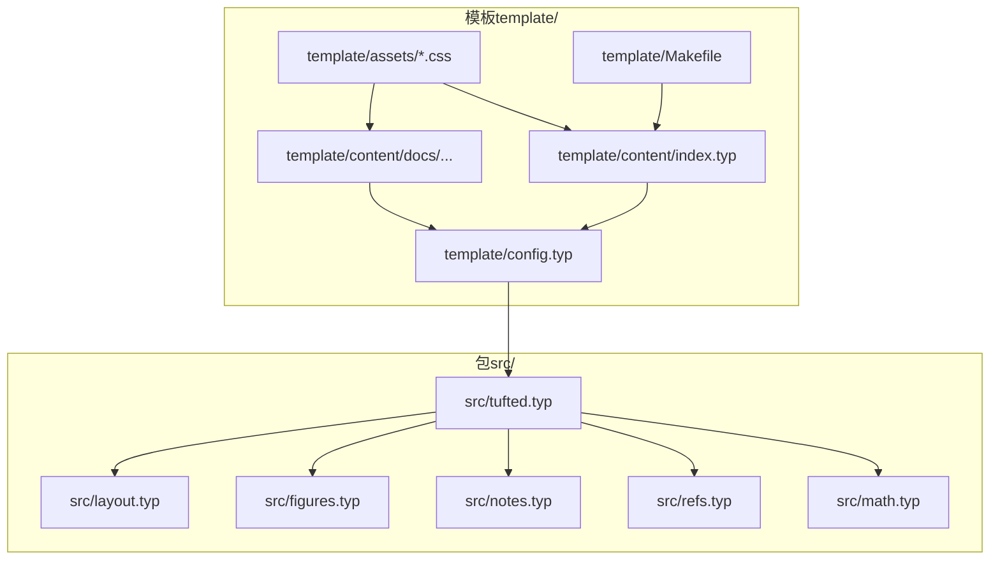
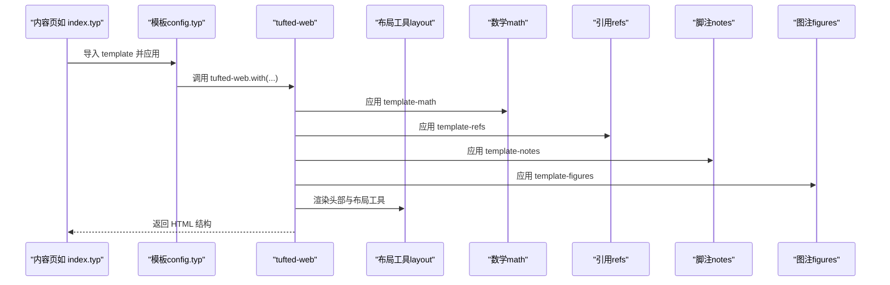
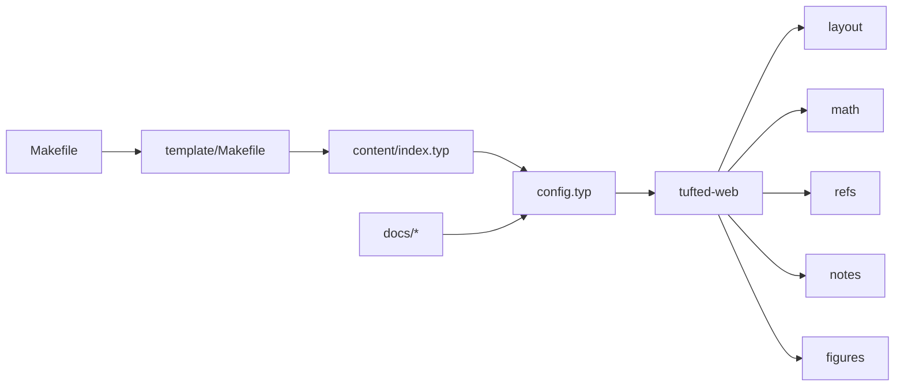

# API 参考

<cite>
**本文引用的文件**
- [src/tufted.typ](file://src/tufted.typ)
- [src/layout.typ](file://src/layout.typ)
- [src/math.typ](file://src/math.typ)
- [src/notes.typ](file://src/notes.typ)
- [src/figures.typ](file://src/figures.typ)
- [src/refs.typ](file://src/refs.typ)
- [template/config.typ](file://template/config.typ)
- [template/content/index.typ](file://template/content/index.typ)
- [template/content/docs/02-configuration/index.typ](file://template/content/docs/02-configuration/index.typ)
- [template/content/docs/03-styling/index.typ](file://template/content/docs/03-styling/index.typ)
- [template/content/docs/embedding-markdown/index.typ](file://template/content/docs/embedding-markdown/index.typ)
- [template/assets/tufted.css](file://template/assets/tufted.css)
- [template/assets/custom.css](file://template/assets/custom.css)
- [Makefile](file://Makefile)
- [template/Makefile](file://template/Makefile)
- [typst.toml](file://typst.toml)
</cite>

## 目录
1. [简介](#简介)
2. [项目结构](#项目结构)
3. [核心组件](#核心组件)
4. [架构总览](#架构总览)
5. [详细组件分析](#详细组件分析)
6. [依赖关系分析](#依赖关系分析)
7. [性能与可用性考量](#性能与可用性考量)
8. [故障排查指南](#故障排查指南)
9. [结论](#结论)
10. [附录：配置与迁移](#附录配置与迁移)

## 简介
本文件为 TwilightPage（基于 tufted 模板）的完整 API 参考，聚焦以下目标：
- 记录 tufted-web 主模板函数的全部公共接口、参数与返回行为
- 说明布局工具函数 margin-note 与 full-width 的接口规范与调用约定
- 解释内容处理模块（数学、脚注、图注、引用）的 API 扩展点与行为
- 提供配置对象字段说明、默认值与最佳实践
- 给出典型调用示例路径与错误处理建议
- 说明钩子与扩展点的使用方法，并给出版本兼容性与迁移指引

## 项目结构
该仓库采用“包（package）+ 模板（template）”双层结构：
- 包（src/）：定义可复用的模板函数与内容处理模块
- 模板（template/）：示例站点与构建配置，演示如何导入并定制包中的函数

图表来源
- [src/tufted.typ:1-64](file://src/tufted.typ#L1-L64)
- [src/layout.typ:1-13](file://src/layout.typ#L1-L13)
- [src/math.typ:1-22](file://src/math.typ#L1-L22)
- [src/notes.typ:1-27](file://src/notes.typ#L1-L27)
- [src/figures.typ:1-20](file://src/figures.typ#L1-L20)
- [src/refs.typ:1-23](file://src/refs.typ#L1-L23)
- [template/config.typ:1-12](file://template/config.typ#L1-L12)
- [template/content/index.typ:1-33](file://template/content/index.typ#L1-L33)
- [template/assets/tufted.css:1-166](file://template/assets/tufted.css#L1-L166)
- [template/Makefile:1-27](file://template/Makefile#L1-L27)

章节来源
- [typst.toml:1-19](file://typst.toml#L1-L19)
- [Makefile:1-60](file://Makefile#L1-L60)
- [template/Makefile:1-27](file://template/Makefile#L1-L27)

## 核心组件
本节概述所有公开 API 的职责与交互关系。

- tufted-web：主模板函数，负责生成 HTML 页面骨架、注入样式表、设置语言、渲染头部导航与正文内容。
- 布局工具：margin-note、full-width，用于在边注或全宽区域放置内容。
- 内容处理模块：template-math、template-refs、template-notes、template-figures，分别处理数学公式、引用、脚注与图注。
- 配置对象：通过 config.typ 中的 template 定义，传入 tufted-web 的定制化参数。

章节来源
- [src/tufted.typ:17-63](file://src/tufted.typ#L17-L63)
- [src/layout.typ:3-12](file://src/layout.typ#L3-L12)
- [src/math.typ:1-22](file://src/math.typ#L1-L22)
- [src/refs.typ:1-23](file://src/refs.typ#L1-L23)
- [src/notes.typ:1-27](file://src/notes.typ#L1-L27)
- [src/figures.typ:1-20](file://src/figures.typ#L1-L20)
- [template/config.typ:3-11](file://template/config.typ#L3-L11)

## 架构总览
下图展示页面构建时的调用链与数据流：

图表来源
- [template/content/index.typ:1-33](file://template/content/index.typ#L1-L33)
- [template/config.typ:3-11](file://template/config.typ#L3-L11)
- [src/tufted.typ:17-63](file://src/tufted.typ#L17-L63)
- [src/layout.typ:3-12](file://src/layout.typ#L3-L12)
- [src/math.typ:1-22](file://src/math.typ#L1-L22)
- [src/refs.typ:1-23](file://src/refs.typ#L1-L23)
- [src/notes.typ:1-27](file://src/notes.typ#L1-L27)
- [src/figures.typ:1-20](file://src/figures.typ#L1-L20)

## 详细组件分析

### 函数：tufted-web
- 作用：生成完整的 HTML 页面，包含 head（meta、title、css）、body（header、article.section）。
- 参数（均支持命名传参）：
  - header-links: none 或键值对序列，用于生成顶部导航；默认 none
  - title: 页面标题字符串；默认 "Tufted"
  - lang: 页面语言代码；默认 "en"
  - css: 样式表数组（URL 或路径）；默认加载 tufte-css 与本地样式
  - content: 页面主体内容（Typst 显示项）
- 返回：HTML 文档树（由内部 html.* 组合生成）
- 行为要点：
  - 自动注入 viewport meta、charset
  - 循环输出 css 数组为 link 标签
  - 将 content 放入 article > section
  - 通过 show 语句挂载各内容处理模块
- 错误处理与边界：
  - header-links 为 none 时不渲染导航
  - 若 css 数组为空，仍会生成 head，但不附加样式表链接
  - lang 影响文本语言设置与 HTML lang 属性

章节来源
- [src/tufted.typ:17-63](file://src/tufted.typ#L17-L63)
- [template/config.typ:3-11](file://template/config.typ#L3-L11)

### 函数：margin-note
- 作用：将内容放入边注容器（类名 marginnote），用于侧边注释或补充说明。
- 参数：
  - content: 要放入边注的内容
- 返回：HTML span 元素，带 class="marginnote"
- 调用约定：
  - 通常配合 tufted-web 使用，作为页面内容的一部分
  - 在窄屏设备上按 CSS 规则自动调整显示方式
- 示例路径：
  - [template/content/index.typ:7-14](file://template/content/index.typ#L7-L14)

章节来源
- [src/layout.typ:3-5](file://src/layout.typ#L3-L5)
- [template/content/index.typ:7-14](file://template/content/index.typ#L7-L14)
- [template/assets/tufted.css:30-55](file://template/assets/tufted.css#L30-L55)

### 函数：full-width
- 作用：将内容放入全宽容器（类名 fullwidth），用于需要横向铺满的元素。
- 参数：
  - content: 要放入全宽的内容
- 返回：HTML div 元素，带 class="fullwidth"
- 调用约定：
  - 适用于需要突破常规宽度限制的区块
  - 默认样式中未提供 fullwidth 的专用规则，需自定义 CSS

章节来源
- [src/layout.typ:10-12](file://src/layout.typ#L10-L12)
- [template/assets/tufted.css:1-166](file://template/assets/tufted.css#L1-L166)

### 模块：template-math（数学）
- 作用：统一处理内联与块级数学公式，按目标格式（HTML）输出相应结构。
- 关键行为：
  - 设置公式编号格式
  - 对内联公式包裹 role="math" 的 span
  - 对块级公式包裹 role="math" 的 figure
- 扩展点：
  - 可通过外部数学引擎（如 mitex）与 cmarker 协作，实现 Markdown 中数学的渲染
- 示例路径：
  - [template/content/docs/embedding-markdown/index.typ:10-27](file://template/content/docs/embedding-markdown/index.typ#L10-L27)

章节来源
- [src/math.typ:1-22](file://src/math.typ#L1-L22)
- [template/content/docs/embedding-markdown/index.typ:10-27](file://template/content/docs/embedding-markdown/index.typ#L10-L27)

### 模块：template-refs（引用）
- 作用：重写引用渲染逻辑，增强方程等元素的引用显示。
- 关键行为：
  - 当引用目标为方程时，使用编号与链接跳转
  - 当引用目标为标题时，进行引号包装
- 扩展点：
  - 可根据元素类型自定义渲染策略
- 示例路径：
  - [template/content/docs/embedding-markdown/index.typ:16-27](file://template/content/docs/embedding-markdown/index.typ#L16-L27)

章节来源
- [src/refs.typ:1-23](file://src/refs.typ#L1-L23)

### 模块：template-notes（脚注）
- 作用：将脚注编号与脚注内容分别渲染为主文中的上标引用与边注区域。
- 关键行为：
  - 生成脚注引用的上标链接与反向锚点
  - 在边注区域渲染脚注内容，并建立双向跳转
- 扩展点：
  - 可自定义脚注编号显示与样式
- 示例路径：
  - [template/content/blog/2024-10-04-iterators-generators/index.typ:6-40](file://template/content/blog/2024-10-04-iterators-generators/index.typ#L6-L40)

章节来源
- [src/notes.typ:1-27](file://src/notes.typ#L1-L27)
- [template/content/blog/2024-10-04-iterators-generators/index.typ:6-40](file://template/content/blog/2024-10-04-iterators-generators/index.typ#L6-L40)

### 模块：template-figures（图注）
- 作用：重写 figure 与其 caption 的渲染，使 caption 使用 marginnote 类样式。
- 关键行为：
  - 将 caption 渲染为带 marginnote 类的 span
  - 将 figure 本身渲染为 HTML figure
- 扩展点：
  - 可进一步自定义 figure 的 HTML 结构与样式
- 示例路径：
  - [template/content/blog/2024-10-04-iterators-generators/index.typ:46](file://template/content/blog/2024-10-04-iterators-generators/index.typ#L46)

章节来源
- [src/figures.typ:1-20](file://src/figures.typ#L1-L20)
- [template/content/blog/2024-10-04-iterators-generators/index.typ:46](file://template/content/blog/2024-10-04-iterators-generators/index.typ#L46)

### 配置对象与默认值
- 来源：template/config.typ 中的 template 定义
- 字段（均可通过 .with(...) 覆盖）：
  - header-links: none 或键值对序列，默认 none
  - title: 字符串，默认 "Tufted"
  - lang: 字符串，默认 "en"
  - css: 数组，默认包含 tufte-css 与本地样式
- 使用方式：
  - 在 config.typ 中导入包并以 .with(...) 传参
  - 在内容页中通过 #show: template 或 template.with(...) 应用
- 示例路径：
  - [template/config.typ:3-11](file://template/config.typ#L3-L11)
  - [template/content/docs/02-configuration/index.typ:26-39](file://template/content/docs/02-configuration/index.typ#L26-L39)

章节来源
- [template/config.typ:3-11](file://template/config.typ#L3-L11)
- [template/content/docs/02-configuration/index.typ:26-39](file://template/content/docs/02-configuration/index.typ#L26-L39)

### 样式与主题
- 默认样式表：
  - tufte-css（CDN）
  - /assets/tufted.css
  - /assets/custom.css（最后加载，优先级最高）
- 自定义建议：
  - 修改 template/assets/custom.css 以覆盖默认样式
  - 注意移动端与高对比度模式下的适配
- 示例路径：
  - [template/content/docs/03-styling/index.typ:8-21](file://template/content/docs/03-styling/index.typ#L8-L21)
  - [template/content/docs/03-styling/index.typ:35-43](file://template/content/docs/03-styling/index.typ#L35-L43)
  - [template/assets/tufted.css:1-166](file://template/assets/tufted.css#L1-L166)
  - [template/assets/custom.css:1](file://template/assets/custom.css#L1-L1)

章节来源
- [template/content/docs/03-styling/index.typ:8-21](file://template/content/docs/03-styling/index.typ#L8-L21)
- [template/content/docs/03-styling/index.typ:35-43](file://template/content/docs/03-styling/index.typ#L35-L43)
- [template/assets/tufted.css:1-166](file://template/assets/tufted.css#L1-L166)
- [template/assets/custom.css:1](file://template/assets/custom.css#L1-L1)

### 钩子与扩展点
- tufted-web 通过 show 语句挂载内容处理模块，形成“钩子式”的内容改写链路。
- 可扩展点：
  - 在 config.typ 中以 .with(...) 覆盖默认参数
  - 在内容页中以 template.with(...) 临时覆盖
  - 通过自定义 CSS 扩展布局与视觉表现
- 示例路径：
  - [src/tufted.typ:29-32](file://src/tufted.typ#L29-L32)
  - [template/content/docs/02-configuration/index.typ:49-52](file://template/content/docs/02-configuration/index.typ#L49-L52)

章节来源
- [src/tufted.typ:29-32](file://src/tufted.typ#L29-L32)
- [template/content/docs/02-configuration/index.typ:49-52](file://template/content/docs/02-configuration/index.typ#L49-L52)

## 依赖关系分析
- 包内依赖：
  - tufted-web 依赖 layout、math、refs、notes、figures 模块
  - layout 提供 margin-note 与 full-width
- 模板依赖：
  - config.typ 导入包并导出 template
  - 内容页导入 config.typ 并应用 template
- 构建依赖：
  - template/Makefile 负责编译 .typ 到 HTML
  - 顶层 Makefile 提供本地开发与打包流程

图表来源
- [src/tufted.typ:1-5](file://src/tufted.typ#L1-L5)
- [src/layout.typ:1-13](file://src/layout.typ#L1-L13)
- [src/math.typ:1-22](file://src/math.typ#L1-L22)
- [src/refs.typ:1-23](file://src/refs.typ#L1-L23)
- [src/notes.typ:1-27](file://src/notes.typ#L1-L27)
- [src/figures.typ:1-20](file://src/figures.typ#L1-L20)
- [template/config.typ:1-11](file://template/config.typ#L1-L11)
- [template/content/index.typ:1-33](file://template/content/index.typ#L1-L33)
- [template/Makefile:1-27](file://template/Makefile#L1-L27)
- [Makefile:1-60](file://Makefile#L1-L60)

章节来源
- [src/tufted.typ:1-5](file://src/tufted.typ#L1-L5)
- [template/config.typ:1-11](file://template/config.typ#L1-L11)
- [template/Makefile:1-27](file://template/Makefile#L1-L27)
- [Makefile:1-60](file://Makefile#L1-L60)

## 性能与可用性考量
- 样式加载顺序：默认样式按顺序加载，自定义样式位于末尾，便于覆盖
- 移动端体验：CSS 已针对窄屏做边注内联与断词处理
- 构建效率：template/Makefile 使用模式规则批量编译，避免重复工作
- 建议：
  - 合理拆分内容，减少单页体积
  - 复用布局工具与内容模块，保持一致性

[本节为通用指导，无需特定文件引用]

## 故障排查指南
- 页面无样式或样式异常
  - 检查 css 数组是否正确传入
  - 确认 /assets/custom.css 是否存在且加载顺序合理
  - 参考：[template/content/docs/03-styling/index.typ:8-21](file://template/content/docs/03-styling/index.typ#L8-L21)
- 边注不显示或错位
  - 确认 margin-note 的使用位置与 CSS 类名一致
  - 参考：[src/layout.typ:3-5](file://src/layout.typ#L3-L5)，[template/assets/tufted.css:30-55](file://template/assets/tufted.css#L30-L55)
- 脚注无法跳转
  - 检查脚注编号与锚点 ID 是否匹配
  - 参考：[src/notes.typ:1-27](file://src/notes.typ#L1-L27)
- 数学公式未渲染
  - 确保已启用 template-math，并在需要时引入数学引擎
  - 参考：[src/math.typ:1-22](file://src/math.typ#L1-L22)，[template/content/docs/embedding-markdown/index.typ:10-27](file://template/content/docs/embedding-markdown/index.typ#L10-L27)
- 构建失败
  - 使用 template/Makefile 编译单个文件定位问题
  - 参考：[template/Makefile:14-16](file://template/Makefile#L14-L16)

章节来源
- [template/content/docs/03-styling/index.typ:8-21](file://template/content/docs/03-styling/index.typ#L8-L21)
- [src/layout.typ:3-5](file://src/layout.typ#L3-L5)
- [template/assets/tufted.css:30-55](file://template/assets/tufted.css#L30-L55)
- [src/notes.typ:1-27](file://src/notes.typ#L1-L27)
- [src/math.typ:1-22](file://src/math.typ#L1-L22)
- [template/content/docs/embedding-markdown/index.typ:10-27](file://template/content/docs/embedding-markdown/index.typ#L10-L27)
- [template/Makefile:14-16](file://template/Makefile#L14-L16)

## 结论
- tufted-web 提供了简洁而强大的页面骨架与内容处理管线
- 布局工具与内容模块以模块化方式组合，便于扩展与定制
- 通过 config.typ 与 template.with(...) 实现灵活的配置与继承
- 建议在保持默认样式的前提下，仅在 custom.css 中进行增量修改

[本节为总结，无需特定文件引用]

## 附录：配置与迁移

### 版本与兼容性
- 包版本：0.1.1
- 编译器要求：0.14.0
- 包入口：src/tufted.typ
- 模板入口：template/config.typ

章节来源
- [typst.toml:1-19](file://typst.toml#L1-L19)

### 迁移指南（从旧版本到 0.1.1）
- 若此前未显式指定 css，请检查默认样式数组是否满足需求
  - 参考：[src/tufted.typ:21-25](file://src/tufted.typ#L21-L25)
- 若使用自定义样式，请确认其加载顺序与覆盖策略
  - 参考：[template/content/docs/03-styling/index.typ:23-24](file://template/content/docs/03-styling/index.typ#L23-L24)
- 若引用行为发生变化，请检查 template-refs 的重写逻辑
  - 参考：[src/refs.typ:1-23](file://src/refs.typ#L1-L23)

章节来源
- [src/tufted.typ:21-25](file://src/tufted.typ#L21-L25)
- [template/content/docs/03-styling/index.typ:23-24](file://template/content/docs/03-styling/index.typ#L23-L24)
- [src/refs.typ:1-23](file://src/refs.typ#L1-L23)

### 常用调用示例（路径）
- 在内容页中应用模板并覆盖标题
  - [template/content/docs/02-configuration/index.typ:49-52](file://template/content/docs/02-configuration/index.typ#L49-L52)
- 在首页中插入边注
  - [template/content/index.typ:7-14](file://template/content/index.typ#L7-L14)
- 在文章中插入脚注
  - [template/content/blog/2024-10-04-iterators-generators/index.typ:6-40](file://template/content/blog/2024-10-04-iterators-generators/index.typ#L6-L40)
- 在文章中插入图片与图注
  - [template/content/blog/2024-10-04-iterators-generators/index.typ:46](file://template/content/blog/2024-10-04-iterators-generators/index.typ#L46)
- 在文档中嵌入 Markdown 并渲染数学
  - [template/content/docs/embedding-markdown/index.typ:10-27](file://template/content/docs/embedding-markdown/index.typ#L10-L27)

章节来源
- [template/content/docs/02-configuration/index.typ:49-52](file://template/content/docs/02-configuration/index.typ#L49-L52)
- [template/content/index.typ:7-14](file://template/content/index.typ#L7-L14)
- [template/content/blog/2024-10-04-iterators-generators/index.typ:6-40](file://template/content/blog/2024-10-04-iterators-generators/index.typ#L6-L40)
- [template/content/blog/2024-10-04-iterators-generators/index.typ:46](file://template/content/blog/2024-10-04-iterators-generators/index.typ#L46)
- [template/content/docs/embedding-markdown/index.typ:10-27](file://template/content/docs/embedding-markdown/index.typ#L10-L27)