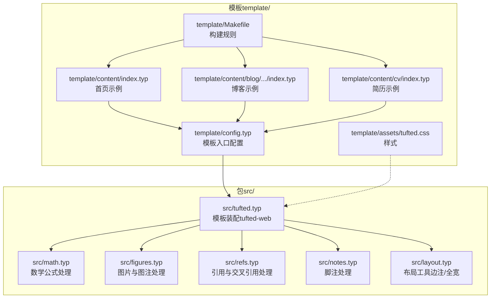
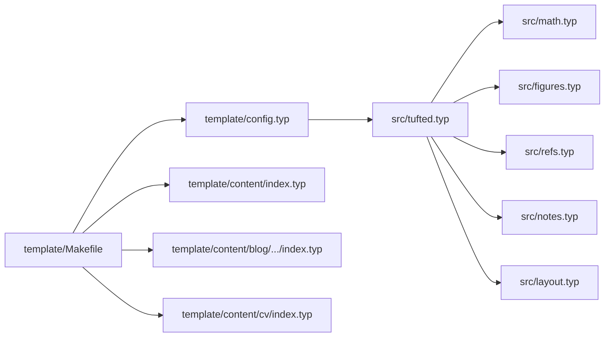

# 内容处理 API

<cite>
**本文引用的文件**
- [src/math.typ](file://src/math.typ)
- [src/figures.typ](file://src/figures.typ)
- [src/refs.typ](file://src/refs.typ)
- [src/notes.typ](file://src/notes.typ)
- [src/layout.typ](file://src/layout.typ)
- [src/tufted.typ](file://src/tufted.typ)
- [template/config.typ](file://template/config.typ)
- [template/content/index.typ](file://template/content/index.typ)
- [template/content/blog/2024-10-04-iterators-generators/index.typ](file://template/content/blog/2024-10-04-iterators-generators/index.typ)
- [template/content/docs/01-quick-start/index.typ](file://template/content/docs/01-quick-start/index.typ)
- [template/content/cv/index.typ](file://template/content/cv/index.typ)
- [template/assets/tufted.css](file://template/assets/tufted.css)
- [template/assets/custom.css](file://template/assets/custom.css)
- [template/Makefile](file://template/Makefile)
- [Makefile](file://Makefile)
- [typst.toml](file://typst.toml)
</cite>

## 目录
1. [简介](#简介)
2. [项目结构](#项目结构)
3. [核心组件](#核心组件)
4. [架构总览](#架构总览)
5. [详细组件分析](#详细组件分析)
6. [依赖关系分析](#依赖关系分析)
7. [性能考虑](#性能考虑)
8. [故障排查指南](#故障排查指南)
9. [结论](#结论)
10. [附录](#附录)

## 简介
本文件为 TwilightPage（Tufted）内容处理模块的综合 API 参考与技术指南。重点覆盖以下内容处理能力：
- 数学公式渲染与编号：支持行内与块级公式在 HTML 输出中的角色标注与样式适配。
- 图片与图注：统一图注展示、HTML 化图元素，并与边注系统协同。
- 引用与交叉引用：对公式、标题等元素进行智能引用转换与链接生成。
- 脚注：生成可交互的脚注引用与边注内容，支持 HTML 标记与锚点跳转。
- 布局工具：提供边注容器与全宽布局辅助函数，便于内容排版。
- 模板装配：通过 tufted-web 将上述处理模块组合为完整的网页输出。

本指南面向开发者与内容作者，提供接口规范、配置参数、处理流程、输出格式、扩展机制、示例与最佳实践，以及性能优化与错误处理建议。

## 项目结构
该仓库采用“包（package）+ 模板（template）”双层结构：
- 包（src/）：定义内容处理模块与模板装配逻辑，供模板或外部项目导入使用。
- 模板（template/）：提供示例站点与构建规则，演示如何使用包内的模块。



图表来源
- [src/tufted.typ:1-64](file://src/tufted.typ#L1-L64)
- [src/math.typ:1-22](file://src/math.typ#L1-L22)
- [src/figures.typ:1-20](file://src/figures.typ#L1-L20)
- [src/refs.typ:1-23](file://src/refs.typ#L1-L23)
- [src/notes.typ:1-27](file://src/notes.typ#L1-L27)
- [src/layout.typ:1-13](file://src/layout.typ#L1-L13)
- [template/config.typ:1-12](file://template/config.typ#L1-L12)
- [template/Makefile:1-27](file://template/Makefile#L1-L27)

章节来源
- [typst.toml:1-19](file://typst.toml#L1-L19)
- [Makefile:1-60](file://Makefile#L1-L60)
- [template/Makefile:1-27](file://template/Makefile#L1-L27)

## 核心组件
本节概述四个核心内容处理模块及其职责：
- 数学公式模块（math.typ）：控制公式编号、行内/块级渲染目标、HTML 角色标记。
- 图片与图注模块（figures.typ）：重写图注显示与图元素 HTML 化，配合边注样式。
- 引用与交叉引用模块（refs.typ）：将公式、标题等元素转换为可点击链接，保留默认回退。
- 脚注模块（notes.typ）：生成脚注引用上标与边注内容，维护主文与脚注之间的锚点关联。
- 布局工具（layout.typ）：提供边注与全宽容器，用于内容排版与响应式样式衔接。
- 模板装配（tufted.typ）：聚合上述模块，注入语言、样式表、头部导航，输出完整的 HTML 文档。

章节来源
- [src/math.typ:1-22](file://src/math.typ#L1-L22)
- [src/figures.typ:1-20](file://src/figures.typ#L1-L20)
- [src/refs.typ:1-23](file://src/refs.typ#L1-L23)
- [src/notes.typ:1-27](file://src/notes.typ#L1-L27)
- [src/layout.typ:1-13](file://src/layout.typ#L1-L13)
- [src/tufted.typ:1-64](file://src/tufted.typ#L1-L64)

## 架构总览
下图展示了从模板配置到页面渲染的整体流程：模板入口加载包内模块，应用样式与语言设置，最终输出 HTML 文档。

```mermaid
sequenceDiagram
participant Tpl as "模板入口<br/>template/config.typ"
participant Pack as "包模块<br/>src/tufted.typ"
participant Math as "数学模块<br/>src/math.typ"
participant Fig as "图片模块<br/>src/figures.typ"
participant Ref as "引用模块<br/>src/refs.typ"
participant Note as "脚注模块<br/>src/notes.typ"
participant Layout as "布局工具<br/>src/layout.typ"
participant CSS as "样式表<br/>template/assets/tufted.css"
Tpl->>Pack : 导入并调用 tufted-web
Pack->>Math : 应用公式处理规则
Pack->>Fig : 应用图片/图注处理规则
Pack->>Ref : 应用引用处理规则
Pack->>Note : 应用脚注处理规则
Pack->>Layout : 使用边注/全宽容器
Pack->>CSS : 注入样式表
Pack-->>Tpl : 返回 HTML 文档树
```

图表来源
- [src/tufted.typ:17-63](file://src/tufted.typ#L17-L63)
- [src/math.typ:1-22](file://src/math.typ#L1-L22)
- [src/figures.typ:1-20](file://src/figures.typ#L1-L20)
- [src/refs.typ:1-23](file://src/refs.typ#L1-L23)
- [src/notes.typ:1-27](file://src/notes.typ#L1-L27)
- [src/layout.typ:1-13](file://src/layout.typ#L1-L13)
- [template/assets/tufted.css:1-166](file://template/assets/tufted.css#L1-L166)

## 详细组件分析

### 数学公式处理模块（math.typ）
- 接口与用途
  - 提供模板函数以包裹内容，实现：
    - 公式编号策略（默认编号格式）。
    - 行内公式与块级公式的差异化渲染：在 HTML 目标中分别使用语义角色标记。
- 关键行为
  - 编号：通过公式编号策略设定编号格式。
  - 渲染：根据目标类型（HTML 或其他）决定是否包裹为带角色的 HTML 容器。
  - 块级公式：在 HTML 中以独立图形容器呈现，便于样式控制。
- 配置参数
  - 编号策略：可通过公式编号策略自定义编号格式。
  - 目标检测：内部使用目标类型判断，仅在 HTML 目标中启用角色标记。
- 输出格式
  - HTML 目标：行内公式与块级公式分别被包装为带角色的 HTML 容器，便于样式与可访问性增强。
- 扩展机制
  - 可在模板中引入并应用该模块，或进一步定制编号策略与角色映射。
- 示例与最佳实践
  - 在需要强调数学表达的页面中启用该模块；保持编号一致性，避免跨页面编号冲突。
- 错误处理
  - 若未指定编号策略，默认采用模块内预设；若目标非 HTML，则直接透传内容。

章节来源
- [src/math.typ:1-22](file://src/math.typ#L1-L22)

### 图片与图注处理模块（figures.typ）
- 接口与用途
  - 重写图注显示：将图注补充文本、计数器与正文拼接为统一格式。
  - 重写图元素：在 HTML 目标中将图元素包装为语义化 HTML 容器。
- 关键行为
  - 图注：使用边注类名，确保与脚注系统一致的视觉与交互体验。
  - 图元素：在 HTML 目标中输出结构化图容器，便于样式控制与响应式图片处理。
- 配置参数
  - 依赖布局工具：使用边注容器以统一样式。
- 输出格式
  - HTML 目标：图注与图元素均被包装为带类名的 HTML 容器，便于 CSS 控制。
- 扩展机制
  - 可结合布局工具提供的全宽容器实现全宽图片展示。
- 示例与最佳实践
  - 图注应简洁明确；图片尺寸受全局样式限制，注意在窄屏下的可读性。
- 错误处理
  - 非 HTML 目标时，直接透传内容，不改变渲染。

章节来源
- [src/figures.typ:1-20](file://src/figures.typ#L1-L20)
- [src/layout.typ:1-13](file://src/layout.typ#L1-L13)

### 引用与交叉引用模块（refs.typ）
- 接口与用途
  - 统一引用显示：对不同类型的元素（如公式、标题）进行差异化处理。
  - 公式引用：将公式引用转换为可点击链接，并按当前公式计数器生成编号。
  - 标题引用：对标题引用使用引号包裹，提升可读性。
- 关键行为
  - 类型识别：通过元素函数类型判断是否为公式或标题。
  - 链接生成：为公式引用生成指向目标位置的链接，并应用编号策略。
  - 回退机制：无法识别的引用保持原样，保证兼容性。
- 配置参数
  - 公式编号策略：与数学模块共享，确保引用编号一致。
- 输出格式
  - HTML 目标：公式引用为可点击链接，标题引用为带引号的文本。
- 扩展机制
  - 可新增对其他元素类型的引用处理，遵循现有模式。
- 示例与最佳实践
  - 在长文档中优先使用交叉引用而非硬编码编号，提升可维护性。
- 错误处理
  - 未知元素类型时回退为原始引用，避免破坏文档结构。

章节来源
- [src/refs.typ:1-23](file://src/refs.typ#L1-L23)

### 脚注处理模块（notes.typ）
- 接口与用途
  - 主文脚注：生成上标形式的脚注引用，并建立锚点。
  - 边注脚注：在边栏区域输出脚注内容，支持主文与边注之间的双向跳转。
- 关键行为
  - 引用生成：计算脚注编号，生成主文中的上标链接与边注中的反向链接。
  - DOM 结构：在 HTML 目标中输出带类名与 ID 的元素，确保可访问性与交互。
- 配置参数
  - 计数器：使用内置脚注计数器生成编号。
- 输出格式
  - HTML 目标：主文脚注为上标链接，边注脚注为带编号与内容的容器。
- 扩展机制
  - 可通过自定义样式增强脚注高亮与过渡效果。
- 示例与最佳实践
  - 脚注内容不宜过长；在窄屏设备上，边注会自动改为块级显示，确保可读性。
- 错误处理
  - 非 HTML 目标时，直接透传内容，不改变渲染。

章节来源
- [src/notes.typ:1-27](file://src/notes.typ#L1-L27)

### 布局工具（layout.typ）
- 接口与用途
  - 边注容器：提供通用边注包装，用于脚注与图片说明等场景。
  - 全宽容器：提供全宽布局包装，便于大图或特殊内容展示。
- 关键行为
  - 类名标准化：统一使用边注类名，便于样式复用。
  - 全宽容器：为特定内容提供全宽展示能力。
- 输出格式
  - HTML 目标：输出带类名的容器元素。
- 扩展机制
  - 可在此基础上扩展更多布局容器（如居中、两列等）。
- 示例与最佳实践
  - 合理使用全宽容器，避免破坏整体排版节奏。
- 错误处理
  - 直接透传内容，无额外校验。

章节来源
- [src/layout.typ:1-13](file://src/layout.typ#L1-L13)

### 模板装配（tufted.typ）
- 接口与用途
  - 组合内容处理模块，注入语言、样式表、头部导航，输出完整的 HTML 文档。
- 关键行为
  - 模块装配：依次应用数学、引用、脚注、图片模块。
  - 样式注入：加载第三方与本地样式表。
  - 头部导航：根据传入链接列表生成导航条。
- 配置参数
  - header-links: 导航链接列表。
  - title: 页面标题。
  - lang: 文档语言。
  - css: 样式表数组（支持多源）。
  - content: 待渲染的内容树。
- 输出格式
  - HTML 文档：包含 head 与 body，head 中包含 meta、title 与 link 标签。
- 扩展机制
  - 可在模板中引入更多模块或自定义样式，实现个性化网站风格。
- 示例与最佳实践
  - 在模板入口中集中管理样式与导航，保持一致性。
- 错误处理
  - 参数缺失时使用默认值（如标题、语言），保证最小可用性。

章节来源
- [src/tufted.typ:17-63](file://src/tufted.typ#L17-L63)

## 依赖关系分析
- 模块依赖
  - tufted-web 依赖 math、refs、notes、figures 与 layout 模块。
  - 模块之间低耦合，通过 show 规则与计数器协作。
- 构建依赖
  - 模板 Makefile 依赖 Typst 编译器，将 .typ 文件编译为 .html。
  - 顶层 Makefile 提供链接与打包等辅助任务。



图表来源
- [src/tufted.typ:1-6](file://src/tufted.typ#L1-L6)
- [template/config.typ:1-12](file://template/config.typ#L1-L12)
- [template/Makefile:1-27](file://template/Makefile#L1-L27)

章节来源
- [src/tufted.typ:1-6](file://src/tufted.typ#L1-L6)
- [template/Makefile:1-27](file://template/Makefile#L1-L27)

## 性能考虑
- 编译性能
  - 使用模板 Makefile 并行编译多个 .typ 文件至 _site/，减少重复工作。
  - 通过链接本地包缓存（Makefile 提供多平台链接）加速开发迭代。
- 渲染性能
  - 数学公式与脚注在 HTML 目标中仅做轻量标记，避免复杂计算。
  - 图片与图注通过 CSS 控制尺寸与响应式行为，降低客户端脚本开销。
- 样式性能
  - 使用 CSS 变量与媒体查询实现响应式布局，减少重复样式。
  - 脚注高亮与过渡效果通过 CSS 实现，避免 JavaScript 干预。
- 最佳实践
  - 控制单页内容体量，避免过多公式与图片导致编译时间增长。
  - 合理拆分内容为多个 .typ 文件，利用模板 Makefile 的并行编译能力。

章节来源
- [template/Makefile:1-27](file://template/Makefile#L1-L27)
- [Makefile:1-60](file://Makefile#L1-L60)
- [template/assets/tufted.css:1-166](file://template/assets/tufted.css#L1-L166)

## 故障排查指南
- 数学公式未编号或编号异常
  - 检查是否正确应用数学模块；确认公式编号策略与引用模块一致。
- 图注未显示或样式异常
  - 确认图片模块已应用；检查边注类名与 CSS 是否匹配。
- 脚注引用无法跳转
  - 检查脚注编号生成与锚点 ID 是否一致；确认 HTML 目标中存在对应元素。
- 引用链接无效
  - 确认引用元素类型是否被支持；对于不支持的类型，引用将回退为原文。
- 样式未生效
  - 检查样式表加载顺序与路径；确认 CSS 类名与模块输出一致。
- 构建失败
  - 确认 Typst 编译器版本与特性标志；检查 Makefile 中的根目录与格式参数。

章节来源
- [src/math.typ:1-22](file://src/math.typ#L1-L22)
- [src/figures.typ:1-20](file://src/figures.typ#L1-L20)
- [src/notes.typ:1-27](file://src/notes.typ#L1-L27)
- [src/refs.typ:1-23](file://src/refs.typ#L1-L23)
- [template/assets/tufted.css:1-166](file://template/assets/tufted.css#L1-L166)
- [template/Makefile:14-16](file://template/Makefile#L14-L16)

## 结论
本指南系统梳理了 TwilightPage 的内容处理模块，明确了各模块的接口、配置、流程与输出格式，并提供了扩展与优化建议。通过模块化设计与模板装配，开发者可以灵活地组合数学、图片、引用与脚注处理能力，构建高质量的响应式网页内容。建议在实际项目中遵循统一的命名与样式约定，合理拆分内容与样式，以获得更佳的开发与维护体验。

## 附录

### 模块接口速查
- 数学公式模块
  - 输入：内容树
  - 行为：设置编号策略；在 HTML 目标中为行内/块级公式添加角色标记
  - 输出：带角色标记的公式容器
- 图片与图注模块
  - 输入：内容树
  - 行为：重写图注显示；在 HTML 目标中重写图元素
  - 输出：带类名的图注与图容器
- 引用与交叉引用模块
  - 输入：内容树
  - 行为：识别公式/标题引用并生成链接；其他引用回退
  - 输出：可点击链接或原文
- 脚注模块
  - 输入：内容树
  - 行为：生成主文脚注上标与边注内容；维护锚点
  - 输出：带类名与 ID 的脚注结构
- 布局工具
  - 输入：内容树
  - 行为：提供边注与全宽容器
  - 输出：带类名的容器元素
- 模板装配（tufted-web）
  - 输入：header-links, title, lang, css, content
  - 行为：应用上述模块；注入样式与头部导航
  - 输出：完整的 HTML 文档

章节来源
- [src/math.typ:1-22](file://src/math.typ#L1-L22)
- [src/figures.typ:1-20](file://src/figures.typ#L1-L20)
- [src/refs.typ:1-23](file://src/refs.typ#L1-L23)
- [src/notes.typ:1-27](file://src/notes.typ#L1-L27)
- [src/layout.typ:1-13](file://src/layout.typ#L1-L13)
- [src/tufted.typ:17-63](file://src/tufted.typ#L17-L63)

### 示例与最佳实践
- 示例页面
  - 首页：展示边注与 Markdown 内容渲染集成。
  - 博客文章：包含脚注、图片与代码块。
  - CV 页面：展示边注与参考文献加载。
- 最佳实践
  - 使用统一的边注容器与类名，确保样式一致性。
  - 对长公式与大图采用块级渲染与全宽布局，提升阅读体验。
  - 在窄屏设备上验证脚注与图注的显示效果。

章节来源
- [template/content/index.typ:1-33](file://template/content/index.typ#L1-L33)
- [template/content/blog/2024-10-04-iterators-generators/index.typ:1-53](file://template/content/blog/2024-10-04-iterators-generators/index.typ#L1-L53)
- [template/content/cv/index.typ:1-59](file://template/content/cv/index.typ#L1-L59)