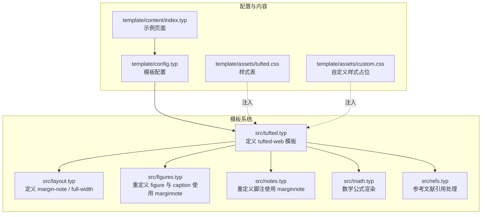
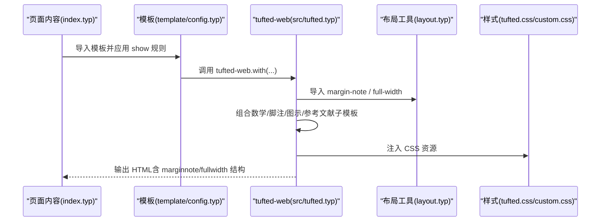
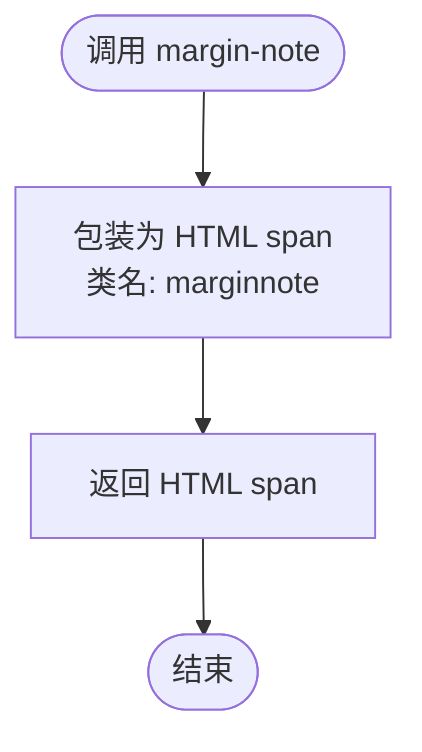
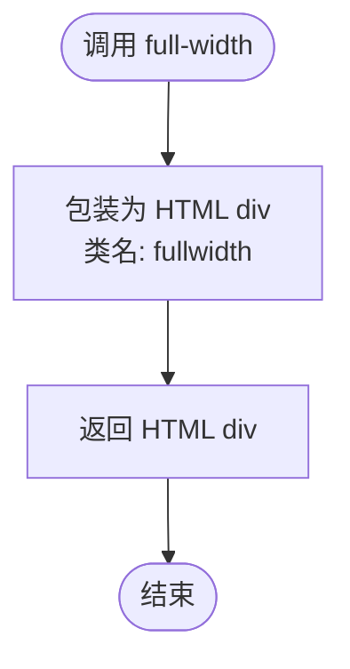
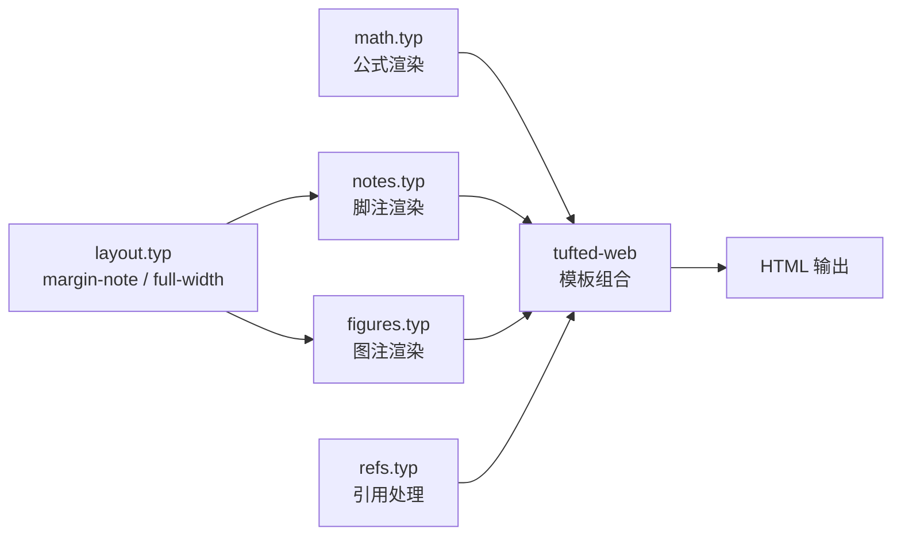
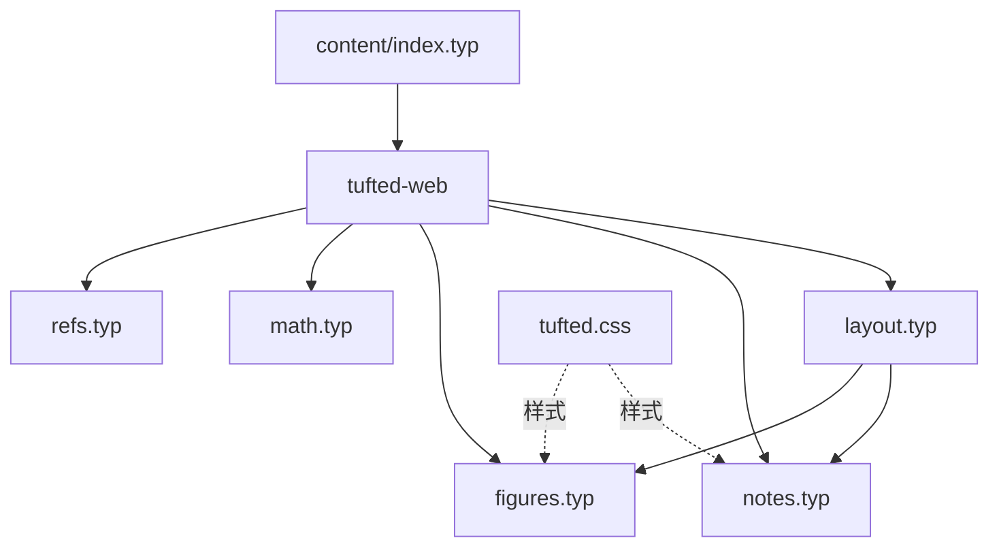

# 布局工具 API

<cite>
**本文引用的文件**
- [src/layout.typ](file://src/layout.typ)
- [src/tufted.typ](file://src/tufted.typ)
- [src/figures.typ](file://src/figures.typ)
- [src/notes.typ](file://src/notes.typ)
- [src/math.typ](file://src/math.typ)
- [src/refs.typ](file://src/refs.typ)
- [template/config.typ](file://template/config.typ)
- [template/content/index.typ](file://template/content/index.typ)
- [template/assets/tufted.css](file://template/assets/tufted.css)
- [template/assets/custom.css](file://template/assets/custom.css)
- [template/README.md](file://template/README.md)
</cite>

## 目录
1. [简介](#简介)
2. [项目结构](#项目结构)
3. [核心组件](#核心组件)
4. [架构总览](#架构总览)
5. [详细组件分析](#详细组件分析)
6. [依赖关系分析](#依赖关系分析)
7. [性能考量](#性能考量)
8. [故障排查指南](#故障排查指南)
9. [结论](#结论)
10. [附录](#附录)

## 简介
本文件为 Twentieth Page（简称“布局工具”）中布局函数的完整 API 参考文档，重点覆盖以下两个布局工具：
- margin-note：用于在边栏插入注记或辅助内容（如图片、说明文字等），支持响应式行为与交互高亮。
- full-width：用于包裹需要占据全宽的元素（例如大图、图表、公式块等），通过 CSS 类名实现视觉扩展。

文档将从接口规范、与主模板系统的集成方式、使用示例、内部实现原理、性能考虑以及常见布局模式与最佳实践等方面进行系统阐述，帮助内容创作者快速掌握并正确使用这些布局工具。

## 项目结构
布局工具位于 src 目录下的 layout.typ 文件中，并由模板系统统一导入与使用。模板系统通过 tufted-web 模板组合多个子模板（数学、脚注、参考文献、图示等），并在最终输出中注入 CSS 资源以实现 Tufte 风格的排版效果。

**图表来源**
- [src/tufted.typ:17-63](file://src/tufted.typ#L17-L63)
- [src/layout.typ:3-12](file://src/layout.typ#L3-L12)
- [src/figures.typ:1-19](file://src/figures.typ#L1-L19)
- [src/notes.typ:1-25](file://src/notes.typ#L1-L25)
- [src/math.typ:1-22](file://src/math.typ#L1-L22)
- [src/refs.typ:1-23](file://src/refs.typ#L1-L23)
- [template/config.typ:1-12](file://template/config.typ#L1-L12)
- [template/content/index.typ:1-33](file://template/content/index.typ#L1-L33)
- [template/assets/tufted.css:1-166](file://template/assets/tufted.css#L1-L166)
- [template/assets/custom.css:1-1](file://template/assets/custom.css#L1-L1)

**章节来源**
- [src/layout.typ:1-13](file://src/layout.typ#L1-L13)
- [src/tufted.typ:17-63](file://src/tufted.typ#L17-L63)
- [template/config.typ:1-12](file://template/config.typ#L1-L12)
- [template/content/index.typ:1-33](file://template/content/index.typ#L1-L33)
- [template/assets/tufted.css:1-166](file://template/assets/tufted.css#L1-L166)

## 核心组件
本节聚焦于两个布局工具函数的接口规范与行为特征。

- margin-note
  - 定义位置：src/layout.typ
  - 功能：将传入内容包装为带有 marginnote 类的 HTML 元素，用于在边栏显示注记或辅助信息。
  - 参数：content（任意内容）
  - 返回值：HTML span 元素，类名为 marginnote
  - 使用场景：脚注注释、图注说明、侧栏图片、补充说明等
  - 注意：当前未实现“全宽图示”功能；全宽图示需依赖 HTML figure 的类名设置能力或类型系统内省支持

- full-width
  - 定义位置：src/layout.typ
  - 功能：将传入内容包装为带有 fullwidth 类的 HTML div，用于视觉上扩展到页面宽度
  - 参数：content（任意内容）
  - 返回值：HTML div 元素，类名为 fullwidth
  - 使用场景：大图、图表、公式块、跨列内容等
  - 注意：当前仅作为占位实现，尚未绑定具体样式或行为；未来可结合 CSS 或类型系统扩展

**章节来源**
- [src/layout.typ:3-12](file://src/layout.typ#L3-L12)

## 架构总览
布局工具与模板系统的集成路径如下：
- 模板系统在 tufted-web 中导入布局工具（margin-note、full-width），并通过子模板（数学、脚注、图示、参考文献）共同作用于最终 HTML 输出。
- 页面内容通过 import 引入模板并应用 show 规则，最终生成带样式的 HTML。
- 样式层通过 tufte.css 与自定义 CSS 注入，实现响应式布局与交互高亮。

**图表来源**
- [template/content/index.typ:1-33](file://template/content/index.typ#L1-L33)
- [template/config.typ:1-12](file://template/config.typ#L1-L12)
- [src/tufted.typ:17-63](file://src/tufted.typ#L17-L63)
- [src/layout.typ:3-12](file://src/layout.typ#L3-L12)
- [template/assets/tufted.css:1-166](file://template/assets/tufted.css#L1-L166)
- [template/assets/custom.css:1-1](file://template/assets/custom.css#L1-L1)

## 详细组件分析

### margin-note 组件
- 接口规范
  - 名称：margin-note
  - 参数：content（任意内容）
  - 返回：HTML span，类名为 marginnote
  - 用途：在边栏显示注记或辅助内容
- 内部实现原理
  - 将传入内容封装为 HTML span，并赋予 marginnote 类，供 CSS 控制布局与交互
  - 子模板（脚注与图示）均通过该函数实现注记的边栏展示
- 与主模板系统集成
  - 在 tufted-web 中被导入并使用
  - 脚注模板与图示模板分别重写其渲染逻辑，使其在 HTML 目标下输出 marginnote 结构
- 使用示例
  - 页面中直接调用：见 template/content/index.typ 中的 margin-note 示例
  - 图注使用：见 src/figures.typ 中对 figure.caption 的重写
  - 脚注使用：见 src/notes.typ 中对 footnote 的重写

**图表来源**
- [src/layout.typ:3-5](file://src/layout.typ#L3-L5)

**章节来源**
- [src/layout.typ:3-5](file://src/layout.typ#L3-L5)
- [src/notes.typ:16-22](file://src/notes.typ#L16-L22)
- [src/figures.typ:4-8](file://src/figures.typ#L4-L8)
- [template/content/index.typ:7-14](file://template/content/index.typ#L7-L14)

### full-width 组件
- 接口规范
  - 名称：full-width
  - 参数：content（任意内容）
  - 返回：HTML div，类名为 fullwidth
  - 用途：使内容在视觉上扩展至页面宽度
- 内部实现原理
  - 将传入内容封装为 HTML div，并赋予 fullwidth 类
  - 当前未绑定具体样式或行为，仅为占位实现
- 与主模板系统集成
  - 在 tufted-web 中被导入，但未在任何子模板中直接使用
- 使用示例
  - 页面中可直接调用：见 template/content/index.typ 中的 margin-note 示例（full-width 同理）

**图表来源**
- [src/layout.typ:10-12](file://src/layout.typ#L10-L12)

**章节来源**
- [src/layout.typ:10-12](file://src/layout.typ#L10-L12)
- [template/content/index.typ:7-14](file://template/content/index.typ#L7-L14)

### 子模板与布局工具的关系
- 脚注模板（notes.typ）
  - 在 HTML 目标下，将脚注编号与正文中的脚注引用分别渲染为 marginnote 与边栏注释
- 图示模板（figures.typ）
  - 将 figure.caption 重写为 marginnote，实现图注在边栏显示
- 数学模板（math.typ）
  - 将行内与块级公式分别渲染为 span 或 figure，配合 CSS 实现数学排版
- 参考文献模板（refs.typ）
  - 对特定元素（如方程）的引用进行特殊处理

**图表来源**
- [src/layout.typ:3-12](file://src/layout.typ#L3-L12)
- [src/notes.typ:1-25](file://src/notes.typ#L1-L25)
- [src/figures.typ:1-19](file://src/figures.typ#L1-L19)
- [src/math.typ:1-22](file://src/math.typ#L1-L22)
- [src/refs.typ:1-23](file://src/refs.typ#L1-L23)
- [src/tufted.typ:17-63](file://src/tufted.typ#L17-L63)

**章节来源**
- [src/notes.typ:1-25](file://src/notes.typ#L1-L25)
- [src/figures.typ:1-19](file://src/figures.typ#L1-L19)
- [src/math.typ:1-22](file://src/math.typ#L1-L22)
- [src/refs.typ:1-23](file://src/refs.typ#L1-L23)
- [src/tufted.typ:17-63](file://src/tufted.typ#L17-L63)

## 依赖关系分析
- 布局工具依赖
  - layout.typ 提供 margin-note 与 full-width
  - tufted-web 导入并组合多个子模板
  - notes.typ 与 figures.typ 依赖 layout.typ 的 margin-note
- 样式依赖
  - tufted.css 提供 marginnote 的响应式布局与交互高亮
  - custom.css 为自定义样式预留占位
- 页面依赖
  - content/index.typ 展示了 margin-note 的典型用法

**图表来源**
- [src/layout.typ:3-12](file://src/layout.typ#L3-L12)
- [src/notes.typ:1-25](file://src/notes.typ#L1-L25)
- [src/figures.typ:1-19](file://src/figures.typ#L1-L19)
- [src/tufted.typ:17-63](file://src/tufted.typ#L17-L63)
- [template/assets/tufted.css:1-166](file://template/assets/tufted.css#L1-L166)
- [template/content/index.typ:1-33](file://template/content/index.typ#L1-L33)

**章节来源**
- [src/layout.typ:3-12](file://src/layout.typ#L3-L12)
- [src/notes.typ:1-25](file://src/notes.typ#L1-L25)
- [src/figures.typ:1-19](file://src/figures.typ#L1-L19)
- [src/tufted.typ:17-63](file://src/tufted.typ#L17-L63)
- [template/assets/tufted.css:1-166](file://template/assets/tufted.css#L1-L166)
- [template/content/index.typ:1-33](file://template/content/index.typ#L1-L33)

## 性能考量
- 渲染开销
  - margin-note 与 full-width 仅进行轻量的 HTML 包装，无复杂计算，开销极低
  - 子模板（notes、figures、math、refs）在 HTML 目标下进行条件判断与结构重写，整体仍为常数级开销
- 样式影响
  - marginnote 的响应式样式在窄屏下会将注记改为块级显示，避免溢出，提升可读性
  - 数学公式与图示的 CSS 处理不会增加额外渲染负担，主要影响布局与视觉
- 资源加载
  - tufted.css 通过 CDN 加载，建议确保网络可用；自定义样式按需添加，避免冗余规则

[本节为通用性能讨论，不直接分析具体文件，故无章节来源]

## 故障排查指南
- margin-note 未生效
  - 检查是否在 HTML 目标下渲染（子模板会在非 HTML 目标下跳过）
  - 确认 CSS 已正确注入（tufted-web 中的 css 列表）
- 注记未显示在边栏
  - 确认页面内容中已正确调用 margin-note
  - 检查浏览器是否禁用样式或缓存问题
- 全宽内容未扩展
  - 当前 full-width 为占位实现，尚未绑定具体样式；可自行在 custom.css 中添加对应规则
- 脚注与注记联动无效
  - 确保脚注引用与注记的 id 一致，且 HTML 结构正确

**章节来源**
- [src/notes.typ:1-25](file://src/notes.typ#L1-L25)
- [src/figures.typ:1-19](file://src/figures.typ#L1-L19)
- [src/tufted.typ:17-63](file://src/tufted.typ#L17-L63)
- [template/assets/tufted.css:1-166](file://template/assets/tufted.css#L1-L166)

## 结论
- margin-note 是布局工具的核心，广泛应用于脚注与图注的边栏展示，具备良好的响应式与交互体验
- full-width 目前为占位实现，建议在 custom.css 中补充样式以满足全宽需求
- 布局工具与子模板协同工作，形成完整的 HTML 输出链路
- 建议内容创作者优先使用 margin-note 实现注记与辅助信息的边栏展示，合理搭配图示与数学公式，构建清晰易读的页面布局

[本节为总结性内容，不直接分析具体文件，故无章节来源]

## 附录

### API 参考速查
- margin-note
  - 参数：content（任意内容）
  - 返回：HTML span（类名 marginnote）
  - 使用场景：脚注注释、图注说明、侧栏图片、补充说明
  - 示例路径：[template/content/index.typ:7-14](file://template/content/index.typ#L7-L14)
- full-width
  - 参数：content（任意内容）
  - 返回：HTML div（类名 fullwidth）
  - 使用场景：大图、图表、公式块、跨列内容
  - 示例路径：[template/content/index.typ:7-14](file://template/content/index.typ#L7-L14)

**章节来源**
- [src/layout.typ:3-12](file://src/layout.typ#L3-L12)
- [template/content/index.typ:7-14](file://template/content/index.typ#L7-L14)

### 常见布局模式与最佳实践
- 边栏注记模式
  - 使用 margin-note 放置脚注与图注，保持正文简洁
  - 在窄屏下自动转为块级显示，保证阅读体验
- 全宽内容模式
  - 对大图或公式块使用 full-width，增强视觉冲击力
  - 自定义 CSS 中为 fullwidth 添加合适的间距与对齐规则
- 与数学/图示/参考文献的组合
  - 数学公式与图示应遵循 Tufte 风格的简洁与留白原则
  - 参考文献引用应与正文编号一致，避免歧义

**章节来源**
- [src/notes.typ:1-25](file://src/notes.typ#L1-L25)
- [src/figures.typ:1-19](file://src/figures.typ#L1-L19)
- [src/math.typ:1-22](file://src/math.typ#L1-L22)
- [src/refs.typ:1-23](file://src/refs.typ#L1-L23)
- [template/assets/tufted.css:1-166](file://template/assets/tufted.css#L1-L166)