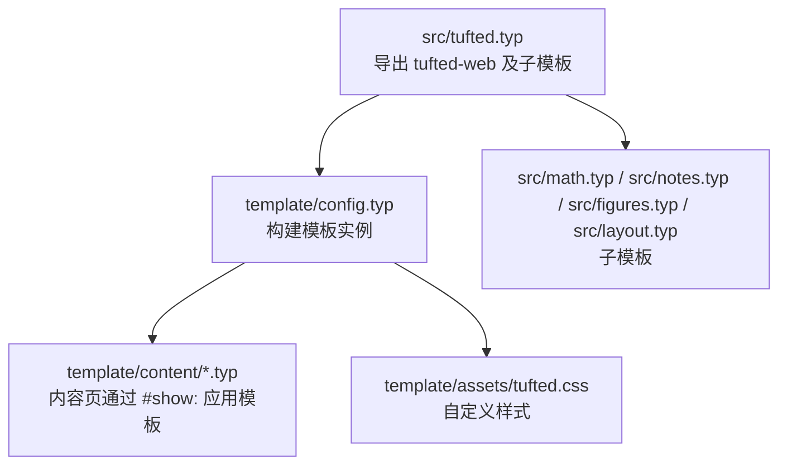
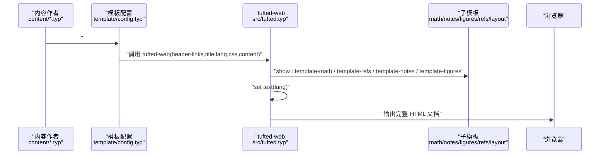
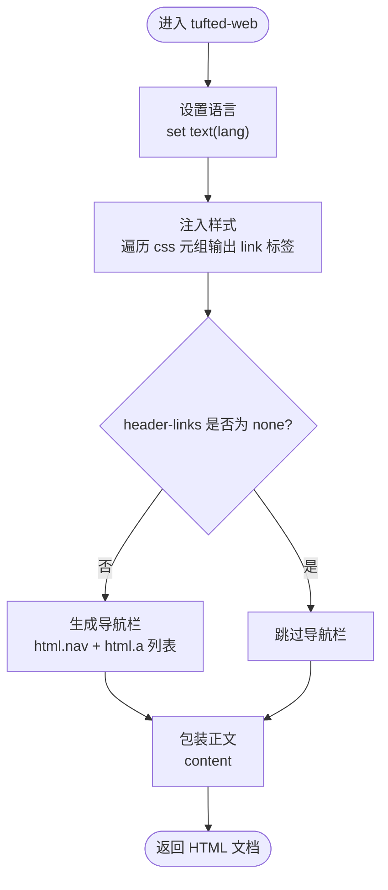
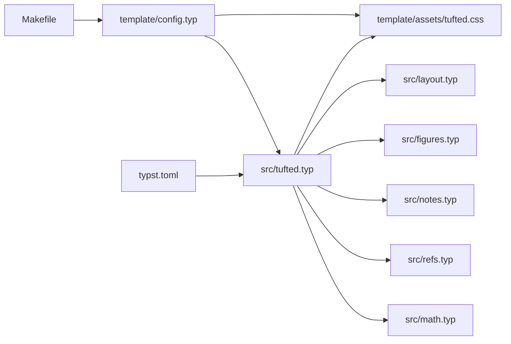

# 核心模板 API

<cite>
**本文引用的文件**
- [src/tufted.typ](file://src/tufted.typ)
- [src/layout.typ](file://src/layout.typ)
- [src/math.typ](file://src/math.typ)
- [src/refs.typ](file://src/refs.typ)
- [src/notes.typ](file://src/notes.typ)
- [src/figures.typ](file://src/figures.typ)
- [template/config.typ](file://template/config.typ)
- [template/content/index.typ](file://template/content/index.typ)
- [template/content/docs/01-quick-start/index.typ](file://template/content/docs/01-quick-start/index.typ)
- [template/content/blog/2024-10-04-iterators-generators/index.typ](file://template/content/blog/2024-10-04-iterators-generators/index.typ)
- [template/content/blog/2025-04-16-monkeys-apes/index.typ](file://template/content/blog/2025-04-16-monkeys-apes/index.typ)
- [template/assets/tufted.css](file://template/assets/tufted.css)
- [Makefile](file://Makefile)
- [typst.toml](file://typst.toml)
</cite>

## 目录
1. [简介](#简介)
2. [项目结构](#项目结构)
3. [核心组件](#核心组件)
4. [架构总览](#架构总览)
5. [详细组件分析](#详细组件分析)
6. [依赖关系分析](#依赖关系分析)
7. [性能考量](#性能考量)
8. [故障排查指南](#故障排查指南)
9. [结论](#结论)
10. [附录](#附录)

## 简介
本文件面向开发者与内容作者，系统化梳理 tufted 模板的核心 Web 模板函数 tufted-web 的 API 使用方式与内部机制。文档聚焦以下关键点：
- 函数签名与参数定义：header-links、title、lang、css、content 的类型、默认值与使用方法
- 调用语法与返回值结构（HTML 结构）
- 完整参数配置示例与常见使用场景
- 内部工作机制与数据流（模板管线、样式注入、导航栏生成）
- 错误处理与参数验证建议
- 为开发者提供准确的函数签名与使用指南

## 项目结构
该仓库采用“包入口 + 模板入口”的双层结构：
- 包入口位于 src/tufted.typ，导出 tufted-web 及其子模板（数学、脚注、图注等）
- 模板入口位于 template/config.typ，通过 tufted-web.with(...) 构建页面模板实例，并在各内容页通过 #show: 指令应用



图表来源
- [src/tufted.typ:17-63](file://src/tufted.typ#L17-L63)
- [template/config.typ:3-11](file://template/config.typ#L3-L11)

章节来源
- [src/tufted.typ:1-64](file://src/tufted.typ#L1-L64)
- [template/config.typ:1-12](file://template/config.typ#L1-L12)
- [typst.toml:15-19](file://typst.toml#L15-L19)

## 核心组件
本节对 tufted-web 的参数进行逐项说明，结合源码与示例文件给出类型、默认值、行为与用法。

- 函数名称
  - tufted-web

- 函数签名与参数
  - header-links: none 或键值对序列（每个元素为 (href: 字符串, title: 字符串)）
    - 默认值：none
    - 行为：当非 none 时，渲染导航栏；当为 none 时不渲染导航栏
    - 示例路径：[template/config.typ:4-9](file://template/config.typ#L4-L9)
  - title: 字符串
    - 默认值："Tufted"
    - 行为：设置页面标题与 head 中的 <title> 文本
    - 示例路径：[template/config.typ:10](file://template/config.typ#L10)
  - lang: 字符串
    - 默认值："en"
    - 行为：设置 html lang 属性与文本语言环境
    - 示例路径：[src/tufted.typ:34](file://src/tufted.typ#L34)
  - css: 元组（字符串列表），包含一个或多个 CSS 链接
    - 默认值：包含 Tufte CSS CDN 与本地样式文件
    - 行为：按顺序注入 <link rel="stylesheet"> 到 head
    - 示例路径：[src/tufted.typ:21-25](file://src/tufted.typ#L21-L25)
  - content: 必填内容块（Typst 内容表达式）
    - 默认值：无（必须显式传入）
    - 行为：作为文章主体内容插入到 <article><section>...</section></article> 中

- 返回值结构
  - 返回一个完整的 HTML 文档树，包含：
    - html/html(lang=lang)
    - head/meta(charset)/meta(viewport)/title/若干 link(rel="stylesheet", href=...)
    - body/header(可选)/article/section(content)

- 调用语法
  - 在模板入口中通过 tufted-web.with(...) 构建模板实例，再在内容页通过 #show: 应用
  - 示例路径：
    - [template/config.typ:3](file://template/config.typ#L3)
    - [template/content/index.typ:3](file://template/content/index.typ#L3)

章节来源
- [src/tufted.typ:17-63](file://src/tufted.typ#L17-L63)
- [template/config.typ:3-11](file://template/config.typ#L3-L11)
- [template/content/index.typ:1-33](file://template/content/index.typ#L1-L33)

## 架构总览
下图展示 tufted-web 的调用流程与内部数据流：



图表来源
- [src/tufted.typ:27-62](file://src/tufted.typ#L27-L62)
- [src/math.typ:1-22](file://src/math.typ#L1-L22)
- [src/refs.typ:1-23](file://src/refs.typ#L1-L23)
- [src/notes.typ:1-27](file://src/notes.typ#L1-L27)
- [src/figures.typ:1-20](file://src/figures.typ#L1-L20)
- [template/config.typ:3-11](file://template/config.typ#L3-L11)

## 详细组件分析

### 组件一：tufted-web 函数
- 作用
  - 作为 Web 页面的主模板，负责组织页面结构、注入样式、设置语言、渲染导航栏与正文内容
- 关键实现要点
  - 子模板装配：通过 show: 注入数学、参考文献、脚注、图注处理
  - 语言设置：set text(lang: lang)
  - 导航栏生成：基于 header-links 构造 <nav><a href=...>...</a></nav>，若为 none 则不渲染
  - 样式注入：遍历 css 元组，依次输出 <link rel="stylesheet" href=...>
  - 正文包装：将 content 放入 <article><section>...</section></article>
- 数据流
  - 输入：header-links、title、lang、css、content
  - 处理：子模板转换、语言设置、导航栏条件渲染、样式链接拼装
  - 输出：HTML 文档树



图表来源
- [src/tufted.typ:17-63](file://src/tufted.typ#L17-L63)

章节来源
- [src/tufted.typ:17-63](file://src/tufted.typ#L17-L63)

### 组件二：子模板与样式管线
- 数学模板（template-math）
  - 将内联与块级公式分别包裹为 span/figure 并保留 role 信息，便于样式与交互
  - 示例路径：[src/math.typ:1-22](file://src/math.typ#L1-L22)
- 引用模板（template-refs）
  - 对特定元素（如方程）重写引用显示，支持编号与定位
  - 示例路径：[src/refs.typ:1-23](file://src/refs.typ#L1-L23)
- 脚注模板（template-notes）
  - 将脚注编号与正文引用映射为上标链接，并在边注区渲染脚注内容
  - 示例路径：[src/notes.typ:1-27](file://src/notes.typ#L1-L27)
- 图注模板（template-figures）
  - 将 figure.caption 重写为边注样式，并在 HTML 中输出 figure 结构
  - 示例路径：[src/figures.typ:1-20](file://src/figures.typ#L1-L20)
- 布局工具（layout）
  - 提供 margin-note 与 full-width 辅助，用于边注与全宽布局
  - 示例路径：[src/layout.typ:1-13](file://src/layout.typ#L1-L13)
- 自定义样式（tufted.css）
  - 提供响应式布局、导航栏、脚注与边注、数学渲染等样式
  - 示例路径：[template/assets/tufted.css:1-166](file://template/assets/tufted.css#L1-L166)

```mermaid
classDiagram
class TuftedWeb {
+tufted-web(header-links,title,lang,css,content)
}
class MathTemplate {
+template-math(content)
}
class RefsTemplate {
+template-refs(content)
}
class NotesTemplate {
+template-notes(content)
}
class FiguresTemplate {
+template-figures(content)
}
class LayoutUtils {
+margin-note(content)
+full-width(content)
}
class CSS {
+"tufted.css"
}
TuftedWeb --> MathTemplate : "show : "
TuftedWeb --> RefsTemplate : "show : "
TuftedWeb --> NotesTemplate : "show : "
TuftedWeb --> FiguresTemplate : "show : "
TuftedWeb --> LayoutUtils : "使用"
TuftedWeb --> CSS : "注入样式"
```

图表来源
- [src/tufted.typ:27-33](file://src/tufted.typ#L27-L33)
- [src/math.typ:1-22](file://src/math.typ#L1-L22)
- [src/refs.typ:1-23](file://src/refs.typ#L1-L23)
- [src/notes.typ:1-27](file://src/notes.typ#L1-L27)
- [src/figures.typ:1-20](file://src/figures.typ#L1-L20)
- [src/layout.typ:1-13](file://src/layout.typ#L1-L13)
- [template/assets/tufted.css:1-166](file://template/assets/tufted.css#L1-L166)

章节来源
- [src/math.typ:1-22](file://src/math.typ#L1-L22)
- [src/refs.typ:1-23](file://src/refs.typ#L1-L23)
- [src/notes.typ:1-27](file://src/notes.typ#L1-L27)
- [src/figures.typ:1-20](file://src/figures.typ#L1-L20)
- [src/layout.typ:1-13](file://src/layout.typ#L1-L13)
- [template/assets/tufted.css:1-166](file://template/assets/tufted.css#L1-L166)

### 组件三：导航栏生成器 make-header
- 作用
  - 将 header-links 序列转换为导航条（仅在非 none 时渲染）
- 实现要点
  - 遍历 (href, title) 对，生成多个 <a href=...>title</a> 并放入 <nav>
- 示例路径：[src/tufted.typ:7-15](file://src/tufted.typ#L7-L15)

章节来源
- [src/tufted.typ:7-15](file://src/tufted.typ#L7-L15)

### 组件四：样式注入与语言设置
- 样式注入
  - 遍历 css 元组，输出多个 <link rel="stylesheet" href=...>，默认包含 Tufte CSS 与本地样式
  - 示例路径：[src/tufted.typ:46-48](file://src/tufted.typ#L46-L48)
- 语言设置
  - 设置根元素语言属性与文本语言环境
  - 示例路径：[src/tufted.typ:34](file://src/tufted.typ#L34)

章节来源
- [src/tufted.typ:34](file://src/tufted.typ#L34)
- [src/tufted.typ:46-48](file://src/tufted.typ#L46-L48)

### 组件五：内容页应用模板
- 模板实例化
  - 在模板入口通过 tufted-web.with(...) 构建模板实例，设置 header-links 与 title
  - 示例路径：[template/config.typ:3-11](file://template/config.typ#L3-L11)
- 内容页应用
  - 在内容页通过 #show: 应用模板实例，并传入具体 content
  - 示例路径：
    - [template/content/index.typ:1-3](file://template/content/index.typ#L1-L3)
    - [template/content/docs/01-quick-start/index.typ:1-2](file://template/content/docs/01-quick-start/index.typ#L1-L2)

章节来源
- [template/config.typ:3-11](file://template/config.typ#L3-L11)
- [template/content/index.typ:1-3](file://template/content/index.typ#L1-L3)
- [template/content/docs/01-quick-start/index.typ:1-2](file://template/content/docs/01-quick-start/index.typ#L1-L2)

## 依赖关系分析
- 包与模板入口
  - 包入口：src/tufted.typ
  - 模板入口：template/config.typ
- 子模板依赖
  - tufted-web 依赖 math/refs/notes/figures/layout 子模板
- 样式依赖
  - 默认样式来自 Tufte CSS CDN 与本地 tufted.css
- 构建与分发
  - 构建入口：Makefile 中的 html 目标
  - 包元数据：typst.toml



图表来源
- [src/tufted.typ:1-6](file://src/tufted.typ#L1-L6)
- [src/math.typ:1-22](file://src/math.typ#L1-L22)
- [src/refs.typ:1-23](file://src/refs.typ#L1-L23)
- [src/notes.typ:1-27](file://src/notes.typ#L1-L27)
- [src/figures.typ:1-20](file://src/figures.typ#L1-L20)
- [src/layout.typ:1-13](file://src/layout.typ#L1-L13)
- [template/config.typ:1-11](file://template/config.typ#L1-L11)
- [template/assets/tufted.css:1-166](file://template/assets/tufted.css#L1-L166)
- [Makefile:54-55](file://Makefile#L54-L55)
- [typst.toml:1-19](file://typst.toml#L1-L19)

章节来源
- [src/tufted.typ:1-6](file://src/tufted.typ#L1-L6)
- [template/config.typ:1-11](file://template/config.typ#L1-L11)
- [Makefile:54-55](file://Makefile#L54-L55)
- [typst.toml:1-19](file://typst.toml#L1-L19)

## 性能考量
- 样式加载
  - 默认样式包含外部 CDN 与本地样式，建议在生产环境中确保网络可用性或预缓存
- 渲染复杂度
  - 数学与脚注处理会增加 DOM 结构复杂度，建议在长文档中控制公式与脚注数量
- 构建效率
  - 使用 Makefile 的 html 目标批量编译，避免重复构建

## 故障排查指南
- 导航栏未显示
  - 检查 header-links 是否为 none；若为 none 将不会渲染导航栏
  - 参考路径：[src/tufted.typ:8-15](file://src/tufted.typ#L8-L15)
- 样式缺失
  - 确认 css 元组中的链接有效且可访问；默认包含 Tufte CSS 与本地样式
  - 参考路径：[src/tufted.typ:21-25](file://src/tufted.typ#L21-L25)
- 语言设置无效
  - 确认 lang 参数正确传入并被 set text 使用
  - 参考路径：[src/tufted.typ:34](file://src/tufted.typ#L34)
- 数学或脚注显示异常
  - 检查子模板是否正确装配（show: template-math / template-refs / template-notes / template-figures）
  - 参考路径：[src/tufted.typ:29-32](file://src/tufted.typ#L29-L32)
- 构建失败
  - 确认 Makefile 中的 html 目标与模板入口路径一致
  - 参考路径：[Makefile:54-55](file://Makefile#L54-L55)

章节来源
- [src/tufted.typ:8-15](file://src/tufted.typ#L8-L15)
- [src/tufted.typ:21-25](file://src/tufted.typ#L21-L25)
- [src/tufted.typ:34](file://src/tufted.typ#L34)
- [src/tufted.typ:29-32](file://src/tufted.typ#L29-L32)
- [Makefile:54-55](file://Makefile#L54-L55)

## 结论
tufted-web 提供了简洁而强大的 Web 模板能力：以少量参数即可完成页面结构、样式与导航的统一配置，并通过子模板扩展数学、脚注、图注等功能。开发者应重点关注参数的类型与默认值、样式链路与语言设置，以及在内容页正确应用模板实例。遵循本文的参数说明与示例路径，可快速搭建高质量静态网站。

## 附录

### 参数速查表
- header-links
  - 类型：none 或键值对序列
  - 默认值：none
  - 说明：非 none 时渲染导航栏
  - 示例路径：[template/config.typ:4-9](file://template/config.typ#L4-L9)
- title
  - 类型：字符串
  - 默认值："Tufted"
  - 说明：设置页面标题
  - 示例路径：[template/config.typ:10](file://template/config.typ#L10)
- lang
  - 类型：字符串
  - 默认值："en"
  - 说明：设置 html lang 与文本语言
  - 示例路径：[src/tufted.typ:34](file://src/tufted.typ#L34)
- css
  - 类型：元组（字符串列表）
  - 默认值：包含 Tufte CSS CDN 与本地样式
  - 说明：按序注入样式表
  - 示例路径：[src/tufted.typ:21-25](file://src/tufted.typ#L21-L25)
- content
  - 类型：内容块
  - 默认值：无（必填）
  - 说明：正文内容，将被包装为 article/section
  - 示例路径：[src/tufted.typ:26](file://src/tufted.typ#L26)

### 常见使用场景
- 博客首页
  - 在模板入口设置 header-links 与 title，内容页通过 #show: 应用模板
  - 示例路径：
    - [template/config.typ:3-11](file://template/config.typ#L3-L11)
    - [template/content/index.typ:1-3](file://template/content/index.typ#L1-L3)
- 快速开始文档
  - 在内容页覆盖 title，保持其他参数默认
  - 示例路径：[template/content/docs/01-quick-start/index.typ:1-2](file://template/content/docs/01-quick-start/index.typ#L1-L2)
- 技术文章（含脚注与图注）
  - 使用边注与脚注模板增强阅读体验
  - 示例路径：
    - [template/content/blog/2024-10-04-iterators-generators/index.typ:1-53](file://template/content/blog/2024-10-04-iterators-generators/index.typ#L1-L53)
    - [template/content/blog/2025-04-16-monkeys-apes/index.typ:1-29](file://template/content/blog/2025-04-16-monkeys-apes/index.typ#L1-L29)