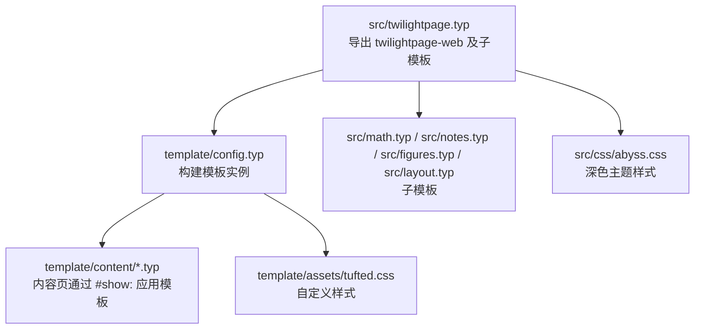
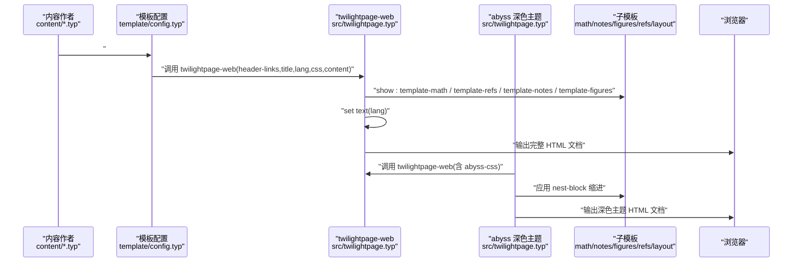
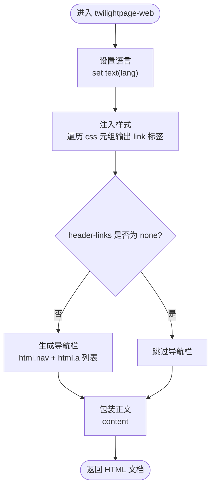
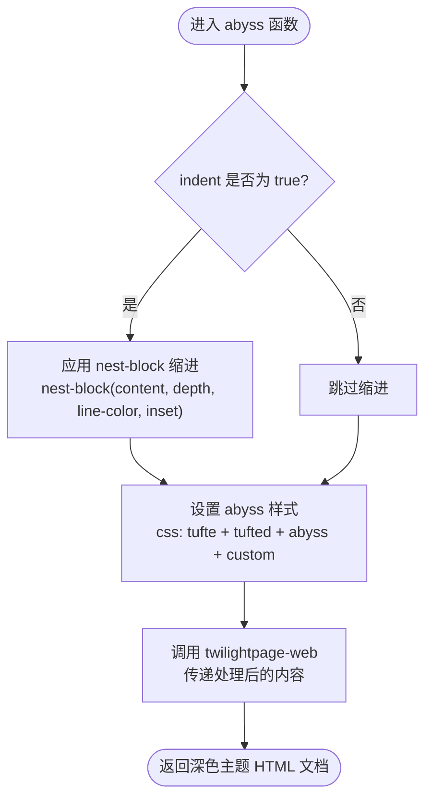
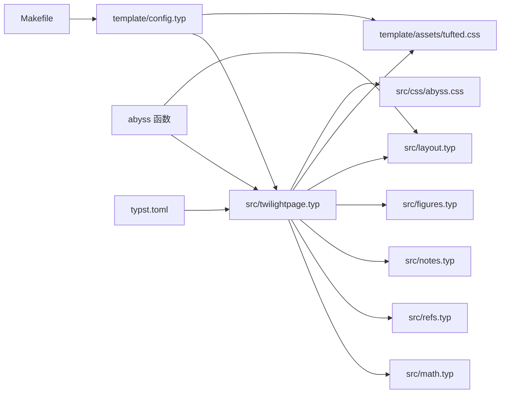

# 核心模板 API

<cite>
**本文引用的文件**
- [src/twilightpage.typ](file://src/twilightpage.typ)
- [src/layout.typ](file://src/layout.typ)
- [src/math.typ](file://src/math.typ)
- [src/refs.typ](file://src/refs.typ)
- [src/notes.typ](file://src/notes.typ)
- [src/figures.typ](file://src/figures.typ)
- [src/css/abyss.css](file://src/css/abyss.css)
- [template/config.typ](file://template/config.typ)
- [template/content/index.typ](file://template/content/index.typ)
- [template/content/docs/01-quick-start/index.typ](file://template/content/docs/01-quick-start/index.typ)
- [template/content/blog/2024-10-04-iterators-generators/index.typ](file://template/content/blog/2024-10-04-iterators-generators/index.typ)
- [template/content/blog/2025-04-16-monkeys-apes/index.typ](file://template/content/blog/2025-04-16-monkeys-apes/index.typ)
- [template/assets/tufted.css](file://template/assets/tufted.css)
- [Makefile](file://Makefile)
- [typst.toml](file://typst.toml)
</cite>

## 更新摘要
**所做更改**
- 更新了模板函数名称从 tufted-web 更改为 twilightpage-web
- 更新语言设置默认值从 'en' 更改为 'zh'
- 新增 abyss 函数提供完整的深色主题支持
- 新增缩进配置选项支持嵌套内容层次结构
- 更新样式系统以支持深色主题切换

## 目录
1. [简介](#简介)
2. [项目结构](#项目结构)
3. [核心组件](#核心组件)
4. [架构总览](#架构总览)
5. [详细组件分析](#详细组件分析)
6. [依赖关系分析](#依赖关系分析)
7. [性能考量](#性能考量)
8. [故障排查指南](#故障排查指南)
9. [结论](#结论)
10. [附录](#附录)

## 简介
本文件面向开发者与内容作者，系统化梳理 TwilightPage 模板的核心 Web 模板函数 API 使用方式与内部机制。文档聚焦以下关键点：
- 函数签名与参数定义：header-links、title、lang、css、content 的类型、默认值与使用方法
- twilightpage-web 主函数与 abyss 深色主题函数的完整参数配置
- 调用语法与返回值结构（HTML 结构）
- 完整参数配置示例与常见使用场景
- 内部工作机制与数据流（模板管线、样式注入、导航栏生成）
- 错误处理与参数验证建议
- 为开发者提供准确的函数签名与使用指南

## 项目结构
该仓库采用"包入口 + 模板入口"的双层结构：
- 包入口位于 src/twilightpage.typ，导出 twilightpage-web 及其子模板（数学、脚注、图注等）
- 模板入口位于 template/config.typ，通过 twilightpage-web.with(...) 构建页面模板实例，并在各内容页通过 #show: 指令应用



**图表来源**
- [src/twilightpage.typ:28-90](file://src/twilightpage.typ#L28-L90)
- [template/config.typ:5-15](file://template/config.typ#L5-L15)

**章节来源**
- [src/twilightpage.typ:1-145](file://src/twilightpage.typ#L1-L145)
- [template/config.typ:1-16](file://template/config.typ#L1-L16)
- [typst.toml:15-19](file://typst.toml#L15-L19)

## 核心组件
本节对 twilightpage-web 和 abyss 函数的参数进行逐项说明，结合源码与示例文件给出类型、默认值、行为与用法。

### twilightpage-web 主函数
- 函数名称
  - twilightpage-web

- 函数签名与参数
  - header-links: none 或键值对序列（每个元素为 (href: 字符串, title: 字符串)）
    - 默认值：none
    - 行为：当非 none 时，渲染导航栏；当为 none 时不渲染导航栏
    - 示例路径：[template/config.typ:7-12](file://template/config.typ#L7-L12)
  - title: 字符串
    - 默认值："TwilightPage"
    - 行为：设置页面标题与 head 中的 <title> 文本
    - 示例路径：[template/config.typ:14](file://template/config.typ#L14)
  - lang: 字符串
    - 默认值："zh"
    - 行为：设置 html lang 属性与文本语言环境
    - 示例路径：[src/twilightpage.typ:41](file://src/twilightpage.typ#L41)
  - css: 元组（字符串列表），包含一个或多个 CSS 链接
    - 默认值：包含 Tufte CSS CDN、本地样式文件和用户自定义样式
    - 行为：按顺序注入 <link rel="stylesheet"> 到 head
    - 示例路径：[src/twilightpage.typ:42-46](file://src/twilightpage.typ#L42-L46)
  - content: 必填内容块（Typst 内容表达式）
    - 默认值：无（必须显式传入）
    - 行为：作为文章主体内容插入到 <article><section>...</section></article>

- 返回值结构
  - 返回一个完整的 HTML 文档树，包含：
    - html/html(lang=lang)
    - head/meta(charset)/meta(viewport)/title/若干 link(rel="stylesheet", href=...)
    - body/header(可选)/article/section(content)

### abyss 深色主题函数
- 函数名称
  - abyss

- 函数签名与参数
  - header-links: none 或键值对序列（每个元素为 (href: 字符串, title: 字符串)）
    - 默认值：none
    - 行为：当非 none 时，渲染导航栏；当为 none 时不渲染导航栏
  - title: 字符串
    - 默认值："TwilightPage"
    - 行为：设置页面标题与 head 中的 <title> 文本
  - lang: 字符串
    - 默认值："zh"
    - 行为：设置 html lang 属性与文本语言环境
  - indent: 布尔值
    - 默认值：true
    - 行为：是否启用内容缩进功能
  - indent-color: RGB 颜色值
    - 默认值：rgb(48, 54, 61)
    - 行为：缩进线的颜色
  - indent-size: 长度值
    - 默认值：1.5em
    - 行为：缩进距离大小
  - content: 必填内容块（Typst 内容表达式）
    - 默认值：无（必须显式传入）
    - 行为：作为文章主体内容插入到 <article><section>...</section></article>

- 返回值结构
  - 返回一个完整的 HTML 文档树，包含深色主题样式和可选的缩进功能

- 调用语法
  - 在模板入口中通过 twilightpage-web.with(...) 或直接调用 abyss 构建模板实例
  - 示例路径：
    - [template/config.typ:5](file://template/config.typ#L5)
    - [template/content/index.typ:1](file://template/content/index.typ#L1)

**章节来源**
- [src/twilightpage.typ:38-90](file://src/twilightpage.typ#L38-L90)
- [src/twilightpage.typ:106-144](file://src/twilightpage.typ#L106-L144)
- [template/config.typ:5-15](file://template/config.typ#L5-L15)
- [template/content/index.typ:1-33](file://template/content/index.typ#L1-L33)

## 架构总览
下图展示 twilightpage-web 和 abyss 函数的调用流程与内部数据流：



**图表来源**
- [src/twilightpage.typ:28-90](file://src/twilightpage.typ#L28-L90)
- [src/twilightpage.typ:106-144](file://src/twilightpage.typ#L106-L144)
- [src/math.typ:15-48](file://src/math.typ#L15-L48)
- [src/refs.typ:15-46](file://src/refs.typ#L15-L46)
- [src/notes.typ:15-49](file://src/notes.typ#L15-L49)
- [src/figures.typ:18-37](file://src/figures.typ#L18-L37)
- [src/layout.typ:80-93](file://src/layout.typ#L80-L93)
- [template/config.typ:5-15](file://template/config.typ#L5-L15)

## 详细组件分析

### 组件一：twilightpage-web 函数
- 作用
  - 作为 Web 页面的主模板，负责组织页面结构、注入样式、设置语言、渲染导航栏与正文内容
- 关键实现要点
  - 子模板装配：通过 show: 注入数学、参考文献、脚注、图注处理
  - 语言设置：set text(lang: lang)
  - 导航栏生成：基于 header-links 构造 <nav><a href=...>...</a></nav>，若为 none 则不渲染
  - 样式注入：遍历 css 元组，依次输出 <link rel="stylesheet" href=...>
  - 正文包装：将 content 放入 <article><section>...</section></article>
- 数据流
  - 输入：header-links、title、lang、css、content
  - 处理：子模板转换、语言设置、导航栏条件渲染、样式链接拼装
  - 输出：HTML 文档树



**图表来源**
- [src/twilightpage.typ:38-90](file://src/twilightpage.typ#L38-L90)

**章节来源**
- [src/twilightpage.typ:38-90](file://src/twilightpage.typ#L38-L90)

### 组件二：abyss 深色主题函数
- 作用
  - 提供完整的深色主题支持，包含缩进配置选项，适合低光环境阅读
- 关键实现要点
  - 深色主题样式：引入 abyss.css 样式文件
  - 缩进功能：基于 nest-block 工具实现嵌套内容层次结构
  - 参数配置：indent、indent-color、indent-size 控制缩进行为
  - 继承机制：复用 twilightpage-web 的核心功能
- 数据流
  - 输入：header-links、title、lang、indent、indent-color、indent-size、content
  - 处理：应用 abyss 样式、条件性应用缩进、调用主模板函数
  - 输出：深色主题 HTML 文档



**图表来源**
- [src/twilightpage.typ:106-144](file://src/twilightpage.typ#L106-L144)
- [src/layout.typ:80-93](file://src/layout.typ#L80-L93)

**章节来源**
- [src/twilightpage.typ:106-144](file://src/twilightpage.typ#L106-L144)

### 组件三：子模板与样式管线
- 数学模板（template-math）
  - 将内联与块级公式分别包裹为 span/figure 并保留 role 信息，便于样式与交互
  - 示例路径：[src/math.typ:15-48](file://src/math.typ#L15-L48)
- 引用模板（template-refs）
  - 对特定元素（如方程）重写引用显示，支持编号与定位
  - 示例路径：[src/refs.typ:15-46](file://src/refs.typ#L15-L46)
- 脚注模板（template-notes）
  - 将脚注编号与正文引用映射为上标链接，并在边注区渲染脚注内容
  - 示例路径：[src/notes.typ:15-49](file://src/notes.typ#L15-L49)
- 图注模板（template-figures）
  - 将 figure.caption 重写为边注样式，并在 HTML 中输出 figure 结构
  - 示例路径：[src/figures.typ:18-37](file://src/figures.typ#L18-L37)
- 布局工具（layout）
  - 提供 margin-note、full-width 和 nest-block 辅助，用于边注、全宽布局和嵌套缩进
  - 示例路径：[src/layout.typ:80-93](file://src/layout.typ#L80-L93)
- 自定义样式（tufted.css）
  - 提供响应式布局、导航栏、脚注与边注、数学渲染等样式
  - 示例路径：[template/assets/tufted.css:1-166](file://template/assets/tufted.css#L1-L166)
- 深色主题样式（abyss.css）
  - 提供完整的深色配色方案，包含背景色、文字色、强调色等 CSS 变量
  - 示例路径：[src/css/abyss.css:1-391](file://src/css/abyss.css#L1-L391)

```mermaid
classDiagram
class TwilightPageWeb {
+twilightpage-web(header-links,title,lang,css,content)
}
class AbyssTheme {
+abyss(header-links,title,lang,indent,indent-color,indent-size,content)
}
class MathTemplate {
+template-math(content)
}
class RefsTemplate {
+template-refs(content)
}
class NotesTemplate {
+template-notes(content)
}
class FiguresTemplate {
+template-figures(content)
}
class LayoutUtils {
+margin-note(content)
+full-width(content)
+nest-block(body,depth,line-color,inset)
}
class CSS {
+"tufted.css"
+"abyss.css"
}
TwilightPageWeb --> MathTemplate : "show : "
TwilightPageWeb --> RefsTemplate : "show : "
TwilightPageWeb --> NotesTemplate : "show : "
TwilightPageWeb --> FiguresTemplate : "show : "
TwilightPageWeb --> LayoutUtils : "使用"
TwilightPageWeb --> CSS : "注入样式"
AbyssTheme --> TwilightPageWeb : "继承"
AbyssTheme --> LayoutUtils : "使用 nest-block"
AbyssTheme --> CSS : "使用 abyss.css"
```

**图表来源**
- [src/twilightpage.typ:28-90](file://src/twilightpage.typ#L28-L90)
- [src/twilightpage.typ:106-144](file://src/twilightpage.typ#L106-L144)
- [src/math.typ:15-48](file://src/math.typ#L15-L48)
- [src/refs.typ:15-46](file://src/refs.typ#L15-L46)
- [src/notes.typ:15-49](file://src/notes.typ#L15-L49)
- [src/figures.typ:18-37](file://src/figures.typ#L18-L37)
- [src/layout.typ:80-93](file://src/layout.typ#L80-L93)
- [template/assets/tufted.css:1-166](file://template/assets/tufted.css#L1-L166)
- [src/css/abyss.css:1-391](file://src/css/abyss.css#L1-L391)

**章节来源**
- [src/math.typ:15-48](file://src/math.typ#L15-L48)
- [src/refs.typ:15-46](file://src/refs.typ#L15-L46)
- [src/notes.typ:15-49](file://src/notes.typ#L15-L49)
- [src/figures.typ:18-37](file://src/figures.typ#L18-L37)
- [src/layout.typ:80-93](file://src/layout.typ#L80-L93)
- [template/assets/tufted.css:1-166](file://template/assets/tufted.css#L1-L166)
- [src/css/abyss.css:1-391](file://src/css/abyss.css#L1-L391)

### 组件四：导航栏生成器 make-header
- 作用
  - 将 header-links 序列转换为导航条（仅在非 none 时渲染）
- 实现要点
  - 遍历 (href, title) 对，生成多个 <a href=...>title</a> 并放入 <nav>
- 示例路径：[src/twilightpage.typ:18-26](file://src/twilightpage.typ#L18-L26)

**章节来源**
- [src/twilightpage.typ:18-26](file://src/twilightpage.typ#L18-L26)

### 组件五：样式注入与语言设置
- 样式注入
  - 遍历 css 元组，输出多个 <link rel="stylesheet" href=...>，默认包含 Tufte CSS、本地样式和用户自定义样式
  - 示例路径：[src/twilightpage.typ:72-74](file://src/twilightpage.typ#L72-L74)
- 语言设置
  - 设置根元素语言属性与文本语言环境
  - 示例路径：[src/twilightpage.typ:58](file://src/twilightpage.typ#L58)

**章节来源**
- [src/twilightpage.typ:58](file://src/twilightpage.typ#L58)
- [src/twilightpage.typ:72-74](file://src/twilightpage.typ#L72-L74)

### 组件六：内容页应用模板
- 模板实例化
  - 在模板入口通过 twilightpage-web.with(...) 构建模板实例，设置 header-links 与 title
  - 示例路径：[template/config.typ:5-15](file://template/config.typ#L5-L15)
- 内容页应用
  - 在内容页通过 #show: 应用模板实例，并传入具体 content
  - 示例路径：
    - [template/content/index.typ:1](file://template/content/index.typ#L1)
    - [template/content/docs/01-quick-start/index.typ:2](file://template/content/docs/01-quick-start/index.typ#L2)

**章节来源**
- [template/config.typ:5-15](file://template/config.typ#L5-L15)
- [template/content/index.typ:1](file://template/content/index.typ#L1)
- [template/content/docs/01-quick-start/index.typ:2](file://template/content/docs/01-quick-start/index.typ#L2)

## 依赖关系分析
- 包与模板入口
  - 包入口：src/twilightpage.typ
  - 模板入口：template/config.typ
- 子模板依赖
  - twilightpage-web 依赖 math/refs/notes/figures/layout 子模板
  - abyss 函数依赖 nest-block 工具
- 样式依赖
  - 默认样式来自 Tufte CSS CDN、本地 tufted.css 和用户自定义样式
  - 深色主题样式来自 abyss.css
- 构建与分发
  - 构建入口：Makefile 中的 html 目标
  - 包元数据：typst.toml



**图表来源**
- [src/twilightpage.typ:8-12](file://src/twilightpage.typ#L8-L12)
- [src/math.typ:8-10](file://src/math.typ#L8-L10)
- [src/refs.typ:8-9](file://src/refs.typ#L8-L9)
- [src/notes.typ:8-10](file://src/notes.typ#L8-L10)
- [src/figures.typ:8-11](file://src/figures.typ#L8-L11)
- [src/layout.typ:12](file://src/layout.typ#L12)
- [template/config.typ:1-2](file://template/config.typ#L1-L2)
- [template/assets/tufted.css:1-166](file://template/assets/tufted.css#L1-L166)
- [src/css/abyss.css:1-391](file://src/css/abyss.css#L1-L391)
- [Makefile:54-55](file://Makefile#L54-L55)
- [typst.toml:1-19](file://typst.toml#L1-L19)

**章节来源**
- [src/twilightpage.typ:8-12](file://src/twilightpage.typ#L8-L12)
- [template/config.typ:1-16](file://template/config.typ#L1-L16)
- [Makefile:54-55](file://Makefile#L54-L55)
- [typst.toml:1-19](file://typst.toml#L1-L19)

## 性能考量
- 样式加载
  - 默认样式包含外部 CDN 与本地样式，建议在生产环境中确保网络可用性或预缓存
  - 深色主题额外加载 abyss.css，可能增加初始加载时间
- 渲染复杂度
  - 数学与脚注处理会增加 DOM 结构复杂度，建议在长文档中控制公式与脚注数量
  - 缩进功能通过 nest-block 实现，可能影响渲染性能
- 构建效率
  - 使用 Makefile 的 html 目标批量编译，避免重复构建

## 故障排查指南
- 导航栏未显示
  - 检查 header-links 是否为 none；若为 none 将不会渲染导航栏
  - 参考路径：[src/twilightpage.typ:19-26](file://src/twilightpage.typ#L19-L26)
- 样式缺失
  - 确认 css 元组中的链接有效且可访问；默认包含 Tufte CSS、本地样式和用户自定义样式
  - 参考路径：[src/twilightpage.typ:42-46](file://src/twilightpage.typ#L42-L46)
- 语言设置无效
  - 确认 lang 参数正确传入并被 set text 使用
  - 参考路径：[src/twilightpage.typ:58](file://src/twilightpage.typ#L58)
- 深色主题不生效
  - 确认 abyss.css 文件存在且路径正确
  - 检查 indent 参数设置是否正确
  - 参考路径：[src/twilightpage.typ:116-121](file://src/twilightpage.typ#L116-L121)
- 缩进功能异常
  - 确认 nest-block 工具正常工作
  - 检查 indent-color 和 indent-size 参数格式
  - 参考路径：[src/layout.typ:80-93](file://src/layout.typ#L80-L93)
- 数学或脚注显示异常
  - 检查子模板是否正确装配（show: template-math / template-refs / template-notes / template-figures）
  - 参考路径：[src/twilightpage.typ:52-55](file://src/twilightpage.typ#L52-L55)
- 构建失败
  - 确认 Makefile 中的 html 目标与模板入口路径一致
  - 参考路径：[Makefile:54-55](file://Makefile#L54-L55)

**章节来源**
- [src/twilightpage.typ:19-26](file://src/twilightpage.typ#L19-L26)
- [src/twilightpage.typ:42-46](file://src/twilightpage.typ#L42-L46)
- [src/twilightpage.typ:58](file://src/twilightpage.typ#L58)
- [src/twilightpage.typ:116-121](file://src/twilightpage.typ#L116-L121)
- [src/layout.typ:80-93](file://src/layout.typ#L80-L93)
- [src/twilightpage.typ:52-55](file://src/twilightpage.typ#L52-L55)
- [Makefile:54-55](file://Makefile#L54-L55)

## 结论
twilightpage-web 和 abyss 函数提供了简洁而强大的 Web 模板能力：以少量参数即可完成页面结构、样式与导航的统一配置，并通过子模板扩展数学、脚注、图注等功能。新增的深色主题支持和缩进功能进一步增强了用户体验，特别适合长时间阅读和低光环境使用。开发者应重点关注参数的类型与默认值、样式链路与语言设置，以及在内容页正确应用模板实例。遵循本文的参数说明与示例路径，可快速搭建高质量静态网站。

## 附录

### 参数速查表
- header-links
  - 类型：none 或键值对序列
  - 默认值：none
  - 说明：非 none 时渲染导航栏
  - 示例路径：[template/config.typ:7-12](file://template/config.typ#L7-L12)
- title
  - 类型：字符串
  - 默认值："TwilightPage"
  - 说明：设置页面标题
  - 示例路径：[template/config.typ:14](file://template/config.typ#L14)
- lang
  - 类型：字符串
  - 默认值："zh"
  - 说明：设置 html lang 与文本语言
  - 示例路径：[src/twilightpage.typ:41](file://src/twilightpage.typ#L41)
- css
  - 类型：元组（字符串列表）
  - 默认值：包含 Tufte CSS CDN、本地样式和用户自定义样式
  - 说明：按序注入样式表
  - 示例路径：[src/twilightpage.typ:42-46](file://src/twilightpage.typ#L42-L46)
- content
  - 类型：内容块
  - 默认值：无（必填）
  - 说明：正文内容，将被包装为 article/section
  - 示例路径：[src/twilightpage.typ:47](file://src/twilightpage.typ#L47)
- abyss-indent
  - 类型：布尔值
  - 默认值：true
  - 说明：是否启用内容缩进功能
  - 示例路径：[src/twilightpage.typ:110](file://src/twilightpage.typ#L110)
- abyss-indent-color
  - 类型：RGB 颜色值
  - 默认值：rgb(48, 54, 61)
  - 说明：缩进线的颜色
  - 示例路径：[src/twilightpage.typ:111](file://src/twilightpage.typ#L111)
- abyss-indent-size
  - 类型：长度值
  - 默认值：1.5em
  - 说明：缩进距离大小
  - 示例路径：[src/twilightpage.typ:112](file://src/twilightpage.typ#L112)

### 常见使用场景
- 博客首页
  - 在模板入口设置 header-links 与 title，内容页通过 #show: 应用模板
  - 示例路径：
    - [template/config.typ:5-15](file://template/config.typ#L5-L15)
    - [template/content/index.typ:1](file://template/content/index.typ#L1)
- 快速开始文档
  - 在内容页覆盖 title，保持其他参数默认
  - 示例路径：[template/content/docs/01-quick-start/index.typ:2](file://template/content/docs/01-quick-start/index.typ#L2)
- 技术文章（含脚注与图注）
  - 使用边注与脚注模板增强阅读体验
  - 示例路径：
    - [template/content/blog/2024-10-04-iterators-generators/index.typ:1](file://template/content/blog/2024-10-04-iterators-generators/index.typ#L1)
    - [template/content/blog/2025-04-16-monkeys-apes/index.typ:1](file://template/content/blog/2025-04-16-monkeys-apes/index.typ#L1)
- 深色主题博客
  - 使用 abyss 函数创建深色主题页面，支持缩进功能
  - 示例路径：[template/content/index.typ:1](file://template/content/index.typ#L1)