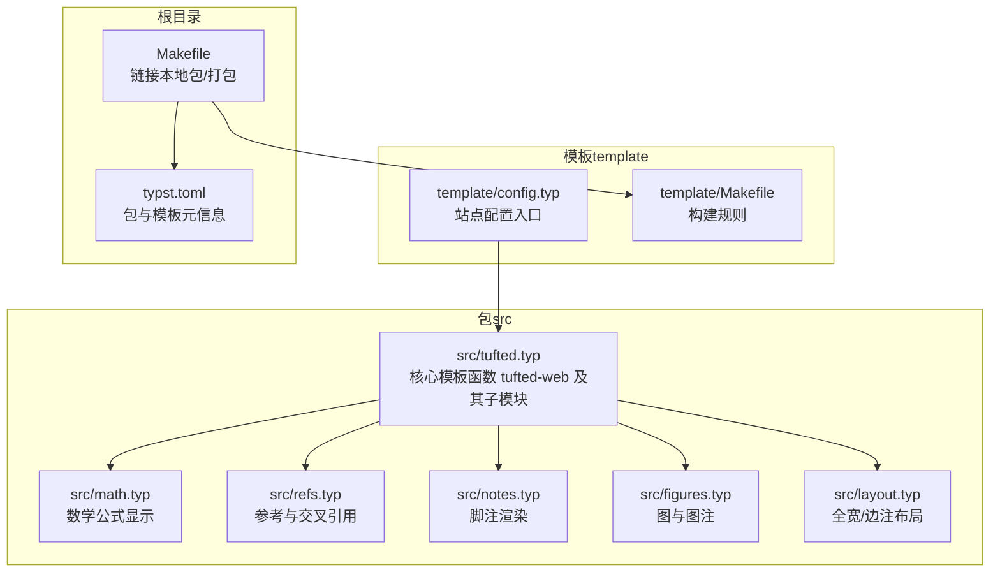
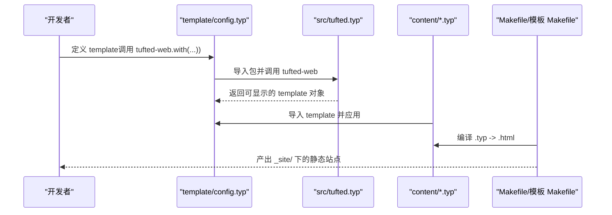
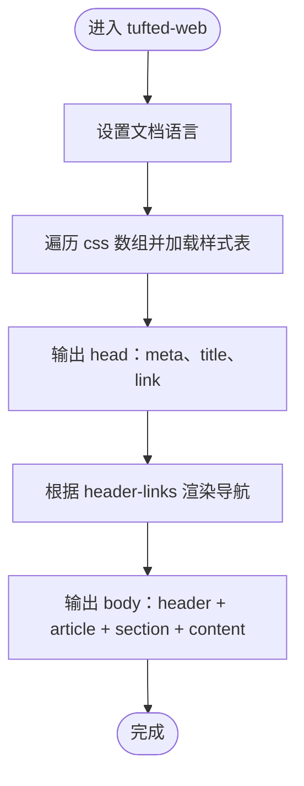
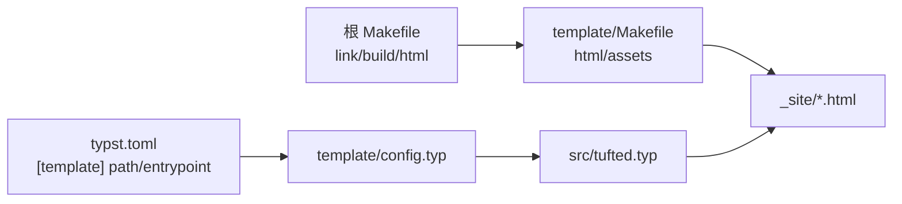

# 配置接口 API

<cite>
**本文引用的文件**
- [template/config.typ](file://template/config.typ)
- [src/tufted.typ](file://src/tufted.typ)
- [src/math.typ](file://src/math.typ)
- [src/refs.typ](file://src/refs.typ)
- [src/notes.typ](file://src/notes.typ)
- [src/figures.typ](file://src/figures.typ)
- [src/layout.typ](file://src/layout.typ)
- [template/Makefile](file://template/Makefile)
- [Makefile](file://Makefile)
- [typst.toml](file://typst.toml)
- [template/content/docs/02-configuration/index.typ](file://template/content/docs/02-configuration/index.typ)
- [template/content/docs/03-styling/index.typ](file://template/content/docs/03-styling/index.typ)
- [template/content/index.typ](file://template/content/index.typ)
</cite>

## 目录
1. [简介](#简介)
2. [项目结构](#项目结构)
3. [核心组件](#核心组件)
4. [架构总览](#架构总览)
5. [详细组件分析](#详细组件分析)
6. [依赖分析](#依赖分析)
7. [性能考虑](#性能考虑)
8. [故障排查指南](#故障排查指南)
9. [结论](#结论)
10. [附录](#附录)

## 简介
本文件面向使用者与维护者，提供“配置接口”的完整 API 文档。重点覆盖模板配置对象的字段与属性（样式配置、语言设置、资源路径等），明确数据类型、默认值与有效范围，并给出配置文件结构示例与修改指南。同时解释配置项之间的依赖关系与冲突处理方式，说明配置验证机制与常见错误的诊断方法，帮助用户实现灵活的定制化配置。

## 项目结构
该仓库采用“包（package）+ 模板（template）”双层结构：
- 包（src/tufted.typ）：定义核心渲染函数与功能模块（数学公式、脚注、图注、布局等）。
- 模板（template/config.typ）：通过包提供的函数进行实例化与定制，形成可构建的网站配置。
- 构建与分发（Makefile、template/Makefile、typst.toml）：提供链接本地包、同步资源、编译与打包流程。

图表来源
- [src/tufted.typ:1-64](file://src/tufted.typ#L1-L64)
- [src/math.typ:1-22](file://src/math.typ#L1-L22)
- [src/refs.typ:1-23](file://src/refs.typ#L1-L23)
- [src/notes.typ:1-27](file://src/notes.typ#L1-L27)
- [src/figures.typ:1-20](file://src/figures.typ#L1-L20)
- [src/layout.typ:1-13](file://src/layout.typ#L1-L13)
- [template/config.typ:1-12](file://template/config.typ#L1-L12)
- [template/Makefile:1-27](file://template/Makefile#L1-L27)
- [Makefile:1-60](file://Makefile#L1-L60)
- [typst.toml:1-19](file://typst.toml#L1-L19)

章节来源
- [typst.toml:1-19](file://typst.toml#L1-L19)
- [Makefile:1-60](file://Makefile#L1-L60)
- [template/Makefile:1-27](file://template/Makefile#L1-L27)

## 核心组件
本节聚焦“配置接口”的核心能力与参数，即在模板中通过函数调用完成站点定制的方式。

- 函数名称：tufted-web
- 作用：生成一个可渲染的 HTML 页面骨架，支持头部导航、标题、语言、样式表列表以及正文内容。
- 关键参数（字段）：
  - header-links: 导航链接映射（键为路径字符串，值为显示文本字符串）
  - title: 页面标题（字符串）
  - lang: 文档语言（字符串，默认为 "en"）
  - css: 样式表数组（元素为字符串，可为绝对/相对 URL 或本地路径）
  - content: 主体内容（任意类型，由模板内部组合）

- 默认行为：
  - 默认加载三类样式表：CDN 的 Tufte CSS、本地 tufted.css、本地 custom.css（后两者按顺序追加）
  - 默认语言为 "en"
  - 默认无导航链接（none）

- 使用方式：
  - 在模板入口（如 template/config.typ）中导入包并调用 tufted-web.with(...) 定制参数，得到 template 对象
  - 在各页面（如 template/content/index.typ）通过 #show: template 引用该模板

章节来源
- [src/tufted.typ:17-63](file://src/tufted.typ#L17-L63)
- [template/config.typ:3-11](file://template/config.typ#L3-L11)
- [template/content/index.typ:1-3](file://template/content/index.typ#L1-L3)

## 架构总览
下图展示“配置接口”在构建流程中的位置与交互关系：

图表来源
- [template/config.typ:1-12](file://template/config.typ#L1-L12)
- [src/tufted.typ:17-63](file://src/tufted.typ#L17-L63)
- [template/content/index.typ:1-3](file://template/content/index.typ#L1-L3)
- [Makefile:54-55](file://Makefile#L54-L55)
- [template/Makefile:14-16](file://template/Makefile#L14-L16)

## 详细组件分析

### 组件一：tufted-web（主模板）
- 职责：生成 HTML 页面骨架，注入样式表、语言、标题与导航；将内容包裹在文章与段落结构中。
- 参数详解：
  - header-links: 类型为映射（键为字符串路径，值为字符串标题）。若为 none 则不渲染导航。
  - title: 字符串，用于 <title> 标签与页面标题显示。
  - lang: 字符串，设置 html lang 属性与文本语言上下文。
  - css: 元组/数组，元素为字符串（URL 或本地路径）。按顺序加载，最后加载 custom.css。
  - content: 任意类型，作为主体内容传入。
- 默认值与范围：
  - header-links: none（无导航）
  - title: "Tufted"
  - lang: "en"
  - css: 默认包含 CDN Tufte CSS 与本地 tufted.css、custom.css
- 冲突与依赖：
  - 若自定义 css 覆盖了默认列表，则需确保路径正确且可访问
  - lang 与页面内容的语言一致性建议由使用者保证
- 错误与诊断：
  - 导航链接映射的键/值必须为字符串，否则在渲染时会报错
  - 样式表路径无效会导致浏览器无法加载，需检查路径或网络连通性
  - 若未设置 content，页面将为空白主体

图表来源
- [src/tufted.typ:34-62](file://src/tufted.typ#L34-L62)

章节来源
- [src/tufted.typ:17-63](file://src/tufted.typ#L17-L63)

### 组件二：样式配置（CSS）
- 默认样式表顺序（从先到后）：
  - CDN Tufte CSS
  - /assets/tufted.css
  - /assets/custom.css
- 自定义方式：
  - 在 config.typ 中通过 tufted-web.with(css: (...)) 提供新的样式表列表
  - 修改 assets/custom.css 以覆盖默认样式（因其最后加载）
- 依赖关系：
  - 自定义样式表应位于可公开访问的路径（如 /assets/...）
  - 若仅保留自定义样式表，请确保包含必要的排版与布局规则
- 冲突处理：
  - 后加载的样式优先级更高（CSS 层叠规则）
  - 建议通过 scoped 类名或更具体的选择器避免全局污染

章节来源
- [src/tufted.typ:21-25](file://src/tufted.typ#L21-L25)
- [template/content/docs/03-styling/index.typ:8-43](file://template/content/docs/03-styling/index.typ#L8-L43)

### 组件三：语言设置（lang）
- 作用：设置页面语言，影响文本方向、字符集与可访问性上下文。
- 默认值：en
- 影响范围：html lang 属性、文本语言上下文（如数学公式编号等）
- 注意事项：
  - 请确保样式与字体对目标语言有良好支持
  - 若使用多语言内容，建议在内容层面进行局部切换而非全局覆盖

章节来源
- [src/tufted.typ:20](file://src/tufted.typ#L20)
- [src/tufted.typ:34](file://src/tufted.typ#L34)

### 组件四：导航链接（header-links）
- 结构：映射（路径 -> 标题）
- 默认：none（不渲染导航）
- 用法：在 config.typ 中定义，随后在页面中通过 #show: template 应用
- 注意事项：
  - 路径需与内容层级一致，避免 404
  - 标题应简洁明确，符合用户体验

章节来源
- [template/config.typ:4-9](file://template/config.typ#L4-L9)
- [src/tufted.typ:7-15](file://src/tufted.typ#L7-L15)

### 组件五：内容与模块（数学、脚注、图注、布局）
- 数学公式（template-math）：控制公式编号与 HTML 角色属性
- 脚注（template-notes）：将脚注编号与引用映射到边注区域
- 图与图注（template-figures）：重定义图注为边注样式
- 布局（layout）：提供 margin-note 与 full-width 容器
- 依赖关系：
  - tufted-web 内部已注册上述模块，无需额外导入即可生效
  - 若需要更精细控制，可在页面中单独引入对应模块并覆盖默认行为

章节来源
- [src/tufted.typ:1-5](file://src/tufted.typ#L1-L5)
- [src/math.typ:1-22](file://src/math.typ#L1-L22)
- [src/notes.typ:1-27](file://src/notes.typ#L1-L27)
- [src/figures.typ:1-20](file://src/figures.typ#L1-L20)
- [src/layout.typ:1-13](file://src/layout.typ#L1-L13)

### 组件六：页面继承与模板应用
- 页面层级：content/**/index.typ 作为页面入口，可通过 import 继承父级模板
- 继承链：根 config.typ -> 父级 index.typ -> 子级 index.typ
- 应用方式：在页面中 #show: template 或 template.with(...) 覆盖特定字段
- 示例路径：
  - 根入口与模板应用：template/content/index.typ
  - 配置与继承说明：template/content/docs/02-configuration/index.typ
  - 样式说明：template/content/docs/03-styling/index.typ

章节来源
- [template/content/index.typ:1-3](file://template/content/index.typ#L1-L3)
- [template/content/docs/02-configuration/index.typ:41-52](file://template/content/docs/02-configuration/index.typ#L41-L52)

## 依赖分析
- 包与模板的绑定：
  - typst.toml 指定模板路径与入口（template/config.typ）
  - 根 Makefile 提供 link 目标，将本地版本链接至 Typst 包缓存，便于开发调试
- 构建链路：
  - 根 Makefile 调用 template/Makefile 的 html 目标，编译 content 下所有 .typ 文件
  - 模板 Makefile 将 .typ 编译为 .html，并复制 assets 到 _site/assets
- 外部依赖：
  - CDN Tufte CSS（默认样式表之一）
  - 本地 CSS 文件（tufted.css、custom.css）

图表来源
- [typst.toml:15-18](file://typst.toml#L15-L18)
- [Makefile:54-59](file://Makefile#L54-L59)
- [template/Makefile:8-20](file://template/Makefile#L8-L20)
- [src/tufted.typ:17-63](file://src/tufted.typ#L17-L63)

章节来源
- [typst.toml:1-19](file://typst.toml#L1-L19)
- [Makefile:1-60](file://Makefile#L1-L60)
- [template/Makefile:1-27](file://template/Makefile#L1-L27)

## 性能考虑
- 样式表加载顺序：默认样式表较多时可能增加首屏渲染时间。建议在生产环境仅保留必要样式表，并确保资源可缓存。
- CDN 依赖：默认包含 CDN 样式表，网络不稳定时会影响加载速度。可将样式表镜像到本地或使用本地替代。
- 构建优化：模板 Makefile 已按需编译 content 下的 .typ 文件，避免重复构建；清理时使用 clean 目标移除旧产物。

## 故障排查指南
- 导航链接无效：
  - 检查 header-links 映射的键（路径）是否与页面层级一致
  - 确认路径不含多余前缀或大小写差异
- 样式未生效：
  - 确认 css 数组中的路径可被服务器访问
  - 检查 custom.css 是否位于 /assets/ 且命名正确
  - 若自定义样式未覆盖预期规则，确认选择器优先级与作用域
- 页面空白或内容缺失：
  - 确认页面中已 #show: template 或 template.with(...)
  - 检查 content 参数是否传入
- 语言显示异常：
  - 确认 lang 设置为有效的语言代码
  - 检查字体与字符集是否支持目标语言
- 构建失败：
  - 使用根 Makefile 的 check 目标检查包规范
  - 清理缓存后重新 link 并再次构建

章节来源
- [template/content/docs/02-configuration/index.typ:41-52](file://template/content/docs/02-configuration/index.typ#L41-L52)
- [template/content/docs/03-styling/index.typ:23-43](file://template/content/docs/03-styling/index.typ#L23-L43)
- [Makefile:50-52](file://Makefile#L50-L52)

## 结论
通过 tufted-web 的配置接口，用户可以以最小成本完成站点的布局、语言与样式定制。遵循“默认样式表 + 自定义覆盖”的策略，结合清晰的页面继承模型，即可实现灵活而稳定的静态网站生成。建议在生产环境中尽量减少外部依赖与冗余样式，以提升加载性能与可维护性。

## 附录

### 配置参数速查表
- header-links
  - 类型：映射（字符串 -> 字符串）
  - 默认：none
  - 说明：导航链接集合
- title
  - 类型：字符串
  - 默认："Tufted"
  - 说明：页面标题
- lang
  - 类型：字符串
  - 默认："en"
  - 说明：文档语言
- css
  - 类型：元组/数组（字符串）
  - 默认：包含 CDN Tufte CSS 与本地 tufted.css、custom.css
  - 说明：样式表加载顺序从前往后
- content
  - 类型：任意
  - 默认：无
  - 说明：页面主体内容

章节来源
- [src/tufted.typ:17-27](file://src/tufted.typ#L17-L27)

### 配置文件结构示例（路径）
- 模板入口：template/config.typ
- 页面应用：template/content/index.typ
- 配置与继承说明：template/content/docs/02-configuration/index.typ
- 样式说明：template/content/docs/03-styling/index.typ

章节来源
- [template/config.typ:1-12](file://template/config.typ#L1-L12)
- [template/content/index.typ:1-3](file://template/content/index.typ#L1-L3)
- [template/content/docs/02-configuration/index.typ:22-52](file://template/content/docs/02-configuration/index.typ#L22-L52)
- [template/content/docs/03-styling/index.typ:8-43](file://template/content/docs/03-styling/index.typ#L8-L43)