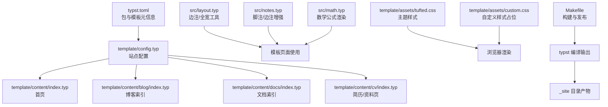
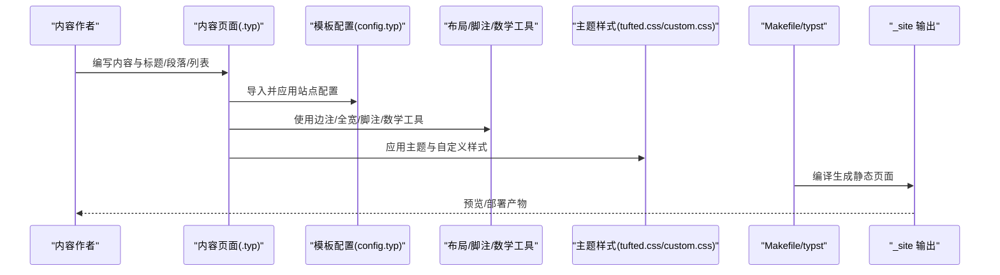
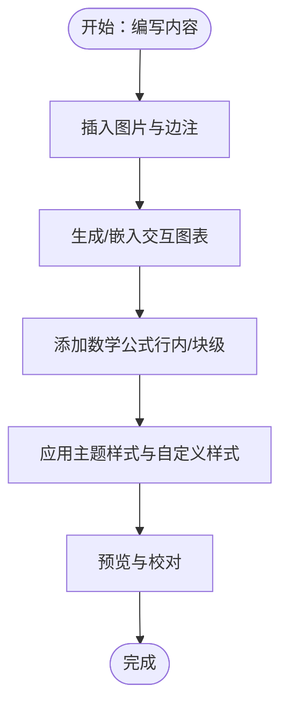
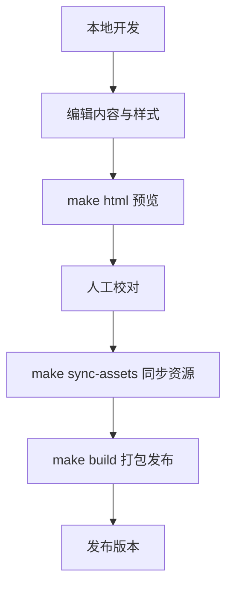
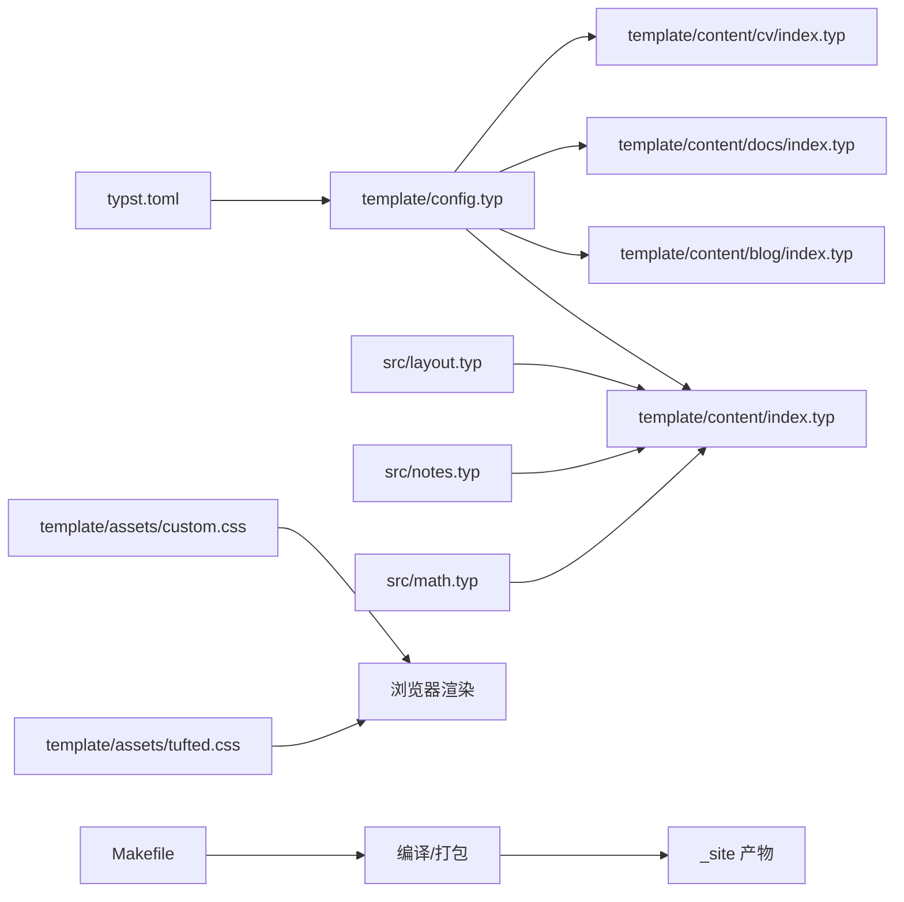

# 内容创作

<cite>
**本文引用的文件**
- [src/layout.typ](file://src/layout.typ)
- [src/math.typ](file://src/math.typ)
- [src/notes.typ](file://src/notes.typ)
- [template/config.typ](file://template/config.typ)
- [template/content/index.typ](file://template/content/index.typ)
- [template/content/blog/index.typ](file://template/content/blog/index.typ)
- [template/content/blog/2024-10-04-iterators-generators/index.typ](file://template/content/blog/2024-10-04-iterators-generators/index.typ)
- [template/content/blog/2025-10-30-normal-distribution/index.typ](file://template/content/blog/2025-10-30-normal-distribution/index.typ)
- [template/content/docs/index.typ](file://template/content/docs/index.typ)
- [template/content/docs/01-quick-start/index.typ](file://template/content/docs/01-quick-start/index.typ)
- [template/content/cv/index.typ](file://template/content/cv/index.typ)
- [template/assets/tufted.css](file://template/assets/tufted.css)
- [template/assets/custom.css](file://template/assets/custom.css)
- [Makefile](file://Makefile)
- [typst.toml](file://typst.toml)
</cite>

## 目录
1. [简介](#简介)
2. [项目结构](#项目结构)
3. [核心组件](#核心组件)
4. [架构总览](#架构总览)
5. [详细组件分析](#详细组件分析)
6. [依赖分析](#依赖分析)
7. [性能考虑](#性能考虑)
8. [故障排查指南](#故障排查指南)
9. [结论](#结论)
10. [附录](#附录)

## 简介
本指南面向内容创作者，系统讲解如何基于 TwilightPage（基于 Typst 的 tufted 模板）进行高质量内容创作与发布。内容覆盖页面结构与模板使用、Typst 标记语言写作规范与最佳实践、导航系统设计与实现、多媒体处理（图片、图表、交互元素）、多语言与国际化配置建议、内容管理策略（版本控制与更新流程）、SEO 与搜索优化实践，以及可复用的工作流程与质量保证方法。

## 项目结构
TwilightPage 采用“包模板”结构：根目录定义包元信息与构建入口，src 提供可复用的排版与样式能力，template 提供站点内容与样式资产，并通过 Makefile 统一构建与发布。

- 包与模板元信息
  - typst.toml 定义包名、版本、编译器要求、模板入口等
  - Makefile 提供链接本地包缓存、同步资源、清理、检查与打包等目标
- 可复用模块
  - src/layout.typ：边注与全宽布局工具
  - src/notes.typ：脚注与边注渲染增强
  - src/math.typ：数学公式编号与 HTML 渲染
- 模板内容与样式
  - template/config.typ：站点标题与导航链接配置
  - template/content/*：首页、博客、文档、CV 等页面
  - template/assets/*：主题样式与自定义样式扩展

**图示来源**
- [typst.toml:1-19](file://typst.toml#L1-L19)
- [template/config.typ:1-12](file://template/config.typ#L1-L12)
- [template/content/index.typ:1-33](file://template/content/index.typ#L1-L33)
- [template/content/blog/index.typ:1-14](file://template/content/blog/index.typ#L1-L14)
- [template/content/docs/index.typ:1-16](file://template/content/docs/index.typ#L1-L16)
- [template/content/cv/index.typ:1-59](file://template/content/cv/index.typ#L1-L59)
- [src/layout.typ:1-13](file://src/layout.typ#L1-L13)
- [src/notes.typ:1-27](file://src/notes.typ#L1-L27)
- [src/math.typ:1-22](file://src/math.typ#L1-L22)
- [template/assets/tufted.css:1-166](file://template/assets/tufted.css#L1-L166)
- [template/assets/custom.css:1-1](file://template/assets/custom.css#L1-L1)
- [Makefile:1-60](file://Makefile#L1-L60)

**章节来源**
- [typst.toml:1-19](file://typst.toml#L1-L19)
- [Makefile:1-60](file://Makefile#L1-L60)

## 核心组件
- 布局与边注工具
  - 边注与全宽容器：用于在正文旁侧或全宽展示补充信息与媒体
- 脚注与边注增强
  - 自动编号、交叉引用、悬停高亮联动
- 数学公式渲染
  - 公式编号、块级/行内切换、HTML 角色标记
- 导航与站点配置
  - 顶部导航链接、标题、页面标题注入

**章节来源**
- [src/layout.typ:1-13](file://src/layout.typ#L1-L13)
- [src/notes.typ:1-27](file://src/notes.typ#L1-L27)
- [src/math.typ:1-22](file://src/math.typ#L1-L22)
- [template/config.typ:1-12](file://template/config.typ#L1-L12)

## 架构总览
下图展示了从内容到最终网页的关键路径：内容页面导入模板配置，应用布局与样式工具，经由 Makefile 驱动编译，生成静态站点产物。

**图示来源**
- [template/content/index.typ:1-33](file://template/content/index.typ#L1-L33)
- [template/config.typ:1-12](file://template/config.typ#L1-L12)
- [src/layout.typ:1-13](file://src/layout.typ#L1-L13)
- [src/notes.typ:1-27](file://src/notes.typ#L1-L27)
- [src/math.typ:1-22](file://src/math.typ#L1-L22)
- [template/assets/tufted.css:1-166](file://template/assets/tufted.css#L1-L166)
- [template/assets/custom.css:1-1](file://template/assets/custom.css#L1-L1)
- [Makefile:54-56](file://Makefile#L54-L56)

## 详细组件分析

### 页面结构与模板使用
- 首页
  - 通过导入模板配置与 tufted 工具，设置页面标题并插入边注与 Markdown 内容
  - 示例路径：[template/content/index.typ:1-33](file://template/content/index.typ#L1-L33)
- 博客
  - 博客索引页列出年份与文章条目；具体文章页包含标题、正文、代码块、图片与脚注
  - 示例路径：
    - [template/content/blog/index.typ:1-14](file://template/content/blog/index.typ#L1-L14)
    - [template/content/blog/2024-10-04-iterators-generators/index.typ:1-53](file://template/content/blog/2024-10-04-iterators-generators/index.typ#L1-L53)
    - [template/content/blog/2025-10-30-normal-distribution/index.typ:1-56](file://template/content/blog/2025-10-30-normal-distribution/index.typ#L1-L56)
- 文档
  - 文档索引页按主题分组列出子页面；快速开始等页面演示安装与构建流程
  - 示例路径：
    - [template/content/docs/index.typ:1-16](file://template/content/docs/index.typ#L1-L16)
    - [template/content/docs/01-quick-start/index.typ:1-24](file://template/content/docs/01-quick-start/index.typ#L1-L24)
- CV/资料页
  - 展示经历、作品、书籍与论文等，支持边注与参考文献加载
  - 示例路径：[template/content/cv/index.typ:1-59](file://template/content/cv/index.typ#L1-L59)

**章节来源**
- [template/content/index.typ:1-33](file://template/content/index.typ#L1-L33)
- [template/content/blog/index.typ:1-14](file://template/content/blog/index.typ#L1-L14)
- [template/content/blog/2024-10-04-iterators-generators/index.typ:1-53](file://template/content/blog/2024-10-04-iterators-generators/index.typ#L1-L53)
- [template/content/blog/2025-10-30-normal-distribution/index.typ:1-56](file://template/content/blog/2025-10-30-normal-distribution/index.typ#L1-L56)
- [template/content/docs/index.typ:1-16](file://template/content/docs/index.typ#L1-L16)
- [template/content/docs/01-quick-start/index.typ:1-24](file://template/content/docs/01-quick-start/index.typ#L1-L24)
- [template/content/cv/index.typ:1-59](file://template/content/cv/index.typ#L1-L59)

### 导航系统设计与实现
- 导航配置
  - 在模板配置中声明顶部导航链接与默认标题，页面可通过模板注入标题
  - 示例路径：[template/config.typ:1-12](file://template/config.typ#L1-L12)
- 页面标题注入
  - 文档与博客页面通过模板注入标题，确保面包屑与浏览器标题一致
  - 示例路径：
    - [template/content/docs/01-quick-start/index.typ:1-24](file://template/content/docs/01-quick-start/index.typ#L1-L24)
    - [template/content/blog/2024-10-04-iterators-generators/index.typ:1-53](file://template/content/blog/2024-10-04-iterators-generators/index.typ#L1-L53)

**章节来源**
- [template/config.typ:1-12](file://template/config.typ#L1-L12)
- [template/content/docs/01-quick-start/index.typ:1-24](file://template/content/docs/01-quick-start/index.typ#L1-L24)
- [template/content/blog/2024-10-04-iterators-generators/index.typ:1-53](file://template/content/blog/2024-10-04-iterators-generators/index.typ#L1-L53)

### 多媒体内容处理
- 图片与边注
  - 使用边注工具在正文旁展示图片与说明，支持响应式与窄屏适配
  - 示例路径：
    - [src/layout.typ:1-13](file://src/layout.typ#L1-L13)
    - [template/content/index.typ:7-14](file://template/content/index.typ#L7-L14)
    - [template/content/blog/2024-10-04-iterators-generators/index.typ:46-46](file://template/content/blog/2024-10-04-iterators-generators/index.typ#L46-L46)
- 交互元素（图表）
  - 使用外部库生成交互图表并包裹为图示，结合边注说明
  - 示例路径：
    - [template/content/blog/2025-10-30-normal-distribution/index.typ:21-36](file://template/content/blog/2025-10-30-normal-distribution/index.typ#L21-L36)
- 数学公式
  - 支持行内与块级公式、自动编号、HTML 角色标记，便于可访问性与样式定制
  - 示例路径：[src/math.typ:1-22](file://src/math.typ#L1-L22)

**图示来源**
- [src/layout.typ:1-13](file://src/layout.typ#L1-L13)
- [template/content/blog/2025-10-30-normal-distribution/index.typ:21-36](file://template/content/blog/2025-10-30-normal-distribution/index.typ#L21-L36)
- [src/math.typ:1-22](file://src/math.typ#L1-L22)
- [template/assets/tufted.css:1-166](file://template/assets/tufted.css#L1-L166)
- [template/assets/custom.css:1-1](file://template/assets/custom.css#L1-L1)

**章节来源**
- [src/layout.typ:1-13](file://src/layout.typ#L1-L13)
- [template/content/index.typ:7-14](file://template/content/index.typ#L7-L14)
- [template/content/blog/2024-10-04-iterators-generators/index.typ:46-46](file://template/content/blog/2024-10-04-iterators-generators/index.typ#L46-L46)
- [template/content/blog/2025-10-30-normal-distribution/index.typ:21-36](file://template/content/blog/2025-10-30-normal-distribution/index.typ#L21-L36)
- [src/math.typ:1-22](file://src/math.typ#L1-L22)

### Typst 写作规范与最佳实践
- 结构化标题层级与列表
  - 使用层级标题组织内容，配合列表与要点，提升可读性
  - 示例路径：[template/content/blog/2024-10-04-iterators-generators/index.typ:8-53](file://template/content/blog/2024-10-04-iterators-generators/index.typ#L8-L53)
- 代码块与语法高亮
  - 使用围栏代码块标注语言，保持缩进与空行规范
  - 示例路径：[template/content/blog/2024-10-04-iterators-generators/index.typ:12-26](file://template/content/blog/2024-10-04-iterators-generators/index.typ#L12-L26)
- 脚注与交叉引用
  - 使用脚注工具自动编号与边注联动，避免手动 ID 管理
  - 示例路径：[src/notes.typ:1-27](file://src/notes.typ#L1-L27)
- 数学公式
  - 行内与块级公式混用，必要时添加编号以便引用
  - 示例路径：[src/math.typ:1-22](file://src/math.typ#L1-L22)
- 图片与图注
  - 将图片与说明放入边注或图示，确保可访问性与响应式显示
  - 示例路径：[src/layout.typ:1-13](file://src/layout.typ#L1-L13)

**章节来源**
- [template/content/blog/2024-10-04-iterators-generators/index.typ:8-53](file://template/content/blog/2024-10-04-iterators-generators/index.typ#L8-L53)
- [src/notes.typ:1-27](file://src/notes.typ#L1-L27)
- [src/math.typ:1-22](file://src/math.typ#L1-L22)
- [src/layout.typ:1-13](file://src/layout.typ#L1-L13)

### 多语言支持与国际化配置
- 当前模板未内置多语言字段或语言切换机制
- 建议实践
  - 在模板配置中增加语言元数据字段，用于页面语言属性与搜索引擎识别
  - 为不同语言版本创建独立内容目录（如 content/zh、content/en），并在构建时选择对应入口
  - 使用 HTML lang 属性与 meta 语言声明，确保可访问性与 SEO
- 本节为通用指导，不直接分析具体文件

### 内容管理策略：版本控制与更新流程
- 版本管理
  - 使用 typst.toml 中的版本号作为发布版本标识，遵循语义化版本
  - 示例路径：[typst.toml:1-19](file://typst.toml#L1-L19)
- 更新流程
  - 本地开发：修改内容与样式 → make html 预览 → 本地校对
  - 同步资源：同步模板资产至 assets
  - 打包发布：make build 生成压缩包，包含 src、template、assets 等
  - 示例路径：
    - [Makefile:54-56](file://Makefile#L54-L56)
    - [Makefile:58-60](file://Makefile#L58-L60)

**图示来源**
- [Makefile:54-56](file://Makefile#L54-L56)
- [Makefile:58-60](file://Makefile#L58-L60)

**章节来源**
- [typst.toml:1-19](file://typst.toml#L1-L19)
- [Makefile:54-56](file://Makefile#L54-L56)
- [Makefile:58-60](file://Makefile#L58-L60)

### 内容搜索优化与 SEO 实践
- 标题与语义
  - 使用层级标题组织内容，确保页面主标题唯一且准确
  - 示例路径：[template/content/blog/2024-10-04-iterators-generators/index.typ:4-4](file://template/content/blog/2024-10-04-iterators-generators/index.typ#L4-L4)
- 导航与面包屑
  - 通过模板注入页面标题，配合导航链接形成清晰的层级关系
  - 示例路径：[template/content/docs/01-quick-start/index.typ:2-2](file://template/content/docs/01-quick-start/index.typ#L2-L2)
- 图片与可访问性
  - 为图片提供替代文本与说明，结合边注增强可读性
  - 示例路径：[template/content/index.typ:7-14](file://template/content/index.typ#L7-L14)
- 数学公式
  - 使用 role 标记与可选的编号，提升可访问性与搜索引擎理解
  - 示例路径：[src/math.typ:1-22](file://src/math.typ#L1-L22)

**章节来源**
- [template/content/blog/2024-10-04-iterators-generators/index.typ:4-4](file://template/content/blog/2024-10-04-iterators-generators/index.typ#L4-L4)
- [template/content/docs/01-quick-start/index.typ:2-2](file://template/content/docs/01-quick-start/index.typ#L2-L2)
- [template/content/index.typ:7-14](file://template/content/index.typ#L7-L14)
- [src/math.typ:1-22](file://src/math.typ#L1-L22)

### 写作示例与模板使用案例
- 快速开始页面
  - 展示初始化与构建命令，适合新用户入门
  - 示例路径：[template/content/docs/01-quick-start/index.typ:1-24](file://template/content/docs/01-quick-start/index.typ#L1-L24)
- 博文示例
  - 迭代器与生成器对比：包含代码块、脚注与图片
    - 示例路径：[template/content/blog/2024-10-04-iterators-generators/index.typ:1-53](file://template/content/blog/2024-10-04-iterators-generators/index.typ#L1-L53)
  - 正态分布：包含数学公式、交互图表与参考文献
    - 示例路径：[template/content/blog/2025-10-30-normal-distribution/index.typ:1-56](file://template/content/blog/2025-10-30-normal-distribution/index.typ#L1-L56)

**章节来源**
- [template/content/docs/01-quick-start/index.typ:1-24](file://template/content/docs/01-quick-start/index.typ#L1-L24)
- [template/content/blog/2024-10-04-iterators-generators/index.typ:1-53](file://template/content/blog/2024-10-04-iterators-generators/index.typ#L1-L53)
- [template/content/blog/2025-10-30-normal-distribution/index.typ:1-56](file://template/content/blog/2025-10-30-normal-distribution/index.typ#L1-L56)

## 依赖分析
- 包与模板
  - typst.toml 指定模板路径与入口，template/config.typ 作为模板入口
- 构建链路
  - Makefile 驱动链接本地包缓存、编译模板、清理与打包
- 样式依赖
  - 主题样式位于 template/assets/tufted.css，自定义样式位于 template/assets/custom.css

**图示来源**
- [typst.toml:1-19](file://typst.toml#L1-L19)
- [template/config.typ:1-12](file://template/config.typ#L1-L12)
- [template/content/index.typ:1-33](file://template/content/index.typ#L1-L33)
- [template/content/blog/index.typ:1-14](file://template/content/blog/index.typ#L1-L14)
- [template/content/docs/index.typ:1-16](file://template/content/docs/index.typ#L1-L16)
- [template/content/cv/index.typ:1-59](file://template/content/cv/index.typ#L1-L59)
- [src/layout.typ:1-13](file://src/layout.typ#L1-L13)
- [src/notes.typ:1-27](file://src/notes.typ#L1-L27)
- [src/math.typ:1-22](file://src/math.typ#L1-L22)
- [template/assets/tufted.css:1-166](file://template/assets/tufted.css#L1-L166)
- [template/assets/custom.css:1-1](file://template/assets/custom.css#L1-L1)
- [Makefile:54-56](file://Makefile#L54-L56)

**章节来源**
- [typst.toml:1-19](file://typst.toml#L1-L19)
- [Makefile:54-56](file://Makefile#L54-L56)

## 性能考虑
- 响应式图片与边注
  - 主题样式限制图片最大高度，窄屏自动将边注转为内联显示，减少重排
  - 示例路径：[template/assets/tufted.css:20-L55]
- 数学渲染
  - 数学图框在深色模式下进行反色处理以提升对比度
  - 示例路径：[template/assets/tufted.css:131-L137]
- 构建效率
  - Makefile 提供清理与检查目标，避免冗余文件影响编译时间
  - 示例路径：[Makefile:46-L49]

**章节来源**
- [template/assets/tufted.css:20-55](file://template/assets/tufted.css#L20-L55)
- [template/assets/tufted.css:131-137](file://template/assets/tufted.css#L131-L137)
- [Makefile:46-49](file://Makefile#L46-L49)

## 故障排查指南
- 构建失败
  - 检查 typst.toml 中的编译器版本是否匹配当前环境
  - 使用 make check 进行包检查
  - 示例路径：[typst.toml:10-10](file://typst.toml#L10-L10)、[Makefile:50-53](file://Makefile#L50-L53)
- 本地包缓存问题
  - 使用 make link 链接本地包缓存，确保模板正确加载
  - 示例路径：[Makefile:10-36](file://Makefile#L10-L36)
- 资源缺失
  - 使用 make sync-assets 同步模板资产至 assets
  - 示例路径：[Makefile:38-44](file://Makefile#L38-L44)
- 样式异常
  - 检查自定义样式是否覆盖了主题样式关键规则
  - 示例路径：[template/assets/custom.css:1-1](file://template/assets/custom.css#L1-L1)、[template/assets/tufted.css:1-166](file://template/assets/tufted.css#L1-L166)

**章节来源**
- [typst.toml:10-10](file://typst.toml#L10-L10)
- [Makefile:10-36](file://Makefile#L10-L36)
- [Makefile:38-44](file://Makefile#L38-L44)
- [template/assets/custom.css:1-1](file://template/assets/custom.css#L1-L1)
- [template/assets/tufted.css:1-166](file://template/assets/tufted.css#L1-L166)

## 结论
TwilightPage 提供了结构清晰、可复用的 Typst 网站模板体系。通过统一的模板配置、布局与样式工具，内容创作者可以专注于高质量内容本身。建议在现有基础上完善多语言支持、自动化 SEO 元数据与持续集成流程，以进一步提升协作效率与发布质量。

## 附录
- 快速上手
  - 初始化与构建命令参见：[template/content/docs/01-quick-start/index.typ:1-24](file://template/content/docs/01-quick-start/index.typ#L1-L24)
- 样式定制
  - 主题样式与自定义样式位置：[template/assets/tufted.css:1-166](file://template/assets/tufted.css#L1-L166)、[template/assets/custom.css:1-1](file://template/assets/custom.css#L1-L1)
- 构建与发布
  - 构建与打包命令：[Makefile:54-56](file://Makefile#L54-L56)、[Makefile:58-60](file://Makefile#L58-L60)