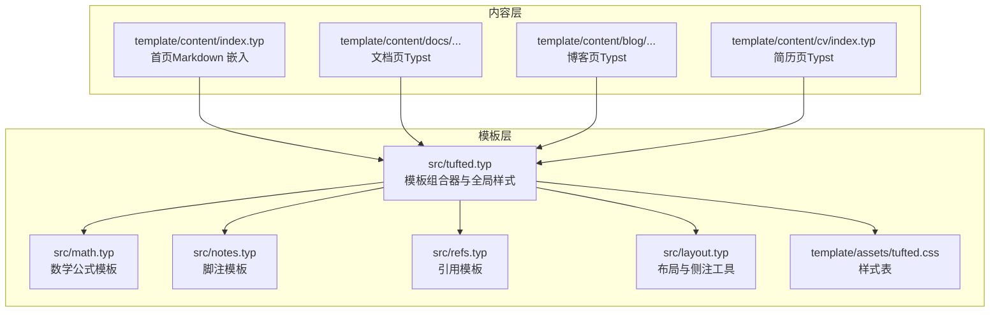
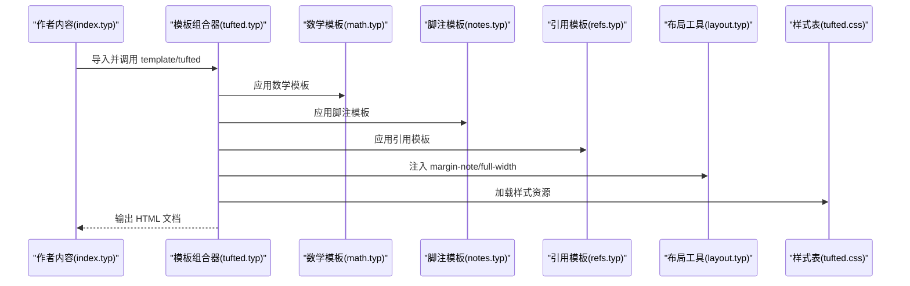
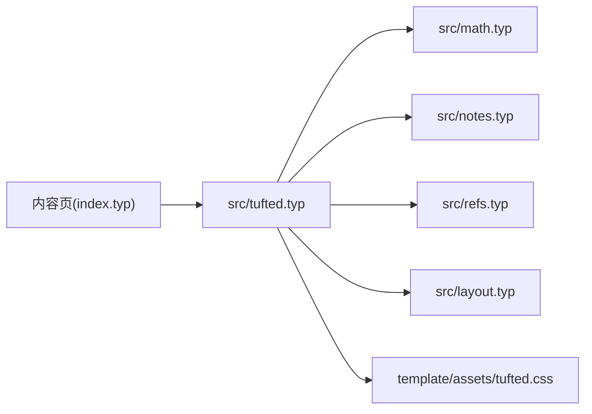

# 写作规范与最佳实践

<cite>
**本文引用的文件**
- [src/tufted.typ](file://src/tufted.typ)
- [src/layout.typ](file://src/layout.typ)
- [src/math.typ](file://src/math.typ)
- [src/notes.typ](file://src/notes.typ)
- [src/refs.typ](file://src/refs.typ)
- [template/content/docs/01-quick-start/index.typ](file://template/content/docs/01-quick-start/index.typ)
- [template/content/blog/2024-10-04-iterators-generators/index.typ](file://template/content/blog/2024-10-04-iterators-generators/index.typ)
- [template/content/blog/2025-04-16-monkeys-apes/index.typ](file://template/content/blog/2025-04-16-monkeys-apes/index.typ)
- [template/content/blog/2025-10-30-normal-distribution/index.typ](file://template/content/blog/2025-10-30-normal-distribution/index.typ)
- [template/content/blog/2025-10-30-normal-distribution/refs.bib](file://template/content/blog/2025-10-30-normal-distribution/refs.bib)
- [template/content/cv/index.typ](file://template/content/cv/index.typ)
- [template/content/index.typ](file://template/content/index.typ)
- [template/assets/tufted.css](file://template/assets/tufted.css)
- [template/content/docs/embedding-markdown/tufted-titmouse.md](file://template/content/docs/embedding-markdown/tufted-titmouse.md)
</cite>

## 目录
1. 引言
2. 项目结构
3. 核心组件
4. 架构总览
5. 组件详解
6. 依赖关系分析
7. 性能与可读性建议
8. 故障排查指南
9. 结论
10. 附录

## 引言
本指南面向在 TwilightPage 中使用 Typst 进行创作的作者，系统化地给出内容写作规范与最佳实践。内容覆盖标题层级、段落与列表、数学公式、代码块、引用与参考文献、侧注与脚注、多语言支持、可读性提升技巧、多语言注意事项、审核与质量控制流程，以及针对不同创作者（技术类、学术类、展示类）的专项建议。所有规则均以仓库中的模板与示例为依据，确保可落地、可复用。

## 项目结构
TwilightPage 的内容由“模板层”和“内容层”组成：模板层定义样式与渲染行为，内容层提供具体文章与页面。核心入口通过模板组合器加载并应用样式与功能模块。

图表来源
- [src/tufted.typ:1-64](file://src/tufted.typ#L1-L64)
- [src/math.typ:1-22](file://src/math.typ#L1-L22)
- [src/notes.typ:1-27](file://src/notes.typ#L1-L27)
- [src/refs.typ:1-23](file://src/refs.typ#L1-L23)
- [src/layout.typ:1-13](file://src/layout.typ#L1-L13)
- [template/assets/tufted.css:1-166](file://template/assets/tufted.css#L1-L166)
- [template/content/index.typ:1-33](file://template/content/index.typ#L1-L33)

章节来源
- [src/tufted.typ:1-64](file://src/tufted.typ#L1-L64)
- [template/content/index.typ:1-33](file://template/content/index.typ#L1-L33)

## 核心组件
- 模板组合器 tufted-web：统一注入数学、脚注、引用、图片等模板，并设置语言与样式资源。
- 数学模板 template-math：统一数学公式编号与 HTML 渲染角色。
- 脚注模板 template-notes：将脚注引用与脚注内容分别渲染到正文与边栏。
- 引用模板 template-refs：增强方程与标题引用显示。
- 布局与侧注工具：提供 margin-note 与 full-width 容器，用于边栏信息与全宽元素。
- 样式表：提供响应式布局、脚注高亮、数学图元适配等视觉约束。

章节来源
- [src/tufted.typ:17-63](file://src/tufted.typ#L17-L63)
- [src/math.typ:1-22](file://src/math.typ#L1-L22)
- [src/notes.typ:1-27](file://src/notes.typ#L1-L27)
- [src/refs.typ:1-23](file://src/refs.typ#L1-L23)
- [src/layout.typ:3-12](file://src/layout.typ#L3-L12)
- [template/assets/tufted.css:90-137](file://template/assets/tufted.css#L90-L137)

## 架构总览
下图展示了从内容到最终渲染的关键路径：内容文件导入模板，模板组合器应用各子模板，再由样式表驱动最终输出。

图表来源
- [src/tufted.typ:17-63](file://src/tufted.typ#L17-L63)
- [src/math.typ:1-22](file://src/math.typ#L1-L22)
- [src/notes.typ:1-27](file://src/notes.typ#L1-L27)
- [src/refs.typ:1-23](file://src/refs.typ#L1-L23)
- [src/layout.typ:3-12](file://src/layout.typ#L3-L12)
- [template/assets/tufted.css:1-166](file://template/assets/tufted.css#L1-L166)

## 组件详解

### 标题层级与段落格式
- 标题层级：使用等号数量表示层级，建议遵循“主标题一层、章节二层、子节三层”的递进关系；避免跨级跳跃。
- 段落：保持每段聚焦一个主题；长段落建议拆分为若干短句，提升可读性。
- 列表：使用无序列表表达要点；有序列表用于步骤或时间线；嵌套列表层级不宜超过三层。

章节来源
- [template/content/blog/2024-10-04-iterators-generators/index.typ:4-53](file://template/content/blog/2024-10-04-iterators-generators/index.typ#L4-L53)
- [template/content/blog/2025-04-16-monkeys-apes/index.typ:4-29](file://template/content/blog/2025-04-16-monkeys-apes/index.typ#L4-L29)
- [template/content/blog/2025-10-30-normal-distribution/index.typ:6-56](file://template/content/blog/2025-10-30-normal-distribution/index.typ#L6-L56)

### 数学公式
- 行内公式：使用单美元包裹；注意与文本连写时的空格与排版一致性。
- 独立公式：使用双美元或公式环境；模板会自动编号并按 HTML 角色渲染。
- 复杂公式：建议分步书写，配合简要说明；必要时使用图示辅助理解。

章节来源
- [src/math.typ:1-22](file://src/math.typ#L1-L22)
- [template/content/blog/2025-10-30-normal-distribution/index.typ:14-18](file://template/content/blog/2025-10-30-normal-distribution/index.typ#L14-L18)
- [template/content/docs/embedding-markdown/tufted-titmouse.md:9-11](file://template/content/docs/embedding-markdown/tufted-titmouse.md#L9-L11)

### 代码块
- 使用反引号围栏包裹代码块；明确指定语言以便语法高亮与可读性。
- 避免过长单行代码；必要时拆分为多个片段并添加说明。
- 示例：参见文档页与博客页中对 Shell 与 Python 代码块的使用。

章节来源
- [template/content/docs/01-quick-start/index.typ:10-21](file://template/content/docs/01-quick-start/index.typ#L10-L21)
- [template/content/blog/2024-10-04-iterators-generators/index.typ:12-26](file://template/content/blog/2024-10-04-iterators-generators/index.typ#L12-L26)
- [template/content/blog/2024-10-04-iterators-generators/index.typ:32-38](file://template/content/blog/2024-10-04-iterators-generators/index.typ#L32-L38)

### 引用与参考文献
- 方程引用：使用引用模板增强显示，确保编号与定位准确。
- 标题引用：引用模板会自动为标题添加引号与高亮提示。
- 参考文献：在内容末尾插入参考文献区域；条目格式遵循 BibTeX 规范。

章节来源
- [src/refs.typ:1-23](file://src/refs.typ#L1-L23)
- [template/content/blog/2025-10-30-normal-distribution/index.typ:55-56](file://template/content/blog/2025-10-30-normal-distribution/index.typ#L55-L56)
- [template/content/blog/2025-10-30-normal-distribution/refs.bib:1-34](file://template/content/blog/2025-10-30-normal-distribution/refs.bib#L1-L34)

### 侧注与脚注
- 脚注：用于补充说明、术语解释或溯源；引用与内容分别渲染至正文与边栏，鼠标悬停可联动高亮。
- 侧注：用于放置图片、图标、补充信息等；在窄屏设备上自动改为内联显示，保证可读性。
- 全宽元素：用于大图或复杂图示，需结合布局工具实现。

章节来源
- [src/notes.typ:1-27](file://src/notes.typ#L1-L27)
- [src/layout.typ:3-12](file://src/layout.typ#L3-L12)
- [template/assets/tufted.css:30-55](file://template/assets/tufted.css#L30-L55)
- [template/content/blog/2025-04-16-monkeys-apes/index.typ:8-10](file://template/content/blog/2025-04-16-monkeys-apes/index.typ#L8-L10)
- [template/content/cv/index.typ:7-11](file://template/content/cv/index.typ#L7-L11)

### 图片与图示
- 使用 figure 包裹图片与说明文字；支持独立图示与数据可视化。
- 在数学页中，通过内嵌图示函数生成统计图，提升直观性。

章节来源
- [template/content/blog/2024-10-04-iterators-generators/index.typ:46-46](file://template/content/blog/2024-10-04-iterators-generators/index.typ#L46-L46)
- [template/content/blog/2025-10-30-normal-distribution/index.typ:21-36](file://template/content/blog/2025-10-30-normal-distribution/index.typ#L21-L36)

### 多语言支持
- 设置语言：通过模板参数设置语言代码，影响文本方向、字符集与可访问性。
- 多语言内容：建议在标题与关键术语处保留原文并在首次出现时加注释；正文尽量采用清晰简洁的表达。

章节来源
- [src/tufted.typ:17-35](file://src/tufted.typ#L17-L35)

### 可读性提升技巧
- 控制行宽与字间距：使用默认字体大小与行距，避免过宽段落。
- 合理断词：在窄屏设备启用断词，减少长单词溢出。
- 高对比度：深色模式下数学图元自动反色，提升阅读体验。

章节来源
- [template/assets/tufted.css:16-23](file://template/assets/tufted.css#L16-L23)
- [template/assets/tufted.css:51-54](file://template/assets/tufted.css#L51-L54)
- [template/assets/tufted.css:131-137](file://template/assets/tufted.css#L131-L137)

### 多语言注意事项
- 避免混合语言夹杂：同一段落尽量统一语言，必要时用括号标注音译或解释。
- 字体与字符集：确保所选字体覆盖目标语言字符集；模板已设置 UTF-8 与 viewport。
- 本地化链接与日期：根据语言选择合适的日期与链接格式。

章节来源
- [src/tufted.typ:40-49](file://src/tufted.typ#L40-L49)

### 内容审核与质量控制流程
- 结构检查：逐级核对标题层级、段落与列表逻辑。
- 公式与引用：校对公式编号、引用位置与参考文献条目。
- 视觉一致性：检查脚注高亮、侧注显示、数学图元对比度与断词效果。
- 多设备验证：在桌面与移动端预览，确认窄屏下侧注内联与图片缩放正常。
- 回归测试：每次更新模板后，重新构建代表性页面进行比对。

章节来源
- [src/notes.typ:1-27](file://src/notes.typ#L1-L27)
- [src/math.typ:1-22](file://src/math.typ#L1-L22)
- [template/assets/tufted.css:30-55](file://template/assets/tufted.css#L30-L55)

### 针对不同创作者的写作指导
- 技术类作者
  - 使用代码块与图示结合，逐步讲解算法或流程。
  - 将复杂公式拆解为多行并辅以说明。
  - 用脚注提供背景知识或术语解释。
  - 示例参考：迭代器与生成器、正态分布。
- 学术类作者
  - 规范引用格式，确保方程与章节引用一致。
  - 在文末集中列出参考文献，条目完整。
  - 使用侧注补充数据来源或致谢。
  - 示例参考：正态分布页的参考文献与图示。
- 展示类作者
  - 以图片与侧注为主，文字精炼，突出要点。
  - 使用全宽容器承载大图或图示。
  - 示例参考：简历页的侧注与作品介绍。

章节来源
- [template/content/blog/2024-10-04-iterators-generators/index.typ:4-53](file://template/content/blog/2024-10-04-iterators-generators/index.typ#L4-L53)
- [template/content/blog/2025-10-30-normal-distribution/index.typ:6-56](file://template/content/blog/2025-10-30-normal-distribution/index.typ#L6-L56)
- [template/content/cv/index.typ:7-29](file://template/content/cv/index.typ#L7-L29)

## 依赖关系分析
模板组合器集中注入各子模板，形成“模板即规范”的约束机制；内容层仅负责业务信息，不直接处理样式细节，降低耦合度。

图表来源
- [src/tufted.typ:17-63](file://src/tufted.typ#L17-L63)
- [src/math.typ:1-22](file://src/math.typ#L1-L22)
- [src/notes.typ:1-27](file://src/notes.typ#L1-L27)
- [src/refs.typ:1-23](file://src/refs.typ#L1-L23)
- [src/layout.typ:3-12](file://src/layout.typ#L3-L12)
- [template/assets/tufted.css:1-166](file://template/assets/tufted.css#L1-L166)

## 性能与可读性建议
- 减少冗余图示：仅在必要时插入复杂图示，避免阻塞渲染。
- 控制侧注密度：过多侧注会影响正文阅读节奏，建议每段不超过一处。
- 优化公式结构：长公式分行书写并分步解释，减少一次性信息量。
- 使用响应式设计：确保窄屏下脚注与侧注内联显示，提升移动阅读体验。

## 故障排查指南
- 脚注无法跳转
  - 检查引用与脚注 ID 是否匹配；确认模板已应用脚注模板。
- 数学公式未编号或未高亮
  - 确认使用了正确的公式环境；检查数学模板是否被注入。
- 侧注在窄屏不显示
  - 查看 CSS 对窄屏的内联策略；调整侧注内容长度。
- 引用编号错乱
  - 校对引用位置与编号序列；确保引用模板生效。
- 多语言显示异常
  - 检查语言参数与字符集设置；确认字体覆盖范围。

章节来源
- [src/notes.typ:1-27](file://src/notes.typ#L1-L27)
- [src/math.typ:1-22](file://src/math.typ#L1-L22)
- [src/refs.typ:1-23](file://src/refs.typ#L1-L23)
- [template/assets/tufted.css:30-55](file://template/assets/tufted.css#L30-L55)
- [src/tufted.typ:17-35](file://src/tufted.typ#L17-L35)

## 结论
通过模板化的规范约束与示例指引，TwilightPage 能够帮助不同领域的创作者以一致、清晰且美观的方式呈现内容。建议在日常写作中遵循本文规范，并结合自身领域特点进行微调，持续优化可读性与传播效果。

## 附录
- 快速参考
  - 标题层级：使用等号数量表示层级，避免跨级。
  - 公式：行内单美元，独立双美元或环境；模板自动编号。
  - 代码：围栏 + 语言标识；必要时拆分说明。
  - 引用：方程与标题引用由模板增强；参考文献集中列出。
  - 侧注：图片与说明；窄屏内联；全宽图示使用布局工具。
  - 多语言：设置语言参数；确保字符集与字体覆盖。
  - 审核：结构、公式、引用、视觉一致性、多设备验证。