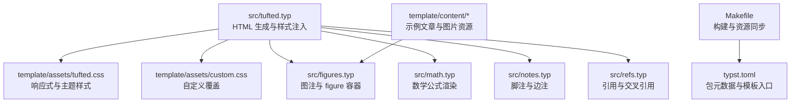
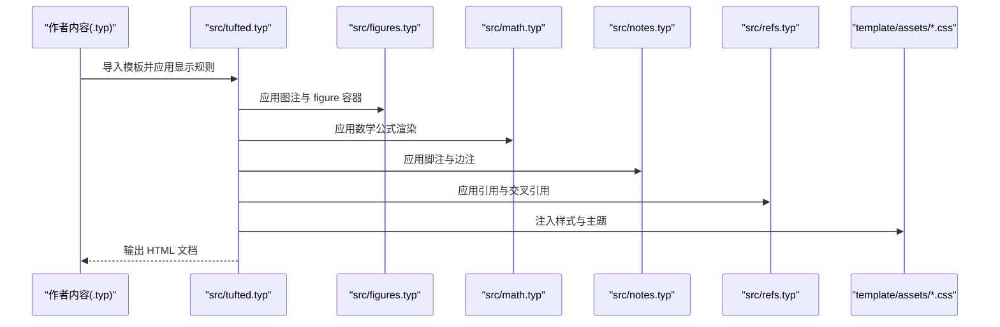
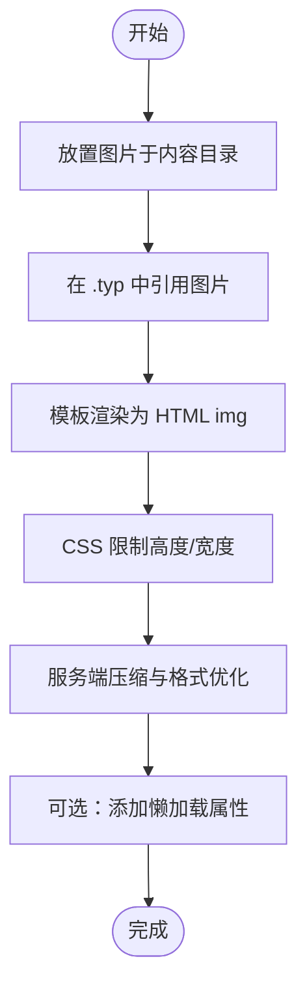
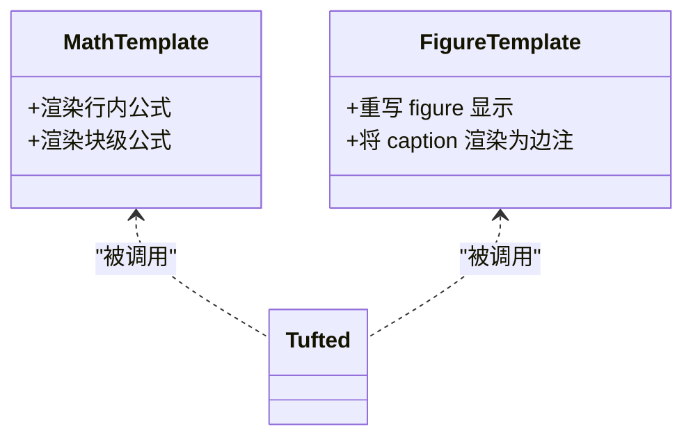
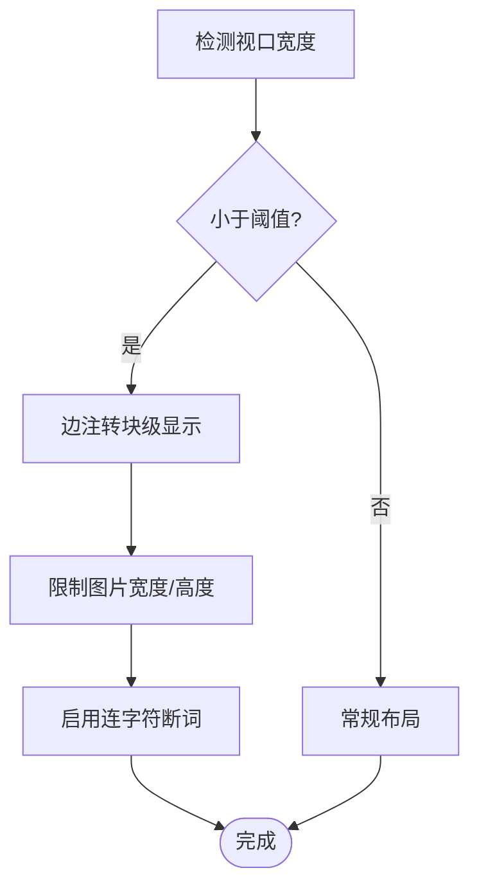
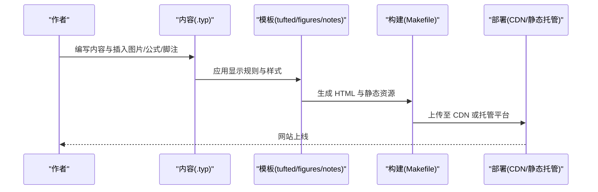
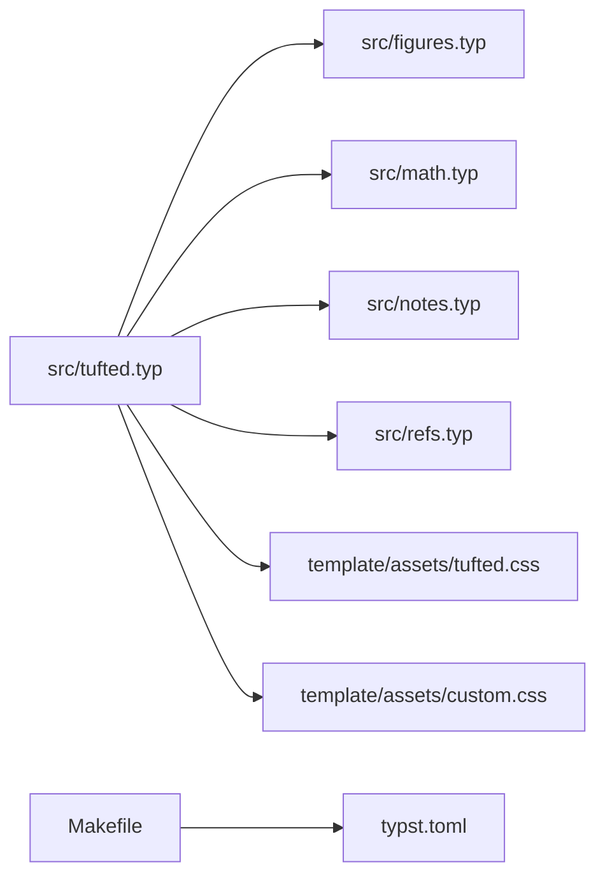

# 多媒体内容处理

<cite>
**本文引用的文件**
- [src/tufted.typ](file://src/tufted.typ)
- [src/layout.typ](file://src/layout.typ)
- [src/figures.typ](file://src/figures.typ)
- [src/math.typ](file://src/math.typ)
- [src/notes.typ](file://src/notes.typ)
- [src/refs.typ](file://src/refs.typ)
- [template/assets/tufted.css](file://template/assets/tufted.css)
- [template/assets/custom.css](file://template/assets/custom.css)
- [template/content/blog/2024-10-04-iterators-generators/index.typ](file://template/content/blog/2024-10-04-iterators-generators/index.typ)
- [template/content/blog/2025-04-16-monkeys-apes/index.typ](file://template/content/blog/2025-04-16-monkeys-apes/index.typ)
- [Makefile](file://Makefile)
- [typst.toml](file://typst.toml)
</cite>

## 目录
1. [简介](#简介)
2. [项目结构](#项目结构)
3. [核心组件](#核心组件)
4. [架构总览](#架构总览)
5. [详细组件分析](#详细组件分析)
6. [依赖分析](#依赖分析)
7. [性能考虑](#性能考虑)
8. [故障排查指南](#故障排查指南)
9. [结论](#结论)
10. [附录](#附录)

## 简介
本指南围绕 TwilightPage（基于 Typst 的 tufted 模板）在“多媒体内容处理”方面的实现与最佳实践展开，重点覆盖：
- 图片上传、存储与优化：如何在模板中组织与引用图片资源，并结合 CSS 实现响应式展示与性能优化。
- 视频与音频嵌入：当前模板未直接提供视频/音频组件，但可基于 HTML 嵌入与样式进行扩展。
- 图表与可视化：通过数学公式渲染与自定义 figure 容器实现图表与可视化内容的排版与展示。
- 响应式适配与性能优化：利用现有 CSS 变量、媒体查询与图片限制策略提升移动端体验。
- 缓存与 CDN 配置：构建流程与静态资源分发建议。
- SEO 优化策略：标题层级、元信息与可读性。
- 无障碍访问支持：语义化标签与交互元素的可用性。
- 版权与法律注意事项：图片与资源的版权合规建议。
- 内容创作者工作流：从素材准备到生成部署的完整流程。

## 项目结构
该仓库采用 Typst 模板结构，核心由以下部分组成：
- 模板入口与布局：src/tufted.typ 负责生成 HTML 结构、引入样式与语言设置。
- 排版与显示模板：src/figures.typ、src/math.typ、src/notes.typ、src/refs.typ 分别负责图注、数学公式、脚注与引用。
- 样式层：template/assets/tufted.css 提供响应式与主题样式；template/assets/custom.css 用于用户自定义覆盖。
- 示例内容：template/content 下包含博客文章与文档示例，演示图片插入与边注使用。
- 构建与打包：Makefile 提供链接本地包、同步资源、清理与打包等目标；typst.toml 描述包元数据与模板入口。

**图表来源**
- [src/tufted.typ:17-63](file://src/tufted.typ#L17-L63)
- [template/assets/tufted.css:16-23](file://template/assets/tufted.css#L16-L23)
- [template/assets/custom.css:1-1](file://template/assets/custom.css#L1-L1)
- [src/figures.typ:3-19](file://src/figures.typ#L3-L19)
- [src/math.typ:1-22](file://src/math.typ#L1-L22)
- [src/notes.typ:1-27](file://src/notes.typ#L1-L27)
- [src/refs.typ:1-23](file://src/refs.typ#L1-L23)
- [Makefile:38-44](file://Makefile#L38-L44)
- [typst.toml:15-19](file://typst.toml#L15-L19)

**章节来源**
- [src/tufted.typ:17-63](file://src/tufted.typ#L17-L63)
- [Makefile:38-44](file://Makefile#L38-L44)
- [typst.toml:15-19](file://typst.toml#L15-L19)

## 核心组件
- HTML 生成与样式注入：模板在 head 中注入多份 CSS（含外部 tufte-css 与本地样式），并在 body 中输出文章主体与导航。
- 图注与 figure 容器：重写 figure 显示逻辑，将 caption 渲染为边注样式，figure 本身包裹为 HTML figure。
- 数学公式渲染：根据块级或行内模式分别渲染为 span 或 figure，并赋予 role 属性以支持主题反转与高对比度。
- 脚注与边注：将脚注引用与脚注内容分别渲染为上标链接与边注容器，配合 margin-note 类实现响应式布局。
- 引用系统：对数学公式与标题等元素提供智能引用与编号映射。

**章节来源**
- [src/tufted.typ:36-62](file://src/tufted.typ#L36-L62)
- [src/figures.typ:3-19](file://src/figures.typ#L3-L19)
- [src/math.typ:1-22](file://src/math.typ#L1-L22)
- [src/notes.typ:1-27](file://src/notes.typ#L1-L27)
- [src/refs.typ:1-23](file://src/refs.typ#L1-L23)

## 架构总览
下图展示了从内容到最终 HTML 的关键路径与样式注入关系：

**图表来源**
- [src/tufted.typ:29-32](file://src/tufted.typ#L29-L32)
- [src/figures.typ:3-19](file://src/figures.typ#L3-L19)
- [src/math.typ:1-22](file://src/math.typ#L1-L22)
- [src/notes.typ:1-27](file://src/notes.typ#L1-L27)
- [src/refs.typ:1-23](file://src/refs.typ#L1-L23)
- [src/tufted.typ:46-48](file://src/tufted.typ#L46-L48)

## 详细组件分析

### 图片上传、存储与优化
- 资源组织：示例文章通过相对路径引用图片资源，如示例中的图片目录与引用方式。
- 响应式与尺寸控制：CSS 对 img/svg 设置最大高度与视口比例，确保在窄屏设备上不溢出。
- 边注图片：边注容器在窄屏下自动转为块级显示并限制宽度，避免拥挤。
- 最佳实践建议：
  - 使用现代格式（如 WebP）并按需压缩，减少体积。
  - 为不同 DPR 提供多尺寸资源，必要时使用 srcset（可在 HTML 层扩展）。
  - 为关键图片启用懒加载与占位符，改善首屏性能。
  - 在服务器端配置合适的 MIME 类型与缓存头。

**图表来源**
- [template/content/blog/2024-10-04-iterators-generators/index.typ:46-46](file://template/content/blog/2024-10-04-iterators-generators/index.typ#L46-L46)
- [template/assets/tufted.css:20-23](file://template/assets/tufted.css#L20-L23)
- [template/assets/tufted.css:30-55](file://template/assets/tufted.css#L30-L55)

**章节来源**
- [template/content/blog/2024-10-04-iterators-generators/index.typ:46-46](file://template/content/blog/2024-10-04-iterators-generators/index.typ#L46-L46)
- [template/assets/tufted.css:20-23](file://template/assets/tufted.css#L20-L23)
- [template/assets/tufted.css:30-55](file://template/assets/tufted.css#L30-L55)

### 视频嵌入与音频播放
- 当前模板未内置视频/音频组件，但可通过 HTML 原生元素在 .typ 中嵌入。
- 建议：
  - 使用 video/audio 元素并提供多种编码格式以兼容浏览器。
  - 为视频提供 poster 图片，音频提供图标。
  - 控制默认播放与循环行为，尊重用户偏好。
  - 为视频添加字幕轨道与音频描述（无障碍）。
  - 为移动端提供合适的尺寸与方向控制。

[本节为概念性指导，不直接分析具体文件，故无“章节来源”]

### 图表与可视化内容
- 数学公式：块级与行内模式分别渲染为 figure 或 span，并带有 role 属性，便于主题切换与高对比度显示。
- 自定义 figure：通过重写 figure 显示逻辑，将 caption 渲染为边注样式，实现图文混排与注释一体化。
- 建议：
  - 将图表导出为矢量格式（SVG）以保证缩放清晰度。
  - 为复杂图表提供简短标题与详细说明，便于屏幕阅读器识别。
  - 使用语义化 role 与可访问名称，提升无障碍体验。

**图表来源**
- [src/math.typ:1-22](file://src/math.typ#L1-L22)
- [src/figures.typ:3-19](file://src/figures.typ#L3-L19)
- [src/tufted.typ:29-32](file://src/tufted.typ#L29-L32)

**章节来源**
- [src/math.typ:1-22](file://src/math.typ#L1-L22)
- [src/figures.typ:3-19](file://src/figures.typ#L3-L19)

### 响应式适配与性能优化
- 媒体查询：针对窄屏设备，边注转为块级显示并限制图片宽度，同时开启连字符断词提升可读性。
- 图片限制：全局限制 img/svg 的最大高度，避免长图撑破页面。
- 字体与主题：提供深色模式下的数学公式反色处理，增强对比度。
- 性能建议：
  - 合理使用 CSS 变量与媒体查询，减少重复样式。
  - 将第三方样式置于外部链接，利用浏览器缓存。
  - 在构建阶段合并与压缩 CSS，减少请求数量。

**图表来源**
- [template/assets/tufted.css:30-55](file://template/assets/tufted.css#L30-L55)
- [template/assets/tufted.css:20-23](file://template/assets/tufted.css#L20-L23)
- [template/assets/tufted.css:131-137](file://template/assets/tufted.css#L131-L137)

**章节来源**
- [template/assets/tufted.css:30-55](file://template/assets/tufted.css#L30-L55)
- [template/assets/tufted.css:20-23](file://template/assets/tufted.css#L20-L23)
- [template/assets/tufted.css:131-137](file://template/assets/tufted.css#L131-L137)

### 缓存与 CDN 配置
- 构建与资源同步：Makefile 提供资源同步目标，将模板资产复制到站点资源目录。
- 发布建议：
  - 将静态资源（CSS、JS、图片）置于 CDN，设置合理的缓存头（如 max-age、immutable）。
  - 为版本化的资源文件启用长缓存，非版本化文件设置短期缓存。
  - 使用 HTTP/2 或 HTTP/3 以降低延迟。
  - 在边缘节点启用压缩（Gzip/Brotli）与图片优化（WebP/AVIF）。

**章节来源**
- [Makefile:38-44](file://Makefile#L38-L44)

### SEO 优化策略
- 标题层级：保持 h1-h6 的语义化顺序，突出主标题与小节标题。
- 元信息：在模板 head 中设置 charset、viewport、title 与描述（可在模板中扩展）。
- 可读性：利用连字符断词与合适的字体大小，提升移动端可读性。
- 结构化内容：为图表与公式提供可读的标题与说明，便于搜索引擎理解。

**章节来源**
- [src/tufted.typ:41-48](file://src/tufted.typ#L41-L48)
- [template/assets/tufted.css:52-54](file://template/assets/tufted.css#L52-L54)

### 无障碍访问支持
- 语义化标签：数学公式使用 role 属性，脚注引用使用上标与链接，边注容器提供可聚焦状态。
- 主题适配：深色模式下对数学公式进行反色处理，提升对比度。
- 交互提示：边注与脚注在悬停时提供高亮反馈，便于键盘导航用户定位。
- 建议：
  - 为图片提供 alt 文本（在 HTML 层扩展）。
  - 为视频提供字幕与音频描述。
  - 确保键盘可达与焦点可见性。

**章节来源**
- [src/math.typ:126-129](file://src/math.typ#L126-L129)
- [src/notes.typ:8-22](file://src/notes.typ#L8-L22)
- [template/assets/tufted.css:104-113](file://template/assets/tufted.css#L104-L113)

### 版权与法律注意事项
- 图片与资源版权：在使用第三方图片时，务必确认许可协议（如 CC 许可、免版税图库等），并在适当位置注明来源。
- 水印与免责声明：如模板或主题中包含版权标识，请保留并遵守其使用条款。
- 隐私与数据：若涉及用户上传内容，需遵循隐私政策与数据保护法规（如 GDPR）。

[本节为通用指导，不直接分析具体文件，故无“章节来源”]

### 内容创作者工作流
- 素材准备：统一图片命名与格式，建立资源目录规范。
- 内容编写：在 .typ 中使用 figure 与 margin-note 组织图文与边注。
- 样式定制：通过 custom.css 扩展样式，保持与主题一致的视觉风格。
- 构建与发布：使用 Makefile 的构建目标生成 HTML 并同步资源，随后部署至 CDN 或静态托管平台。

**图表来源**
- [Makefile:54-55](file://Makefile#L54-L55)
- [src/tufted.typ:29-32](file://src/tufted.typ#L29-L32)
- [src/figures.typ:3-19](file://src/figures.typ#L3-L19)
- [src/notes.typ:1-27](file://src/notes.typ#L1-L27)

**章节来源**
- [Makefile:54-55](file://Makefile#L54-L55)
- [src/tufted.typ:29-32](file://src/tufted.typ#L29-L32)

## 依赖分析
- 模板入口依赖各子模板：tufted 模板导入并应用 figures、math、notes、refs 的显示规则。
- 样式依赖：HTML head 中引入外部 tufte-css 与本地样式，形成主题与响应式基础。
- 构建依赖：Makefile 依赖 typst.toml 的版本与模板入口，执行链接、同步与打包。

**图表来源**
- [src/tufted.typ:29-32](file://src/tufted.typ#L29-L32)
- [src/figures.typ:3-19](file://src/figures.typ#L3-L19)
- [src/math.typ:1-22](file://src/math.typ#L1-L22)
- [src/notes.typ:1-27](file://src/notes.typ#L1-L27)
- [src/refs.typ:1-23](file://src/refs.typ#L1-L23)
- [Makefile:2-2](file://Makefile#L2-L2)
- [typst.toml:15-19](file://typst.toml#L15-L19)

**章节来源**
- [src/tufted.typ:29-32](file://src/tufted.typ#L29-L32)
- [Makefile:2-2](file://Makefile#L2-L2)
- [typst.toml:15-19](file://typst.toml#L15-L19)

## 性能考虑
- 图片优化：优先使用现代格式与压缩，控制尺寸与分辨率，避免超大图。
- 样式优化：合并与压缩 CSS，减少请求次数；合理使用媒体查询，避免过度嵌套。
- 构建优化：在构建阶段进行资源同步与清理，减少冗余文件。
- 运行时优化：利用 CDN 缓存与边缘优化，提升全球访问速度。

[本节提供通用指导，不直接分析具体文件，故无“章节来源”]

## 故障排查指南
- 图片不显示或错位：
  - 检查图片路径是否正确，确保与内容目录一致。
  - 查看 CSS 是否限制了图片高度或宽度，必要时调整自定义样式。
- 边注在窄屏下异常：
  - 确认媒体查询生效，检查自定义 CSS 是否覆盖了响应式规则。
- 数学公式显示问题：
  - 确认 role 属性是否正确设置，深色模式下是否需要额外的反色处理。
- 构建失败：
  - 检查 Makefile 中的构建目标与 typst.toml 的入口配置，确保版本匹配。

**章节来源**
- [template/assets/tufted.css:30-55](file://template/assets/tufted.css#L30-L55)
- [src/math.typ:126-129](file://src/math.typ#L126-L129)
- [Makefile:54-55](file://Makefile#L54-L55)

## 结论
TwilightPage 的 tufted 模板为多媒体内容提供了良好的基础：通过图注与 figure 容器实现图文混排，借助数学公式渲染与脚注系统完善内容结构，配合响应式 CSS 保障跨设备体验。在此基础上，内容创作者可进一步扩展视频/音频嵌入、优化图片与图表资源、完善 SEO 与无障碍设置，并通过 CDN 与缓存策略提升性能与可访问性。

## 附录
- 快速开始与构建：参考文档示例与 Makefile 目标，完成初始化与构建。
- 资源同步：使用 Makefile 的资源同步目标，确保模板资产正确复制到站点目录。

**章节来源**
- [template/content/docs/01-quick-start/index.typ:17-23](file://template/content/docs/01-quick-start/index.typ#L17-L23)
- [Makefile:38-44](file://Makefile#L38-L44)