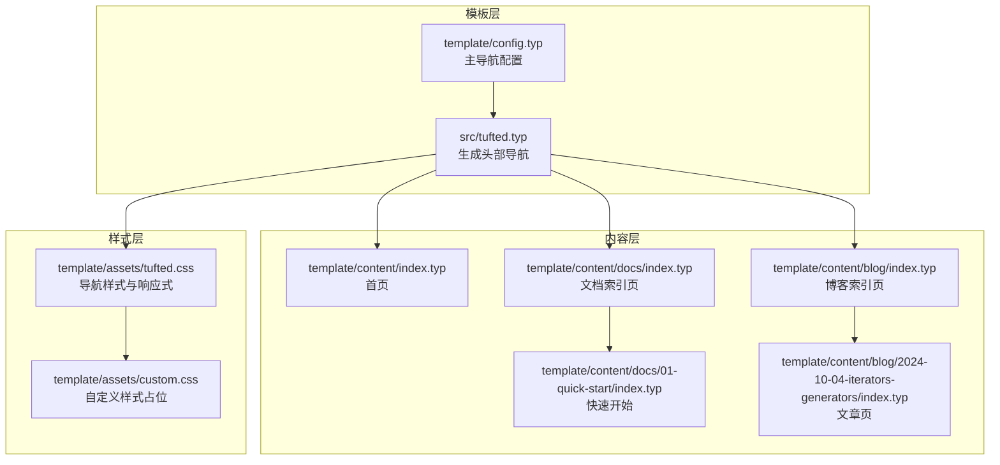
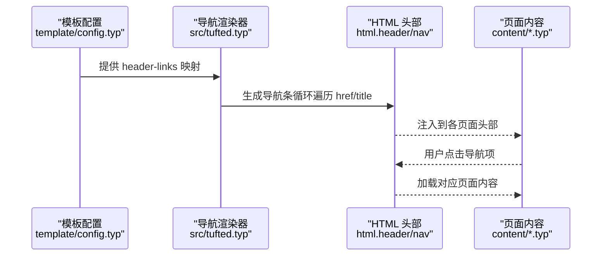
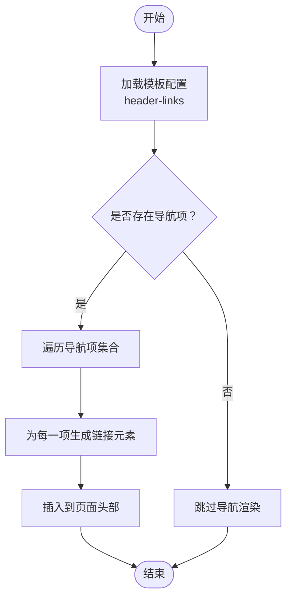
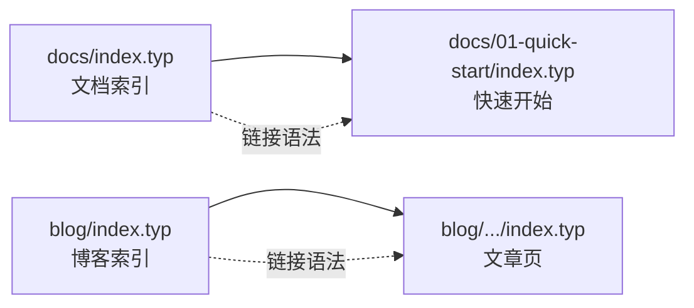
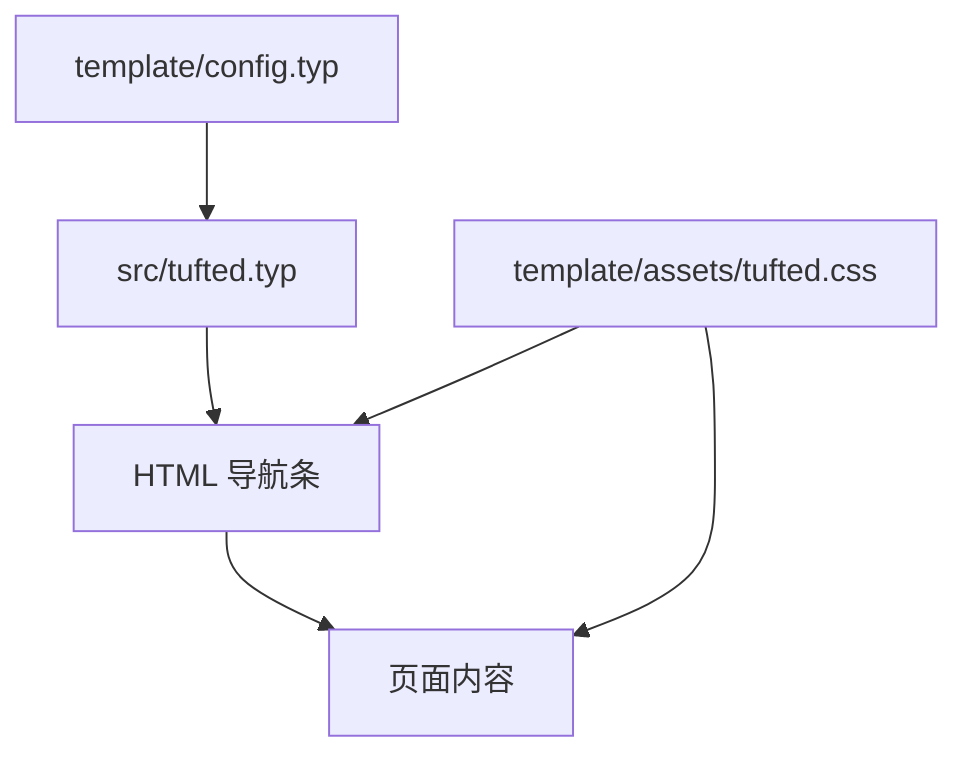

# 导航系统设计

<cite>
**本文引用的文件**
- [src/tufted.typ](file://src/tufted.typ)
- [src/layout.typ](file://src/layout.typ)
- [src/notes.typ](file://src/notes.typ)
- [src/refs.typ](file://src/refs.typ)
- [template/config.typ](file://template/config.typ)
- [template/assets/tufted.css](file://template/assets/tufted.css)
- [template/assets/custom.css](file://template/assets/custom.css)
- [template/content/index.typ](file://template/content/index.typ)
- [template/content/docs/index.typ](file://template/content/docs/index.typ)
- [template/content/docs/01-quick-start/index.typ](file://template/content/docs/01-quick-start/index.typ)
- [template/content/blog/index.typ](file://template/content/blog/index.typ)
- [template/content/blog/2024-10-04-iterators-generators/index.typ](file://template/content/blog/2024-10-04-iterators-generators/index.typ)
- [typst.toml](file://typst.toml)
</cite>

## 目录
1. [简介](#简介)
2. [项目结构](#项目结构)
3. [核心组件](#核心组件)
4. [架构总览](#架构总览)
5. [详细组件分析](#详细组件分析)
6. [依赖分析](#依赖分析)
7. [性能考虑](#性能考虑)
8. [故障排查指南](#故障排查指南)
9. [结论](#结论)
10. [附录](#附录)

## 简介
本指南围绕 TwilightPage（基于 Tufted 模板）的导航系统进行系统化设计说明，重点覆盖：
- 主导航菜单的结构与实现方式
- 子页面链接的建立与维护
- 面包屑导航的设计原理与配置选项
- 页面间关系的建立与管理策略
- 导航状态保持与用户体验优化
- 导航菜单的自定义与扩展方法
- 响应式导航的设计考虑
- 导航性能优化与缓存策略
- 面向二次开发者的实践建议

## 项目结构
TwilightPage 的导航系统由“模板配置”“页面内容”“样式表”三部分协同构成：
- 模板层：通过模板入口配置主导航菜单项，并在页面中注入到 HTML 头部导航区
- 内容层：使用链接语法组织子页面与层级关系
- 样式层：通过 CSS 控制导航栏的布局、交互与响应式行为

图表来源
- [template/config.typ:1-12](file://template/config.typ#L1-L12)
- [src/tufted.typ:7-15](file://src/tufted.typ#L7-L15)
- [template/assets/tufted.css:58-88](file://template/assets/tufted.css#L58-L88)

章节来源
- [typst.toml:15-19](file://typst.toml#L15-L19)
- [template/config.typ:1-12](file://template/config.typ#L1-L12)
- [src/tufted.typ:7-15](file://src/tufted.typ#L7-L15)

## 核心组件
- 主导航配置：在模板配置中声明导航项集合，键为路径，值为显示标题
- 导航渲染器：根据传入的导航项集合生成 HTML 导航条
- 页面链接语法：在内容页中使用链接语法建立父子页面关系
- 导航样式与交互：通过 CSS 实现导航项的排版、悬停与焦点态
- 响应式设计：在窄屏设备上调整导航展示与交互体验

章节来源
- [template/config.typ:3-11](file://template/config.typ#L3-L11)
- [src/tufted.typ:7-15](file://src/tufted.typ#L7-L15)
- [template/content/docs/index.typ:8-15](file://template/content/docs/index.typ#L8-L15)
- [template/content/blog/index.typ:8-13](file://template/content/blog/index.typ#L8-L13)
- [template/assets/tufted.css:62-87](file://template/assets/tufted.css#L62-L87)

## 架构总览
下图展示了从模板配置到页面渲染的导航数据流：

图表来源
- [template/config.typ:3-11](file://template/config.typ#L3-L11)
- [src/tufted.typ:7-15](file://src/tufted.typ#L7-L15)

## 详细组件分析

### 主导航菜单结构与实现
- 数据结构：以键值对形式存储导航项，键为相对路径，值为显示文本
- 渲染逻辑：遍历导航项集合，为每个项生成一个链接元素
- 注入位置：在页面 HTML 的头部区域插入导航条

图表来源
- [template/config.typ:3-11](file://template/config.typ#L3-L11)
- [src/tufted.typ:7-15](file://src/tufted.typ#L7-L15)

章节来源
- [template/config.typ:3-11](file://template/config.typ#L3-L11)
- [src/tufted.typ:7-15](file://src/tufted.typ#L7-L15)

### 子页面链接的建立与维护
- 文档索引页：使用链接语法组织子章节，形成文档层级
- 博客索引页：按年份分组列出文章条目，便于浏览
- 维护策略：新增页面时同步更新索引页与导航配置；保持路径一致性与语义化命名

图表来源
- [template/content/docs/index.typ:8-15](file://template/content/docs/index.typ#L8-L15)
- [template/content/blog/index.typ:8-13](file://template/content/blog/index.typ#L8-L13)
- [template/content/docs/01-quick-start/index.typ:1-24](file://template/content/docs/01-quick-start/index.typ#L1-L24)
- [template/content/blog/2024-10-04-iterators-generators/index.typ:1-53](file://template/content/blog/2024-10-04-iterators-generators/index.typ#L1-L53)

章节来源
- [template/content/docs/index.typ:8-15](file://template/content/docs/index.typ#L8-L15)
- [template/content/blog/index.typ:8-13](file://template/content/blog/index.typ#L8-L13)

### 面包屑导航的设计原理与配置选项
- 设计原理：通过页面层级与路径片段推导出导航序列，帮助用户识别当前位置并快速返回上级
- 配置选项：可扩展导航渲染器以支持动态生成面包屑；在页面上下文中注入当前路径与父级信息
- 实施建议：在模板层增加面包屑生成函数，结合页面元信息输出面包屑 HTML 结构

[本节为概念性说明，不直接分析具体文件，故无章节来源]

### 页面间关系的建立与管理策略
- 关系建立：使用链接语法在内容页之间建立显式关系；索引页作为聚合入口
- 管理策略：统一命名规范、版本化索引、定期审查失效链接；在构建阶段加入链接有效性检查

章节来源
- [template/content/docs/index.typ:8-15](file://template/content/docs/index.typ#L8-L15)
- [template/content/blog/index.typ:8-13](file://template/content/blog/index.typ#L8-L13)

### 导航状态保持与用户体验优化
- 状态保持：通过 CSS 焦点态与悬停态增强导航反馈；避免闪烁与跳动
- 交互优化：控制过渡时间与背景色变化；确保键盘可达性与高对比度
- 可访问性：保留基础链接样式，提供可见焦点指示

章节来源
- [template/assets/tufted.css:67-87](file://template/assets/tufted.css#L67-L87)

### 导航菜单的自定义与扩展
- 自定义样式：在自定义样式文件中覆盖默认导航样式，或引入主题变量
- 扩展功能：在模板层增加更多导航变体（如下拉菜单、搜索框），并通过配置开关启用
- 组件化：将导航渲染器抽象为可复用模块，支持多站点共享

章节来源
- [template/assets/custom.css:1](file://template/assets/custom.css#L1)
- [src/tufted.typ:7-15](file://src/tufted.typ#L7-L15)

### 响应式导航的设计考虑
- 移动优先：在窄屏断点内调整导航布局与间距，保证可读性与可点击面积
- 交互适配：在小屏设备上优化悬停效果，采用触摸友好的交互模式
- 字体与留白：根据断点调整字号与边距，提升移动端阅读体验

章节来源
- [template/assets/tufted.css:30-55](file://template/assets/tufted.css#L30-L55)
- [src/tufted.typ:42](file://src/tufted.typ#L42)

### 导航性能优化与缓存策略
- 资源优化：合并与压缩样式文件；利用浏览器缓存策略减少重复加载
- 渲染优化：避免在导航渲染中执行重型计算；保持 DOM 结构简洁
- 缓存策略：静态资源设置长期缓存；模板变更时通过版本号或指纹规避缓存污染

[本节为通用性能建议，不直接分析具体文件，故无章节来源]

## 依赖分析
- 模板配置依赖于导航渲染器，后者负责将配置映射为 HTML
- 页面内容依赖于模板注入的导航条，同时通过链接语法维护页面关系
- 样式层依赖于导航选择器与断点规则，共同决定导航外观与行为

图表来源
- [template/config.typ:3-11](file://template/config.typ#L3-L11)
- [src/tufted.typ:7-15](file://src/tufted.typ#L7-L15)
- [template/assets/tufted.css:62-87](file://template/assets/tufted.css#L62-L87)

章节来源
- [template/config.typ:3-11](file://template/config.typ#L3-L11)
- [src/tufted.typ:7-15](file://src/tufted.typ#L7-L15)
- [template/assets/tufted.css:62-87](file://template/assets/tufted.css#L62-L87)

## 性能考虑
- 减少重绘与回流：在导航样式中避免频繁触发布局的属性修改
- 降低脚本开销：导航为纯静态 HTML，无需 JavaScript 交互
- 图片与字体：在窄屏断点内限制图片尺寸，避免额外的网络与渲染压力

[本节为通用性能建议，不直接分析具体文件，故无章节来源]

## 故障排查指南
- 导航不显示：检查模板配置中的导航项是否正确传入渲染器
- 链接无效：核对内容页中的链接路径与实际目录结构一致
- 样式异常：确认样式文件加载顺序与断点规则未被覆盖
- 移动端显示问题：验证窄屏断点内的样式规则是否生效

章节来源
- [template/config.typ:3-11](file://template/config.typ#L3-L11)
- [template/content/docs/index.typ:8-15](file://template/content/docs/index.typ#L8-L15)
- [template/assets/tufted.css:30-55](file://template/assets/tufted.css#L30-L55)

## 结论
TwilightPage 的导航系统以简洁的配置驱动与清晰的内容组织为核心，配合响应式样式与良好的交互细节，实现了易维护、可扩展且用户体验优良的导航方案。开发者可在不破坏现有结构的前提下，通过配置与样式扩展实现更丰富的导航能力。

[本节为总结性内容，不直接分析具体文件，故无章节来源]

## 附录
- 开发者二次开发建议
  - 在模板配置中集中管理导航项，避免分散硬编码
  - 使用语义化命名与层级化目录，便于索引与链接维护
  - 在自定义样式中遵循变量与断点约定，确保跨页面一致性
  - 在构建流程中加入链接校验与样式检查，保障质量

[本节为实践建议，不直接分析具体文件，故无章节来源]