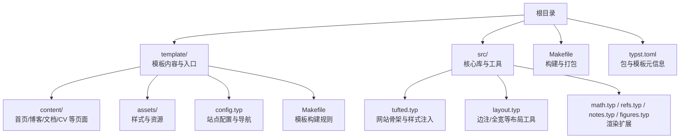
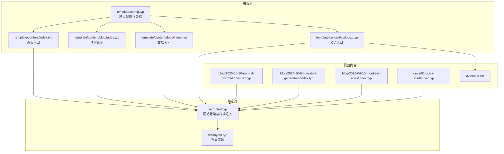
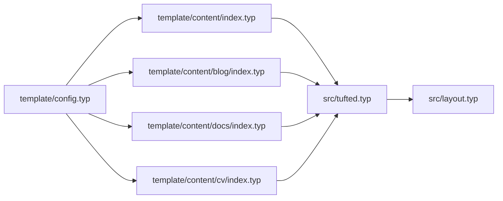

# 页面结构与组织

<cite>
**本文引用的文件**
- [template/README.md](file://template/README.md)
- [template/config.typ](file://template/config.typ)
- [template/content/index.typ](file://template/content/index.typ)
- [template/content/blog/index.typ](file://template/content/blog/index.typ)
- [template/content/blog/2025-10-30-normal-distribution/index.typ](file://template/content/blog/2025-10-30-normal-distribution/index.typ)
- [template/content/blog/2025-10-30-normal-distribution/refs.bib](file://template/content/blog/2025-10-30-normal-distribution/refs.bib)
- [template/content/blog/2024-10-04-iterators-generators/index.typ](file://template/content/blog/2024-10-04-iterators-generators/index.typ)
- [template/content/blog/2025-04-16-monkeys-apes/index.typ](file://template/content/blog/2025-04-16-monkeys-apes/index.typ)
- [template/content/docs/index.typ](file://template/content/docs/index.typ)
- [template/content/docs/01-quick-start/index.typ](file://template/content/docs/01-quick-start/index.typ)
- [template/content/cv/index.typ](file://template/content/cv/index.typ)
- [template/content/cv/books.bib](file://template/content/cv/books.bib)
- [src/tufted.typ](file://src/tufted.typ)
- [src/layout.typ](file://src/layout.typ)
- [Makefile](file://Makefile)
- [typst.toml](file://typst.toml)
</cite>

## 目录
1. [简介](#简介)
2. [项目结构](#项目结构)
3. [核心组件](#核心组件)
4. [架构总览](#架构总览)
5. [组件详解](#组件详解)
6. [依赖关系分析](#依赖关系分析)
7. [性能考量](#性能考量)
8. [故障排查指南](#故障排查指南)
9. [结论](#结论)
10. [附录](#附录)

## 简介
本文件面向内容创作者与站点维护者，系统化阐述 TwilightPage（基于 Tufted 模板）的页面结构与组织方式。重点覆盖：
- 首页、博客、文档与 CV 页面的模板结构与组织
- Typst 源文件的目录结构与命名约定
- 页面层级关系与导航逻辑
- 内容分组策略与分类方法
- 页面元数据的定义与使用
- 页面模板的创建与修改指南
- 页面继承与复用机制
- 实际页面结构示例与最佳实践

## 项目结构
TwilightPage 的构建以 Typst 模板为核心，采用“模板 + 内容”的分离设计：
- 模板层：位于 template/，包含样式、入口配置与页面内容
- 核心库：位于 src/，封装通用布局、样式与工具函数
- 构建与打包：通过 Makefile 与 typst.toml 协作完成

图表来源
- [Makefile:54-55](file://Makefile#L54-L55)
- [typst.toml:15-18](file://typst.toml#L15-L18)
- [src/tufted.typ:17-63](file://src/tufted.typ#L17-L63)

章节来源
- [Makefile:1-60](file://Makefile#L1-L60)
- [typst.toml:1-19](file://typst.toml#L1-L19)

## 核心组件
- 站点骨架与样式注入：由 src/tufted.typ 提供，负责生成 HTML 结构、注入 CSS 与国际化设置，并组合数学、参考文献、边注与图示等渲染扩展。
- 布局工具：src/layout.typ 定义边注与全宽容器等可复用片段，便于在页面中插入侧边注与全宽元素。
- 模板入口与导航：template/config.typ 定义站点标题与头部导航链接；template/content/index.typ 将 README.md 转换为首页内容。
- 页面内容：template/content 下按功能划分目录，如 blog、docs、cv 等，每个页面以 index.typ 作为入口。

章节来源
- [src/tufted.typ:17-63](file://src/tufted.typ#L17-L63)
- [src/layout.typ:1-13](file://src/layout.typ#L1-L13)
- [template/config.typ:1-12](file://template/config.typ#L1-L12)
- [template/content/index.typ:1-33](file://template/content/index.typ#L1-L33)

## 架构总览
下图展示从模板配置到页面渲染的整体流程，以及页面间的关系与依赖：

图表来源
- [template/config.typ:3-11](file://template/config.typ#L3-L11)
- [template/content/index.typ:1-3](file://template/content/index.typ#L1-L3)
- [template/content/blog/index.typ:1-2](file://template/content/blog/index.typ#L1-L2)
- [template/content/docs/index.typ:1-2](file://template/content/docs/index.typ#L1-L2)
- [template/content/cv/index.typ:1-3](file://template/content/cv/index.typ#L1-L3)
- [src/tufted.typ:17-63](file://src/tufted.typ#L17-L63)
- [src/layout.typ:3-12](file://src/layout.typ#L3-L12)
- [template/content/blog/2025-10-30-normal-distribution/index.typ:1-3](file://template/content/blog/2025-10-30-normal-distribution/index.typ#L1-L3)
- [template/content/blog/2024-10-04-iterators-generators/index.typ:1-2](file://template/content/blog/2024-10-04-iterators-generators/index.typ#L1-L2)
- [template/content/blog/2025-04-16-monkeys-apes/index.typ:1-2](file://template/content/blog/2025-04-16-monkeys-apes/index.typ#L1-L2)
- [template/content/docs/01-quick-start/index.typ:1-2](file://template/content/docs/01-quick-start/index.typ#L1-L2)
- [template/content/cv/books.bib:1-33](file://template/content/cv/books.bib#L1-L33)

## 组件详解

### 首页（Home）
- 入口文件：template/content/index.typ
- 特性：
  - 引入模板并应用显示规则
  - 读取模板仓库中的 README.md 并进行首级标题去除与图片路径修正后渲染
  - 可选地插入边注与图片以增强视觉表达
- 元数据：通过模板配置统一设置站点标题与样式

章节来源
- [template/content/index.typ:1-33](file://template/content/index.typ#L1-L33)
- [template/config.typ:10-11](file://template/config.typ#L10-L11)

### 博客（Blog）
- 索引页：template/content/blog/index.typ
  - 展示按年份分组的文章列表
  - 使用链接指向具体文章目录
- 文章页示例：
  - template/content/blog/2025-10-30-normal-distribution/index.typ
    - 使用数学公式与交互式图表渲染
    - 引用参考文献并输出参考书目
  - template/content/blog/2024-10-04-iterators-generators/index.typ
    - 包含代码块与图片，强调技术类内容的可读性
  - template/content/blog/2025-04-16-monkeys-apes/index.typ
    - 使用边注插入图片与补充说明
- 分组与命名约定：
  - 采用“YYYY-MM-DD-短标题”作为文章目录名，利于排序与检索
  - 子目录内以 index.typ 作为文章入口
  - 可选地在同目录放置 refs.bib 用于该文章的参考文献

章节来源
- [template/content/blog/index.typ:1-14](file://template/content/blog/index.typ#L1-L14)
- [template/content/blog/2025-10-30-normal-distribution/index.typ:1-56](file://template/content/blog/2025-10-30-normal-distribution/index.typ#L1-L56)
- [template/content/blog/2024-10-04-iterators-generators/index.typ:1-53](file://template/content/blog/2024-10-04-iterators-generators/index.typ#L1-L53)
- [template/content/blog/2025-04-16-monkeys-apes/index.typ:1-29](file://template/content/blog/2025-04-16-monkeys-apes/index.typ#L1-L29)
- [template/content/blog/2025-10-30-normal-distribution/refs.bib:1-34](file://template/content/blog/2025-10-30-normal-distribution/refs.bib#L1-L34)

### 文档（Docs）
- 索引页：template/content/docs/index.typ
  - 按主题分组（如 Basic、Advanced），每组列出子页面链接
- 示例页面：template/content/docs/01-quick-start/index.typ
  - 使用标题与分节组织内容，适合快速上手类文档
- 分组与命名约定：
  - 使用“序号-主题”前缀命名目录，确保有序排列与清晰分组
  - 子页面以 index.typ 作为入口

章节来源
- [template/content/docs/index.typ:1-16](file://template/content/docs/index.typ#L1-L16)
- [template/content/docs/01-quick-start/index.typ:1-24](file://template/content/docs/01-quick-start/index.typ#L1-L24)

### CV 页面
- 入口页：template/content/cv/index.typ
  - 展示个人信息、经历、作品与教育背景
  - 引入书籍与论文的参考文献列表
- 参考文献：
  - template/content/cv/books.bib
  - 通过加载与遍历条目实现列表渲染

章节来源
- [template/content/cv/index.typ:1-59](file://template/content/cv/index.typ#L1-L59)
- [template/content/cv/books.bib:1-33](file://template/content/cv/books.bib#L1-L33)

### 页面模板与复用机制
- 模板入口：template/config.typ 中定义 header-links 与站点标题，所有页面通过导入该配置获得一致外观
- 页面继承：各页面（如博客、文档、CV）均通过导入“../index.typ”作为模板基底，再在自身文件中覆盖标题或添加特定内容
- 渲染扩展：src/tufted.typ 注入数学、参考文献、边注与图示等扩展，确保页面渲染一致性

章节来源
- [template/config.typ:3-11](file://template/config.typ#L3-L11)
- [template/content/blog/index.typ:1-2](file://template/content/blog/index.typ#L1-L2)
- [template/content/docs/index.typ:1-2](file://template/content/docs/index.typ#L1-L2)
- [template/content/cv/index.typ:1-3](file://template/content/cv/index.typ#L1-L3)
- [src/tufted.typ:29-32](file://src/tufted.typ#L29-L32)

### 导航与层级关系
- 导航定义：template/config.typ 的 header-links 提供顶层导航项（Home、Docs、Blog、CV）
- 层级关系：
  - 首页：/（根路径）
  - 文档：/docs/（子路径）
  - 博客：/blog/（子路径）
  - CV：/cv/（子路径）
- 页面内部导航：博客与文档索引页通过链接指向具体子页面，形成树状层级

章节来源
- [template/config.typ:4-9](file://template/config.typ#L4-L9)
- [template/content/blog/index.typ:8-13](file://template/content/blog/index.typ#L8-L13)
- [template/content/docs/index.typ:8-15](file://template/content/docs/index.typ#L8-L15)

### 页面元数据与样式
- 元数据来源：
  - 站点标题与导航项：template/config.typ
  - 页面标题覆盖：各页面通过 template.with(title: "...") 在自身入口处设置
- 样式注入：
  - src/tufted.typ 统一注入 Tufte CSS 与自定义样式文件
  - 支持语言设置与响应式 viewport

章节来源
- [template/config.typ:10-11](file://template/config.typ#L10-L11)
- [template/content/docs/01-quick-start/index.typ:2](file://template/content/docs/01-quick-start/index.typ#L2)
- [src/tufted.typ:21-25](file://src/tufted.typ#L21-L25)
- [src/tufted.typ:34-48](file://src/tufted.typ#L34-L48)

### 内容分组与分类方法
- 博客：按年份分组，文章目录采用日期+短标题命名，便于时间线浏览与 SEO
- 文档：按功能模块分组（Basic/Advanced），子目录以序号前缀保证顺序
- CV：按信息类别分段（Experience、Artworks、Research Contributions、Books、Papers、Education）

章节来源
- [template/content/blog/index.typ:6-13](file://template/content/blog/index.typ#L6-L13)
- [template/content/docs/index.typ:6-15](file://template/content/docs/index.typ#L6-L15)
- [template/content/cv/index.typ:16-59](file://template/content/cv/index.typ#L16-L59)

### 页面创建与修改指南
- 创建新页面（以博客为例）：
  1) 在 template/content/blog 下新建“YYYY-MM-DD-短标题”目录
  2) 在目录内创建 index.typ 作为入口
  3) 在 template/content/blog/index.typ 中添加对应链接
  4) 如需参考文献，在同目录创建 refs.bib 并在页面末尾调用输出
- 修改页面标题：
  - 在页面入口使用 template.with(title: "...") 覆盖默认标题
- 自定义样式：
  - 在 template/assets/custom.css 中添加自定义样式
  - 通过 src/tufted.typ 的 css 列表生效
- 复用布局工具：
  - 使用 src/layout.typ 中的边注与全宽工具提升排版质量

章节来源
- [template/content/blog/index.typ:8-13](file://template/content/blog/index.typ#L8-L13)
- [template/content/docs/01-quick-start/index.typ:2](file://template/content/docs/01-quick-start/index.typ#L2)
- [src/layout.typ:3-12](file://src/layout.typ#L3-L12)
- [src/tufted.typ:21-25](file://src/tufted.typ#L21-L25)

## 依赖关系分析
- 模板与内容的耦合：
  - 各页面通过导入“../index.typ”共享模板基底，降低重复与维护成本
  - 模板配置集中于 config.typ，便于全局导航与标题管理
- 核心库与页面的依赖：
  - 页面依赖 src/tufted.typ 提供的骨架与扩展
  - 布局工具依赖 src/layout.typ 提供的片段
- 构建与打包：
  - Makefile 负责链接本地包缓存、同步资产、清理与构建
  - typst.toml 定义包元信息与模板入口

图表来源
- [template/config.typ:3-11](file://template/config.typ#L3-L11)
- [template/content/index.typ:1-3](file://template/content/index.typ#L1-L3)
- [template/content/blog/index.typ:1-2](file://template/content/blog/index.typ#L1-L2)
- [template/content/docs/index.typ:1-2](file://template/content/docs/index.typ#L1-L2)
- [template/content/cv/index.typ:1-3](file://template/content/cv/index.typ#L1-L3)
- [src/tufted.typ:17-63](file://src/tufted.typ#L17-L63)
- [src/layout.typ:3-12](file://src/layout.typ#L3-L12)

章节来源
- [Makefile:54-55](file://Makefile#L54-L55)
- [typst.toml:15-18](file://typst.toml#L15-L18)

## 性能考量
- 构建效率：
  - 使用 Makefile 的模板构建规则减少重复工作
  - 通过本地包缓存链接避免网络依赖，提升初始化速度
- 渲染优化：
  - 将 README.md 转换为首页内容时，先去除首级标题再渲染，减少冗余内容
  - 图片路径修正与边注配合，提升页面加载与阅读体验
- 资源管理：
  - 统一的 CSS 注入与响应式 viewport 设置，确保跨设备一致性

章节来源
- [Makefile:10-35](file://Makefile#L10-L35)
- [template/content/index.typ:17-32](file://template/content/index.typ#L17-L32)
- [src/tufted.typ:42-48](file://src/tufted.typ#L42-L48)

## 故障排查指南
- 构建失败：
  - 确认本地包缓存链接是否正确（Makefile 的 link-* 目标）
  - 检查 typst.toml 中的编译器版本与模板入口
- 样式异常：
  - 检查 src/tufted.typ 的 CSS 列表与路径
  - 确认 template/assets/custom.css 是否存在且未被忽略
- 导航不显示：
  - 检查 template/config.typ 的 header-links 是否正确配置
- 页面标题未更新：
  - 确认页面入口是否使用 template.with(...) 覆盖标题

章节来源
- [Makefile:10-35](file://Makefile#L10-L35)
- [typst.toml:10-11](file://typst.toml#L10-L11)
- [src/tufted.typ:21-25](file://src/tufted.typ#L21-L25)
- [template/config.typ:4-9](file://template/config.typ#L4-L9)
- [template/content/docs/01-quick-start/index.typ:2](file://template/content/docs/01-quick-start/index.typ#L2)

## 结论
TwilightPage 通过“模板 + 内容”的清晰分离，结合统一的页面骨架与布局工具，实现了首页、博客、文档与 CV 页面的一致性与可维护性。借助明确的目录命名与分组策略、可覆盖的页面元数据以及可复用的模板机制，内容创作者可以高效地组织与扩展站点内容。建议在新增页面时遵循现有命名与分组规范，并优先利用模板提供的扩展能力与布局工具，以保持风格统一与开发效率。

## 附录

### 页面结构示例与最佳实践
- 新建博客文章
  - 目录命名：YYYY-MM-DD-短标题
  - 入口文件：index.typ
  - 在博客索引页添加链接
  - 若有参考文献，创建同目录 refs.bib 并在文末输出
- 新建文档页面
  - 目录命名：序号-主题（如 01-quick-start）
  - 入口文件：index.typ
  - 在文档索引页按主题分组添加链接
- 更新页面标题
  - 在页面入口使用 template.with(title: "...") 覆盖默认标题
- 自定义样式
  - 在 template/assets/custom.css 添加样式
  - 通过 src/tufted.typ 的 css 列表生效

章节来源
- [template/content/blog/index.typ:8-13](file://template/content/blog/index.typ#L8-L13)
- [template/content/docs/index.typ:8-15](file://template/content/docs/index.typ#L8-L15)
- [template/content/docs/01-quick-start/index.typ:2](file://template/content/docs/01-quick-start/index.typ#L2)
- [src/layout.typ:3-12](file://src/layout.typ#L3-L12)
- [src/tufted.typ:21-25](file://src/tufted.typ#L21-L25)