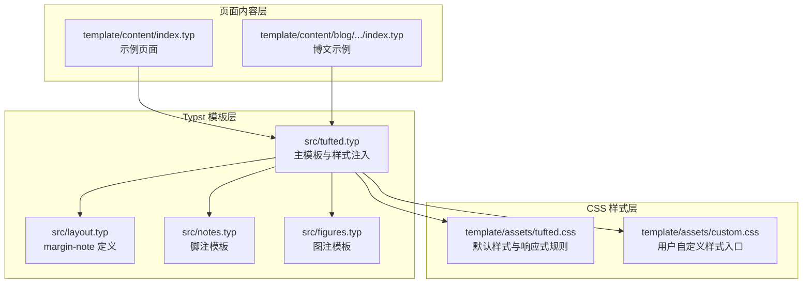
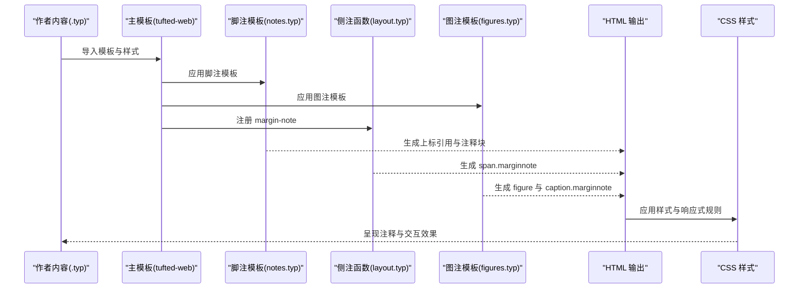
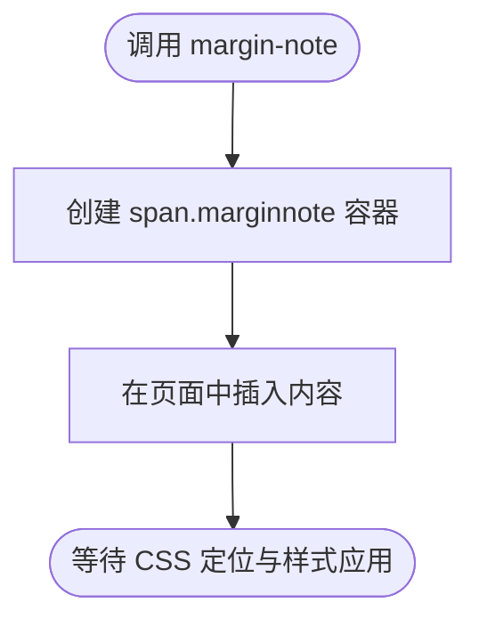
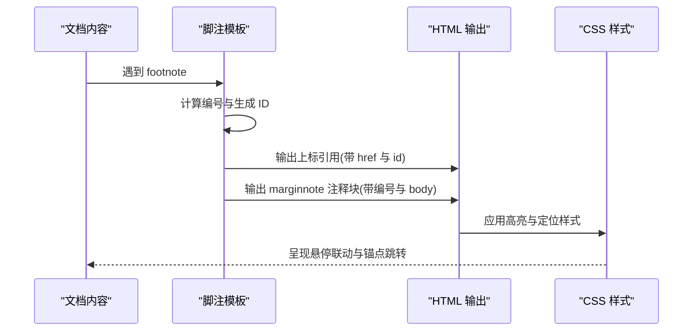
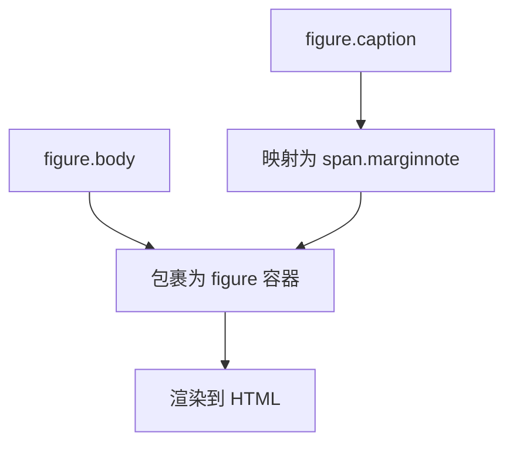
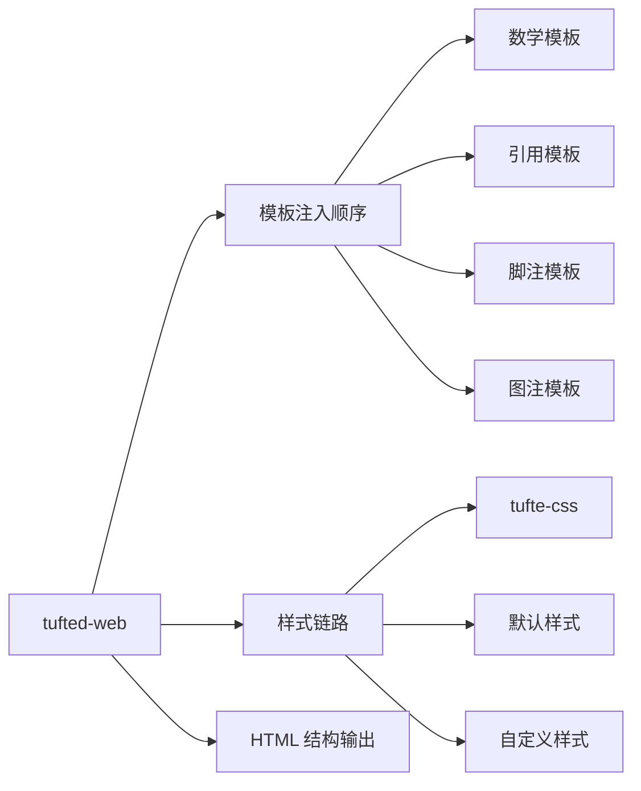
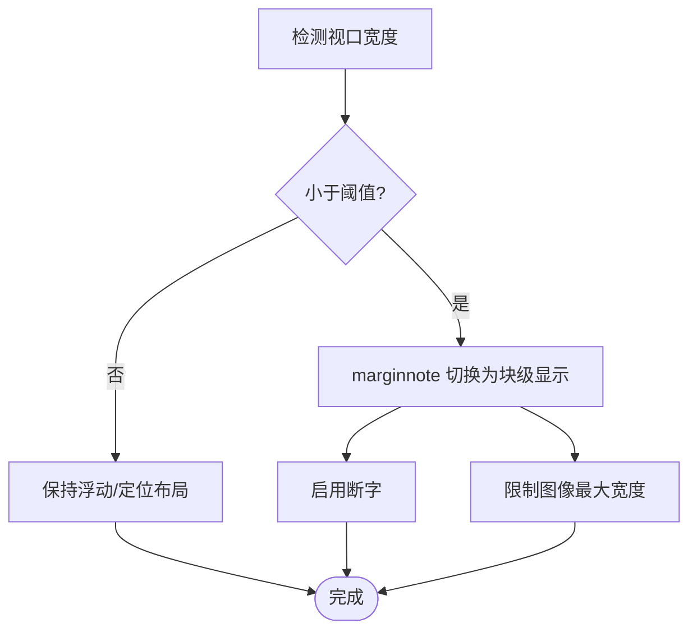
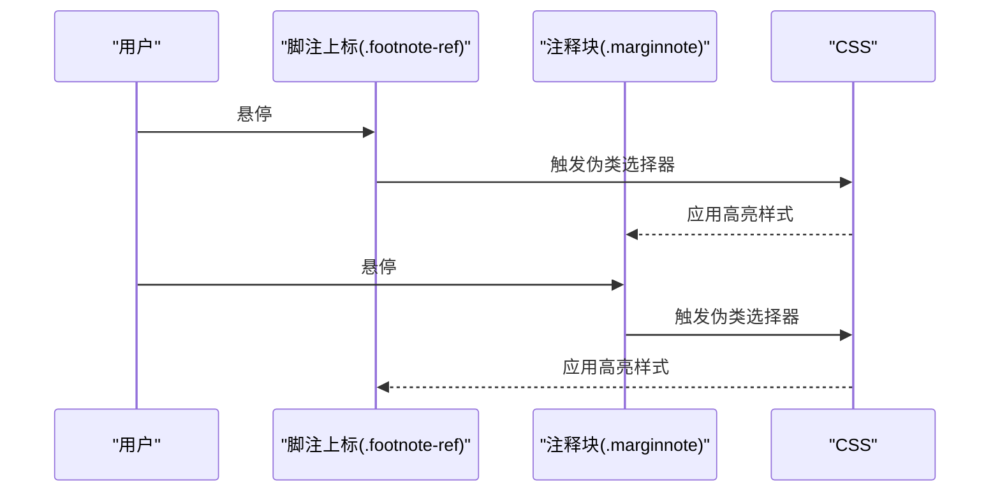
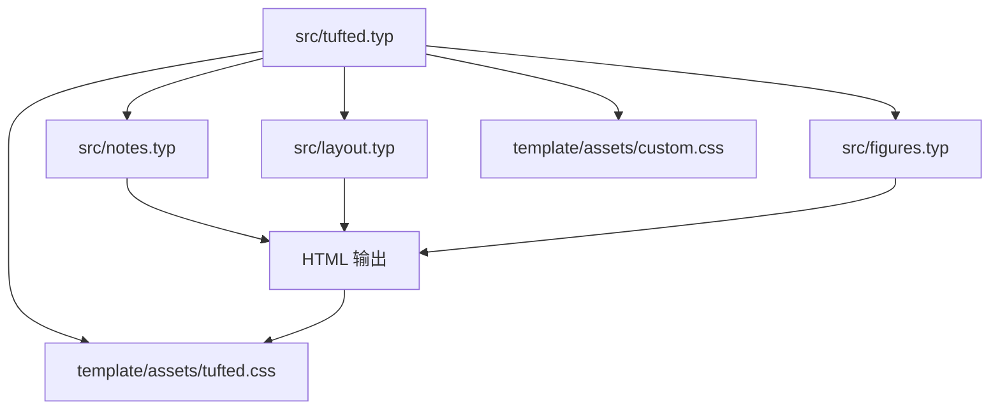

# 侧注和脚注系统

<cite>
**本文引用的文件**
- [src/notes.typ](file://src/notes.typ)
- [src/layout.typ](file://src/layout.typ)
- [src/figures.typ](file://src/figures.typ)
- [src/tufted.typ](file://src/tufted.typ)
- [template/assets/tufted.css](file://template/assets/tufted.css)
- [template/assets/custom.css](file://template/assets/custom.css)
- [template/content/index.typ](file://template/content/index.typ)
- [template/content/blog/2024-10-04-iterators-generators/index.typ](file://template/content/blog/2024-10-04-iterators-generators/index.typ)
- [template/content/docs/01-quick-start/index.typ](file://template/content/docs/01-quick-start/index.typ)
- [template/content/docs/02-configuration/index.typ](file://template/content/docs/02-configuration/index.typ)
- [template/content/docs/03-styling/index.typ](file://template/content/docs/03-styling/index.typ)
- [template/config.typ](file://template/config.typ)
</cite>

## 目录
1. [引言](#引言)
2. [项目结构](#项目结构)
3. [核心组件](#核心组件)
4. [架构总览](#架构总览)
5. [详细组件分析](#详细组件分析)
6. [依赖关系分析](#依赖关系分析)
7. [性能考虑](#性能考虑)
8. [故障排查指南](#故障排查指南)
9. [结论](#结论)
10. [附录](#附录)

## 引言
本文件系统性梳理 TwilightPage（基于 tufted 模板）中的“侧注”与“脚注”实现机制，涵盖以下主题：
- 侧注实现：margin-note 函数的工作原理、HTML 结构与定位策略
- 脚注与侧注的区别与使用场景
- 智能定位系统：基于内容长度与屏幕尺寸的注释位置自适应
- 交互体验：悬停高亮联动与锚点跳转
- 使用示例：在不同布局与页面中的注释展示
- 可定制性：样式与行为配置（CSS 变量、媒体查询、自定义样式）
- 常见问题与性能优化建议

## 项目结构
该系统围绕 Typst 模板与 CSS 样式协同工作：
- Typst 层负责注释语法与渲染逻辑（脚注、侧注、图注）
- CSS 层负责注释容器的布局、响应式与交互高亮
- 页面通过模板组合加载样式与注释模板

**图表来源**
- [src/tufted.typ:17-63](file://src/tufted.typ#L17-L63)
- [src/layout.typ:3-5](file://src/layout.typ#L3-L5)
- [src/notes.typ:1-27](file://src/notes.typ#L1-L27)
- [src/figures.typ:1-20](file://src/figures.typ#L1-L20)
- [template/assets/tufted.css:1-166](file://template/assets/tufted.css#L1-L166)
- [template/assets/custom.css:1](file://template/assets/custom.css#L1)
- [template/content/index.typ:1-33](file://template/content/index.typ#L1-L33)
- [template/content/blog/2024-10-04-iterators-generators/index.typ:1-53](file://template/content/blog/2024-10-04-iterators-generators/index.typ#L1-L53)

**章节来源**
- [src/tufted.typ:17-63](file://src/tufted.typ#L17-L63)
- [src/layout.typ:3-5](file://src/layout.typ#L3-L5)
- [src/notes.typ:1-27](file://src/notes.typ#L1-L27)
- [src/figures.typ:1-20](file://src/figures.typ#L1-L20)
- [template/assets/tufted.css:1-166](file://template/assets/tufted.css#L1-L166)
- [template/assets/custom.css:1](file://template/assets/custom.css#L1)
- [template/content/index.typ:1-33](file://template/content/index.typ#L1-L33)
- [template/content/blog/2024-10-04-iterators-generators/index.typ:1-53](file://template/content/blog/2024-10-04-iterators-generators/index.typ#L1-L53)

## 核心组件
- margin-note 函数：在 HTML 中以 span.marginnote 包裹任意内容，用于放置侧注
- 脚注模板：为 footnote 元素生成上标引用与边栏/侧边注释块
- 图注模板：将 figure.caption 重定向到 marginnote，使图注出现在侧边
- 主模板 tufted-web：注入样式表与各模板，统一输出 HTML
- CSS 样式：提供默认布局、响应式规则与悬停高亮联动

**章节来源**
- [src/layout.typ:3-5](file://src/layout.typ#L3-L5)
- [src/notes.typ:1-27](file://src/notes.typ#L1-L27)
- [src/figures.typ:1-20](file://src/figures.typ#L1-L20)
- [src/tufted.typ:17-63](file://src/tufted.typ#L17-L63)
- [template/assets/tufted.css:91-118](file://template/assets/tufted.css#L91-L118)

## 架构总览
下图展示了从内容到最终渲染的关键流程：Typst 注释语法被模板转换为 HTML，再由 CSS 实现定位与交互。

**图表来源**
- [src/tufted.typ:17-63](file://src/tufted.typ#L17-L63)
- [src/notes.typ:1-27](file://src/notes.typ#L1-L27)
- [src/layout.typ:3-5](file://src/layout.typ#L3-L5)
- [src/figures.typ:1-20](file://src/figures.typ#L1-L20)
- [template/assets/tufted.css:91-118](file://template/assets/tufted.css#L91-L118)

## 详细组件分析

### 侧注实现：margin-note 函数
- 定义位置：在布局模块中导出 margin-note，用于包裹任意内容并标注为 marginnote
- 渲染目标：在 HTML 中输出 span.marginnote，便于 CSS 控制布局与样式
- 使用场景：放置图片、简短说明、补充信息等，适合与正文并排或按响应式规则换行

**图表来源**
- [src/layout.typ:3-5](file://src/layout.typ#L3-L5)

**章节来源**
- [src/layout.typ:3-5](file://src/layout.typ#L3-L5)
- [template/content/index.typ:7-14](file://template/content/index.typ#L7-L14)

### 脚注模板：footnote 的生成与定位
- 计数与编号：使用计数器生成脚注编号，并构造唯一 ID 与反向引用 ID
- 上标引用：在正文中生成上标链接，指向脚注块
- 注释块：在边栏/侧边生成带编号的注释块，支持锚点跳转与双向链接
- HTML 结构：上标引用与注释块均带有语义化类名，便于 CSS 高亮与交互

**图表来源**
- [src/notes.typ:2-23](file://src/notes.typ#L2-L23)
- [template/assets/tufted.css:94-113](file://template/assets/tufted.css#L94-L113)

**章节来源**
- [src/notes.typ:1-27](file://src/notes.typ#L1-L27)
- [template/assets/tufted.css:91-118](file://template/assets/tufted.css#L91-L118)

### 图注模板：将 figure.caption 映射到 marginnote
- 重定义 figure.caption：将其渲染为 span.marginnote，内含编号与标题
- 重定义 figure：在 HTML 中输出 figure 容器，包含 caption 与主体内容
- 作用：使图注与侧注共享同一布局与样式，保持视觉一致性

**图表来源**
- [src/figures.typ:4-16](file://src/figures.typ#L4-L16)

**章节来源**
- [src/figures.typ:1-20](file://src/figures.typ#L1-L20)

### 主模板：tufted-web 的样式注入与页面结构
- 注入顺序：先应用数学、引用、脚注、图注模板，再设置语言与输出 HTML 结构
- 样式链路：加载 tufte-css、默认样式与自定义样式，确保自定义样式优先级最高
- 页面结构：头部 meta、title、导航与文章主体

**图表来源**
- [src/tufted.typ:17-63](file://src/tufted.typ#L17-L63)

**章节来源**
- [src/tufted.typ:17-63](file://src/tufted.typ#L17-L63)

### 智能定位系统：响应式与自适应
- 默认布局：marginnote 采用浮动/定位策略，使其出现在正文外侧
- 移动端适配：当屏幕宽度小于阈值时，marginnote 切换为块级显示，居中并增加左右内边距，避免溢出
- 图像限制：在窄屏下限制 marginnote 内图像的最大宽度，保证可读性
- 断字策略：窄屏启用断字，提升小屏阅读体验

**图表来源**
- [template/assets/tufted.css:30-55](file://template/assets/tufted.css#L30-L55)

**章节来源**
- [template/assets/tufted.css:27-55](file://template/assets/tufted.css#L27-L55)

### 交互功能：悬停高亮与锚点联动
- 联动高亮：当鼠标悬停在脚注上标或注释块时，另一侧会高亮显示，增强可发现性
- 锚点跳转：上标引用与注释块之间通过 id/href 建立锚点，点击即可跳转
- 过渡动画：高亮状态变化带有过渡延迟，避免频繁切换造成干扰

**图表来源**
- [template/assets/tufted.css:94-113](file://template/assets/tufted.css#L94-L113)

**章节来源**
- [template/assets/tufted.css:91-118](file://template/assets/tufted.css#L91-L118)

### 使用示例与布局效果
- 示例页面：首页与博文页面展示了 margin-note 的多种用法（纯文本、图片集合）
- 博文示例：在段落中直接使用脚注，验证上标引用与注释块的联动
- 响应式演示：在窄屏设备上观察 marginnote 的内联化与图像缩放

**章节来源**
- [template/content/index.typ:7-14](file://template/content/index.typ#L7-L14)
- [template/content/blog/2024-10-04-iterators-generators/index.typ:6-44](file://template/content/blog/2024-10-04-iterators-generators/index.typ#L6-L44)

### 可定制性：样式与行为配置
- 样式变量：通过 CSS 变量控制高亮色与圆角半径，便于主题化
- 自定义样式：在自定义样式文件中覆盖默认规则，优先级高于默认样式
- 行为配置：通过修改 CSS 选择器与过渡参数，调整高亮时机与视觉反馈
- 媒体查询：针对不同视口宽度设置不同的 marginnote 呈现策略

**章节来源**
- [template/assets/tufted.css:5-9](file://template/assets/tufted.css#L5-L9)
- [template/assets/custom.css:1](file://template/assets/custom.css#L1)
- [template/content/docs/03-styling/index.typ:23-43](file://template/content/docs/03-styling/index.typ#L23-L43)

## 依赖关系分析
- 组件耦合：主模板集中注入各子模板；布局模块提供基础容器；脚注与图注模板复用 marginnote
- 外部依赖：默认加载 tufte-css 作为基础样式库
- 可能的循环依赖：当前文件组织清晰，未发现循环导入

**图表来源**
- [src/tufted.typ:17-63](file://src/tufted.typ#L17-L63)
- [src/layout.typ:3-5](file://src/layout.typ#L3-L5)
- [src/notes.typ:1-27](file://src/notes.typ#L1-L27)
- [src/figures.typ:1-20](file://src/figures.typ#L1-L20)
- [template/assets/tufted.css:1-166](file://template/assets/tufted.css#L1-L166)
- [template/assets/custom.css:1](file://template/assets/custom.css#L1)

**章节来源**
- [src/tufted.typ:17-63](file://src/tufted.typ#L17-L63)
- [src/layout.typ:3-5](file://src/layout.typ#L3-L5)
- [src/notes.typ:1-27](file://src/notes.typ#L1-L27)
- [src/figures.typ:1-20](file://src/figures.typ#L1-L20)

## 性能考虑
- 样式计算：CSS 选择器与伪类在悬停时触发，建议避免过度复杂的层级嵌套
- 响应式规则：媒体查询仅在视口变化时生效，对运行时性能影响较小
- 图像处理：窄屏下限制 marginnote 内图像宽度，减少重排与绘制开销
- 构建流程：模板编译为 HTML 后，前端仅依赖静态资源，无额外 JS 开销

[本节为通用指导，无需特定文件引用]

## 故障排查指南
- 注释未出现
  - 检查是否正确导入并应用了脚注/图注模板
  - 确认 marginnote 是否包裹在正确的上下文中
- 锚点无法跳转
  - 核对上标引用与注释块的 id/href 是否一致
  - 确保页面中不存在重复 ID
- 悬停高亮无效
  - 检查 CSS 类名是否与选择器匹配
  - 确认自定义样式未覆盖关键规则
- 窄屏显示异常
  - 查看媒体查询是否生效
  - 确认 marginnote 在窄屏下的内联化规则是否被意外覆盖

**章节来源**
- [src/notes.typ:8-21](file://src/notes.typ#L8-L21)
- [template/assets/tufted.css:30-55](file://template/assets/tufted.css#L30-L55)

## 结论
TwilightPage 的侧注与脚注系统通过 Typst 模板与 CSS 样式的协同，实现了简洁而强大的注释能力：
- margin-note 提供灵活的侧注容器
- 脚注模板实现编号、锚点与双向高亮联动
- 图注模板统一了图注的呈现风格
- 响应式规则保障了多设备的一致体验
- 可定制的样式体系满足个性化需求

[本节为总结性内容，无需特定文件引用]

## 附录

### A. 脚注与侧注的区别与使用场景
- 脚注：面向正文的数字上标引用，注释块位于边栏/侧边，适合补充说明、参考文献、术语解释
- 侧注：通用的边栏/侧边注释容器，适合放置图片、简短提示、交叉引用等

**章节来源**
- [src/notes.typ:1-27](file://src/notes.typ#L1-L27)
- [src/layout.typ:3-5](file://src/layout.typ#L3-L5)

### B. 使用示例路径
- 侧注示例：首页中使用 margin-note 放置图片与文本
- 脚注示例：博文页面中在段落内添加脚注
- 响应式演示：在窄屏设备上观察 marginnote 的内联化表现

**章节来源**
- [template/content/index.typ:7-14](file://template/content/index.typ#L7-L14)
- [template/content/blog/2024-10-04-iterators-generators/index.typ:6-44](file://template/content/blog/2024-10-04-iterators-generators/index.typ#L6-L44)

### C. 样式与行为配置要点
- CSS 变量：通过变量统一管理高亮色与圆角
- 自定义样式：在自定义样式文件中覆盖默认规则
- 响应式策略：针对窄屏切换 marginnote 呈现模式

**章节来源**
- [template/assets/tufted.css:5-9](file://template/assets/tufted.css#L5-L9)
- [template/assets/custom.css:1](file://template/assets/custom.css#L1)
- [template/content/docs/03-styling/index.typ:23-43](file://template/content/docs/03-styling/index.typ#L23-L43)