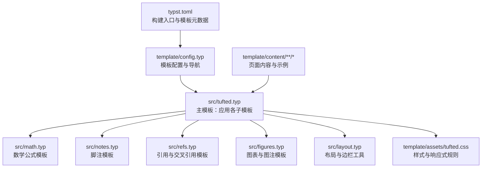
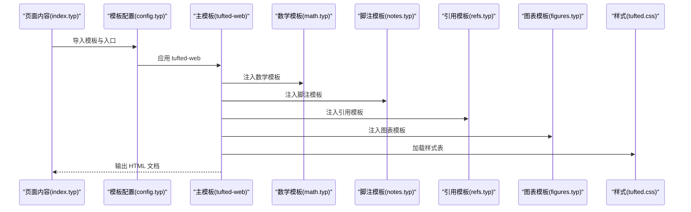
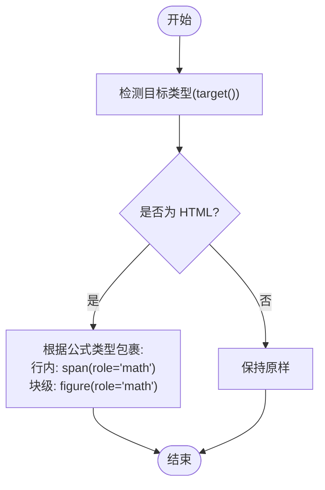
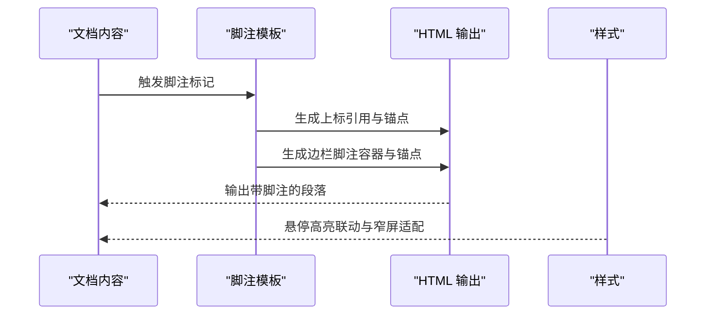
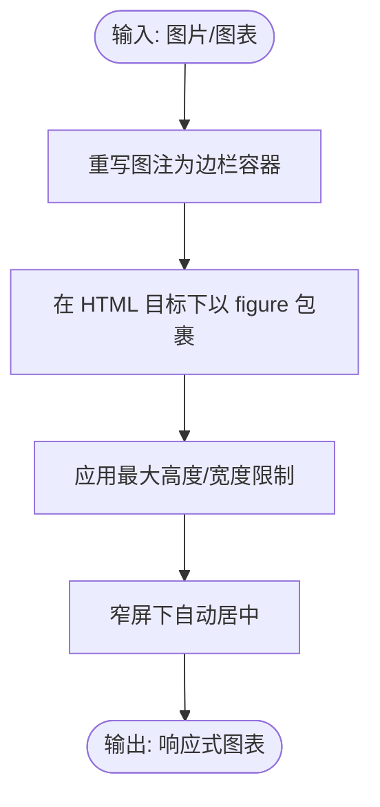
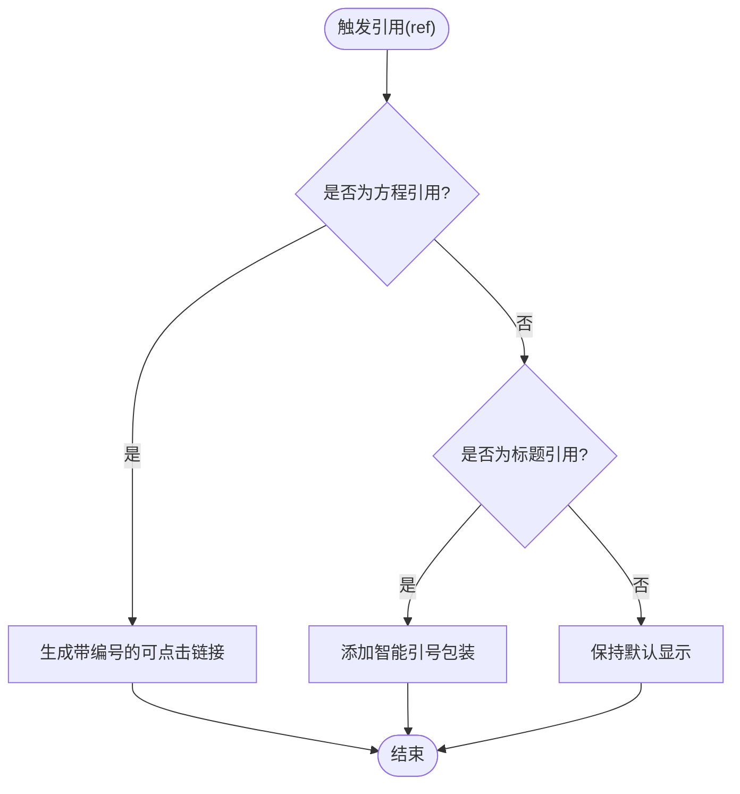
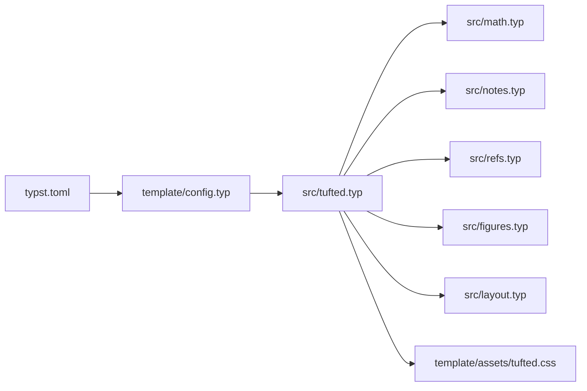

# 内容处理系统

<cite>
**本文档引用的文件**
- [src/tufted.typ](file://src/tufted.typ)
- [src/math.typ](file://src/math.typ)
- [src/notes.typ](file://src/notes.typ)
- [src/refs.typ](file://src/refs.typ)
- [src/figures.typ](file://src/figures.typ)
- [src/layout.typ](file://src/layout.typ)
- [template/assets/tufted.css](file://template/assets/tufted.css)
- [template/assets/custom.css](file://template/assets/custom.css)
- [template/content/blog/2025-10-30-normal-distribution/index.typ](file://template/content/blog/2025-10-30-normal-distribution/index.typ)
- [template/content/blog/2024-10-04-iterators-generators/index.typ](file://template/content/blog/2024-10-04-iterators-generators/index.typ)
- [template/content/blog/2025-04-16-monkeys-apes/index.typ](file://template/content/blog/2025-04-16-monkeys-apes/index.typ)
- [template/content/docs/embedding-markdown/tufted-titmouse.md](file://template/content/docs/embedding-markdown/tufted-titmouse.md)
- [template/content/index.typ](file://template/content/index.typ)
- [template/config.typ](file://template/config.typ)
- [typst.toml](file://typst.toml)
- [README.md](file://README.md)
</cite>

## 目录
1. [引言](#引言)
2. [项目结构](#项目结构)
3. [核心组件](#核心组件)
4. [架构总览](#架构总览)
5. [详细组件分析](#详细组件分析)
6. [依赖关系分析](#依赖关系分析)
7. [性能考虑](#性能考虑)
8. [故障排除指南](#故障排除指南)
9. [结论](#结论)
10. [附录](#附录)

## 引言
本文件系统性介绍 TwilightPage（基于 Typst 的静态网站模板）的内容处理系统与各类内容类型的处理机制。重点覆盖：
- 数学公式处理：方程式编号、引用与渲染优化
- 侧注与脚注：智能定位与交互
- 图片与图表：自动缩放、居中与响应式显示
- 引用与交叉引用：文献数据库集成与格式化
- 使用示例与最佳实践
- 内部工作流程与性能优化策略
- 常见问题与故障排除

## 项目结构
TwilightPage 采用“模板 + 源样式库”的组织方式：
- 核心样式与模板位于 src/ 下，分别定义数学、脚注、引用、图表与布局等模板
- 页面内容位于 template/content/ 下，按主题与类型组织
- 样式资源位于 template/assets/，包含基础样式与自定义扩展
- 构建入口由 typst.toml 指定，模板入口为 template/config.typ

**图表来源**
- [typst.toml:15-19](file://typst.toml#L15-L19)
- [template/config.typ:1-12](file://template/config.typ#L1-12)
- [src/tufted.typ:1-64](file://src/tufted.typ#L1-L64)
- [src/math.typ:1-22](file://src/math.typ#L1-L22)
- [src/notes.typ:1-27](file://src/notes.typ#L1-L27)
- [src/refs.typ:1-23](file://src/refs.typ#L1-L23)
- [src/figures.typ:1-20](file://src/figures.typ#L1-L20)
- [src/layout.typ:1-13](file://src/layout.typ#L1-L13)
- [template/assets/tufted.css:1-166](file://template/assets/tufted.css#L1-L166)

**章节来源**
- [typst.toml:1-19](file://typst.toml#L1-L19)
- [template/config.typ:1-12](file://template/config.typ#L1-L12)

## 核心组件
- 主模板 tufted-web：统一注入数学、脚注、引用与图表模板，设置语言与样式表，输出 HTML 结构
- 数学模板：为行内与块级公式设置角色属性，HTML 目标下以 span/figure 包裹，支持编号与渲染优化
- 脚注模板：在 HTML 目标下生成上标引用与边栏脚注内容，维护双向锚点链接
- 引用模板：重写方程与标题引用的显示逻辑，增强交叉引用体验
- 图表模板：重写图注与图元素，使图注进入边栏容器，提升版式一致性
- 布局工具：提供边栏注释与全宽容器，配合 CSS 实现响应式布局

**章节来源**
- [src/tufted.typ:17-63](file://src/tufted.typ#L17-L63)
- [src/math.typ:1-22](file://src/math.typ#L1-L22)
- [src/notes.typ:1-27](file://src/notes.typ#L1-L27)
- [src/refs.typ:1-23](file://src/refs.typ#L1-L23)
- [src/figures.typ:1-20](file://src/figures.typ#L1-L20)
- [src/layout.typ:1-13](file://src/layout.typ#L1-L13)

## 架构总览
下图展示从内容到最终 HTML 的处理链路：页面内容导入模板配置，主模板依次应用数学、脚注、引用与图表模板，再通过 HTML 输出层生成结构化页面。

**图表来源**
- [template/content/blog/2025-10-30-normal-distribution/index.typ:1-56](file://template/content/blog/2025-10-30-normal-distribution/index.typ#L1-L56)
- [template/config.typ:1-12](file://template/config.typ#L1-L12)
- [src/tufted.typ:17-63](file://src/tufted.typ#L17-L63)
- [src/math.typ:1-22](file://src/math.typ#L1-L22)
- [src/notes.typ:1-27](file://src/notes.typ#L1-L27)
- [src/refs.typ:1-23](file://src/refs.typ#L1-L23)
- [src/figures.typ:1-20](file://src/figures.typ#L1-L20)
- [template/assets/tufted.css:1-166](file://template/assets/tufted.css#L1-L166)

## 详细组件分析

### 数学公式处理模块
- 方程式编号与显示
  - 在非 HTML 目标下直接保留原样；在 HTML 目标下，行内公式以 role="math" 的 span 包裹，块级公式以 figure(role="math") 包裹，便于样式与交互识别
  - 编号格式可配置，默认示例中使用 "(1)" 形式
- 渲染优化
  - 针对深色主题提供反相滤镜，提升对比度
  - 块级数学容器字号放大，增强可读性
- 交互与定位
  - 通过 role 属性与 CSS 选择器实现悬停高亮联动（与脚注系统协同）

**图表来源**
- [src/math.typ:4-18](file://src/math.typ#L4-L18)

**章节来源**
- [src/math.typ:1-22](file://src/math.typ#L1-L22)
- [template/assets/tufted.css:121-137](file://template/assets/tufted.css#L121-L137)

### 侧注与脚注系统
- 脚注生成
  - 在 HTML 目标下，脚注引用以 sup 上标形式插入，包含指向脚注内容的锚点 ID；脚注内容放置于边栏容器中，同样带有反向锚点
  - 双向链接确保点击引用跳转至脚注，悬停脚注高亮对应引用
- 智能定位与交互
  - CSS 提供悬停联动高亮效果，窄屏时边栏内容改为块状内联显示，保证可读性
- 使用建议
  - 将长篇解释放入脚注，正文保持流畅阅读节奏
  - 注意脚注数量与顺序，避免过多脚注造成视觉负担

**图表来源**
- [src/notes.typ:2-25](file://src/notes.typ#L2-L25)
- [template/assets/tufted.css:91-118](file://template/assets/tufted.css#L91-L118)

**章节来源**
- [src/notes.typ:1-27](file://src/notes.typ#L1-L27)
- [template/assets/tufted.css:29-55](file://template/assets/tufted.css#L29-L55)

### 图片与图表处理管道
- 图注与图表
  - 图注被重写为边栏注释容器，确保与脚注一致的版式体验
  - 图表元素在 HTML 目标下以 figure 容器输出，便于样式控制
- 自动缩放与居中
  - 图片与 SVG 最大高度限制为视口高度的 80%，避免溢出
  - 窄屏下边栏中的图片最大宽度受限，并自动水平居中
- 全宽与边栏
  - 提供全宽容器与边栏注释工具，配合 CSS 实现响应式布局

**图表来源**
- [src/figures.typ:4-16](file://src/figures.typ#L4-L16)
- [template/assets/tufted.css:20-49](file://template/assets/tufted.css#L20-L49)

**章节来源**
- [src/figures.typ:1-20](file://src/figures.typ#L1-L20)
- [src/layout.typ:3-12](file://src/layout.typ#L3-L12)
- [template/assets/tufted.css:20-55](file://template/assets/tufted.css#L20-L55)

### 引用与交叉引用管理系统
- 方程引用
  - 当引用对象为方程时，模板重写其显示：使用方程计数器当前值替换默认编号，生成可点击链接
- 标题引用
  - 对标题元素的引用进行智能引号包装，提升可读性
- 文献数据库集成
  - 页面可通过 bibliography 指令加载 .bib 文件，结合引用语法生成参考文献列表

**图表来源**
- [src/refs.typ:2-19](file://src/refs.typ#L2-L19)

**章节来源**
- [src/refs.typ:1-23](file://src/refs.typ#L1-L23)
- [template/content/blog/2025-10-30-normal-distribution/index.typ:55-56](file://template/content/blog/2025-10-30-normal-distribution/index.typ#L55-L56)

### 页面内容与示例
- 博文示例
  - 正态分布文章展示了数学公式、脚注、图表与参考文献的综合使用
  - 迭代器与生成器文章演示了脚注与图片插入
  - 猩猩与猴子文章展示了边栏注释工具的使用
- Markdown 嵌入
  - 主页通过 cmarker 渲染 README 并自定义图片处理，体现内容来源多样化

**章节来源**
- [template/content/blog/2025-10-30-normal-distribution/index.typ:1-56](file://template/content/blog/2025-10-30-normal-distribution/index.typ#L1-L56)
- [template/content/blog/2024-10-04-iterators-generators/index.typ:1-53](file://template/content/blog/2024-10-04-iterators-generators/index.typ#L1-L53)
- [template/content/blog/2025-04-16-monkeys-apes/index.typ:1-29](file://template/content/blog/2025-04-16-monkeys-apes/index.typ#L1-L29)
- [template/content/docs/embedding-markdown/tufted-titmouse.md:1-14](file://template/content/docs/embedding-markdown/tufted-titmouse.md#L1-L14)
- [template/content/index.typ:17-32](file://template/content/index.typ#L17-L32)

## 依赖关系分析
- 模板依赖
  - 主模板依赖数学、脚注、引用与图表模板，形成统一的内容处理管线
  - 布局工具为图表与边栏注释提供基础容器
- 样式依赖
  - tufted.css 提供数学、脚注、边栏与响应式规则，custom.css 用于用户扩展
- 构建与入口
  - typst.toml 指定包信息与模板入口，template/config.typ 组织导航与标题

**图表来源**
- [src/tufted.typ:1-6](file://src/tufted.typ#L1-L6)
- [src/math.typ:1-22](file://src/math.typ#L1-L22)
- [src/notes.typ:1-27](file://src/notes.typ#L1-L27)
- [src/refs.typ:1-23](file://src/refs.typ#L1-L23)
- [src/figures.typ:1-20](file://src/figures.typ#L1-L20)
- [src/layout.typ:1-13](file://src/layout.typ#L1-L13)
- [template/assets/tufted.css:1-166](file://template/assets/tufted.css#L1-L166)
- [template/config.typ:1-12](file://template/config.typ#L1-L12)
- [typst.toml:15-19](file://typst.toml#L15-L19)

**章节来源**
- [src/tufted.typ:1-64](file://src/tufted.typ#L1-L64)
- [template/config.typ:1-12](file://template/config.typ#L1-L12)
- [typst.toml:1-19](file://typst.toml#L1-L19)

## 性能考虑
- 渲染路径最小化
  - 模板仅在 HTML 目标下执行额外包裹与链接生成，其他目标保持原样，减少不必要的计算
- 样式与交互
  - 利用 CSS 选择器与伪类实现悬停联动，避免 JavaScript 依赖，降低运行时开销
- 响应式设计
  - 通过媒体查询与相对单位控制图片尺寸，减少重排与重绘
- 构建与缓存
  - 使用 Typst 编译器与静态导出，避免动态渲染带来的性能波动

[本节为通用指导，无需列出具体文件来源]

## 故障排除指南
- 数学公式未正确编号或显示异常
  - 检查数学模板是否已注入到主模板中
  - 确认目标类型为 HTML，否则不会进行包裹与角色标注
  - 若需调整编号格式，请修改数学模板中的编号设定位置
- 脚注无法跳转或悬停无高亮
  - 确认脚注引用与脚注内容的锚点 ID 一致且唯一
  - 检查 CSS 是否正确加载，特别是脚注高亮相关的选择器
- 图片过大或溢出
  - 确认图片已在 CSS 中设置最大高度或最大宽度
  - 在窄屏设备上检查边栏图片的最大宽度限制是否生效
- 引用链接无效或编号不更新
  - 确保引用对象为方程或标题类型，引用模板会针对这些类型做特殊处理
  - 检查 .bib 文件路径与内容是否正确，确保 bibliography 指令指向有效文件
- 页面未按预期显示边栏注释
  - 确认使用了正确的边栏注释工具函数，并在 HTML 目标下生效
  - 检查 CSS 中边栏注释的显示规则是否被覆盖

**章节来源**
- [src/math.typ:1-22](file://src/math.typ#L1-L22)
- [src/notes.typ:1-27](file://src/notes.typ#L1-L27)
- [src/refs.typ:1-23](file://src/refs.typ#L1-L23)
- [src/figures.typ:1-20](file://src/figures.typ#L1-L20)
- [template/assets/tufted.css:20-55](file://template/assets/tufted.css#L20-L55)

## 结论
TwilightPage 的内容处理系统以模块化模板为核心，围绕数学、脚注、引用与图表四大领域提供一致的版式与交互体验。通过 HTML 目标下的轻量包裹与 CSS 的响应式增强，系统在保持简洁的同时实现了良好的可读性与可维护性。遵循本文的最佳实践与故障排除建议，可在不同内容类型间获得稳定、高效的输出结果。

[本节为总结性内容，无需列出具体文件来源]

## 附录
- 快速开始
  - 初始化模板并构建网站，参考仓库说明与构建入口
- 扩展与定制
  - 在 custom.css 中添加个性化样式
  - 在 content/ 下新增页面，复用现有模板与工具

**章节来源**
- [README.md:7-21](file://README.md#L7-L21)
- [typst.toml:15-19](file://typst.toml#L15-L19)
- [template/assets/custom.css:1](file://template/assets/custom.css#L1)