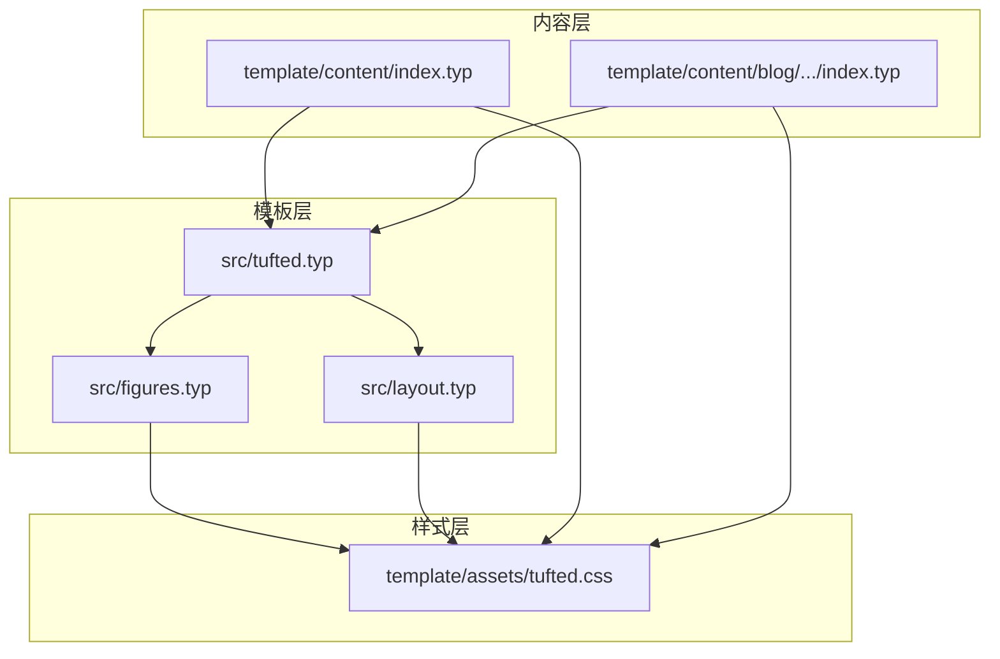
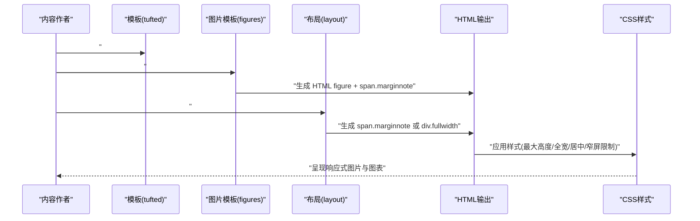
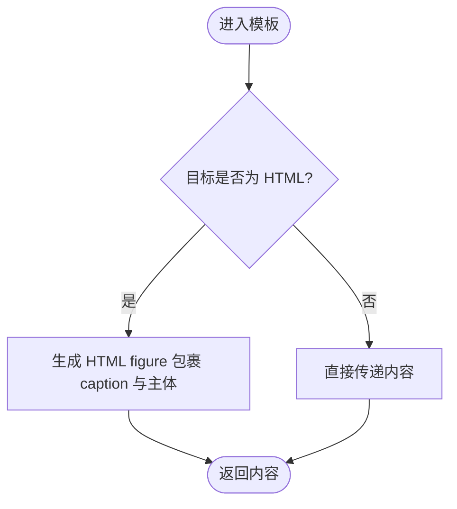
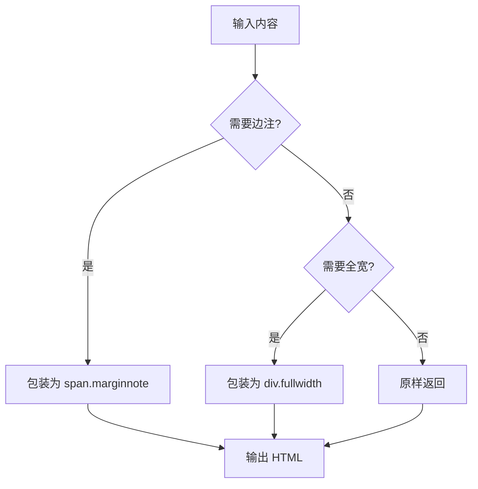
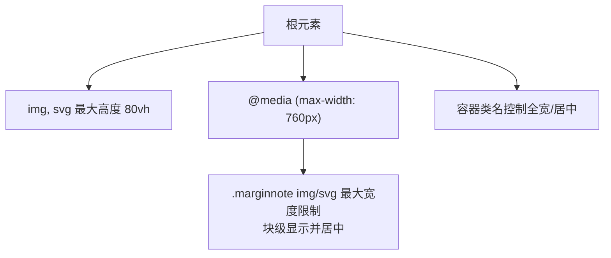
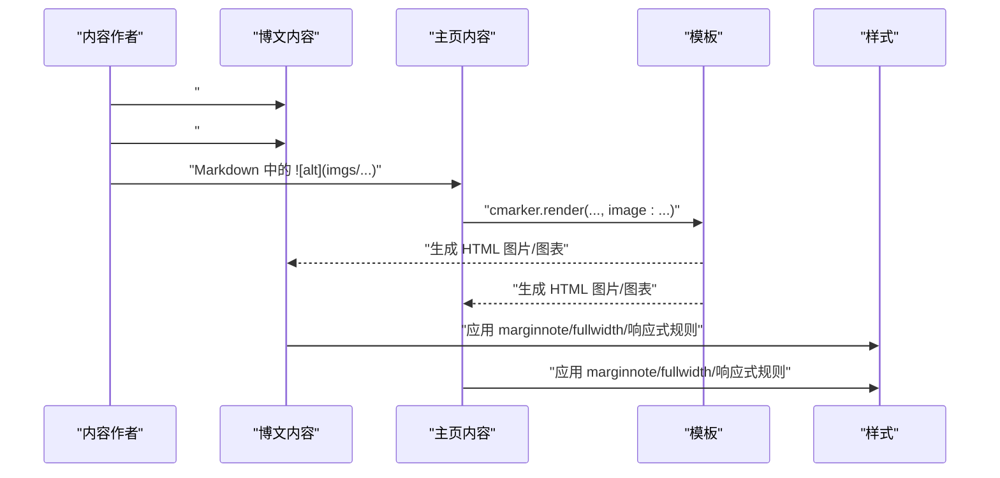
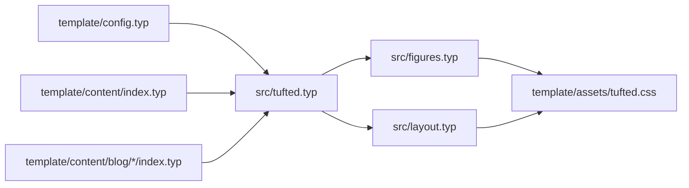

# 图片和图表处理

<cite>
**本文引用的文件**
- [src/figures.typ](file://src/figures.typ)
- [src/layout.typ](file://src/layout.typ)
- [src/tufted.typ](file://src/tufted.typ)
- [template/assets/tufted.css](file://template/assets/tufted.css)
- [template/content/blog/2024-10-04-iterators-generators/index.typ](file://template/content/blog/2024-10-04-iterators-generators/index.typ)
- [template/content/blog/2025-04-16-monkeys-apes/index.typ](file://template/content/blog/2025-04-16-monkeys-apes/index.typ)
- [template/content/index.typ](file://template/content/index.typ)
- [template/config.typ](file://template/config.typ)
</cite>

## 目录
1. [简介](#简介)
2. [项目结构](#项目结构)
3. [核心组件](#核心组件)
4. [架构总览](#架构总览)
5. [详细组件分析](#详细组件分析)
6. [依赖关系分析](#依赖关系分析)
7. [性能考虑](#性能考虑)
8. [故障排查指南](#故障排查指南)
9. [结论](#结论)
10. [附录](#附录)

## 简介
本文件系统化梳理 TwiightPage 中“图片与图表”处理模块的设计与实现，覆盖以下主题：
- 图片处理流水线：自动缩放、居中对齐与响应式显示
- 图表容器实现：全宽显示与嵌入式布局
- 图片文件策略：格式支持、质量优化与缓存机制
- 图片与文本的环绕与对齐方式
- 实际插入示例：不同尺寸与格式的处理效果
- 可扩展性：自定义处理函数与第三方集成
- 性能优化与错误处理最佳实践

## 项目结构
该模块由 Typ 前端模板与 CSS 样式共同构成：
- 模板层负责将图片与图表转换为 HTML 结构（figure、span 等），并注入类名与属性
- 样式层负责响应式与视觉呈现（最大高度、全宽、居中、窄屏限制等）
- 内容层通过 #figure 与 #image 调用模板，实现图片插入与标注

**图示来源**
- [src/tufted.typ:17-63](file://src/tufted.typ#L17-L63)
- [src/figures.typ:1-20](file://src/figures.typ#L1-L20)
- [src/layout.typ:1-13](file://src/layout.typ#L1-L13)
- [template/assets/tufted.css:16-55](file://template/assets/tufted.css#L16-L55)

**章节来源**
- [src/tufted.typ:17-63](file://src/tufted.typ#L17-L63)
- [src/figures.typ:1-20](file://src/figures.typ#L1-L20)
- [src/layout.typ:1-13](file://src/layout.typ#L1-L13)
- [template/assets/tufted.css:16-55](file://template/assets/tufted.css#L16-L55)

## 核心组件
- 图片与图表模板：将 Typ 的 figure/image 映射到 HTML figure/span，并设置类名与 role 属性，便于 CSS 控制
- 布局工具：提供 margin-note 与 full-width 容器，分别用于边注与全宽布局
- 样式控制：通过 CSS 设置图片最大高度、窄屏限制、全宽与居中等

关键职责与交互：
- 图片标注：在 HTML 中以 figure 包裹，caption 使用 marginnote 类
- 边注图片：通过 margin-note 将图片放入侧边栏区域
- 全宽图片：通过 full-width 容器实现跨列全宽显示
- 响应式：在窄屏下限制边注内图片宽度并强制块级显示

**章节来源**
- [src/figures.typ:3-19](file://src/figures.typ#L3-L19)
- [src/layout.typ:3-12](file://src/layout.typ#L3-L12)
- [template/assets/tufted.css:20-55](file://template/assets/tufted.css#L20-L55)

## 架构总览
图片与图表处理从内容到渲染的端到端流程如下：

**图示来源**
- [src/tufted.typ:27-62](file://src/tufted.typ#L27-L62)
- [src/figures.typ:10-16](file://src/figures.typ#L10-L16)
- [src/layout.typ:3-12](file://src/layout.typ#L3-L12)
- [template/assets/tufted.css:20-55](file://template/assets/tufted.css#L20-L55)

## 详细组件分析

### 组件一：图片与图表模板（figures）
- 功能要点
  - 重写 figure.caption：在 HTML 中以 span.marginnote 渲染，统一边注样式
  - 重写 figure：在目标为 HTML 时，将内容包裹为 HTML figure，保留 caption 与主体
  - 通过模板组合，确保图片与标注在 HTML 输出中具备一致的结构与类名

- 关键行为
  - 条件渲染：仅在 HTML 目标下生成对应标签
  - 结构复用：保持 Typ 原始语义，仅改变输出形态

**图示来源**
- [src/figures.typ:10-16](file://src/figures.typ#L10-L16)

**章节来源**
- [src/figures.typ:3-19](file://src/figures.typ#L3-L19)

### 组件二：布局工具（layout）
- margin-note：将内容包装为 span.marginnote，用于边注区域
- full-width：将内容包装为 div.fullwidth，用于全宽显示

注意：当前实现未直接为 figure 注入 class="fullwidth"，如需全宽图表，可在内容侧使用 full-width 容器包裹。

**图示来源**
- [src/layout.typ:3-12](file://src/layout.typ#L3-L12)

**章节来源**
- [src/layout.typ:3-12](file://src/layout.typ#L3-L12)

### 组件三：样式与响应式（CSS）
- 基础约束
  - img, svg 最大高度限制为视口高度的 80%
- 边注图片
  - 在窄屏下限制 .marginnote 内 img/svg 的最大宽度，并强制块级居中显示
- 全宽与居中
  - 通过容器类名（marginnote/fullwidth）与 CSS 规则实现布局与对齐
- 窄屏优化
  - 针对小屏设备启用连字符断词，提升阅读体验

**图示来源**
- [template/assets/tufted.css:20-55](file://template/assets/tufted.css#L20-L55)

**章节来源**
- [template/assets/tufted.css:20-55](file://template/assets/tufted.css#L20-L55)

### 组件四：内容中的图片与图表使用
- 博文示例
  - 使用 #figure(image(...), caption: [...]) 插入带标注的图片
  - 在边栏位置使用 #tufted.margin-note(...) 放置图片
- 主页示例
  - 通过 Markdown 渲染器的 image 处理钩子，将 Markdown 中的图片转换为 Typ 的 figure/image

**图示来源**
- [template/content/blog/2024-10-04-iterators-generators/index.typ:46](file://template/content/blog/2024-10-04-iterators-generators/index.typ#L46)
- [template/content/blog/2025-04-16-monkeys-apes/index.typ:8-10](file://template/content/blog/2025-04-16-monkeys-apes/index.typ#L8-L10)
- [template/content/index.typ:22-32](file://template/content/index.typ#L22-L32)

**章节来源**
- [template/content/blog/2024-10-04-iterators-generators/index.typ:46](file://template/content/blog/2024-10-04-iterators-generators/index.typ#L46)
- [template/content/blog/2025-04-16-monkeys-apes/index.typ:8-10](file://template/content/blog/2025-04-16-monkeys-apes/index.typ#L8-L10)
- [template/content/index.typ:22-32](file://template/content/index.typ#L22-L32)

## 依赖关系分析
- 模板依赖
  - tufted-web 导入并应用 template-math、template-refs、template-notes、template-figures、layout 工具
  - figures 与 layout 作为独立模块被组合进主模板
- 样式依赖
  - CSS 通过类名与容器名与模板输出的 HTML 结构耦合
- 内容依赖
  - 内容通过 #figure 与 #image 调用模板；主页通过 Markdown 渲染器注入 image 钩子

**图示来源**
- [template/config.typ:3-11](file://template/config.typ#L3-L11)
- [src/tufted.typ:1-6](file://src/tufted.typ#L1-L6)
- [src/figures.typ:1](file://src/figures.typ#L1)
- [src/layout.typ:1](file://src/layout.typ#L1)
- [template/assets/tufted.css:1-166](file://template/assets/tufted.css#L1-L166)

**章节来源**
- [template/config.typ:3-11](file://template/config.typ#L3-L11)
- [src/tufted.typ:1-6](file://src/tufted.typ#L1-L6)

## 性能考虑
- 响应式与缩放
  - 通过 CSS 限制图片最大高度与窄屏宽度，避免超大图片导致页面滚动与重排开销
- 渲染路径
  - 图片与图表均以 HTML 结构输出，减少复杂度；全宽与边注通过容器类名控制，避免额外脚本
- 缓存与资源
  - 图片资源由浏览器缓存；建议在构建阶段进行格式优化（如 WebP/JPEG2000）与压缩，以降低首屏时间
- 渲染顺序
  - 将关键图片置于首屏可视区域，避免长列表图片造成的延迟

[本节为通用指导，不直接分析具体文件]

## 故障排查指南
- 图片未按预期全宽显示
  - 检查是否使用了 full-width 容器包裹；当前实现未直接为 figure 注入 class="fullwidth"
  - 参考：[src/layout.typ:10-12](file://src/layout.typ#L10-L12)
- 边注图片过宽或溢出
  - 确认容器为 margin-note；CSS 已限制 .marginnote 内图片最大宽度并强制块级居中
  - 参考：[template/assets/tufted.css:43-49](file://template/assets/tufted.css#L43-L49)
- 图片在窄屏下仍过大
  - 检查是否覆盖了相关 CSS；确认媒体查询生效
  - 参考：[template/assets/tufted.css:30-55](file://template/assets/tufted.css#L30-L55)
- 图片标注未正确渲染
  - 确认使用 #figure(image(...), caption: [...]) 并已应用 template-figures
  - 参考：[src/figures.typ:10-16](file://src/figures.typ#L10-L16)
- Markdown 中图片未转换为图表
  - 检查 cmarker.render 的 image 钩子是否正确注入
  - 参考：[template/content/index.typ:24-30](file://template/content/index.typ#L24-L30)

**章节来源**
- [src/layout.typ:10-12](file://src/layout.typ#L10-L12)
- [template/assets/tufted.css:43-49](file://template/assets/tufted.css#L43-L49)
- [template/assets/tufted.css:30-55](file://template/assets/tufted.css#L30-L55)
- [src/figures.typ:10-16](file://src/figures.typ#L10-L16)
- [template/content/index.typ:24-30](file://template/content/index.typ#L24-L30)

## 结论
本模块以“模板 + 样式”的轻量方案实现了图片与图表的统一渲染与响应式控制：
- 图片标注与边注通过模板与 CSS 协作完成
- 全宽显示可通过容器类名实现，窄屏下具备明确的宽度与居中策略
- 内容侧通过 #figure 与 Markdown 钩子无缝接入，具备良好的可扩展性

[本节为总结，不直接分析具体文件]

## 附录

### 实际插入示例与效果说明
- 带标注的图片
  - 示例路径：[template/content/blog/2024-10-04-iterators-generators/index.typ:46](file://template/content/blog/2024-10-04-iterators-generators/index.typ#L46)
  - 效果：生成 HTML figure，caption 以 marginnote 类渲染，支持响应式缩放
- 边注图片
  - 示例路径：[template/content/blog/2025-04-16-monkeys-apes/index.typ:8-10](file://template/content/blog/2025-04-16-monkeys-apes/index.typ#L8-L10)
  - 效果：图片位于边注区域，窄屏下自动换行并限制宽度
- Markdown 图片转图表
  - 示例路径：[template/content/index.typ:22-32](file://template/content/index.typ#L22-L32)
  - 效果：Markdown 中的图片经钩子转换为 Typ 的 figure/image，再由模板输出为 HTML

**章节来源**
- [template/content/blog/2024-10-04-iterators-generators/index.typ:46](file://template/content/blog/2024-10-04-iterators-generators/index.typ#L46)
- [template/content/blog/2025-04-16-monkeys-apes/index.typ:8-10](file://template/content/blog/2025-04-16-monkeys-apes/index.typ#L8-L10)
- [template/content/index.typ:22-32](file://template/content/index.typ#L22-L32)

### 可扩展性与第三方集成
- 自定义处理函数
  - 在 Markdown 渲染器中通过作用域注入自定义 image 处理逻辑，实现路径映射、格式选择与参数透传
  - 参考：[template/content/index.typ:24-30](file://template/content/index.typ#L24-L30)
- 第三方样式库
  - 通过 tufted-web 的 css 参数引入外部样式（如 tufte-css），并与本地样式叠加
  - 参考：[src/tufted.typ:21-26](file://src/tufted.typ#L21-L26)

**章节来源**
- [template/content/index.typ:24-30](file://template/content/index.typ#L24-L30)
- [src/tufted.typ:21-26](file://src/tufted.typ#L21-L26)