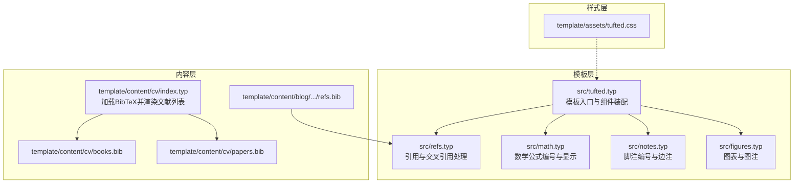
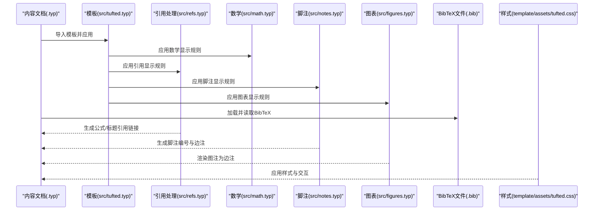
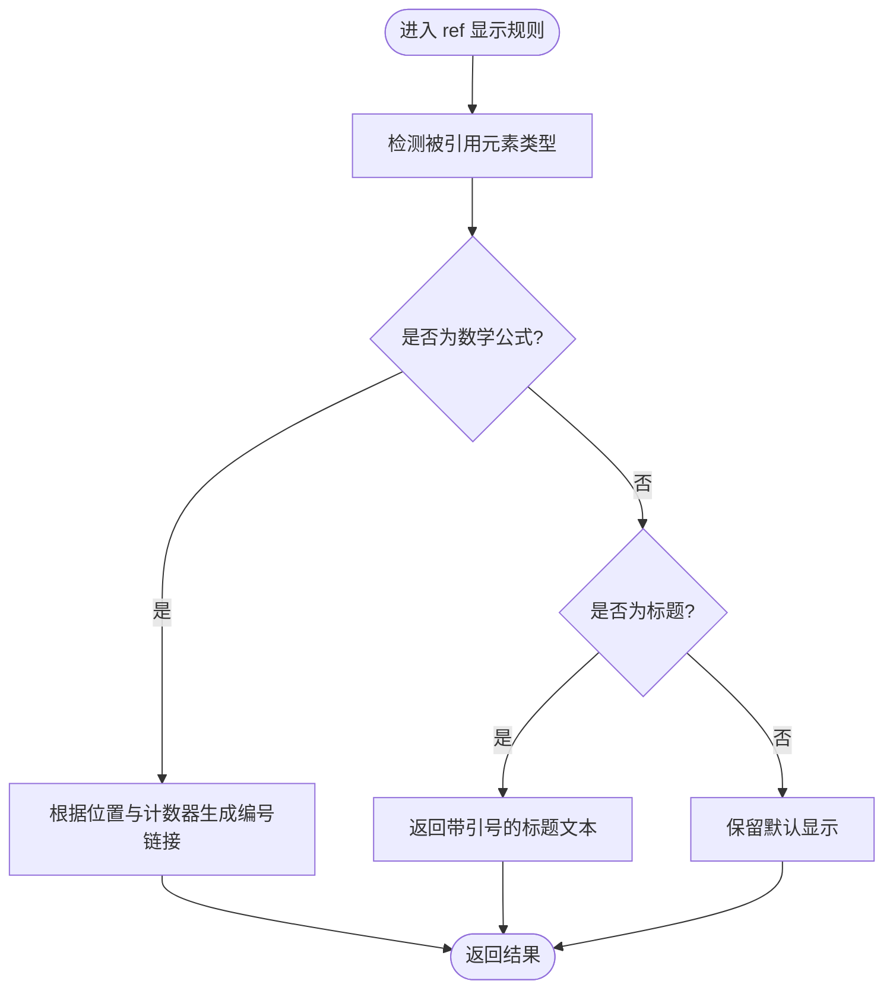
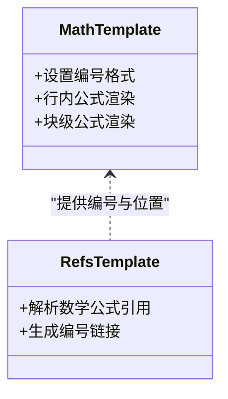
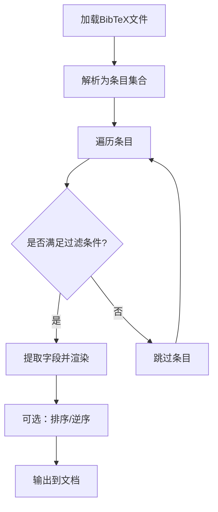
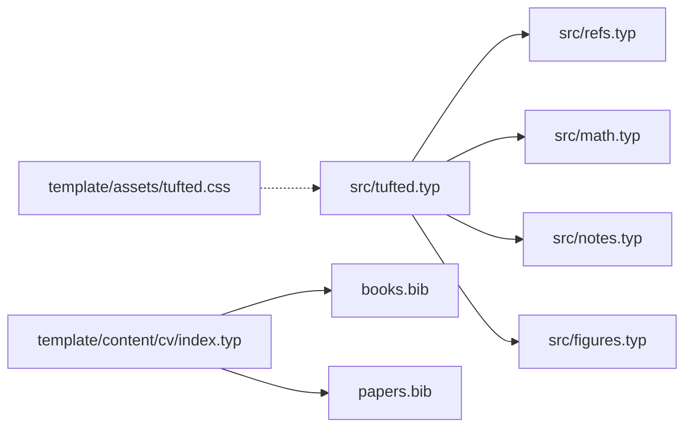

# 引用和交叉引用管理

<cite>
**本文档引用的文件**
- [src/refs.typ](file://src/refs.typ)
- [src/tufted.typ](file://src/tufted.typ)
- [src/math.typ](file://src/math.typ)
- [src/notes.typ](file://src/notes.typ)
- [src/figures.typ](file://src/figures.typ)
- [template/content/cv/index.typ](file://template/content/cv/index.typ)
- [template/content/cv/books.bib](file://template/content/cv/books.bib)
- [template/content/cv/papers.bib](file://template/content/cv/papers.bib)
- [template/content/blog/2025-10-30-normal-distribution/refs.bib](file://template/content/blog/2025-10-30-normal-distribution/refs.bib)
- [template/assets/tufted.css](file://template/assets/tufted.css)
- [template/content/docs/01-quick-start/index.typ](file://template/content/docs/01-quick-start/index.typ)
- [template/content/docs/03-styling/index.typ](file://template/content/docs/03-styling/index.typ)
</cite>

## 目录
1. [简介](#简介)
2. [项目结构](#项目结构)
3. [核心组件](#核心组件)
4. [架构总览](#架构总览)
5. [详细组件分析](#详细组件分析)
6. [依赖关系分析](#依赖关系分析)
7. [性能考虑](#性能考虑)
8. [故障排除指南](#故障排除指南)
9. [结论](#结论)
10. [附录](#附录)

## 简介
本文件面向TwilightPage项目中的“引用与交叉引用管理”子系统，系统性梳理其架构设计、文献数据库结构与管理机制、交叉引用的实现原理（标签生成、引用解析与链接建立）、引用格式化体系（支持的样式与自定义选项）、文献条目的存储与检索（排序、过滤与搜索）、实际使用示例、性能优化策略（缓存与批量处理），以及最佳实践与故障排除建议。文档以可操作为目标，既适合开发者深入理解实现细节，也便于非技术读者快速上手。

## 项目结构
该系统围绕Typst模板与内容组织展开：模板层通过模块化组件（数学、引用、脚注、图表）组合成统一的网页输出；内容层通过BibTeX文件提供文献数据，并在文档中进行加载与渲染。



**图表来源**
- [src/tufted.typ:17-63](file://src/tufted.typ#L17-L63)
- [src/refs.typ:1-22](file://src/refs.typ#L1-L22)
- [src/math.typ:1-22](file://src/math.typ#L1-L22)
- [src/notes.typ:1-25](file://src/notes.typ#L1-L25)
- [src/figures.typ:1-19](file://src/figures.typ#L1-L19)
- [template/content/cv/index.typ:33-58](file://template/content/cv/index.typ#L33-L58)
- [template/content/cv/books.bib:1-33](file://template/content/cv/books.bib#L1-L33)
- [template/content/cv/papers.bib:1-23](file://template/content/cv/papers.bib#L1-L23)
- [template/assets/tufted.css:1-166](file://template/assets/tufted.css#L1-L166)

**章节来源**
- [src/tufted.typ:17-63](file://src/tufted.typ#L17-L63)
- [src/refs.typ:1-22](file://src/refs.typ#L1-L22)
- [src/math.typ:1-22](file://src/math.typ#L1-L22)
- [src/notes.typ:1-25](file://src/notes.typ#L1-L25)
- [src/figures.typ:1-19](file://src/figures.typ#L1-L19)
- [template/content/cv/index.typ:33-58](file://template/content/cv/index.typ#L33-L58)
- [template/content/cv/books.bib:1-33](file://template/content/cv/books.bib#L1-L33)
- [template/content/cv/papers.bib:1-23](file://template/content/cv/papers.bib#L1-L23)
- [template/assets/tufted.css:1-166](file://template/assets/tufted.css#L1-L166)

## 核心组件
- 引用与交叉引用处理（src/refs.typ）
  - 负责重写ref显示规则，针对数学公式与标题等元素生成合适的引用链接与编号。
- 数学公式编号与显示（src/math.typ）
  - 定义数学公式的编号格式与HTML渲染行为，为交叉引用提供锚点与计数基础。
- 脚注编号与边注（src/notes.typ）
  - 实现脚注编号、脚注引用与边注内容的双向链接，体现“交叉引用”的另一种形态。
- 图表与图注（src/figures.typ）
  - 将图注渲染为边注，配合布局工具实现图文排版。
- 模板装配（src/tufted.typ）
  - 统一导入并应用上述组件，设置语言、样式表与页面结构。
- 文献加载与渲染（template/content/cv/index.typ）
  - 使用BibTeX文件作为文献数据库，加载并遍历条目，按字段渲染为列表或段落。
- 样式支持（template/assets/tufted.css）
  - 提供脚注高亮、数学渲染、响应式布局等样式，支撑引用与交叉引用的视觉呈现。

**章节来源**
- [src/refs.typ:1-22](file://src/refs.typ#L1-L22)
- [src/math.typ:1-22](file://src/math.typ#L1-L22)
- [src/notes.typ:1-25](file://src/notes.typ#L1-L25)
- [src/figures.typ:1-19](file://src/figures.typ#L1-L19)
- [src/tufted.typ:17-63](file://src/tufted.typ#L17-L63)
- [template/content/cv/index.typ:33-58](file://template/content/cv/index.typ#L33-L58)
- [template/assets/tufted.css:1-166](file://template/assets/tufted.css#L1-L166)

## 架构总览
下图展示了从内容到模板再到样式的完整流程，以及引用与交叉引用的关键节点。



**图表来源**
- [src/tufted.typ:17-63](file://src/tufted.typ#L17-L63)
- [src/refs.typ:1-22](file://src/refs.typ#L1-L22)
- [src/math.typ:1-22](file://src/math.typ#L1-L22)
- [src/notes.typ:1-25](file://src/notes.typ#L1-L25)
- [src/figures.typ:1-19](file://src/figures.typ#L1-L19)
- [template/assets/tufted.css:1-166](file://template/assets/tufted.css#L1-L166)

## 详细组件分析

### 引用与交叉引用处理（src/refs.typ）
- 功能要点
  - 重写ref显示规则，识别被引用元素类型（如数学公式、标题等）。
  - 针对数学公式：根据元素位置与计数器生成带编号的链接，确保跨文档定位准确。
  - 针对标题：返回带引号的标题文本，便于在正文中引用时保持可读性。
  - 其他元素：保留默认行为。
- 关键流程
  - 解析被引用元素类型与位置。
  - 计算目标编号（基于计数器与元素位置）。
  - 生成指向目标位置的链接。
- 复杂度与性能
  - 单次引用解析为O(1)，整体复杂度取决于文档中引用数量与元素类型分布。
  - 建议：避免在超长文档中对大量动态元素频繁重排，减少重复计算。



**图表来源**
- [src/refs.typ:2-19](file://src/refs.typ#L2-L19)

**章节来源**
- [src/refs.typ:1-22](file://src/refs.typ#L1-L22)

### 数学公式编号与显示（src/math.typ）
- 功能要点
  - 设置数学公式的编号格式。
  - 区分行内与块级公式，分别以span与figure形式渲染，便于样式控制与交互。
- 与交叉引用的关系
  - 编号与位置信息为引用处理提供锚点，确保ref能正确跳转至对应公式。



**图表来源**
- [src/math.typ:1-22](file://src/math.typ#L1-L22)
- [src/refs.typ:1-22](file://src/refs.typ#L1-L22)

**章节来源**
- [src/math.typ:1-22](file://src/math.typ#L1-L22)

### 脚注编号与边注（src/notes.typ）
- 功能要点
  - 为脚注生成唯一编号与ID，正文中的脚注引用与边注内容通过锚点相互链接。
  - 支持悬停高亮，提升阅读体验。
- 与交叉引用的关系
  - 展示了“交叉引用”的另一种实现：正文与边注之间的双向链接，与ref的跨元素链接类似。

```mermaid
sequenceDiagram
participant Doc as "文档正文"
participant Note as "脚注模板"
Doc->>Note : 生成脚注引用
Note->>Note : 计算编号与ID
Note-->>Doc : 输出上标引用链接
Note-->>Doc : 输出边注内容(含反向链接)
```

**图表来源**
- [src/notes.typ:1-25](file://src/notes.typ#L1-L25)

**章节来源**
- [src/notes.typ:1-25](file://src/notes.typ#L1-L25)

### 图表与图注（src/figures.typ）
- 功能要点
  - 将图注渲染为边注，结合布局工具实现图文排版。
  - 为图表提供统一的容器与结构，便于样式与交互。
- 与引用的关系
  - 图表编号与图注文本可作为交叉引用的目标之一，与ref机制一致。

**章节来源**
- [src/figures.typ:1-19](file://src/figures.typ#L1-L19)

### 模板装配（src/tufted.typ）
- 功能要点
  - 导入并应用数学、引用、脚注、图表等组件。
  - 设置语言、样式表数组与页面结构（head/body/html）。
- 与样式层的关系
  - 通过样式表数组加载外部与本地样式，统一视觉风格。

**章节来源**
- [src/tufted.typ:17-63](file://src/tufted.typ#L17-L63)

### 文献数据库与渲染（template/content/cv/index.typ 及 .bib 文件）
- 数据库结构
  - 使用BibTeX文件存储文献条目，每个条目包含字段（如author、title、journal、year、url、doi等）。
- 管理机制
  - 在内容文档中加载BibTeX，遍历条目并按需渲染。
  - 支持对条目集合进行逆序、筛选与格式化。
- 排序、过滤与搜索
  - 逆序：通过集合方法实现倒序展示。
  - 过滤：可在渲染逻辑中加入条件判断（例如按年份范围或类型过滤）。
  - 搜索：可通过编程方式在条目集合上进行查找（例如按作者或标题关键字）。
- 实际示例
  - 书籍与论文列表的渲染展示了字段提取与格式化的基本用法。



**图表来源**
- [template/content/cv/index.typ:33-58](file://template/content/cv/index.typ#L33-L58)
- [template/content/cv/books.bib:1-33](file://template/content/cv/books.bib#L1-L33)
- [template/content/cv/papers.bib:1-23](file://template/content/cv/papers.bib#L1-L23)

**章节来源**
- [template/content/cv/index.typ:33-58](file://template/content/cv/index.typ#L33-L58)
- [template/content/cv/books.bib:1-33](file://template/content/cv/books.bib#L1-L33)
- [template/content/cv/papers.bib:1-23](file://template/content/cv/papers.bib#L1-L23)

### 引用格式化与样式支持（template/assets/tufted.css）
- 脚注高亮与交互
  - 通过悬停效果实现脚注引用与边注的高亮联动，增强交叉引用的可发现性。
- 数学渲染
  - 对数学容器设置字号与对比度，适配深色模式下的可读性。
- 响应式布局
  - 在窄屏设备上调整边注显示方式，保证引用与交叉引用在移动端的可用性。

**章节来源**
- [template/assets/tufted.css:1-166](file://template/assets/tufted.css#L1-L166)

## 依赖关系分析
- 组件耦合
  - 引用处理依赖数学编号与位置信息；脚注与图表依赖布局工具与样式。
  - 模板装配负责统一导入与应用，降低各组件间的直接耦合。
- 外部依赖
  - 样式层依赖外部CDN资源与本地样式文件。
  - 内容层依赖BibTeX文件，形成“数据-视图”分离。



**图表来源**
- [src/tufted.typ:17-63](file://src/tufted.typ#L17-L63)
- [src/refs.typ:1-22](file://src/refs.typ#L1-L22)
- [src/math.typ:1-22](file://src/math.typ#L1-L22)
- [src/notes.typ:1-25](file://src/notes.typ#L1-L25)
- [src/figures.typ:1-19](file://src/figures.typ#L1-L19)
- [template/content/cv/index.typ:33-58](file://template/content/cv/index.typ#L33-L58)
- [template/assets/tufted.css:1-166](file://template/assets/tufted.css#L1-L166)

**章节来源**
- [src/tufted.typ:17-63](file://src/tufted.typ#L17-L63)
- [src/refs.typ:1-22](file://src/refs.typ#L1-L22)
- [src/math.typ:1-22](file://src/math.typ#L1-L22)
- [src/notes.typ:1-25](file://src/notes.typ#L1-L25)
- [src/figures.typ:1-19](file://src/figures.typ#L1-L19)
- [template/content/cv/index.typ:33-58](file://template/content/cv/index.typ#L33-L58)
- [template/assets/tufted.css:1-166](file://template/assets/tufted.css#L1-L166)

## 性能考虑
- 缓存机制
  - 对BibTeX条目集合进行一次性加载与缓存，避免重复读取与解析。
  - 对数学公式编号与位置信息进行预计算，减少渲染阶段的重复查询。
- 批量处理
  - 在渲染文献列表时采用批量遍历与格式化，减少DOM操作次数。
  - 合理组织样式表加载顺序，优先加载关键样式，延迟加载非关键资源。
- 渲染优化
  - 控制脚注与边注的数量，避免过多交互元素导致的性能下降。
  - 在窄屏设备上简化边注渲染逻辑，减少重绘与回流。

[本节为通用性能建议，不直接分析具体文件，故无“章节来源”]

## 故障排除指南
- 引用无法跳转
  - 检查被引用元素是否具备编号与位置信息（数学公式需启用编号）。
  - 确认ref显示规则是否正确识别元素类型并生成链接。
- 脚注编号错乱
  - 检查脚注模板的编号计算与ID生成逻辑，确保唯一性与一致性。
  - 确认样式层的悬停高亮未被覆盖。
- 图注显示异常
  - 检查图表模板的容器与图注渲染逻辑，确保边注类名正确。
- 文献列表不显示
  - 检查BibTeX文件路径与读取逻辑，确认条目字段完整。
  - 确认渲染逻辑中未遗漏过滤或排序步骤。

**章节来源**
- [src/refs.typ:1-22](file://src/refs.typ#L1-L22)
- [src/notes.typ:1-25](file://src/notes.typ#L1-L25)
- [src/figures.typ:1-19](file://src/figures.typ#L1-L19)
- [template/content/cv/index.typ:33-58](file://template/content/cv/index.typ#L33-L58)

## 结论
本系统通过模块化的模板组件实现了“引用与交叉引用”的统一管理：数学公式与标题等元素的编号与链接由引用处理模块负责，脚注与边注体现了另一种形式的交叉引用，而BibTeX驱动的文献数据库则提供了结构化的参考资源。配合样式层的交互与响应式设计，系统在可读性、可维护性与性能之间取得了良好平衡。建议在大型文档中进一步引入缓存与批量处理策略，并在内容侧规范BibTeX字段与渲染逻辑，以提升整体稳定性与扩展性。

[本节为总结性内容，不直接分析具体文件，故无“章节来源”]

## 附录

### 实际使用示例
- 快速开始与构建
  - 通过命令初始化项目并在本地构建网站，验证模板与样式加载是否正常。
- 样式定制
  - 修改自定义样式文件以调整脚注颜色、数学渲染与响应式布局。
- 文献管理
  - 在内容文档中加载BibTeX文件，遍历条目并按字段渲染为列表或段落，支持逆序与格式化。

**章节来源**
- [template/content/docs/01-quick-start/index.typ:1-24](file://template/content/docs/01-quick-start/index.typ#L1-L24)
- [template/content/docs/03-styling/index.typ:1-44](file://template/content/docs/03-styling/index.typ#L1-L44)
- [template/content/cv/index.typ:33-58](file://template/content/cv/index.typ#L33-L58)