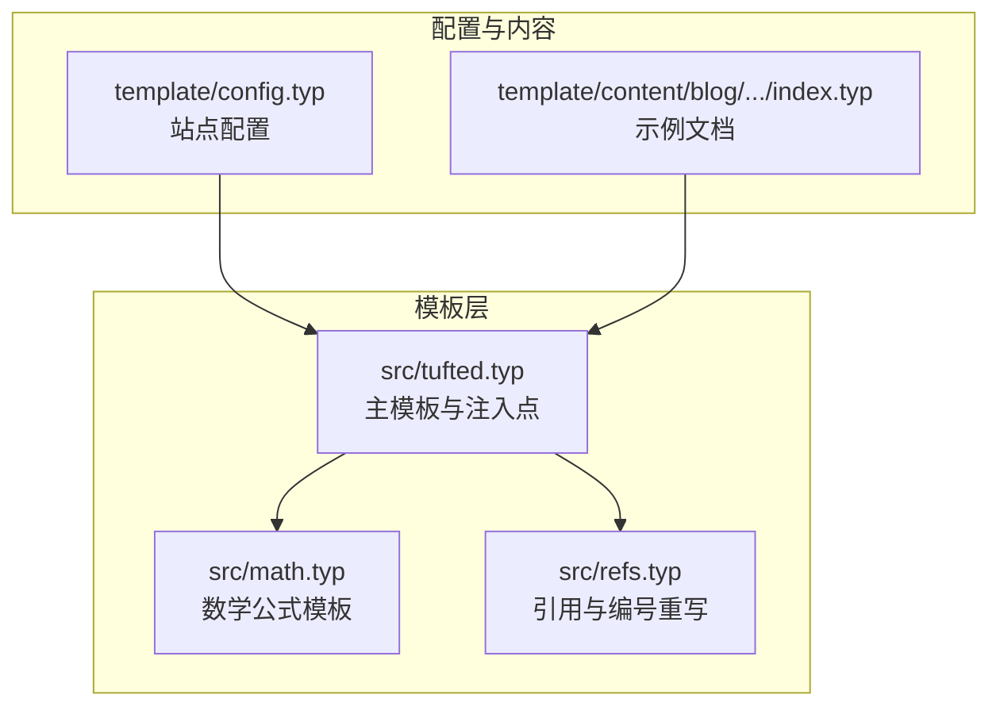
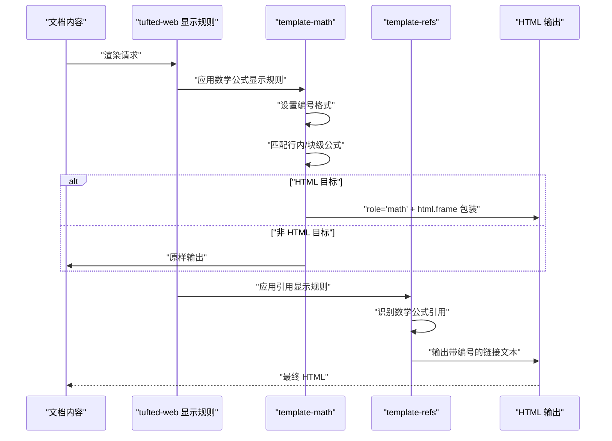
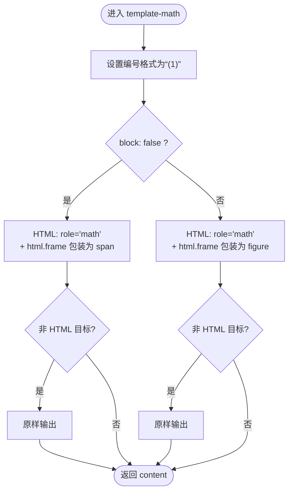
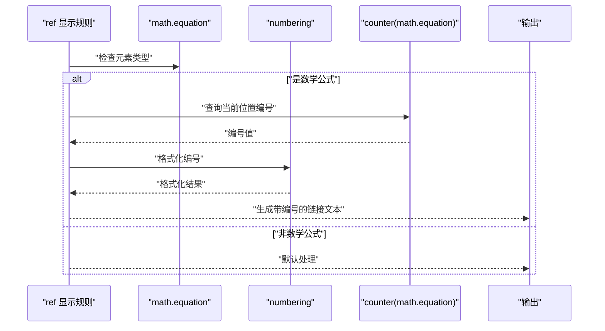
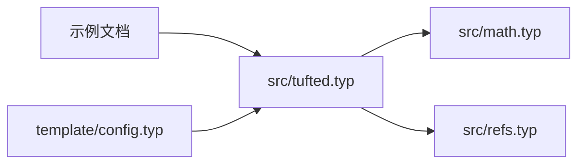

# 数学公式处理

<cite>
**本文引用的文件**
- [src/math.typ](file://src/math.typ)
- [src/refs.typ](file://src/refs.typ)
- [src/tufted.typ](file://src/tufted.typ)
- [template/config.typ](file://template/config.typ)
- [template/content/blog/2025-10-30-normal-distribution/index.typ](file://template/content/blog/2025-10-30-normal-distribution/index.typ)
- [template/content/docs/02-configuration/index.typ](file://template/content/docs/02-configuration/index.typ)
</cite>

## 目录
1. [引言](#引言)
2. [项目结构](#项目结构)
3. [核心组件](#核心组件)
4. [架构总览](#架构总览)
5. [详细组件分析](#详细组件分析)
6. [依赖关系分析](#依赖关系分析)
7. [性能考虑](#性能考虑)
8. [故障排查指南](#故障排查指南)
9. [结论](#结论)
10. [附录](#附录)

## 引言
本文件聚焦于数学公式处理模块，系统性解析 template-math 模板函数的实现与工作机制，涵盖以下主题：
- 方程式编号系统与格式化
- 块级与行内公式的差异化处理
- HTML 渲染中的 role 属性与 frame 包裹策略
- 在不同目标平台（HTML 与其他）下的渲染差异
- 实际使用示例：如何在文档中插入与引用数学公式
- 性能优化策略与最佳实践

## 项目结构
该仓库采用“模板 + 内容”的分层组织方式。数学公式处理位于 src/math.typ，并通过 src/tufted.typ 注入到 tufted-web 主模板中；引用系统由 src/refs.typ 提供；模板配置位于 template/config.typ；示例页面展示了行内与块级公式的使用。

图表来源
- [src/tufted.typ:1-64](file://src/tufted.typ#L1-L64)
- [src/math.typ:1-22](file://src/math.typ#L1-L22)
- [src/refs.typ:1-23](file://src/refs.typ#L1-L23)
- [template/config.typ:1-12](file://template/config.typ#L1-L12)
- [template/content/blog/2025-10-30-normal-distribution/index.typ:1-56](file://template/content/blog/2025-10-30-normal-distribution/index.typ#L1-L56)

章节来源
- [src/tufted.typ:1-64](file://src/tufted.typ#L1-L64)
- [src/math.typ:1-22](file://src/math.typ#L1-L22)
- [src/refs.typ:1-23](file://src/refs.typ#L1-L23)
- [template/config.typ:1-12](file://template/config.typ#L1-L12)
- [template/content/blog/2025-10-30-normal-distribution/index.typ:1-56](file://template/content/blog/2025-10-30-normal-distribution/index.typ#L1-L56)

## 核心组件
- template-math(content)：统一设置数学公式编号格式，并为行内与块级公式在 HTML 目标下分别包裹为 span 或 figure，同时注入 role="math" 以增强可访问性与语义表达。
- template-refs(content)：重写 ref 行为，对数学公式引用进行特殊处理，结合 numbering 与 counter 输出符合预期的编号文本。
- tufted-web：作为主模板，将 template-math、template-refs 等模板注入到显示规则链中，形成完整的渲染管线。
- 配置与示例：template/config.typ 定义站点基础配置；示例文档展示行内与块级公式的典型用法。

章节来源
- [src/math.typ:1-22](file://src/math.typ#L1-L22)
- [src/refs.typ:1-23](file://src/refs.typ#L1-L23)
- [src/tufted.typ:17-64](file://src/tufted.typ#L17-L64)
- [template/config.typ:1-12](file://template/config.typ#L1-L12)

## 架构总览
template-math 与 template-refs 通过 tufted-web 的显示规则注入，共同完成数学公式从“编号 → 渲染 → 引用”的完整流程。其关键路径如下：
- 设置编号格式：在模板初始化时设定数学公式编号格式。
- 区分行内/块级：根据 block: true/false 分别走不同的渲染分支。
- HTML 平台增强：在 HTML 目标下，为公式添加 role="math" 并通过 html.frame 进行包装，便于样式与可访问性处理。
- 引用重写：当 ref 指向数学公式时，使用 numbering 与 counter 输出一致的编号文本。

图表来源
- [src/tufted.typ:27-32](file://src/tufted.typ#L27-L32)
- [src/math.typ:2-21](file://src/math.typ#L2-L21)
- [src/refs.typ:7-14](file://src/refs.typ#L7-L14)

## 详细组件分析

### 组件一：template-math（数学公式模板）
- 编号系统
  - 在模板初始化阶段设置数学公式编号格式为“(1)”。
  - 该格式在 HTML 目标下被引用系统通过 numbering 与 counter 机制复用，确保引用与公式编号一致。
- 行内公式处理
  - 当 block: false 时，在 HTML 目标下将公式包裹为 span，并设置 role="math"，同时通过 html.frame 进行包装，便于样式与可访问性处理。
  - 在非 HTML 目标下保持原样输出。
- 块级公式处理
  - 当 block: true 时，在 HTML 目标下将公式包裹为 figure，并设置 role="math"，同时通过 html.frame 包装。
  - 在非 HTML 目标下保持原样输出。
- 作用域与返回
  - 模板以 content 作为最终输出，保证其他显示规则仍可继续生效。

图表来源
- [src/math.typ:2-21](file://src/math.typ#L2-L21)

章节来源
- [src/math.typ:1-22](file://src/math.typ#L1-L22)

### 组件二：template-refs（引用与编号重写）
- 目标
  - 对 ref 行为进行重写，当引用指向数学公式时，使用 numbering 与 counter 输出一致的编号文本。
- 关键逻辑
  - 识别元素类型是否为 math.equation。
  - 使用 numbering 与 counter(eq).at(el.location()) 获取当前公式位置的编号值。
  - 将编号与链接目标（el.location()）组合为可点击的引用文本。
- 与 template-math 的协作
  - 两者配合确保“公式编号 → 引用编号”一致，且在 HTML 目标下具备可访问性语义。

图表来源
- [src/refs.typ:7-14](file://src/refs.typ#L7-L14)

章节来源
- [src/refs.typ:1-23](file://src/refs.typ#L1-L23)

### 组件三：tufted-web（主模板与注入点）
- 注入顺序
  - 在 tufted-web 中，通过 show: 指令依次应用 template-math、template-refs 等模板，形成稳定的渲染链。
- 作用
  - 将数学公式模板与引用模板整合进主模板，使数学公式在 HTML 目标下具备统一的编号、渲染与引用行为。

章节来源
- [src/tufted.typ:27-32](file://src/tufted.typ#L27-L32)

### 组件四：配置与示例（template/config.typ 与示例文档）
- 配置
  - template/config.typ 定义站点基础配置，如标题、导航等，为 tufted-web 提供顶层参数。
- 示例
  - 示例文档展示了行内公式与块级公式的典型用法，验证了 template-math 在 HTML 目标下的渲染效果。

章节来源
- [template/config.typ:1-12](file://template/config.typ#L1-L12)
- [template/content/blog/2025-10-30-normal-distribution/index.typ:14-18](file://template/content/blog/2025-10-30-normal-distribution/index.typ#L14-L18)

## 依赖关系分析
- 模块耦合
  - template-math 与 template-refs 通过 tufted-web 的显示规则链耦合，彼此依赖编号格式与 counter 的一致性。
  - template-refs 依赖 math.equation 的位置信息与编号值，从而正确生成引用文本。
- 导入关系
  - tufted-web 导入并应用 template-math、template-refs 等模板。
  - 示例文档通过导入根模板，间接继承数学公式处理能力。

图表来源
- [src/tufted.typ:1-6](file://src/tufted.typ#L1-L6)
- [src/math.typ:1-22](file://src/math.typ#L1-L22)
- [src/refs.typ:1-23](file://src/refs.typ#L1-L23)
- [template/config.typ:1-12](file://template/config.typ#L1-L12)
- [template/content/blog/2025-10-30-normal-distribution/index.typ:1-4](file://template/content/blog/2025-10-30-normal-distribution/index.typ#L1-L4)

章节来源
- [src/tufted.typ:1-6](file://src/tufted.typ#L1-L6)
- [src/math.typ:1-22](file://src/math.typ#L1-L22)
- [src/refs.typ:1-23](file://src/refs.typ#L1-L23)
- [template/config.typ:1-12](file://template/config.typ#L1-L12)
- [template/content/blog/2025-10-30-normal-distribution/index.typ:1-4](file://template/content/blog/2025-10-30-normal-distribution/index.typ#L1-L4)

## 性能考虑
- 目标平台分支
  - 仅在 HTML 目标下执行额外的 role 与 frame 包裹，避免在非 HTML 目标下引入不必要的开销。
- 编号计算
  - 引用编号通过 counter(eq).at(el.location()) 获取，避免重复计算，提高效率。
- 模板注入顺序
  - 将 template-math 放在 template-refs 之前，确保编号在引用前已确定，减少回溯成本。
- 最佳实践
  - 合理使用块级与行内公式：块级公式会引入 figure 包裹，可能增加 DOM 结构复杂度，应按需选择。
  - 控制公式数量：过多公式会增加渲染与计数开销，建议在长文档中分节或分页处理。

## 故障排查指南
- 现象：引用未显示编号
  - 排查要点：确认 template-refs 是否正确识别 math.equation 类型；检查 numbering 与 counter 的组合是否一致。
  - 参考路径：[src/refs.typ:7-14](file://src/refs.typ#L7-L14)
- 现象：HTML 中无 role="math"
  - 排查要点：确认 target() 判断与 html.frame 调用是否在 HTML 目标下执行。
  - 参考路径：[src/math.typ:4-18](file://src/math.typ#L4-L18)
- 现象：块级公式未被 figure 包裹
  - 排查要点：确认 block: true 的匹配逻辑与 HTML 目标判断。
  - 参考路径：[src/math.typ:12-18](file://src/math.typ#L12-L18)
- 现象：编号格式不符合预期
  - 排查要点：检查 template-math 初始化时的编号格式设置与 template-refs 中 numbering 的调用。
  - 参考路径：[src/math.typ:2](file://src/math.typ#L2)、[src/refs.typ:10-13](file://src/refs.typ#L10-L13)

章节来源
- [src/refs.typ:7-14](file://src/refs.typ#L7-L14)
- [src/math.typ:2](file://src/math.typ#L2)
- [src/math.typ:4-18](file://src/math.typ#L4-L18)
- [src/refs.typ:10-13](file://src/refs.typ#L10-L13)

## 结论
该数学公式处理模块通过 template-math 与 template-refs 的协同，实现了：
- 统一的编号格式“(1)”
- 行内与块级公式的差异化渲染（HTML 下 role 与 frame 增强）
- 数学公式引用的自动编号与链接生成
- 在不同目标平台下的差异化输出策略

整体设计简洁、职责清晰，易于扩展与维护。

## 附录

### 实际使用示例
- 行内公式
  - 示例路径：[template/content/blog/2025-10-30-normal-distribution/index.typ:16](file://template/content/blog/2025-10-30-normal-distribution/index.typ#L16)
- 块级公式
  - 示例路径：[template/content/blog/2025-10-30-normal-distribution/index.typ:14-18](file://template/content/blog/2025-10-30-normal-distribution/index.typ#L14-L18)
- 引用公式
  - 示例路径：[template/content/blog/2025-10-30-normal-distribution/index.typ:12](file://template/content/blog/2025-10-30-normal-distribution/index.typ#L12)

章节来源
- [template/content/blog/2025-10-30-normal-distribution/index.typ:12-18](file://template/content/blog/2025-10-30-normal-distribution/index.typ#L12-L18)