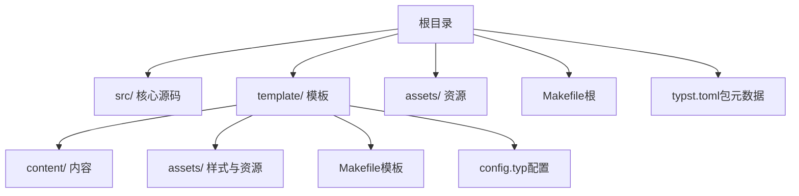

# 快速开始

<cite>
**本文引用的文件**
- [typst.toml](file://typst.toml)
- [Makefile（根）](file://Makefile)
- [Makefile（模板）](file://template/Makefile)
- [README（模板）](file://template/README.md)
- [README（项目）](file://README.md)
- [config.typ](file://template/config.typ)
- [layout.typ](file://src/layout.typ)
- [index.typ（模板首页）](file://template/content/index.typ)
- [index.typ（文档快速开始）](file://template/content/docs/01-quick-start/index.typ)
- [index.typ（博客示例）](file://template/content/blog/2024-10-04-iterators-generators/index.typ)
- [custom.css](file://template/assets/custom.css)
- [tufted.css](file://template/assets/tufted.css)
</cite>

## 目录
1. [简介](#简介)
2. [项目结构](#项目结构)
3. [环境要求与依赖](#环境要求与依赖)
4. [安装步骤](#安装步骤)
5. [构建与运行](#构建与运行)
6. [项目结构详解](#项目结构详解)
7. [常见配置选项](#常见配置选项)
8. [探索示例内容](#探索示例内容)
9. [故障排除](#故障排除)
10. [结语](#结语)

## 简介
TwilightPage 是基于 Typst 的静态网站模板，使用实验性的 HTML 导出功能生成响应式网页。它通过 Makefile 自动化构建流程，无需额外的 JavaScript 构建工具，仅需基础的 make 工具即可运行。模板内置了优雅的排版风格、边注系统以及数学公式支持，并提供了完整的示例内容帮助你快速上手。

## 项目结构
本仓库采用“模板 + 源码”的组织方式：
- 根目录包含包元数据与顶层构建脚本
- src/ 存放核心布局与样式逻辑
- template/ 提供完整的网站模板（内容、样式、构建脚本）
- assets/ 放置站点资源（图片、CSS 等）

图表来源
- [Makefile（根）:1-60](file://Makefile#L1-L60)
- [Makefile（模板）:1-27](file://template/Makefile#L1-L27)
- [typst.toml:1-19](file://typst.toml#L1-L19)

章节来源
- [Makefile（根）:1-60](file://Makefile#L1-L60)
- [Makefile（模板）:1-27](file://template/Makefile#L1-L27)
- [typst.toml:1-19](file://typst.toml#L1-L19)

## 环境要求与依赖
- Typst 编译器：版本要求为 0.14.0
- 基础构建工具：make（用于自动化编译与部署）
- 可选：typst-package-check（用于检查包规范）

章节来源
- [typst.toml:10-10](file://typst.toml#L10-L10)
- [Makefile（根）:51-52](file://Makefile#L51-L52)

## 安装步骤
1. 初始化模板
   - 使用 Typst 包注册表初始化模板到本地项目目录
   - 命令示例：typst init @preview/tufted:0.1.1
   - 预期输出：在当前目录生成模板文件与内容示例

2. 进入项目目录
   - cd 到新建的项目目录

3. 构建网站
   - 执行 make html 开始构建
   - 预期输出：生成 _site/ 目录，包含所有页面的 HTML 文件

章节来源
- [README（项目）:9-19](file://README.md#L9-L19)
- [README（模板）:9-19](file://template/README.md#L9-L19)
- [Makefile（根）:54-55](file://Makefile#L54-L55)

## 构建与运行
- 构建命令：make html
  - 该命令会自动执行链接、同步资源并编译所有 .typ 文件
  - 编译后生成的静态文件位于 template/_site/ 下
- 清理命令：make clean
  - 删除生成的 _site/ 目录并清理临时文件
- 检查命令：make check
  - 使用 typst-package-check 检查包规范与常见问题

章节来源
- [Makefile（根）:46-59](file://Makefile#L46-L59)
- [Makefile（模板）:23-24](file://template/Makefile#L23-L24)

## 项目结构详解
- src/ 核心源码
  - layout.typ：定义边注与全宽内容等布局组件
- template/ 模板
  - content/：存放所有页面内容，按主题分类（如 blog、docs、cv）
  - assets/：样式与资源文件（自定义 CSS、主题 CSS、图片）
  - config.typ：站点配置（标题、导航链接等）
  - Makefile：模板级构建规则（将 .typ 编译为 .html）
- 根目录
  - typst.toml：包元数据与模板入口
  - Makefile：顶层构建脚本（链接本地包、打包等）

章节来源
- [layout.typ:1-13](file://src/layout.typ#L1-L13)
- [config.typ:1-12](file://template/config.typ#L1-L12)
- [Makefile（模板）:1-27](file://template/Makefile#L1-L27)
- [typst.toml:1-19](file://typst.toml#L1-L19)

## 常见配置选项
- 站点标题与导航
  - 在 config.typ 中设置站点标题与顶部导航链接
  - 示例路径：template/config.typ
- 自定义样式
  - 修改 template/assets/custom.css 添加个性化样式
  - 主题样式由 template/assets/tufted.css 提供
- 页面布局
  - 使用 src/layout.typ 中的组件（如边注、全宽内容）增强页面表现

章节来源
- [config.typ:3-11](file://template/config.typ#L3-L11)
- [custom.css:1-1](file://template/assets/custom.css#L1-L1)
- [tufted.css:1-166](file://template/assets/tufted.css#L1-L166)
- [layout.typ:3-12](file://src/layout.typ#L3-L12)

## 探索示例内容
- 首页
  - 模板首页展示了如何嵌入 Markdown 并使用边注
  - 示例路径：template/content/index.typ
- 快速开始文档
  - 模板自带的入门指南，包含安装与构建说明
  - 示例路径：template/content/docs/01-quick-start/index.typ
- 博客示例
  - 展示了代码块、图片与脚注的使用
  - 示例路径：template/content/blog/2024-10-04-iterators-generators/index.typ
- 其他示例
  - CV、文档、嵌入 Markdown 等内容位于相应目录中

章节来源
- [index.typ（模板首页）:1-33](file://template/content/index.typ#L1-L33)
- [index.typ（文档快速开始）:1-24](file://template/content/docs/01-quick-start/index.typ#L1-L24)
- [index.typ（博客示例）:1-53](file://template/content/blog/2024-10-04-iterators-generators/index.typ#L1-L53)

## 故障排除
- Typst 版本不匹配
  - 症状：编译失败或功能异常
  - 处理：确保使用 0.14.0 版本的 Typst
  - 参考：typst.toml 中的 compiler 字段
- 构建失败（找不到依赖）
  - 症状：无法解析模板或包
  - 处理：执行 make link 将本地包链接到缓存目录
  - 参考：Makefile（根）中的 link 目标
- 生成文件为空
  - 症状：_site/ 目录下无内容
  - 处理：确认 content/ 下存在 .typ 文件；执行 make clean 后重新构建
  - 参考：Makefile（模板）中的 html 目标
- 样式未生效
  - 症状：页面样式不符合预期
  - 处理：检查 custom.css 是否被正确加载；确认 tufted.css 未被覆盖
  - 参考：assets 目录与 Makefile（模板）中的 assets 目标

章节来源
- [typst.toml:10-10](file://typst.toml#L10-L10)
- [Makefile（根）:11-35](file://Makefile#L11-L35)
- [Makefile（模板）:8-20](file://template/Makefile#L8-L20)

## 结语
按照本指南，你可以在 10 分钟内完成模板初始化、构建与预览。建议先从 template/content/docs/01-quick-start/index.typ 了解完整流程，再浏览其他示例页面熟悉语法与布局。如需进一步定制，可修改 config.typ 与自定义 CSS 文件。