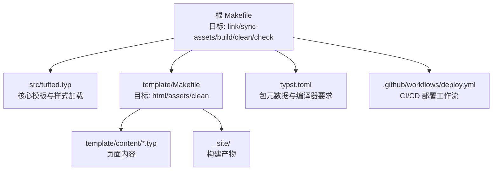
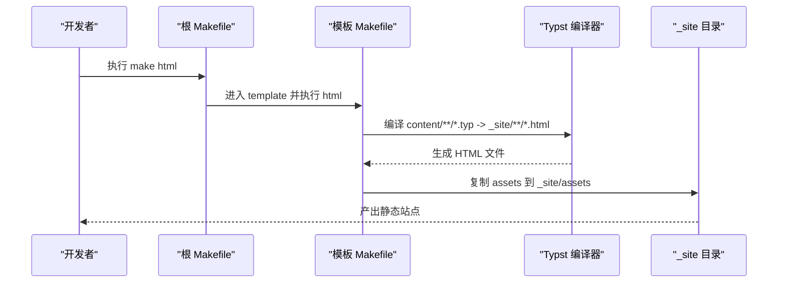
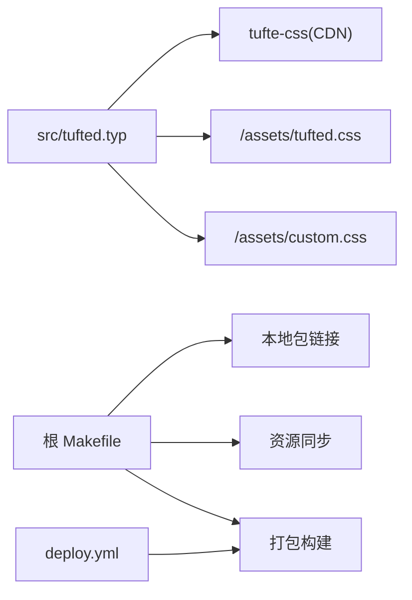

# 故障排除

<cite>
**本文引用的文件**
- [Makefile](file://Makefile)
- [typst.toml](file://typst.toml)
- [src/tufted.typ](file://src/tufted.typ)
- [template/Makefile](file://template/Makefile)
- [template/README.md](file://template/README.md)
- [template/config.typ](file://template/config.typ)
- [template/content/index.typ](file://template/content/index.typ)
- [template/content/docs/01-quick-start/index.typ](file://template/content/docs/01-quick-start/index.typ)
- [template/content/docs/02-configuration/index.typ](file://template/content/docs/02-configuration/index.typ)
- [template/content/docs/03-styling/index.typ](file://template/content/docs/03-styling/index.typ)
- [template/content/docs/04-deploy/index.typ](file://template/content/docs/04-deploy/index.typ)
- [template/assets/custom.css](file://template/assets/custom.css)
- [template/assets/tufted.css](file://template/assets/tufted.css)
- [.github/workflows/deploy.yml](file://.github/workflows/deploy.yml)
</cite>

## 目录
1. [简介](#简介)
2. [项目结构](#项目结构)
3. [核心组件](#核心组件)
4. [架构总览](#架构总览)
5. [详细组件分析](#详细组件分析)
6. [依赖关系分析](#依赖关系分析)
7. [性能考虑](#性能考虑)
8. [故障排除指南](#故障排除指南)
9. [结论](#结论)
10. [附录](#附录)

## 简介
本指南面向使用 TwilightPage（基于 Typst 的静态网站模板）的用户与开发者，提供系统化的故障排除流程、常见问题与解决方案、调试工具与日志分析技巧、性能优化建议、版本兼容与升级策略、社区支持渠道以及问题报告标准格式。内容以仓库中的实际文件为依据，确保可操作性与可追溯性。

## 项目结构
TwilightPage 采用“包（src/）+ 模板（template/）”的双层结构：
- 包（src/tufted.typ）：定义核心模板函数与默认样式加载逻辑。
- 模板（template/）：提供示例网站、构建脚本、样式与文档页面。
- 根目录构建与打包：通过根 Makefile 提供链接本地包、同步资源、清理与打包等目标。

图表来源
- [Makefile:1-60](file://Makefile#L1-L60)
- [src/tufted.typ:1-64](file://src/tufted.typ#L1-L64)
- [template/Makefile:1-27](file://template/Makefile#L1-L27)
- [typst.toml:1-19](file://typst.toml#L1-L19)
- [.github/workflows/deploy.yml](file://.github/workflows/deploy.yml)

章节来源
- [Makefile:1-60](file://Makefile#L1-L60)
- [typst.toml:1-19](file://typst.toml#L1-L19)

## 核心组件
- 核心模板函数：在包入口中导入数学、参考文献、注释与图示模块，并提供 tufted-web 主模板，负责注入默认样式表与页面结构。
- 构建系统：根 Makefile 负责本地包链接、资源同步、清理与打包；模板 Makefile 负责将 content 下的 .typ 编译为 HTML 并复制静态资源到 _site。
- 配置与导航：模板 config.typ 定义顶部导航链接与标题，作为页面继承的基础。
- 文档与示例：docs 子文档覆盖快速开始、配置、样式与部署，便于定位问题与验证修复。

章节来源
- [src/tufted.typ:1-64](file://src/tufted.typ#L1-L64)
- [template/config.typ:1-12](file://template/config.typ#L1-L12)
- [template/Makefile:1-27](file://template/Makefile#L1-L27)
- [Makefile:1-60](file://Makefile#L1-L60)

## 架构总览
下图展示从源码到最终站点的关键流程：内容页通过模板配置渲染为 HTML，再由构建脚本输出至 _site 目录；部署工作流在 CI 中完成相同步骤并发布到 Pages。

图表来源
- [Makefile:54-55](file://Makefile#L54-L55)
- [template/Makefile:14-16](file://template/Makefile#L14-L16)
- [template/Makefile:18-20](file://template/Makefile#L18-L20)

## 详细组件分析

### 组件一：样式与主题（custom.css 与 tufted.css）
- 默认样式链路：tufted-web 默认加载 tufte-css、tufted.css 与 custom.css，其中 custom.css 后加载，用于覆盖默认样式。
- 响应式行为：在窄屏下，边注会改为内联显示并启用连字符断词；数学公式在深色模式下进行反色处理以增强对比度。
- 自定义建议：如需调整链接颜色或字体大小，修改 custom.css 即可生效。

章节来源
- [src/tufted.typ:21-25](file://src/tufted.typ#L21-L25)
- [template/assets/tufted.css:30-55](file://template/assets/tufted.css#L30-L55)
- [template/assets/tufted.css:131-137](file://template/assets/tufted.css#L131-L137)
- [template/content/docs/03-styling/index.typ:8-21](file://template/content/docs/03-styling/index.typ#L8-L21)
- [template/content/docs/03-styling/index.typ:23-32](file://template/content/docs/03-styling/index.typ#L23-L32)

### 组件二：构建与资源同步（根 Makefile 与模板 Makefile）
- 根 Makefile 目标：
  - link/link-macos/link-linux/link-windows：将当前版本的包链接到 Typst 缓存路径，便于本地开发时直接引用。
  - sync-assets：将模板中的设备图等资源复制到项目 assets 目录。
  - html：先执行 link，再进入 template 执行其 html 目标。
  - build：清理并打包提交所需的压缩包。
- 模板 Makefile 目标：
  - html：扫描 content 下的 .typ 文件，逐个编译为 _site 下的 .html。
  - assets：复制 assets 到 _site。
  - clean：删除 _site 内容。

章节来源
- [Makefile:10-23](file://Makefile#L10-L23)
- [Makefile:38-44](file://Makefile#L38-L44)
- [Makefile:54-59](file://Makefile#L54-L59)
- [template/Makefile:14-16](file://template/Makefile#L14-L16)
- [template/Makefile:18-20](file://template/Makefile#L18-L20)
- [template/Makefile:23-24](file://template/Makefile#L23-L24)

### 组件三：配置与导航（config.typ）
- 在 config.typ 中通过 tufted-web.with 定义 header-links 与 title，作为页面继承的基础。
- 页面可通过导入父级 index.typ 并调用 template.with 覆盖标题等属性，实现层级化配置。

章节来源
- [template/config.typ:3-11](file://template/config.typ#L3-L11)
- [template/content/docs/02-configuration/index.typ:41-52](file://template/content/docs/02-configuration/index.typ#L41-L52)

### 组件四：内容与示例（content/index.typ 与文档）
- content/index.typ 展示了如何引入模板、插入边注与图片，并通过 Markdown 渲染器嵌入 README 内容。
- docs 子文档覆盖初始化、构建、配置、样式与部署，是定位问题与验证修复的重要参考。

章节来源
- [template/content/index.typ:17-32](file://template/content/index.typ#L17-L32)
- [template/content/docs/01-quick-start/index.typ:6-23](file://template/content/docs/01-quick-start/index.typ#L6-L23)
- [template/content/docs/02-configuration/index.typ:6-11](file://template/content/docs/02-configuration/index.typ#L6-L11)
- [template/content/docs/03-styling/index.typ:4-21](file://template/content/docs/03-styling/index.typ#L4-L21)
- [template/content/docs/04-deploy/index.typ:8-52](file://template/content/docs/04-deploy/index.typ#L8-L52)

## 依赖关系分析
- 版本与编译器：typst.toml 指定 compiler 版本与包元数据，确保本地与 CI 使用一致的编译器。
- 包链接：根 Makefile 将当前版本链接到各平台缓存路径，避免因版本不匹配导致的编译失败。
- 样式依赖：默认加载 tufte-css，若网络不可达或版本冲突，可替换为自定义样式链路。

图表来源
- [src/tufted.typ:21-25](file://src/tufted.typ#L21-L25)
- [Makefile:10-23](file://Makefile#L10-L23)
- [Makefile:38-44](file://Makefile#L38-L44)
- [Makefile:58-59](file://Makefile#L58-L59)
- [.github/workflows/deploy.yml](file://.github/workflows/deploy.yml)

章节来源
- [typst.toml:10](file://typst.toml#L10)
- [Makefile:10-23](file://Makefile#L10-L23)
- [src/tufted.typ:21-25](file://src/tufted.typ#L21-L25)

## 性能考虑
- 构建速度
  - 使用模板 Makefile 的并行能力：当前规则按文件逐一编译，可在本地机器上减少不必要的重复编译，建议在变更较少时复用已生成的 _site。
  - 控制资源数量：assets 中仅保留必要图片与样式，避免大体积资源拖慢复制与上传。
- 页面加载优化
  - 图片尺寸：默认限制图片最大高度，建议对大图进行预压缩与合适的尺寸控制。
  - 样式链路：自定义样式后移加载，减少覆盖成本；如需进一步优化，可合并与压缩 CSS。
  - CDN 依赖：tufte-css 来自 CDN，网络波动可能影响首开体验，可考虑在本地托管或回退方案。

章节来源
- [template/assets/tufted.css:20-23](file://template/assets/tufted.css#L20-L23)
- [template/assets/tufted.css:131-137](file://template/assets/tufted.css#L131-L137)
- [src/tufted.typ:21-25](file://src/tufted.typ#L21-L25)

## 故障排除指南

### 一、安装与初始化失败
- 症状
  - typst init 报错或找不到包。
- 可能原因
  - 网络环境无法访问包注册表；本地缓存未正确链接到当前版本。
- 排查步骤
  - 确认网络可达，尝试更换镜像源或代理。
  - 执行根 Makefile 的 link 目标，确保将当前版本链接到对应平台缓存路径。
  - 若仍失败，使用根 Makefile 的 build 目标生成本地包归档，手动安装。
- 相关文件
  - [Makefile:10-23](file://Makefile#L10-L23)
  - [Makefile:58-59](file://Makefile#L58-L59)
  - [template/README.md:9-13](file://template/README.md#L9-L13)

章节来源
- [Makefile:10-23](file://Makefile#L10-L23)
- [Makefile:58-59](file://Makefile#L58-L59)
- [template/README.md:9-13](file://template/README.md#L9-L13)

### 二、编译错误（HTML 生成失败）
- 症状
  - make html 报错，提示找不到内容或编译失败。
- 可能原因
  - content 下存在命名不符合规则的文件（例如以下划线开头的中间文件），或缺少必要的导入。
  - 模板 Makefile 的编译参数或根目录路径设置不正确。
- 排查步骤
  - 检查 content 下是否存在以“_”开头的 .typ 文件，这些会被忽略；确认目标文件命名规范。
  - 确认模板 Makefile 的编译命令与根目录参数是否正确。
  - 清理 _site 后重试，避免旧产物干扰。
- 相关文件
  - [template/Makefile:1-8](file://template/Makefile#L1-L8)
  - [template/Makefile:14-16](file://template/Makefile#L14-L16)
  - [template/Makefile:23-24](file://template/Makefile#L23-L24)

章节来源
- [template/Makefile:1-8](file://template/Makefile#L1-L8)
- [template/Makefile:14-16](file://template/Makefile#L14-L16)
- [template/Makefile:23-24](file://template/Makefile#L23-L24)

### 三、样式问题（边注、数学公式、深色模式异常）
- 症状
  - 边注未显示或布局错乱；数学公式在深色模式下对比度不足；窄屏下边注未内联。
- 可能原因
  - 默认样式链路被覆盖但未完全适配；自定义样式未正确覆盖默认规则；CDN 不可用导致样式缺失。
- 排查步骤
  - 检查 tufted-web 的 css 参数是否被覆盖，恢复默认链路或补充缺失的样式项。
  - 修改 custom.css 以覆盖默认样式；注意加载顺序。
  - 在窄屏设备上验证响应式规则是否生效；检查媒体查询范围。
- 相关文件
  - [src/tufted.typ:21-25](file://src/tufted.typ#L21-L25)
  - [template/assets/tufted.css:30-55](file://template/assets/tufted.css#L30-L55)
  - [template/assets/tufted.css:131-137](file://template/assets/tufted.css#L131-L137)
  - [template/content/docs/03-styling/index.typ:23-43](file://template/content/docs/03-styling/index.typ#L23-L43)

章节来源
- [src/tufted.typ:21-25](file://src/tufted.typ#L21-L25)
- [template/assets/tufted.css:30-55](file://template/assets/tufted.css#L30-L55)
- [template/assets/tufted.css:131-137](file://template/assets/tufted.css#L131-L137)
- [template/content/docs/03-styling/index.typ:23-43](file://template/content/docs/03-styling/index.typ#L23-L43)

### 四、部署故障（GitHub Pages 或本地预览）
- 症状
  - CI 工作流构建失败；本地预览 _site 为空。
- 可能原因
  - CI 中未安装 Typst 或版本不匹配；模板 Makefile 未正确生成 _site；资产未复制。
- 排查步骤
  - 在 CI 中使用提供的工作流模板，确保 checkout、setup-typst 与 make html 步骤齐全。
  - 本地先执行 make html，确认 _site 生成且包含 assets。
  - 如需自定义样式链路，请在 config.typ 中显式声明 css 数组。
- 相关文件
  - [.github/workflows/deploy.yml](file://.github/workflows/deploy.yml)
  - [template/Makefile:18-20](file://template/Makefile#L18-L20)
  - [template/content/docs/04-deploy/index.typ:8-52](file://template/content/docs/04-deploy/index.typ#L8-L52)

章节来源
- [.github/workflows/deploy.yml](file://.github/workflows/deploy.yml)
- [template/Makefile:18-20](file://template/Makefile#L18-L20)
- [template/content/docs/04-deploy/index.typ:8-52](file://template/content/docs/04-deploy/index.typ#L8-L52)

### 五、调试工具与日志分析
- 构建日志
  - 关注模板 Makefile 的编译命令输出，定位具体 .typ 文件与错误位置。
  - 清理 _site 后重新构建，避免缓存干扰。
- 样式调试
  - 临时移除 custom.css 或恢复默认样式链路，确认是否为自定义样式导致的问题。
  - 使用浏览器开发者工具检查元素与媒体查询断点。
- 版本与环境
  - 对照 typst.toml 的 compiler 字段，确保本地与 CI 使用相同版本。
  - 通过根 Makefile 的 link 目标确认本地包版本与缓存一致。

章节来源
- [template/Makefile:14-16](file://template/Makefile#L14-L16)
- [template/Makefile:23-24](file://template/Makefile#L23-L24)
- [typst.toml:10](file://typst.toml#L10)
- [Makefile:10-23](file://Makefile#L10-L23)

### 六、版本兼容性与升级策略
- 当前编译器版本：请遵循 typst.toml 中的 compiler 要求。
- 升级步骤建议
  - 先在本地测试新版本编译器是否能成功生成 HTML。
  - 更新 CI 工作流中的 setup-typst 版本。
  - 如样式或语法有变化，对照 docs 文档逐步调整。
- 注意事项
  - 若自定义样式覆盖较多，升级前先备份 custom.css。
  - 通过根 Makefile 的 build 目标生成归档，便于回滚。

章节来源
- [typst.toml:10](file://typst.toml#L10)
- [template/content/docs/04-deploy/index.typ:31](file://template/content/docs/04-deploy/index.typ#L31)

### 七、社区资源与支持渠道
- 官方与示例
  - 在线演示与文档：稳定版与开发版站点。
  - 仓库与问题反馈：GitHub 仓库与 Issues。
  - Typst Universe 页面：模板索引页。
- 获取帮助
  - 在 Issues 中搜索是否已有类似问题。
  - 提交新 Issue 时附带必要信息（见下一节）。

章节来源
- [README.md:23-29](file://README.md#L23-L29)
- [template/README.md:23-29](file://template/README.md#L23-L29)

### 八、问题报告标准格式
- 基本信息
  - 模板版本与编译器版本（来自 typst.toml）。
  - 操作系统与 shell 环境。
- 复现步骤
  - 从初始化到失败的完整命令序列。
  - 说明是否使用了自定义样式或覆盖默认样式链路。
- 日志与截图
  - 提供 make html 的关键错误片段与 _site 目录结构。
  - 样式问题附带浏览器开发者工具截图。
- 附加信息
  - 是否曾使用过 link 目标；是否在 CI 中复现。
  - 是否尝试过恢复默认样式链路以排除自定义因素。

章节来源
- [typst.toml:1-19](file://typst.toml#L1-L19)
- [Makefile:10-23](file://Makefile#L10-L23)
- [template/Makefile:14-16](file://template/Makefile#L14-L16)

## 结论
通过理解包与模板的职责边界、构建与样式链路、以及 CI/CD 的关键步骤，大多数安装、编译、样式与部署相关问题都能被系统化解决。建议在升级与自定义前做好备份与最小化复现，优先使用官方文档与示例进行比对，最后结合本指南的调试与排障流程定位根因。

## 附录

### A. 快速检查清单
- 确认 typst 编译器版本与 typst.toml 一致。
- 本地执行 make html 成功生成 _site。
- assets 目录存在且包含必需资源。
- 自定义样式未破坏默认链路。
- CI 工作流包含 setup-typst 与 make html 步骤。

章节来源
- [typst.toml:10](file://typst.toml#L10)
- [template/Makefile:18-20](file://template/Makefile#L18-L20)
- [template/content/docs/04-deploy/index.typ:31](file://template/content/docs/04-deploy/index.typ#L31)