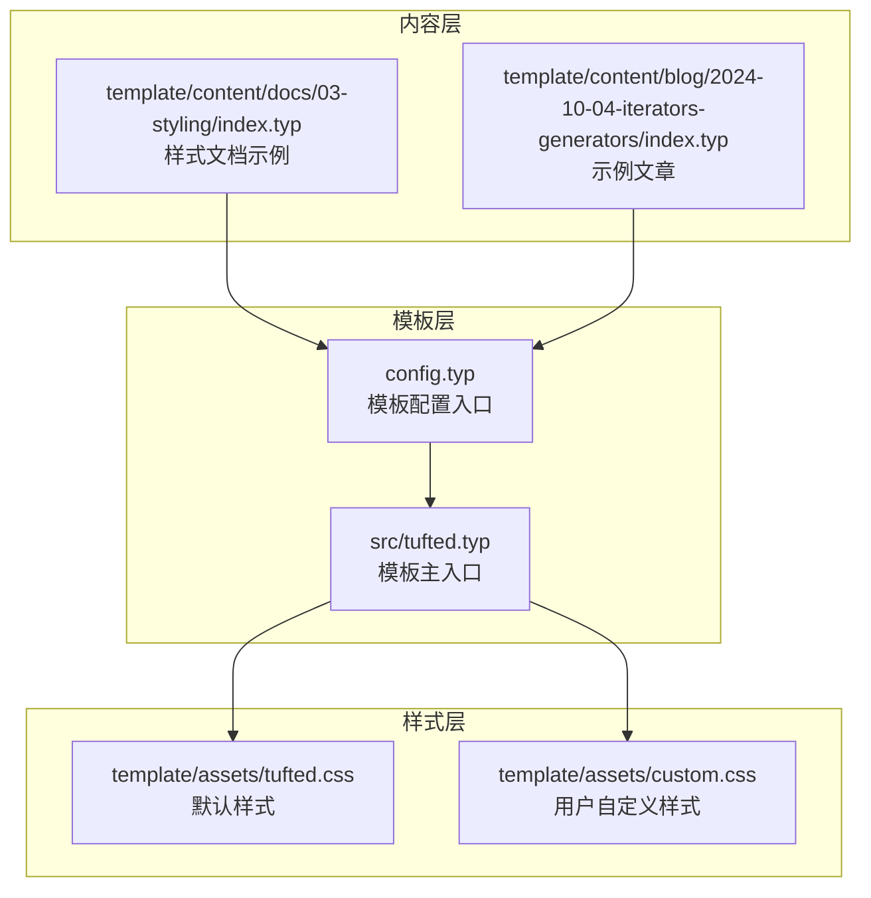
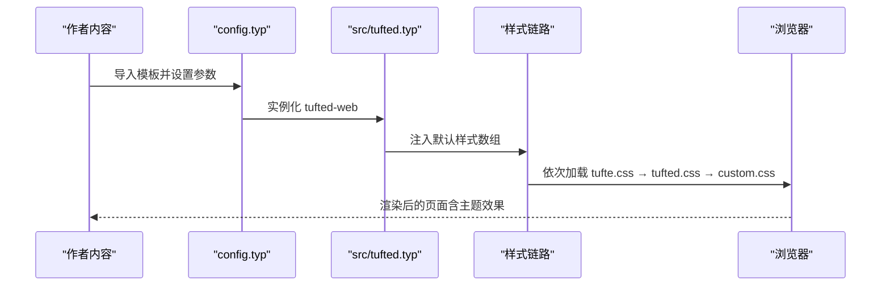
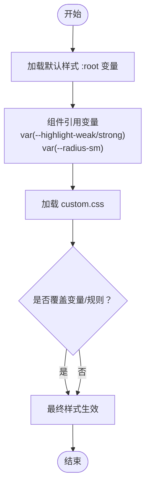
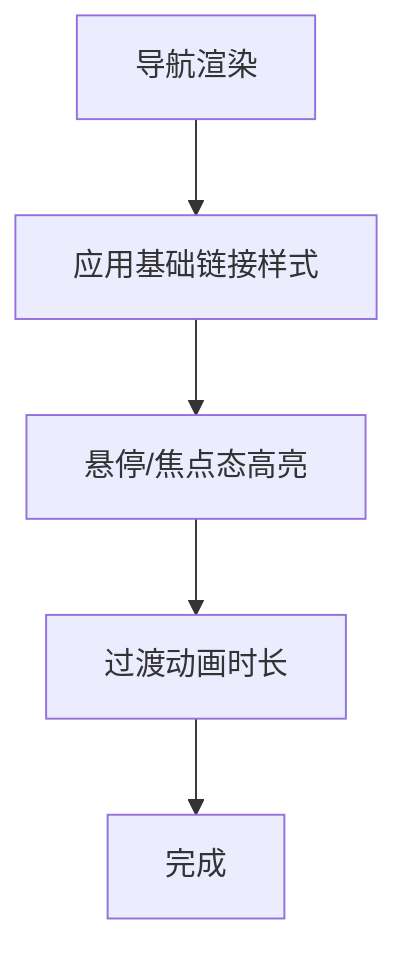
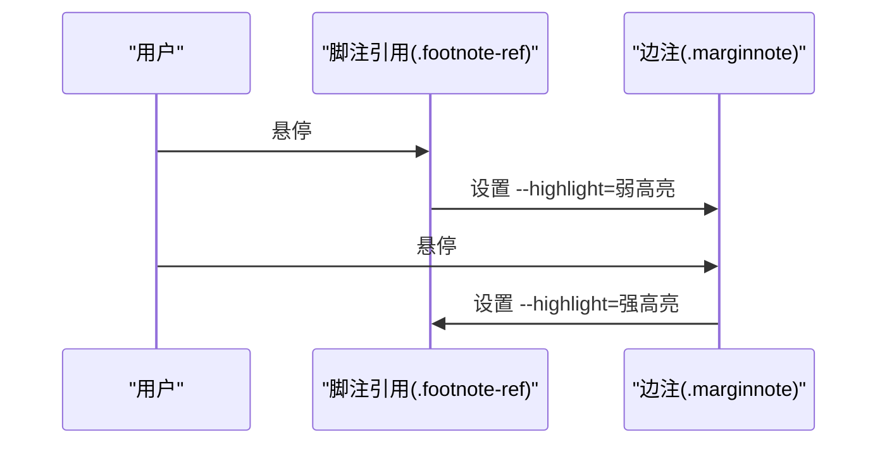
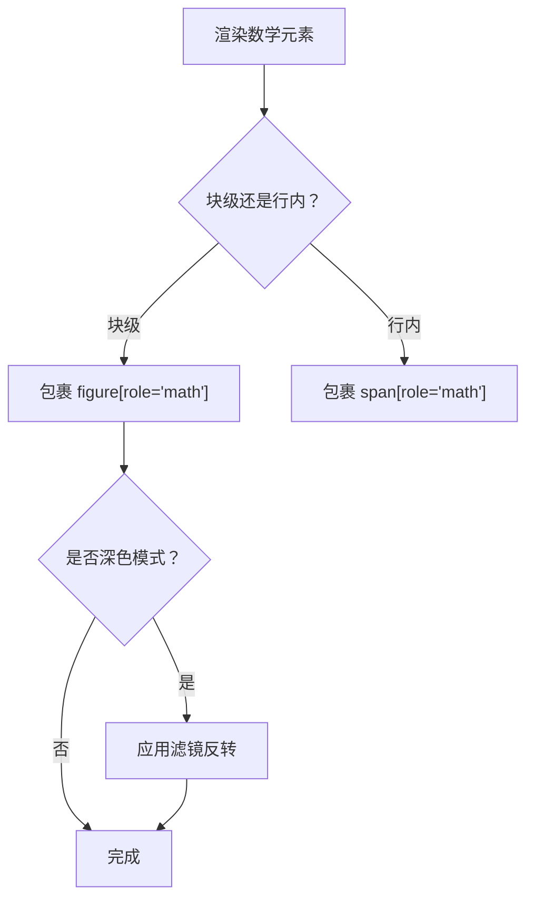
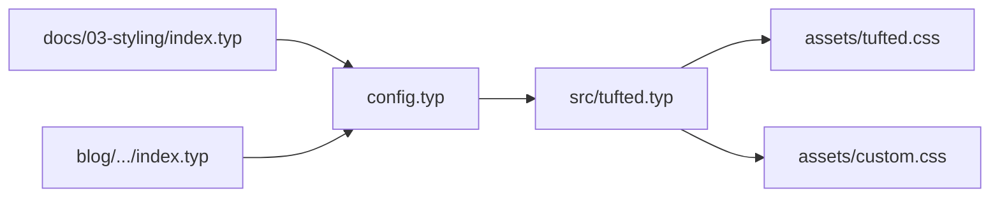

# 主题定制

<cite>
**本文引用的文件**
- [src/tufted.typ](file://src/tufted.typ)
- [template/assets/tufted.css](file://template/assets/tufted.css)
- [template/assets/custom.css](file://template/assets/custom.css)
- [src/math.typ](file://src/math.typ)
- [src/notes.typ](file://src/notes.typ)
- [src/layout.typ](file://src/layout.typ)
- [template/config.typ](file://template/config.typ)
- [template/content/docs/03-styling/index.typ](file://template/content/docs/03-styling/index.typ)
- [template/content/blog/2024-10-04-iterators-generators/index.typ](file://template/content/blog/2024-10-04-iterators-generators/index.typ)
- [Makefile](file://Makefile)
- [typst.toml](file://typst.toml)
</cite>

## 目录
1. [简介](#简介)
2. [项目结构](#项目结构)
3. [核心组件](#核心组件)
4. [架构总览](#架构总览)
5. [详细组件分析](#详细组件分析)
6. [依赖关系分析](#依赖关系分析)
7. [性能考量](#性能考量)
8. [故障排查指南](#故障排查指南)
9. [结论](#结论)
10. [附录](#附录)

## 简介
本篇文档聚焦于 TwilightPage（基于 Tufted 模板）的主题定制能力，系统讲解 CSS 变量体系、导航栏与脚注/边注、数学公式等组件的可定制点，并详述 custom.css 的扩展机制与覆盖规则。同时给出颜色方案、字体与间距等完整定制示例路径、注意事项与常见陷阱，以及深色模式支持与自定义主题创建方法。

## 项目结构
模板采用“样式资源 + 组件模块 + 配置入口”的分层组织方式：
- 样式资源：默认样式与自定义样式分别位于 assets/tufted.css 与 assets/custom.css
- 组件模块：布局、脚注、数学公式、图示等以独立模块导入并组合
- 配置入口：在 config.typ 中声明模板实例化参数（如标题、导航链接、CSS 列表）

图表来源
- [template/config.typ:1-12](file://template/config.typ#L1-L12)
- [src/tufted.typ:17-63](file://src/tufted.typ#L17-L63)
- [template/assets/tufted.css:1-166](file://template/assets/tufted.css#L1-L166)
- [template/assets/custom.css:1-1](file://template/assets/custom.css#L1-L1)
- [template/content/docs/03-styling/index.typ:1-44](file://template/content/docs/03-styling/index.typ#L1-L44)
- [template/content/blog/2024-10-04-iterators-generators/index.typ:1-53](file://template/content/blog/2024-10-04-iterators-generators/index.typ#L1-L53)

章节来源
- [template/config.typ:1-12](file://template/config.typ#L1-L12)
- [src/tufted.typ:17-63](file://src/tufted.typ#L17-L63)
- [Makefile:54-59](file://Makefile#L54-L59)
- [typst.toml:15-19](file://typst.toml#L15-L19)

## 核心组件
- CSS 变量系统
  - 默认变量集中于 :root，如高亮弱/强色与圆角半径等，供多处组件复用
  - 组件通过 var(--xxx) 引用变量，实现统一风格与快速切换
- 导航栏（Header/Nav）
  - 通过 make-header 生成，样式集中在 header nav 及其伪类选择器中
  - 支持悬停/焦点态高亮与过渡动画
- 脚注与边注（Footnotes/Margin Notes）
  - 脚注引用与边注容器通过类名配合 CSS 实现联动高亮
  - 高亮状态由局部变量 --highlight 控制，过渡时序可调
- 数学公式（Math）
  - 块级与行内数学元素通过 role="math" 包裹，适配字号与间距
  - 深色模式下对数学图元进行滤镜反转以提升对比度
- 自定义样式扩展（custom.css）
  - 默认按顺序加载 tufte.css → tufted.css → custom.css
  - 因后加载优先级，用户规则可覆盖默认样式

章节来源
- [template/assets/tufted.css:5-9](file://template/assets/tufted.css#L5-L9)
- [template/assets/tufted.css:62-87](file://template/assets/tufted.css#L62-L87)
- [template/assets/tufted.css:94-118](file://template/assets/tufted.css#L94-L118)
- [src/math.typ:1-22](file://src/math.typ#L1-L22)
- [src/notes.typ:1-27](file://src/notes.typ#L1-L27)
- [src/layout.typ:1-13](file://src/layout.typ#L1-L13)
- [src/tufted.typ:21-25](file://src/tufted.typ#L21-L25)
- [template/content/docs/03-styling/index.typ:23-43](file://template/content/docs/03-styling/index.typ#L23-L43)

## 架构总览
从内容到渲染的关键流程如下：

图表来源
- [template/config.typ:3-11](file://template/config.typ#L3-L11)
- [src/tufted.typ:21-25](file://src/tufted.typ#L21-L25)
- [src/tufted.typ:46-48](file://src/tufted.typ#L46-L48)

## 详细组件分析

### CSS 变量系统与覆盖机制
- 变量集中定义于 :root，如高亮弱/强色与圆角半径等
- 组件通过 var(--xxx) 引用变量，便于统一调整
- custom.css 后加载，可直接覆盖变量或具体规则，实现主题切换

图表来源
- [template/assets/tufted.css:5-9](file://template/assets/tufted.css#L5-L9)
- [template/assets/tufted.css:78](file://template/assets/tufted.css#L78)
- [template/assets/tufted.css:96](file://template/assets/tufted.css#L96)
- [template/assets/tufted.css:104](file://template/assets/tufted.css#L104)
- [template/assets/tufted.css:110](file://template/assets/tufted.css#L110)
- [template/assets/custom.css:1](file://template/assets/custom.css#L1)

章节来源
- [template/assets/tufted.css:5-9](file://template/assets/tufted.css#L5-L9)
- [template/assets/tufted.css:78](file://template/assets/tufted.css#L78)
- [template/assets/tufted.css:96-118](file://template/assets/tufted.css#L96-L118)
- [template/content/docs/03-styling/index.typ:23-43](file://template/content/docs/03-styling/index.typ#L23-L43)

### 导航栏（Header/Nav）主题定制
- 样式范围：header nav 及其链接、伪类选择器
- 关键可定制项：
  - 链接颜色、装饰、阴影与边框
  - 圆角半径（引用变量）
  - 悬停/焦点态背景高亮与过渡时间
- 定制建议：
  - 在 custom.css 中重写链接基础样式与伪类
  - 如需全局圆角风格，可在 :root 覆盖 --radius-sm

图表来源
- [template/assets/tufted.css:62-87](file://template/assets/tufted.css#L62-L87)
- [template/assets/tufted.css:78](file://template/assets/tufted.css#L78)

章节来源
- [template/assets/tufted.css:62-87](file://template/assets/tufted.css#L62-L87)

### 脚注与边注（Footnotes/Margin Notes）主题定制
- DOM 结构：脚注引用与边注容器通过类名关联
- 交互逻辑：
  - 引用悬停时联动高亮边注
  - 边注悬停时联动高亮引用
  - 高亮通过局部变量 --highlight 控制，具备延迟与过渡
- 定制建议：
  - 调整高亮颜色与阴影宽度
  - 修改圆角半径与过渡时序
  - 若需隐藏高亮，可将 --highlight 设为透明

图表来源
- [template/assets/tufted.css:94-118](file://template/assets/tufted.css#L94-L118)
- [src/notes.typ:8-22](file://src/notes.typ#L8-L22)

章节来源
- [template/assets/tufted.css:94-118](file://template/assets/tufted.css#L94-L118)
- [src/notes.typ:1-27](file://src/notes.typ#L1-L27)

### 数学公式（Math）主题定制
- 元素角色：块级 figure[role="math"]，行内 span[role="math"]
- 默认行为：
  - 统一字号与上下间距
  - 深色模式下对数学图元进行滤镜反转以提升对比度
- 定制建议：
  - 调整字号与行高以适配排版密度
  - 如需自定义深色模式表现，可在 custom.css 中补充媒体查询规则

图表来源
- [src/math.typ:12-18](file://src/math.typ#L12-L18)
- [template/assets/tufted.css:126-137](file://template/assets/tufted.css#L126-L137)

章节来源
- [src/math.typ:1-22](file://src/math.typ#L1-L22)
- [template/assets/tufted.css:126-137](file://template/assets/tufted.css#L126-L137)

### custom.css 扩展机制与覆盖规则
- 加载顺序：默认样式 → tufted.css → custom.css
- 覆盖策略：
  - 后加载优先级确保用户规则覆盖默认样式
  - 可通过 :root 覆盖变量，影响所有引用该变量的组件
  - 可针对具体类名（如 .footnote-ref、header nav a）进行精细化覆盖
- 示例路径参考：
  - 链接颜色覆盖：[示例路径:26-32](file://template/content/docs/03-styling/index.typ#L26-L32)
  - 仅使用自定义样式：[示例路径:35-43](file://template/content/docs/03-styling/index.typ#L35-L43)

章节来源
- [src/tufted.typ:21-25](file://src/tufted.typ#L21-L25)
- [template/content/docs/03-styling/index.typ:23-43](file://template/content/docs/03-styling/index.typ#L23-L43)

### 深色模式支持与自定义主题创建
- 深色模式支持：
  - 使用媒体查询 prefers-color-scheme: dark
  - 对数学图元应用滤镜反转以提升对比度
- 自定义主题创建步骤：
  1) 在 :root 定义一组变量（如主色、强调色、背景/前景、圆角等）
  2) 在 custom.css 中覆盖组件样式，或通过变量驱动
  3) 如需深色模式特异化，添加媒体查询规则
  4) 可选：在 config.typ 中替换默认样式列表，仅保留自定义样式

章节来源
- [template/assets/tufted.css:131-137](file://template/assets/tufted.css#L131-L137)
- [template/content/docs/03-styling/index.typ:34-43](file://template/content/docs/03-styling/index.typ#L34-L43)

## 依赖关系分析
- 模板入口依赖各组件模块与样式资源
- 样式资源之间存在层次依赖：tufte.css 提供基础框架，tufted.css 提供主题细节，custom.css 提供最终覆盖
- 内容文档与示例文章通过 config.typ 与模板绑定

图表来源
- [template/config.typ:3-11](file://template/config.typ#L3-L11)
- [src/tufted.typ:21-25](file://src/tufted.typ#L21-L25)
- [template/content/docs/03-styling/index.typ:1-44](file://template/content/docs/03-styling/index.typ#L1-L44)
- [template/content/blog/2024-10-04-iterators-generators/index.typ:1-53](file://template/content/blog/2024-10-04-iterators-generators/index.typ#L1-L53)

章节来源
- [src/tufted.typ:17-63](file://src/tufted.typ#L17-L63)
- [template/assets/tufted.css:1-166](file://template/assets/tufted.css#L1-L166)
- [template/assets/custom.css:1-1](file://template/assets/custom.css#L1-L1)

## 性能考量
- 样式加载顺序固定，避免重复请求与覆盖冲突
- custom.css 后加载，减少不必要的 !important 使用
- 深色模式滤镜仅在匹配媒体查询时生效，降低非必要计算

## 故障排查指南
- 样式未生效
  - 检查 custom.css 是否正确放置于 /template/assets/ 且命名无误
  - 确认构建命令已执行，使模板重新加载样式链路
  - 参考：[构建目标:54-59](file://Makefile#L54-L59)
- 覆盖不生效
  - 确保选择器优先级不低于默认样式
  - 避免过度使用 !important；优先通过结构化选择器与变量覆盖
- 深色模式异常
  - 确认设备/浏览器系统深色模式设置
  - 自定义样式中如需特异化，添加媒体查询规则
- 数学公式显示问题
  - 检查 role="math" 是否正确包裹
  - 调整字号与间距以适配页面密度

章节来源
- [Makefile:54-59](file://Makefile#L54-L59)
- [template/assets/tufted.css:126-137](file://template/assets/tufted.css#L126-L137)
- [src/math.typ:1-22](file://src/math.typ#L1-L22)

## 结论
TwilightPage 的主题系统以 CSS 变量为核心，结合默认样式与自定义样式的加载顺序，提供了灵活而可控的主题定制能力。通过合理利用变量、组件选择器与媒体查询，即可实现颜色方案、字体与间距等全方位定制，并平滑支持深色模式与自定义主题创建。

## 附录
- 快速定位参考
  - 样式加载顺序与覆盖规则：[样式注入位置:21-25](file://src/tufted.typ#L21-L25)
  - 导航栏样式范围：[导航样式段落:62-87](file://template/assets/tufted.css#L62-L87)
  - 脚注/边注联动高亮：[脚注样式段落:94-118](file://template/assets/tufted.css#L94-L118)
  - 数学公式样式与深色模式：[数学样式段落:126-137](file://template/assets/tufted.css#L126-L137)
  - 自定义样式扩展示例路径：[样式文档示例:23-43](file://template/content/docs/03-styling/index.typ#L23-L43)
  - 构建与发布流程：[构建目标:54-59](file://Makefile#L54-L59)