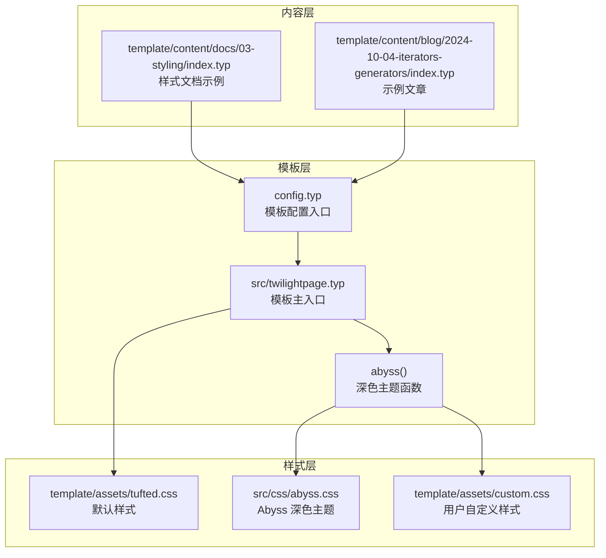
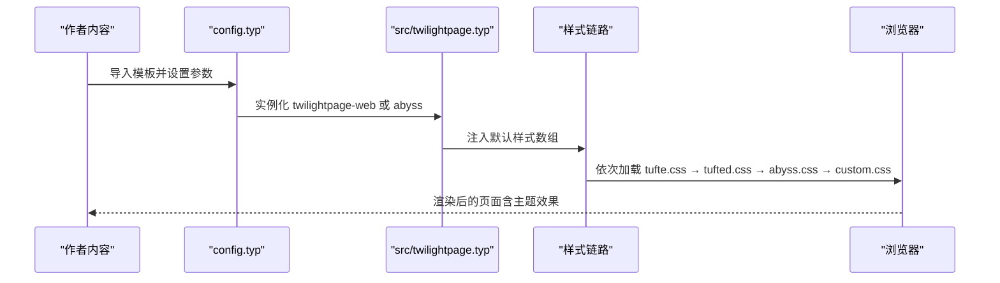
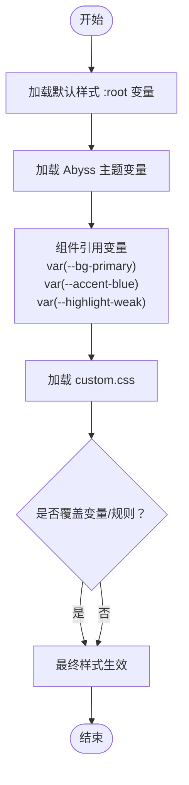
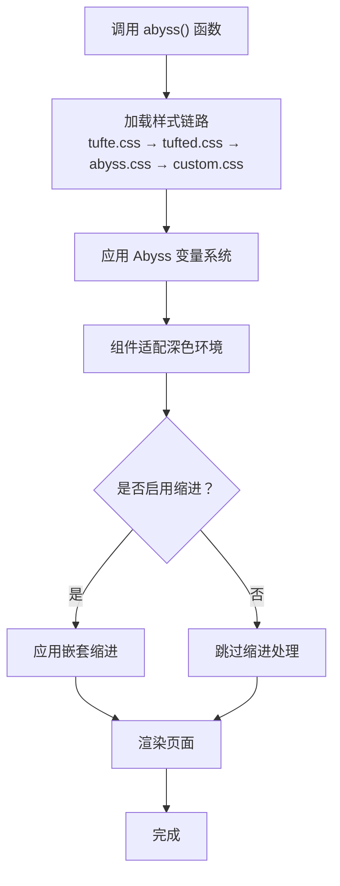
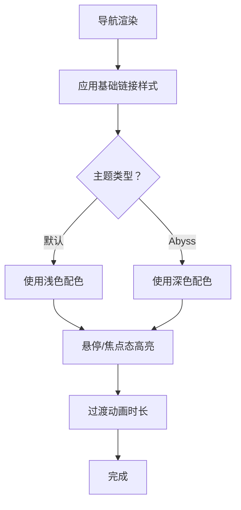
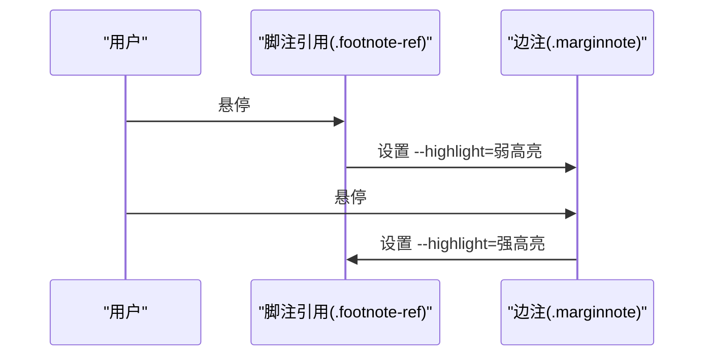
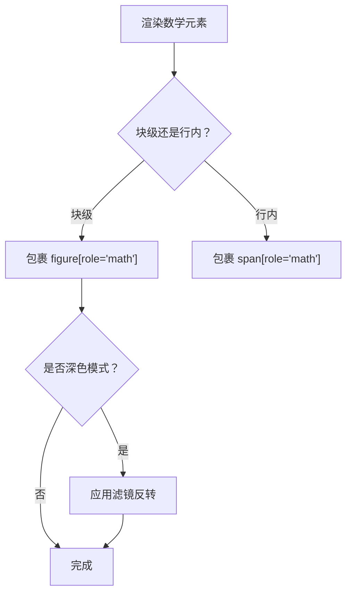
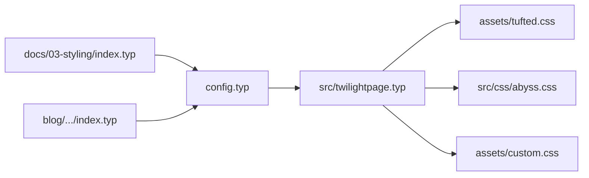

# 主题定制

<cite>
**本文引用的文件**
- [src/twilightpage.typ](file://src/twilightpage.typ)
- [src/css/abyss.css](file://src/css/abyss.css)
- [template/assets/tufted.css](file://template/assets/tufted.css)
- [template/assets/custom.css](file://template/assets/custom.css)
- [src/math.typ](file://src/math.typ)
- [src/notes.typ](file://src/notes.typ)
- [src/layout.typ](file://src/layout.typ)
- [template/config.typ](file://template/config.typ)
- [template/content/docs/03-styling/index.typ](file://template/content/docs/03-styling/index.typ)
- [template/content/blog/2024-10-04-iterators-generators/index.typ](file://template/content/blog/2024-10-04-iterators-generators/index.typ)
- [Makefile](file://Makefile)
- [typst.toml](file://typst.toml)
</cite>

## 更新摘要
**变更内容**
- 新增 Abyss 深色主题功能，包含完整的 CSS 变量系统和 GitHub 风格配色方案
- 新增 390 行 CSS 样式，涵盖背景色、文本色、强调色、边框色、高亮色等完整变量体系
- 新增滚动条定制、选择高亮、嵌套缩进支持等高级特性
- 新增 abyss 函数提供完整的深色主题替代方案
- 扩展主题定制能力，支持更多颜色方案和视觉风格

## 目录
1. [简介](#简介)
2. [项目结构](#项目结构)
3. [核心组件](#核心组件)
4. [架构总览](#架构总览)
5. [详细组件分析](#详细组件分析)
6. [依赖关系分析](#依赖关系分析)
7. [性能考量](#性能考量)
8. [故障排查指南](#故障排查指南)
9. [结论](#结论)
10. [附录](#附录)

## 简介
本篇文档聚焦于 TwilightPage（基于 Tufted 模板）的主题定制能力，系统讲解 CSS 变量体系、导航栏与脚注/边注、数学公式等组件的可定制点，并详述 custom.css 的扩展机制与覆盖规则。**新增** Abyss 深色主题功能提供了完整的深色配色方案，支持 GitHub 风格的视觉设计，包含滚动条定制、选择高亮、嵌套缩进等高级特性。同时给出颜色方案、字体与间距等完整定制示例路径、注意事项与常见陷阱，以及深色模式支持与自定义主题创建方法。

## 项目结构
模板采用"样式资源 + 组件模块 + 配置入口"的分层组织方式：
- 样式资源：默认样式与自定义样式分别位于 assets/tufted.css 与 assets/custom.css，**新增** Abyss 深色主题样式位于 assets/abyss.css
- 组件模块：布局、脚注、数学公式、图示等以独立模块导入并组合
- 配置入口：在 config.typ 中声明模板实例化参数（如标题、导航链接、CSS 列表）

**图表来源**
- [template/config.typ:1-16](file://template/config.typ#L1-L16)
- [src/twilightpage.typ:28-90](file://src/twilightpage.typ#L28-L90)
- [src/twilightpage.typ:92-144](file://src/twilightpage.typ#L92-L144)
- [src/css/abyss.css:1-391](file://src/css/abyss.css#L1-L391)
- [template/assets/tufted.css:1-166](file://template/assets/tufted.css#L1-L166)
- [template/assets/custom.css:1-1](file://template/assets/custom.css#L1-L1)

**章节来源**
- [template/config.typ:1-16](file://template/config.typ#L1-L16)
- [src/twilightpage.typ:28-90](file://src/twilightpage.typ#L28-L90)
- [src/twilightpage.typ:92-144](file://src/twilightpage.typ#L92-L144)
- [Makefile:54-59](file://Makefile#L54-L59)
- [typst.toml:15-19](file://typst.toml#L15-L19)

## 核心组件
- CSS 变量系统
  - 默认变量集中于 :root，如高亮弱/强色与圆角半径等，供多处组件复用
  - **新增** Abyss 主题提供完整的变量体系，包含背景色、文本色、强调色、边框色、高亮色等
  - 组件通过 var(--xxx) 引用变量，实现统一风格与快速切换
- 导航栏（Header/Nav）
  - 通过 make-header 生成，样式集中在 header nav 及其伪类选择器中
  - 支持悬停/焦点态高亮与过渡动画
- 脚注与边注（Footnotes/Margin Notes）
  - 脚注引用与边注容器通过类名配合 CSS 实现联动高亮
  - 高亮状态由局部变量 --highlight 控制，过渡时序可调
- 数学公式（Math）
  - 块级与行内数学元素通过 role="math" 包裹，适配字号与间距
  - 深色模式下对数学图元进行滤镜反转以提升对比度
- **新增** Abyss 深色主题
  - 提供完整的 GitHub 风格深色配色方案
  - 支持滚动条定制、选择高亮、嵌套缩进等高级特性
  - 通过 abyss() 函数提供完整的主题替代方案
- 自定义样式扩展（custom.css）
  - 默认按顺序加载 tufte.css → tufted.css → abyss.css → custom.css
  - 因后加载优先级，用户规则可覆盖默认样式

**章节来源**
- [src/css/abyss.css:11-48](file://src/css/abyss.css#L11-L48)
- [template/assets/tufted.css:5-9](file://template/assets/tufted.css#L5-L9)
- [template/assets/tufted.css:62-87](file://template/assets/tufted.css#L62-L87)
- [template/assets/tufted.css:94-118](file://template/assets/tufted.css#L94-L118)
- [src/math.typ:1-22](file://src/math.typ#L1-L22)
- [src/notes.typ:1-27](file://src/notes.typ#L1-L27)
- [src/layout.typ:1-13](file://src/layout.typ#L1-L13)
- [src/twilightpage.typ:106-144](file://src/twilightpage.typ#L106-L144)
- [src/twilightpage.typ:21-25](file://src/twilightpage.typ#L21-L25)
- [template/content/docs/03-styling/index.typ:23-43](file://template/content/docs/03-styling/index.typ#L23-L43)

## 架构总览
从内容到渲染的关键流程如下：

**图表来源**
- [template/config.typ:5-15](file://template/config.typ#L5-L15)
- [src/twilightpage.typ:28-90](file://src/twilightpage.typ#L28-L90)
- [src/twilightpage.typ:106-144](file://src/twilightpage.typ#L106-L144)
- [src/twilightpage.typ:42-47](file://src/twilightpage.typ#L42-L47)

## 详细组件分析

### CSS 变量系统与覆盖机制
- 变量集中定义于 :root，如高亮弱/强色与圆角半径等
- **新增** Abyss 主题提供完整的变量体系：
  - 背景色：--bg-primary、--bg-secondary、--bg-tertiary、--bg-code
  - 文本色：--text-primary、--text-secondary、--text-muted、--text-heading
  - 强调色：--accent-blue、--accent-purple、--accent-cyan、--accent-green、--accent-orange、--accent-red
  - 边框色：--border-color、--border-hover
  - 高亮色：--highlight-weak、--highlight-strong、--highlight-hover
  - 圆角：--radius-sm、--radius-md
  - 阴影：--shadow-sm、--shadow-md
- 组件通过 var(--xxx) 引用变量，便于统一调整
- custom.css 后加载，可直接覆盖变量或具体规则，实现主题切换

**图表来源**
- [src/css/abyss.css:11-48](file://src/css/abyss.css#L11-L48)
- [template/assets/tufted.css:5-9](file://template/assets/tufted.css#L5-L9)
- [template/assets/tufted.css:78](file://template/assets/tufted.css#L78)
- [template/assets/tufted.css:96](file://template/assets/tufted.css#L96)
- [template/assets/tufted.css:104](file://template/assets/tufted.css#L104)
- [template/assets/tufted.css:110](file://template/assets/tufted.css#L110)
- [template/assets/custom.css:1](file://template/assets/custom.css#L1)

**章节来源**
- [src/css/abyss.css:11-48](file://src/css/abyss.css#L11-L48)
- [template/assets/tufted.css:5-9](file://template/assets/tufted.css#L5-L9)
- [template/assets/tufted.css:78](file://template/assets/tufted.css#L78)
- [template/assets/tufted.css:96-118](file://template/assets/tufted.css#L96-L118)
- [template/content/docs/03-styling/index.typ:23-43](file://template/content/docs/03-styling/index.typ#L23-L43)

### Abyss 深色主题详解
- **主题特色**：提供完整的 GitHub 风格深色配色方案，适合低光环境阅读
- **核心变量**：包含 12 个主要颜色变量组，提供丰富的色彩搭配
- **组件适配**：导航栏、脚注、边注、表格、代码块等组件均针对深色环境优化
- **高级特性**：
  - 滚动条定制：自定义宽度、颜色和悬停效果
  - 选择高亮：提供合适的文本选择颜色
  - 嵌套缩进：支持多层级内容缩进，增强文档层次感
- **使用方式**：通过 abyss() 函数调用，支持缩进参数配置

**图表来源**
- [src/twilightpage.typ:106-144](file://src/twilightpage.typ#L106-L144)
- [src/css/abyss.css:11-48](file://src/css/abyss.css#L11-L48)
- [src/css/abyss.css:374-390](file://src/css/abyss.css#L374-L390)

**章节来源**
- [src/twilightpage.typ:92-144](file://src/twilightpage.typ#L92-L144)
- [src/css/abyss.css:1-391](file://src/css/abyss.css#L1-L391)

### 导航栏（Header/Nav）主题定制
- 样式范围：header nav 及其链接、伪类选择器
- 关键可定制项：
  - 链接颜色、装饰、阴影与边框
  - 圆角半径（引用变量）
  - 悬停/焦点态背景高亮与过渡时间
- **新增** Abyss 主题优化：
  - 深色背景下的链接颜色对比度优化
  - 悬停效果使用 --highlight-weak 变量
  - 支持深色模式下的颜色反转
- 定制建议：
  - 在 custom.css 中重写链接基础样式与伪类
  - 如需全局圆角风格，可在 :root 覆盖 --radius-sm
  - 使用 Abyss 主题变量获得一致的深色体验

**图表来源**
- [template/assets/tufted.css:62-87](file://template/assets/tufted.css#L62-L87)
- [src/css/abyss.css:177-209](file://src/css/abyss.css#L177-L209)
- [template/assets/tufted.css:78](file://template/assets/tufted.css#L78)

**章节来源**
- [template/assets/tufted.css:62-87](file://template/assets/tufted.css#L62-L87)
- [src/css/abyss.css:177-209](file://src/css/abyss.css#L177-L209)

### 脚注与边注（Footnotes/Margin Notes）主题定制
- DOM 结构：脚注引用与边注容器通过类名关联
- 交互逻辑：
  - 引用悬停时联动高亮边注
  - 边注悬停时联动高亮引用
  - 高亮通过局部变量 --highlight 控制，具备延迟与过渡
- **新增** Abyss 主题增强：
  - 使用 --highlight-weak 和 --highlight-strong 变量
  - 深色环境下的高亮对比度优化
  - 支持更细腻的过渡动画
- 定制建议：
  - 调整高亮颜色与阴影宽度
  - 修改圆角半径与过渡时序
  - 若需隐藏高亮，可将 --highlight 设为透明

**图表来源**
- [template/assets/tufted.css:94-118](file://template/assets/tufted.css#L94-L118)
- [src/notes.typ:8-22](file://src/notes.typ#L8-L22)
- [src/css/abyss.css:328-331](file://src/css/abyss.css#L328-L331)

**章节来源**
- [template/assets/tufted.css:94-118](file://template/assets/tufted.css#L94-L118)
- [src/notes.typ:1-27](file://src/notes.typ#L1-L27)
- [src/css/abyss.css:328-331](file://src/css/abyss.css#L328-L331)

### 数学公式（Math）主题定制
- 元素角色：块级 figure[role="math"]，行内 span[role="math"]
- 默认行为：
  - 统一字号与上下间距
  - 深色模式下对数学图元进行滤镜反转以提升对比度
- **新增** Abyss 主题优化：
  - 深色环境下的数学公式颜色适配
  - 保持与整体主题的一致性
- 定制建议：
  - 调整字号与行高以适配排版密度
  - 如需自定义深色模式表现，可在 custom.css 中补充媒体查询规则

**图表来源**
- [src/math.typ:12-18](file://src/math.typ#L12-L18)
- [template/assets/tufted.css:126-137](file://template/assets/tufted.css#L126-L137)

**章节来源**
- [src/math.typ:1-22](file://src/math.typ#L1-L22)
- [template/assets/tufted.css:126-137](file://template/assets/tufted.css#L126-L137)

### custom.css 扩展机制与覆盖规则
- 加载顺序：默认样式 → tufted.css → abyss.css → custom.css
- **新增** Abyss 主题影响：
  - Abyss 主题作为中间层，提供深色基础样式
  - custom.css 仍然具有最高优先级
  - 可以覆盖 Abyss 主题的任何样式
- 覆盖策略：
  - 后加载优先级确保用户规则覆盖默认样式
  - 可通过 :root 覆盖变量，影响所有引用该变量的组件
  - 可针对具体类名（如 .footnote-ref、header nav a）进行精细化覆盖
- 示例路径参考：
  - 链接颜色覆盖：[示例路径:26-32](file://template/content/docs/03-styling/index.typ#L26-L32)
  - 仅使用自定义样式：[示例路径:35-43](file://template/content/docs/03-styling/index.typ#L35-L43)

**章节来源**
- [src/twilightpage.typ:116-121](file://src/twilightpage.typ#L116-L121)
- [template/content/docs/03-styling/index.typ:23-43](file://template/content/docs/03-styling/index.typ#L23-L43)

### 深色模式支持与自定义主题创建
- 深色模式支持：
  - 使用媒体查询 prefers-color-scheme: dark
  - 对数学图元应用滤镜反转以提升对比度
  - **新增** Abyss 主题提供原生深色模式支持
- 自定义主题创建步骤：
  1) 在 :root 定义一组变量（如主色、强调色、背景/前景、圆角等）
  2) 在 custom.css 中覆盖组件样式，或通过变量驱动
  3) 如需深色模式特异化，添加媒体查询规则
  4) 可选：在 config.typ 中替换默认样式列表，仅保留自定义样式
  5) **新增** 使用 abyss() 函数快速应用深色主题

**章节来源**
- [template/assets/tufted.css:131-137](file://template/assets/tufted.css#L131-L137)
- [src/css/abyss.css:11-48](file://src/css/abyss.css#L11-L48)
- [template/content/docs/03-styling/index.typ:34-43](file://template/content/docs/03-styling/index.typ#L34-L43)

## 依赖关系分析
- 模板入口依赖各组件模块与样式资源
- 样式资源之间存在层次依赖：tufte.css 提供基础框架，tufted.css 提供主题细节，**abyss.css 提供深色主题替代方案**，custom.css 提供最终覆盖
- 内容文档与示例文章通过 config.typ 与模板绑定
- **新增** Abyss 主题通过独立的样式文件提供深色替代方案

**图表来源**
- [template/config.typ:5-15](file://template/config.typ#L5-L15)
- [src/twilightpage.typ:28-90](file://src/twilightpage.typ#L28-L90)
- [src/twilightpage.typ:106-144](file://src/twilightpage.typ#L106-L144)
- [template/assets/tufted.css:1-166](file://template/assets/tufted.css#L1-L166)
- [src/css/abyss.css:1-391](file://src/css/abyss.css#L1-L391)
- [template/content/docs/03-styling/index.typ:1-44](file://template/content/docs/03-styling/index.typ#L1-L44)
- [template/content/blog/2024-10-04-iterators-generators/index.typ:1-53](file://template/content/blog/2024-10-04-iterators-generators/index.typ#L1-L53)

**章节来源**
- [src/twilightpage.typ:28-90](file://src/twilightpage.typ#L28-L90)
- [src/twilightpage.typ:92-144](file://src/twilightpage.typ#L92-L144)
- [template/assets/tufted.css:1-166](file://template/assets/tufted.css#L1-L166)
- [src/css/abyss.css:1-391](file://src/css/abyss.css#L1-L391)
- [template/assets/custom.css:1-1](file://template/assets/custom.css#L1-L1)

## 性能考量
- 样式加载顺序固定，避免重复请求与覆盖冲突
- custom.css 后加载，减少不必要的 !important 使用
- 深色模式滤镜仅在匹配媒体查询时生效，降低非必要计算
- **新增** Abyss 主题采用 CSS 变量，减少重复样式定义
- **新增** 滚动条定制使用现代 CSS 属性，兼容性良好

## 故障排查指南
- 样式未生效
  - 检查 custom.css 是否正确放置于 /template/assets/ 且命名无误
  - 确认构建命令已执行，使模板重新加载样式链路
  - **新增** 确认 Abyss 主题文件存在且路径正确
  - 参考：[构建目标:54-59](file://Makefile#L54-L59)
- 覆盖不生效
  - 确保选择器优先级不低于默认样式
  - 避免过度使用 !important；优先通过结构化选择器与变量覆盖
  - **新增** 在 Abyss 主题下，注意变量覆盖的优先级
- 深色模式异常
  - 确认设备/浏览器系统深色模式设置
  - 自定义样式中如需特异化，添加媒体查询规则
  - **新增** 使用 Abyss 主题时，检查变量覆盖是否正确
- 数学公式显示问题
  - 检查 role="math" 是否正确包裹
  - 调整字号与间距以适配页面密度
- **新增** Abyss 主题相关问题
  - 检查 CSS 变量是否正确应用
  - 确认滚动条样式在不同浏览器中的兼容性
  - 验证嵌套缩进功能是否正常工作

**章节来源**
- [Makefile:54-59](file://Makefile#L54-L59)
- [template/assets/tufted.css:126-137](file://template/assets/tufted.css#L126-L137)
- [src/math.typ:1-22](file://src/math.typ#L1-L22)
- [src/css/abyss.css:1-391](file://src/css/abyss.css#L1-L391)

## 结论
TwilightPage 的主题系统以 CSS 变量为核心，结合默认样式、Abyss 深色主题与自定义样式的加载顺序，提供了灵活而可控的主题定制能力。**新增的 Abyss 深色主题**进一步扩展了主题选择，提供完整的 GitHub 风格深色配色方案，包含滚动条定制、选择高亮、嵌套缩进等高级特性。通过合理利用变量、组件选择器与媒体查询，即可实现颜色方案、字体与间距等全方位定制，并平滑支持深色模式与自定义主题创建。

## 附录
- 快速定位参考
  - 样式加载顺序与覆盖规则：[样式注入位置:21-25](file://src/twilightpage.typ#L21-L25)
  - **新增** Abyss 主题加载顺序：[Abyss 函数:116-121](file://src/twilightpage.typ#L116-L121)
  - 导航栏样式范围：[导航样式段落:62-87](file://template/assets/tufted.css#L62-L87)
  - **新增** Abyss 导航栏样式：[Abyss 导航样式:177-209](file://src/css/abyss.css#L177-L209)
  - 脚注/边注联动高亮：[脚注样式段落:94-118](file://template/assets/tufted.css#L94-L118)
  - **新增** Abyss 选择高亮：[选择高亮:328-331](file://src/css/abyss.css#L328-L331)
  - 数学公式样式与深色模式：[数学样式段落:126-137](file://template/assets/tufted.css#L126-L137)
  - **新增** Abyss 数学公式样式：[数学公式样式:256-258](file://src/css/abyss.css#L256-L258)
  - 自定义样式扩展示例路径：[样式文档示例:23-43](file://template/content/docs/03-styling/index.typ#L23-L43)
  - **新增** Abyss 主题变量系统：[变量定义:11-48](file://src/css/abyss.css#L11-L48)
  - **新增** Abyss 滚动条定制：[滚动条样式:374-390](file://src/css/abyss.css#L374-L390)
  - 构建与发布流程：[构建目标:54-59](file://Makefile#L54-L59)