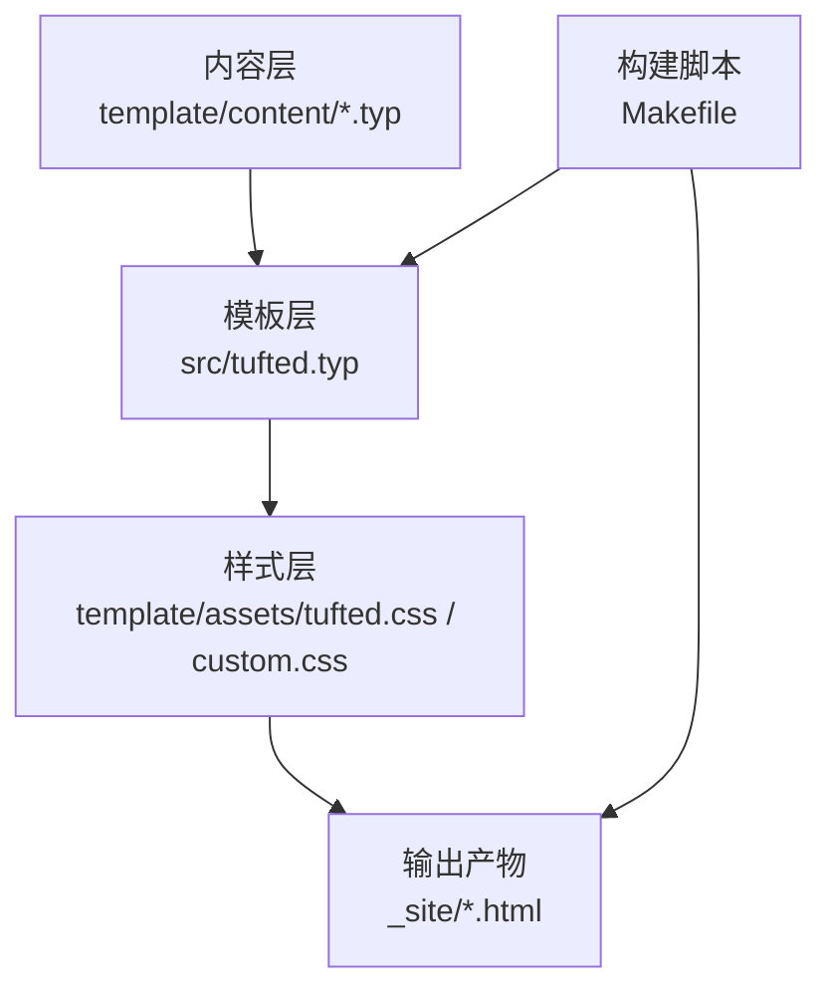
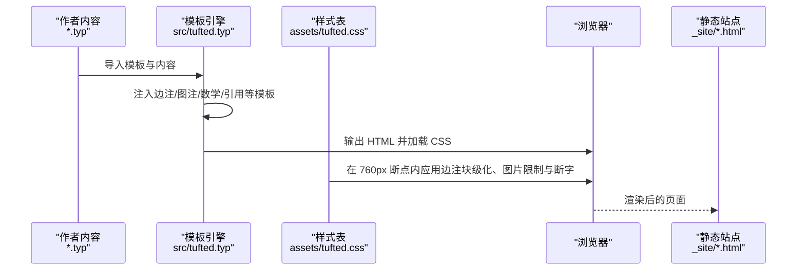
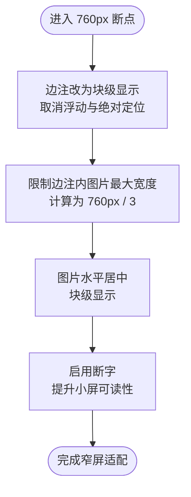
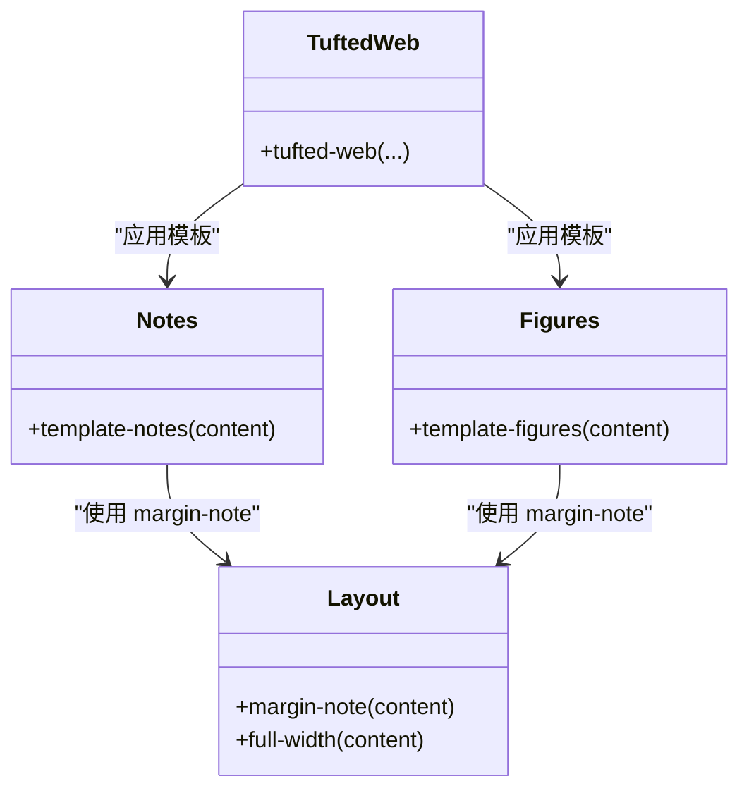
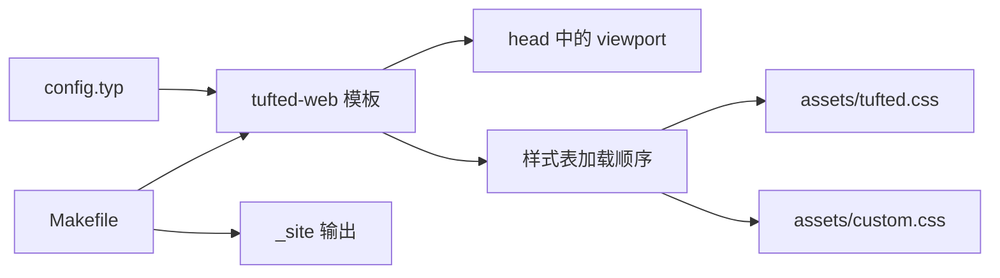

# 响应式设计

<cite>
**本文引用的文件**
- [src/layout.typ](file://src/layout.typ)
- [src/notes.typ](file://src/notes.typ)
- [src/figures.typ](file://src/figures.typ)
- [src/tufted.typ](file://src/tufted.typ)
- [template/assets/tufted.css](file://template/assets/tufted.css)
- [template/assets/custom.css](file://template/assets/custom.css)
- [template/config.typ](file://template/config.typ)
- [template/content/blog/2024-10-04-iterators-generators/index.typ](file://template/content/blog/2024-10-04-iterators-generators/index.typ)
- [template/content/blog/2025-04-16-monkeys-apes/index.typ](file://template/content/blog/2025-04-16-monkeys-apes/index.typ)
- [template/content/index.typ](file://template/content/index.typ)
- [Makefile](file://Makefile)
- [typst.toml](file://typst.toml)
</cite>

## 目录
1. [引言](#引言)
2. [项目结构](#项目结构)
3. [核心组件](#核心组件)
4. [架构总览](#架构总览)
5. [详细组件分析](#详细组件分析)
6. [依赖关系分析](#依赖关系分析)
7. [性能考量](#性能考量)
8. [故障排查指南](#故障排查指南)
9. [结论](#结论)
10. [附录](#附录)

## 引言
本文件聚焦于 TwilightPage（Tufted 模板）的响应式设计实现，系统解析以下主题：
- 760px 断点的设定原理与移动端适配策略
- 窄屏幕下侧注（margin notes）从浮动布局切换为块级显示的逻辑
- 图片在窄屏幕下的宽度限制与居中对齐机制
- 断字（hyphens）功能在小屏设备上的启用原因与效果
- 不同设备尺寸下的预览与测试方法
- 响应式设计最佳实践与性能优化建议

## 项目结构
该模板采用“内容（Typst）+ 样式（CSS）+ 构建（Makefile）”的分层组织方式：
- 内容层：以 .typ 文件组织页面内容，通过模板函数注入边注、图注等元素
- 样式层：默认加载 Tufte CSS 与自定义样式，自定义样式位于 assets/tufted.css，并可由用户覆盖
- 构建层：通过 Makefile 调用模板构建流程，生成静态站点

图表来源
- [src/tufted.typ:17-63](file://src/tufted.typ#L17-L63)
- [template/assets/tufted.css:1-166](file://template/assets/tufted.css#L1-L166)
- [Makefile:54-59](file://Makefile#L54-L59)

章节来源
- [Makefile:1-60](file://Makefile#L1-L60)
- [typst.toml:1-18](file://typst.toml#L1-L18)

## 核心组件
- 边注与图注模板：通过 layout.typ 定义边注容器，notes.typ 将脚注渲染为边注，figures.typ 将图注也映射到边注容器
- 响应式样式：在 760px 断点内，统一将边注改为块级显示、限制边注内图片宽度并启用断字
- 视口配置：模板在 head 中设置 viewport，确保移动端缩放与布局正确

章节来源
- [src/layout.typ:3-12](file://src/layout.typ#L3-L12)
- [src/notes.typ:1-27](file://src/notes.typ#L1-L27)
- [src/figures.typ:1-20](file://src/figures.typ#L1-L20)
- [src/tufted.typ:42](file://src/tufted.typ#L42)
- [template/assets/tufted.css:30-55](file://template/assets/tufted.css#L30-L55)

## 架构总览
下图展示从内容到输出的整体流程，以及响应式样式在关键节点的作用：

图表来源
- [src/tufted.typ:17-63](file://src/tufted.typ#L17-L63)
- [template/assets/tufted.css:30-55](file://template/assets/tufted.css#L30-L55)

## 详细组件分析

### 760px 断点与移动端适配策略
- 断点设定：在 max-width: 760px 的媒体查询中，统一调整边注与图片的显示行为，确保窄屏阅读体验
- 适配目标：减少横向滚动、提升行宽与可读性、避免边注被挤压或遮挡

章节来源
- [template/assets/tufted.css:30-55](file://template/assets/tufted.css#L30-L55)

### 侧注（边注）在窄屏幕下的显示逻辑
- 浮动到块级：边注在窄屏下从浮动布局切换为块级显示，使用静态定位与全宽块级元素，配合左右内边距与上下间距，形成清晰的视觉分层
- 图片限制：在边注内的图片与 SVG 设置最大宽度为 760px 的三分之一，并通过水平居中与块级显示，保证在窄屏下不溢出且保持良好比例
- 可读性增强：块级边注与独立的上/下边距，使边注内容在移动设备上更易阅读

图表来源
- [template/assets/tufted.css:30-55](file://template/assets/tufted.css#L30-L55)

章节来源
- [template/assets/tufted.css:32-49](file://template/assets/tufted.css#L32-L49)

### 图片在窄屏幕下的宽度限制与居中对齐机制
- 宽度限制：边注内的图片最大宽度设置为 760px 的三分之一，确保在窄屏下不会超出容器宽度
- 居中对齐：通过块级显示与左右自动外边距，实现水平居中，避免图片左贴边造成的阅读不适
- 高度约束：全局图片与 SVG 的最大高度限制为视口高度的 80%，防止大图撑破页面

章节来源
- [template/assets/tufted.css:44-49](file://template/assets/tufted.css#L44-L49)
- [template/assets/tufted.css:20-23](file://template/assets/tufted.css#L20-L23)

### 断字（hyphens）功能在小屏设备上的启用
- 启用原因：在窄屏下，段落宽度受限，单词过长导致换行困难；启用断字可自动在合适位置断开单词，提升可读性
- 实现方式：在窄屏断点内，为段落启用断字属性，并使用高优先级标记确保生效

章节来源
- [template/assets/tufted.css:51-54](file://template/assets/tufted.css#L51-L54)

### 边注与图注的模板映射
- 边注容器：layout.typ 提供 margin-note 容器，用于包裹边注内容
- 脚注到边注：notes.typ 将脚注渲染为带编号的边注，并在主文中插入脚注引用
- 图注到边注：figures.typ 将 figure.caption 映射到边注容器，使图注与脚注共享同一套窄屏适配规则

图表来源
- [src/layout.typ:3-12](file://src/layout.typ#L3-L12)
- [src/notes.typ:1-27](file://src/notes.typ#L1-L27)
- [src/figures.typ:1-20](file://src/figures.typ#L1-L20)
- [src/tufted.typ:17-33](file://src/tufted.typ#L17-L33)

章节来源
- [src/layout.typ:3-12](file://src/layout.typ#L3-L12)
- [src/notes.typ:16-21](file://src/notes.typ#L16-L21)
- [src/figures.typ:4-8](file://src/figures.typ#L4-L8)

### 示例页面中的边注与图注使用
- 主页与博客页通过边注展示补充信息与插图，验证边注在窄屏下的块级显示与图片居中效果
- 博客文章示例展示了脚注到边注的完整映射链路

章节来源
- [template/content/index.typ:7-14](file://template/content/index.typ#L7-L14)
- [template/content/blog/2025-04-16-monkeys-apes/index.typ:8-10](file://template/content/blog/2025-04-16-monkeys-apes/index.typ#L8-L10)
- [template/content/blog/2024-10-04-iterators-generators/index.typ:6](file://template/content/blog/2024-10-04-iterators-generators/index.typ#L6)

## 依赖关系分析
- 模板依赖：tufted-web 模板在 head 中引入 viewport 元标签，确保移动端正确缩放
- 样式依赖：默认加载 Tufte CSS 与自定义样式，自定义样式位于 assets/tufted.css，并可通过 config.typ 覆盖
- 构建依赖：Makefile 负责链接本地包缓存、同步资源与构建输出

图表来源
- [src/tufted.typ:42](file://src/tufted.typ#L42)
- [src/tufted.typ:21-25](file://src/tufted.typ#L21-L25)
- [template/config.typ:1-12](file://template/config.typ#L1-L12)
- [Makefile:54-59](file://Makefile#L54-L59)

章节来源
- [src/tufted.typ:21-25](file://src/tufted.typ#L21-L25)
- [template/config.typ:1-12](file://template/config.typ#L1-L12)
- [Makefile:54-59](file://Makefile#L54-L59)

## 性能考量
- 样式加载顺序：自定义样式位于最后加载，便于覆盖默认样式，同时避免不必要的重排与重绘
- 图片约束：全局限制图片最大高度与窄屏下边注内图片的最大宽度，有助于控制渲染成本与内存占用
- 断字策略：仅在窄屏启用断字，避免在宽屏上不必要的断词计算

章节来源
- [template/assets/custom.css:1](file://template/assets/custom.css#L1)
- [template/assets/tufted.css:20-23](file://template/assets/tufted.css#L20-L23)
- [template/assets/tufted.css:44-49](file://template/assets/tufted.css#L44-L49)
- [template/assets/tufted.css:51-54](file://template/assets/tufted.css#L51-L54)

## 故障排查指南
- 边注未按预期块级显示
  - 检查是否处于 760px 断点内
  - 确认自定义样式未覆盖关键选择器
  - 参考路径：[template/assets/tufted.css:32-41](file://template/assets/tufted.css#L32-L41)
- 边注内图片溢出或未居中
  - 检查图片最大宽度与居中规则
  - 参考路径：[template/assets/tufted.css:44-49](file://template/assets/tufted.css#L44-L49)
- 窄屏断字无效
  - 确认段落选择器与断字属性已启用
  - 参考路径：[template/assets/tufted.css:51-54](file://template/assets/tufted.css#L51-L54)
- 移动端缩放异常
  - 确认 head 中 viewport 元标签存在
  - 参考路径：[src/tufted.typ:42](file://src/tufted.typ#L42)

章节来源
- [template/assets/tufted.css:32-49](file://template/assets/tufted.css#L32-L49)
- [template/assets/tufted.css:51-54](file://template/assets/tufted.css#L51-L54)
- [src/tufted.typ:42](file://src/tufted.typ#L42)

## 结论
TwilightPage 的响应式设计围绕 760px 断点展开，通过将边注从浮动切换为块级、限制窄屏下边注内图片宽度并启用断字，显著提升了移动端的可读性与可用性。结合全局图片高度限制与自定义样式的覆盖能力，整体实现了简洁、稳健且易于扩展的响应式布局。

## 附录

### 不同设备尺寸下的预览与测试方法
- 使用浏览器开发者工具的设备模拟器，分别测试 375px、760px、1024px、1440px 等典型断点
- 关注边注显示模式、图片宽度与居中、段落断字效果
- 在真实设备上进行对比测试，确保交互与可读性一致

### 响应式设计最佳实践
- 以内容优先：优先保证正文可读性，再考虑边注与装饰元素
- 渐进增强：在宽屏提供更丰富的布局，在窄屏保持核心信息可见
- 语义化与可访问性：确保断字与图片约束不影响屏幕阅读器与键盘导航
- 性能优先：避免在窄屏上启用昂贵的渲染特性，如复杂滤镜或动画