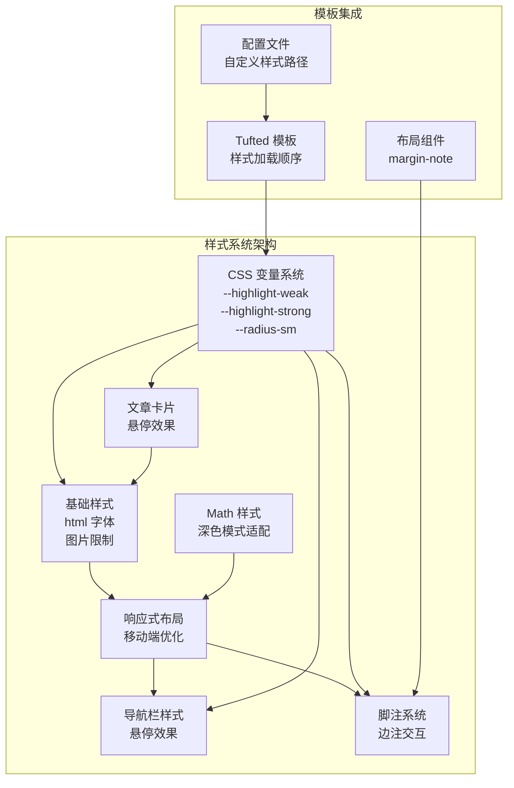
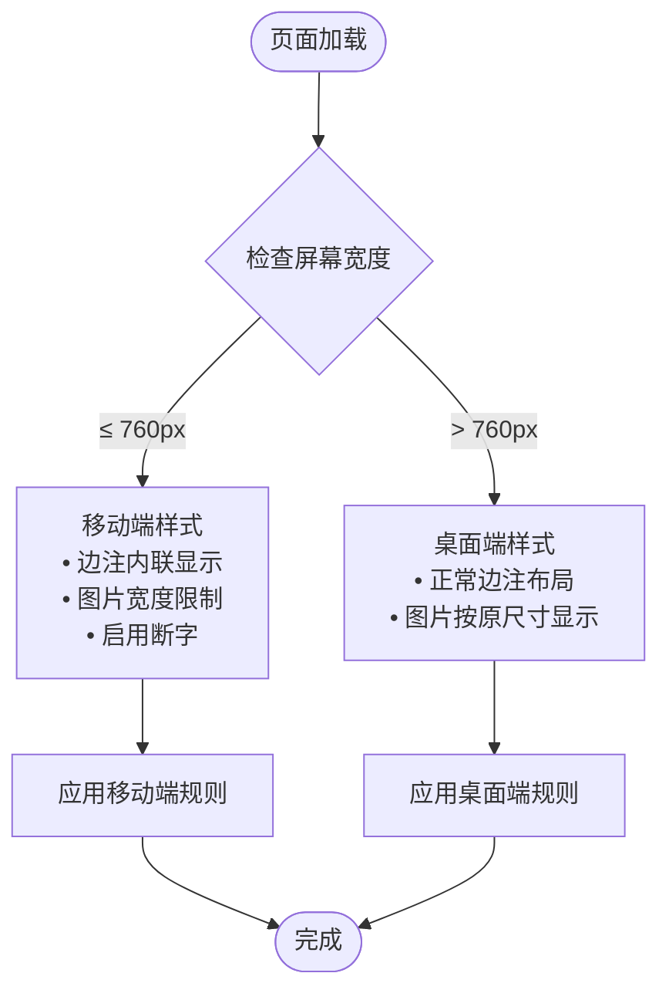
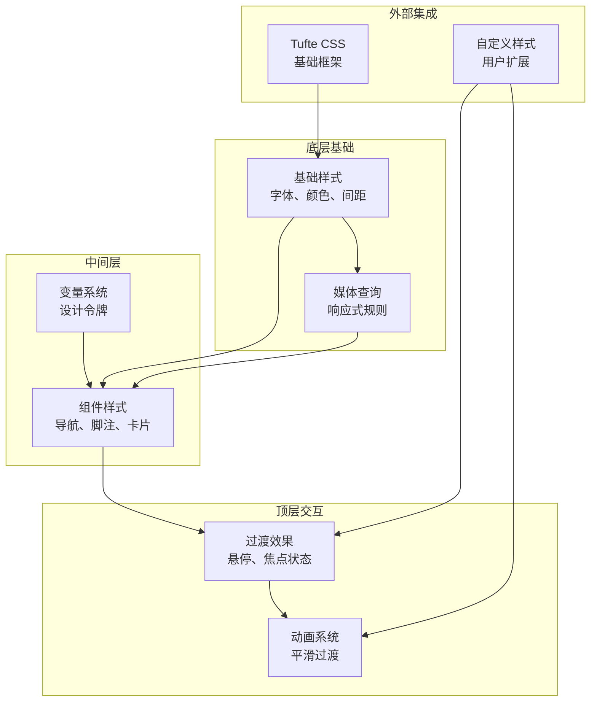
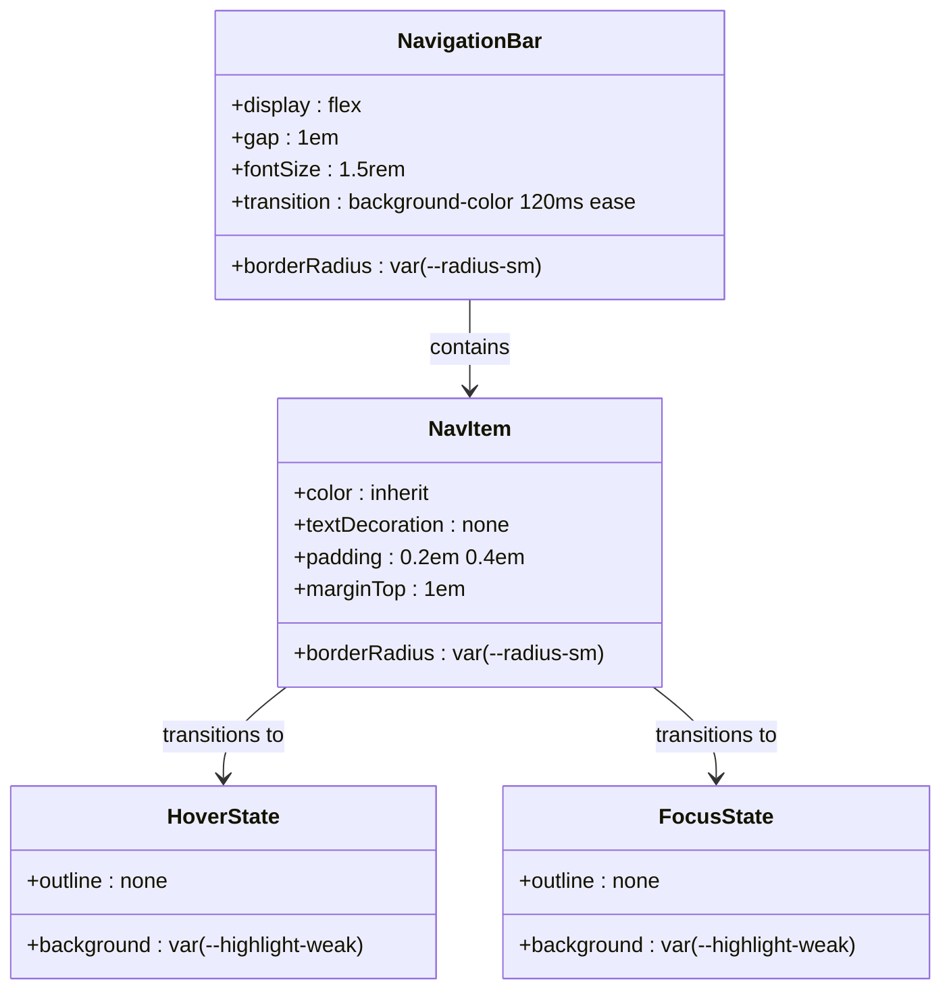
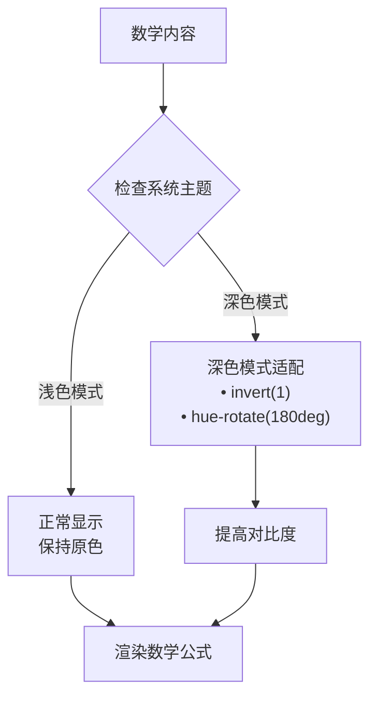
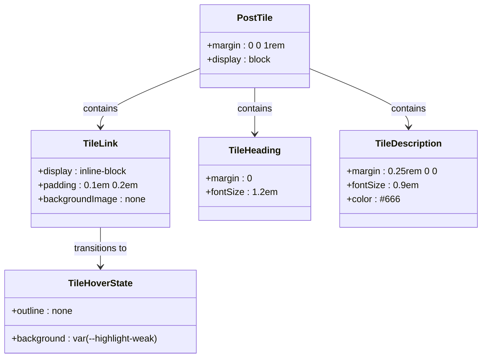
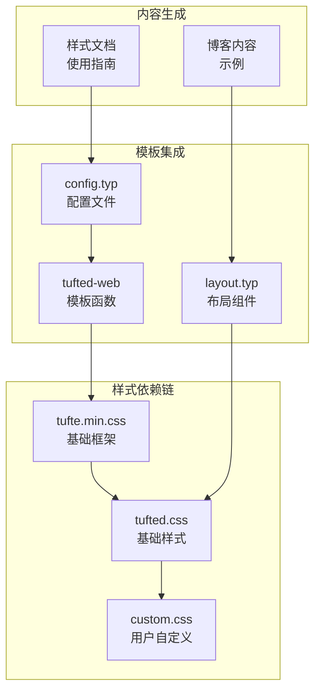
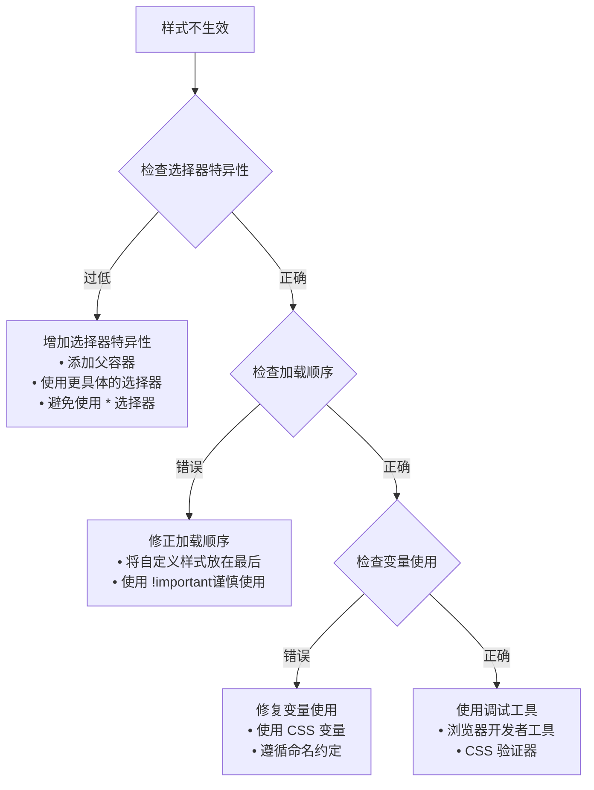

# 基础样式系统

<cite>
**本文档引用的文件**
- [tufted.css](file://template/assets/tufted.css)
- [custom.css](file://template/assets/custom.css)
- [tufted.typ](file://src/tufted.typ)
- [layout.typ](file://src/layout.typ)
- [figures.typ](file://src/figures.typ)
- [config.typ](file://template/config.typ)
- [styling 文档](file://template/content/docs/03-styling/index.typ)
- [博客示例](file://template/content/blog/2024-10-04-iterators-generators/index.typ)
</cite>

## 目录
1. [简介](#简介)
2. [项目结构](#项目结构)
3. [核心组件](#核心组件)
4. [架构概览](#架构概览)
5. [详细组件分析](#详细组件分析)
6. [依赖关系分析](#依赖关系分析)
7. [性能考虑](#性能考虑)
8. [故障排除指南](#故障排除指南)
9. [结论](#结论)

## 简介

TwilightPage 的基础样式系统基于 CSS 变量和响应式设计原则构建，为整个网站提供了统一的视觉基础。该系统通过精心设计的 CSS 变量实现了主题的一致性，通过基础排版规则确保了良好的可读性和可访问性，并通过响应式布局适配不同设备。

系统的核心特点包括：
- 使用 CSS 自定义属性实现主题化设计
- 基于 Tufte 风格的排版理念
- 移动端友好的响应式布局
- 渐进增强的交互效果

## 项目结构

TwilightPage 的样式系统采用模块化架构，主要由以下组件构成：



**图表来源**
- [tufted.css:1-166](file://template/assets/tufted.css#L1-L166)
- [tufted.typ:17-26](file://src/tufted.typ#L17-L26)

**章节来源**
- [tufted.css:1-166](file://template/assets/tufted.css#L1-L166)
- [tufted.typ:17-26](file://src/tufted.typ#L17-L26)

## 核心组件

### CSS 变量系统

TwilightPage 定义了三个关键的 CSS 自定义属性作为设计令牌：

| 变量名 | 值 | 用途 | 示例 |
|--------|-----|------|------|
| `--highlight-weak` | rgba(128, 128, 128, 0.2) | 弱高亮效果 | 导航栏悬停状态 |
| `--highlight-strong` | rgba(128, 128, 128, 0.4) | 强高亮效果 | 脚注交互状态 |
| `--radius-sm` | 0.2rem | 小圆角半径 | 组件边框圆角 |

这些变量在整个样式系统中被广泛使用，确保了视觉元素的一致性。

**章节来源**
- [tufted.css:5-9](file://template/assets/tufted.css#L5-L9)

### 基础排版样式

系统的基础排版规则建立了统一的文本和媒体处理标准：

- **HTML 字体大小**：设置为 10pt，为整个文档提供基准字号
- **图片和 SVG 限制**：最大高度限制为 80vh，确保在各种屏幕尺寸下都有良好的显示效果
- **行文断字**：在窄屏设备上启用自动断字，提升阅读体验

**章节来源**
- [tufted.css:16-23](file://template/assets/tufted.css#L16-L23)

### 响应式布局策略

系统针对不同屏幕尺寸提供了优化的布局方案：



**图表来源**
- [tufted.css:30-55](file://template/assets/tufted.css#L30-L55)

**章节来源**
- [tufted.css:30-55](file://template/assets/tufted.css#L30-L55)

## 架构概览

TwilightPage 的样式系统采用分层架构，从底层的基础样式到上层的交互效果形成了完整的样式体系：



**图表来源**
- [tufted.css:1-166](file://template/assets/tufted.css#L1-L166)
- [tufted.typ:21-25](file://src/tufted.typ#L21-L25)

## 详细组件分析

### 导航栏样式系统

导航栏采用了简洁而优雅的设计，重点体现了交互状态的变化：



**图表来源**
- [tufted.css:62-87](file://template/assets/tufted.css#L62-L87)

导航栏的关键特性：
- 使用 `var(--radius-sm)` 实现统一的圆角设计
- 悬停和焦点状态使用 `var(--highlight-weak)` 提供一致的高亮效果
- 120ms 的过渡动画确保交互的流畅性

**章节来源**
- [tufted.css:62-87](file://template/assets/tufted.css#L62-L87)

### 脚注与边注系统

脚注系统是 TwilightPage 的核心特色之一，实现了复杂的交互状态管理：

```mermaid
sequenceDiagram
participant User as 用户
participant Ref as 脚注引用
participant Note as 边注
participant CSS as 样式系统
User->>Ref : 悬停脚注引用
Ref->>CSS : 设置 --highlight = --highlight-weak
CSS->>Note : 应用弱高亮效果
Note->>User : 显示边注内容
User->>Note : 悬停边注
Note->>CSS : 设置 --highlight = --highlight-strong
CSS->>Ref : 应用强高亮效果
Ref->>User : 高亮脚注引用
User->>Ref : 移开鼠标
Ref->>CSS : 恢复透明状态
CSS->>Note : 移除高亮效果
```

**图表来源**
- [tufted.css:94-113](file://template/assets/tufted.css#L94-L113)

脚注系统的实现要点：
- 使用 CSS 变量 `--highlight` 动态控制高亮状态
- 通过 `:hover` 和 `:has()` 伪类实现双向交互
- 过渡延迟机制确保用户体验的连贯性

**章节来源**
- [tufted.css:94-113](file://template/assets/tufted.css#L94-L113)

### 数学公式样式系统

数学公式的样式处理体现了对深色模式的支持：



**图表来源**
- [tufted.css:125-137](file://template/assets/tufted.css#L125-L137)

**章节来源**
- [tufted.css:125-137](file://template/assets/tufted.css#L125-L137)

### 文章卡片系统

文章卡片组件提供了统一的文章列表展示方式：



**图表来源**
- [tufted.css:144-166](file://template/assets/tufted.css#L144-L166)

**章节来源**
- [tufted.css:144-166](file://template/assets/tufted.css#L144-L166)

## 依赖关系分析

TwilightPage 的样式系统遵循严格的依赖层次结构，确保了样式的可维护性和一致性：



**图表来源**
- [tufted.typ:21-25](file://src/tufted.typ#L21-L25)
- [config.typ:3-11](file://template/config.typ#L3-L11)

**章节来源**
- [tufted.typ:21-25](file://src/tufted.typ#L21-L25)
- [config.typ:3-11](file://template/config.typ#L3-L11)

## 性能考虑

TwilightPage 的样式系统在设计时充分考虑了性能优化：

### 样式加载优化
- **按需加载**：样式表按照指定顺序加载，避免重复下载
- **缓存友好**：CDN 加载的 Tufte CSS 支持浏览器缓存
- **最小化重绘**：使用 CSS 变量减少重绘区域

### 响应式性能
- **媒体查询优化**：仅在必要时触发响应式变化
- **硬件加速**：利用 transform 和 opacity 属性实现 GPU 加速
- **过渡性能**：合理的动画持续时间和缓动函数

### 可访问性优化
- **对比度保证**：深色模式下的数学公式反转确保足够的对比度
- **键盘导航**：焦点状态清晰可见
- **缩放支持**：字体大小可调整，不影响布局

## 故障排除指南

### 常见样式冲突问题

当自定义样式与基础样式发生冲突时，可以采用以下方法解决：

1. **检查样式优先级**
   - 内联样式 > ID 选择器 > 类选择器 > 元素选择器
   - 后加载的样式表会覆盖先加载的样式

2. **使用 CSS 变量**
   ```css
   /* 推荐：使用变量 */
   .element {
       background: var(--highlight-weak);
       border-radius: var(--radius-sm);
   }
   
   /* 不推荐：直接硬编码值 */
   .element {
       background: rgba(128, 128, 128, 0.2);
       border-radius: 0.2rem;
   }
   ```

3. **调试技巧**
   - 使用浏览器开发者工具检查元素的实际样式
   - 查看计算样式面板确认最终生效的值
   - 检查 CSS 变量的继承链

### 样式覆盖最佳实践



**章节来源**
- [styling 文档:23-43](file://template/content/docs/03-styling/index.typ#L23-L43)

## 结论

TwilightPage 的基础样式系统通过精心设计的 CSS 变量系统、响应式布局策略和组件化的样式架构，为整个网站提供了统一且灵活的视觉基础。系统的核心优势包括：

### 设计优势
- **一致性**：通过 CSS 变量确保所有组件使用相同的设计令牌
- **可维护性**：模块化的样式组织便于维护和扩展
- **可访问性**：考虑了不同用户的需求和设备限制

### 技术优势
- **性能优化**：合理的样式加载和渲染策略
- **响应式设计**：适配各种屏幕尺寸和设备类型
- **渐进增强**：在保证基本功能的同时提供丰富的交互体验

### 扩展性
- **易于定制**：通过修改 CSS 变量即可实现主题切换
- **兼容性强**：与 Tufte CSS 生态系统无缝集成
- **社区友好**：遵循标准的 CSS 最佳实践

对于开发者而言，理解这个样式系统的架构和原理有助于更好地进行定制和扩展，同时保持整体设计的一致性和用户体验的连贯性。