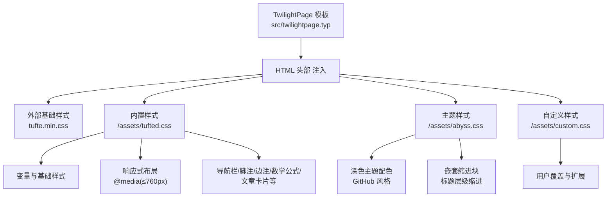
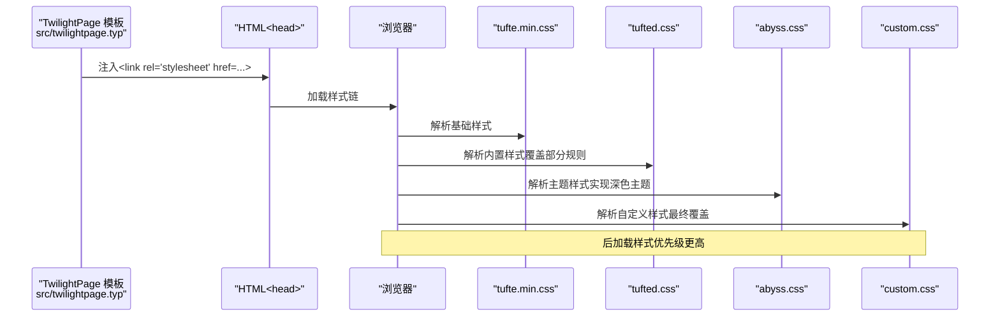
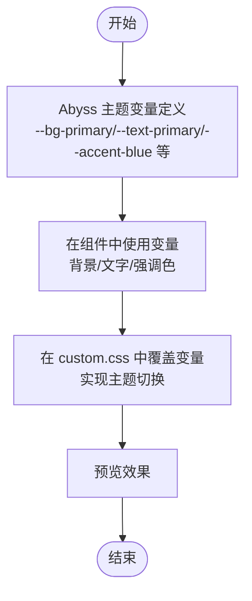
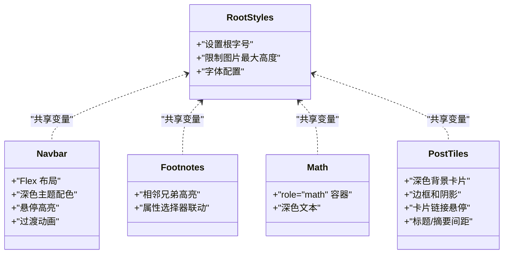
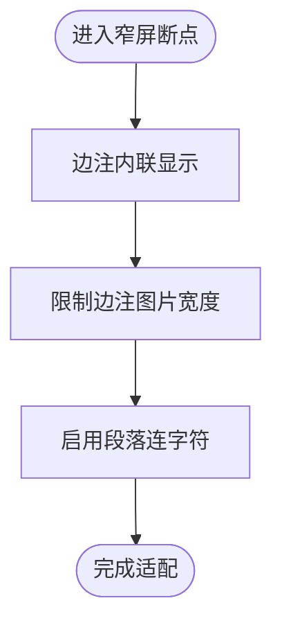
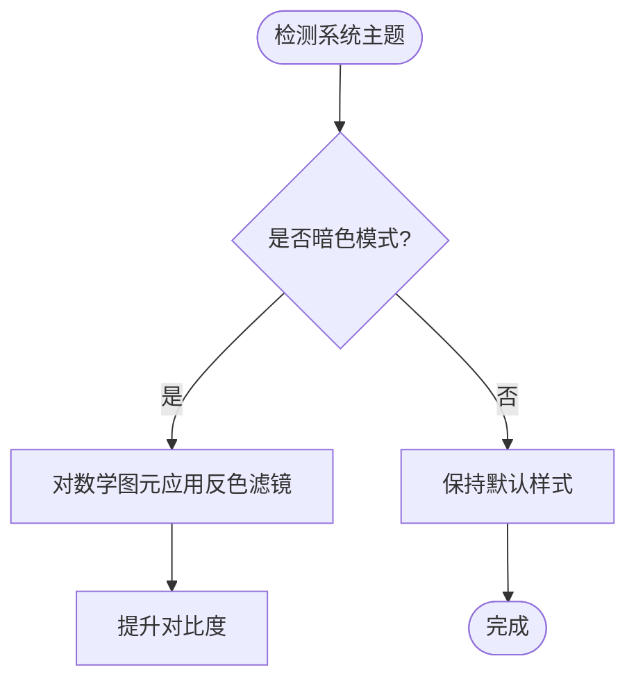
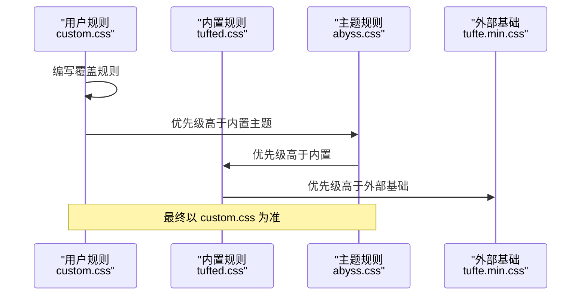
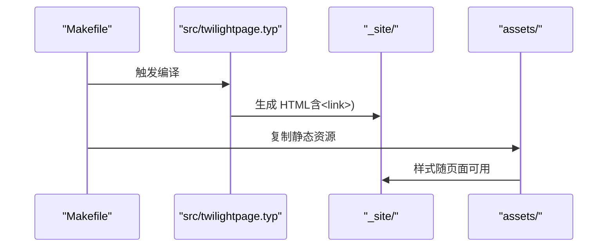
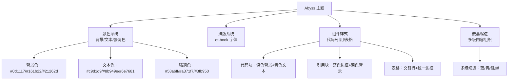
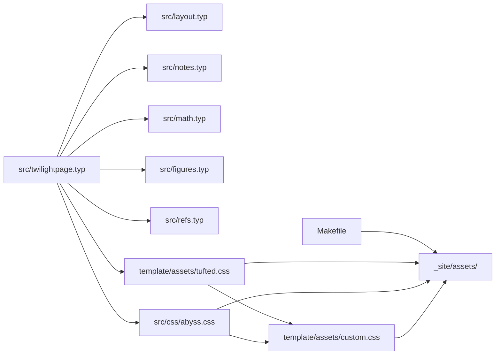

# 样式定制

<cite>
**本文引用的文件**
- [src/css/abyss.css](file://src/css/abyss.css)
- [template/assets/tufted.css](file://template/assets/tufted.css)
- [template/assets/custom.css](file://template/assets/custom.css)
- [src/twilightpage.typ](file://src/twilightpage.typ)
- [src/layout.typ](file://src/layout.typ)
- [src/notes.typ](file://src/notes.typ)
- [src/math.typ](file://src/math.typ)
- [src/figures.typ](file://src/figures.typ)
- [src/refs.typ](file://src/refs.typ)
- [template/Makefile](file://template/Makefile)
- [Makefile](file://Makefile)
- [template/content/docs/03-styling/index.typ](file://template/content/docs/03-styling/index.typ)
- [template/content/blog/2024-10-04-iterators-generators/index.typ](file://template/content/blog/2024-10-04-iterators-generators/index.typ)
- [template/content/index.typ](file://template/content/index.typ)
- [template/config.typ](file://template/config.typ)
- [typst.toml](file://typst.toml)
</cite>

## 更新摘要
**变更内容**
- 新增 Abyss 深色主题的完整 CSS 实现，包含 390 行深色主题样式
- 添加 GitHub 风格配色方案和 Tufte 风格排版支持
- 扩展主题定制选项，提供多种颜色方案选择
- 增强响应式设计和暗色模式支持
- 新增嵌套缩进块功能，支持根据标题层级自动缩进内容

## 目录
1. [简介](#简介)
2. [项目结构](#项目结构)
3. [核心组件](#核心组件)
4. [架构总览](#架构总览)
5. [详细组件分析](#详细组件分析)
6. [主题系统详解](#主题系统详解)
7. [依赖关系分析](#依赖关系分析)
8. [性能考量](#性能考量)
9. [故障排查指南](#故障排查指南)
10. [结论](#结论)
11. [附录](#附录)

## 简介
本指南面向设计师与开发者，系统讲解 TwilightPage（基于 Tufted 模板）的样式系统与定制方法。重点涵盖：
- Tufte CSS 基础样式加载与覆盖机制
- CSS 变量系统与主题定制选项
- 响应式设计的断点与移动端适配策略
- custom.css 扩展机制与样式优先级规则
- **新增：Abyss 深色主题的完整实现与配置**
- 主题定制完整指南：颜色、字体、间距
- 暗色模式支持与浏览器兼容性
- 调试工具与性能优化建议

## 项目结构
TwilightPage 的样式体系由 Typst 模板层注入 CSS 链接，并在前端通过顺序加载实现覆盖；同时提供可扩展的自定义样式入口。**新增 Abyss 深色主题作为内置主题选项**。



**图表来源**
- [src/twilightpage.typ:42-46](file://src/twilightpage.typ#L42-L46)
- [src/twilightpage.typ:116-121](file://src/twilightpage.typ#L116-L121)
- [src/css/abyss.css:11-48](file://src/css/abyss.css#L11-L48)

**章节来源**
- [src/twilightpage.typ:38-90](file://src/twilightpage.typ#L38-L90)
- [src/twilightpage.typ:106-144](file://src/twilightpage.typ#L106-L144)
- [template/Makefile:14-20](file://template/Makefile#L14-L20)
- [Makefile:54-55](file://Makefile#L54-L55)

## 核心组件
- 样式注入与加载顺序
  - 默认按顺序加载：外部 Tufte CSS → 内置 tufted.css → **主题样式 abyss.css** → 自定义 custom.css，后加载者优先覆盖。
  - 可通过配置覆盖默认样式表数组，实现完全自定义。
- CSS 变量系统
  - 定义高亮弱/强色与圆角半径等变量，统一主题风格。
  - **Abyss 主题新增丰富的颜色变量：背景色、文本色、强调色、边框色等**。
- 基础样式与组件化
  - 基础排版、图片限制、导航栏、脚注与边注交互、数学公式渲染、文章卡片等。
- 响应式设计
  - 在窄屏下将边注内联显示、限制边注内图片宽度、启用段落连字符。
- 暗色模式
  - 使用 prefers-color-scheme: dark 对数学图元进行反色处理，提升对比度。
- **新增：嵌套缩进块**
  - 根据标题层级自动创建缩进效果，支持多级嵌套内容组织。

**章节来源**
- [src/twilightpage.typ:42-46](file://src/twilightpage.typ#L42-L46)
- [src/css/abyss.css:11-48](file://src/css/abyss.css#L11-L48)
- [src/layout.typ:71-93](file://src/layout.typ#L71-L93)
- [template/assets/tufted.css:5-9](file://template/assets/tufted.css#L5-L9)
- [template/assets/tufted.css:30-55](file://template/assets/tufted.css#L30-L55)
- [template/assets/tufted.css:131-137](file://template/assets/tufted.css#L131-L137)

## 架构总览
样式系统采用"模板注入 + 顺序覆盖"的架构。TwilightPage 模板在生成 HTML 时插入多个 CSS 链接，浏览器按顺序解析，后声明的规则覆盖先前规则。**新增 Abyss 主题作为内置主题选项**，该机制允许：
- 使用外部 Tufte CSS 提供稳定的基础排版
- 使用内置 tufted.css 实现站点特定的交互与响应式行为
- **使用内置 abyss.css 实现深色主题的完整样式覆盖**
- 使用 custom.css 进行最终覆盖与品牌化



**图表来源**
- [src/twilightpage.typ:72-74](file://src/twilightpage.typ#L72-L74)
- [src/twilightpage.typ:116-121](file://src/twilightpage.typ#L116-L121)

## 详细组件分析

### 组件一：CSS 变量系统与主题定制
- 变量定义位置与用途
  - **Abyss 主题定义了完整的颜色变量系统**：
    - 背景色：--bg-primary、--bg-secondary、--bg-tertiary、--bg-code
    - 文本色：--text-primary、--text-secondary、--text-muted、--text-heading
    - 强调色：--accent-blue、--accent-purple、--accent-cyan、--accent-green、--accent-orange、--accent-red
    - 边框色：--border-color、--border-hover
    - 高亮色：--highlight-weak、--highlight-strong、--highlight-hover
    - 圆角半径：--radius-sm、--radius-md
    - 阴影：--shadow-sm、--shadow-md
  - 高亮弱/强色用于脚注与边注悬停反馈
  - 圆角半径统一用于导航与卡片等组件
- 主题定制建议
  - 修改变量值即可实现颜色方案切换
  - 通过 custom.css 覆盖变量，实现品牌色或暗色模式下的统一风格



**图表来源**
- [src/css/abyss.css:11-48](file://src/css/abyss.css#L11-L48)
- [src/css/abyss.css:92-104](file://src/css/abyss.css#L92-L104)
- [template/assets/tufted.css:5-9](file://template/assets/tufted.css#L5-L9)

**章节来源**
- [src/css/abyss.css:11-48](file://src/css/abyss.css#L11-L48)
- [template/assets/tufted.css:5-9](file://template/assets/tufted.css#L5-L9)

### 组件二：基础样式与组件化
- 基础排版
  - 设置根元素字号与图片最大高度，保证阅读体验
  - **Abyss 主题使用 et-book 字体族，提供更好的排版效果**
- 导航栏
  - 使用 Flex 布局，悬停态使用变量色高亮，过渡动画平滑
  - **Abyss 主题导航栏具有深色背景和高对比度文字**
- 脚注与边注
  - 通过相邻兄弟选择器与属性选择器实现互相关联的高亮反馈
  - **Abyss 主题边注使用浅灰色文本，提高可读性**
- 数学公式
  - 为块级公式容器设置角色属性，便于统一样式与暗色模式处理
  - **Abyss 主题数学公式使用深色文本，保持一致性**
- 文章卡片
  - 卡片链接悬停高亮，标题与摘要间距统一
  - **Abyss 主题卡片具有深色背景和边框，增强层次感**



**图表来源**
- [src/css/abyss.css:54-62](file://src/css/abyss.css#L54-L62)
- [src/css/abyss.css:177-210](file://src/css/abyss.css#L177-L210)
- [src/css/abyss.css:215-221](file://src/css/abyss.css#L215-L221)
- [src/css/abyss.css:256-258](file://src/css/abyss.css#L256-L258)
- [src/css/abyss.css:264-299](file://src/css/abyss.css#L264-L299)

**章节来源**
- [src/css/abyss.css:54-62](file://src/css/abyss.css#L54-L62)
- [src/css/abyss.css:177-210](file://src/css/abyss.css#L177-L210)
- [src/css/abyss.css:215-221](file://src/css/abyss.css#L215-L221)
- [src/css/abyss.css:256-258](file://src/css/abyss.css#L256-L258)
- [src/css/abyss.css:264-299](file://src/css/abyss.css#L264-L299)

### 组件三：响应式设计与移动端适配
- 断点与策略
  - 在 760px 及以下断点内：
    - 将边注改为块状内联显示，取消浮动与定位
    - 限制边注内图片最大宽度，居中显示
    - 启用段落连字符，改善窄屏排版
- 设计意图
  - 保持边注信息在小屏上仍可读且不破坏正文流式布局



**图表来源**
- [template/assets/tufted.css:30-55](file://template/assets/tufted.css#L30-L55)

**章节来源**
- [template/assets/tufted.css:30-55](file://template/assets/tufted.css#L30-L55)

### 组件四：暗色模式支持与浏览器兼容性
- 暗色模式
  - 使用 prefers-color-scheme: dark，在数学图元上应用反色滤镜，提升对比度
  - **Abyss 主题提供完整的深色模式支持，无需额外配置**
- 兼容性
  - 依赖现代浏览器对 CSS 变量与媒体查询的支持
  - 若需兼容旧环境，可在 custom.css 中添加降级样式或条件注释



**图表来源**
- [template/assets/tufted.css:131-137](file://template/assets/tufted.css#L131-L137)

**章节来源**
- [template/assets/tufted.css:131-137](file://template/assets/tufted.css#L131-L137)

### 组件五：样式覆盖与扩展机制（custom.css）
- 加载顺序
  - 默认加载顺序：外部 Tufte CSS → 内置 tufted.css → **主题样式 abyss.css** → 自定义 custom.css
  - 因为后加载优先级更高，custom.css 可直接覆盖前两者规则
- 扩展建议
  - 使用变量覆盖实现主题切换
  - 通过选择器特异性与 !important 控制覆盖范围（谨慎使用）
  - 为移动端与暗色模式分别编写针对性规则



**图表来源**
- [src/twilightpage.typ:42-46](file://src/twilightpage.typ#L42-L46)
- [template/assets/custom.css:1](file://template/assets/custom.css#L1)

**章节来源**
- [src/twilightpage.typ:42-46](file://src/twilightpage.typ#L42-L46)
- [template/assets/custom.css:1](file://template/assets/custom.css#L1)

### 组件六：样式注入与页面生成流程
- 模板注入
  - 模板在 HTML head 中循环插入每个 CSS 链接
  - **Abyss 主题通过专门的 abyss 函数注入主题样式**
- 页面生成
  - Makefile 将 assets 目录复制到输出目录，确保样式随页面一起发布



**图表来源**
- [template/Makefile:14-20](file://template/Makefile#L14-L20)
- [Makefile:54-55](file://Makefile#L54-L55)
- [src/twilightpage.typ:72-74](file://src/twilightpage.typ#L72-L74)

**章节来源**
- [template/Makefile:14-20](file://template/Makefile#L14-L20)
- [Makefile:54-55](file://Makefile#L54-L55)
- [src/twilightpage.typ:72-74](file://src/twilightpage.typ#L72-L74)

## 主题系统详解

### Abyss 深色主题完整实现
**新增** Abyss 主题是一个完整的深色主题实现，包含 390 行精心设计的 CSS 代码，提供以下特性：

#### 颜色系统
- **背景色层次**：primary（深蓝黑）、secondary（深灰）、tertiary（更深灰）、code（代码背景）
- **文本色系统**：primary（浅灰）、secondary（中灰）、muted（浅灰）、heading（白色）
- **强调色系列**：蓝色、紫色、青色、绿色、橙色、红色，满足不同语义需求
- **边框与高亮**：统一的边框颜色和多种高亮透明度

#### 排版特色
- 使用 et-book 字体族，提供优雅的排版效果
- 标题采用不同的强调色，增强视觉层次
- 链接状态（正常、悬停、访问过）有明确的颜色区分

#### 组件样式
- **代码块**：深色背景配青色代码文本，支持行内代码高亮
- **引用块**：左侧蓝色边框，深色背景，浅灰文本
- **表格**：交替行深色背景，统一的边框样式
- **导航栏**：深色背景，白色文字，蓝色悬停效果
- **边注与脚注**：浅灰文本，蓝色强调
- **文章卡片**：深色背景，边框和阴影增强立体感
- **滚动条**：深色主题下的自定义滚动条样式

#### 嵌套缩进块功能
- **自动层级识别**：根据标题层级自动创建缩进效果
- **多级颜色区分**：不同层级使用不同强调色
- **渐进式缩进**：支持多层嵌套内容的清晰层次



**图表来源**
- [src/css/abyss.css:11-48](file://src/css/abyss.css#L11-L48)
- [src/css/abyss.css:109-131](file://src/css/abyss.css#L109-L131)
- [src/css/abyss.css:153-171](file://src/css/abyss.css#L153-L171)
- [src/css/abyss.css:346-360](file://src/css/abyss.css#L346-L360)

**章节来源**
- [src/css/abyss.css:1-391](file://src/css/abyss.css#L1-L391)
- [src/twilightpage.typ:106-144](file://src/twilightpage.typ#L106-L144)

### 主题切换与配置
TwilightPage 提供两种主题使用方式：

#### 使用内置 Abyss 主题
通过 `abyss()` 函数直接使用深色主题：
```typst
#import "@preview/twilightpage:0.0.1"

#let template = twilightpage.abyss.with(
  header-links: (
    "/": "首页",
    "/docs/": "文档",
  ),
  title: "我的网站",
  indent: true,  // 启用嵌套缩进
  indent-color: rgb(88, 166, 255),  // 自定义缩进颜色
  indent-size: 1.5em,  // 自定义缩进大小
)
```

#### 自定义主题组合
通过 `twilightpage-web()` 函数自定义样式表顺序：
```typst
#let template = twilightpage.twilightpage-web.with(
  css: (
    "https://cdnjs.cloudflare.com/ajax/libs/tufte-css/1.8.0/tufte.min.css",
    "/assets/my-theme.css",  // 自定义主题
    "/assets/custom.css",    // 用户自定义
  ),
)
```

**章节来源**
- [src/twilightpage.typ:106-144](file://src/twilightpage.typ#L106-L144)
- [template/content/docs/03-styling/index.typ:35-43](file://template/content/docs/03-styling/index.typ#L35-L43)

## 依赖关系分析
- 模板依赖
  - 模板通过 css 参数控制样式链，内部依赖 layout/notes/math/figures/refs 等模块生成对应 HTML 结构
  - **新增 Abyss 主题依赖嵌套缩进块功能**
- 样式依赖
  - custom.css 依赖内置 tufted.css 的类名与变量
  - **Abyss 主题依赖完整的 CSS 变量系统**
  - 响应式依赖媒体查询与断点常量
- 构建依赖
  - Makefile 负责将 assets 复制到输出目录，确保样式在部署时可用



**图表来源**
- [src/twilightpage.typ:1-12](file://src/twilightpage.typ#L1-L12)
- [src/layout.typ:71-93](file://src/layout.typ#L71-L93)
- [src/notes.typ:1-27](file://src/notes.typ#L1-L27)
- [src/math.typ:1-22](file://src/math.typ#L1-L22)
- [src/figures.typ:1-20](file://src/figures.typ#L1-L20)
- [src/refs.typ:1-23](file://src/refs.typ#L1-L23)
- [src/css/abyss.css:1-391](file://src/css/abyss.css#L1-L391)
- [template/assets/tufted.css:1-166](file://template/assets/tufted.css#L1-L166)
- [template/assets/custom.css:1](file://template/assets/custom.css#L1)
- [Makefile:54-55](file://Makefile#L54-L55)

**章节来源**
- [src/twilightpage.typ:1-12](file://src/twilightpage.typ#L1-L12)
- [src/css/abyss.css:1-391](file://src/css/abyss.css#L1-L391)
- [Makefile:54-55](file://Makefile#L54-L55)

## 性能考量
- 样式体积
  - 仅加载必要样式，避免重复定义；将通用变量集中管理，减少冗余
  - **Abyss 主题经过优化，避免不必要的重复样式定义**
- 选择器复杂度
  - 避免过深嵌套与高特异性选择器，降低重绘成本
  - **主题样式使用扁平化的类名结构，提高选择器效率**
- 媒体查询
  - 合理使用断点，避免在多处重复定义相同规则
  - **响应式样式集中在单一 @media 查询中**
- 渲染优化
  - 利用 CSS 变量与 transform 等高效属性，减少强制同步布局
  - **深色主题使用 CSS 变量而非内联样式，提升渲染性能**
- 资源缓存
  - 将外部基础样式缓存在 CDN，减少首屏阻塞
  - **Abyss 主题独立文件，可单独缓存和版本控制**

## 故障排查指南
- 样式未生效
  - 检查 custom.css 是否在样式链末尾加载
  - 确认选择器特异性足够高，或使用 !important（仅临时调试）
  - **检查 Abyss 主题样式文件是否存在且路径正确**
- 响应式异常
  - 确认 viewport meta 标签已正确注入
  - 检查断点是否被覆盖或媒体查询语法错误
- 暗色模式问题
  - 确认系统主题设置与 prefers-color-scheme 行为一致
  - 如需降级，可在 custom.css 中补充非媒体查询规则
- **Abyss 主题问题**
  - 确认嵌套缩进功能正确启用
  - 检查 CSS 变量是否被正确继承
  - 验证字体文件是否正确加载
- 构建产物缺失
  - 确认 Makefile 已执行 assets 复制步骤，检查 _site/assets 是否存在

**章节来源**
- [src/twilightpage.typ:72](file://src/twilightpage.typ#L72)
- [src/twilightpage.typ:116-121](file://src/twilightpage.typ#L116-L121)
- [template/Makefile:18-20](file://template/Makefile#L18-L20)
- [Makefile:54-55](file://Makefile#L54-L55)

## 结论
TwilightPage 的样式系统以"模板注入 + 顺序覆盖"为核心，结合 CSS 变量、媒体查询与组件化类名，提供了清晰的主题定制路径。**新增的 Abyss 深色主题进一步丰富了定制选项，提供完整的 GitHub 风格配色和 Tufte 风格排版**。通过合理利用内置变量、响应式断点、暗色模式支持以及嵌套缩进功能，配合 custom.css 的最终覆盖能力，可快速实现从品牌色到移动端适配的全链路样式定制。

## 附录

### A. 主题定制完整指南
- 颜色方案
  - 在 custom.css 中覆盖变量，实现主色、强调色与背景色的整体切换
  - **Abyss 主题提供完整的颜色变量系统，可直接使用**
- 字体选择
  - 在基础样式中设置全局字体族与字号，确保与 Tufte 排版协调
  - **Abyss 主题使用 et-book 字体族，提供更好的排版效果**
- 间距调整
  - 通过变量统一控制圆角、内边距与外边距，保持视觉一致性
- **嵌套缩进**
  - 使用 nest-block 功能实现多级内容组织
  - **Abyss 主题自动支持嵌套缩进，无需额外配置**

**章节来源**
- [src/css/abyss.css:11-48](file://src/css/abyss.css#L11-L48)
- [src/css/abyss.css:54-62](file://src/css/abyss.css#L54-L62)
- [src/layout.typ:71-93](file://src/layout.typ#L71-L93)

### B. 样式修改示例与预览要点
- 示例路径
  - 更改链接颜色：参考文档示例路径
  - 覆盖默认样式表数组：参考文档示例路径
  - **Abyss 主题配置：参考 Abyss 主题函数使用示例**
- 预览要点
  - 在窄屏设备上验证边注内联与图片限制
  - 在暗色模式下验证数学图元反色效果
  - **验证 Abyss 主题的颜色对比度和可读性**
  - 使用浏览器开发者工具检查选择器特异性和媒体查询匹配

**章节来源**
- [template/content/docs/03-styling/index.typ:26-32](file://template/content/docs/03-styling/index.typ#L26-L32)
- [template/content/docs/03-styling/index.typ:35-43](file://template/content/docs/03-styling/index.typ#L35-L43)
- [src/twilightpage.typ:106-144](file://src/twilightpage.typ#L106-L144)

### C. 实际页面中的样式应用
- 边注与脚注
  - 通过 notes 模块生成的类名与 tufted.css 的选择器联动，实现悬停高亮
  - **Abyss 主题提供深色背景的边注样式**
- 图片与图注
  - figures 模块将 caption 包裹为 marginnote 类，受内置样式控制
  - **Abyss 主题为图片容器提供深色背景和圆角边框**
- 数学公式
  - math 模块为块级公式添加 role="math"，便于统一样式与暗色模式处理
  - **Abyss 主题数学公式使用深色文本，保持整体一致性**
- **嵌套缩进**
  - layout 模块的 nest-block 函数实现内容层级缩进
  - **Abyss 主题自动支持多级嵌套缩进，使用不同强调色区分层级**

**章节来源**
- [src/notes.typ:1-27](file://src/notes.typ#L1-L27)
- [src/figures.typ:1-20](file://src/figures.typ#L1-L20)
- [src/math.typ:1-22](file://src/math.typ#L1-L22)
- [src/layout.typ:71-93](file://src/layout.typ#L71-L93)
- [template/assets/tufted.css:94-118](file://template/assets/tufted.css#L94-L118)
- [template/assets/tufted.css:126-137](file://template/assets/tufted.css#L126-L137)
- [src/css/abyss.css:215-250](file://src/css/abyss.css#L215-L250)
- [src/css/abyss.css:256-258](file://src/css/abyss.css#L256-L258)
- [src/css/abyss.css:338-368](file://src/css/abyss.css#L338-L368)