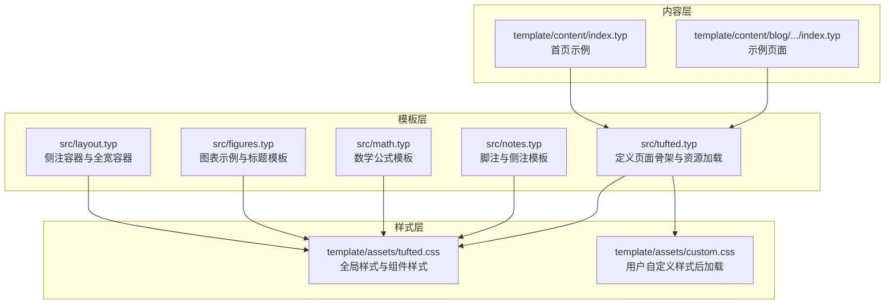
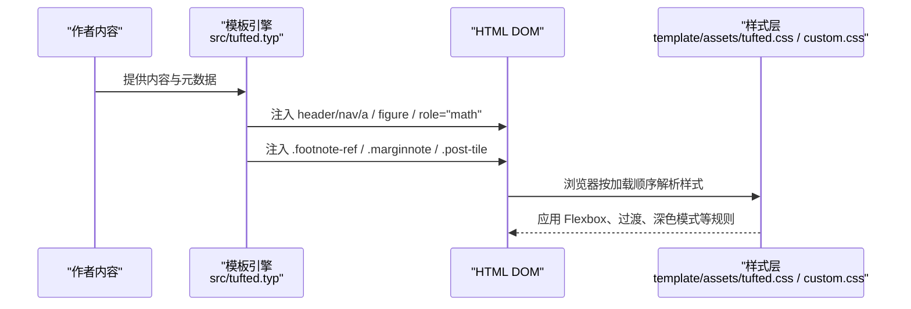
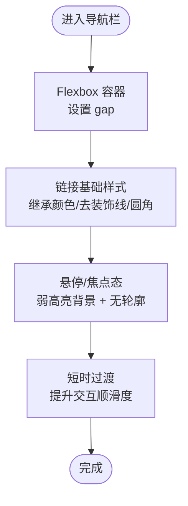
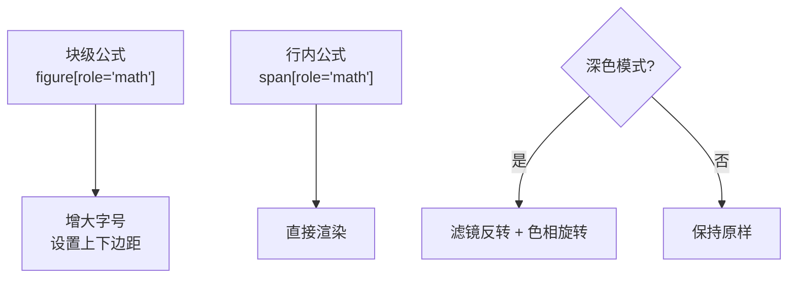
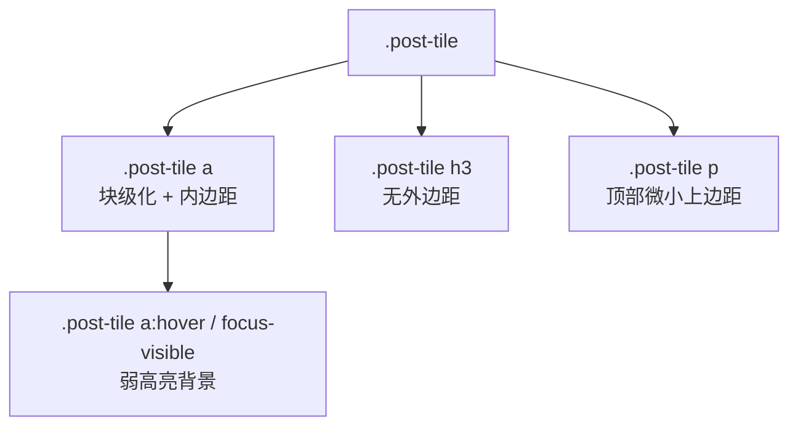
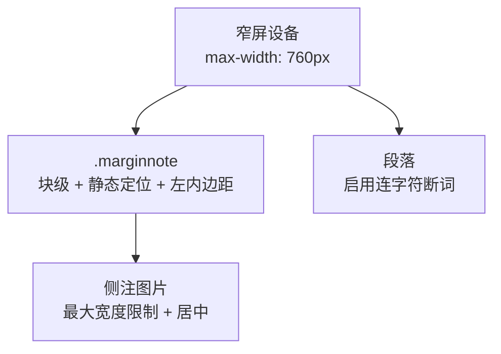
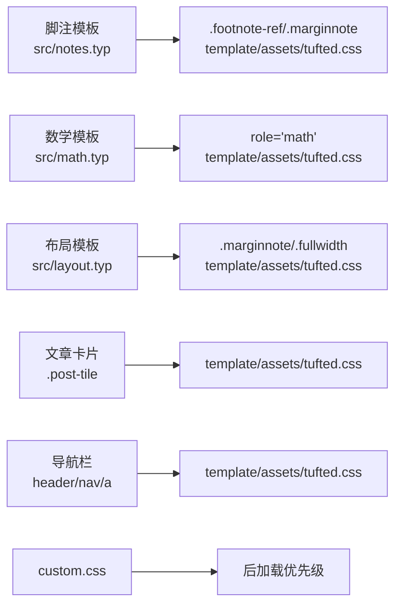

# 组件样式

<cite>
**本文引用的文件**
- [template/assets/tufted.css](file://template/assets/tufted.css)
- [src/tufted.typ](file://src/tufted.typ)
- [src/notes.typ](file://src/notes.typ)
- [src/math.typ](file://src/math.typ)
- [src/figures.typ](file://src/figures.typ)
- [src/layout.typ](file://src/layout.typ)
- [template/content/blog/2024-10-04-iterators-generators/index.typ](file://template/content/blog/2024-10-04-iterators-generators/index.typ)
- [template/content/blog/2025-04-16-monkeys-apes/index.typ](file://template/content/blog/2025-04-16-monkeys-apes/index.typ)
- [template/content/index.typ](file://template/content/index.typ)
- [template/content/docs/03-styling/index.typ](file://template/content/docs/03-styling/index.typ)
- [template/config.typ](file://template/config.typ)
</cite>

## 目录
1. [简介](#简介)
2. [项目结构](#项目结构)
3. [核心组件](#核心组件)
4. [架构总览](#架构总览)
5. [详细组件分析](#详细组件分析)
6. [依赖分析](#依赖分析)
7. [性能考虑](#性能考虑)
8. [故障排查指南](#故障排查指南)
9. [结论](#结论)
10. [附录](#附录)

## 简介
本文件聚焦于 TwilightPage 的组件样式实现，系统性解析以下方面：
- 导航栏的 Flexbox 布局与悬停交互
- 脚注引用与侧注的高亮联动与过渡动画
- 数学公式在行内与块级的特殊处理及深色模式适配
- 文章卡片（post-tile）的样式设计与交互
- CSS 变量、类名与选择器优先级
- 样式修改指南、调试技巧与性能优化建议

## 项目结构
TwilightPage 通过 Typst 模板生成 HTML，并由 CSS 控制最终视觉呈现。关键样式位于全局样式表中，模板通过注入 HTML 元素并赋予特定类名，使 CSS 能够作用到对应组件。



图表来源
- [src/tufted.typ:17-63](file://src/tufted.typ#L17-L63)
- [src/notes.typ:1-27](file://src/notes.typ#L1-L27)
- [src/math.typ:1-22](file://src/math.typ#L1-L22)
- [src/figures.typ:1-20](file://src/figures.typ#L1-L20)
- [src/layout.typ:1-13](file://src/layout.typ#L1-L13)
- [template/assets/tufted.css:1-166](file://template/assets/tufted.css#L1-L166)
- [template/assets/custom.css:1-1](file://template/assets/custom.css#L1-L1)

章节来源
- [src/tufted.typ:17-63](file://src/tufted.typ#L17-L63)
- [template/assets/tufted.css:1-166](file://template/assets/tufted.css#L1-L166)
- [template/content/docs/03-styling/index.typ:1-43](file://template/content/docs/03-styling/index.typ#L1-L43)

## 核心组件
- 导航栏（header nav）
  - 使用 Flexbox 实现水平排列与间距控制；链接采用圆角背景与短时过渡，悬停与焦点态提供弱高亮反馈。
- 脚注引用与侧注（.footnote-ref 与 .marginnote）
  - 通过 CSS 变量与过渡属性实现“交叉高亮”：引用悬停联动侧注高亮，侧注悬停联动引用高亮；延迟过渡用于避免闪烁。
- 数学公式（[role="math"]）
  - 行内与块级分别渲染为 span/figure；块级公式增大字号并设置上下边距；深色模式下对数学元素进行滤镜反转以提升对比度。
- 文章卡片（.post-tile）
  - 卡片容器与链接块级化并提供内边距；悬停与焦点态提供弱高亮反馈；标题与段落间距统一。
- 响应式布局（@media max-width: 760px）
  - 侧注在窄屏改为块级显示、限制图片宽度并启用连字符断词，提升阅读体验。

章节来源
- [template/assets/tufted.css:58-118](file://template/assets/tufted.css#L58-L118)
- [template/assets/tufted.css:121-137](file://template/assets/tufted.css#L121-L137)
- [template/assets/tufted.css:140-166](file://template/assets/tufted.css#L140-L166)
- [template/assets/tufted.css:27-55](file://template/assets/tufted.css#L27-L55)

## 架构总览
样式生效路径：Typst 模板生成 HTML 元素并赋予类名或 role，随后由 CSS 选择器匹配并应用样式。全局样式表加载顺序为 tufte-css → tufted.css → custom.css，custom.css 因最后加载而具有更高优先级。



图表来源
- [src/tufted.typ:36-62](file://src/tufted.typ#L36-L62)
- [template/assets/tufted.css:1-166](file://template/assets/tufted.css#L1-L166)

## 详细组件分析

### 导航栏（header nav）与链接
- Flexbox 布局
  - 容器使用 Flexbox 并设置项间距，确保链接水平排列且间距一致。
- 链接样式与交互
  - 链接继承文本颜色、去除装饰线与阴影；设置字号、内边距与圆角半径；悬停与焦点态通过弱高亮背景与无外轮廓提供清晰反馈。
  - 过渡时长极短，保证交互顺滑。
- 选择器优先级
  - 链接选择器覆盖多种伪类状态，确保在不同交互状态下均能正确应用样式。



图表来源
- [template/assets/tufted.css:62-87](file://template/assets/tufted.css#L62-L87)

章节来源
- [template/assets/tufted.css:62-87](file://template/assets/tufted.css#L62-L87)
- [src/tufted.typ:7-15](file://src/tufted.typ#L7-L15)

### 脚注引用与侧注（.footnote-ref 与 .marginnote）
- 结构与职责
  - 脚注模板在 HTML 中生成引用与侧注两部分，分别带有类名与 ID，形成可交互的引用-注释对。
- 高亮联动机制
  - 引用悬停时，相邻侧注获得弱高亮；侧注悬停时，引用获得强高亮；通过 CSS 变量与过渡属性实现平滑切换。
  - 引用与侧注之间通过相邻兄弟选择器与包含关系选择器建立联动。
- 过渡动画
  - 初始过渡延迟较长，避免页面加载时的闪烁；悬停时重置为即时过渡，确保响应迅速。
- 选择器优先级
  - 通过相邻兄弟选择器与包含关系选择器组合，确保在复杂文档中仍能稳定触发高亮。

```mermaid
sequenceDiagram
participant U as "用户"
participant Ref as ".footnote-ref"
participant Note as ".marginnote"
U->>Ref : 悬停
Ref-->>Note : 相邻兄弟选择器触发弱高亮
Note-->>Ref : 包含关系选择器触发强高亮
Note->>U : 悬停
Note-->>Ref : 包含关系选择器触发强高亮
Ref-->>Note : 相邻兄弟选择器触发弱高亮
```

图表来源
- [src/notes.typ:8-24](file://src/notes.typ#L8-L24)
- [template/assets/tufted.css:94-113](file://template/assets/tufted.css#L94-L113)

章节来源
- [src/notes.typ:1-27](file://src/notes.typ#L1-L27)
- [template/assets/tufted.css:94-118](file://template/assets/tufted.css#L94-L118)

### 数学公式（[role="math"]）
- 渲染策略
  - 行内公式渲染为 span，块级公式渲染为 figure；块级公式增大字号并设置上下边距，提升可读性。
- 深色模式适配
  - 在深色模式下对数学元素应用滤镜反转与色相旋转，改善对比度与可读性。
- 选择器优先级
  - 通过 role 属性选择器直接命中数学节点，避免与通用标签冲突。



图表来源
- [src/math.typ:12-18](file://src/math.typ#L12-L18)
- [template/assets/tufted.css:125-137](file://template/assets/tufted.css#L125-L137)

章节来源
- [src/math.typ:1-22](file://src/math.typ#L1-L22)
- [template/assets/tufted.css:125-137](file://template/assets/tufted.css#L125-L137)

### 文章卡片（.post-tile）
- 样式设计
  - 卡片容器设置底部间距；链接块级化并添加微小内边距；标题与段落间距统一，保证信息密度与可读性。
- 交互效果
  - 链接悬停与焦点态提供弱高亮背景，无外轮廓，确保与页面整体风格一致。
- 选择器优先级
  - 通过类名限定作用范围，避免与页面其他链接样式冲突。



图表来源
- [template/assets/tufted.css:144-166](file://template/assets/tufted.css#L144-L166)

章节来源
- [template/assets/tufted.css:144-166](file://template/assets/tufted.css#L144-L166)

### 响应式布局与窄屏体验
- 侧注行为
  - 在窄屏设备上，侧注改为块级显示、移除浮动与定位，使用静态布局并增加左右内边距，使其更易阅读。
- 图片尺寸
  - 限制侧注中的图片最大宽度，居中显示，避免溢出。
- 文字处理
  - 启用连字符断词，提升窄屏下的排版质量。



图表来源
- [template/assets/tufted.css:30-55](file://template/assets/tufted.css#L30-L55)

章节来源
- [template/assets/tufted.css:30-55](file://template/assets/tufted.css#L30-L55)

## 依赖分析
- 模板到样式
  - 模板通过注入类名与 role 属性，使 CSS 能够精准匹配目标元素。
- 样式加载顺序
  - 默认加载顺序为 tufte-css → tufted.css → custom.css，custom.css 因最后加载而具备最高优先级，便于覆盖默认样式。
- 组件耦合
  - 脚注与侧注依赖彼此的类名与 ID 关联；数学公式依赖 role 属性；文章卡片依赖类名；导航栏依赖容器结构。



图表来源
- [src/notes.typ:1-27](file://src/notes.typ#L1-L27)
- [src/math.typ:1-22](file://src/math.typ#L1-L22)
- [src/layout.typ:1-13](file://src/layout.typ#L1-L13)
- [template/assets/tufted.css:1-166](file://template/assets/tufted.css#L1-L166)
- [template/assets/custom.css:1-1](file://template/assets/custom.css#L1-L1)

章节来源
- [src/tufted.typ:17-63](file://src/tufted.typ#L17-L63)
- [template/assets/tufted.css:1-166](file://template/assets/tufted.css#L1-L166)
- [template/content/docs/03-styling/index.typ:8-21](file://template/content/docs/03-styling/index.typ#L8-L21)

## 性能考虑
- 选择器复杂度
  - 尽量使用类名与低权重选择器，避免深层后代选择器导致的回流与重绘成本上升。
- 过渡与动画
  - 对频繁交互的元素（如导航链接、卡片链接）使用短时过渡；对高亮联动使用延迟过渡以减少初始闪烁。
- 响应式媒体查询
  - 在窄屏场景下仅做必要调整（如侧注块级化、图片限制），避免在移动端引入过多复杂布局。
- 深色模式滤镜
  - 数学元素的滤镜反转仅在深色模式下生效，避免在浅色模式下产生不必要的滤镜开销。
- 样式加载
  - custom.css 放在最后加载，减少覆盖默认样式的代价；若需大幅定制，可考虑只保留自定义样式以降低体积。

## 故障排查指南
- 导航栏样式未生效
  - 检查是否正确生成 header/nav/a 结构；确认自定义样式未被默认样式覆盖。
  - 参考路径：[src/tufted.typ:7-15](file://src/tufted.typ#L7-L15)，[template/assets/tufted.css:62-87](file://template/assets/tufted.css#L62-L87)
- 脚注高亮不联动
  - 确认引用与侧注的类名与 ID 是否一一对应；检查相邻兄弟选择器与包含关系选择器是否正确。
  - 参考路径：[src/notes.typ:8-24](file://src/notes.typ#L8-L24)，[template/assets/tufted.css:94-113](file://template/assets/tufted.css#L94-L113)
- 数学公式在深色模式下不可读
  - 确认深色模式媒体查询已启用；检查滤镜设置是否被覆盖。
  - 参考路径：[template/assets/tufted.css:131-137](file://template/assets/tufted.css#L131-L137)
- 文章卡片交互无效
  - 检查链接是否为块级元素；确认 hover/focus-visible 伪类是否被其他样式覆盖。
  - 参考路径：[template/assets/tufted.css:148-158](file://template/assets/tufted.css#L148-L158)
- 窄屏侧注溢出或过宽
  - 检查窄屏媒体查询是否生效；确认图片最大宽度与居中设置。
  - 参考路径：[template/assets/tufted.css:30-55](file://template/assets/tufted.css#L30-L55)

## 结论
TwilightPage 的样式体系以类名与 role 属性为核心，结合 Flexbox、过渡动画与媒体查询，实现了简洁而高效的 UI 组件。导航栏、脚注-侧注联动、数学公式与文章卡片均体现了明确的设计意图与良好的可维护性。通过合理利用 CSS 变量与加载顺序，用户可在不破坏默认样式的前提下进行深度定制。

## 附录

### 样式修改指南与最佳实践
- 修改导航栏
  - 调整链接字号、内边距与圆角半径；如需改变悬停反馈，可调整弱高亮背景值与过渡时长。
  - 参考路径：[template/assets/tufted.css:62-87](file://template/assets/tufted.css#L62-L87)
- 调整脚注高亮
  - 如需改变高亮强度，可调整弱/强高亮变量；如需改变过渡时长或延迟，可调整过渡属性。
  - 参考路径：[template/assets/tufted.css:94-113](file://template/assets/tufted.css#L94-L113)
- 自定义数学公式外观
  - 可通过自定义样式覆盖字号与边距；深色模式适配请确保媒体查询生效。
  - 参考路径：[template/assets/tufted.css:125-137](file://template/assets/tufted.css#L125-L137)
- 优化文章卡片
  - 调整卡片间距与链接内边距；如需改变交互反馈，可调整弱高亮背景与过渡。
  - 参考路径：[template/assets/tufted.css:144-166](file://template/assets/tufted.css#L144-L166)
- 响应式优化
  - 在窄屏场景下保持侧注块级化与图片限制；如需进一步优化，可调整断词策略与字体大小。
  - 参考路径：[template/assets/tufted.css:30-55](file://template/assets/tufted.css#L30-L55)

### 样式调试建议
- 使用浏览器开发者工具检查元素结构与类名/role 属性是否正确生成。
- 逐步禁用自定义样式，确认问题是否由覆盖规则引起。
- 在深色模式与浅色模式下分别测试数学公式与高亮效果。
- 对高频交互元素（导航、卡片）进行滚动与焦点测试，确保过渡流畅。