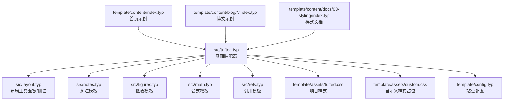
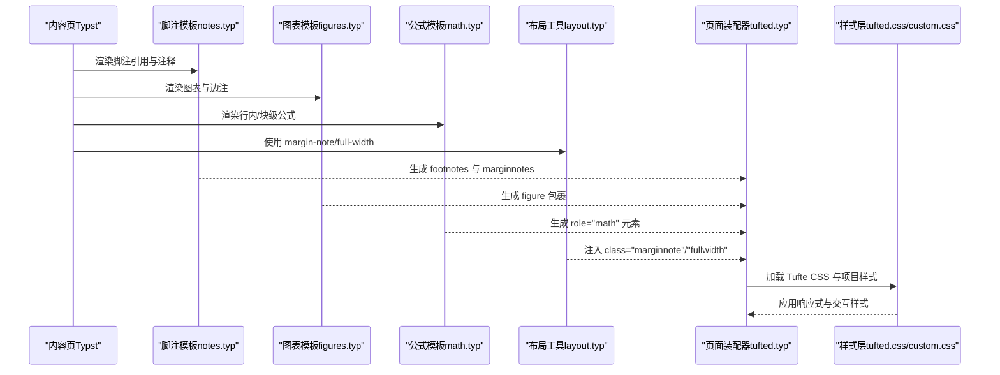
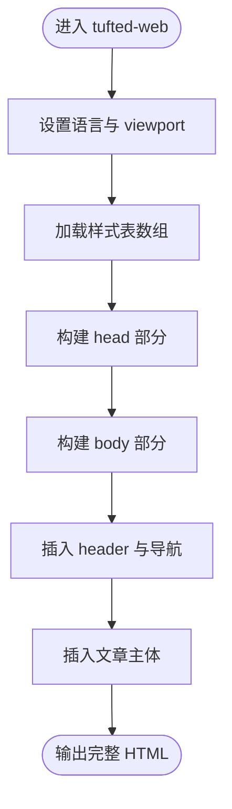
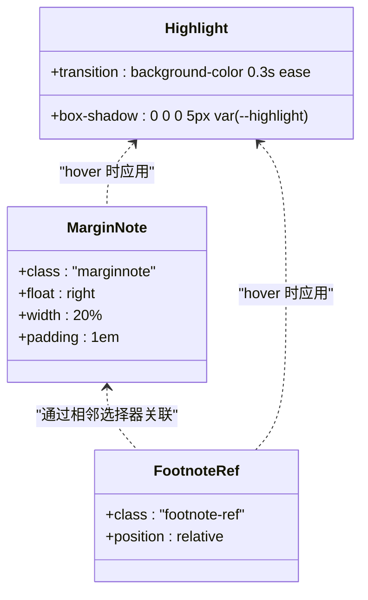
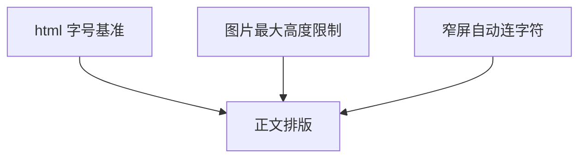
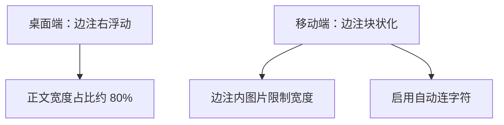
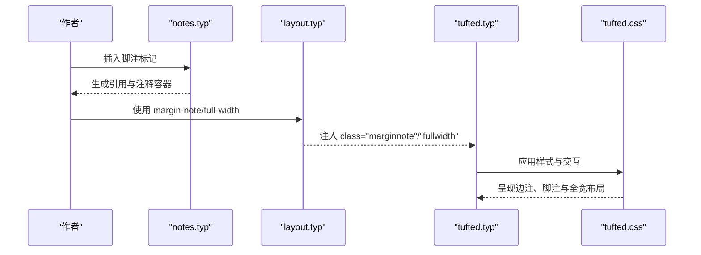
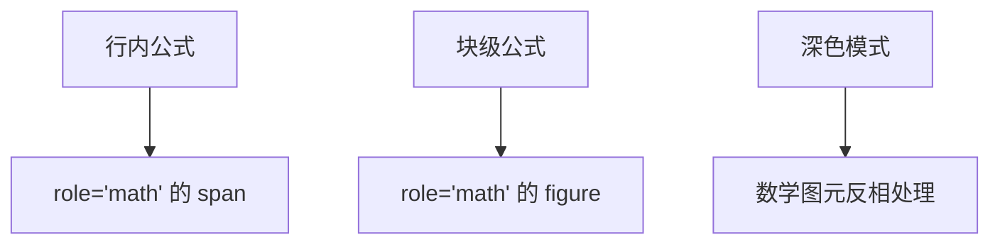
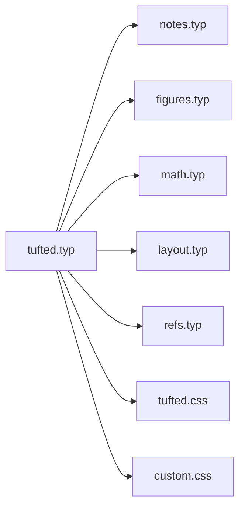

# Tufte 设计理念

<cite>
**本文引用的文件**
- [src/tufted.typ](file://src/tufted.typ)
- [src/layout.typ](file://src/layout.typ)
- [src/notes.typ](file://src/notes.typ)
- [src/figures.typ](file://src/figures.typ)
- [src/math.typ](file://src/math.typ)
- [src/refs.typ](file://src/refs.typ)
- [template/assets/tufted.css](file://template/assets/tufted.css)
- [template/assets/custom.css](file://template/assets/custom.css)
- [template/config.typ](file://template/config.typ)
- [template/content/index.typ](file://template/content/index.typ)
- [template/content/docs/03-styling/index.typ](file://template/content/docs/03-styling/index.typ)
- [template/content/blog/2024-10-04-iterators-generators/index.typ](file://template/content/blog/2024-10-04-iterators-generators/index.typ)
- [template/content/blog/2025-10-30-normal-distribution/index.typ](file://template/content/blog/2025-10-30-normal-distribution/index.typ)
- [template/README.md](file://template/README.md)
- [typst.toml](file://typst.toml)
</cite>

## 目录
1. [引言](#引言)
2. [项目结构](#项目结构)
3. [核心组件](#核心组件)
4. [架构总览](#架构总览)
5. [详细组件分析](#详细组件分析)
6. [依赖关系分析](#依赖关系分析)
7. [性能考量](#性能考量)
8. [故障排查指南](#故障排查指南)
9. [结论](#结论)
10. [附录](#附录)

## 引言
本文件围绕“Tufte 设计理念”在本项目的实现进行系统化梳理，重点阐释以下主题：边距控制、字体与排版、视觉层次、留白与对比、比例关系；以及在响应式设计中（桌面与移动）的落地策略；侧注（margin notes）、脚注与全宽内容的布局逻辑；并通过 CSS 示例路径展示具体实现细节。目标是为设计师与开发者提供可操作的设计洞察与实践指导。

## 项目结构
该模板采用 Typst 的实验性 HTML 导出能力，结合外部 Tufte CSS 资源与自定义样式，形成“静态网站模板”。其组织方式如下：
- 源模块层：以功能域拆分（布局、脚注、公式、图表、引用），通过导入与组合形成最终网页骨架。
- 样式层：默认加载 Tufte CSS，再叠加项目内样式与自定义样式，确保覆盖优先级与可扩展性。
- 内容层：示例文章与文档页，演示侧注、脚注、全宽图、数学公式等元素的使用。

**图表来源**
- [src/tufted.typ:17-63](file://src/tufted.typ#L17-L63)
- [src/layout.typ:3-12](file://src/layout.typ#L3-L12)
- [src/notes.typ:1-27](file://src/notes.typ#L1-L27)
- [src/figures.typ:1-20](file://src/figures.typ#L1-L20)
- [src/math.typ:1-22](file://src/math.typ#L1-L22)
- [src/refs.typ:1-23](file://src/refs.typ#L1-L23)
- [template/assets/tufted.css:1-166](file://template/assets/tufted.css#L1-L166)
- [template/assets/custom.css:1](file://template/assets/custom.css#L1)
- [template/config.typ:1-12](file://template/config.typ#L1-L12)
- [template/content/index.typ:1-33](file://template/content/index.typ#L1-L33)
- [template/content/docs/03-styling/index.typ:1-44](file://template/content/docs/03-styling/index.typ#L1-L44)

**章节来源**
- [typst.toml:1-19](file://typst.toml#L1-L19)
- [template/README.md:1-34](file://template/README.md#L1-L34)

## 核心组件
- 页面装配器：负责注入头部、导航、样式表与主体内容，统一输出 HTML 结构。
- 布局工具：提供 margin-note 与 full-width 两类布局容器，分别用于侧注与全宽内容。
- 脚注模板：将脚注编号与引用链接映射到 HTML 的 sup 与 span 容器，并生成对应的边栏注释块。
- 图表模板：重写 figure 与 caption 的渲染，使其以 marginnote 形式显示在边栏。
- 公式模板：区分行内与块级公式，分别包裹为 span 或 figure，便于样式与可访问性处理。
- 引用模板：对特定类型的引用（如方程）进行重写，保证编号与定位正确。
- 样式层：默认加载 Tufte CSS，叠加项目样式与自定义样式，支持深色模式下的数学图元反相处理。

**章节来源**
- [src/tufted.typ:17-63](file://src/tufted.typ#L17-L63)
- [src/layout.typ:3-12](file://src/layout.typ#L3-L12)
- [src/notes.typ:1-27](file://src/notes.typ#L1-L27)
- [src/figures.typ:1-20](file://src/figures.typ#L1-L20)
- [src/math.typ:1-22](file://src/math.typ#L1-L22)
- [src/refs.typ:1-23](file://src/refs.typ#L1-L23)
- [template/assets/tufted.css:1-166](file://template/assets/tufted.css#L1-L166)

## 架构总览
下图展示了从内容到最终页面的关键流程：内容经由各模板模块转换为 HTML 片段，再由页面装配器整合为完整的 HTML 文档，并通过样式层完成视觉呈现。

**图表来源**
- [src/notes.typ:1-27](file://src/notes.typ#L1-L27)
- [src/figures.typ:1-20](file://src/figures.typ#L1-L20)
- [src/math.typ:1-22](file://src/math.typ#L1-L22)
- [src/layout.typ:3-12](file://src/layout.typ#L3-L12)
- [src/tufted.typ:17-63](file://src/tufted.typ#L17-L63)
- [template/assets/tufted.css:1-166](file://template/assets/tufted.css#L1-L166)

## 详细组件分析

### 页面装配器与样式加载
- 负责设置语言、注入 viewport、标题与样式表列表。
- 默认加载 Tufte CSS、项目样式与自定义样式，确保自定义样式具有最高优先级。
- 提供 header-links 参数以生成导航条。

**图表来源**
- [src/tufted.typ:17-63](file://src/tufted.typ#L17-L63)

**章节来源**
- [src/tufted.typ:17-63](file://src/tufted.typ#L17-L63)
- [template/config.typ:1-12](file://template/config.typ#L1-L12)
- [template/content/docs/03-styling/index.typ:8-21](file://template/content/docs/03-styling/index.typ#L8-L21)

### 边距控制与视觉层次
- 边距控制：通过 margin-note 将补充信息放置于页面右侧边栏，保持正文阅读流不被打断。
- 视觉层次：正文文本与边注之间通过留白、字号与对比度建立清晰层级；hover 时的高亮过渡增强可发现性。
- 留白与对比：边注区域与正文之间留出足够空白；在 hover 时通过背景色与阴影实现轻量对比，避免干扰主文。

**图表来源**
- [src/layout.typ:3-5](file://src/layout.typ#L3-L5)
- [src/notes.typ:8-21](file://src/notes.typ#L8-L21)
- [template/assets/tufted.css:94-118](file://template/assets/tufted.css#L94-L118)

**章节来源**
- [src/layout.typ:3-5](file://src/layout.typ#L3-L5)
- [src/notes.typ:1-27](file://src/notes.typ#L1-L27)
- [template/assets/tufted.css:94-118](file://template/assets/tufted.css#L94-L118)

### 字体选择与排版
- 字号基准：根元素设定基础字号，确保整体比例一致。
- 图像限制：图片最大高度限制，避免破坏页面节奏。
- 移动端换行：窄屏下启用自动连字符，提升正文可读性。

**图表来源**
- [template/assets/tufted.css:16-23](file://template/assets/tufted.css#L16-L23)
- [template/assets/tufted.css:52-54](file://template/assets/tufted.css#L52-L54)

**章节来源**
- [template/assets/tufted.css:16-23](file://template/assets/tufted.css#L16-L23)
- [template/assets/tufted.css:52-54](file://template/assets/tufted.css#L52-L54)

### 响应式设计：桌面与移动适配
- 桌面端：边注浮动在正文右侧，宽度约 20%，与正文保持稳定比例。
- 移动端：边注改为块状显示，占据全文宽度，内部图片宽度按固定值限制，避免溢出；同时启用换行优化阅读体验。

**图表来源**
- [template/assets/tufted.css:30-55](file://template/assets/tufted.css#L30-L55)

**章节来源**
- [template/assets/tufted.css:30-55](file://template/assets/tufted.css#L30-L55)

### 侧注、脚注与全宽内容的布局逻辑
- 侧注（margin-note）：通过 span.marginnote 实现，既可用于文字说明，也可承载图片等媒体。
- 脚注（footnote）：引用与注释分别渲染为 sup 与 span，注释块与引用通过相邻兄弟选择器建立交互高亮。
- 全宽内容（full-width）：通过 div.fullwidth 实现，用于需要突破正文宽度限制的图表或容器。

**图表来源**
- [src/notes.typ:1-27](file://src/notes.typ#L1-L27)
- [src/layout.typ:3-12](file://src/layout.typ#L3-L12)
- [src/tufted.typ:17-63](file://src/tufted.typ#L17-L63)
- [template/assets/tufted.css:94-118](file://template/assets/tufted.css#L94-L118)

**章节来源**
- [src/notes.typ:1-27](file://src/notes.typ#L1-L27)
- [src/layout.typ:3-12](file://src/layout.typ#L3-L12)
- [template/assets/tufted.css:94-118](file://template/assets/tufted.css#L94-L118)

### 数学公式与深色模式
- 行内与块级公式分别以 span/figure 包裹，role="math" 便于样式与可访问性识别。
- 深色模式下对数学图元进行反相处理，提升对比度与可读性。

**图表来源**
- [src/math.typ:4-18](file://src/math.typ#L4-L18)
- [template/assets/tufted.css:126-137](file://template/assets/tufted.css#L126-L137)

**章节来源**
- [src/math.typ:1-22](file://src/math.typ#L1-L22)
- [template/assets/tufted.css:126-137](file://template/assets/tufted.css#L126-L137)

### 引用与交叉引用
- 对特定类型（如方程）的引用进行重写，确保编号与定位准确。
- 支持对标题等元素的智能引述处理。

**章节来源**
- [src/refs.typ:1-23](file://src/refs.typ#L1-L23)

### 示例与实践
- 首页示例：演示了 margin-note 的多种用法（图片与文字）。
- 博文示例：展示脚注、图表与数学公式的综合使用。
- 样式文档：说明默认样式表加载顺序与自定义样式的覆盖方式。

**章节来源**
- [template/content/index.typ:7-14](file://template/content/index.typ#L7-L14)
- [template/content/blog/2024-10-04-iterators-generators/index.typ:6-40](file://template/content/blog/2024-10-04-iterators-generators/index.typ#L6-L40)
- [template/content/blog/2025-10-30-normal-distribution/index.typ:14-36](file://template/content/blog/2025-10-30-normal-distribution/index.typ#L14-L36)
- [template/content/docs/03-styling/index.typ:8-43](file://template/content/docs/03-styling/index.typ#L8-L43)

## 依赖关系分析
- 组件耦合：页面装配器集中导入各模板模块，耦合度低、职责清晰。
- 外部依赖：通过 CDN 加载 Tufte CSS，减少本地维护成本。
- 样式优先级：自定义样式位于最后加载，天然具备覆盖能力。

**图表来源**
- [src/tufted.typ:17-63](file://src/tufted.typ#L17-L63)
- [src/notes.typ:1-27](file://src/notes.typ#L1-L27)
- [src/figures.typ:1-20](file://src/figures.typ#L1-L20)
- [src/math.typ:1-22](file://src/math.typ#L1-L22)
- [src/layout.typ:3-12](file://src/layout.typ#L3-L12)
- [src/refs.typ:1-23](file://src/refs.typ#L1-L23)
- [template/assets/tufted.css:1-166](file://template/assets/tufted.css#L1-L166)
- [template/assets/custom.css:1](file://template/assets/custom.css#L1)

**章节来源**
- [src/tufted.typ:17-63](file://src/tufted.typ#L17-L63)
- [template/assets/tufted.css:1-166](file://template/assets/tufted.css#L1-L166)

## 性能考量
- 样式加载：默认仅加载三份样式，且自定义样式后置，避免重复覆盖带来的计算开销。
- 媒体尺寸：图片最大高度限制与移动端图片宽度约束，有助于减少重绘与布局抖动。
- 可访问性：role 语义化标签与 hover 高亮，提升交互反馈与可发现性。

## 故障排查指南
- 样式未生效：确认自定义样式位于最后加载；检查选择器优先级与命名空间冲突。
- 边注溢出：移动端边注已改为块状并限制图片宽度；若仍溢出，请检查自定义样式的覆盖范围。
- 脚注高亮异常：确保引用与注释容器的 class 与相邻选择器规则一致；检查 hover 事件是否被其他样式覆盖。
- 数学公式对比度不足：深色模式下已启用反相处理；若仍不明显，请检查滤镜属性是否被覆盖。

**章节来源**
- [template/assets/tufted.css:30-55](file://template/assets/tufted.css#L30-L55)
- [template/assets/tufted.css:94-118](file://template/assets/tufted.css#L94-L118)
- [template/assets/tufted.css:126-137](file://template/assets/tufted.css#L126-L137)

## 结论
本项目以“Tufte 设计理念”为核心，通过 Typst 的 HTML 导出能力与 Tufte CSS 的经典样式，实现了高比例、强留白、弱装饰的阅读体验。布局工具、脚注模板、图表与公式模板共同构成清晰的信息架构；响应式策略在桌面与移动两端兼顾可读性与可用性；自定义样式机制则提供了灵活的扩展空间。建议在实践中优先遵循边距与比例原则，谨慎使用装饰性元素，以保持信息密度与可读性的平衡。

## 附录
- 样式示例路径参考：
  - [边距控制与交互高亮:94-118](file://template/assets/tufted.css#L94-L118)
  - [移动端边注与图片限制:30-55](file://template/assets/tufted.css#L30-L55)
  - [数学公式角色与深色模式处理:126-137](file://template/assets/tufted.css#L126-L137)
  - [默认样式表加载与自定义覆盖:8-43](file://template/content/docs/03-styling/index.typ#L8-L43)
- 内容示例路径参考：
  - [首页边注示例:7-14](file://template/content/index.typ#L7-L14)
  - [脚注与图表示例:6-40](file://template/content/blog/2024-10-04-iterators-generators/index.typ#L6-L40)
  - [数学公式与全宽图示例:14-36](file://template/content/blog/2025-10-30-normal-distribution/index.typ#L14-L36)