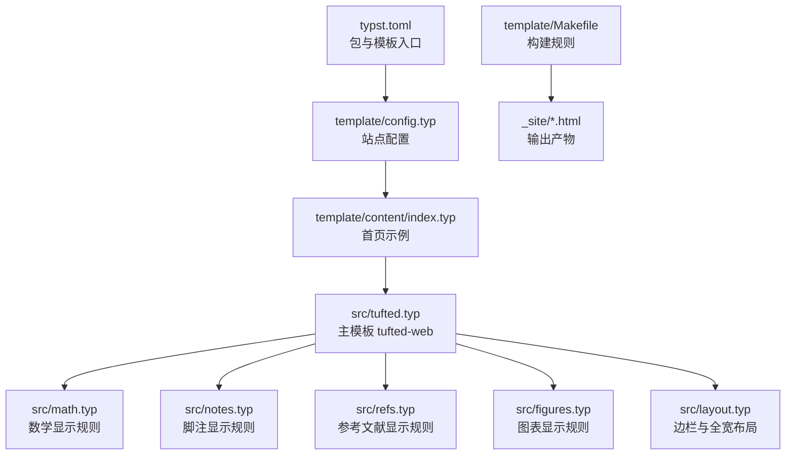
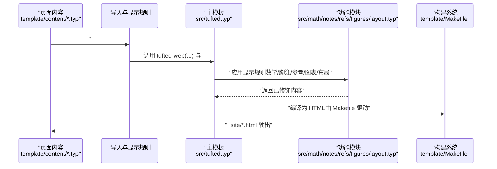
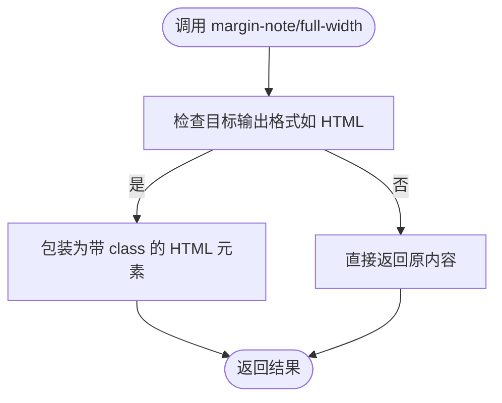
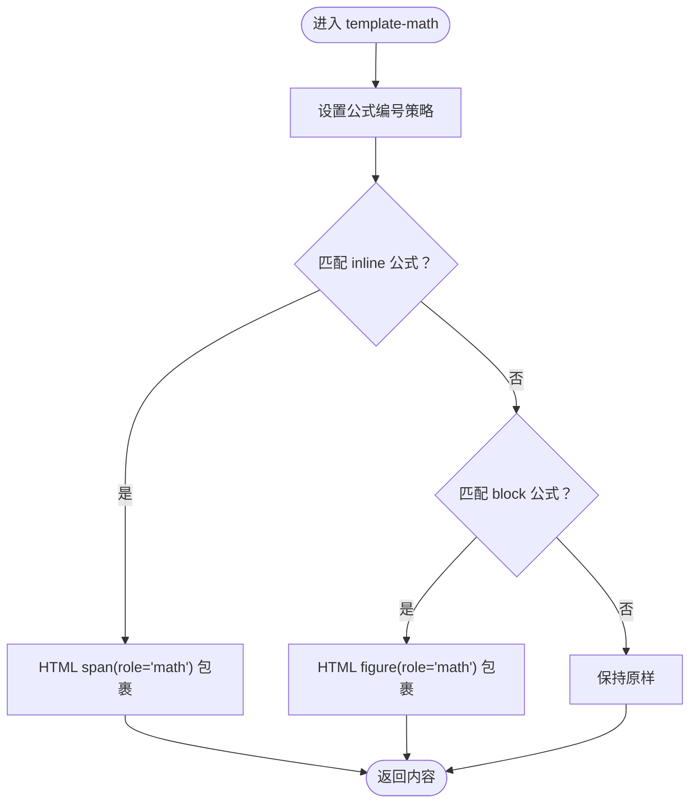
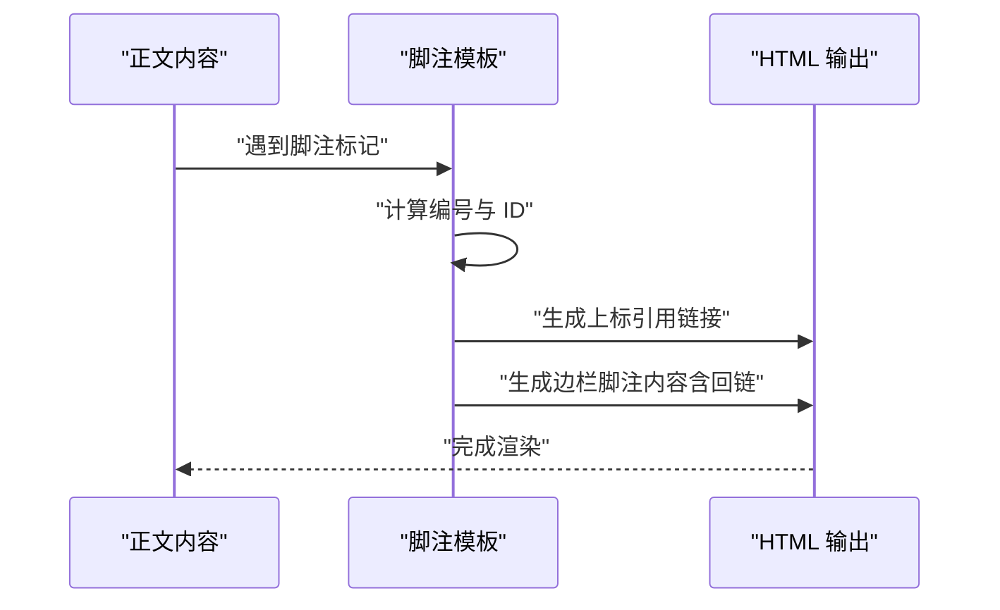
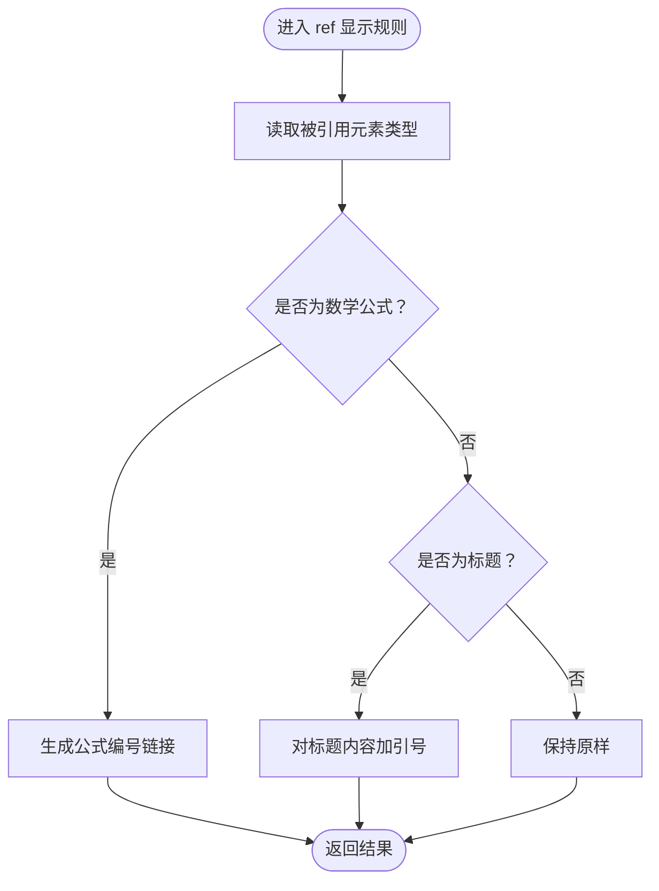
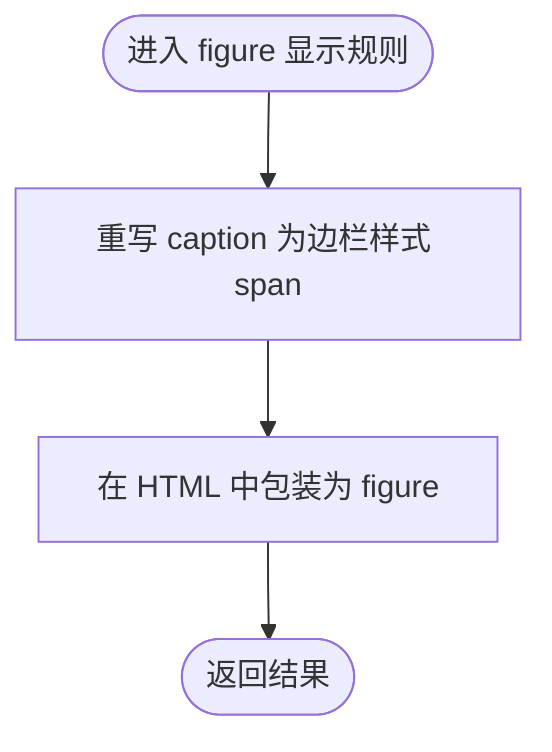
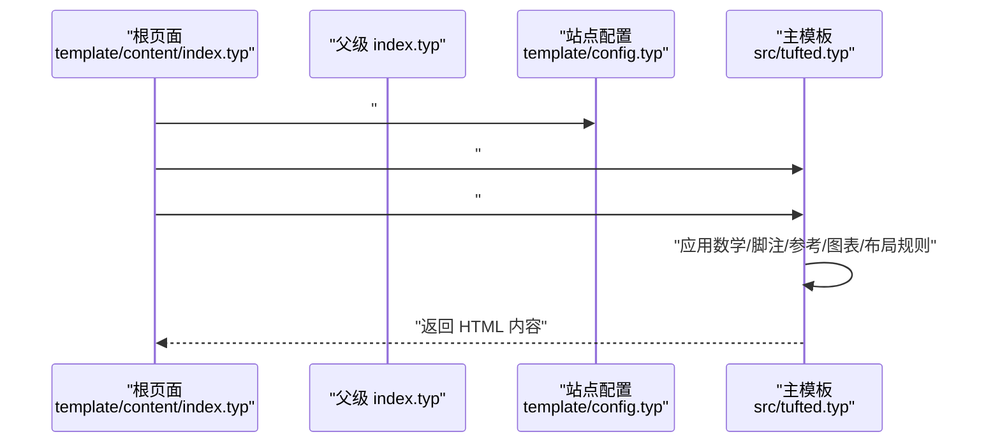
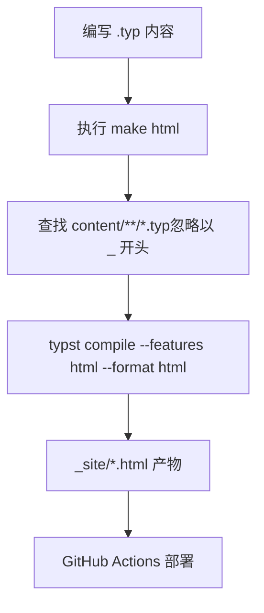
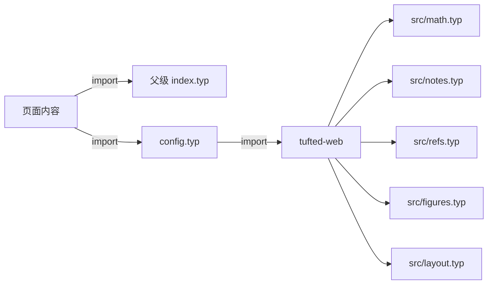

# Typst 基础语法

<cite>
**本文引用的文件**
- [src/layout.typ](file://src/layout.typ)
- [src/math.typ](file://src/math.typ)
- [src/notes.typ](file://src/notes.typ)
- [src/refs.typ](file://src/refs.typ)
- [src/figures.typ](file://src/figures.typ)
- [src/tufted.typ](file://src/tufted.typ)
- [template/content/index.typ](file://template/content/index.typ)
- [template/content/docs/01-quick-start/index.typ](file://template/content/docs/01-quick-start/index.typ)
- [template/content/docs/02-configuration/index.typ](file://template/content/docs/02-configuration/index.typ)
- [template/content/docs/03-styling/index.typ](file://template/content/docs/03-styling/index.typ)
- [template/content/docs/embedding-markdown/index.typ](file://template/content/docs/embedding-markdown/index.typ)
- [template/content/blog/2024-10-04-iterators-generators/index.typ](file://template/content/blog/2024-10-04-iterators-generators/index.typ)
- [template/config.typ](file://template/config.typ)
- [template/Makefile](file://template/Makefile)
- [typst.toml](file://typst.toml)
</cite>

## 目录
1. [引言](#引言)
2. [项目结构](#项目结构)
3. [核心组件](#核心组件)
4. [架构总览](#架构总览)
5. [详细组件分析](#详细组件分析)
6. [依赖分析](#依赖分析)
7. [性能考虑](#性能考虑)
8. [故障排除指南](#故障排除指南)
9. [结论](#结论)
10. [附录](#附录)

## 引言
本文件面向初学者与进阶用户，系统梳理 Typst 在 TwilightPage（Tufted）模板中的基础语法与工程化实践。内容覆盖变量定义、函数声明、导入与模块系统、数据类型与表达式、控制结构、样式与布局、数学与参考文献处理、Markdown 嵌入等主题，并结合项目中的真实文件路径给出学习路径与最佳实践。

## 项目结构
该仓库采用“包模板”结构：顶层通过 [typst.toml:1-19](file://typst.toml#L1-L19) 定义包元信息与模板入口；模板目录 [template/](file://template/) 提供页面内容与构建配置；源码目录 [src/](file://src/) 实现可复用的显示规则与模板函数。

图示来源
- [typst.toml:1-19](file://typst.toml#L1-L19)
- [template/config.typ:1-12](file://template/config.typ#L1-L12)
- [src/tufted.typ:1-64](file://src/tufted.typ#L1-L64)
- [src/math.typ:1-22](file://src/math.typ#L1-L22)
- [src/notes.typ:1-27](file://src/notes.typ#L1-L27)
- [src/refs.typ:1-23](file://src/refs.typ#L1-L23)
- [src/figures.typ:1-20](file://src/figures.typ#L1-L20)
- [src/layout.typ:1-13](file://src/layout.typ#L1-L13)
- [template/Makefile:1-26](file://template/Makefile#L1-L26)

章节来源
- [typst.toml:1-19](file://typst.toml#L1-L19)
- [template/Makefile:1-26](file://template/Makefile#L1-L26)

## 核心组件
- 变量与函数
  - 使用 #let 定义常量与函数，例如在 [src/layout.typ:3-12](file://src/layout.typ#L3-L12) 中定义了 margin-note 与 full-width 函数；在 [src/tufted.typ:17-27](file://src/tufted.typ#L17-L27) 中定义了 tufted-web 的参数列表与默认值。
- 导入与模块系统
  - 使用 #import 引入其他模块或包，如 [src/tufted.typ:1-5](file://src/tufted.typ#L1-L5) 导入数学、脚注、参考文献与图表模板；在 [template/content/index.typ:1-3](file://template/content/index.typ#L1-L3) 引入本地模板与外部包。
- 显示规则与作用域
  - 使用 #show 将模板函数应用于内容，如 [src/tufted.typ:29-32](file://src/tufted.typ#L29-L32) 对数学、脚注、参考文献与图表分别应用显示规则；在 [src/notes.typ:1-25](file://src/notes.typ#L1-L25) 中重写脚注显示逻辑。
- 控制结构
  - 条件分支：在 [src/math.typ:5-10](file://src/math.typ#L5-L10) 与 [src/notes.typ:3-23](file://src/notes.typ#L3-L23) 中使用 if 表达式根据目标格式（如 HTML）调整渲染。
  - 循环：在 [src/tufted.typ:46-48](file://src/tufted.typ#L46-L48) 中对数组 css 进行循环以加载多个样式表；在 [src/tufted.typ:10-14](file://src/tufted.typ#L10-L14) 中对键值对 header-links 进行迭代生成导航链接。
- 数据类型与表达式
  - 元组与映射：在 [src/tufted.typ:21-26](file://src/tufted.typ#L21-L26) 传入 css 参数为元组；在 [template/config.typ:4-10](file://template/config.typ#L4-L10) 传入 header-links 为映射。
  - 文本与内联元素：在 [template/content/index.typ:17-32](file://template/content/index.typ#L17-L32) 中读取 Markdown 并渲染为内联元素与块级元素。
- 数学与参考文献
  - 数学公式编号与 HTML 角色属性：在 [src/math.typ:2-10](file://src/math.typ#L2-L10) 设置编号与角色；在 [src/refs.typ:8-14](file://src/refs.typ#L8-L14) 处理方程引用。
- 图表与边栏
  - 图表标题与容器：在 [src/figures.typ:5-16](file://src/figures.typ#L5-L16) 重写 caption 与 figure 的 HTML 包装；在 [src/layout.typ:3-12](file://src/layout.typ#L3-L12) 提供 margin-note 与 full-width 辅助函数。

章节来源
- [src/layout.typ:1-13](file://src/layout.typ#L1-L13)
- [src/tufted.typ:1-64](file://src/tufted.typ#L1-L64)
- [src/math.typ:1-22](file://src/math.typ#L1-L22)
- [src/notes.typ:1-27](file://src/notes.typ#L1-L27)
- [src/refs.typ:1-23](file://src/refs.typ#L1-L23)
- [src/figures.typ:1-20](file://src/figures.typ#L1-L20)
- [template/config.typ:1-12](file://template/config.typ#L1-L12)
- [template/content/index.typ:1-33](file://template/content/index.typ#L1-L33)

## 架构总览
下图展示了页面内容如何通过模板与显示规则生成最终 HTML 输出。

图示来源
- [src/tufted.typ:1-64](file://src/tufted.typ#L1-L64)
- [src/math.typ:1-22](file://src/math.typ#L1-L22)
- [src/notes.typ:1-27](file://src/notes.typ#L1-L27)
- [src/refs.typ:1-23](file://src/refs.typ#L1-L23)
- [src/figures.typ:1-20](file://src/figures.typ#L1-L20)
- [src/layout.typ:1-13](file://src/layout.typ#L1-L13)
- [template/Makefile:1-26](file://template/Makefile#L1-L26)

## 详细组件分析

### 组件一：布局与边栏（margin-note 与 full-width）
- 功能概述
  - 提供边栏注释与全宽内容的辅助函数，便于在 HTML 渲染时插入特定 class 的元素。
- 关键点
  - 使用 #let 定义函数，接受 content 参数并返回 HTML 结构。
  - 在 [src/tufted.typ:5-15](file://src/tufted.typ#L5-L15) 中通过循环生成导航链接，体现映射与迭代的使用。
- 适用场景
  - 在页面中插入边栏说明、强调框、全宽图片或图表区域。

图示来源
- [src/layout.typ:3-12](file://src/layout.typ#L3-L12)

章节来源
- [src/layout.typ:1-13](file://src/layout.typ#L1-L13)
- [src/tufted.typ:7-15](file://src/tufted.typ#L7-L15)

### 组件二：数学公式显示（template-math）
- 功能概述
  - 为数学公式设置编号策略，并在 HTML 目标中添加 role 与容器标签。
- 关键点
  - 使用 set 设置全局编号策略；使用 show 匹配 math.equation 的 block 与 inline 模式。
  - 在 [src/math.typ:4-18](file://src/math.typ#L4-L18) 中根据 target() 判断输出格式，分别包裹 span 或 figure。
- 适用场景
  - 在技术文档中统一数学公式的编号与渲染风格。

图示来源
- [src/math.typ:1-22](file://src/math.typ#L1-L22)

章节来源
- [src/math.typ:1-22](file://src/math.typ#L1-L22)

### 组件三：脚注与边栏（template-notes）
- 功能概述
  - 将脚注转换为 HTML sup 链接与边栏内容，支持数字引用与回链。
- 关键点
  - 使用 counter 与 target() 控制编号与输出格式；通过 HTML 元素拼接实现双向链接。
  - 在 [src/notes.typ:2-24](file://src/notes.typ#L2-L24) 中重写 footnote 的显示逻辑。
- 适用场景
  - 在网页版文档中实现 Tufte 风格的脚注与边栏注释。

图示来源
- [src/notes.typ:1-27](file://src/notes.typ#L1-L27)

章节来源
- [src/notes.typ:1-27](file://src/notes.typ#L1-L27)

### 组件四：参考文献与交叉引用（template-refs）
- 功能概述
  - 重写 ref 的显示逻辑，支持对数学公式与标题等元素的智能引用。
- 关键点
  - 通过 element.func() 识别引用类型；对数学公式引用进行特殊处理并生成链接。
  - 在 [src/refs.typ:2-19](file://src/refs.typ#L2-L19) 中实现条件分支与链接生成。
- 适用场景
  - 在论文或技术文档中实现自动化的交叉引用与编号。

图示来源
- [src/refs.typ:1-23](file://src/refs.typ#L1-L23)

章节来源
- [src/refs.typ:1-23](file://src/refs.typ#L1-L23)

### 组件五：图表与标题（template-figures）
- 功能概述
  - 重写 figure 与其 caption 的显示方式，使其在 HTML 下以语义化结构呈现。
- 关键点
  - 在 [src/figures.typ:4-16](file://src/figures.typ#L4-L16) 中将 caption 与 figure 分别包装为 HTML span 与 figure。
- 适用场景
  - 在网页中正确渲染图表标题与内容，提升可访问性与 SEO。

图示来源
- [src/figures.typ:1-20](file://src/figures.typ#L1-L20)

章节来源
- [src/figures.typ:1-20](file://src/figures.typ#L1-L20)

### 组件六：主模板与页面继承（tufted-web 与页面导入）
- 功能概述
  - 主模板 tufted-web 负责组织头部、样式表、主体内容与显示规则；页面通过 #import 与 #show 实现继承与定制。
- 关键点
  - 在 [src/tufted.typ:17-27](file://src/tufted.typ#L17-L27) 定义参数与默认值；在 [src/tufted.typ:29-32](file://src/tufted.typ#L29-L32) 应用各模板显示规则。
  - 页面在 [template/content/index.typ:1-3](file://template/content/index.typ#L1-L3) 导入模板并设置显示；在 [template/content/docs/02-configuration/index.typ:1-52](file://template/content/docs/02-configuration/index.typ#L1-L52) 展示页面继承与链接规则。
- 适用场景
  - 快速搭建多层级页面结构，统一站点风格与交互。

图示来源
- [src/tufted.typ:1-64](file://src/tufted.typ#L1-L64)
- [template/content/index.typ:1-3](file://template/content/index.typ#L1-L3)
- [template/config.typ:1-12](file://template/config.typ#L1-L12)

章节来源
- [src/tufted.typ:1-64](file://src/tufted.typ#L1-L64)
- [template/content/index.typ:1-3](file://template/content/index.typ#L1-L3)
- [template/content/docs/02-configuration/index.typ:1-52](file://template/content/docs/02-configuration/index.typ#L1-L52)

### 组件七：构建与部署（Makefile 与 GitHub Actions）
- 功能概述
  - 使用 Makefile 自动发现 .typ 文件并编译为 HTML；通过 GitHub Actions 实现自动化部署。
- 关键点
  - 在 [template/Makefile:1-26](file://template/Makefile#L1-L26) 中定义规则，使用 typst compile --features html --format html 生成静态网站。
  - 在 [template/content/docs/04-deploy/index.typ:10-52](file://template/content/docs/04-deploy/index.typ#L10-L52) 提供 GitHub Actions 工作流示例。
- 适用场景
  - 将 Typst 内容持续集成到静态托管平台。

图示来源
- [template/Makefile:1-26](file://template/Makefile#L1-L26)
- [template/content/docs/04-deploy/index.typ:1-60](file://template/content/docs/04-deploy/index.typ#L1-L60)

章节来源
- [template/Makefile:1-26](file://template/Makefile#L1-L26)
- [template/content/docs/04-deploy/index.typ:1-60](file://template/content/docs/04-deploy/index.typ#L1-L60)

## 依赖分析
- 模块耦合
  - 主模板 [src/tufted.typ:1-6](file://src/tufted.typ#L1-L6) 统一引入数学、脚注、参考、图表与布局模块，形成高内聚低耦合的显示规则体系。
- 导入关系
  - 页面通过相对路径导入父级 index.typ 或直接导入 config.typ，实现层次化继承。
- 外部依赖
  - 通过包管理器引入外部模板与工具（如 cmarker、mitex），并在页面中按需启用数学与 Markdown 渲染。

图示来源
- [src/tufted.typ:1-6](file://src/tufted.typ#L1-L6)
- [template/content/index.typ:1-3](file://template/content/index.typ#L1-L3)
- [template/config.typ:1-12](file://template/config.typ#L1-L12)

章节来源
- [src/tufted.typ:1-6](file://src/tufted.typ#L1-L6)
- [template/content/index.typ:1-3](file://template/content/index.typ#L1-L3)
- [template/config.typ:1-12](file://template/config.typ#L1-L12)

## 性能考虑
- 编译优化
  - 使用 Makefile 批量编译，避免重复扫描与无谓的增量编译开销。
- 渲染策略
  - 在显示规则中仅在目标为 HTML 时进行额外包装，减少不必要的 DOM 操作。
- 资源加载
  - 合理组织样式表顺序，确保自定义样式能够覆盖默认样式，同时避免过多外部资源导致加载延迟。

## 故障排除指南
- 页面未继承父级样式
  - 确认页面导入了正确的父级 index.typ 或 config.typ，并使用 #show 应用模板。
  - 参考路径：[template/content/index.typ:1-3](file://template/content/index.typ#L1-L3)，[template/content/docs/02-configuration/index.typ:41-52](file://template/content/docs/02-configuration/index.typ#L41-L52)
- 脚注链接无法跳转
  - 检查脚注编号与 HTML ID 是否一致，确认 target() 判断与元素拼接逻辑。
  - 参考路径：[src/notes.typ:3-23](file://src/notes.typ#L3-L23)
- 数学公式未编号或未渲染
  - 确认已应用 template-math 的显示规则，并检查 set numbering 的配置。
  - 参考路径：[src/math.typ:2-10](file://src/math.typ#L2-L10)
- 图表标题未显示为边栏样式
  - 确认已应用 template-figures 的显示规则，并检查 caption 的重写逻辑。
  - 参考路径：[src/figures.typ:4-8](file://src/figures.typ#L4-L8)
- 构建失败或找不到文件
  - 检查 Makefile 中的文件发现规则与输出路径，确保 content 下的 .typ 文件未被忽略。
  - 参考路径：[template/Makefile:1-26](file://template/Makefile#L1-L26)

章节来源
- [template/content/index.typ:1-3](file://template/content/index.typ#L1-L3)
- [template/content/docs/02-configuration/index.typ:41-52](file://template/content/docs/02-configuration/index.typ#L41-L52)
- [src/notes.typ:1-27](file://src/notes.typ#L1-L27)
- [src/math.typ:1-22](file://src/math.typ#L1-L22)
- [src/figures.typ:1-20](file://src/figures.typ#L1-L20)
- [template/Makefile:1-26](file://template/Makefile#L1-L26)

## 结论
通过模块化的设计与清晰的显示规则，TwilightPage（Tufted）模板将 Typst 的语法能力与现代 Web 输出需求有机结合。掌握变量定义、函数声明、导入与显示规则、控制结构与数据类型后，即可高效地构建层次化、可维护的静态网站。

## 附录

### 学习路径建议
- 第一步：快速上手
  - 阅读 [template/content/docs/01-quick-start/index.typ:1-24](file://template/content/docs/01-quick-start/index.typ#L1-L24) 了解初始化与构建流程。
- 第二步：理解模板与继承
  - 阅读 [template/content/docs/02-configuration/index.typ:1-52](file://template/content/docs/02-configuration/index.typ#L1-L52) 了解页面层级与继承机制。
- 第三步：样式与布局
  - 阅读 [template/content/docs/03-styling/index.typ:1-44](file://template/content/docs/03-styling/index.typ#L1-L44) 了解默认样式与自定义方法。
- 第四步：核心显示规则
  - 依次阅读 [src/math.typ:1-22](file://src/math.typ#L1-L22)、[src/notes.typ:1-27](file://src/notes.typ#L1-L27)、[src/refs.typ:1-23](file://src/refs.typ#L1-L23)、[src/figures.typ:1-20](file://src/figures.typ#L1-L20)、[src/layout.typ:1-13](file://src/layout.typ#L1-L13)。
- 第五步：主模板与页面
  - 阅读 [src/tufted.typ:1-64](file://src/tufted.typ#L1-L64) 与 [template/content/index.typ:1-33](file://template/content/index.typ#L1-L33)。
- 第六步：构建与部署
  - 阅读 [template/Makefile:1-26](file://template/Makefile#L1-L26) 与 [template/content/docs/04-deploy/index.typ:1-60](file://template/content/docs/04-deploy/index.typ#L1-L60)。
- 第七步：嵌入 Markdown 与数学
  - 阅读 [template/content/docs/embedding-markdown/index.typ:1-42](file://template/content/docs/embedding-markdown/index.typ#L1-L42) 与 [template/content/blog/2024-10-04-iterators-generators/index.typ:1-53](file://template/content/blog/2024-10-04-iterators-generators/index.typ#L1-L53)。

### 最佳实践清单
- 使用 #import 与别名明确模块边界，避免全局污染。
- 在显示规则中优先判断 target()，确保跨格式兼容。
- 将通用布局与样式抽象为函数（如 margin-note、full-width），提高复用性。
- 使用 for 循环与映射组合生成导航与样式表列表，保持简洁与可维护。
- 在页面中通过 #show: template.with(...) 轻松覆盖默认配置，实现局部定制。