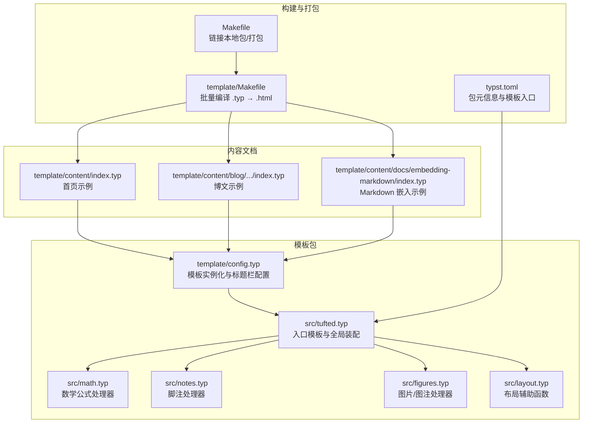
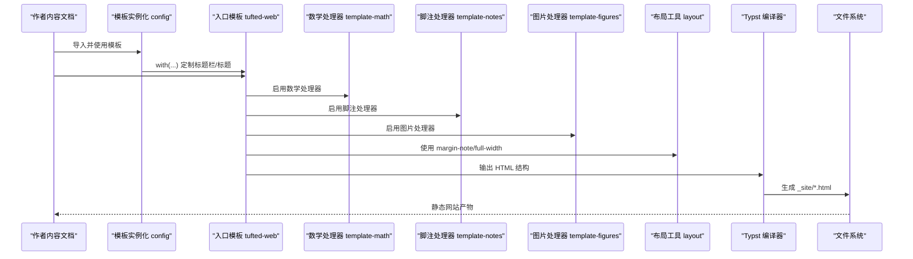
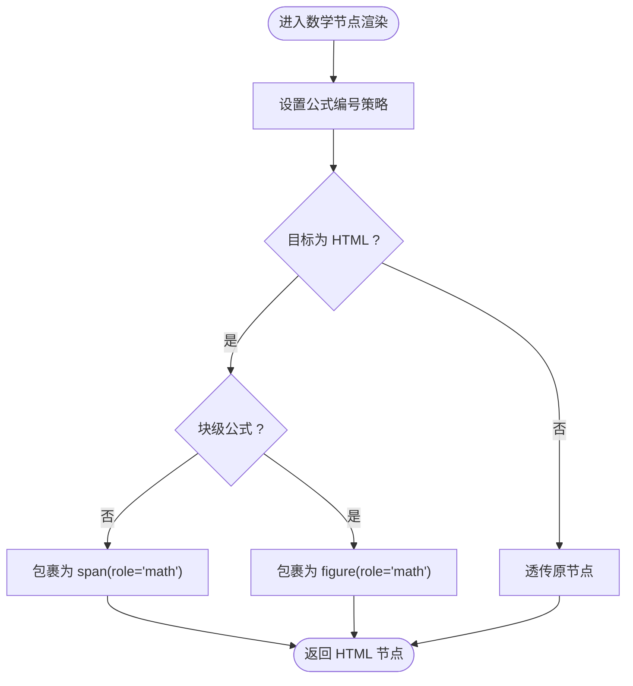
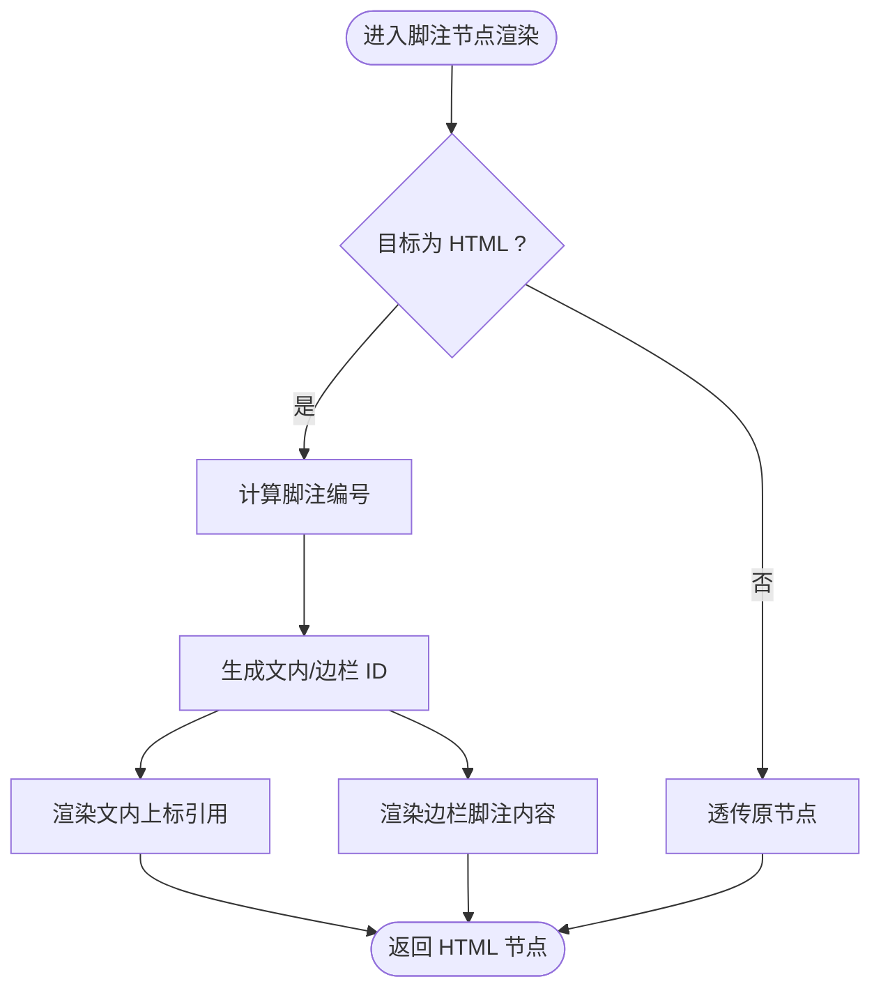
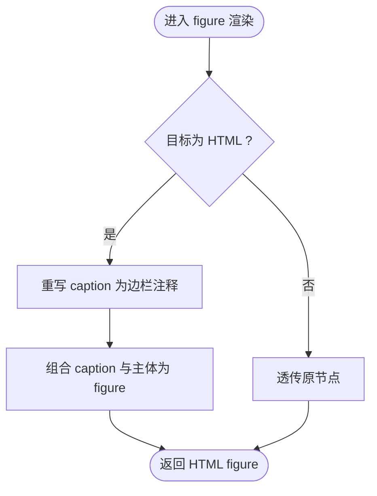
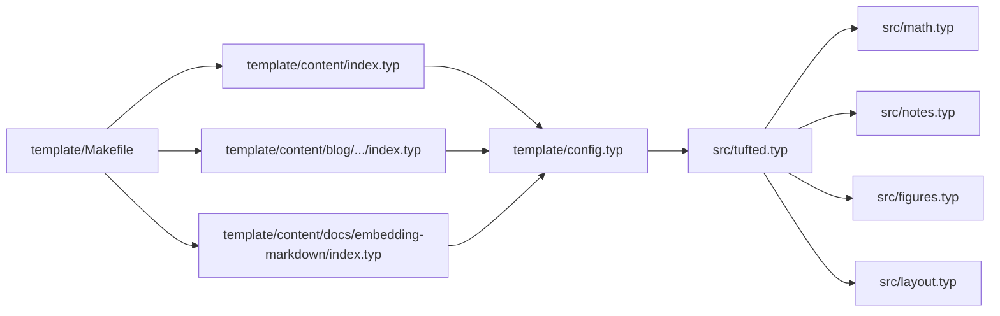

# 内容处理管道

<cite>
**本文引用的文件**
- [src/tufted.typ](file://src/tufted.typ)
- [src/math.typ](file://src/math.typ)
- [src/notes.typ](file://src/notes.typ)
- [src/figures.typ](file://src/figures.typ)
- [src/layout.typ](file://src/layout.typ)
- [template/config.typ](file://template/config.typ)
- [template/Makefile](file://template/Makefile)
- [Makefile](file://Makefile)
- [typst.toml](file://typst.toml)
- [template/content/index.typ](file://template/content/index.typ)
- [template/content/blog/2024-10-04-iterators-generators/index.typ](file://template/content/blog/2024-10-04-iterators-generators/index.typ)
- [template/content/docs/embedding-markdown/index.typ](file://template/content/docs/embedding-markdown/index.typ)
</cite>

## 目录
1. [引言](#引言)
2. [项目结构](#项目结构)
3. [核心组件](#核心组件)
4. [架构总览](#架构总览)
5. [详细组件分析](#详细组件分析)
6. [依赖关系分析](#依赖关系分析)
7. [性能考量](#性能考量)
8. [故障排查指南](#故障排查指南)
9. [结论](#结论)
10. [附录](#附录)

## 引言
本文件系统性解析 TwilightPage（基于 Typst 的静态站点生成器）的内容处理管道，重点说明从 Typst 源文件到最终 HTML 输出的完整流程；阐述数学、注释、图片与引用等处理器的职责与协作方式；解释管道的模块化设计与扩展机制，并给出新增处理器与自定义处理逻辑的实践指导。

## 项目结构
TwilightPage 采用“模板包 + 内容目录”的双层结构：
- 模板包（src/ 与 template/）：封装样式、布局与内容处理器，供内容文档通过导入使用。
- 内容文档（template/content/ 下的 .typ 文件）：编写页面内容，按需启用模板与处理器，最终由编译器输出 HTML。

图表来源
- [src/tufted.typ:1-64](file://src/tufted.typ#L1-L64)
- [src/math.typ:1-22](file://src/math.typ#L1-L22)
- [src/notes.typ:1-27](file://src/notes.typ#L1-L27)
- [src/figures.typ:1-20](file://src/figures.typ#L1-L20)
- [src/layout.typ:1-13](file://src/layout.typ#L1-L13)
- [template/config.typ:1-12](file://template/config.typ#L1-L12)
- [template/Makefile:1-27](file://template/Makefile#L1-L27)
- [Makefile:1-60](file://Makefile#L1-L60)
- [typst.toml:1-19](file://typst.toml#L1-L19)

章节来源
- [typst.toml:1-19](file://typst.toml#L1-L19)
- [Makefile:1-60](file://Makefile#L1-L60)
- [template/Makefile:1-27](file://template/Makefile#L1-L27)

## 核心组件
- 入口模板 tufted-web：负责装配并启用各处理器，设置语言与样式表，输出完整的 HTML 结构。
- 数学处理器 template-math：统一设置公式编号策略，并在目标为 HTML 时将行内/块级公式转换为带 role 的 HTML 结构。
- 脚注处理器 template-notes：在 HTML 目标下将脚注渲染为“文中上标引用 + 边栏脚注内容”的交互式结构。
- 图片/图注处理器 template-figures：重写 figure 与其 caption 的渲染，使其适配边栏显示与编号。
- 布局工具 margin-note/full-width：提供边栏注释与全宽元素的包装能力。
- 模板实例化 config：通过 with(...) 定制标题栏链接与默认标题，作为内容文档的统一入口。

章节来源
- [src/tufted.typ:17-63](file://src/tufted.typ#L17-L63)
- [src/math.typ:1-22](file://src/math.typ#L1-L22)
- [src/notes.typ:1-27](file://src/notes.typ#L1-L27)
- [src/figures.typ:1-20](file://src/figures.typ#L1-L20)
- [src/layout.typ:1-13](file://src/layout.typ#L1-L13)
- [template/config.typ:1-12](file://template/config.typ#L1-L12)

## 架构总览
内容处理管道遵循“模板装配 + 内容渲染 + 编译输出”的分层设计：
- 模板装配：入口模板导入并启用数学、脚注、图片、布局等处理器，统一设置语言与样式。
- 内容渲染：内容文档通过 #show: template 启用模板；在渲染过程中，各处理器根据目标格式（target()）决定是否进行转换。
- 编译输出：构建系统调用 typst compile 将 .typ 编译为 .html，同时复制静态资源。

图表来源
- [template/config.typ:1-12](file://template/config.typ#L1-L12)
- [src/tufted.typ:17-63](file://src/tufted.typ#L17-L63)
- [src/math.typ:1-22](file://src/math.typ#L1-L22)
- [src/notes.typ:1-27](file://src/notes.typ#L1-L27)
- [src/figures.typ:1-20](file://src/figures.typ#L1-L20)
- [src/layout.typ:1-13](file://src/layout.typ#L1-L13)
- [template/Makefile:14-16](file://template/Makefile#L14-L16)

## 详细组件分析

### 组件一：入口模板 tufted-web
- 职责
  - 装配并启用数学、脚注、图片处理器。
  - 设置文档语言与样式表列表。
  - 生成完整的 HTML 文档骨架（head/body/header/article/section）。
- 关键点
  - 通过 show: template-* 将处理器作用于内容树。
  - 在 HTML 目标下，处理器对节点进行条件转换；非 HTML 目标则透传原内容。
- 数据流
  - 输入：Typst AST（含数学、脚注、图片、正文等节点）
  - 处理：各处理器按节点类型与目标格式进行转换
  - 输出：HTML AST（最终由编译器转为 HTML）

章节来源
- [src/tufted.typ:17-63](file://src/tufted.typ#L17-L63)

### 组件二：数学处理器 template-math
- 职责
  - 统一设置数学公式编号策略。
  - 区分行内公式与块级公式，并在 HTML 目标下分别包裹为 span/figure，附加 role 属性以便样式控制。
- 协作方式
  - 由入口模板启用；在渲染数学节点时被调用。
- 扩展建议
  - 可增加对特定公式类别的识别与自定义包装。
  - 可引入 KaTeX/MathJax 等渲染管线（在目标为 HTML 时注入脚本与容器）。

图表来源
- [src/math.typ:1-22](file://src/math.typ#L1-L22)

章节来源
- [src/math.typ:1-22](file://src/math.typ#L1-L22)

### 组件三：脚注处理器 template-notes
- 职责
  - 在 HTML 目标下将脚注转换为“文中上标引用 + 边栏脚注内容”的结构。
  - 通过计数器生成稳定 ID，实现文内与边栏之间的交叉引用。
- 协作方式
  - 由入口模板启用；在渲染脚注节点时被调用。
- 扩展建议
  - 可支持脚注分类、标签或分组显示。
  - 可增强无障碍属性（如 aria-describedby）。

图表来源
- [src/notes.typ:1-27](file://src/notes.typ#L1-L27)

章节来源
- [src/notes.typ:1-27](file://src/notes.typ#L1-L27)

### 组件四：图片/图注处理器 template-figures
- 职责
  - 重写 figure.caption 的渲染，使其以边栏注释形式呈现。
  - 重写 figure 的渲染，将 caption 与主体组合为 HTML figure。
- 协作方式
  - 由入口模板启用；在渲染 figure 节点时被调用。
- 扩展建议
  - 支持带图注的图片在边栏中进一步嵌套 margin-note。
  - 可引入响应式图片与懒加载属性。

图表来源
- [src/figures.typ:1-20](file://src/figures.typ#L1-L20)

章节来源
- [src/figures.typ:1-20](file://src/figures.typ#L1-L20)

### 组件五：布局工具 margin-note 与 full-width
- 职责
  - 提供边栏注释与全宽内容的包装，便于在 HTML 中实现 Tufte 风格的排版。
- 协作方式
  - 由入口模板导入并在需要时直接调用。
- 扩展建议
  - 可增加更多布局变体（如侧栏宽度、对齐方式等）。

章节来源
- [src/layout.typ:1-13](file://src/layout.typ#L1-L13)

### 组件六：模板实例化与内容文档
- 模板实例化 config
  - 通过 with(...) 定制标题栏链接与默认标题，作为内容文档的统一入口。
- 内容文档示例
  - 首页示例展示了边栏注释与 Markdown 嵌入的基本用法。
  - 博文示例展示了脚注与图片的典型组合。
  - Markdown 嵌入示例演示了如何将外部 Markdown 内容渲染为 Typst AST 并继续参与处理管道。

章节来源
- [template/config.typ:1-12](file://template/config.typ#L1-L12)
- [template/content/index.typ:1-33](file://template/content/index.typ#L1-L33)
- [template/content/blog/2024-10-04-iterators-generators/index.typ:1-53](file://template/content/blog/2024-10-04-iterators-generators/index.typ#L1-L53)
- [template/content/docs/embedding-markdown/index.typ:1-42](file://template/content/docs/embedding-markdown/index.typ#L1-L42)

## 依赖关系分析
- 模块耦合
  - 入口模板 tufted-web 对各处理器存在显式依赖；通过导入与启用实现松耦合装配。
  - 处理器彼此独立，仅依赖 Typst 的渲染钩子与目标格式判断。
- 外部依赖
  - 构建系统依赖 Typst 编译器与 Makefile。
  - Markdown 嵌入示例依赖 cmarker 与 mitex 插件。
- 潜在循环依赖
  - 当前结构无循环导入；若新增跨文件处理器，需避免相互 import。

图表来源
- [src/tufted.typ:1-64](file://src/tufted.typ#L1-L64)
- [src/math.typ:1-22](file://src/math.typ#L1-L22)
- [src/notes.typ:1-27](file://src/notes.typ#L1-L27)
- [src/figures.typ:1-20](file://src/figures.typ#L1-L20)
- [src/layout.typ:1-13](file://src/layout.typ#L1-L13)
- [template/config.typ:1-12](file://template/config.typ#L1-L12)
- [template/Makefile:1-27](file://template/Makefile#L1-L27)

章节来源
- [src/tufted.typ:1-64](file://src/tufted.typ#L1-L64)
- [template/Makefile:1-27](file://template/Makefile#L1-L27)

## 性能考量
- 渲染路径优化
  - 处理器仅在 target() 为 HTML 时执行转换，避免非 HTML 目标下的不必要开销。
  - 将编号与 ID 生成集中在处理器内部，减少重复计算。
- 构建效率
  - 使用 Makefile 的模式规则批量编译，避免手动逐个处理文件。
  - 资源复制与清理流程明确，便于增量构建与缓存管理。
- 可扩展性
  - 新增处理器只需在入口模板中启用，无需修改现有处理器。
  - 通过 with(...) 定制模板参数，可实现不同页面的差异化处理。

## 故障排查指南
- 常见问题
  - 脚注未正确跳转：检查编号生成与 ID 命名是否一致，确认文内引用与边栏锚点匹配。
  - 图片未显示：确认图片路径与资源复制流程；确保在 HTML 目标下进行渲染。
  - 数学公式未渲染：检查数学处理器是否启用，以及目标格式是否为 HTML。
  - Markdown 嵌入报错：确认 cmarker 与 mitex 插件版本兼容，scope 与 math 参数传递正确。
- 排查步骤
  - 逐步禁用处理器定位问题来源。
  - 使用最小可复现示例验证单个处理器行为。
  - 查看构建日志中的编译错误与警告。

章节来源
- [src/notes.typ:1-27](file://src/notes.typ#L1-L27)
- [src/figures.typ:1-20](file://src/figures.typ#L1-L20)
- [src/math.typ:1-22](file://src/math.typ#L1-L22)
- [template/content/docs/embedding-markdown/index.typ:1-42](file://template/content/docs/embedding-markdown/index.typ#L1-L42)

## 结论
TwilightPage 的内容处理管道以模块化为核心设计思想：入口模板负责装配与协调，各处理器专注单一领域（数学、脚注、图片），并通过目标格式判断实现条件渲染。该设计既保证了灵活性与可维护性，又为后续扩展提供了清晰的接口与路径。开发者可在不破坏既有处理器的前提下，安全地添加新处理器或定制处理逻辑。

## 附录

### 从 Typst 源到 HTML 的完整流程（示例）
- 步骤
  - 内容文档导入模板并启用 #show: template。
  - 入口模板启用数学/脚注/图片处理器，并设置语言与样式。
  - 编译器读取内容树，按节点类型调用对应处理器。
  - 处理器在 HTML 目标下生成相应 HTML 结构。
  - 构建系统将 HTML 与静态资源输出至 _site/。
- 示例参考
  - [template/content/index.typ:1-33](file://template/content/index.typ#L1-L33)
  - [template/content/blog/2024-10-04-iterators-generators/index.typ:1-53](file://template/content/blog/2024-10-04-iterators-generators/index.typ#L1-L53)
  - [template/Makefile:14-16](file://template/Makefile#L14-L16)

章节来源
- [template/content/index.typ:1-33](file://template/content/index.typ#L1-L33)
- [template/content/blog/2024-10-04-iterators-generators/index.typ:1-53](file://template/content/blog/2024-10-04-iterators-generators/index.typ#L1-L53)
- [template/Makefile:14-16](file://template/Makefile#L14-L16)

### 如何添加新的内容处理器
- 设计原则
  - 保持处理器独立，仅依赖渲染钩子与目标格式判断。
  - 在入口模板中导入并启用新处理器，避免侵入既有逻辑。
- 实施步骤
  - 在 src/ 下创建新处理器文件（如 src/my-handler.typ），导出一个以 template- 开头的函数，接收 content 参数并返回 content。
  - 在入口模板中导入并启用该处理器。
  - 在内容文档中通过 #show: template 启用模板，使新处理器参与渲染。
- 参考示例
  - [src/math.typ:1-22](file://src/math.typ#L1-L22)
  - [src/notes.typ:1-27](file://src/notes.typ#L1-L27)
  - [src/figures.typ:1-20](file://src/figures.typ#L1-L20)
  - [src/tufted.typ:17-32](file://src/tufted.typ#L17-L32)

章节来源
- [src/math.typ:1-22](file://src/math.typ#L1-L22)
- [src/notes.typ:1-27](file://src/notes.typ#L1-L27)
- [src/figures.typ:1-20](file://src/figures.typ#L1-L20)
- [src/tufted.typ:17-32](file://src/tufted.typ#L17-L32)

### 自定义处理逻辑的最佳实践
- 条件渲染
  - 使用 target() 判断目标格式，仅在 HTML 目标下执行 DOM 转换。
- 编号与引用
  - 使用计数器生成稳定编号与 ID，确保文内引用与边栏锚点一一对应。
- 可访问性
  - 为关键元素添加语义属性（如 role、aria-*），提升可访问性。
- 性能
  - 避免在处理器中进行昂贵的全局扫描；尽量局部化计算与缓存。

章节来源
- [src/math.typ:1-22](file://src/math.typ#L1-L22)
- [src/notes.typ:1-27](file://src/notes.typ#L1-L27)
- [src/figures.typ:1-20](file://src/figures.typ#L1-L20)