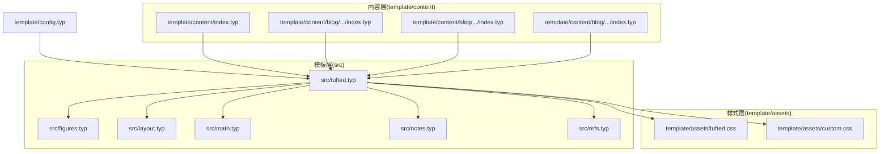
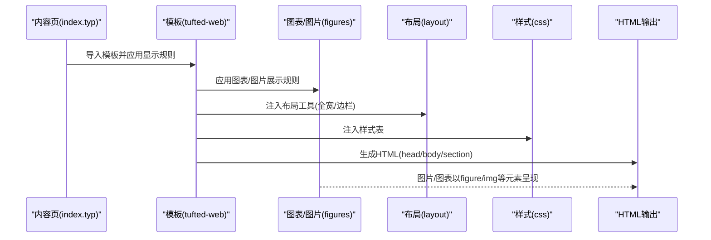
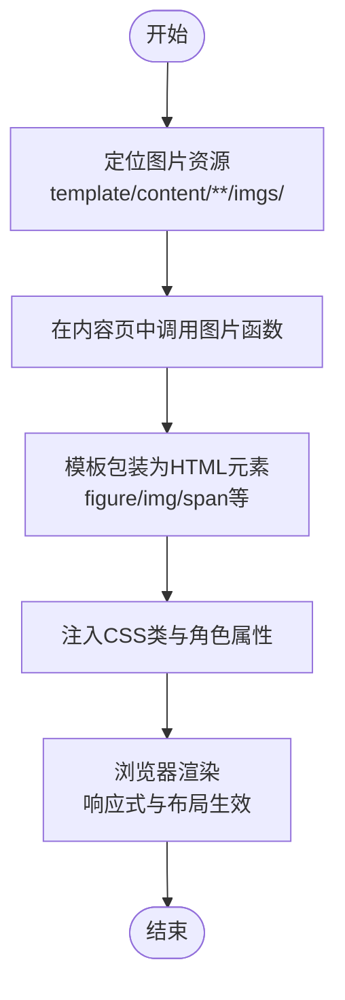
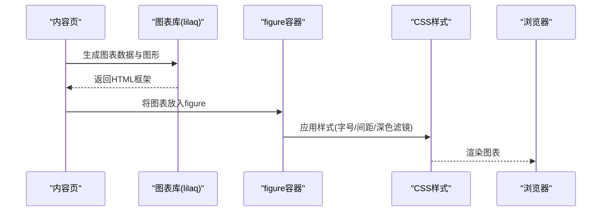
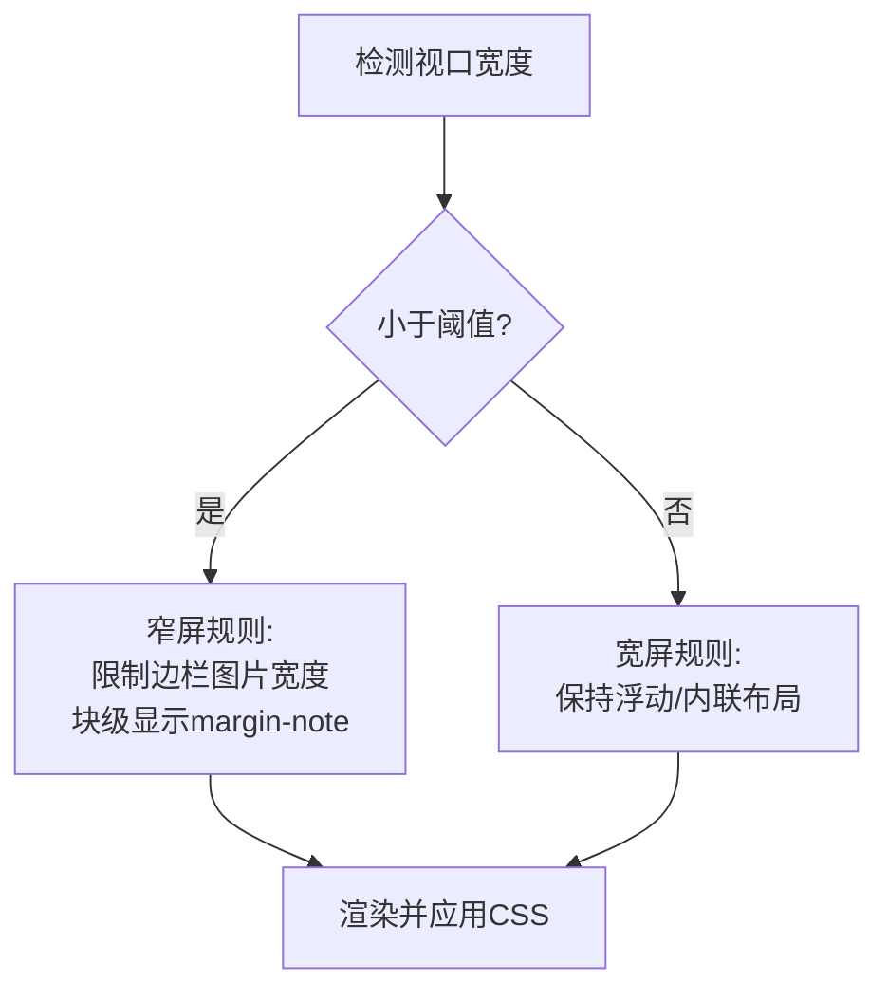
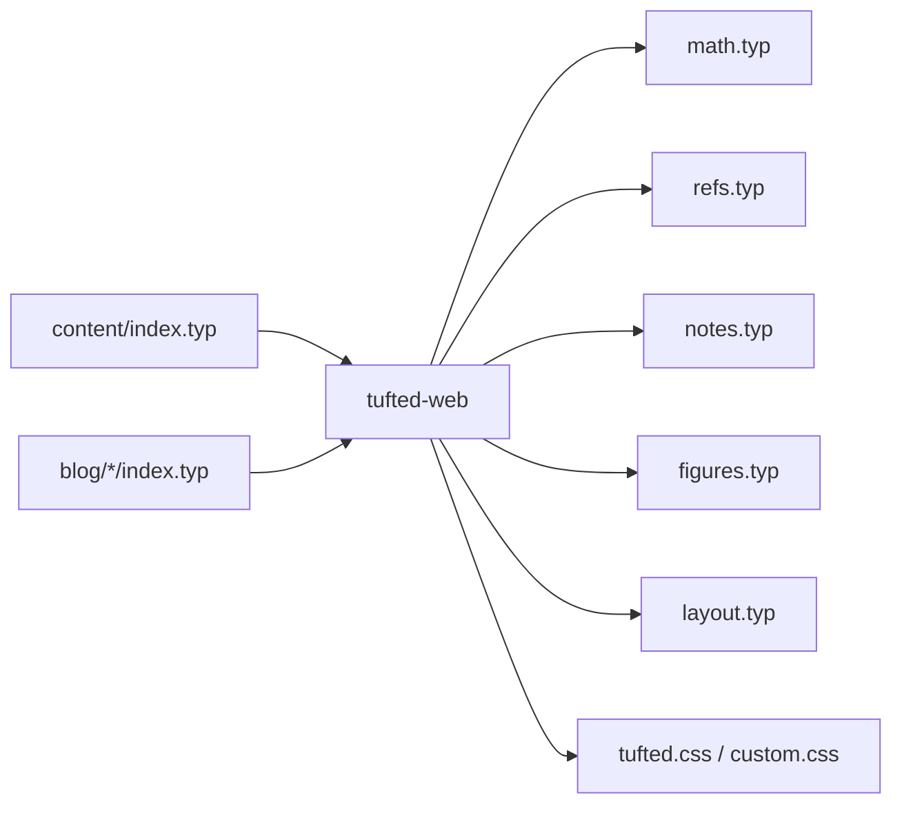

# 图片和图表处理

<cite>
**本文引用的文件**
- [src/tufted.typ](file://src/tufted.typ)
- [src/figures.typ](file://src/figures.typ)
- [src/layout.typ](file://src/layout.typ)
- [src/math.typ](file://src/math.typ)
- [src/notes.typ](file://src/notes.typ)
- [src/refs.typ](file://src/refs.typ)
- [template/assets/tufted.css](file://template/assets/tufted.css)
- [template/assets/custom.css](file://template/assets/custom.css)
- [template/config.typ](file://template/config.typ)
- [template/content/index.typ](file://template/content/index.typ)
- [template/content/blog/2024-10-04-iterators-generators/index.typ](file://template/content/blog/2024-10-04-iterators-generators/index.typ)
- [template/content/blog/2025-04-16-monkeys-apes/index.typ](file://template/content/blog/2025-04-16-monkeys-apes/index.typ)
- [template/content/blog/2025-10-30-normal-distribution/index.typ](file://template/content/blog/2025-10-30-normal-distribution/index.typ)
- [template/content/docs/03-styling/index.typ](file://template/content/docs/03-styling/index.typ)
</cite>

## 目录
1. [简介](#简介)
2. [项目结构](#项目结构)
3. [核心组件](#核心组件)
4. [架构总览](#架构总览)
5. [详细组件分析](#详细组件分析)
6. [依赖分析](#依赖分析)
7. [性能考虑](#性能考虑)
8. [故障排查指南](#故障排查指南)
9. [结论](#结论)
10. [附录](#附录)

## 简介
本文件聚焦于 TwilightPage（基于 Typst 的静态站点）中的“图片与图表处理”体系，围绕以下目标展开：
- 解析图片上传、存储与渲染的完整流程
- 阐述图表的自动布局与样式处理机制
- 说明响应式图片的实现原理与尺寸适配策略
- 提供可操作的示例与最佳实践
- 说明如何扩展图片处理逻辑与新增图片类型支持
- 给出图片优化与性能提升的指导建议

## 项目结构
TwilightPage 将页面模板、样式与内容分层组织，图片与图表处理主要分布在如下位置：
- 模板与展示层：src/*.typ（模板函数与展示规则）
- 样式层：template/assets/*.css（默认与自定义样式）
- 内容层：template/content/**/index.typ（页面内容与图片使用示例）
- 配置层：template/config.typ（模板入口与样式注入）

**图示来源**
- [src/tufted.typ:17-63](file://src/tufted.typ#L17-L63)
- [src/figures.typ:1-19](file://src/figures.typ#L1-L19)
- [src/layout.typ:1-13](file://src/layout.typ#L1-L13)
- [src/math.typ:1-22](file://src/math.typ#L1-L22)
- [src/notes.typ:1-27](file://src/notes.typ#L1-L27)
- [src/refs.typ:1-23](file://src/refs.typ#L1-L23)
- [template/assets/tufted.css:1-166](file://template/assets/tufted.css#L1-L166)
- [template/assets/custom.css:1](file://template/assets/custom.css#L1-L1)
- [template/config.typ:1-12](file://template/config.typ#L1-L12)
- [template/content/index.typ:1-33](file://template/content/index.typ#L1-L33)
- [template/content/blog/2024-10-04-iterators-generators/index.typ:1-53](file://template/content/blog/2024-10-04-iterators-generators/index.typ#L1-L53)
- [template/content/blog/2025-04-16-monkeys-apes/index.typ:1-29](file://template/content/blog/2025-04-16-monkeys-apes/index.typ#L1-L29)
- [template/content/blog/2025-10-30-normal-distribution/index.typ:1-56](file://template/content/blog/2025-10-30-normal-distribution/index.typ#L1-L56)

**章节来源**
- [src/tufted.typ:17-63](file://src/tufted.typ#L17-L63)
- [template/config.typ:1-12](file://template/config.typ#L1-L12)

## 核心组件
- 模板入口与 HTML 输出：通过模板函数生成 HTML 结构，并注入样式表与元信息。
- 图片与图表展示：通过模板函数重写 figure 与相关元素的 HTML 包装；配合 CSS 实现响应式与布局。
- 布局辅助：提供 margin-note 与 full-width 等布局工具，便于图文混排。
- 数学与脚注：为公式与脚注提供 HTML 角色与容器，间接影响图片在页面中的定位与样式。

**章节来源**
- [src/tufted.typ:7-63](file://src/tufted.typ#L7-L63)
- [src/figures.typ:3-19](file://src/figures.typ#L3-L19)
- [src/layout.typ:3-12](file://src/layout.typ#L3-L12)
- [src/math.typ:1-22](file://src/math.typ#L1-L22)
- [src/notes.typ:1-27](file://src/notes.typ#L1-L27)

## 架构总览
下图展示了从内容到最终 HTML 渲染的关键路径，以及图片与图表在其中的位置：

**图示来源**
- [src/tufted.typ:17-63](file://src/tufted.typ#L17-L63)
- [src/figures.typ:3-19](file://src/figures.typ#L3-L19)
- [src/layout.typ:3-12](file://src/layout.typ#L3-L12)
- [template/assets/tufted.css:16-55](file://template/assets/tufted.css#L16-L55)

## 详细组件分析

### 图片上传、存储与渲染流程
- 上传与存储
  - 项目未内置上传服务，图片通常放置于 template/content/**/imgs/ 或同级目录，由内容页直接引用。
  - 示例：多篇博客文章直接引用本地图片资源，如 webp 格式文件。
- 渲染与展示
  - 在内容页中使用图片函数生成 HTML 元素；模板将图片包裹为 figure 并注入 CSS 类，实现统一的布局与样式。
  - 边栏图片通过布局工具插入到侧边栏区域，实现图文混排。
- 路径与格式
  - 内容页中对图片路径进行拼接与格式选择，确保在不同页面层级下正确加载。
  - 支持现代格式（如 webp），以提升加载性能与画质。

**图示来源**
- [template/content/index.typ:7-14](file://template/content/index.typ#L7-L14)
- [template/content/blog/2024-10-04-iterators-generators/index.typ:46](file://template/content/blog/2024-10-04-iterators-generators/index.typ#L46)
- [template/content/blog/2025-04-16-monkeys-apes/index.typ:8-10](file://template/content/blog/2025-04-16-monkeys-apes/index.typ#L8-L10)
- [src/figures.typ:10-16](file://src/figures.typ#L10-L16)

**章节来源**
- [template/content/index.typ:7-14](file://template/content/index.typ#L7-L14)
- [template/content/blog/2024-10-04-iterators-generators/index.typ:46](file://template/content/blog/2024-10-04-iterators-generators/index.typ#L46)
- [template/content/blog/2025-04-16-monkeys-apes/index.typ:8-10](file://template/content/blog/2025-04-16-monkeys-apes/index.typ#L8-L10)
- [src/figures.typ:10-16](file://src/figures.typ#L10-L16)

### 图表的自动布局与样式处理机制
- 自动布局
  - 图表由外部库生成（如示例中使用了 lilaq 的 diagram），其结果被封装为 HTML 容器后注入页面。
  - 图表作为 figure 的内容出现，继承与图片一致的布局与样式规则。
- 样式处理
  - 图表在深色模式下具备反色滤镜，以提升对比度与可读性。
  - 图表容器具有字号与间距控制，保证在不同屏幕下的阅读体验。

**图示来源**
- [template/content/blog/2025-10-30-normal-distribution/index.typ:21-36](file://template/content/blog/2025-10-30-normal-distribution/index.typ#L21-L36)
- [template/assets/tufted.css:126-137](file://template/assets/tufted.css#L126-L137)

**章节来源**
- [template/content/blog/2025-10-30-normal-distribution/index.typ:21-36](file://template/content/blog/2025-10-30-normal-distribution/index.typ#L21-L36)
- [template/assets/tufted.css:126-137](file://template/assets/tufted.css#L126-L137)

### 响应式图片的实现原理与尺寸适配策略
- 实现原理
  - 使用 CSS 控制图片最大高度与宽度，避免超长图片撑破容器。
  - 在窄屏设备上，边栏图片限制最大宽度，并居中显示，保证可读性与视觉平衡。
- 尺寸适配策略
  - 通过媒体查询在小屏设备上调整 margin-note 的显示方式，使其以块级形式呈现，图片随之自适应。
  - 为 SVG 与图片设置统一的最大高度，确保在不同设备上的比例协调。

**图示来源**
- [template/assets/tufted.css:30-55](file://template/assets/tufted.css#L30-L55)
- [template/assets/tufted.css:20-23](file://template/assets/tufted.css#L20-L23)

**章节来源**
- [template/assets/tufted.css:30-55](file://template/assets/tufted.css#L30-L55)
- [template/assets/tufted.css:20-23](file://template/assets/tufted.css#L20-L23)

### 图片处理示例与最佳实践
- 示例
  - 在首页与博客页中，使用图片函数插入本地图片资源，并将其置于边栏或正文段落中。
  - 在文档页中，通过 Markdown 渲染器自定义图片处理逻辑，将 Markdown 中的图片映射为模板中的图片函数。
- 最佳实践
  - 统一使用现代图片格式（如 webp），以获得更优的体积与质量。
  - 将图片资源集中存放于统一目录，便于维护与路径管理。
  - 对边栏图片设置最大宽度与居中显示，确保在窄屏下的可读性。
  - 为图片与图表设置统一的最大高度，避免溢出与布局破坏。

**章节来源**
- [template/content/index.typ:7-14](file://template/content/index.typ#L7-L14)
- [template/content/blog/2024-10-04-iterators-generators/index.typ:46](file://template/content/blog/2024-10-04-iterators-generators/index.typ#L46)
- [template/content/blog/2025-04-16-monkeys-apes/index.typ:8-10](file://template/content/blog/2025-04-16-monkeys-apes/index.typ#L8-L10)
- [template/content/index.typ:22-31](file://template/content/index.typ#L22-L31)

### 自定义图片处理逻辑与新增图片类型支持
- 自定义图片处理
  - 可在内容页中通过渲染器作用域自定义图片处理函数，将 Markdown 中的图片转换为模板中的图片函数调用。
  - 该机制允许对图片路径进行统一前缀拼接、格式选择与参数传递。
- 新增图片类型支持
  - 若需引入新类型的可视化（如交互式图表、动态 GIF），可在内容页中生成对应 HTML 容器，并将其作为 figure 的内容插入。
  - 通过 CSS 与模板的组合，确保新类型与现有图片/图表风格一致。

**章节来源**
- [template/content/index.typ:22-31](file://template/content/index.typ#L22-L31)
- [src/figures.typ:10-16](file://src/figures.typ#L10-L16)

## 依赖分析
- 模板依赖
  - 模板入口依赖多个子模板：数学、参考文献、脚注、图表/图片、布局。
  - 子模板通过 show 规则重写元素的 HTML 表达，形成统一的展示风格。
- 样式依赖
  - 默认样式表与自定义样式表按顺序注入，自定义样式优先覆盖默认规则。
- 内容依赖
  - 内容页导入模板并应用显示规则，同时可自定义图片处理逻辑。

**图示来源**
- [src/tufted.typ:1-6](file://src/tufted.typ#L1-L6)
- [src/math.typ:1-22](file://src/math.typ#L1-L22)
- [src/refs.typ:1-23](file://src/refs.typ#L1-L23)
- [src/notes.typ:1-27](file://src/notes.typ#L1-L27)
- [src/figures.typ:1-19](file://src/figures.typ#L1-L19)
- [src/layout.typ:1-13](file://src/layout.typ#L1-L13)
- [template/assets/tufted.css:1-166](file://template/assets/tufted.css#L1-L166)
- [template/content/index.typ:1-33](file://template/content/index.typ#L1-L33)
- [template/content/blog/2024-10-04-iterators-generators/index.typ:1-53](file://template/content/blog/2024-10-04-iterators-generators/index.typ#L1-L53)

**章节来源**
- [src/tufted.typ:1-6](file://src/tufted.typ#L1-L6)
- [template/assets/tufted.css:1-166](file://template/assets/tufted.css#L1-L166)

## 性能考虑
- 图片格式与体积
  - 优先采用现代压缩格式（如 webp），在保证画质的前提下减小体积。
- 响应式与懒加载
  - 利用 CSS 控制图片最大尺寸，避免大图导致的布局抖动与长时间渲染。
  - 可结合浏览器原生懒加载属性进一步优化首屏性能（需在模板生成的 HTML 上增加相应属性）。
- 样式与渲染
  - 合理使用媒体查询与最小化样式规则，减少重绘与回流。
  - 对深色模式下的图表使用滤镜时，注意对性能的影响，必要时进行缓存或预计算。

## 故障排查指南
- 图片不显示
  - 检查图片路径是否正确，尤其是跨层级引用时的相对路径。
  - 确认图片格式受支持（如 webp），并在目标浏览器中验证。
- 布局异常
  - 检查是否正确使用了布局工具（如 margin-note/full-width）。
  - 确认 CSS 是否被正确加载且未被自定义样式覆盖。
- 响应式问题
  - 在窄屏设备上确认媒体查询是否生效，边栏图片是否按预期缩放与换行。

**章节来源**
- [template/content/index.typ:7-14](file://template/content/index.typ#L7-L14)
- [template/assets/tufted.css:30-55](file://template/assets/tufted.css#L30-L55)

## 结论
TwilightPage 的图片与图表处理体系以模板为核心，通过子模板与 CSS 协作，实现了从图片渲染到响应式布局的一体化方案。借助内容页的自定义渲染器，可以灵活地将 Markdown 中的图片映射到模板函数，从而统一风格与行为。对于图表，系统通过外部库生成 HTML 容器并纳入 figure，配合样式规则实现良好的可读性与一致性。在性能方面，建议优先采用现代图片格式与合理的尺寸控制，并结合懒加载与媒体查询优化用户体验。

## 附录
- 样式定制入口
  - 默认样式表与自定义样式表均可在文档样式页中查看与修改。
- 模板配置入口
  - 通过配置文件设置标题、导航与样式表列表，便于全局定制。

**章节来源**
- [template/content/docs/03-styling/index.typ:8-44](file://template/content/docs/03-styling/index.typ#L8-L44)
- [template/config.typ:1-12](file://template/config.typ#L1-L12)