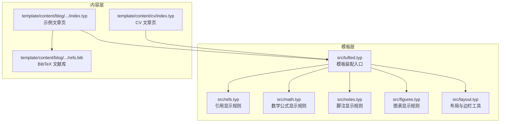
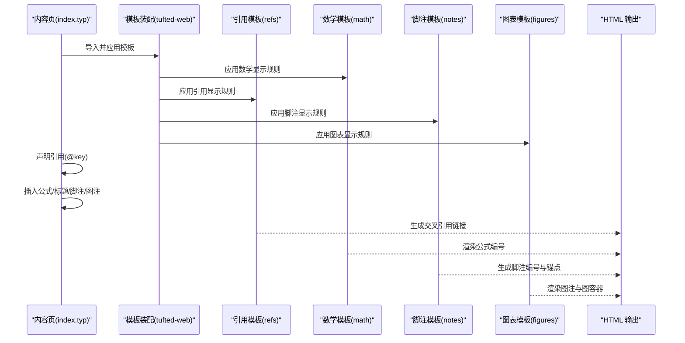
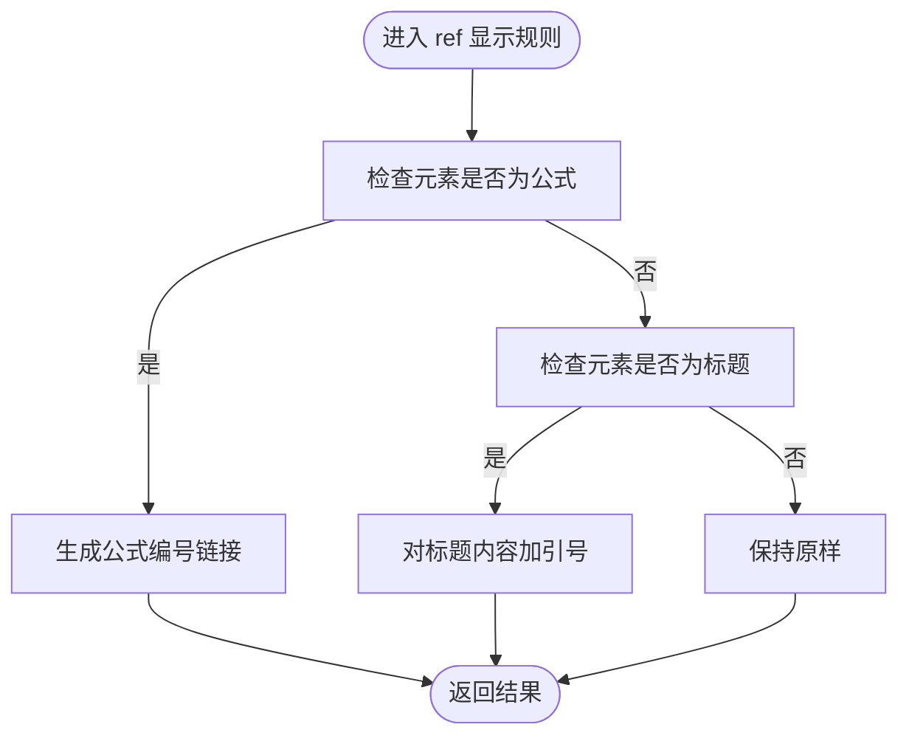
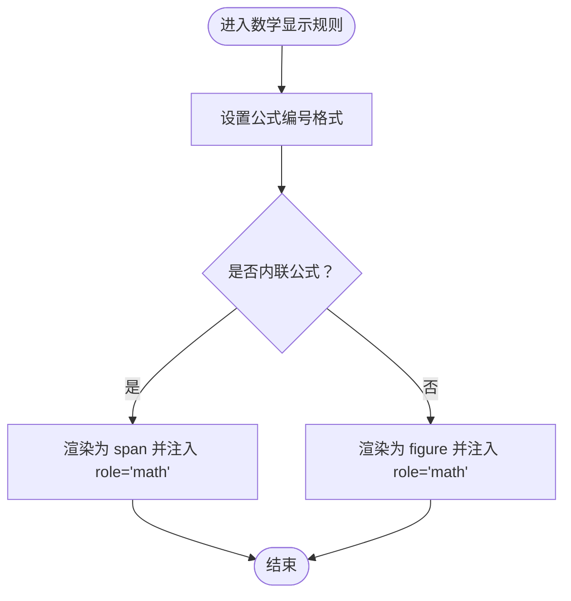
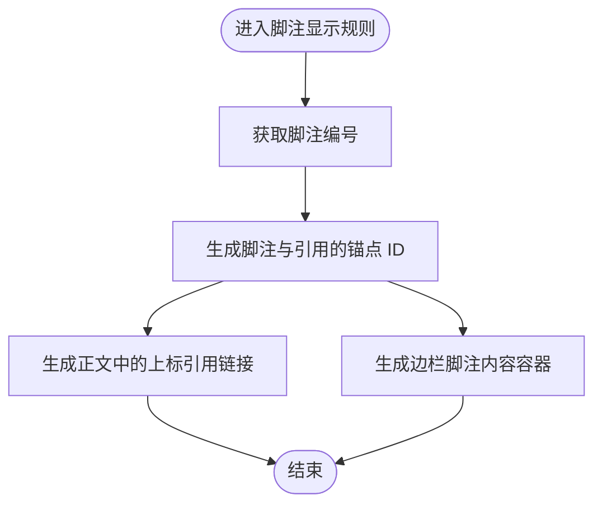
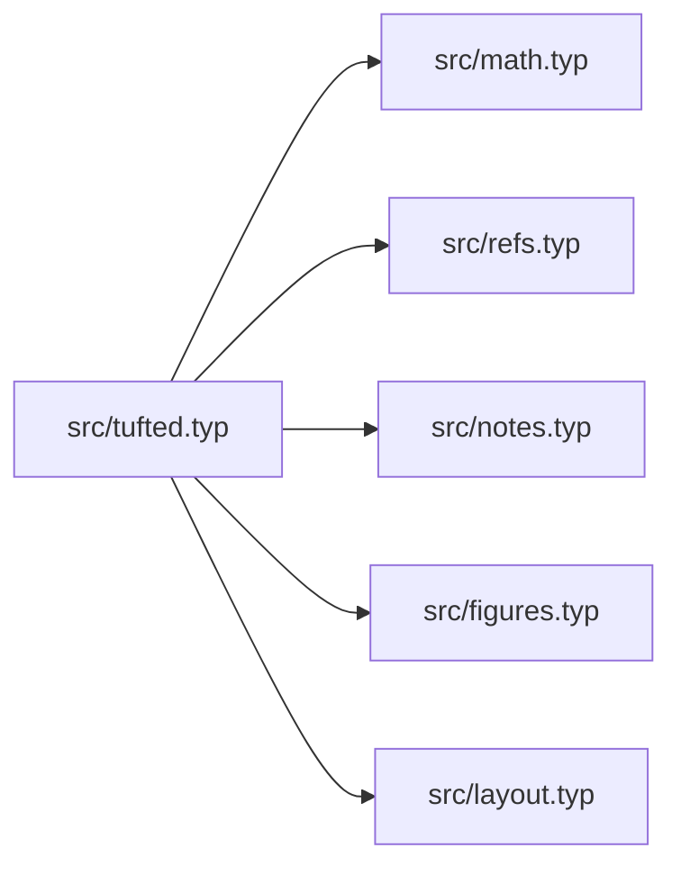

# 引用和交叉引用处理

<cite>
**本文引用的文件**
- [src/tufted.typ](file://src/tufted.typ)
- [src/refs.typ](file://src/refs.typ)
- [src/math.typ](file://src/math.typ)
- [src/notes.typ](file://src/notes.typ)
- [src/figures.typ](file://src/figures.typ)
- [src/layout.typ](file://src/layout.typ)
- [template/content/blog/2025-10-30-normal-distribution/index.typ](file://template/content/blog/2025-10-30-normal-distribution/index.typ)
- [template/content/blog/2025-10-30-normal-distribution/refs.bib](file://template/content/blog/2025-10-30-normal-distribution/refs.bib)
- [template/content/cv/index.typ](file://template/content/cv/index.typ)
- [template/content/docs/02-configuration/index.typ](file://template/content/docs/02-configuration/index.typ)
- [template/content/docs/03-styling/index.typ](file://template/content/docs/03-styling/index.typ)
- [template/assets/tufted.css](file://template/assets/tufted.css)
</cite>

## 目录
1. [简介](#简介)
2. [项目结构](#项目结构)
3. [核心组件](#核心组件)
4. [架构总览](#架构总览)
5. [详细组件分析](#详细组件分析)
6. [依赖关系分析](#依赖关系分析)
7. [性能考量](#性能考量)
8. [故障排查指南](#故障排查指南)
9. [结论](#结论)
10. [附录](#附录)

## 简介
本文件系统性解析 TwilightPage 的“引用与交叉引用”处理机制，重点覆盖以下方面：
- 文献引用的收集、排序与格式化流程
- 交叉引用（如公式、标题）的识别、链接与更新机制
- 引用编号的自动生成与管理逻辑
- 使用示例与配置方法
- 扩展新引用类型与自定义引用格式的实践路径
- 最佳实践与常见问题排查

## 项目结构
TwilightPage 将“模板装配”与“内容组织”分离：模板层通过模块化样式与显示规则（如数学公式、脚注、图表、引用）组合成可复用的网站模板；内容层以 Typst 页面为单位，按目录层级组织，自动映射为站点页面。

**图示来源**
- [src/tufted.typ:17-63](file://src/tufted.typ#L17-L63)
- [src/refs.typ:1-23](file://src/refs.typ#L1-L23)
- [src/math.typ:1-22](file://src/math.typ#L1-L22)
- [src/notes.typ:1-27](file://src/notes.typ#L1-L27)
- [src/figures.typ:1-19](file://src/figures.typ#L1-L19)
- [src/layout.typ:1-13](file://src/layout.typ#L1-L13)
- [template/content/blog/2025-10-30-normal-distribution/index.typ:1-56](file://template/content/blog/2025-10-30-normal-distribution/index.typ#L1-L56)
- [template/content/blog/2025-10-30-normal-distribution/refs.bib:1-34](file://template/content/blog/2025-10-30-normal-distribution/refs.bib#L1-L34)
- [template/content/cv/index.typ:33-58](file://template/content/cv/index.typ#L33-L58)

**章节来源**
- [src/tufted.typ:17-63](file://src/tufted.typ#L17-L63)
- [template/content/docs/02-configuration/index.typ:1-53](file://template/content/docs/02-configuration/index.typ#L1-L53)

## 核心组件
- 模板装配器：在模板入口中导入并应用各子模板（数学、引用、脚注、图表），统一注入到 HTML 结构中。
- 数学公式模板：定义公式编号格式与内联/块级渲染行为。
- 引用模板：重定义 ref 显示规则，支持公式与标题等元素的交叉引用。
- 脚注模板：生成脚注编号、上标引用与边栏脚注内容。
- 图表模板：将图注渲染为边栏样式，并包裹 figure 容器。
- 布局工具：提供边栏注记与全宽容器等辅助能力。

这些组件协同工作，形成从“内容引用声明”到“HTML 输出”的完整链路。

**章节来源**
- [src/tufted.typ:17-63](file://src/tufted.typ#L17-L63)
- [src/math.typ:1-22](file://src/math.typ#L1-L22)
- [src/refs.typ:1-23](file://src/refs.typ#L1-L23)
- [src/notes.typ:1-27](file://src/notes.typ#L1-L27)
- [src/figures.typ:1-19](file://src/figures.typ#L1-L19)
- [src/layout.typ:1-13](file://src/layout.typ#L1-L13)

## 架构总览
下图展示“引用与交叉引用”在模板中的装配与执行顺序，以及与内容页的关系。

**图示来源**
- [src/tufted.typ:28-33](file://src/tufted.typ#L28-L33)
- [src/refs.typ:2-19](file://src/refs.typ#L2-L19)
- [src/math.typ:2-21](file://src/math.typ#L2-L21)
- [src/notes.typ:2-24](file://src/notes.typ#L2-L24)
- [src/figures.typ:3-19](file://src/figures.typ#L3-L19)
- [template/content/blog/2025-10-30-normal-distribution/index.typ:8-56](file://template/content/blog/2025-10-30-normal-distribution/index.typ#L8-L56)

## 详细组件分析

### 组件一：引用模板（template-refs）
职责与机制
- 重定义 ref 显示规则，对不同元素类型进行差异化处理：
  - 公式引用：根据公式位置与计数器生成带编号的链接。
  - 标题引用：对标题内容进行引号包装，便于阅读。
  - 默认回退：未匹配时保持原样输出。

关键实现要点
- 通过元素函数类型判断（如公式、标题）决定渲染策略。
- 利用计数器与定位信息生成可点击的内部链接。
- 与数学模板配合，确保公式编号与引用一致。

**图示来源**
- [src/refs.typ:2-19](file://src/refs.typ#L2-L19)

**章节来源**
- [src/refs.typ:1-23](file://src/refs.typ#L1-L23)

### 组件二：数学模板（template-math）
职责与机制
- 设置公式编号格式（例如带括号的序号）。
- 区分内联与块级公式，分别渲染为 span 或 figure 容器。
- 在 HTML 目标下注入 role 属性，便于样式与可访问性控制。

**图示来源**
- [src/math.typ:2-21](file://src/math.typ#L2-L21)

**章节来源**
- [src/math.typ:1-22](file://src/math.typ#L1-L22)

### 组件三：脚注模板（template-notes）
职责与机制
- 为每个脚注生成唯一编号与锚点 ID。
- 在正文生成上标形式的脚注引用，指向对应脚注内容。
- 脚注内容放置于边栏容器中，支持双向跳转。

**图示来源**
- [src/notes.typ:2-24](file://src/notes.typ#L2-L24)

**章节来源**
- [src/notes.typ:1-27](file://src/notes.typ#L1-L27)

### 组件四：图表模板（template-figures）
职责与机制
- 将图注渲染为边栏注记样式，增强版面的可读性。
- 对图表本身包裹 figure 容器，便于样式控制与响应式适配。

**章节来源**
- [src/figures.typ:1-19](file://src/figures.typ#L1-L19)

### 组件五：布局工具（layout）
职责与机制
- 提供边栏注记与全宽容器的封装，用于内容排版与视觉层次。

**章节来源**
- [src/layout.typ:1-13](file://src/layout.typ#L1-L13)

## 依赖关系分析
模板装配器将多个子模板按顺序应用，形成最终的 HTML 输出。下图展示模块间的依赖与装配顺序。

**图示来源**
- [src/tufted.typ:1-6](file://src/tufted.typ#L1-L6)

**章节来源**
- [src/tufted.typ:1-6](file://src/tufted.typ#L1-L6)

## 性能考量
- 计数器与定位计算：公式编号与交叉引用依赖计数器与元素定位，建议避免在同一页面中过度密集地插入大量浮动元素，以减少渲染复杂度。
- 脚注数量控制：脚注过多会增加 DOM 锚点与边栏内容的体积，影响加载与滚动性能。
- 样式与可访问性：为数学公式注入 role 属性有助于屏幕阅读器识别，但需注意样式层叠与选择器性能。

[本节为通用指导，不直接分析具体文件]

## 故障排查指南
- 公式引用未正确编号
  - 检查数学模板是否已应用，确认公式编号格式设置。
  - 确认引用目标元素确实存在且可被定位。
  - 参考：[src/math.typ:2-21](file://src/math.typ#L2-L21)，[src/refs.typ:8-14](file://src/refs.typ#L8-L14)
- 交叉引用无法跳转
  - 确认目标元素具备可定位位置（如公式、标题）。
  - 检查生成的锚点 ID 是否与引用链接一致。
  - 参考：[src/refs.typ:10-13](file://src/refs.typ#L10-L13)
- 脚注编号错乱或重复
  - 检查脚注计数器的显示方式与全局顺序。
  - 确认脚注引用与内容的 ID 生成逻辑一致。
  - 参考：[src/notes.typ:4-21](file://src/notes.typ#L4-L21)
- 图注样式异常
  - 检查图注渲染为边栏注记的样式是否被覆盖。
  - 参考：[src/figures.typ:5-8](file://src/figures.typ#L5-L8)，[template/assets/tufted.css:30-55](file://template/assets/tufted.css#L30-L55)

**章节来源**
- [src/refs.typ:8-19](file://src/refs.typ#L8-L19)
- [src/math.typ:2-21](file://src/math.typ#L2-L21)
- [src/notes.typ:2-24](file://src/notes.typ#L2-L24)
- [src/figures.typ:5-8](file://src/figures.typ#L5-L8)
- [template/assets/tufted.css:30-55](file://template/assets/tufted.css#L30-L55)

## 结论
TwilightPage 的引用与交叉引用系统通过“模板装配 + 子模板分工”的方式，实现了公式、标题、脚注与图表的统一处理。其核心在于：
- 在模板入口集中装配显示规则
- 在引用模板中对不同元素类型进行差异化渲染
- 通过计数器与定位信息生成稳定的内部链接
- 在内容页中以简洁语法声明引用与文献库

该设计既保证了可扩展性，又维持了良好的可维护性与可读性。

[本节为总结，不直接分析具体文件]

## 附录

### 使用示例与配置方法
- 在内容页中声明引用与文献库
  - 示例：在文章页中使用引用标记并在末尾声明文献库。
  - 参考：[template/content/blog/2025-10-30-normal-distribution/index.typ:8](file://template/content/blog/2025-10-30-normal-distribution/index.typ#L8)，[template/content/blog/2025-10-30-normal-distribution/index.typ:55](file://template/content/blog/2025-10-30-normal-distribution/index.typ#L55)
- BibTeX 文献库
  - 示例：使用 BibTeX 条目组织参考文献。
  - 参考：[template/content/blog/2025-10-30-normal-distribution/refs.bib:1-34](file://template/content/blog/2025-10-30-normal-distribution/refs.bib#L1-L34)
- CV 页面中的文献列表
  - 示例：加载并遍历文献库条目，按字段渲染。
  - 参考：[template/content/cv/index.typ:37-52](file://template/content/cv/index.typ#L37-L52)
- 模板配置与样式
  - 参考：[template/content/docs/02-configuration/index.typ:24-39](file://template/content/docs/02-configuration/index.typ#L24-L39)，[template/content/docs/03-styling/index.typ:11-21](file://template/content/docs/03-styling/index.typ#L11-L21)

**章节来源**
- [template/content/blog/2025-10-30-normal-distribution/index.typ:8-56](file://template/content/blog/2025-10-30-normal-distribution/index.typ#L8-L56)
- [template/content/blog/2025-10-30-normal-distribution/refs.bib:1-34](file://template/content/blog/2025-10-30-normal-distribution/refs.bib#L1-L34)
- [template/content/cv/index.typ:37-52](file://template/content/cv/index.typ#L37-L52)
- [template/content/docs/02-configuration/index.typ:24-39](file://template/content/docs/02-configuration/index.typ#L24-L39)
- [template/content/docs/03-styling/index.typ:11-21](file://template/content/docs/03-styling/index.typ#L11-L21)

### 如何添加新的引用类型与自定义引用格式
- 新增引用类型
  - 在引用模板中扩展 ref 的匹配分支，针对新类型的元素函数进行处理。
  - 参考：[src/refs.typ:2-19](file://src/refs.typ#L2-L19)
- 自定义引用格式
  - 在模板装配处调整显示规则或引入新的显示上下文，以改变输出结构。
  - 参考：[src/tufted.typ:28-33](file://src/tufted.typ#L28-L33)
- 自定义公式编号格式
  - 修改数学模板中的编号格式设置。
  - 参考：[src/math.typ:2](file://src/math.typ#L2)

**章节来源**
- [src/refs.typ:2-19](file://src/refs.typ#L2-L19)
- [src/tufted.typ:28-33](file://src/tufted.typ#L28-L33)
- [src/math.typ:2](file://src/math.typ#L2)

### 最佳实践
- 将引用模板与数学模板同时应用，确保公式编号与引用一致。
- 控制脚注数量，避免页面过长导致交互体验下降。
- 使用图注边栏样式提升阅读体验，同时注意响应式样式覆盖。
- 在内容页中明确声明文献库，避免遗漏引用项。

[本节为通用指导，不直接分析具体文件]