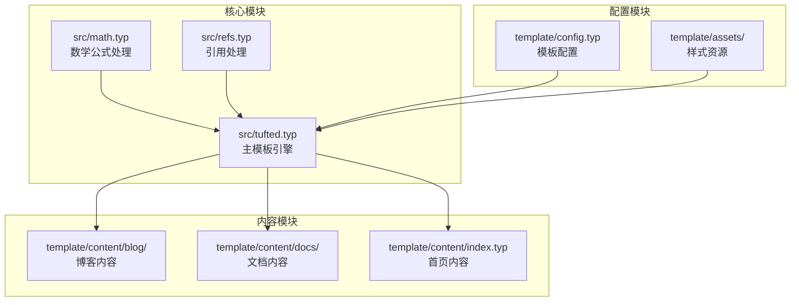
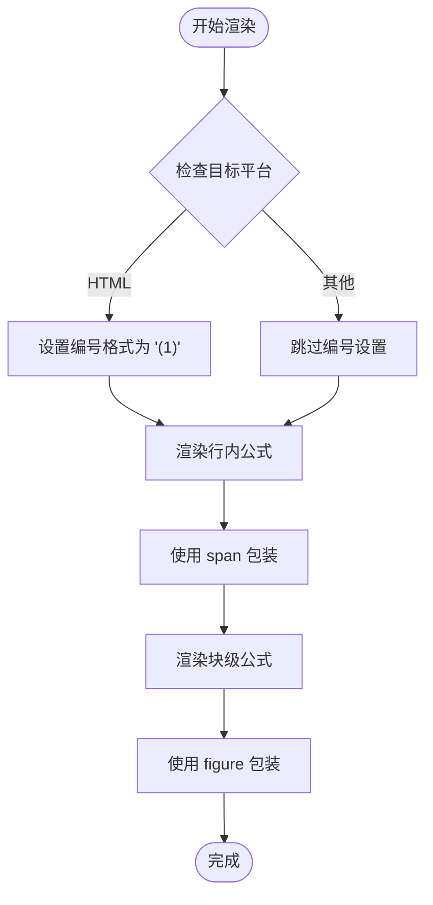
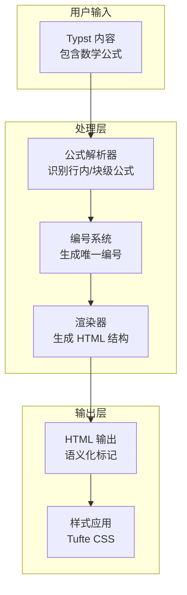
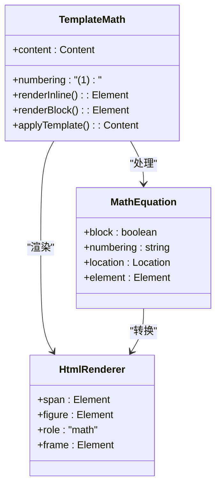
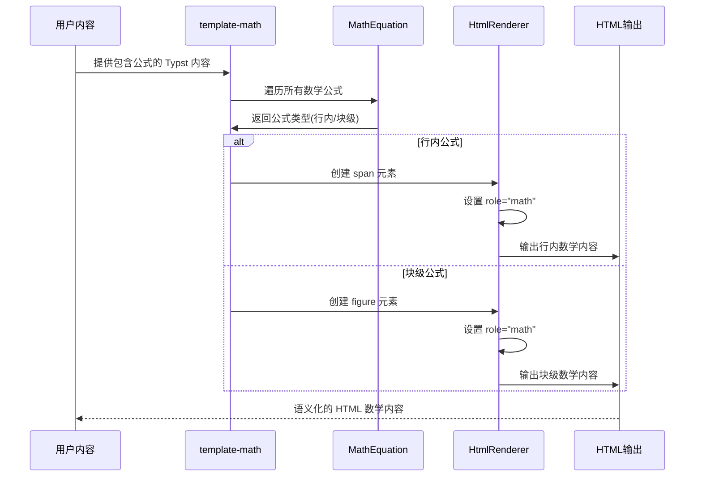
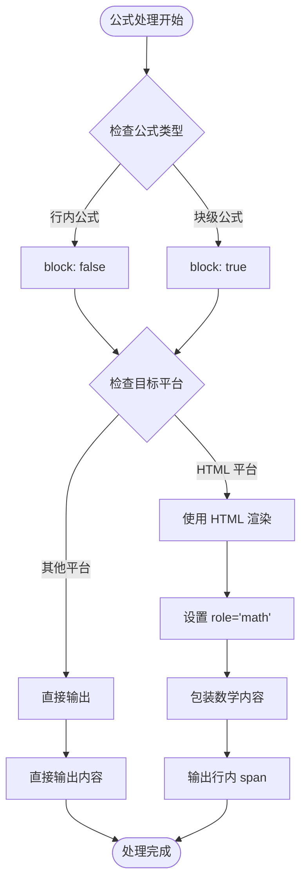
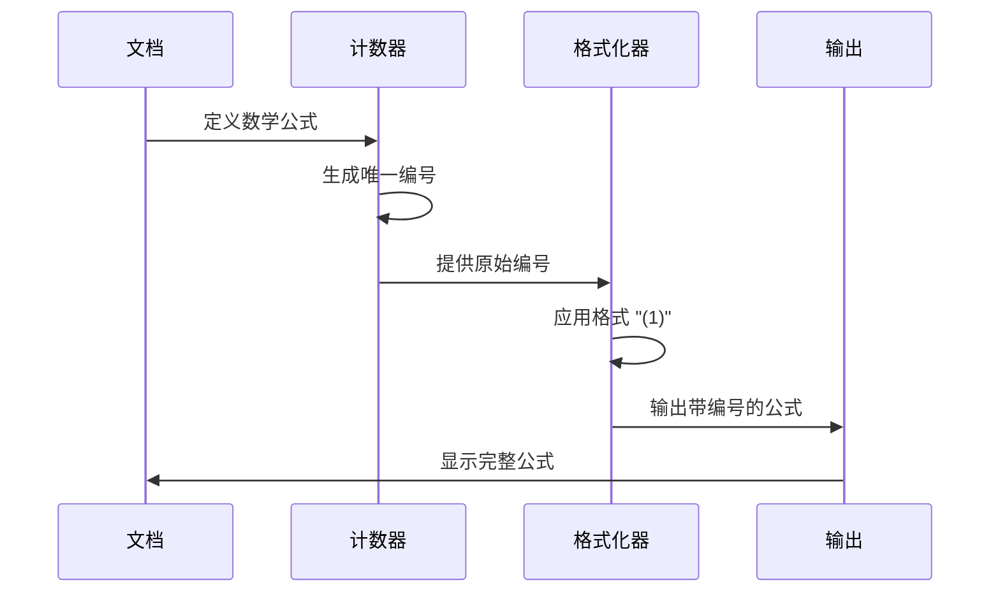
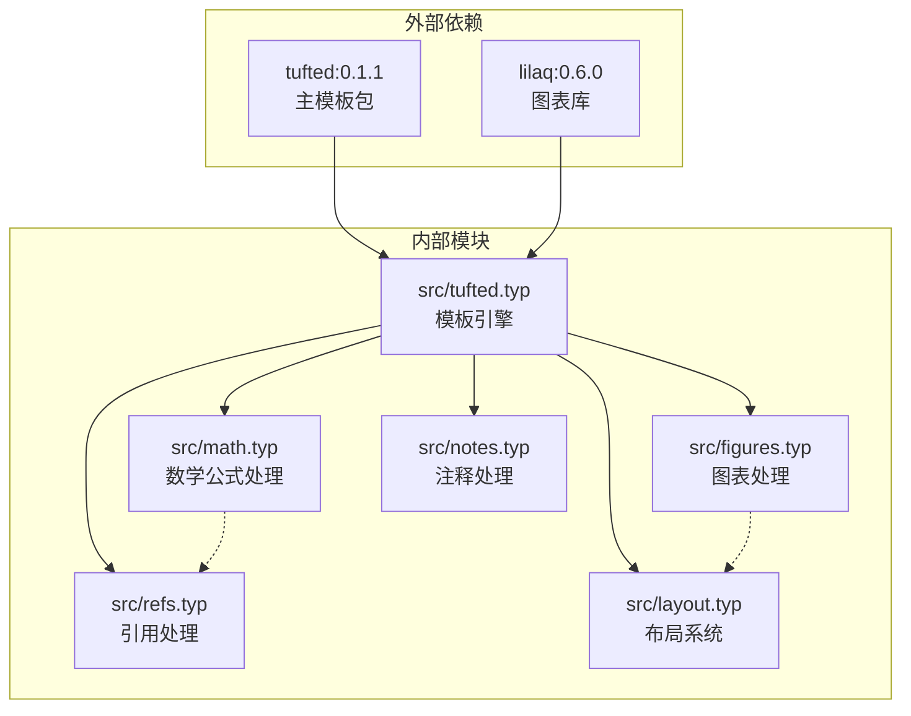
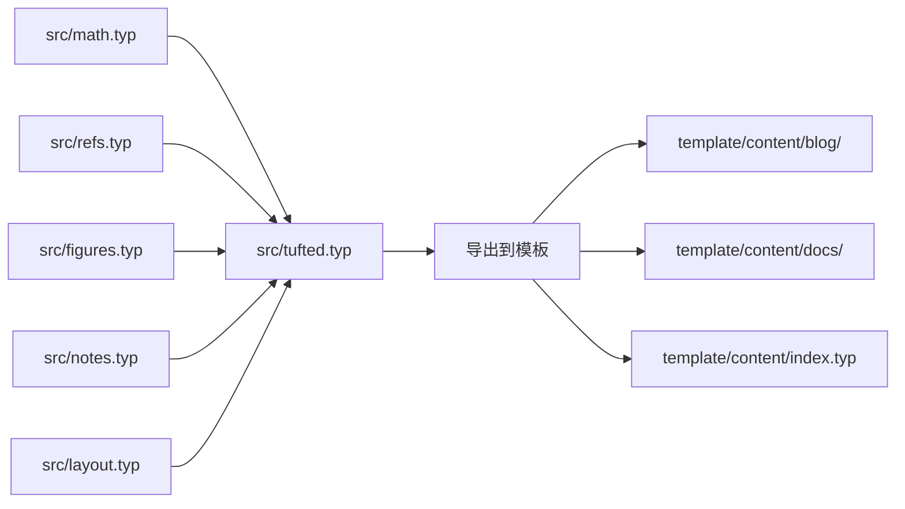

# 数学公式处理

<cite>
**本文档引用的文件**
- [src/math.typ](file://src/math.typ)
- [src/tufted.typ](file://src/tufted.typ)
- [src/refs.typ](file://src/refs.typ)
- [template/content/blog/2025-10-30-normal-distribution/index.typ](file://template/content/blog/2025-10-30-normal-distribution/index.typ)
- [template/content/docs/01-quick-start/index.typ](file://template/content/docs/01-quick-start/index.typ)
- [template/README.md](file://template/README.md)
</cite>

## 目录
1. [简介](#简介)
2. [项目结构](#项目结构)
3. [核心组件](#核心组件)
4. [架构概览](#架构概览)
5. [详细组件分析](#详细组件分析)
6. [依赖关系分析](#依赖关系分析)
7. [性能考虑](#性能考虑)
8. [故障排除指南](#故障排除指南)
9. [结论](#结论)

## 简介

TwilightPage 是一个基于 Typst 的静态网站模板，专门用于创建学术和技术内容的精美网页。该模板的核心特性之一是其强大的数学公式处理机制，它能够优雅地处理行内公式和块级公式，并为 HTML 目标平台提供语义化的数学内容渲染。

本文档深入解析了 TwilightPage 中数学公式的处理机制，重点涵盖 `template-math` 函数的工作流程、数学公式编号系统、HTML 平台下的渲染机制，以及如何自定义和扩展数学公式处理逻辑。

## 项目结构

TwilightPage 采用模块化的设计，将数学公式处理功能封装在独立的模块中，便于维护和扩展。项目的主要结构如下：



**图表来源**
- [src/math.typ:1-22](file://src/math.typ#L1-L22)
- [src/tufted.typ:1-64](file://src/tufted.typ#L1-L64)
- [template/config.typ:1-12](file://template/config.typ#L1-L12)

**章节来源**
- [src/math.typ:1-22](file://src/math.typ#L1-L22)
- [src/tufted.typ:1-64](file://src/tufted.typ#L1-L64)
- [template/config.typ:1-12](file://template/config.typ#L1-L12)

## 核心组件

### template-math 函数

`template-math` 是整个数学公式处理系统的核心函数，负责设置数学公式的基本配置并定义不同的渲染策略。

#### 主要功能特性

1. **公式编号设置**: 使用 `set math.equation(numbering: "(1)")` 设置默认的编号格式为带括号的数字
2. **条件渲染**: 根据目标平台（HTML 或其他）选择不同的渲染方式
3. **类型区分**: 区分行内公式和块级公式的不同处理策略

#### 关键实现细节

- **行内公式处理**: 当 `block: false` 时，使用 HTML `span` 元素包装数学内容
- **块级公式处理**: 当 `block: true` 时，使用 HTML `figure` 元素包装数学内容
- **语义化标记**: 在 HTML 目标平台上为数学内容添加 `role="math"` 属性

**章节来源**
- [src/math.typ:1-22](file://src/math.typ#L1-L22)

### 数学公式编号系统

TwilightPage 实现了一个灵活的数学公式编号系统，支持自定义编号格式。当前配置使用 `(1)` 格式，其中数字代表公式的顺序编号。

#### 编号格式实现逻辑



**图表来源**
- [src/math.typ:2](file://src/math.typ#L2)
- [src/math.typ:4-18](file://src/math.typ#L4-L18)

**章节来源**
- [src/math.typ:2](file://src/math.typ#L2)

### 引用处理系统

`template-refs` 模块负责处理数学公式的引用，确保引用与实际公式保持同步。

#### 引用处理机制

- **公式识别**: 通过 `el.func() == eq` 识别数学公式元素
- **动态编号**: 使用 `counter(eq).at(el.location())` 获取公式的实际编号
- **链接生成**: 创建指向公式的超链接

**章节来源**
- [src/refs.typ:1-23](file://src/refs.typ#L1-L23)

## 架构概览

TwilightPage 的数学公式处理架构采用了分层设计，每个组件都有明确的职责分工：



**图表来源**
- [src/math.typ:1-22](file://src/math.typ#L1-L22)
- [src/tufted.typ:28-32](file://src/tufted.typ#L28-L32)

## 详细组件分析

### template-math 组件深度分析

#### 类结构图



**图表来源**
- [src/math.typ:1-22](file://src/math.typ#L1-L22)

#### 工作流程序列图



**图表来源**
- [src/math.typ:4-18](file://src/math.typ#L4-L18)

#### 条件处理流程图



**图表来源**
- [src/math.typ:4-18](file://src/math.typ#L4-L18)

**章节来源**
- [src/math.typ:1-22](file://src/math.typ#L1-L22)

### 数学公式编号系统分析

#### 编号生成机制

TwilightPage 的数学公式编号系统基于 Typst 的内置计数器机制，实现了自动化的编号管理：



**图表来源**
- [src/math.typ:2](file://src/math.typ#L2)

#### 编号引用处理

当用户在文档中引用特定公式时，系统会自动更新引用的显示内容：


**图表来源**
- [src/refs.typ:8-14](file://src/refs.typ#L8-L14)

**章节来源**
- [src/refs.typ:1-23](file://src/refs.typ#L1-L23)

### HTML 目标平台渲染机制

#### 角色属性设置

在 HTML 目标平台上，TwilightPage 为数学内容设置了语义化的角色属性：

- **role="math"**: 明确标识内容为数学公式
- **语义化标记**: 使用适当的 HTML 元素结构
- **可访问性支持**: 为屏幕阅读器提供更好的支持

#### Frame 处理机制

`html.frame()` 函数负责将数学内容转换为 HTML 可渲染的格式：

```mermaid
flowchart TD
MathContent[数学公式内容] --> FrameFunction[html.frame]
FrameFunction --> HtmlElement[HTML 元素]
HtmlElement --> RoleAttribute[role="math"]
RoleAttribute --> FinalOutput[最终 HTML 输出]
```

**图表来源**
- [src/math.typ:6](file://src/math.typ#L6)
- [src/math.typ:14](file://src/math.typ#L14)

**章节来源**
- [src/math.typ:4-18](file://src/math.typ#L4-L18)

## 依赖关系分析

### 模块间依赖关系



**图表来源**
- [src/tufted.typ:1-6](file://src/tufted.typ#L1-L6)
- [template/config.typ:1](file://template/config.typ#L1)

### 导入和导出关系



**图表来源**
- [src/tufted.typ:1-6](file://src/tufted.typ#L1-L6)

**章节来源**
- [src/tufted.typ:1-6](file://src/tufted.typ#L1-L6)

## 性能考虑

### 渲染优化策略

1. **条件渲染**: 仅在 HTML 目标平台上执行复杂的 HTML 转换
2. **懒加载**: 数学公式内容按需渲染，避免不必要的计算
3. **缓存机制**: 利用 Typst 的内置缓存提高重复渲染效率

### 内存使用优化

- **增量处理**: 逐个处理数学公式，减少内存峰值
- **流式输出**: 直接输出 HTML，避免中间数据结构的存储

## 故障排除指南

### 常见问题及解决方案

#### 数学公式未正确编号

**问题描述**: 公式显示为纯文本而非编号公式

**可能原因**:
- 缺少 `#show: template-math` 指令
- 数学公式语法错误

**解决方法**:
1. 确保在文档顶部导入并应用模板
2. 检查数学公式的语法格式

#### 引用不匹配

**问题描述**: 公式引用显示错误的编号

**可能原因**:
- 公式位置发生变化
- 引用位置与公式位置不对应

**解决方法**:
1. 重新编译文档以更新引用
2. 检查公式和引用的位置关系

#### HTML 渲染问题

**问题描述**: 数学公式在 HTML 中显示异常

**可能原因**:
- CSS 样式冲突
- JavaScript 脚本干扰

**解决方法**:
1. 检查自定义 CSS 是否影响数学公式显示
2. 确认没有第三方脚本修改数学内容

**章节来源**
- [src/math.typ:1-22](file://src/math.typ#L1-L22)
- [src/refs.typ:1-23](file://src/refs.typ#L1-L23)

## 结论

TwilightPage 的数学公式处理机制展现了现代静态网站生成器的强大能力。通过精心设计的模块化架构，该系统实现了以下关键特性：

1. **灵活的渲染策略**: 支行内和块级公式的差异化处理
2. **语义化的 HTML 输出**: 为数学内容提供良好的可访问性支持
3. **智能的编号系统**: 自动化的公式编号和引用管理
4. **可扩展的架构**: 易于自定义和扩展的功能模块

该系统不仅满足了基本的数学公式显示需求，还为学术和技术内容的创作提供了专业的工具支持。通过合理的模块分离和清晰的接口设计，开发者可以轻松地根据具体需求调整数学公式的处理逻辑，同时保持系统的稳定性和可靠性。

对于未来的扩展，建议重点关注：
- 更丰富的数学符号支持
- 交互式数学内容的集成
- 更精细的样式定制选项
- 性能优化和大型文档的支持