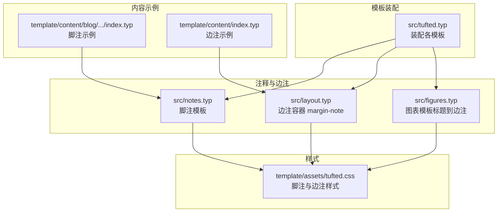
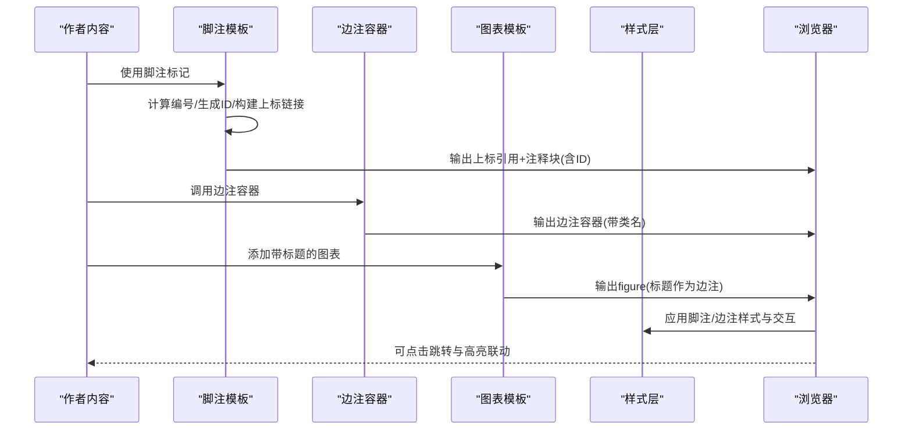
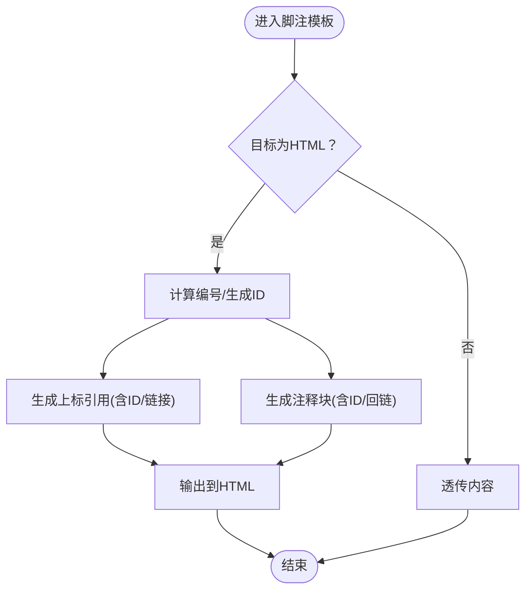
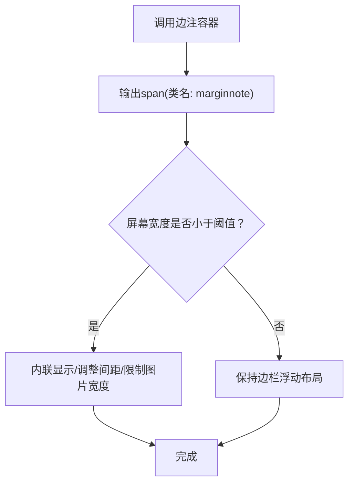
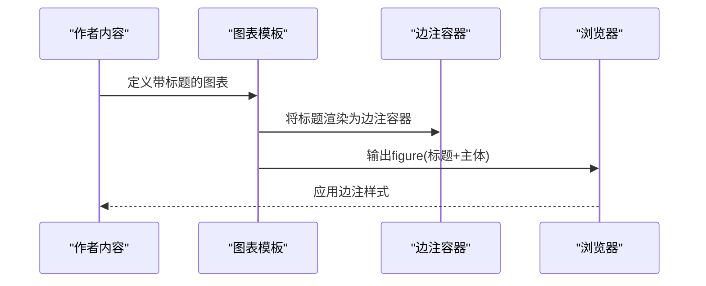
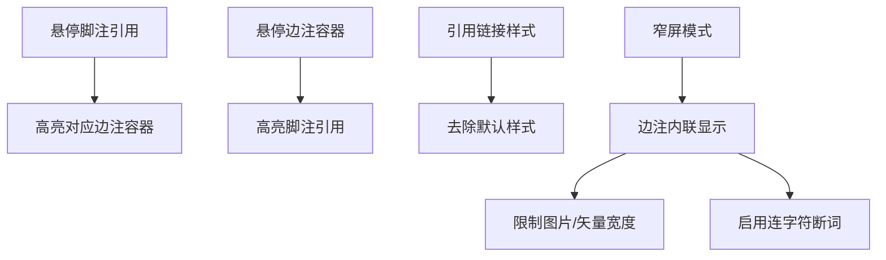
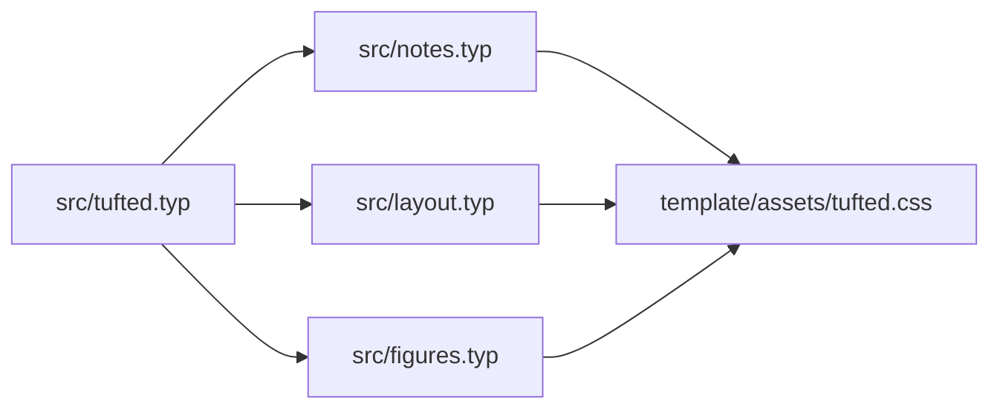

# 注释处理

<cite>
**本文引用的文件**
- [src/notes.typ](file://src/notes.typ)
- [src/layout.typ](file://src/layout.typ)
- [src/figures.typ](file://src/figures.typ)
- [template/assets/tufted.css](file://template/assets/tufted.css)
- [src/tufted.typ](file://src/tufted.typ)
- [template/config.typ](file://template/config.typ)
- [template/content/blog/2024-10-04-iterators-generators/index.typ](file://template/content/blog/2024-10-04-iterators-generators/index.typ)
- [template/content/index.typ](file://template/content/index.typ)
- [template/content/docs/03-styling/index.typ](file://template/content/docs/03-styling/index.typ)
</cite>

## 目录
1. [简介](#简介)
2. [项目结构](#项目结构)
3. [核心组件](#核心组件)
4. [架构总览](#架构总览)
5. [详细组件分析](#详细组件分析)
6. [依赖分析](#依赖分析)
7. [性能考虑](#性能考虑)
8. [故障排查指南](#故障排查指南)
9. [结论](#结论)
10. [附录](#附录)

## 简介
本文件系统性介绍 TwilightPage（Tufted）模板中的注释处理机制，重点覆盖脚注与边注（侧注）的实现原理、注释标记识别与位置计算、注释内容渲染与样式应用、注释与正文的关联与跳转、实际使用示例、配置与自定义方法，以及最佳实践与常见问题解决方案。文档基于仓库中 Typst 源码与样式表进行分析，帮助读者在不直接阅读代码的前提下掌握注释系统的完整工作流程。

## 项目结构
注释系统由以下关键模块协同完成：
- 脚注模板：负责识别脚注标记并在 HTML 中生成带编号的上标引用与页脚注释块。
- 边注（侧注）工具：提供通用的边注容器，用于放置脚注之外的旁注内容。
- 图表模板：将图表标题重定向到边注容器，复用边注样式。
- 样式层：通过 CSS 实现脚注引用与边注的高亮联动、响应式布局与移动端适配。
- 主模板装配：将数学、引用、注释、图表等模板按顺序注入到页面输出流中。

**图示来源**
- [src/tufted.typ:17-63](file://src/tufted.typ#L17-L63)
- [src/notes.typ:1-27](file://src/notes.typ#L1-L27)
- [src/layout.typ:3-5](file://src/layout.typ#L3-L5)
- [src/figures.typ:3-19](file://src/figures.typ#L3-L19)
- [template/assets/tufted.css:90-118](file://template/assets/tufted.css#L90-L118)

**章节来源**
- [src/tufted.typ:17-63](file://src/tufted.typ#L17-L63)
- [src/notes.typ:1-27](file://src/notes.typ#L1-L27)
- [src/layout.typ:3-5](file://src/layout.typ#L3-L5)
- [src/figures.typ:3-19](file://src/figures.typ#L3-L19)
- [template/assets/tufted.css:90-118](file://template/assets/tufted.css#L90-L118)

## 核心组件
- 脚注模板（template-notes）
  - 作用：拦截脚注元素，为 HTML 输出生成上标引用与页脚注释块，并建立双向跳转锚点。
  - 关键点：使用计数器显示编号；为引用与注释块分别生成唯一 ID；在 HTML 中以链接形式互相跳转。
- 边注容器（margin-note）
  - 作用：提供通用的边注包装器，用于承载脚注之外的旁注内容。
  - 关键点：在 HTML 中输出带类名的容器，配合 CSS 实现布局与高亮。
- 图表模板（template-figures）
  - 作用：将图表标题渲染为边注容器，使图表说明与边注风格一致。
  - 关键点：在 HTML 中将标题与主体组合为 figure 元素。
- 样式层（tufted.css）
  - 作用：控制脚注引用与边注的高亮联动、悬停效果、移动端内联显示等。
  - 关键点：利用相邻选择器与属性选择器实现“引用悬停高亮对应边注”等交互。

**章节来源**
- [src/notes.typ:1-27](file://src/notes.typ#L1-L27)
- [src/layout.typ:3-5](file://src/layout.typ#L3-L5)
- [src/figures.typ:3-19](file://src/figures.typ#L3-L19)
- [template/assets/tufted.css:90-118](file://template/assets/tufted.css#L90-L118)

## 架构总览
下图展示了注释系统从内容到输出的整体流程：内容源码中出现脚注或边注调用 → 模板拦截并生成 HTML 结构 → 样式层应用视觉与交互效果 → 浏览器端实现跳转与高亮联动。

**图示来源**
- [src/notes.typ:1-27](file://src/notes.typ#L1-L27)
- [src/layout.typ:3-5](file://src/layout.typ#L3-L5)
- [src/figures.typ:3-19](file://src/figures.typ#L3-L19)
- [template/assets/tufted.css:90-118](file://template/assets/tufted.css#L90-L118)

## 详细组件分析

### 脚注模板（template-notes）
- 标记识别与编号
  - 模板拦截脚注元素，使用计数器生成编号，并据此构造引用与注释块的唯一 ID。
  - 引用与注释块之间通过锚点链接实现双向跳转。
- 位置与结构
  - 正文中的引用以“上标数字”的形式呈现，点击后跳转至页脚注释块。
  - 注释块位于边栏区域（margin），其 ID 与正文引用的 href 对应。
- 渲染与样式
  - 在 HTML 中，引用与注释块均带有特定类名，便于样式层进行高亮与交互控制。
  - 移动端时，边注容器会内联显示，保证可读性。

**图示来源**
- [src/notes.typ:2-23](file://src/notes.typ#L2-L23)

**章节来源**
- [src/notes.typ:1-27](file://src/notes.typ#L1-L27)

### 边注容器（margin-note）
- 容器职责
  - 提供统一的边注包装，所有边注内容（包括脚注注释块）共享同一容器结构。
- 布局与响应式
  - 默认采用浮动布局，窄屏时自动切换为内联块级显示，避免边栏溢出。
  - 内部图片与 SVG 的宽度在窄屏下被限制，提升可读性。

**图示来源**
- [src/layout.typ:3-5](file://src/layout.typ#L3-L5)
- [template/assets/tufted.css:30-55](file://template/assets/tufted.css#L30-L55)

**章节来源**
- [src/layout.typ:3-5](file://src/layout.typ#L3-L5)
- [template/assets/tufted.css:30-55](file://template/assets/tufted.css#L30-L55)

### 图表模板（template-figures）
- 标题到边注
  - 将图表标题渲染为边注容器，使其与脚注注释块共享相同的边注样式与布局。
- 图表结构
  - 在 HTML 中将标题与主体组合为 figure 元素，便于语义化与样式控制。

**图示来源**
- [src/figures.typ:3-19](file://src/figures.typ#L3-L19)
- [src/layout.typ:3-5](file://src/layout.typ#L3-L5)

**章节来源**
- [src/figures.typ:3-19](file://src/figures.typ#L3-L19)
- [src/layout.typ:3-5](file://src/layout.typ#L3-L5)

### 样式与交互（tufted.css）
- 高亮联动
  - 当鼠标悬停在脚注引用上时，对应的边注容器获得弱高亮；当悬停在边注容器上时，引用获得强高亮。
- 链接样式
  - 脚注引用链接去除默认样式，确保与正文排版一致。
- 响应式适配
  - 在窄屏设备上，边注容器改为内联块级显示，并限制内部媒体尺寸，启用连字符断词以改善阅读体验。

**图示来源**
- [template/assets/tufted.css:94-118](file://template/assets/tufted.css#L94-L118)
- [template/assets/tufted.css:30-55](file://template/assets/tufted.css#L30-L55)

**章节来源**
- [template/assets/tufted.css:94-118](file://template/assets/tufted.css#L94-L118)
- [template/assets/tufted.css:30-55](file://template/assets/tufted.css#L30-L55)

## 依赖分析
- 组件耦合
  - 脚注模板与边注容器通过类名与 ID 约束建立松耦合关系，样式层负责最终的视觉与交互表现。
  - 图表模板依赖边注容器以统一标题渲染风格。
- 外部依赖
  - 主模板装配加载数学、引用、注释、图表等模板，形成完整的页面输出管线。
  - 默认样式包含第三方 tufte-css，结合本地样式与自定义样式，实现主题化与可定制性。

**图示来源**
- [src/tufted.typ:17-63](file://src/tufted.typ#L17-L63)
- [src/notes.typ:1-27](file://src/notes.typ#L1-L27)
- [src/layout.typ:3-5](file://src/layout.typ#L3-L5)
- [src/figures.typ:3-19](file://src/figures.typ#L3-L19)

**章节来源**
- [src/tufted.typ:17-63](file://src/tufted.typ#L17-L63)
- [src/notes.typ:1-27](file://src/notes.typ#L1-L27)
- [src/layout.typ:3-5](file://src/layout.typ#L3-L5)
- [src/figures.typ:3-19](file://src/figures.typ#L3-L19)

## 性能考虑
- 脚注编号与锚点生成
  - 编号来源于计数器，避免重复计算；仅在 HTML 目标下执行脚注处理，非 HTML 目标直接透传，减少不必要的开销。
- 样式层优化
  - 使用相邻选择器与属性选择器实现高亮联动，无需额外脚本即可完成交互。
- 响应式策略
  - 窄屏内联边注减少布局抖动，同时限制媒体尺寸降低渲染压力。

[本节为通用指导，不涉及具体文件分析]

## 故障排查指南
- 脚注未显示或无法跳转
  - 检查内容是否在 HTML 目标下生成；确认脚注模板已装配到主模板。
  - 确认引用与注释块的 ID 是否匹配，检查类名是否正确。
- 边注未按预期显示
  - 确认边注容器是否正确包裹内容；检查窄屏样式是否生效。
- 样式冲突
  - 自定义样式优先级较低时可能被覆盖；可通过增加选择器特异性或调整加载顺序解决。
- 图表标题未使用边注样式
  - 确认图表模板已装配；检查标题渲染是否被其他规则覆盖。

**章节来源**
- [src/tufted.typ:29-32](file://src/tufted.typ#L29-L32)
- [src/notes.typ:2-23](file://src/notes.typ#L2-L23)
- [src/layout.typ:3-5](file://src/layout.typ#L3-L5)
- [template/assets/tufted.css:30-55](file://template/assets/tufted.css#L30-L55)

## 结论
TwilightPage 的注释系统以“模板拦截 + HTML 结构 + 样式联动”为核心，实现了脚注与边注的一致化处理与优雅的交互体验。通过清晰的组件边界与可扩展的样式层，用户可以在不深入底层实现的情况下，灵活地添加、管理和定制注释内容。

[本节为总结性内容，不涉及具体文件分析]

## 附录

### 实际使用示例
- 添加脚注
  - 在文章正文中插入脚注标记，系统将自动生成上标引用与页脚注释块，并建立跳转关系。
  - 示例路径：[template/content/blog/2024-10-04-iterators-generators/index.typ:6-6](file://template/content/blog/2024-10-04-iterators-generators/index.typ#L6-L6)
- 添加边注
  - 使用边注容器包裹旁注内容，适用于补充说明、图注等场景。
  - 示例路径：[template/content/index.typ:7-14](file://template/content/index.typ#L7-L14)
- 图表标题作为边注
  - 图表标题将自动渲染为边注容器，保持与脚注注释块一致的外观。
  - 示例路径：[src/figures.typ:4-8](file://src/figures.typ#L4-L8)

**章节来源**
- [template/content/blog/2024-10-04-iterators-generators/index.typ:6-6](file://template/content/blog/2024-10-04-iterators-generators/index.typ#L6-L6)
- [template/content/index.typ:7-14](file://template/content/index.typ#L7-L14)
- [src/figures.typ:4-8](file://src/figures.typ#L4-L8)

### 配置与自定义
- 主模板装配
  - 在主模板中按顺序注入数学、引用、注释、图表等模板，确保处理链完整。
  - 参考路径：[src/tufted.typ:29-32](file://src/tufted.typ#L29-L32)
- 样式定制
  - 通过修改自定义样式文件实现主题化；默认样式包含第三方 tufte-css 与本地样式。
  - 参考路径：[template/assets/tufted.css:1-166](file://template/assets/tufted.css#L1-L166)
- 样式加载与覆盖
  - 可在配置中替换默认样式列表，或仅保留自定义样式。
  - 参考路径：[template/content/docs/03-styling/index.typ:8-21](file://template/content/docs/03-styling/index.typ#L8-L21)

**章节来源**
- [src/tufted.typ:29-32](file://src/tufted.typ#L29-L32)
- [template/assets/tufted.css:1-166](file://template/assets/tufted.css#L1-L166)
- [template/content/docs/03-styling/index.typ:8-21](file://template/content/docs/03-styling/index.typ#L8-L21)

### 最佳实践
- 保持注释简洁明确，避免冗长内容挤占正文空间。
- 合理使用边注容器承载补充信息，与脚注注释块风格统一。
- 在窄屏设备上优先保证可读性，避免过宽的边注导致滚动困难。
- 如需自定义样式，建议在自定义样式文件中进行覆盖，避免破坏默认交互。

[本节为通用指导，不涉及具体文件分析]