# 核心概念

<cite>
**本文引用的文件**
- [src/tufted.typ](file://src/tufted.typ)
- [src/layout.typ](file://src/layout.typ)
- [src/math.typ](file://src/math.typ)
- [src/notes.typ](file://src/notes.typ)
- [src/figures.typ](file://src/figures.typ)
- [src/refs.typ](file://src/refs.typ)
- [template/config.typ](file://template/config.typ)
- [template/assets/tufted.css](file://template/assets/tufted.css)
- [template/assets/custom.css](file://template/assets/custom.css)
- [template/content/index.typ](file://template/content/index.typ)
- [template/content/docs/01-quick-start/index.typ](file://template/content/docs/01-quick-start/index.typ)
- [template/content/blog/2024-10-04-iterators-generators/index.typ](file://template/content/blog/2024-10-04-iterators-generators/index.typ)
- [template/content/cv/index.typ](file://template/content/cv/index.typ)
- [template/Makefile](file://template/Makefile)
- [Makefile](file://Makefile)
- [typst.toml](file://typst.toml)
- [template/README.md](file://template/README.md)
</cite>

## 目录
1. [引言](#引言)
2. [项目结构](#项目结构)
3. [核心组件](#核心组件)
4. [架构总览](#架构总览)
5. [详细组件分析](#详细组件分析)
6. [依赖关系分析](#依赖关系分析)
7. [性能考虑](#性能考虑)
8. [故障排查指南](#故障排查指南)
9. [结论](#结论)
10. [附录](#附录)

## 引言
本文件面向初学者与进阶开发者，系统阐释 TwilightPage（在仓库中以“Tufted”命名）的核心概念与架构原理。重点涵盖：
- Typst 标记语言的基础语法与模板系统工作机制
- Tufte 风格排版的设计理念：边距控制、字体与视觉层次
- 响应式设计与移动端适配策略
- 模板继承与配置驱动方法
- 内容处理管道：从 Typst 源文件到 HTML 的完整流程
- 结合实际示例路径，帮助读者快速上手并深入理解

## 项目结构
该模板采用“包内模板”的结构组织：核心渲染逻辑位于 src/，模板入口与示例内容位于 template/。构建与链接通过 Makefile 协调，typst.toml 描述包元数据与模板入口。

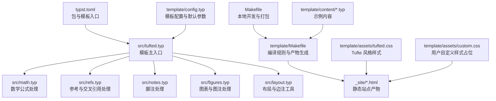

**图表来源**
- [typst.toml:15-19](file://typst.toml#L15-L19)
- [src/tufted.typ:17-63](file://src/tufted.typ#L17-L63)
- [src/math.typ:1-22](file://src/math.typ#L1-L22)
- [src/refs.typ:1-23](file://src/refs.typ#L1-L23)
- [src/notes.typ:1-27](file://src/notes.typ#L1-L27)
- [src/figures.typ:1-20](file://src/figures.typ#L1-L20)
- [src/layout.typ:1-13](file://src/layout.typ#L1-L13)
- [template/config.typ:1-12](file://template/config.typ#L1-L12)
- [template/Makefile:14-16](file://template/Makefile#L14-L16)
- [Makefile:54-55](file://Makefile#L54-L55)
- [template/assets/tufted.css:1-166](file://template/assets/tufted.css#L1-L166)
- [template/assets/custom.css:1-1](file://template/assets/custom.css#L1-L1)

**章节来源**
- [typst.toml:1-19](file://typst.toml#L1-L19)
- [Makefile:1-60](file://Makefile#L1-L60)
- [template/Makefile:1-27](file://template/Makefile#L1-L27)

## 核心组件
- 模板主入口：负责注入样式、生成 HTML 文档骨架，并组合各子模板（数学、参考、脚注、图表、布局工具）。
- 子模板：
  - 数学模板：统一编号与 HTML 角色标记，支持行内与块级公式。
  - 参考模板：重写引用行为，支持方程与标题等元素的智能引用。
  - 脚注模板：在正文与边栏分别渲染脚注引用与内容。
  - 图表模板：重写图注与图表容器，使其在 HTML 中正确呈现。
  - 布局模板：提供边注与全宽内容的包装器。
- 样式层：基于 Tufte CSS 并扩展，提供响应式与暗色模式支持。
- 构建层：通过 Makefile 将 .typ 编译为 .html，并复制资源。

**章节来源**
- [src/tufted.typ:17-63](file://src/tufted.typ#L17-L63)
- [src/math.typ:1-22](file://src/math.typ#L1-L22)
- [src/refs.typ:1-23](file://src/refs.typ#L1-L23)
- [src/notes.typ:1-27](file://src/notes.typ#L1-L27)
- [src/figures.typ:1-20](file://src/figures.typ#L1-L20)
- [src/layout.typ:1-13](file://src/layout.typ#L1-L13)
- [template/assets/tufted.css:1-166](file://template/assets/tufted.css#L1-L166)

## 架构总览
下图展示了从内容到输出的整体流程：内容文件导入模板配置，模板组合子模板与布局工具，最终由 Typst 编译器导出 HTML；样式通过 CSS 注入并在运行时生效。

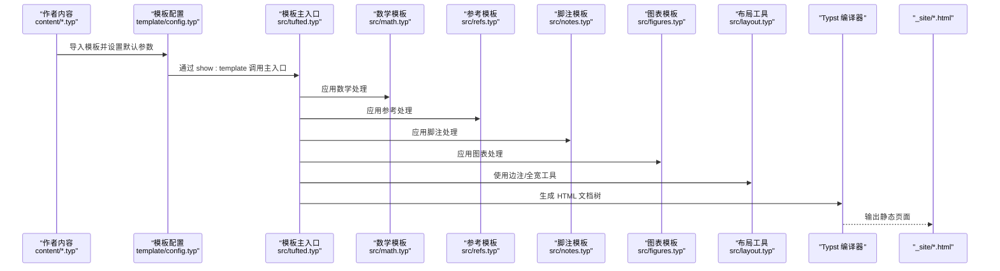

**图表来源**
- [template/content/index.typ:1-33](file://template/content/index.typ#L1-L33)
- [template/config.typ:1-12](file://template/config.typ#L1-L12)
- [src/tufted.typ:17-63](file://src/tufted.typ#L17-L63)
- [src/math.typ:1-22](file://src/math.typ#L1-L22)
- [src/refs.typ:1-23](file://src/refs.typ#L1-L23)
- [src/notes.typ:1-27](file://src/notes.typ#L1-L27)
- [src/figures.typ:1-20](file://src/figures.typ#L1-L20)
- [src/layout.typ:1-13](file://src/layout.typ#L1-L13)
- [template/Makefile:14-16](file://template/Makefile#L14-L16)

## 详细组件分析

### 模板主入口（tufted-web）
- 职责：组装 HTML 文档骨架、注入样式、设置语言、渲染头部导航与正文内容。
- 关键点：
  - 通过 show: 指令依次应用数学、参考、脚注、图表子模板。
  - 使用 html.* 元素构造 head 与 body，动态插入多个 CSS 链接。
  - 提供 header-links、title、lang、css 等可配置项，支持模板继承覆盖。

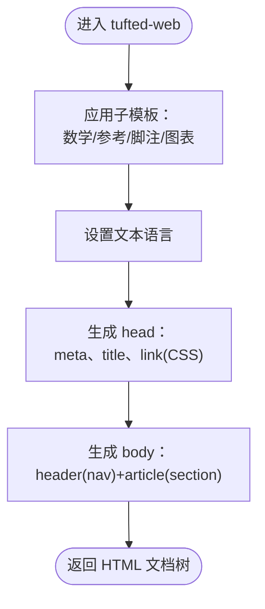

**图表来源**
- [src/tufted.typ:27-62](file://src/tufted.typ#L27-L62)

**章节来源**
- [src/tufted.typ:17-63](file://src/tufted.typ#L17-L63)

### 数学模板（template-math）
- 职责：统一数学公式的编号与 HTML 角色标记，区分行内与块级。
- 关键点：
  - 设置方程编号格式。
  - 在目标为 HTML 时，将行内公式包裹为带 role 的 span，块级公式包裹为 figure。

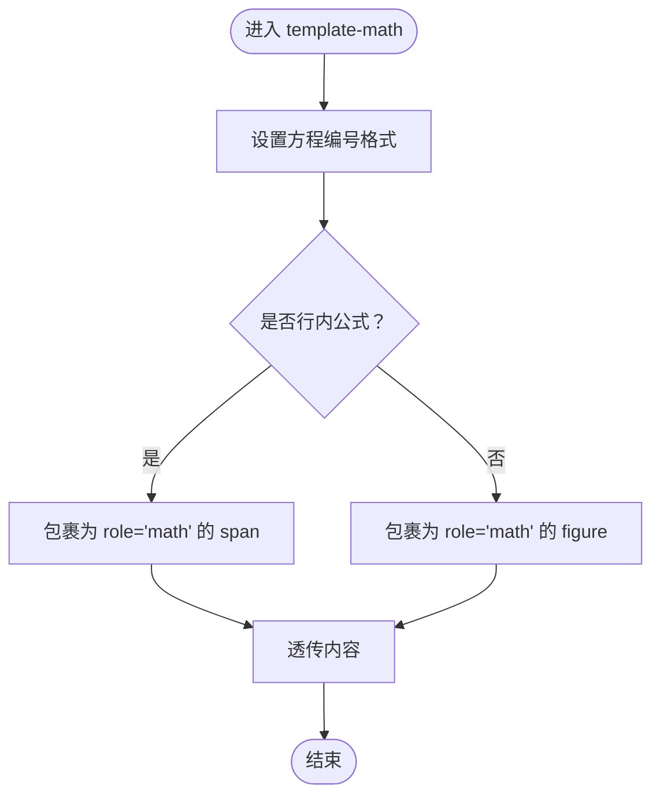

**图表来源**
- [src/math.typ:1-22](file://src/math.typ#L1-L22)

**章节来源**
- [src/math.typ:1-22](file://src/math.typ#L1-L22)

### 参考模板（template-refs）
- 职责：重写引用行为，对特定元素（如方程、标题）进行智能引用处理。
- 关键点：
  - 识别被引用元素类型，按需生成链接与编号。
  - 对标题引用进行引号包裹等美化处理。

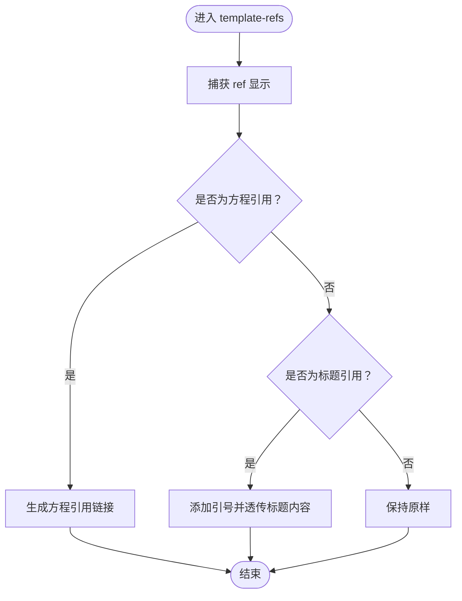

**图表来源**
- [src/refs.typ:1-23](file://src/refs.typ#L1-L23)

**章节来源**
- [src/refs.typ:1-23](file://src/refs.typ#L1-L23)

### 脚注模板（template-notes）
- 职责：在 HTML 中将脚注引用与脚注内容分别渲染到正文与边栏。
- 关键点：
  - 计算脚注编号并生成双向锚点。
  - 正文使用上标链接，边栏使用带 marginnote 类的容器。

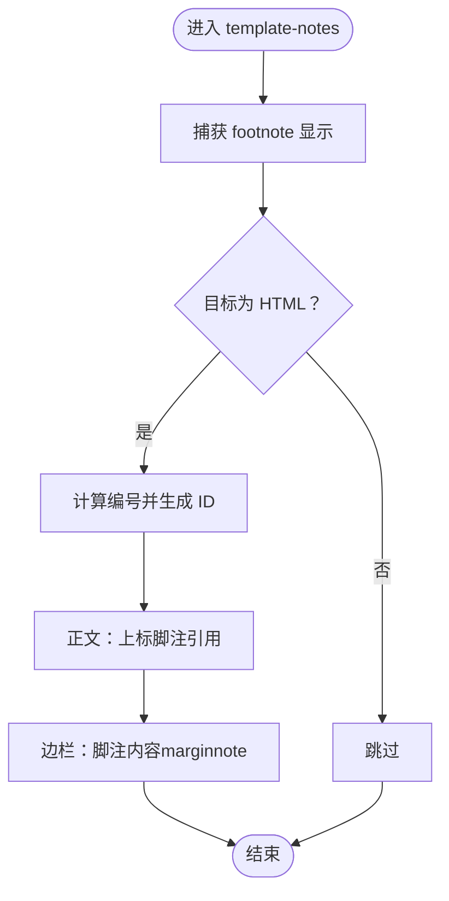

**图表来源**
- [src/notes.typ:1-27](file://src/notes.typ#L1-L27)

**章节来源**
- [src/notes.typ:1-27](file://src/notes.typ#L1-L27)

### 图表模板（template-figures）
- 职责：重写 figure 与其 caption 的渲染，确保图注在边栏显示。
- 关键点：
  - 将 caption 渲染为带 marginnote 类的 span。
  - 将 figure 包裹为 HTML figure 容器。

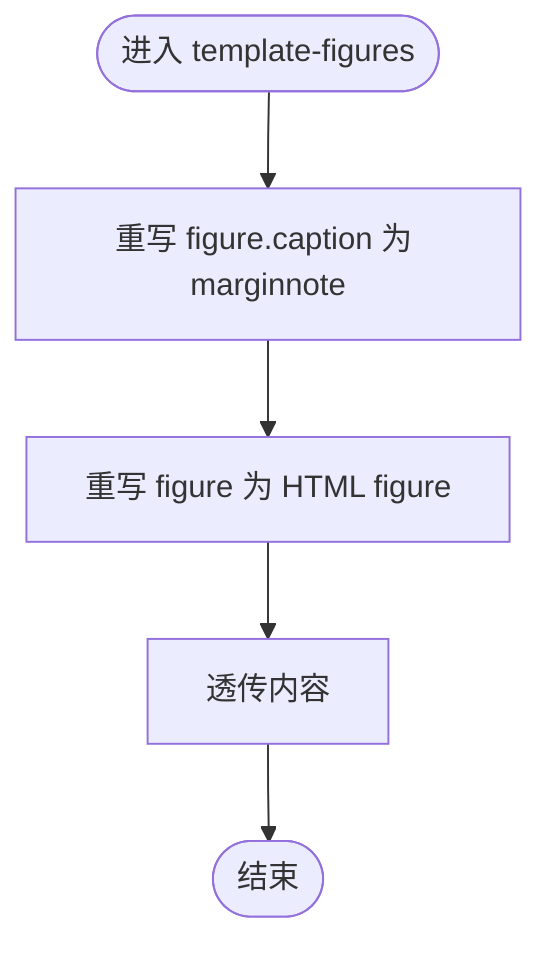

**图表来源**
- [src/figures.typ:1-20](file://src/figures.typ#L1-L20)

**章节来源**
- [src/figures.typ:1-20](file://src/figures.typ#L1-L20)

### 布局工具（layout）
- 职责：提供 margin-note 与 full-width 两类包装器，用于边注与全宽内容。
- 关键点：
  - margin-note：输出带 marginnote 类的 span。
  - full-width：输出带 fullwidth 类的 div。

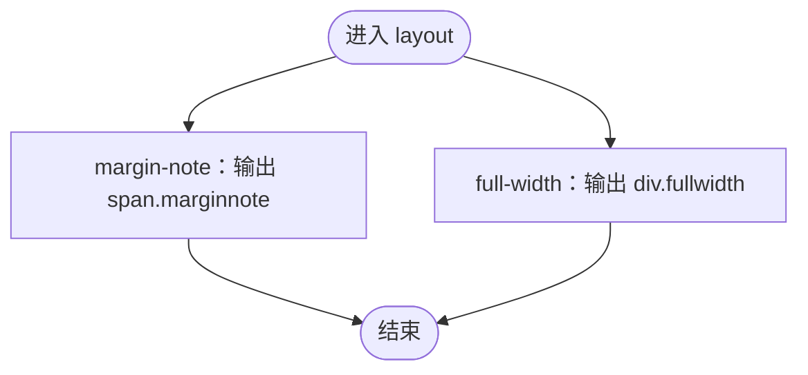

**图表来源**
- [src/layout.typ:1-13](file://src/layout.typ#L1-L13)

**章节来源**
- [src/layout.typ:1-13](file://src/layout.typ#L1-L13)

### 样式与响应式（tufted.css）
- 职责：提供 Tufte 风格基础样式、导航、脚注与边注交互、数学渲染优化、响应式布局与暗色模式。
- 关键点：
  - CSS 变量统一主题色与圆角。
  - 在窄屏设备上将边注改为块级显示并启用连字符断词。
  - 通过 hover/has 伪类实现脚注与边注的高亮联动。
  - 数学块在深色模式下自动反色以提升对比度。

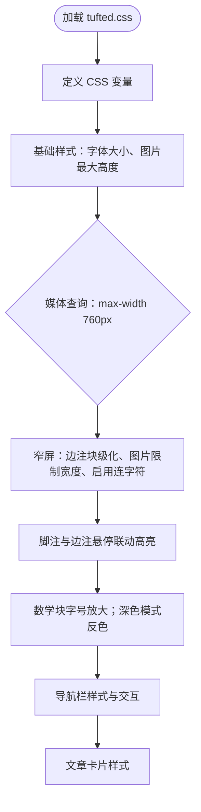

**图表来源**
- [template/assets/tufted.css:1-166](file://template/assets/tufted.css#L1-L166)

**章节来源**
- [template/assets/tufted.css:1-166](file://template/assets/tufted.css#L1-L166)

### 模板继承与配置驱动
- 配置入口：template/config.typ 导入已发布版本的模板，并通过 .with(...) 覆盖 header-links、title 等默认值。
- 继承机制：内容页通过 import 模板配置，再使用 #show: template.with(...) 覆盖单页标题等属性。
- 示例路径：
  - [template/config.typ:1-12](file://template/config.typ#L1-L12)
  - [template/content/docs/01-quick-start/index.typ:1-24](file://template/content/docs/01-quick-start/index.typ#L1-L24)

**章节来源**
- [template/config.typ:1-12](file://template/config.typ#L1-L12)
- [template/content/docs/01-quick-start/index.typ:1-24](file://template/content/docs/01-quick-start/index.typ#L1-L24)

### 内容处理管道（从 Typst 到 HTML）
- 编译流程：
  - 模板 Makefile 发现 content/ 下所有 .typ 文件，排除以 “_” 开头的隐藏文件。
  - 对每个 .typ 生成对应 _site/ 下的 .html，使用 typst compile --features html --format html。
  - 复制 template/assets/* 到 _site/assets/。
- 本地开发：
  - 主 Makefile 提供 link/sync-assets/build 等目标，便于本地调试与打包。

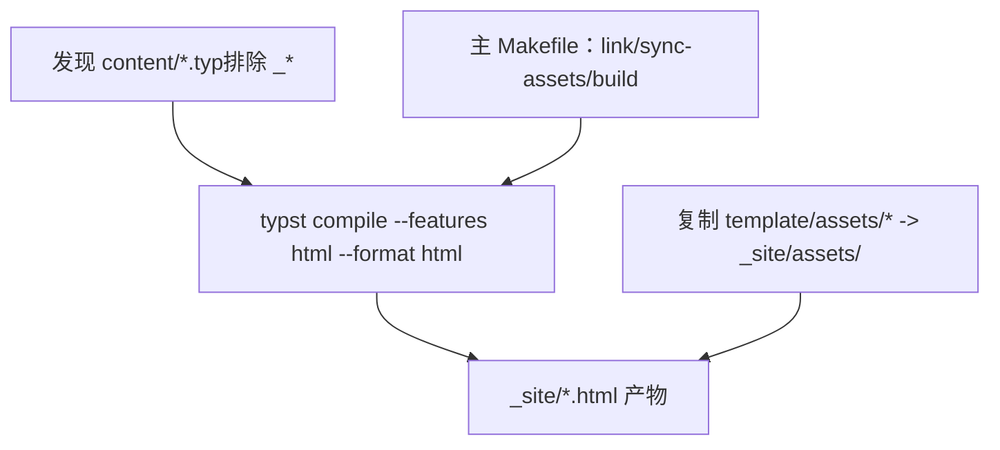

**图表来源**
- [template/Makefile:1-27](file://template/Makefile#L1-L27)
- [Makefile:54-55](file://Makefile#L54-L55)

**章节来源**
- [template/Makefile:1-27](file://template/Makefile#L1-L27)
- [Makefile:1-60](file://Makefile#L1-L60)

### 实际应用示例（路径指引）
- 首页示例：展示边注与 Markdown 内容嵌入
  - [template/content/index.typ:1-33](file://template/content/index.typ#L1-L33)
- 快速开始文档：演示模板初始化与构建命令
  - [template/content/docs/01-quick-start/index.typ:1-24](file://template/content/docs/01-quick-start/index.typ#L1-L24)
- 博客文章：脚注、图表与正文混排
  - [template/content/blog/2024-10-04-iterators-generators/index.typ:1-53](file://template/content/blog/2024-10-04-iterators-generators/index.typ#L1-L53)
- CV 页面：边注信息与参考文献列表
  - [template/content/cv/index.typ:1-59](file://template/content/cv/index.typ#L1-L59)

**章节来源**
- [template/content/index.typ:1-33](file://template/content/index.typ#L1-L33)
- [template/content/docs/01-quick-start/index.typ:1-24](file://template/content/docs/01-quick-start/index.typ#L1-L24)
- [template/content/blog/2024-10-04-iterators-generators/index.typ:1-53](file://template/content/blog/2024-10-04-iterators-generators/index.typ#L1-L53)
- [template/content/cv/index.typ:1-59](file://template/content/cv/index.typ#L1-L59)

## 依赖关系分析
- 包元数据与模板入口：typst.toml 指定入口为 src/tufted.typ，并声明模板目录与入口文件。
- 模板内部依赖：src/tufted.typ 统一导入并应用 src/math.typ、src/refs.typ、src/notes.typ、src/figures.typ、src/layout.typ。
- 构建依赖：template/Makefile 依赖 typst 编译器；主 Makefile 提供本地链接与打包。

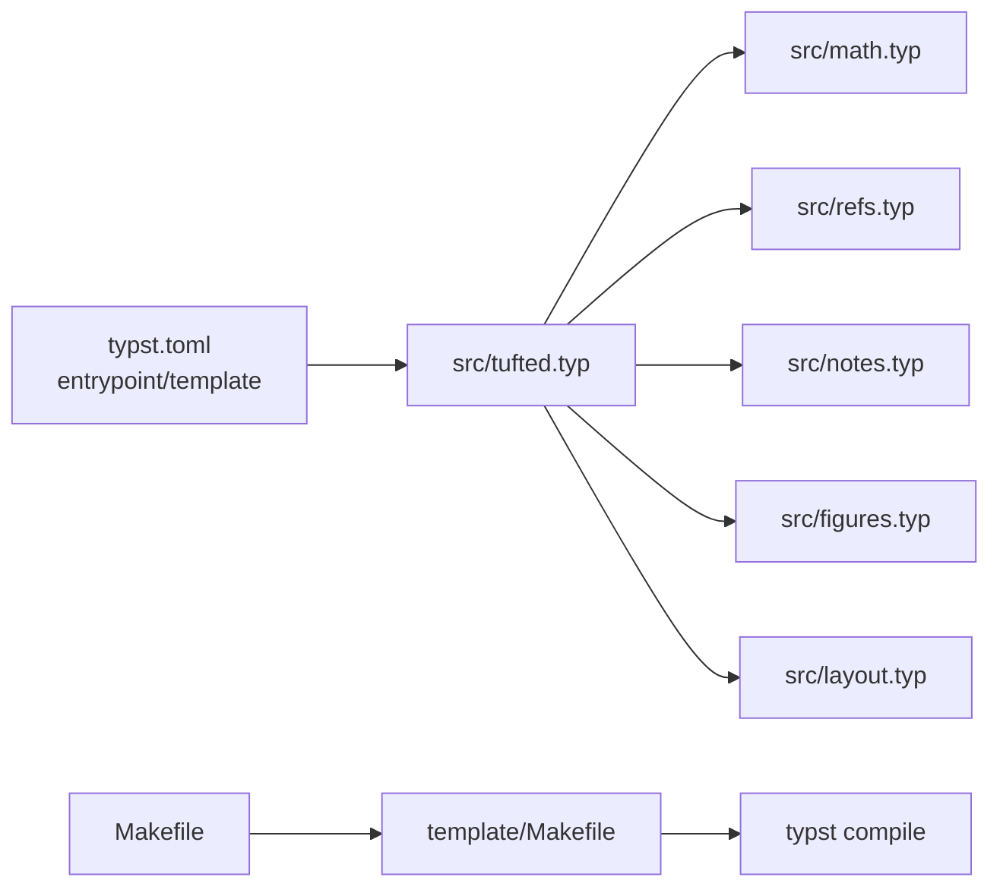

**图表来源**
- [typst.toml:4,15-17](file://typst.toml#L4,L15-L17)
- [src/tufted.typ:1-5](file://src/tufted.typ#L1-L5)
- [template/Makefile:14-16](file://template/Makefile#L14-L16)
- [Makefile:54-55](file://Makefile#L54-L55)

**章节来源**
- [typst.toml:1-19](file://typst.toml#L1-L19)
- [src/tufted.typ:1-5](file://src/tufted.typ#L1-L5)
- [template/Makefile:1-27](file://template/Makefile#L1-L27)
- [Makefile:1-60](file://Makefile#L1-L60)

## 性能考虑
- 编译阶段：利用模板 Makefile 的模式规则批量编译，避免重复构建；仅在内容变更时重新生成对应 HTML。
- 资源管理：通过主 Makefile 同步 assets，减少冗余拷贝。
- 样式层面：CSS 变量集中管理主题，减少重复定义；媒体查询仅在窄屏启用额外样式，降低宽屏开销。
- 数学渲染：在深色模式下对数学块进行反色处理，避免额外脚本开销。

[本节为通用建议，无需特定文件引用]

## 故障排查指南
- 构建失败或找不到模板：
  - 确认已执行本地链接目标，使本地版本在缓存中可用。
  - 参考：[Makefile:11-35](file://Makefile#L11-L35)
- 无法生成 HTML：
  - 检查 template/Makefile 的编译命令与输入文件路径。
  - 参考：[template/Makefile:14-16](file://template/Makefile#L14-L16)
- 样式未生效：
  - 确认 CSS 链接顺序与存在性；自定义样式文件可放置于 template/assets/custom.css。
  - 参考：[src/tufted.typ:46-48](file://src/tufted.typ#L46-L48)、[template/assets/custom.css:1-1](file://template/assets/custom.css#L1-L1)
- 脚注/边注错位：
  - 检查是否在 HTML 目标下渲染；确认 marginnote 类名与 CSS 匹配。
  - 参考：[src/notes.typ:3-23](file://src/notes.typ#L3-L23)、[template/assets/tufted.css:30-55](file://template/assets/tufted.css#L30-L55)

**章节来源**
- [Makefile:11-35](file://Makefile#L11-L35)
- [template/Makefile:14-16](file://template/Makefile#L14-L16)
- [src/tufted.typ:46-48](file://src/tufted.typ#L46-L48)
- [template/assets/custom.css:1-1](file://template/assets/custom.css#L1-L1)
- [src/notes.typ:3-23](file://src/notes.typ#L3-L23)
- [template/assets/tufted.css:30-55](file://template/assets/tufted.css#L30-L55)

## 结论
TwilightPage（Tufted）以 Typst 的实验性 HTML 导出为核心，结合模块化的子模板与 Tufte 风格样式，提供了简洁而强大的静态网站生成能力。通过配置驱动与模板继承，用户可在不编写复杂代码的前提下，快速搭建具有优雅排版与响应式体验的站点。建议初学者从示例内容入手，逐步替换为自身内容与样式；有经验的开发者可在此基础上扩展子模板与样式体系，满足更复杂的排版需求。

[本节为总结，无需特定文件引用]

## 附录
- 快速开始与使用说明可参考模板 README。
  - [template/README.md:1-34](file://template/README.md#L1-L34)

**章节来源**
- [template/README.md:1-34](file://template/README.md#L1-L34)