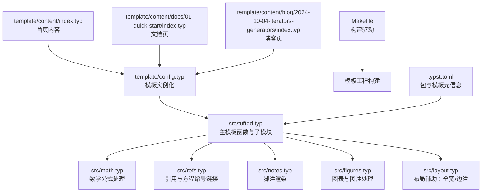
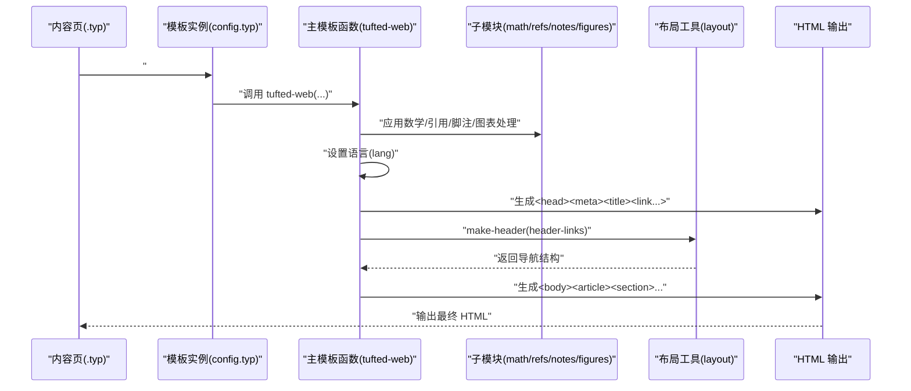
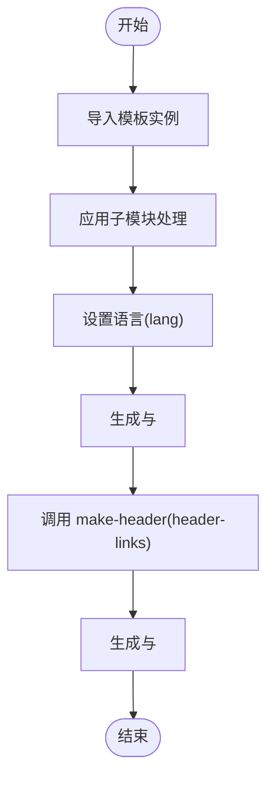
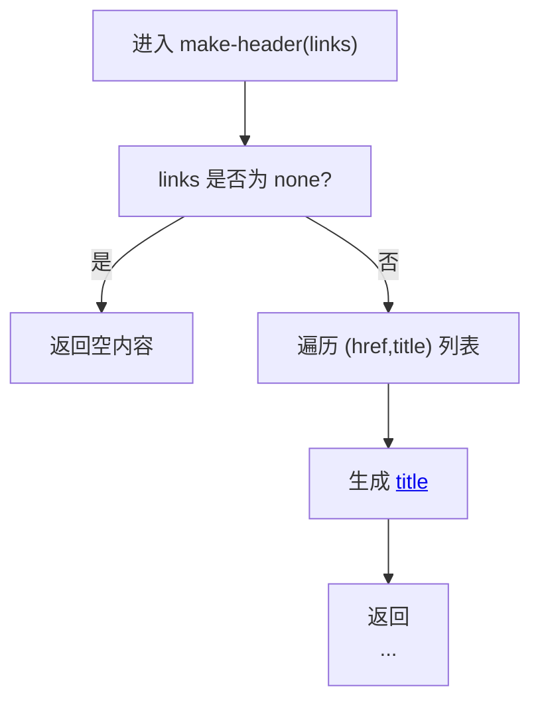
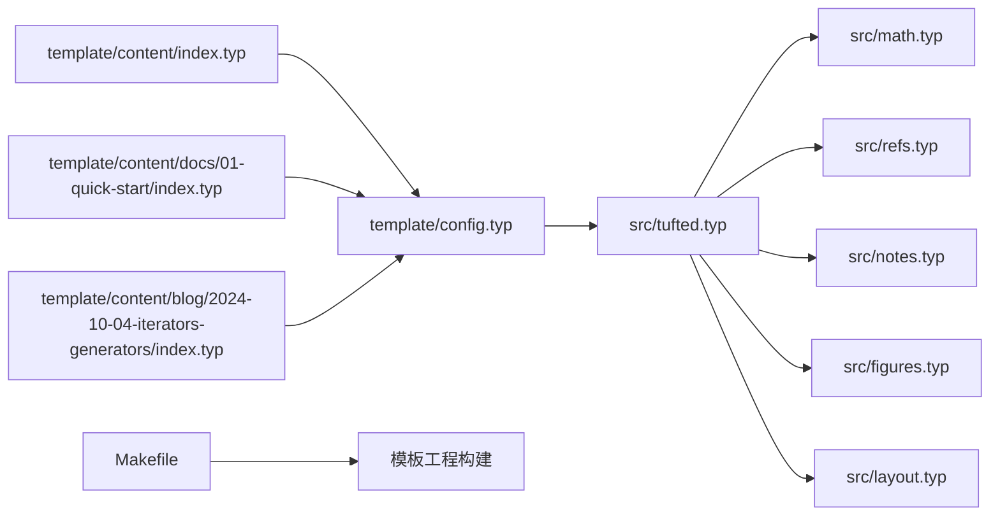

# 模板函数核心

<cite>
**本文引用的文件**
- [src/tufted.typ](file://src/tufted.typ)
- [src/math.typ](file://src/math.typ)
- [src/refs.typ](file://src/refs.typ)
- [src/notes.typ](file://src/notes.typ)
- [src/figures.typ](file://src/figures.typ)
- [src/layout.typ](file://src/layout.typ)
- [template/config.typ](file://template/config.typ)
- [template/content/index.typ](file://template/content/index.typ)
- [template/content/docs/01-quick-start/index.typ](file://template/content/docs/01-quick-start/index.typ)
- [template/content/blog/2024-10-04-iterators-generators/index.typ](file://template/content/blog/2024-10-04-iterators-generators/index.typ)
- [Makefile](file://Makefile)
- [typst.toml](file://typst.toml)
</cite>

## 目录
1. [简介](#简介)
2. [项目结构](#项目结构)
3. [核心组件](#核心组件)
4. [架构总览](#架构总览)
5. [详细组件分析](#详细组件分析)
6. [依赖关系分析](#依赖关系分析)
7. [性能考量](#性能考量)
8. [故障排查指南](#故障排查指南)
9. [结论](#结论)
10. [附录](#附录)

## 简介
本文件聚焦于 tufted-web 的主模板函数设计与实现，系统性解析其参数配置（header-links、title、lang、css 等）的作用与默认值；梳理从模板导入到 HTML 结构生成的完整执行流程；深入说明 make-header 函数的实现原理与导航链接处理机制；并给出基础与高级使用示例，以及模板函数与内容处理管道的集成方式。

## 项目结构
该仓库采用“包模板”组织方式：
- 包入口位于 src/tufted.typ，定义主模板函数 tufted-web 及其子模块（数学、引用、脚注、图表等）。
- 模板入口位于 template/config.typ，通过 tufted-web.with(...) 构建页面模板实例，并在各内容页中通过 #show: 指令应用模板。
- 内容位于 template/content 下，按文档、博客、CV 等分类组织。
- 构建由 Makefile 驱动，调用模板工程的构建目标。

**图表来源**
- [src/tufted.typ:1-64](file://src/tufted.typ#L1-L64)
- [src/math.typ:1-22](file://src/math.typ#L1-L22)
- [src/refs.typ:1-23](file://src/refs.typ#L1-L23)
- [src/notes.typ:1-27](file://src/notes.typ#L1-L27)
- [src/figures.typ:1-20](file://src/figures.typ#L1-L20)
- [src/layout.typ:1-13](file://src/layout.typ#L1-L13)
- [template/config.typ:1-12](file://template/config.typ#L1-L12)
- [template/content/index.typ:1-33](file://template/content/index.typ#L1-L33)
- [template/content/docs/01-quick-start/index.typ:1-24](file://template/content/docs/01-quick-start/index.typ#L1-L24)
- [template/content/blog/2024-10-04-iterators-generators/index.typ:1-53](file://template/content/blog/2024-10-04-iterators-generators/index.typ#L1-L53)
- [Makefile:1-60](file://Makefile#L1-L60)
- [typst.toml:1-19](file://typst.toml#L1-L19)

**章节来源**
- [Makefile:1-60](file://Makefile#L1-L60)
- [typst.toml:1-19](file://typst.toml#L1-L19)

## 核心组件
- 主模板函数 tufted-web：负责整体 HTML 结构生成、样式注入、语言设置、头部导航与正文包裹。
- 子模块：
  - 数学模板：为行内与块级公式提供 HTML 角色与框架化输出。
  - 引用模板：将方程引用转换为带编号的链接。
  - 脚注模板：在正文中插入上标引用，在边注区渲染脚注内容。
  - 图表模板：重写图注与图表容器，使其适配边注布局。
- 布局工具：提供 margin-note 与 full-width 辅助，便于内容侧边注与全宽元素。
- 模板实例化：通过 template.config.typ 使用 tufted-web.with(...) 构建页面模板实例，并在内容页中应用。

**章节来源**
- [src/tufted.typ:17-63](file://src/tufted.typ#L17-L63)
- [src/math.typ:1-22](file://src/math.typ#L1-L22)
- [src/refs.typ:1-23](file://src/refs.typ#L1-L23)
- [src/notes.typ:1-27](file://src/notes.typ#L1-L27)
- [src/figures.typ:1-20](file://src/figures.typ#L1-L20)
- [src/layout.typ:1-13](file://src/layout.typ#L1-L13)
- [template/config.typ:1-12](file://template/config.typ#L1-L12)

## 架构总览
下图展示了从内容页到最终 HTML 的端到端流程：内容页导入模板实例，模板实例调用主模板函数 tufted-web，后者依次应用数学/引用/脚注/图表处理，设置语言与样式，生成 HTML 头部与主体，并通过 make-header 插入导航栏。

**图表来源**
- [template/content/index.typ:1-33](file://template/content/index.typ#L1-L33)
- [template/config.typ:1-12](file://template/config.typ#L1-L12)
- [src/tufted.typ:17-63](file://src/tufted.typ#L17-L63)
- [src/math.typ:1-22](file://src/math.typ#L1-L22)
- [src/refs.typ:1-23](file://src/refs.typ#L1-L23)
- [src/notes.typ:1-27](file://src/notes.typ#L1-L27)
- [src/figures.typ:1-20](file://src/figures.typ#L1-L20)
- [src/layout.typ:1-13](file://src/layout.typ#L1-L13)

## 详细组件分析

### 主模板函数 tufted-web 参数与默认值
- header-links: 导航链接集合，默认为 none。当提供时，会传递给 make-header 生成导航条目。
- title: 页面标题，默认为 "Tufted"。用于生成 <title> 标签。
- lang: 文档语言，默认为 "en"。用于设置 html 元素的 lang 属性及文本语言。
- css: 样式表列表，默认包含 Tufte CSS CDN 与本地样式文件。循环遍历并生成多个 <link rel="stylesheet">。
- content: 主体内容，被包裹在 <article><section> 中输出。

上述参数在主模板函数定义处声明并传入相应处理逻辑。

**章节来源**
- [src/tufted.typ:17-27](file://src/tufted.typ#L17-L27)

### 执行流程：从模板导入到 HTML 结构生成
- 模板导入与实例化：template/config.typ 通过 tufted-web.with(...) 构建模板实例，设置 header-links 与 title 等默认值。
- 内容页应用：template/content 下的各页面通过 #show: 指令应用模板实例。
- 主模板执行：
  - 应用子模块：依次应用数学、引用、脚注、图表处理。
  - 设置语言：设置全局文本语言。
  - 生成 head：添加字符集、视口、标题与样式表链接。
  - 生成 body：调用 make-header(header-links) 插入导航，再包裹 <article><section> 输出内容。
- 输出：最终生成完整的 HTML 文档。

**图表来源**
- [src/tufted.typ:27-63](file://src/tufted.typ#L27-L63)
- [template/config.typ:1-12](file://template/config.typ#L1-L12)
- [template/content/index.typ:1-33](file://template/content/index.typ#L1-L33)

**章节来源**
- [src/tufted.typ:27-63](file://src/tufted.typ#L27-L63)
- [template/content/index.typ:1-33](file://template/content/index.typ#L1-L33)

### make-header 函数实现与导航链接处理
- 实现位置：主模板函数内部定义，接收 links 参数。
- 行为：
  - 若 links 不为 none，则生成 <nav> 容器；
  - 遍历 links 中的每个 (href, title) 对，生成 <a href=...>title</a>；
  - 若 links 为 none，则不生成导航。
- 作用：将模板实例中的导航配置映射为 HTML 导航条。

**图表来源**
- [src/tufted.typ:7-15](file://src/tufted.typ#L7-L15)

**章节来源**
- [src/tufted.typ:7-15](file://src/tufted.typ#L7-L15)

### 子模块与内容处理管道的集成
- 数学模板：为行内与块级公式设置角色与框架化输出，确保 HTML 渲染一致性。
- 引用模板：将方程引用转换为带编号的链接，增强可读性与可跳转性。
- 脚注模板：在正文生成上标引用，在边注区渲染脚注内容，提升阅读体验。
- 图表模板：重写图注与图表容器，使其适配边注布局，保持版式统一。
- 布局工具：提供 margin-note 与 full-width，便于在内容中插入边注与全宽元素。

这些模块通过 show 指令与内容处理管道集成，先于主模板生成 HTML，保证最终输出符合预期。

**章节来源**
- [src/math.typ:1-22](file://src/math.typ#L1-L22)
- [src/refs.typ:1-23](file://src/refs.typ#L1-L23)
- [src/notes.typ:1-27](file://src/notes.typ#L1-L27)
- [src/figures.typ:1-20](file://src/figures.typ#L1-L20)
- [src/layout.typ:1-13](file://src/layout.typ#L1-L13)

### 使用示例

- 基础用法
  - 在内容页中导入模板实例并应用：
    - 参考路径：[template/content/index.typ:1-33](file://template/content/index.typ#L1-L33)
    - 关键点：通过 #import 引入 template，并使用 #show: 指令应用模板。
  - 模板实例化参考：[template/config.typ:1-12](file://template/config.typ#L1-L12)

- 高级配置
  - 自定义标题：在内容页中通过 template.with(...) 临时覆盖 title，例如：
    - 参考路径：[template/content/docs/01-quick-start/index.typ:1-24](file://template/content/docs/01-quick-start/index.typ#L1-L24)
  - 自定义导航：在模板实例中通过 header-links 提供导航项，例如：
    - 参考路径：[template/config.typ:3-11](file://template/config.typ#L3-L11)

- 构建与发布
  - 本地开发：通过 Makefile 的 html 目标触发模板工程构建。
    - 参考路径：[Makefile:54-56](file://Makefile#L54-L56)
  - 包元信息：typst.toml 定义包名、版本、入口与模板路径。
    - 参考路径：[typst.toml:1-19](file://typst.toml#L1-L19)

**章节来源**
- [template/content/index.typ:1-33](file://template/content/index.typ#L1-L33)
- [template/content/docs/01-quick-start/index.typ:1-24](file://template/content/docs/01-quick-start/index.typ#L1-L24)
- [template/config.typ:1-12](file://template/config.typ#L1-L12)
- [Makefile:54-56](file://Makefile#L54-L56)
- [typst.toml:1-19](file://typst.toml#L1-L19)

## 依赖关系分析
- 主模板函数依赖子模块：数学、引用、脚注、图表处理，以及布局工具。
- 模板实例化依赖主模板函数的 with(...) 方法，以定制 header-links、title 等参数。
- 内容页通过 #show: 指令与模板实例耦合，形成“内容-模板-输出”的单向依赖链。
- 构建系统通过 Makefile 驱动模板工程构建，间接影响模板函数的可用性与样式加载。

**图表来源**
- [src/tufted.typ:1-64](file://src/tufted.typ#L1-L64)
- [src/math.typ:1-22](file://src/math.typ#L1-L22)
- [src/refs.typ:1-23](file://src/refs.typ#L1-L23)
- [src/notes.typ:1-27](file://src/notes.typ#L1-L27)
- [src/figures.typ:1-20](file://src/figures.typ#L1-L20)
- [src/layout.typ:1-13](file://src/layout.typ#L1-L13)
- [template/config.typ:1-12](file://template/config.typ#L1-L12)
- [template/content/index.typ:1-33](file://template/content/index.typ#L1-L33)
- [template/content/docs/01-quick-start/index.typ:1-24](file://template/content/docs/01-quick-start/index.typ#L1-L24)
- [template/content/blog/2024-10-04-iterators-generators/index.typ:1-53](file://template/content/blog/2024-10-04-iterators-generators/index.typ#L1-L53)
- [Makefile:54-56](file://Makefile#L54-L56)

**章节来源**
- [src/tufted.typ:1-64](file://src/tufted.typ#L1-L64)
- [template/config.typ:1-12](file://template/config.typ#L1-L12)
- [template/content/index.typ:1-33](file://template/content/index.typ#L1-L33)
- [Makefile:54-56](file://Makefile#L54-L56)

## 性能考量
- 样式加载：默认包含 CDN 与本地样式，建议在生产环境考虑缓存策略与最小化资源体积。
- 内容处理：数学、引用、脚注、图表处理均为内容级转换，复杂度与内容规模线性相关，注意避免超大公式或大量脚注导致渲染时间增长。
- 构建效率：通过 Makefile 统一构建入口，减少重复工作；合理组织内容目录，避免不必要的递归扫描。

## 故障排查指南
- 导航未显示：检查模板实例中的 header-links 是否正确传入，以及 make-header 的调用是否生效。
  - 参考路径：[src/tufted.typ:7-15](file://src/tufted.typ#L7-L15)，[template/config.typ:3-11](file://template/config.typ#L3-L11)
- 标题或语言异常：确认模板实例中 title 与 lang 的设置，以及主模板函数中对 lang 的应用。
  - 参考路径：[src/tufted.typ:18-21](file://src/tufted.typ#L18-L21)，[src/tufted.typ:34](file://src/tufted.typ#L34)
- 样式缺失：核对 css 列表中的链接是否可达，以及模板实例中是否覆盖了默认样式。
  - 参考路径：[src/tufted.typ:21-25](file://src/tufted.typ#L21-L25)，[template/config.typ:3-11](file://template/config.typ#L3-L11)
- 脚注/图注错位：检查图表模板与布局工具的配合，确保图注与边注容器类名一致。
  - 参考路径：[src/figures.typ:3-19](file://src/figures.typ#L3-L19)，[src/layout.typ:3-12](file://src/layout.typ#L3-L12)
- 构建失败：确认 Makefile 与 typst.toml 的路径与版本匹配，必要时重新链接本地包缓存。
  - 参考路径：[Makefile:1-60](file://Makefile#L1-L60)，[typst.toml:1-19](file://typst.toml#L1-L19)

**章节来源**
- [src/tufted.typ:7-15](file://src/tufted.typ#L7-L15)
- [src/tufted.typ:18-21](file://src/tufted.typ#L18-L21)
- [src/tufted.typ:21-25](file://src/tufted.typ#L21-L25)
- [src/figures.typ:3-19](file://src/figures.typ#L3-L19)
- [src/layout.typ:3-12](file://src/layout.typ#L3-L12)
- [template/config.typ:3-11](file://template/config.typ#L3-L11)
- [Makefile:1-60](file://Makefile#L1-L60)
- [typst.toml:1-19](file://typst.toml#L1-L19)

## 结论
tufted-web 主模板函数以清晰的参数化设计与模块化子系统为核心，实现了从内容到 HTML 的高效转换。通过 make-header 与布局工具的配合，提供了简洁而强大的导航与排版能力。结合模板实例化与内容页的 #show: 指令，开发者可以快速搭建风格一致、易于维护的静态网站。

## 附录
- 快速定位
  - 主模板函数定义与参数：[src/tufted.typ:17-27](file://src/tufted.typ#L17-L27)
  - make-header 实现：[src/tufted.typ:7-15](file://src/tufted.typ#L7-L15)
  - 子模块处理：[src/math.typ:1-22](file://src/math.typ#L1-L22)，[src/refs.typ:1-23](file://src/refs.typ#L1-L23)，[src/notes.typ:1-27](file://src/notes.typ#L1-L27)，[src/figures.typ:1-20](file://src/figures.typ#L1-L20)
  - 模板实例化：[template/config.typ:1-12](file://template/config.typ#L1-L12)
  - 内容页应用示例：[template/content/index.typ:1-33](file://template/content/index.typ#L1-L33)，[template/content/docs/01-quick-start/index.typ:1-24](file://template/content/docs/01-quick-start/index.typ#L1-L24)，[template/content/blog/2024-10-04-iterators-generators/index.typ:1-53](file://template/content/blog/2024-10-04-iterators-generators/index.typ#L1-L53)
  - 构建与元信息：[Makefile:54-56](file://Makefile#L54-L56)，[typst.toml:1-19](file://typst.toml#L1-L19)