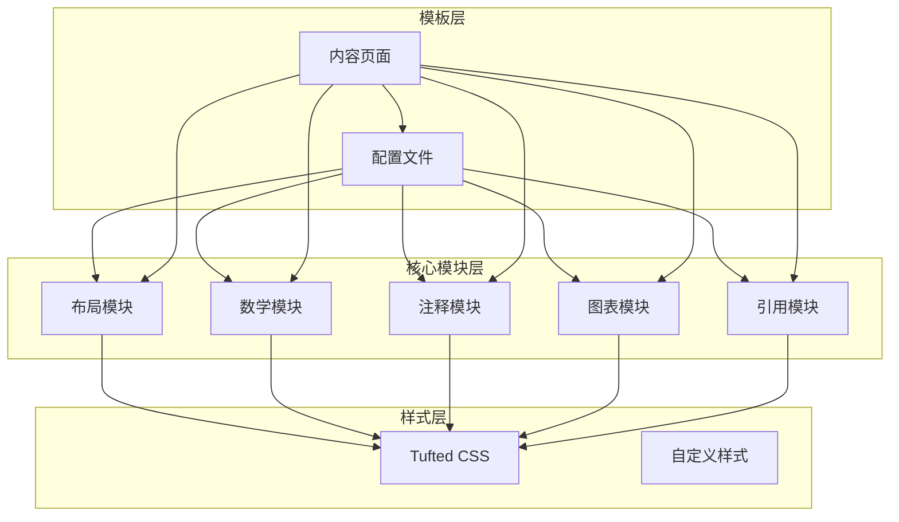
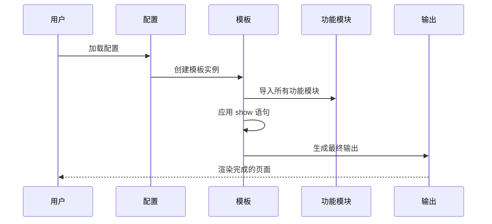
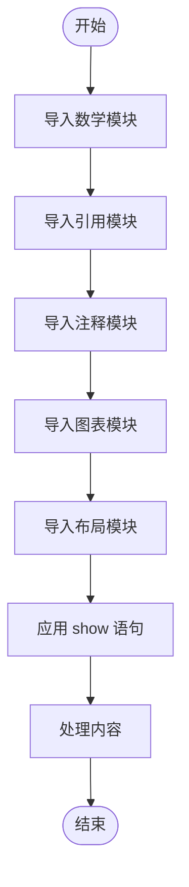
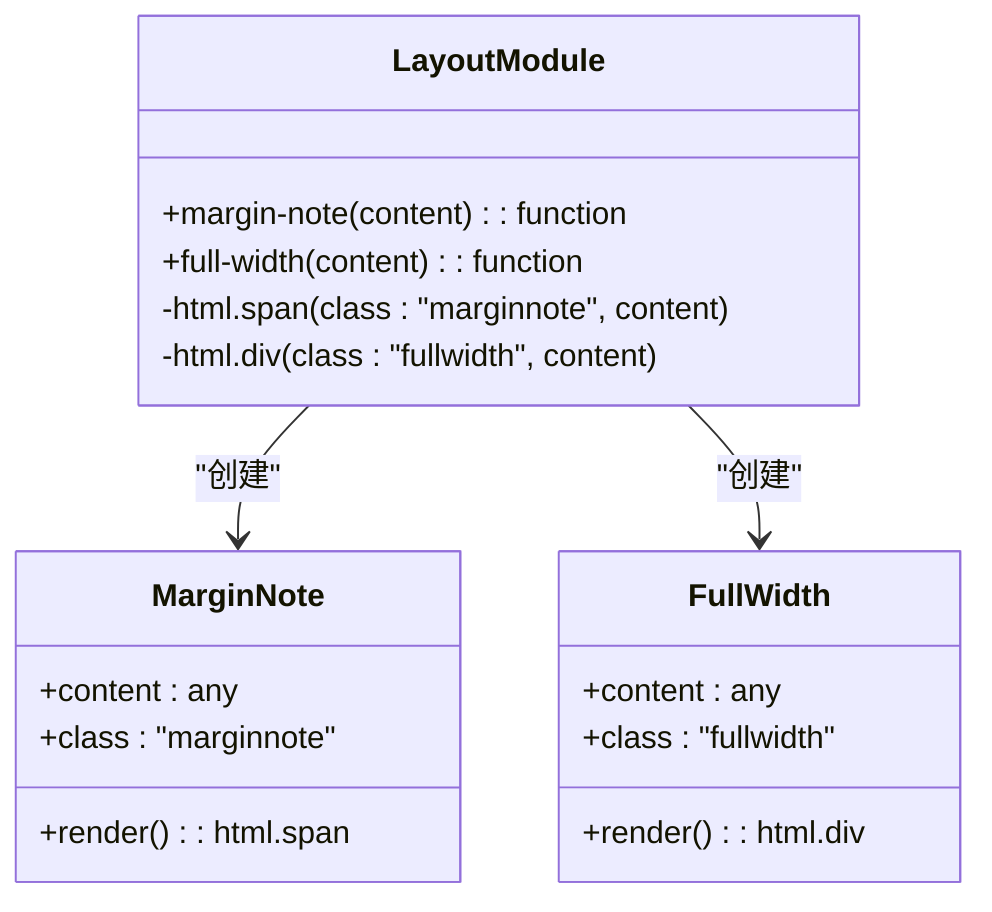
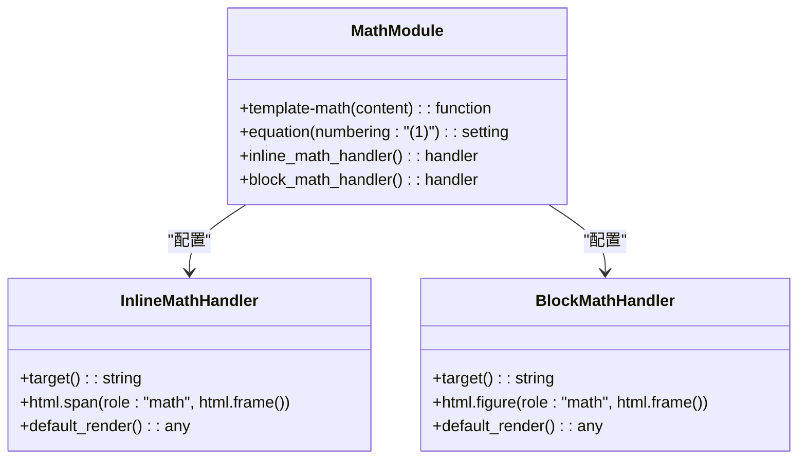
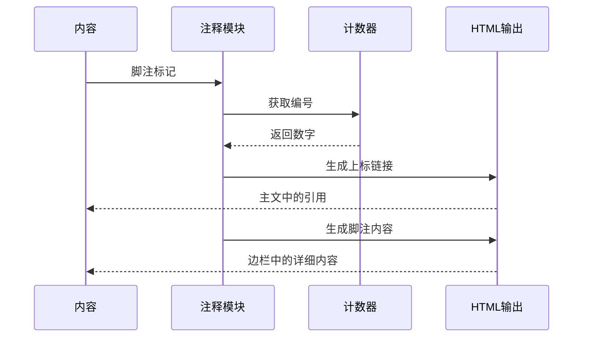
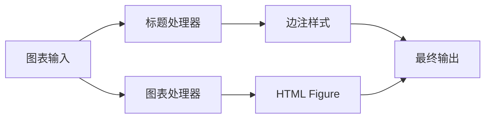
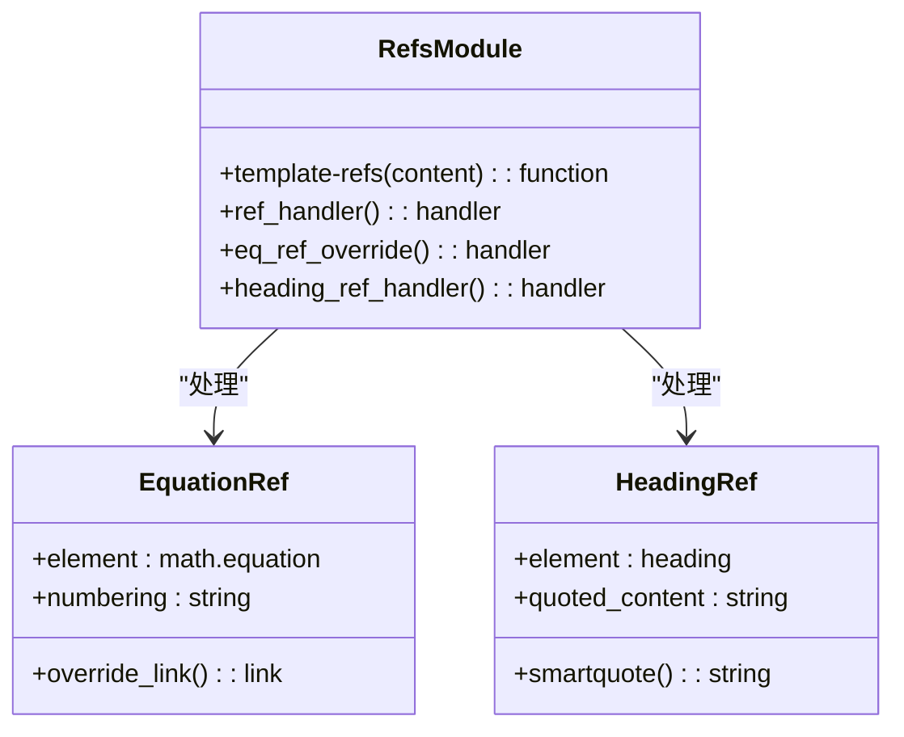
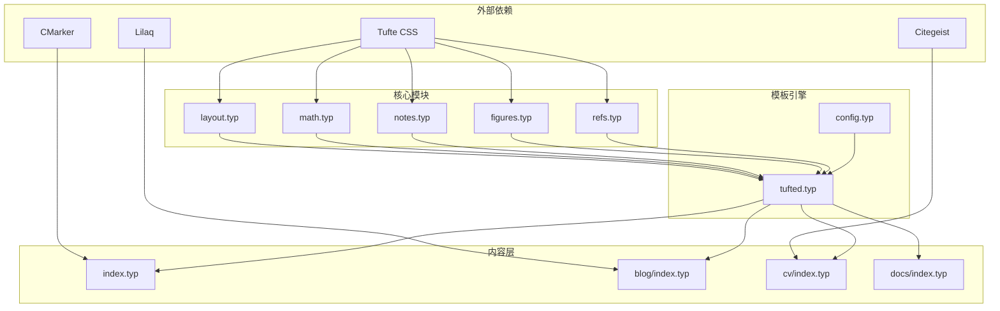

# 模板导入系统

<cite>
**本文档引用的文件**
- [src/layout.typ](file://src/layout.typ)
- [src/math.typ](file://src/math.typ)
- [src/notes.typ](file://src/notes.typ)
- [src/figures.typ](file://src/figures.typ)
- [src/refs.typ](file://src/refs.typ)
- [src/tufted.typ](file://src/tufted.typ)
- [template/config.typ](file://template/config.typ)
- [template/content/index.typ](file://template/content/index.typ)
- [template/content/blog/2025-10-30-normal-distribution/index.typ](file://template/content/blog/2025-10-30-normal-distribution/index.typ)
- [template/assets/tufted.css](file://template/assets/tufted.css)
</cite>

## 目录
1. [简介](#简介)
2. [项目结构](#项目结构)
3. [核心组件](#核心组件)
4. [架构概览](#架构概览)
5. [详细组件分析](#详细组件分析)
6. [依赖关系分析](#依赖关系分析)
7. [性能考量](#性能考量)
8. [故障排除指南](#故障排除指南)
9. [结论](#结论)

## 简介

TwilightPage 模板采用模块化设计，通过独立的功能模块实现特定的排版和渲染功能。该系统基于 Typst 的导入机制，将布局、数学公式、注释、图表和引用等核心功能分解为可重用的模块，支持灵活的功能组合和扩展。

## 项目结构

模板系统采用分层架构，主要包含以下层次：

**图表来源**
- [src/tufted.typ:1-64](file://src/tufted.typ#L1-L64)
- [template/config.typ:1-12](file://template/config.typ#L1-L12)

**章节来源**
- [src/tufted.typ:1-64](file://src/tufted.typ#L1-L64)
- [template/config.typ:1-12](file://template/config.typ#L1-L12)

## 核心组件

### 布局模块 (layout.typ)

布局模块提供基础的页面布局功能，主要包括边注和全宽内容的支持：

- **边注功能**: `margin-note` 函数用于创建侧边注释，通过 HTML span 元素实现
- **全宽内容**: `full-width` 函数用于创建全宽布局内容

### 数学模块 (math.typ)

数学模块专门处理数学公式的渲染和编号：

- **方程编号**: 支持自动编号的数学方程
- **内联数学**: 针对 HTML 目标的特殊处理
- **块级数学**: 方程作为独立图形显示

### 注释模块 (notes.typ)

注释模块负责脚注和边注的完整实现：

- **脚注渲染**: 自动编号和链接生成
- **HTML 特殊处理**: 在 HTML 输出中生成适当的链接结构
- **数字引用**: 主文中使用上标数字进行引用

### 图表模块 (figures.typ)

图表模块扩展了标准图表功能：

- **图表标题**: 使用边注样式渲染图表标题
- **图表包装**: 在 HTML 中使用 figure 元素包装图表
- **布局集成**: 与布局模块协同工作

### 引用模块 (refs.typ)

引用模块提供智能引用处理：

- **方程引用**: 特殊处理数学方程的引用
- **元素引用**: 支持不同类型的元素引用
- **智能引号**: 对标题引用使用智能引号

**章节来源**
- [src/layout.typ:1-13](file://src/layout.typ#L1-L13)
- [src/math.typ:1-22](file://src/math.typ#L1-L22)
- [src/notes.typ:1-27](file://src/notes.typ#L1-L27)
- [src/figures.typ:1-20](file://src/figures.typ#L1-L20)
- [src/refs.typ:1-23](file://src/refs.typ#L1-L23)

## 架构概览

模板系统采用装饰器模式，通过 `show` 语句应用各个功能模块：

**图表来源**
- [src/tufted.typ:17-63](file://src/tufted.typ#L17-L63)

### 模块导入流程

**图表来源**
- [src/tufted.typ:1-6](file://src/tufted.typ#L1-L6)

**章节来源**
- [src/tufted.typ:1-64](file://src/tufted.typ#L1-L64)

## 详细组件分析

### 布局模块详细分析

布局模块是整个模板系统的基础，提供了最基本的页面布局功能：

**图表来源**
- [src/layout.typ:3-12](file://src/layout.typ#L3-L12)

布局模块的关键特性：
- **边注样式**: 通过 CSS 类名 `marginnote` 实现
- **全宽布局**: 通过 CSS 类名 `fullwidth` 实现
- **HTML 兼容**: 直接生成 HTML 元素

**章节来源**
- [src/layout.typ:1-13](file://src/layout.typ#L1-L13)

### 数学模块详细分析

数学模块专注于数学公式的渲染和编号：

**图表来源**
- [src/math.typ:1-22](file://src/math.typ#L1-L22)

数学模块的核心功能：
- **自动编号**: 支持 `(1)` 样式的方程编号
- **目标检测**: 区分 HTML 和非 HTML 输出
- **结构化渲染**: 将数学内容包装在适当的 HTML 结构中

**章节来源**
- [src/math.typ:1-22](file://src/math.typ#L1-L22)

### 注释模块详细分析

注释模块实现了完整的脚注系统：

**图表来源**
- [src/notes.typ:1-27](file://src/notes.typ#L1-L27)

注释模块的复杂逻辑：
- **编号管理**: 使用计数器系统确保编号一致性
- **双向链接**: 主文引用与脚注内容之间的相互链接
- **HTML 结构**: 生成语义化的 HTML 结构

**章节来源**
- [src/notes.typ:1-27](file://src/notes.typ#L1-L27)

### 图表模块详细分析

图表模块扩展了标准图表功能：

**图表来源**
- [src/figures.typ:3-19](file://src/figures.typ#L3-L19)

图表模块的特点：
- **标题样式**: 使用边注样式渲染图表标题
- **HTML 包装**: 在 HTML 中使用 figure 元素
- **布局集成**: 与布局模块无缝协作

**章节来源**
- [src/figures.typ:1-20](file://src/figures.typ#L1-L20)

### 引用模块详细分析

引用模块提供了智能的引用处理：

**图表来源**
- [src/refs.typ:1-23](file://src/refs.typ#L1-L23)

引用模块的智能特性：
- **类型检测**: 区分不同类型的引用元素
- **方程引用**: 特殊处理数学方程引用
- **智能引号**: 对标题引用使用智能引号

**章节来源**
- [src/refs.typ:1-23](file://src/refs.typ#L1-L23)

## 依赖关系分析

模块间的依赖关系形成了清晰的层次结构：

**图表来源**
- [src/tufted.typ:1-6](file://src/tufted.typ#L1-L6)
- [template/content/index.typ:1-33](file://template/content/index.typ#L1-L33)
- [template/content/blog/2025-10-30-normal-distribution/index.typ:1-56](file://template/content/blog/2025-10-30-normal-distribution/index.typ#L1-L56)

### 导入顺序的重要性

正确的导入顺序对于模块功能的正常工作至关重要：

1. **布局模块优先**: 提供基础的 HTML 元素支持
2. **数学模块**: 处理数学公式渲染
3. **注释模块**: 实现脚注功能
4. **图表模块**: 扩展图表功能
5. **引用模块**: 最后应用引用处理

**章节来源**
- [src/tufted.typ:1-6](file://src/tufted.typ#L1-L6)

## 性能考量

模块化设计带来了多方面的性能优势：

### 编译时优化
- **按需加载**: 只导入实际使用的模块
- **缓存机制**: 模块结果可以被缓存复用
- **增量编译**: 修改单个模块不影响其他模块

### 运行时效率
- **函数式编程**: 模块间通过纯函数交互
- **不可变数据**: 减少状态管理开销
- **延迟执行**: 按需处理内容

### 内存使用
- **模块隔离**: 各模块独立管理自己的状态
- **垃圾回收**: 独立的模块生命周期
- **资源清理**: 模块卸载时释放资源

## 故障排除指南

### 常见问题及解决方案

#### 模块导入错误
**问题**: `module not found` 错误
**原因**: 模块路径不正确或模块未安装
**解决**: 检查 `import` 语句中的路径，确保模块已正确安装

#### 样式冲突
**问题**: 页面样式异常
**原因**: CSS 优先级冲突或样式覆盖
**解决**: 检查 `tufted.css` 和 `custom.css` 的加载顺序

#### 数学公式渲染问题
**问题**: 数学公式显示异常
**原因**: 数学模块配置错误或 LaTeX 语法问题
**解决**: 验证数学公式语法，检查 `math.equation` 设置

#### 脚注链接失效
**问题**: 脚注引用无法跳转
**原因**: 编号系统冲突或 HTML 结构问题
**解决**: 检查脚注编号生成逻辑，验证 HTML 链接结构

**章节来源**
- [src/tufted.typ:17-63](file://src/tufted.typ#L17-L63)
- [template/assets/tufted.css:1-166](file://template/assets/tufted.css#L1-L166)

## 结论

TwilightPage 模板的模块化导入机制展现了现代文档生成系统的最佳实践。通过将功能分解为独立的模块，系统实现了：

### 设计优势
- **高内聚低耦合**: 每个模块专注于单一功能
- **可重用性**: 模块可以在不同项目中重复使用
- **可测试性**: 独立的模块便于单元测试
- **可维护性**: 模块边界清晰，易于维护

### 扩展性考虑
- **插件架构**: 新功能可以通过添加新模块实现
- **配置驱动**: 通过配置文件控制模块行为
- **主题系统**: 支持不同的样式主题
- **国际化**: 模块化设计便于本地化扩展

### 最佳实践建议
1. **保持模块独立**: 每个模块应有明确的职责边界
2. **遵循依赖原则**: 依赖关系应尽量简单清晰
3. **文档化接口**: 模块接口应有清晰的文档说明
4. **版本管理**: 模块版本应有明确的管理策略
5. **性能监控**: 定期评估模块性能影响

这种模块化设计不仅提高了代码质量，还为未来的功能扩展奠定了坚实的基础。