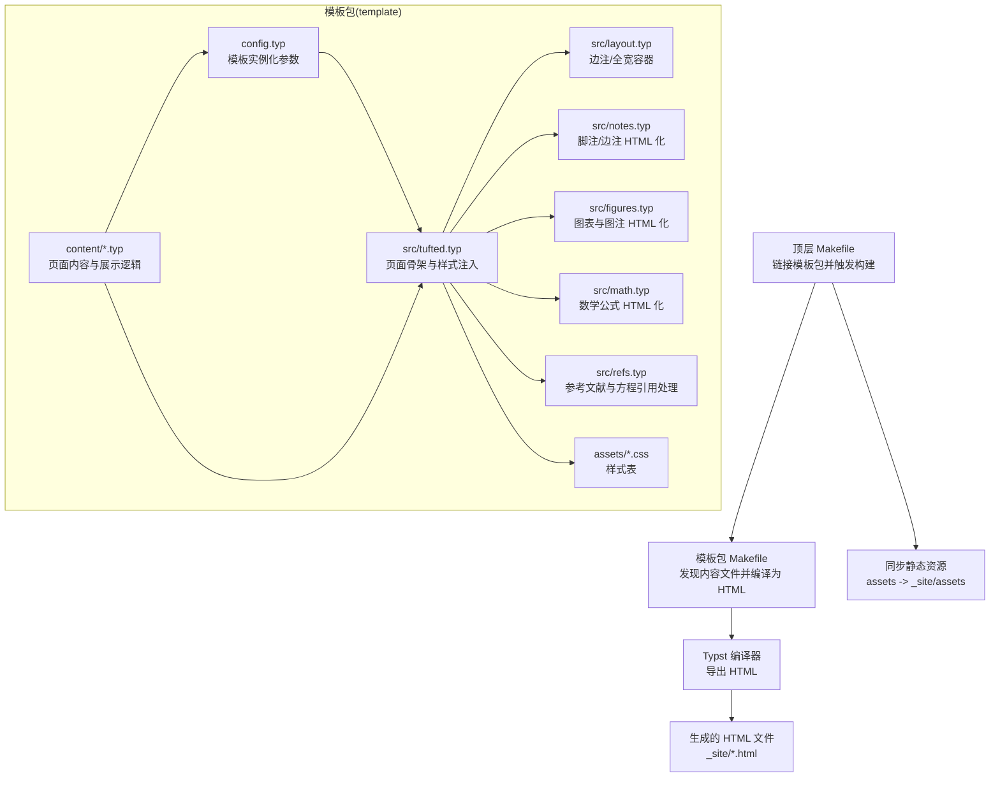
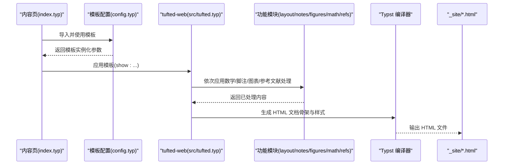
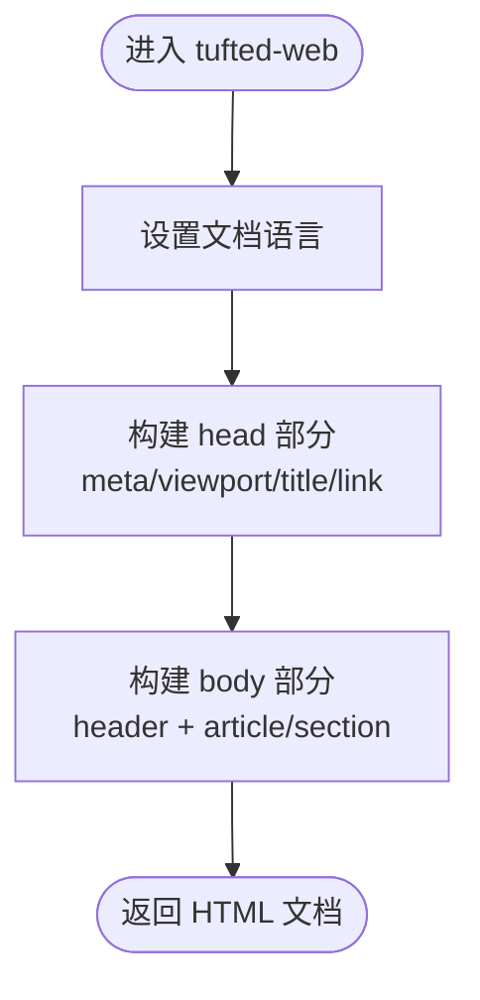
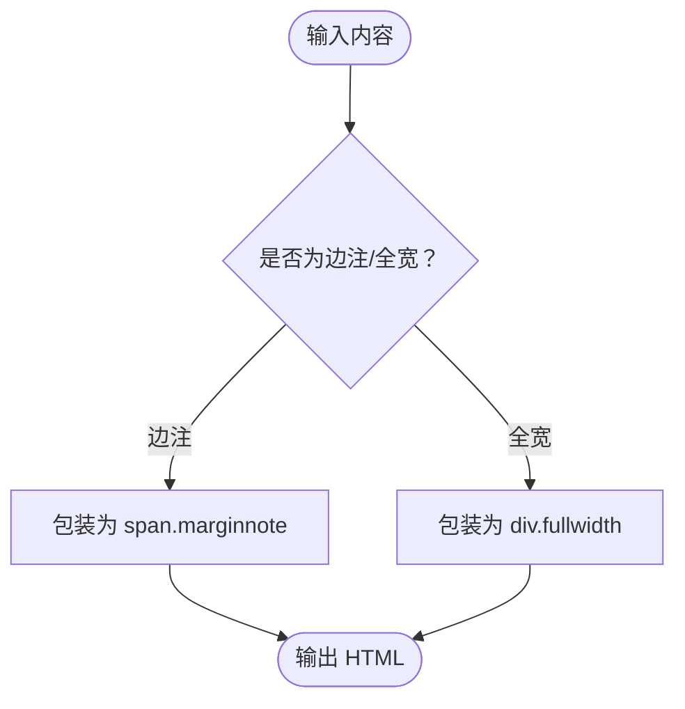
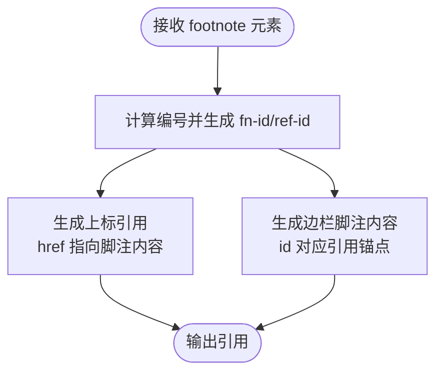
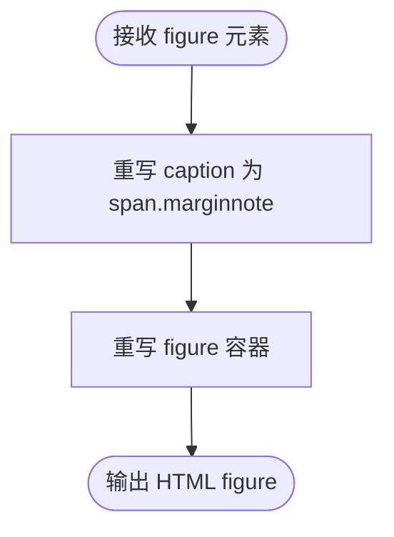
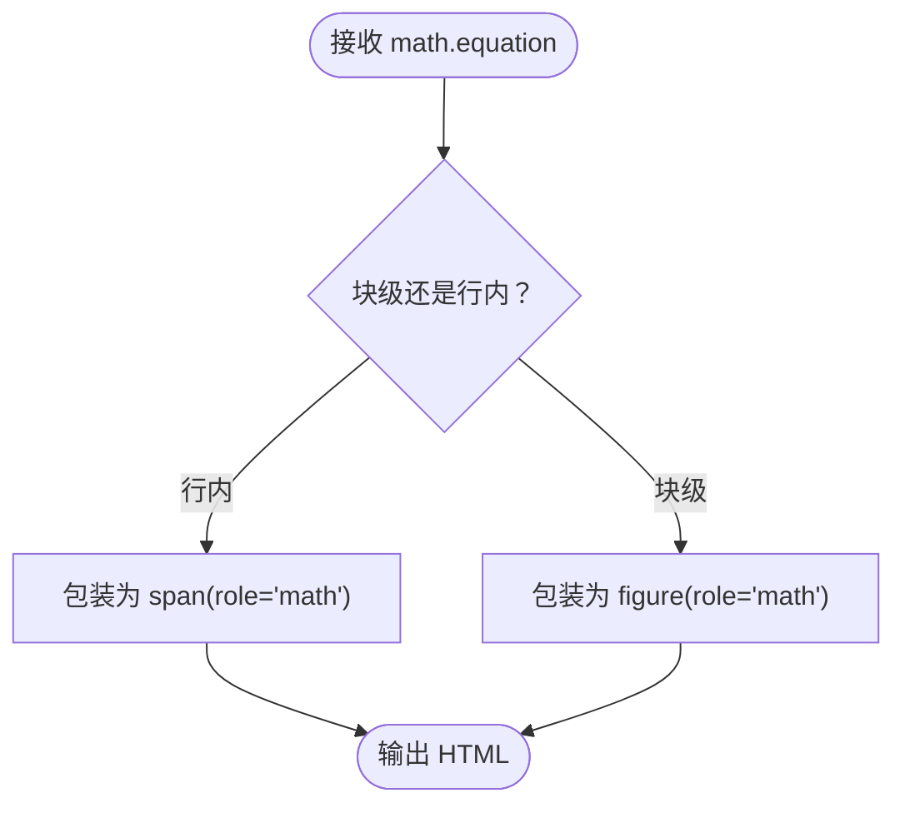
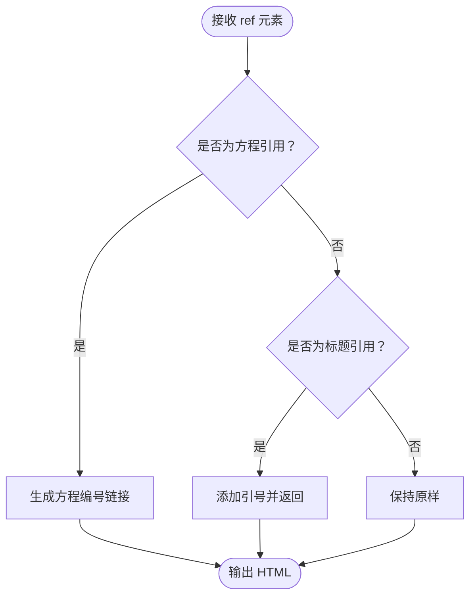
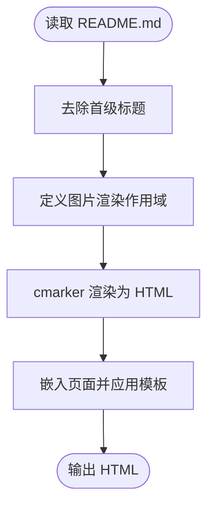
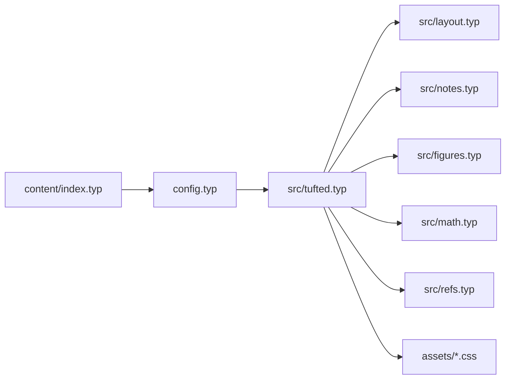

# 模板渲染流程

<cite>
**本文引用的文件**
- [template/README.md](file://template/README.md)
- [template/Makefile](file://template/Makefile)
- [Makefile](file://Makefile)
- [typst.toml](file://typst.toml)
- [template/config.typ](file://template/config.typ)
- [src/tufted.typ](file://src/tufted.typ)
- [src/layout.typ](file://src/layout.typ)
- [src/notes.typ](file://src/notes.typ)
- [src/figures.typ](file://src/figures.typ)
- [src/math.typ](file://src/math.typ)
- [src/refs.typ](file://src/refs.typ)
- [template/content/index.typ](file://template/content/index.typ)
- [template/assets/custom.css](file://template/assets/custom.css)
- [template/assets/tufted.css](file://template/assets/tufted.css)
</cite>

## 目录
1. [简介](#简介)
2. [项目结构](#项目结构)
3. [核心组件](#核心组件)
4. [架构总览](#架构总览)
5. [详细组件分析](#详细组件分析)
6. [依赖分析](#依赖分析)
7. [性能考虑](#性能考虑)
8. [故障排查指南](#故障排查指南)
9. [结论](#结论)
10. [附录](#附录)

## 简介
本文件面向希望深入理解 TwilightPage（基于 Typst 的实验性 HTML 导出）模板渲染流程与执行机制的读者。我们将从模板函数调用开始，逐步拆解内容处理、样式应用、结构生成等关键步骤，阐明数据在各处理阶段的流向与顺序，并给出渲染流程图与代码示例路径，帮助理解模板系统的内部工作机制。同时，我们也会讨论渲染性能与优化策略。

## 项目结构
TwilightPage 采用“包模板”结构：顶层通过一个可复用的模板包（template），模板包内包含内容、样式与构建脚本；外部项目通过链接本地模板包的方式进行构建。关键目录与文件如下：
- 外层构建与链接：顶层 Makefile 负责将模板包链接到本地缓存，再委托 template/Makefile 执行编译与资源拷贝。
- 模板包入口：template/config.typ 定义页面标题、导航链接与模板实例化参数。
- 核心模板实现：src/tufted.typ 提供页面骨架、头部、正文与样式注入逻辑。
- 功能模块：src/layout.typ、src/notes.typ、src/figures.typ、src/math.typ、src/refs.typ 分别负责布局、脚注/边注、图表、数学公式与参考文献的 HTML 化。
- 内容页：template/content/*.typ 是具体页面，通过导入模板配置并使用模板函数生成 HTML。
- 样式：template/assets/tufted.css 与 template/assets/custom.css 提供主题与自定义样式。

**图示来源**
- [Makefile:54-55](file://Makefile#L54-L55)
- [template/Makefile:14-16](file://template/Makefile#L14-L16)
- [src/tufted.typ:36-62](file://src/tufted.typ#L36-L62)
- [template/config.typ:3-11](file://template/config.typ#L3-L11)

**章节来源**
- [Makefile:1-60](file://Makefile#L1-L60)
- [template/Makefile:1-27](file://template/Makefile#L1-L27)
- [typst.toml:15-19](file://typst.toml#L15-L19)

## 核心组件
- 模板包入口与实例化
  - 模板包通过 config.typ 实例化 tufted-web，并传入标题、导航链接与样式列表。
  - 参考路径：[template/config.typ:3-11](file://template/config.typ#L3-L11)
- 页面骨架与样式注入
  - tufted-web 在 HTML 文档中注入 meta、title 与多条样式表（含 Tufte CSS CDN 与本地样式）。
  - 参考路径：[src/tufted.typ:36-62](file://src/tufted.typ#L36-L62)
- 布局与结构
  - layout.typ 提供 margin-note 与 full-width 两类容器，用于边注与全宽内容。
  - 参考路径：[src/layout.typ:3-12](file://src/layout.typ#L3-L12)
- 内容处理模块
  - notes.typ：将脚注编号与引用映射为 HTML 的上标与锚点，并在边栏生成脚注内容。
  - figures.typ：重写 figure 与其 caption 的显示方式，使其以边注形式呈现。
  - math.typ：将行内/块级数学公式转换为带 role 的 span 或 figure。
  - refs.typ：对特定元素（如方程）的引用进行特殊处理。
  - 参考路径：
    - [src/notes.typ:1-27](file://src/notes.typ#L1-L27)
    - [src/figures.typ:1-20](file://src/figures.typ#L1-L20)
    - [src/math.typ:1-22](file://src/math.typ#L1-L22)
    - [src/refs.typ:1-23](file://src/refs.typ#L1-L23)
- 内容页示例
  - content/index.typ 导入模板配置并使用模板函数，还演示了 Markdown 渲染与图片路径修正。
  - 参考路径：[template/content/index.typ:1-33](file://template/content/index.typ#L1-L33)

**章节来源**
- [template/config.typ:3-11](file://template/config.typ#L3-L11)
- [src/tufted.typ:36-62](file://src/tufted.typ#L36-L62)
- [src/layout.typ:3-12](file://src/layout.typ#L3-L12)
- [src/notes.typ:1-27](file://src/notes.typ#L1-L27)
- [src/figures.typ:1-20](file://src/figures.typ#L1-L20)
- [src/math.typ:1-22](file://src/math.typ#L1-L22)
- [src/refs.typ:1-23](file://src/refs.typ#L1-L23)
- [template/content/index.typ:1-33](file://template/content/index.typ#L1-L33)

## 架构总览
下图展示了从内容页到最终 HTML 输出的端到端流程：内容页导入模板配置，模板实例化后依次应用数学、参考文献、脚注/边注、图表处理模块，随后生成页面骨架与样式，最终由 Typst 编译器导出 HTML。

**图示来源**
- [template/content/index.typ:1-3](file://template/content/index.typ#L1-L3)
- [template/config.typ:3-11](file://template/config.typ#L3-L11)
- [src/tufted.typ:28-33](file://src/tufted.typ#L28-L33)
- [src/tufted.typ:36-62](file://src/tufted.typ#L36-L62)
- [template/Makefile:14-16](file://template/Makefile#L14-L16)

## 详细组件分析

### 组件一：页面骨架与样式注入（tufted-web）
- 作用
  - 生成 HTML 文档根节点，设置语言属性；
  - 注入 head 部分的 meta、title 与多条样式表；
  - 生成 body 部分的 header（导航）与 article/section 主体结构。
- 关键点
  - 样式数组包含 CDN 的 Tufte CSS 与本地 tufted.css、custom.css；
  - 通过 html.* API 构建结构，确保输出符合 HTML 规范。
- 数据流
  - 输入：模板参数（标题、导航链接、语言、样式数组、内容）；
  - 处理：按顺序插入 meta、title、link 样式，再包裹 header 与正文；
  - 输出：完整的 HTML 文档树。

**图示来源**
- [src/tufted.typ:36-62](file://src/tufted.typ#L36-L62)

**章节来源**
- [src/tufted.typ:17-63](file://src/tufted.typ#L17-L63)

### 组件二：布局与结构（layout）
- 作用
  - 提供 margin-note 与 full-width 两类容器，分别用于边注与全宽内容。
- 关键点
  - margin-note 使用 span 并赋予 marginnote 类名；
  - full-width 使用 div 并赋予 fullwidth 类名。
- 数据流
  - 输入：原始内容；
  - 处理：包装为带类名的 HTML 元素；
  - 输出：增强布局能力的 HTML 结构。

**图示来源**
- [src/layout.typ:3-12](file://src/layout.typ#L3-L12)

**章节来源**
- [src/layout.typ:1-13](file://src/layout.typ#L1-L13)

### 组件三：脚注与边注（notes）
- 作用
  - 将脚注编号与引用映射为 HTML 上标与锚点；
  - 在边栏生成脚注内容，支持引用与脚注内容之间的双向跳转。
- 关键点
  - 使用计数器生成编号并拼接 ID；
  - 引用与脚注内容通过 href 与 id 建立锚点关联；
  - 仅在目标为 HTML 时生效。
- 数据流
  - 输入：footnote 元素；
  - 处理：生成上标引用与边栏脚注内容；
  - 输出：HTML 上标与边栏 span.marginnote。

**图示来源**
- [src/notes.typ:2-24](file://src/notes.typ#L2-L24)

**章节来源**
- [src/notes.typ:1-27](file://src/notes.typ#L1-L27)

### 组件四：图表与图注（figures）
- 作用
  - 重写 figure 与其 caption 的显示方式，使图注以边注形式出现；
  - 保留图表主体与图注的组合结构。
- 关键点
  - 图注通过 marginnote 类名渲染；
  - 仅在目标为 HTML 时重写显示。
- 数据流
  - 输入：figure 元素；
  - 处理：将 caption 重写为 span.marginnote，figure 重写为 figure 容器；
  - 输出：HTML figure + 边注。

**图示来源**
- [src/figures.typ:3-18](file://src/figures.typ#L3-L18)

**章节来源**
- [src/figures.typ:1-20](file://src/figures.typ#L1-L20)

### 组件五：数学公式（math）
- 作用
  - 将行内与块级数学公式转换为带 role 的 span 或 figure；
  - 保持非 HTML 目标下的原样输出。
- 关键点
  - 行内公式使用 span(role="math")；
  - 块级公式使用 figure(role="math")；
  - 设置默认编号格式。
- 数据流
  - 输入：math.equation 元素；
  - 处理：根据块/行内类型选择容器；
  - 输出：HTML 数学容器。

**图示来源**
- [src/math.typ:4-18](file://src/math.typ#L4-L18)

**章节来源**
- [src/math.typ:1-22](file://src/math.typ#L1-L22)

### 组件六：参考文献（refs）
- 作用
  - 对特定元素（如方程）的引用进行特殊处理；
  - 对标题元素的引用使用引号包裹；
  - 其他情况保持原样。
- 关键点
  - 通过元素类型判断是否需要特殊处理；
  - 使用编号与定位信息生成链接。
- 数据流
  - 输入：ref 元素；
  - 处理：条件分支决定是否改写；
  - 输出：HTML 链接或原样返回。

**图示来源**
- [src/refs.typ:2-19](file://src/refs.typ#L2-L19)

**章节来源**
- [src/refs.typ:1-23](file://src/refs.typ#L1-L23)

### 组件七：内容页与 Markdown 集成（content/index.typ）
- 作用
  - 导入模板配置并应用；
  - 读取 README.md 并去除首级标题后，使用 cmarker 渲染为 HTML；
  - 展示边注与图片的使用示例。
- 关键点
  - 通过 scope 自定义图片渲染逻辑，修正相对路径；
  - 使用 tufted.margin-note 插入边注内容。
- 数据流
  - 输入：README.md 文本；
  - 处理：去头、渲染、图片路径修正；
  - 输出：HTML 片段并嵌入页面。

**图示来源**
- [template/content/index.typ:17-32](file://template/content/index.typ#L17-L32)

**章节来源**
- [template/content/index.typ:1-33](file://template/content/index.typ#L1-L33)

## 依赖分析
- 模块耦合与职责
  - tufted-web 作为顶层模板，聚合多个功能模块（数学、脚注、图表、参考文献、布局）；
  - 各模块通过 show/重写规则对内容进行局部增强，彼此低耦合；
  - 内容页仅通过导入模板配置即可获得完整功能。
- 外部依赖
  - Tufte CSS 通过 CDN 加载，提升排版一致性；
  - 本地样式通过 link 注入，便于覆盖与扩展。
- 构建链路
  - 顶层 Makefile 将模板包链接到本地缓存；
  - 模板包 Makefile 发现 content 下的 .typ 文件并编译为 _site/*.html；
  - 资源 assets 被复制到 _site/assets。

**图示来源**
- [template/content/index.typ:1-3](file://template/content/index.typ#L1-L3)
- [template/config.typ:3-11](file://template/config.typ#L3-L11)
- [src/tufted.typ:17-63](file://src/tufted.typ#L17-L63)

**章节来源**
- [Makefile:54-55](file://Makefile#L54-L55)
- [template/Makefile:2-8](file://template/Makefile#L2-L8)

## 性能考虑
- 编译阶段优化
  - 使用模板包缓存与符号链接避免重复下载与复制，缩短构建时间；
  - Makefile 通过模式规则并行发现与编译 content 下的 .typ 文件，提高效率。
- 运行时优化
  - 样式加载顺序合理：先 CDN 再本地，保证覆盖可控；
  - 响应式样式在窄屏自动切换边注显示方式，减少额外脚本开销。
- 内容渲染优化
  - 将 Markdown 预处理（去头、路径修正）放在内容页侧，减少模板层负担；
  - 图片尺寸限制与暗色模式适配，降低渲染压力与对比度问题。

[本节为通用性能建议，不直接分析具体文件，故无“章节来源”]

## 故障排查指南
- 构建失败
  - 确认本地模板包已正确链接至缓存（参考 Makefile 中 link 目标）；
  - 检查模板包 Makefile 是否能发现 content 下的 .typ 文件。
  - 参考路径：
    - [Makefile:11-23](file://Makefile#L11-L23)
    - [template/Makefile:2-5](file://template/Makefile#L2-L5)
- 样式未生效
  - 检查 link 标签顺序与路径是否正确；
  - 确认本地样式文件存在且未被清理。
  - 参考路径：
    - [src/tufted.typ:46-48](file://src/tufted.typ#L46-L48)
    - [template/assets/tufted.css:1-166](file://template/assets/tufted.css#L1-L166)
- 脚注/边注异常
  - 确认目标为 HTML 时才进行重写；
  - 检查编号生成与锚点 ID 是否一致。
  - 参考路径：
    - [src/notes.typ:3-21](file://src/notes.typ#L3-L21)
- 数学公式显示异常
  - 确认块/行内分类与 role 属性是否正确；
  - 检查 CDN 与本地样式是否冲突。
  - 参考路径：
    - [src/math.typ:4-18](file://src/math.typ#L4-L18)
- 参考文献链接错误
  - 检查元素类型判断与编号定位逻辑；
  - 确保引用目标存在对应编号。
  - 参考路径：
    - [src/refs.typ:8-14](file://src/refs.typ#L8-L14)

**章节来源**
- [Makefile:11-23](file://Makefile#L11-L23)
- [template/Makefile:2-5](file://template/Makefile#L2-L5)
- [src/tufted.typ:46-48](file://src/tufted.typ#L46-L48)
- [src/notes.typ:3-21](file://src/notes.typ#L3-L21)
- [src/math.typ:4-18](file://src/math.typ#L4-L18)
- [src/refs.typ:8-14](file://src/refs.typ#L8-L14)

## 结论
TwilightPage 的模板渲染流程以“模板包 + 多功能模块”的方式组织：顶层模板负责页面骨架与样式注入，功能模块各自处理特定内容类型的 HTML 化，内容页通过导入配置即可获得完整能力。该设计具备良好的可维护性与扩展性，适合在 Typst 的 HTML 导出能力之上快速搭建高质量的静态网站。

[本节为总结性内容，不直接分析具体文件，故无“章节来源”]

## 附录
- 快速开始与使用说明可参考模板包 README。
- 参考路径：
  - [template/README.md:1-34](file://template/README.md#L1-L34)

**章节来源**
- [template/README.md:1-34](file://template/README.md#L1-L34)