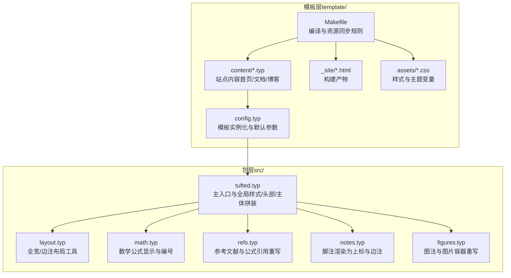
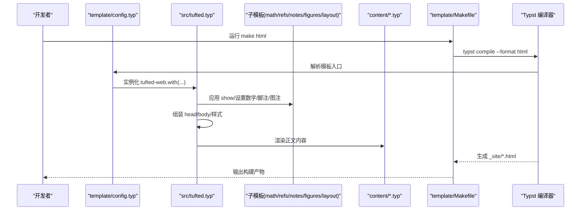
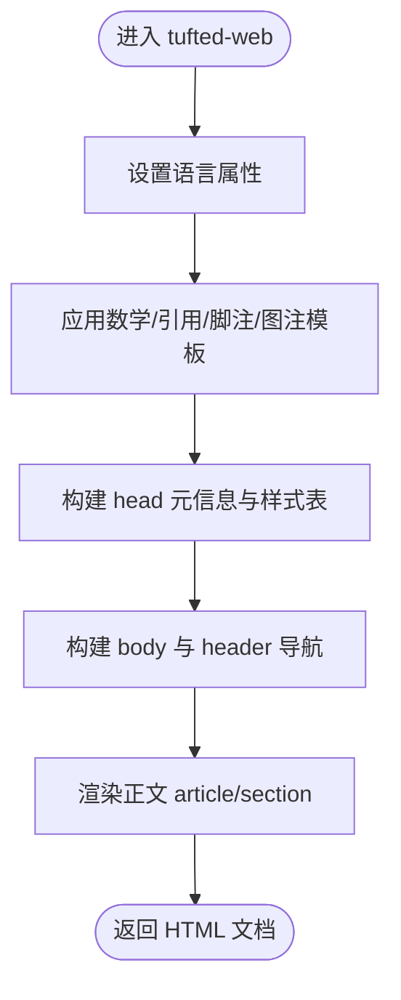
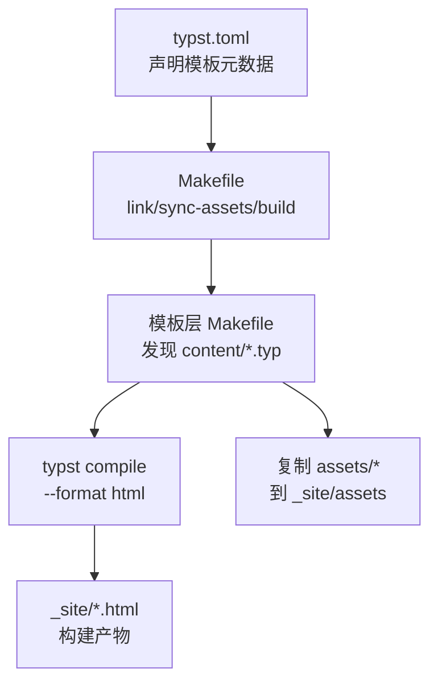
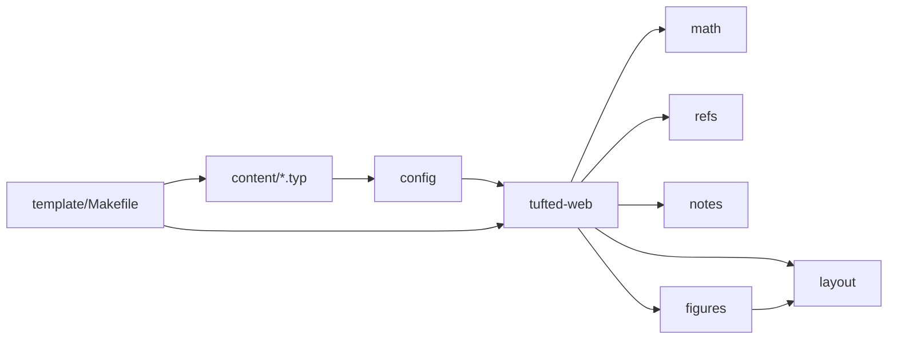

# 模板系统原理

<cite>
**本文引用的文件**
- [src/tufted.typ](file://src/tufted.typ)
- [src/layout.typ](file://src/layout.typ)
- [src/math.typ](file://src/math.typ)
- [src/refs.typ](file://src/refs.typ)
- [src/notes.typ](file://src/notes.typ)
- [src/figures.typ](file://src/figures.typ)
- [template/config.typ](file://template/config.typ)
- [template/Makefile](file://template/Makefile)
- [Makefile](file://Makefile)
- [typst.toml](file://typst.toml)
- [template/content/index.typ](file://template/content/index.typ)
- [template/content/docs/01-quick-start/index.typ](file://template/content/docs/01-quick-start/index.typ)
- [template/content/blog/2024-10-04-iterators-generators/index.typ](file://template/content/blog/2024-10-04-iterators-generators/index.typ)
- [template/assets/tufted.css](file://template/assets/tufted.css)
- [template/assets/custom.css](file://template/assets/custom.css)
</cite>

## 目录
1. [引言](#引言)
2. [项目结构](#项目结构)
3. [核心组件](#核心组件)
4. [架构总览](#架构总览)
5. [详细组件分析](#详细组件分析)
6. [依赖关系分析](#依赖关系分析)
7. [性能考量](#性能考量)
8. [故障排查指南](#故障排查指南)
9. [结论](#结论)
10. [附录](#附录)

## 引言
本文件系统性解析 TwilightPage（Tufted）模板系统的工作原理与架构设计，重点覆盖以下方面：
- 模板函数的定义与调用机制：包括主入口函数 tufted-web 的作用、参数配置与渲染流程。
- 模板继承与组合：如何通过模块化组件（数学、脚注、图注、布局等）组合出复杂页面结构。
- 配置系统：从配置读取到内容渲染的完整链路。
- 内容处理管道：模板与内容（含 Markdown 嵌入）的协同工作方式。
- 扩展与自定义：如何在现有框架上进行二次开发与样式定制。

## 项目结构
该仓库采用“包（package）+模板（template）”双层结构：
- 包层（src/）：提供可复用的模板组件与主入口函数。
- 模板层（template/）：提供站点级配置、内容与构建脚本，消费包层能力。

图表来源
- [src/tufted.typ:17-63](file://src/tufted.typ#L17-L63)
- [src/layout.typ:3-12](file://src/layout.typ#L3-L12)
- [src/math.typ:1-22](file://src/math.typ#L1-L22)
- [src/refs.typ:1-23](file://src/refs.typ#L1-L23)
- [src/notes.typ:1-27](file://src/notes.typ#L1-L27)
- [src/figures.typ:1-20](file://src/figures.typ#L1-L20)
- [template/config.typ:3-11](file://template/config.typ#L3-L11)
- [template/Makefile:14-16](file://template/Makefile#L14-L16)
- [template/assets/tufted.css:1-166](file://template/assets/tufted.css#L1-L166)

章节来源
- [typst.toml:15-19](file://typst.toml#L15-L19)
- [Makefile:54-55](file://Makefile#L54-L55)
- [template/Makefile:1-27](file://template/Makefile#L1-L27)

## 核心组件
- 主入口函数 tufted-web：负责组装 HTML 文档骨架（head/body）、注入样式表、设置语言、渲染头部导航与正文内容，并串联各子模板。
- 子模板：
  - 数学模板：统一数学公式显示、编号策略与 HTML 角色标记。
  - 引用模板：重写方程与标题引用的渲染逻辑。
  - 脚注模板：将脚注编号与内容分别渲染为主文上标与边注区域。
  - 图片/图注模板：重写 figure 与 figure.caption 的 HTML 输出。
  - 布局模板：提供 margin-note 与 full-width 容器，用于边注与全宽元素。

章节来源
- [src/tufted.typ:17-63](file://src/tufted.typ#L17-L63)
- [src/math.typ:1-22](file://src/math.typ#L1-L22)
- [src/refs.typ:1-23](file://src/refs.typ#L1-L23)
- [src/notes.typ:1-27](file://src/notes.typ#L1-L27)
- [src/figures.typ:1-20](file://src/figures.typ#L1-L20)
- [src/layout.typ:3-12](file://src/layout.typ#L3-L12)

## 架构总览
下图展示了从配置到渲染的端到端流程，以及模板函数之间的依赖关系。

图表来源
- [template/Makefile:14-16](file://template/Makefile#L14-L16)
- [template/config.typ:3-11](file://template/config.typ#L3-L11)
- [src/tufted.typ:17-63](file://src/tufted.typ#L17-L63)
- [src/math.typ:1-22](file://src/math.typ#L1-L22)
- [src/refs.typ:1-23](file://src/refs.typ#L1-L23)
- [src/notes.typ:1-27](file://src/notes.typ#L1-L27)
- [src/figures.typ:1-20](file://src/figures.typ#L1-L20)

## 详细组件分析

### 主入口函数 tufted-web 的职责与参数
- 职责
  - 设置语言属性与全局样式。
  - 注入外部与本地 CSS 列表。
  - 生成 HTML 文档骨架（head/meta/title/link + body/header/article/section）。
  - 将子模板（数学/引用/脚注/图注）应用于内容。
  - 支持通过 with(...) 动态覆写默认参数（如标题、导航链接、CSS 列表）。
- 关键参数
  - header-links：导航项列表，驱动头部导航生成。
  - title：页面标题。
  - lang：文档语言。
  - css：样式表数组（CDN 与本地路径）。
  - content：正文内容占位。

图表来源
- [src/tufted.typ:17-63](file://src/tufted.typ#L17-L63)

章节来源
- [src/tufted.typ:17-63](file://src/tufted.typ#L17-L63)

### 子模板：数学（math）
- 行为
  - 统一数学公式编号格式。
  - 在 HTML 目标下为行内与块级公式添加 role 与容器标签。
- 影响
  - 保证数学内容在 HTML 中具备可访问性与样式锚点。

章节来源
- [src/math.typ:1-22](file://src/math.typ#L1-L22)

### 子模板：引用（refs）
- 行为
  - 重写 ref 的渲染：对特定元素类型（如方程、标题）生成更友好的引用。
- 影响
  - 提升交叉引用的可读性与一致性。

章节来源
- [src/refs.typ:1-23](file://src/refs.typ#L1-L23)

### 子模板：脚注（notes）
- 行为
  - 将脚注编号渲染为主文中的上标链接。
  - 将脚注内容渲染为边注区域，支持双向跳转。
- 影响
  - 复现 Tufte 风格的脚注体验。

章节来源
- [src/notes.typ:1-27](file://src/notes.typ#L1-L27)

### 子模板：图注与图片（figures）
- 行为
  - 重写 figure.caption 为边注样式。
  - 重写 figure 的 HTML 输出以适配边注布局。
- 影响
  - 使图注与边注风格一致，提升阅读连贯性。

章节来源
- [src/figures.typ:1-20](file://src/figures.typ#L1-L20)

### 布局工具（layout）
- margin-note：为边注提供容器类名。
- full-width：为全宽内容提供容器类名。
- 影响
  - 与 CSS 协作实现响应式边注与全宽元素。

章节来源
- [src/layout.typ:3-12](file://src/layout.typ#L3-L12)

### 模板配置与实例化（template/config.typ）
- 行为
  - 从包中导入模板入口，并通过 with(...) 覆盖默认参数（如导航链接、标题）。
- 影响
  - 为每个页面提供一致的模板实例，同时允许按需微调。

章节来源
- [template/config.typ:3-11](file://template/config.typ#L3-L11)

### 内容与示例（content/*.typ）
- 示例
  - 首页：演示边注、Markdown 嵌入与图片处理。
  - 快速开始：展示模板标题覆写与构建流程。
  - 博客文章：展示脚注、图注与正文结构。
- 影响
  - 展示模板在真实场景下的组合与扩展。

章节来源
- [template/content/index.typ:1-33](file://template/content/index.typ#L1-L33)
- [template/content/docs/01-quick-start/index.typ:1-24](file://template/content/docs/01-quick-start/index.typ#L1-L24)
- [template/content/blog/2024-10-04-iterators-generators/index.typ:1-53](file://template/content/blog/2024-10-04-iterators-generators/index.typ#L1-L53)

### 构建与资源（Makefile 与 typst.toml）
- 顶层 Makefile
  - 提供 link/sync-assets/build 等目标，便于本地开发与打包。
  - 通过 -C template html 调用模板层 Makefile。
- 模板层 Makefile
  - 自动发现 content 下的 .typ 文件（排除以下划线开头的路径），编译为 _site 下的 .html。
  - 复制 assets 到 _site。
- typst.toml
  - 声明包元数据、入口文件与模板元数据（模板路径、入口、缩略图）。

图表来源
- [Makefile:54-55](file://Makefile#L54-L55)
- [template/Makefile:14-16](file://template/Makefile#L14-L16)
- [typst.toml:15-19](file://typst.toml#L15-L19)

章节来源
- [Makefile:1-60](file://Makefile#L1-L60)
- [template/Makefile:1-27](file://template/Makefile#L1-L27)
- [typst.toml:1-19](file://typst.toml#L1-L19)

## 依赖关系分析
- 包层内部依赖
  - tufted-web 依赖 layout、math、refs、notes、figures。
  - figures 依赖 layout（margin-note）。
- 模板层依赖
  - config.typ 依赖包层入口 tufted。
  - content/*.typ 依赖 config.typ 的模板实例。
- 构建依赖
  - 模板层 Makefile 依赖 Typst 编译器与 assets。
  - 顶层 Makefile 依赖模板层 Makefile。

图表来源
- [src/tufted.typ:17-63](file://src/tufted.typ#L17-L63)
- [src/layout.typ:3-12](file://src/layout.typ#L3-L12)
- [src/math.typ:1-22](file://src/math.typ#L1-L22)
- [src/refs.typ:1-23](file://src/refs.typ#L1-L23)
- [src/notes.typ:1-27](file://src/notes.typ#L1-L27)
- [src/figures.typ:1-20](file://src/figures.typ#L1-L20)
- [template/config.typ:3-11](file://template/config.typ#L3-L11)
- [template/Makefile:14-16](file://template/Makefile#L14-L16)

章节来源
- [src/tufted.typ:1-64](file://src/tufted.typ#L1-L64)
- [src/figures.typ:1-20](file://src/figures.typ#L1-L20)
- [template/config.typ:3-11](file://template/config.typ#L3-L11)
- [template/Makefile:1-27](file://template/Makefile#L1-L27)

## 性能考量
- 编译阶段
  - 使用模板层 Makefile 的模式规则批量编译 content/*.typ，避免重复扫描。
  - 仅在需要时复制 assets，减少不必要的 IO。
- 运行阶段
  - CSS 变量与媒体查询优化窄屏体验，降低复杂布局带来的渲染压力。
  - 数学与脚注的条件渲染（target() == "html"）避免在非 HTML 目标下产生冗余处理。

## 故障排查指南
- 构建失败
  - 确认已运行 make link 以建立本地包缓存链接。
  - 检查 typst.toml 中的 compiler 版本与本地安装是否匹配。
- 样式异常
  - 确认 CSS 列表顺序与覆盖关系（外部 CDN 与本地样式）。
  - 检查自定义样式文件是否正确加载。
- 内容未更新
  - 清理 _site 后重新构建，或检查 content/*.typ 是否被正确发现（不以 _ 开头）。
- 脚注/图注错位
  - 检查 HTML 结构是否符合边注容器类名约定（marginnote/fullwidth）。

章节来源
- [Makefile:25-35](file://Makefile#L25-L35)
- [template/Makefile:14-20](file://template/Makefile#L14-L20)
- [template/assets/tufted.css:30-55](file://template/assets/tufted.css#L30-L55)

## 结论
TwilightPage 模板系统通过“包层组件 + 模板层配置 + 构建脚本”的分层设计，实现了高内聚、低耦合的页面生成体系。主入口函数 tufted-web 作为装配中心，将数学、引用、脚注、图注与布局工具有机整合；模板层通过 with(...) 提供灵活的参数覆写；构建脚本自动化地将内容编译为 HTML 并输出静态资源。该架构既便于扩展（新增子模板或覆写渲染规则），也便于维护（集中式样式与统一的 HTML 结构）。

## 附录
- 样式定制
  - 在 template/assets/tufted.css 中调整变量与媒体查询。
  - 在 template/assets/custom.css 中追加站点专属样式。
- 内容扩展
  - 在 template/content 下新增 .typ 页面，通过 #show: template.with(...) 覆写标题等参数。
  - 使用 Markdown 嵌入与自定义图像处理函数，实现图文混排与路径修正。

章节来源
- [template/assets/tufted.css:1-166](file://template/assets/tufted.css#L1-L166)
- [template/assets/custom.css:1](file://template/assets/custom.css#L1-L1)
- [template/content/index.typ:17-32](file://template/content/index.typ#L17-L32)
- [template/content/docs/01-quick-start/index.typ:2](file://template/content/docs/01-quick-start/index.typ#L2-L2)