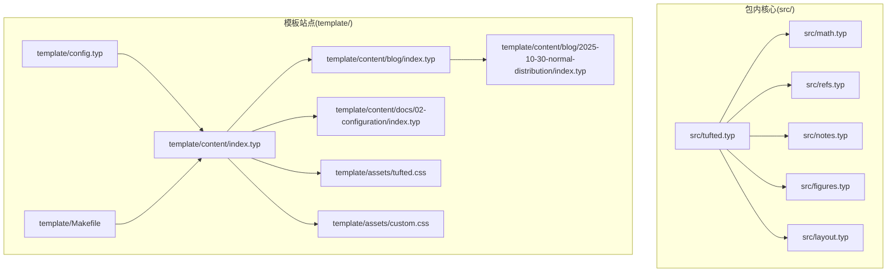
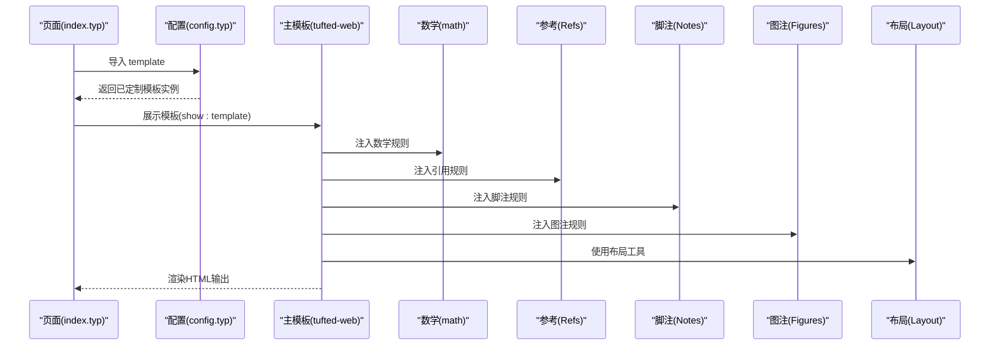
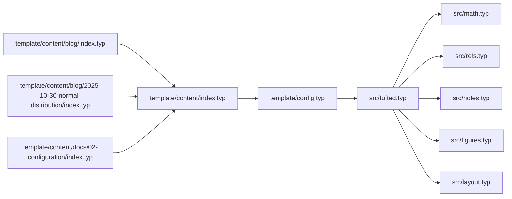

# 模板继承模式

<cite>
**本文引用的文件**
- [src/tufted.typ](file://src/tufted.typ)
- [src/math.typ](file://src/math.typ)
- [src/refs.typ](file://src/refs.typ)
- [src/notes.typ](file://src/notes.typ)
- [src/figures.typ](file://src/figures.typ)
- [src/layout.typ](file://src/layout.typ)
- [template/config.typ](file://template/config.typ)
- [template/content/index.typ](file://template/content/index.typ)
- [template/content/blog/index.typ](file://template/content/blog/index.typ)
- [template/content/blog/2025-10-30-normal-distribution/index.typ](file://template/content/blog/2025-10-30-normal-distribution/index.typ)
- [template/content/docs/02-configuration/index.typ](file://template/content/docs/02-configuration/index.typ)
- [template/assets/tufted.css](file://template/assets/tufted.css)
- [template/assets/custom.css](file://template/assets/custom.css)
- [template/Makefile](file://template/Makefile)
- [Makefile](file://Makefile)
- [typst.toml](file://typst.toml)
</cite>

## 目录
1. [引言](#引言)
2. [项目结构](#项目结构)
3. [核心组件](#核心组件)
4. [架构总览](#架构总览)
5. [详细组件分析](#详细组件分析)
6. [依赖分析](#依赖分析)
7. [性能考虑](#性能考虑)
8. [故障排查指南](#故障排查指南)
9. [结论](#结论)
10. [附录](#附录)

## 引言
本文件围绕 TwilightPage（基于 Tufted）模板系统，系统性阐述其“继承与组合”的设计模式：通过配置文件与层级页面导入实现模板的定制与扩展；解析模板结构的层次关系（从基础模板到具体页面）；给出可操作的继承与组合实践，帮助读者在不破坏现有结构的前提下创建自定义模板、扩展现有功能，并遵循最佳实践。

## 项目结构
TwilightPage 的模板系统由“包内核心模板”和“模板站点”两部分组成：
- 包内核心模板位于 src/，导出可复用的模板片段与主模板函数；
- 模板站点位于 template/，包含配置、内容、静态资源与构建脚本；
- 根目录提供链接本地包与打包构建的顶层 Makefile。

图表来源
- [src/tufted.typ:1-64](file://src/tufted.typ#L1-L64)
- [src/math.typ:1-22](file://src/math.typ#L1-L22)
- [src/refs.typ:1-23](file://src/refs.typ#L1-L23)
- [src/notes.typ:1-27](file://src/notes.typ#L1-L27)
- [src/figures.typ:1-20](file://src/figures.typ#L1-L20)
- [src/layout.typ:1-13](file://src/layout.typ#L1-L13)
- [template/config.typ:1-12](file://template/config.typ#L1-L12)
- [template/content/index.typ:1-33](file://template/content/index.typ#L1-L33)
- [template/content/blog/index.typ:1-14](file://template/content/blog/index.typ#L1-L14)
- [template/content/blog/2025-10-30-normal-distribution/index.typ:1-56](file://template/content/blog/2025-10-30-normal-distribution/index.typ#L1-L56)
- [template/content/docs/02-configuration/index.typ:1-53](file://template/content/docs/02-configuration/index.typ#L1-L53)
- [template/assets/tufted.css:1-166](file://template/assets/tufted.css#L1-L166)
- [template/assets/custom.css:1-1](file://template/assets/custom.css#L1-L1)
- [template/Makefile:1-27](file://template/Makefile#L1-L27)

章节来源
- [typst.toml:1-19](file://typst.toml#L1-L19)
- [Makefile:1-60](file://Makefile#L1-L60)
- [template/Makefile:1-27](file://template/Makefile#L1-L27)

## 核心组件
- 主模板函数 tufted-web：聚合数学、参考文献、脚注、图注等模块，统一注入语言、标题、样式表与页面主体结构。
- 数学模块 template-math：为行内与块级公式设置编号与 HTML 输出策略。
- 参考文献模块 template-refs：重写引用渲染，支持方程与标题等元素的智能引用。
- 脚注模块 template-notes：将脚注编号与边注联动，生成可跳转的上标与边注容器。
- 图注模块 template-figures：将图注渲染为边注，统一图与图注的 HTML 结构。
- 布局工具 layout：提供边注与全宽布局的辅助函数，供模块与页面使用。
- 站点配置 config：通过 with(...) 定制导航链接与网站标题，形成可复用的模板实例。
- 页面入口 content/index.typ：作为根页面，统一引入模板并可嵌入 Markdown 内容。
- 构建与资源：Makefile 将 .typ 编译为 HTML 并复制静态资源；CSS 提供响应式与主题化样式。

章节来源
- [src/tufted.typ:1-64](file://src/tufted.typ#L1-L64)
- [src/math.typ:1-22](file://src/math.typ#L1-L22)
- [src/refs.typ:1-23](file://src/refs.typ#L1-L23)
- [src/notes.typ:1-27](file://src/notes.typ#L1-L27)
- [src/figures.typ:1-20](file://src/figures.typ#L1-L20)
- [src/layout.typ:1-13](file://src/layout.typ#L1-L13)
- [template/config.typ:1-12](file://template/config.typ#L1-L12)
- [template/content/index.typ:1-33](file://template/content/index.typ#L1-L33)

## 架构总览
模板系统采用“组合优先、按需装配”的设计：主模板 tufted-web 组合多个子模块；站点通过 config.typ 导出一个已定制的模板实例；页面通过相对导入继承父级模板并进行局部覆盖。

图表来源
- [template/content/index.typ:1-33](file://template/content/index.typ#L1-L33)
- [template/config.typ:1-12](file://template/config.typ#L1-L12)
- [src/tufted.typ:17-63](file://src/tufted.typ#L17-L63)
- [src/math.typ:1-22](file://src/math.typ#L1-L22)
- [src/refs.typ:1-23](file://src/refs.typ#L1-L23)
- [src/notes.typ:1-27](file://src/notes.typ#L1-L27)
- [src/figures.typ:1-20](file://src/figures.typ#L1-L20)
- [src/layout.typ:1-13](file://src/layout.typ#L1-L13)

## 详细组件分析

### 组件一：主模板 tufted-web（组合与默认行为）
- 职责：统一注入语言、标题、样式表与页面结构；组合数学、参考、脚注、图注模块；暴露可定制参数（导航链接、标题、语言、CSS 列表、内容槽位）。
- 设计要点：
  - 通过 with(...) 形成可复用的模板实例，便于站点层定制。
  - 将 show 规则与 set 设置集中于主模板，确保一致性。
  - 以 html.html/html.head/html.body 组织页面骨架，便于 CSS 与交互扩展。

章节来源
- [src/tufted.typ:17-63](file://src/tufted.typ#L17-L63)

### 组件二：数学模块 template-math（条件渲染与编号）
- 职责：为行内与块级公式设置编号策略，并在 HTML 目标下输出带 role 的结构化标签。
- 设计要点：
  - 条件判断 target()，仅在 HTML 目标时转换为 HTML 结构。
  - 通过 numbering 参数控制编号格式，保持与 Tufte 风格兼容。

章节来源
- [src/math.typ:1-22](file://src/math.typ#L1-L22)

### 组件三：参考文献模块 template-refs（智能引用）
- 职责：重写引用渲染逻辑，对特定元素（如方程）生成可跳转的链接与编号显示。
- 设计要点：
  - 识别元素类型并进行分支处理，增强引用的可读性与可导航性。
  - 与其他模块协同，保证编号一致性。

章节来源
- [src/refs.typ:1-23](file://src/refs.typ#L1-L23)

### 组件四：脚注模块 template-notes（脚注与边注联动）
- 职责：将脚注编号渲染为上标并生成可跳转的边注容器，实现脚注与正文的解耦。
- 设计要点：
  - 生成稳定的锚点 ID 与反向引用，提升可访问性。
  - 在 HTML 目标下输出结构化标签，配合 CSS 实现悬停高亮。

章节来源
- [src/notes.typ:1-27](file://src/notes.typ#L1-L27)

### 组件五：图注模块 template-figures（图与边注）
- 职责：将图注渲染为边注，统一图与图注的 HTML 结构。
- 设计要点：
  - 通过 show figure.caption 与 show figure 重写渲染流程。
  - 复用布局工具中的边注能力，保持风格一致。

章节来源
- [src/figures.typ:1-20](file://src/figures.typ#L1-L20)

### 组件六：布局工具 layout（边注与全宽）
- 职责：提供 margin-note 与 full-width 两类布局辅助，用于边注与全宽内容。
- 设计要点：
  - 以 HTML 元素包装内容，便于 CSS 控制。
  - 为图注模块提供统一的边注语义。

章节来源
- [src/layout.typ:1-13](file://src/layout.typ#L1-L13)

### 组件七：站点配置 config（定制与扩展入口）
- 职责：通过 with(...) 定制导航链接与网站标题，导出可直接使用的模板实例。
- 设计要点：
  - 与主模板参数一一对应，便于站点层快速定制。
  - 作为所有页面的共同入口，降低重复导入成本。

章节来源
- [template/config.typ:1-12](file://template/config.typ#L1-L12)

### 组件八：页面入口 content/index.typ（继承与覆盖）
- 职责：作为根页面，引入模板并可嵌入 Markdown 内容；为子页面提供继承基线。
- 设计要点：
  - 通过 #show: template 应用模板。
  - 支持在子页面中使用 template.with(...) 进行局部覆盖（如修改标题）。

章节来源
- [template/content/index.typ:1-33](file://template/content/index.typ#L1-L33)

### 组件九：博客与文档示例（继承链路与组合）
- 博客列表页：通过相对导入父级 index.typ，仅覆盖标题，体现“最小改动”的继承原则。
- 博客文章页：在父级基础上引入更多模块（如绘图库），展示组合扩展能力。
- 文档页：演示如何在任意层级修改模板参数，验证继承链路的有效性。

章节来源
- [template/content/blog/index.typ:1-14](file://template/content/blog/index.typ#L1-L14)
- [template/content/blog/2025-10-30-normal-distribution/index.typ:1-56](file://template/content/blog/2025-10-30-normal-distribution/index.typ#L1-L56)
- [template/content/docs/02-configuration/index.typ:1-53](file://template/content/docs/02-configuration/index.typ#L1-L53)

### 组件十：样式与资源（CSS 与构建）
- 样式：提供响应式布局、导航栏、脚注/边注联动、数学渲染等主题化样式；支持自定义 CSS 扩展。
- 构建：Makefile 自动发现 content 下的 .typ 文件，编译为 HTML 并复制静态资源。

章节来源
- [template/assets/tufted.css:1-166](file://template/assets/tufted.css#L1-L166)
- [template/assets/custom.css:1-1](file://template/assets/custom.css#L1-L1)
- [template/Makefile:1-27](file://template/Makefile#L1-L27)

## 依赖分析
- 模块内聚与耦合：
  - 主模板 tufted-web 对各子模块存在“组合依赖”，但彼此独立，便于替换或禁用。
  - 子模块之间无直接依赖，避免循环依赖风险。
- 外部依赖：
  - 通过包管理器引入外部模板与库（如绘图库），在页面层按需导入。
- 导入链路：
  - 页面通过相对导入继承父级模板，减少跨层级依赖。
  - 根页面统一导出模板实例，子页面仅做局部覆盖。

图表来源
- [src/tufted.typ:1-64](file://src/tufted.typ#L1-L64)
- [src/math.typ:1-22](file://src/math.typ#L1-L22)
- [src/refs.typ:1-23](file://src/refs.typ#L1-L23)
- [src/notes.typ:1-27](file://src/notes.typ#L1-L27)
- [src/figures.typ:1-20](file://src/figures.typ#L1-L20)
- [src/layout.typ:1-13](file://src/layout.typ#L1-L13)
- [template/config.typ:1-12](file://template/config.typ#L1-L12)
- [template/content/index.typ:1-33](file://template/content/index.typ#L1-L33)
- [template/content/blog/index.typ:1-14](file://template/content/blog/index.typ#L1-L14)
- [template/content/blog/2025-10-30-normal-distribution/index.typ:1-56](file://template/content/blog/2025-10-30-normal-distribution/index.typ#L1-L56)
- [template/content/docs/02-configuration/index.typ:1-53](file://template/content/docs/02-configuration/index.typ#L1-L53)

## 性能考虑
- 模块化渲染：将数学、脚注、图注等规则拆分为独立模块，避免在单一模板中堆叠复杂逻辑，有利于缓存与增量更新。
- 条件渲染：通过 target() 判断仅在 HTML 目标时进行结构转换，减少非目标平台的开销。
- 构建优化：Makefile 自动发现与并行编译，建议在大型站点中分批组织内容，减少单次编译压力。
- 样式加载：CSS 以数组形式注入，可按需增删，避免冗余样式影响首屏性能。

## 故障排查指南
- 页面未应用模板：
  - 检查页面是否正确导入模板并使用 #show: template。
  - 确认父级 index.typ 是否导出模板实例。
- 样式异常：
  - 确认 CSS 注入顺序与路径正确；检查自定义 CSS 是否覆盖了关键选择器。
  - 在窄屏设备上验证响应式规则是否生效。
- 数学或脚注显示异常：
  - 确认数学模块与脚注模块已被主模板注入。
  - 检查 target() 条件是否满足，确保在 HTML 目标下渲染。
- 构建失败：
  - 检查 Makefile 中的文件发现规则与输出路径。
  - 确保资源目录存在且权限正确。

章节来源
- [template/content/index.typ:1-33](file://template/content/index.typ#L1-L33)
- [src/tufted.typ:29-32](file://src/tufted.typ#L29-L32)
- [template/Makefile:1-27](file://template/Makefile#L1-L27)

## 结论
TwilightPage 模板系统通过“组合优先、按需装配”的设计，实现了清晰的职责分离与灵活的定制能力。站点层通过配置文件完成全局定制，页面层通过继承与局部覆盖实现差异化展示。该模式既保证了模板的一致性，又允许在不破坏整体结构的前提下进行扩展与创新。

## 附录

### 模板继承与组合最佳实践
- 最小改动原则：仅在子页面中覆盖必要参数（如标题），避免在多层页面重复导入。
- 组合扩展：在需要时按需引入额外模块（如绘图库），并在主模板中统一注入。
- 保持一致性：通过主模板集中管理语言、标题、样式表等全局设置。
- 渐进增强：先实现基础继承，再逐步引入更复杂的组合与定制。

### 配置参数对模板行为的影响
- 导航链接：决定顶部导航的可用性与层级结构。
- 网站标题：影响页面标题与面包屑等元信息。
- 语言设置：影响文本方向与本地化规则。
- 样式表列表：控制主题与自定义样式的加载顺序与覆盖关系。

章节来源
- [template/config.typ:3-11](file://template/config.typ#L3-L11)
- [src/tufted.typ:17-27](file://src/tufted.typ#L17-L27)