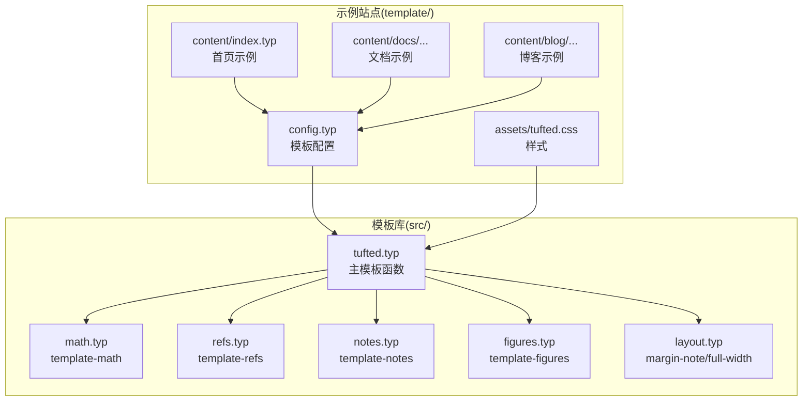
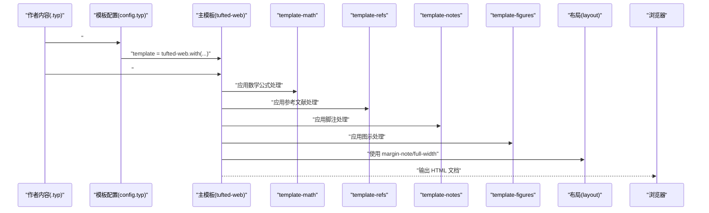
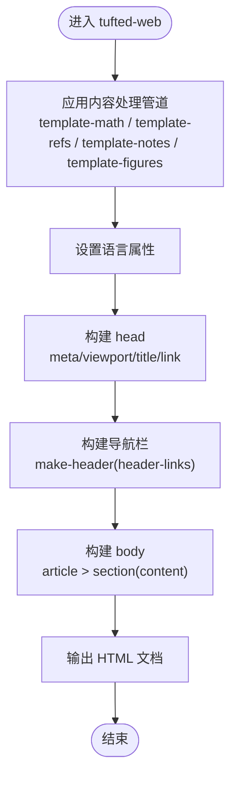
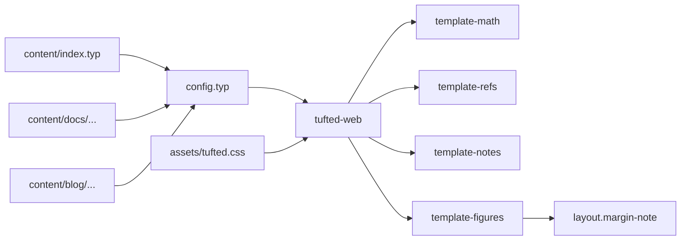

# 主模板函数

<cite>
**本文引用的文件**
- [src/tufted.typ](file://src/tufted.typ)
- [src/math.typ](file://src/math.typ)
- [src/refs.typ](file://src/refs.typ)
- [src/notes.typ](file://src/notes.typ)
- [src/figures.typ](file://src/figures.typ)
- [src/layout.typ](file://src/layout.typ)
- [template/config.typ](file://template/config.typ)
- [template/content/index.typ](file://template/content/index.typ)
- [template/content/docs/01-quick-start/index.typ](file://template/content/docs/01-quick-start/index.typ)
- [template/content/blog/2024-10-04-iterators-generators/index.typ](file://template/content/blog/2024-10-04-iterators-generators/index.typ)
- [template/assets/tufted.css](file://template/assets/tufted.css)
- [Makefile](file://Makefile)
- [template/Makefile](file://template/Makefile)
</cite>

## 目录
1. [简介](#简介)
2. [项目结构](#项目结构)
3. [核心组件](#核心组件)
4. [架构总览](#架构总览)
5. [详细组件分析](#详细组件分析)
6. [依赖关系分析](#依赖关系分析)
7. [性能考虑](#性能考虑)
8. [故障排查指南](#故障排查指南)
9. [结论](#结论)
10. [附录](#附录)

## 简介
本节介绍 tufted-web 的主模板函数 tufted-web 的实现与使用方法。该函数负责组织页面的整体结构（头部、导航、主体内容），并集成数学公式、参考文献、脚注、图示等处理管道，最终输出符合 Tufte 风格的 HTML 页面。文档将从参数配置、页面结构组织、内容处理管道集成、返回值与输出格式、参数验证与错误处理等方面进行系统说明，并提供可直接复用的使用示例与调试技巧。

## 项目结构
该项目采用“模板库 + 示例站点”的分层结构：
- 模板库位于 src/，包含主模板函数与若干内容处理管道（数学、参考文献、脚注、图示）以及布局工具。
- 示例站点位于 template/，包含配置、内容与资源，演示如何使用模板函数构建页面。
- 构建流程通过 Makefile 驱动，将 .typ 内容编译为 HTML 并复制静态资源。

图表来源
- [src/tufted.typ:17-63](file://src/tufted.typ#L17-L63)
- [src/math.typ:1-22](file://src/math.typ#L1-L22)
- [src/refs.typ:1-23](file://src/refs.typ#L1-L23)
- [src/notes.typ:1-27](file://src/notes.typ#L1-L27)
- [src/figures.typ:1-20](file://src/figures.typ#L1-L20)
- [src/layout.typ:1-13](file://src/layout.typ#L1-L13)
- [template/config.typ:1-12](file://template/config.typ#L1-L12)
- [template/content/index.typ:1-33](file://template/content/index.typ#L1-L33)
- [template/assets/tufted.css:1-166](file://template/assets/tufted.css#L1-L166)

章节来源
- [Makefile:1-60](file://Makefile#L1-L60)
- [template/Makefile:1-27](file://template/Makefile#L1-L27)

## 核心组件
本节聚焦主模板函数 tufted-web 的参数、行为与返回值，以及与内容处理管道的集成方式。

- 函数定义与导入
  - 主模板函数位于 src/tufted.typ，导入了数学、参考文献、脚注、图示处理管道与布局工具。
  - 通过 show 指令将各管道应用于内容，确保渲染时自动处理相应元素。

- 参数配置
  - header-links：导航链接列表，默认 none；当提供时会渲染导航栏。
  - title：页面标题，默认 "Tufted"。
  - lang：页面语言，默认 "en"。
  - css：样式表数组，默认包含 Tufte CSS CDN 与本地样式文件。
  - content：页面主体内容，由调用方传入。

- 页面结构组织
  - 头部：设置字符集、视口、标题与样式表链接。
  - 导航：根据 header-links 渲染导航项。
  - 主体：将 content 包裹在 article 与 section 中，形成清晰的语义结构。

- 返回值与输出格式
  - 返回一个完整的 HTML 文档树，包含 html/head/body 结构，目标格式为 HTML。

章节来源
- [src/tufted.typ:17-63](file://src/tufted.typ#L17-L63)

## 架构总览
下图展示了主模板函数与内容处理管道之间的协作关系，以及示例站点如何通过配置模板实例化并渲染页面。

图表来源
- [src/tufted.typ:17-63](file://src/tufted.typ#L17-L63)
- [src/math.typ:1-22](file://src/math.typ#L1-L22)
- [src/refs.typ:1-23](file://src/refs.typ#L1-L23)
- [src/notes.typ:1-27](file://src/notes.typ#L1-L27)
- [src/figures.typ:1-20](file://src/figures.typ#L1-L20)
- [src/layout.typ:1-13](file://src/layout.typ#L1-L13)
- [template/config.typ:1-12](file://template/config.typ#L1-L12)

## 详细组件分析

### 主模板函数 tufted-web
- 功能概述
  - 统一设置语言属性与样式表。
  - 通过 show 指令注入数学、参考文献、脚注、图示处理管道。
  - 生成标准 HTML 结构，包括 head 与 body。
  - 使用 make-header 生成导航栏，支持空值安全渲染。

- 参数详解
  - header-links: none 或 (href: string, title: string) 元组序列。用于生成导航链接。
  - title: string，页面标题。
  - lang: string，HTML lang 属性。
  - css: (string...)，样式表链接数组。
  - content: typst 内容块，作为页面主体。

- 页面结构生成
  - 头部：meta charset、viewport、title、link(rel="stylesheet", href=css-link)。
  - 导航：遍历 header-links，生成 a 标签。
  - 主体：article > section(content)，保证语义化结构。

- 与内容处理管道的集成
  - 数学：将行内与块级公式包裹为 role="math" 的 span/figure。
  - 参考文献：重写方程引用编号与链接，支持标题引用的引号处理。
  - 脚注：生成上标引用与边注中的脚注条目，支持 hover 高亮。
  - 图示：重写图注为边注样式，图本身包裹 figure 容器。

- 返回值与输出
  - 返回完整的 HTML 文档树，目标格式为 HTML。

图表来源
- [src/tufted.typ:17-63](file://src/tufted.typ#L17-L63)

章节来源
- [src/tufted.typ:7-15](file://src/tufted.typ#L7-L15)
- [src/tufted.typ:17-63](file://src/tufted.typ#L17-L63)

### 内容处理管道

#### 数学公式模板 template-math
- 行内公式：在 HTML 目标下包裹为 role="math" 的 span。
- 块级公式：在 HTML 目标下包裹为 role="math" 的 figure。
- 编号策略：设置数学公式编号格式。

章节来源
- [src/math.typ:1-22](file://src/math.typ#L1-L22)

#### 参考文献模板 template-refs
- 方程引用：解析元素位置与编号，生成带编号的链接。
- 标题引用：对标题引用添加引号包装。
- 保持兼容性：非匹配元素原样返回。

章节来源
- [src/refs.typ:1-23](file://src/refs.typ#L1-L23)

#### 脚注模板 template-notes
- 引用上标：生成带有脚注引用链接的上标 sup。
- 边注内容：生成带 id 的 marginnote，包含回链与脚注正文。
- 交互高亮：通过 CSS 实现悬停高亮效果。

章节来源
- [src/notes.typ:1-27](file://src/notes.typ#L1-L27)

#### 图示模板 template-figures
- 图注：重写为 marginnote 样式，保留补充信息、计数器与分隔符。
- 图像容器：在 HTML 目标下将 figure 与其 caption、body 重新组合为 figure 容器。

章节来源
- [src/figures.typ:1-20](file://src/figures.typ#L1-L20)

### 布局工具
- margin-note：将内容包裹为 class="marginnote" 的 span，用于边注。
- full-width：将内容包裹为 class="fullwidth" 的 div，用于全宽布局。

章节来源
- [src/layout.typ:1-13](file://src/layout.typ#L1-L13)

### 示例站点与使用方式

#### 模板配置 template/config.typ
- 通过 tufted-web.with(...) 创建模板实例，预设 header-links 与 title。
- 在具体页面中通过 #show: template 或 template.with(...) 覆盖标题等参数。

章节来源
- [template/config.typ:1-12](file://template/config.typ#L1-L12)

#### 首页示例 template/content/index.typ
- 导入模板配置并显示模板。
- 使用 margin-note 插入边注内容与图片。
- 通过 cmarker 渲染 Markdown，并自定义图片处理逻辑。

章节来源
- [template/content/index.typ:1-33](file://template/content/index.typ#L1-L33)

#### 文档示例 template/content/docs/01-quick-start/index.typ
- 在页面顶部通过 template.with(title: "...") 覆盖默认标题。
- 展示安装与构建命令，体现模板的易用性。

章节来源
- [template/content/docs/01-quick-start/index.typ:1-24](file://template/content/docs/01-quick-start/index.typ#L1-L24)

#### 博客示例 template/content/blog/2024-10-04-iterators-generators/index.typ
- 展示脚注、代码块、图示等元素的综合使用。
- 使用 #figure 与 caption 生成图注，配合 template-figures 自动转换为边注样式。

章节来源
- [template/content/blog/2024-10-04-iterators-generators/index.typ:1-53](file://template/content/blog/2024-10-04-iterators-generators/index.typ#L1-L53)

### 样式与主题
- 默认加载 Tufte CSS CDN 与本地样式文件，确保排版风格一致。
- 本地样式覆盖基础样式、响应式布局、导航栏、脚注与数学公式等细节。

章节来源
- [src/tufted.typ:21-25](file://src/tufted.typ#L21-L25)
- [template/assets/tufted.css:1-166](file://template/assets/tufted.css#L1-L166)

## 依赖关系分析
- 模块耦合
  - tufted-web 对四个内容处理管道存在直接依赖，通过 show 指令注入。
  - 布局工具被图示模板间接使用，用于边注样式。
- 外部依赖
  - Tufte CSS 通过 CDN 提供基础样式。
  - 示例站点通过 cmarker 渲染 Markdown，增强内容多样性。
- 构建依赖
  - Makefile 将本地包链接到缓存目录，便于本地开发与测试。
  - 模板 Makefile 扫描 content 下的 .typ 文件并编译为 HTML。

图表来源
- [src/tufted.typ:17-63](file://src/tufted.typ#L17-L63)
- [src/figures.typ:1-20](file://src/figures.typ#L1-L20)
- [src/layout.typ:1-13](file://src/layout.typ#L1-L13)
- [template/config.typ:1-12](file://template/config.typ#L1-L12)
- [template/content/index.typ:1-33](file://template/content/index.typ#L1-L33)
- [template/assets/tufted.css:1-166](file://template/assets/tufted.css#L1-L166)

章节来源
- [Makefile:1-60](file://Makefile#L1-L60)
- [template/Makefile:1-27](file://template/Makefile#L1-L27)

## 性能考虑
- 样式加载：默认包含 CDN 与本地样式，建议在生产环境缓存或内联关键 CSS，减少首屏阻塞。
- 内容处理：模板管道在渲染阶段执行，避免在内容中重复处理相同元素。
- 构建优化：利用 Makefile 的并行扫描与编译，提升批量构建效率。
- 响应式设计：CSS 已针对窄屏设备优化，减少额外 JS 依赖，提高渲染性能。

## 故障排查指南
- 导航不显示
  - 检查 header-links 是否为 none 或为空元组；确认模板配置中已正确设置。
  - 参考路径：[src/tufted.typ:7-15](file://src/tufted.typ#L7-L15)、[template/config.typ:4-11](file://template/config.typ#L4-L11)
- 数学公式未正确编号或显示
  - 确认 template-math 已被应用；检查公式是否为行内或块级。
  - 参考路径：[src/tufted.typ:29-32](file://src/tufted.typ#L29-L32)、[src/math.typ:1-22](file://src/math.typ#L1-L22)
- 脚注链接无法跳转
  - 检查脚注编号与边注 id 是否一致；确认 CSS 中 hover 高亮规则生效。
  - 参考路径：[src/notes.typ:2-24](file://src/notes.typ#L2-L24)、[template/assets/tufted.css:94-113](file://template/assets/tufted.css#L94-L113)
- 图注未显示为边注
  - 确认 template-figures 已应用；检查图注是否包含 caption。
  - 参考路径：[src/tufted.typ:31-32](file://src/tufted.typ#L31-L32)、[src/figures.typ:3-19](file://src/figures.typ#L3-L19)
- 样式未生效
  - 检查 css 参数是否包含正确的链接；确认本地样式文件存在且路径正确。
  - 参考路径：[src/tufted.typ:21-25](file://src/tufted.typ#L21-L25)、[template/assets/tufted.css:1-166](file://template/assets/tufted.css#L1-L166)
- 构建失败
  - 使用 make link 将本地包链接至缓存；确认 typst 可执行文件可用。
  - 参考路径：[Makefile:10-36](file://Makefile#L10-L36)、[template/Makefile:14-16](file://template/Makefile#L14-L16)

## 结论
主模板函数 tufted-web 以简洁的参数配置与强大的内容处理管道集成为核心，提供了高度可定制的 Tufte 风格页面生成能力。通过模板配置与示例站点的结合，开发者可以快速搭建博客、文档与个人主页。建议在实际项目中：
- 明确 header-links 与 title 的配置，确保导航一致性。
- 合理组织 css 链接顺序，优先加载关键样式。
- 利用脚注与图示模板提升阅读体验。
- 使用 Makefile 自动化构建与资源同步，保障发布质量。

## 附录

### 使用示例与最佳实践
- 在页面顶部覆写标题
  - 使用 template.with(title: "新标题") 覆盖默认标题。
  - 参考路径：[template/content/docs/01-quick-start/index.typ:2](file://template/content/docs/01-quick-start/index.typ#L2)
- 添加边注内容
  - 使用 tufted.margin-note 包裹边注内容。
  - 参考路径：[template/content/index.typ:7-14](file://template/content/index.typ#L7-L14)
- 插入图示与图注
  - 使用 #figure(image(...), caption: [...])，模板会自动转换为边注样式。
  - 参考路径：[template/content/blog/2024-10-04-iterators-generators/index.typ:46](file://template/content/blog/2024-10-04-iterators-generators/index.typ#L46)
- 自定义样式
  - 在 css 参数中追加自定义样式文件路径，或修改本地样式文件。
  - 参考路径：[src/tufted.typ:21-25](file://src/tufted.typ#L21-L25)、[template/assets/tufted.css:1-166](file://template/assets/tufted.css#L1-L166)

### 参数验证与错误处理建议
- header-links 类型校验：确保为 none 或 (href: string, title: string) 序列。
- title 与 lang：保持字符串类型，避免特殊字符影响 SEO。
- css 链接有效性：在本地测试时先移除 CDN，仅保留本地样式，逐步恢复网络资源。
- 内容处理异常：若某类元素未按预期渲染，逐个禁用对应管道（template-math/refs/notes/figures）定位问题。