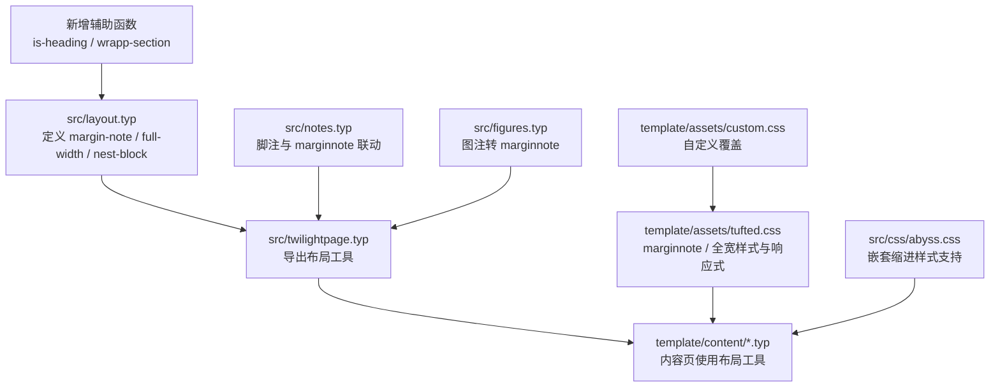
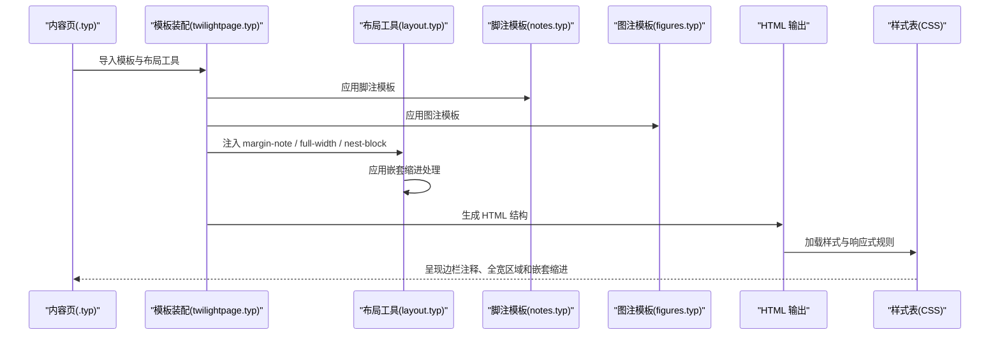
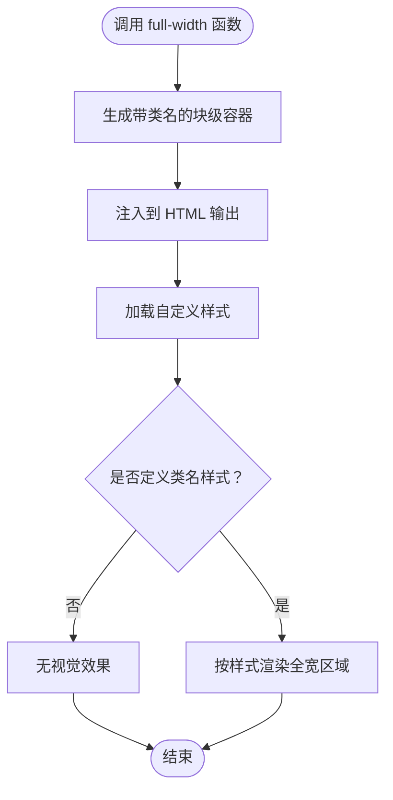
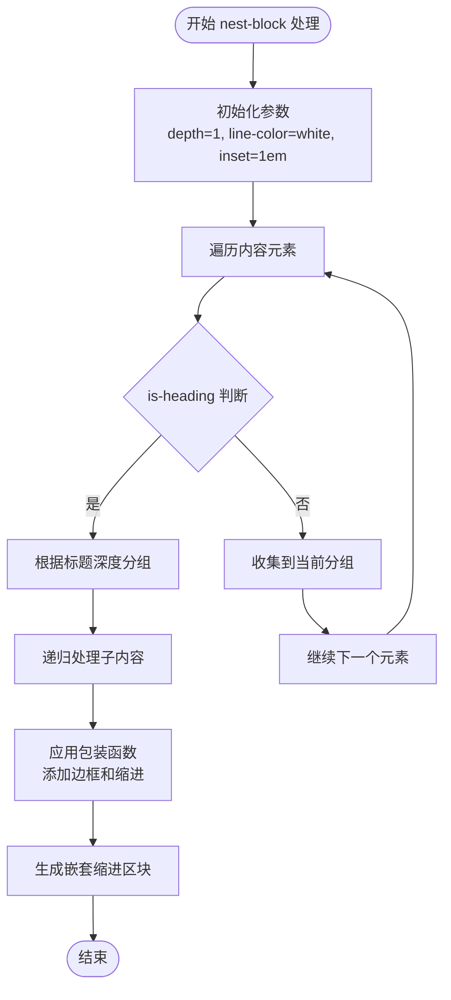
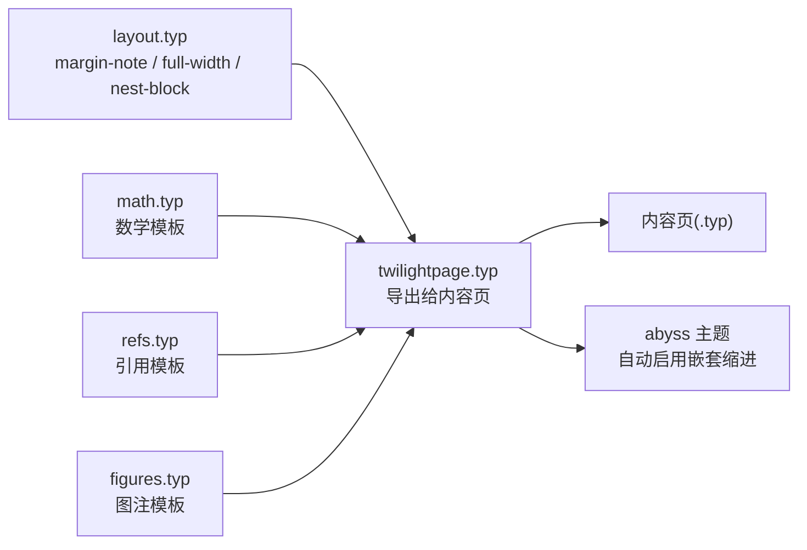
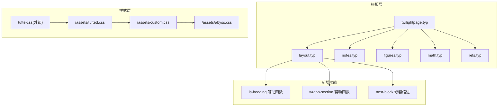

# 布局工具

<cite>
**本文引用的文件**
- [src/layout.typ](file://src/layout.typ)
- [src/twilightpage.typ](file://src/twilightpage.typ)
- [src/css/abyss.css](file://src/css/abyss.css)
- [src/notes.typ](file://src/notes.typ)
- [src/figures.typ](file://src/figures.typ)
- [template/assets/tufted.css](file://template/assets/tufted.css)
- [template/assets/custom.css](file://template/assets/custom.css)
- [template/content/blog/2024-10-04-iterators-generators/index.typ](file://template/content/blog/2024-10-04-iterators-generators/index.typ)
- [template/content/docs/01-quick-start/index.typ](file://template/content/docs/01-quick-start/index.typ)
</cite>

## 更新摘要
**变更内容**
- 新增嵌套缩进块功能（nest-block），支持基于标题层级的自动嵌套缩进
- 新增 wrapp-section 辅助函数，实现内容分组和包装机制
- 新增 is-heading 辅助函数，用于内容分组判断
- 增强布局工具模块，提供复杂的嵌套内容组织能力
- 添加样式支持，实现多层级缩进的视觉效果

## 目录
1. [引言](#引言)
2. [项目结构](#项目结构)
3. [核心组件](#核心组件)
4. [架构总览](#架构总览)
5. [详细组件分析](#详细组件分析)
6. [依赖关系分析](#依赖关系分析)
7. [性能考虑](#性能考虑)
8. [故障排查指南](#故障排查指南)
9. [结论](#结论)
10. [附录：使用示例与最佳实践](#附录使用示例与最佳实践)

## 引言
本篇文档聚焦于 TwilightPage 模板中的"布局工具"能力，系统讲解三类关键布局函数：margin-note 侧注、full-width 全宽容器，以及新增的 nest-block 嵌套缩进块。我们将从实现原理、参数与用法、样式与响应式适配、与模板其他组件的集成，到调试与常见问题解决进行完整说明，并给出可直接参考的示例路径。

## 项目结构
布局工具位于 src/layout.typ 中，通过模板装配文件 src/twilightpage.typ 导出给内容页使用；侧注与脚注联动由 src/notes.typ 提供；图片与图注的侧注化由 src/figures.typ 完成；最终在浏览器端通过 CSS 样式（template/assets/tufted.css 和 src/css/abyss.css）实现视觉呈现与响应式行为。

**图表来源**
- [src/layout.typ:1-121](file://src/layout.typ#L1-L121)
- [src/twilightpage.typ:11-144](file://src/twilightpage.typ#L11-L144)
- [src/notes.typ:1-27](file://src/notes.typ#L1-L27)
- [src/figures.typ:1-20](file://src/figures.typ#L1-L20)
- [template/assets/tufted.css:1-166](file://template/assets/tufted.css#L1-L166)
- [template/assets/custom.css:1-1](file://template/assets/custom.css#L1-L1)
- [src/css/abyss.css:333-368](file://src/css/abyss.css#L333-L368)

**章节来源**
- [src/layout.typ:1-121](file://src/layout.typ#L1-L121)
- [src/twilightpage.typ:11-144](file://src/twilightpage.typ#L11-L144)
- [template/assets/tufted.css:1-166](file://template/assets/tufted.css#L1-L166)

## 核心组件
- margin-note 侧注工具
  - 作用：将任意内容包裹为带类名的内联容器，用于在边栏或侧边显示补充信息。
  - 实现：在布局模块中以函数形式导出，内部生成带特定类名的 HTML 容器。
  - 使用：可在正文、脚注、图注等多处插入，形成"脚注引用 ↔ 边栏注释"的交互体验。
- full-width 全宽容器工具
  - 作用：创建跨越页面内容区之外的横向扩展区域，常用于插入全宽图片、视频或强调区块。
  - 实现：在布局模块中以函数形式导出，内部生成带特定类名的 HTML 容器。
  - 现状：当前 CSS 中未见针对该类名的显式样式规则，因此默认不会产生视觉效果；需要在自定义样式中补充。
- nest-block 嵌套缩进块工具
  - 作用：根据标题层级创建缩进效果，带有左侧边框线，支持多层级嵌套。
  - 实现：基于 is-heading 和 wrapp-section 辅助函数，递归处理内容分组。
  - 使用：在 abyss 主题中自动启用，可根据配置调整缩进颜色和距离。

**章节来源**
- [src/layout.typ:3-121](file://src/layout.typ#L3-L121)
- [src/twilightpage.typ:11-144](file://src/twilightpage.typ#L11-L144)

## 架构总览
下图展示了从内容页到渲染输出的关键流程：内容页导入模板与布局工具 → 模板装配应用数学、脚注、图注等模板 → 布局工具被注入到 HTML 输出中 → 浏览器加载样式表完成最终呈现。

**图表来源**
- [src/twilightpage.typ:1-145](file://src/twilightpage.typ#L1-L145)
- [src/layout.typ:1-121](file://src/layout.typ#L1-L121)
- [src/notes.typ:1-27](file://src/notes.typ#L1-L27)
- [src/figures.typ:1-20](file://src/figures.typ#L1-L20)
- [template/assets/tufted.css:1-166](file://template/assets/tufted.css#L1-L166)

## 详细组件分析

### margin-note 侧注组件
- 功能定位
  - 将任意内容包装为带有类名的内联容器，用于在边栏或侧边显示补充信息。
  - 与脚注模板配合时，可实现"脚注引用 ↔ 边栏注释"的双向高亮与跳转。
- 参数与用法
  - 输入：任意内容（文本、图片、公式片段等）。
  - 输出：带类名的 HTML 容器，便于 CSS 控制样式与交互。
- 与脚注联动
  - 脚注模板会为每个脚注生成引用上标与边栏注释容器，并建立锚点链接，实现点击跳转。
  - CSS 提供悬停高亮联动，增强阅读体验。
- 与图注联动
  - 图注模板将图注重写为使用 marginnote 类的容器，使图注也出现在边栏区域。

**图表来源**
- [src/notes.typ:1-27](file://src/notes.typ#L1-L27)
- [src/figures.typ:1-20](file://src/figures.typ#L1-L20)
- [template/assets/tufted.css:91-118](file://template/assets/tufted.css#L91-L118)

**章节来源**
- [src/layout.typ:95-104](file://src/layout.typ#L95-L104)
- [src/notes.typ:1-27](file://src/notes.typ#L1-L27)
- [src/figures.typ:1-20](file://src/figures.typ#L1-L20)
- [template/assets/tufted.css:91-118](file://template/assets/tufted.css#L91-L118)

### full-width 全宽容器组件
- 功能定位
  - 创建跨越页面内容区之外的横向扩展区域，适合插入全宽媒体或强调区块。
- 当前状态
  - 布局模块已提供函数并导出，但 CSS 中尚未定义对应类名的样式规则，因此默认不会产生视觉效果。
- 使用建议
  - 在自定义样式中为目标容器添加横向扩展与居中对齐等规则，确保在桌面与移动端均表现良好。
  - 可结合响应式断点，避免在窄屏上造成阅读困难。

**图表来源**
- [src/layout.typ:111-120](file://src/layout.typ#L111-L120)
- [template/assets/custom.css:1-1](file://template/assets/custom.css#L1-L1)

**章节来源**
- [src/layout.typ:111-120](file://src/layout.typ#L111-L120)
- [template/assets/custom.css:1-1](file://template/assets/custom.css#L1-L1)

### nest-block 嵌套缩进块组件
- 功能定位
  - 根据标题层级创建缩进效果，带有左侧边框线，支持多层级嵌套。
  - 通过 is-heading 辅助函数识别标题元素，使用 wrapp-section 函数进行内容分组。
- 核心算法
  - 使用递归包装函数根据标题深度对内容进行分组。
  - 通过 is-heading 函数判断元素是否为标题。
  - 支持多层级嵌套，每深入一层增加缩进和边框颜色。
- 参数与配置
  - depth: 起始标题深度，默认为 1
  - line-color: 边框线颜色，默认为白色
  - inset: 缩进距离，默认为 1em
- 样式支持
  - 在 abyss.css 中提供多层级缩进样式，支持不同颜色的边框线。
  - 支持嵌套区块内的标题样式调整。

**图表来源**
- [src/layout.typ:14-17](file://src/layout.typ#L14-L17)
- [src/layout.typ:27-69](file://src/layout.typ#L27-L69)
- [src/layout.typ:80-93](file://src/layout.typ#L80-L93)
- [src/css/abyss.css:333-368](file://src/css/abyss.css#L333-L368)

**章节来源**
- [src/layout.typ:14-17](file://src/layout.typ#L14-L17)
- [src/layout.typ:27-69](file://src/layout.typ#L27-L69)
- [src/layout.typ:80-93](file://src/layout.typ#L80-L93)
- [src/css/abyss.css:333-368](file://src/css/abyss.css#L333-L368)

### 辅助函数详解

#### is-heading 辅助函数
- 功能：检查元素是否为标题类型
- 实现：通过比较元素的函数类型与 heading 常量
- 用途：为内容分组和包装提供基础判断

#### wrapp-section 辅助函数
- 功能：根据标题深度对内容进行分组和包装
- 核心逻辑：
  - 遍历内容元素，维护当前标题和分组内容
  - 当遇到深度匹配的标题时，触发包装回调
  - 支持深度小于指定值的标题作为分组边界
- 参数：
  - body: 主体内容
  - depth: 要包装的标题深度
  - wrapper: 包装函数

**章节来源**
- [src/layout.typ:14-17](file://src/layout.typ#L14-L17)
- [src/layout.typ:27-69](file://src/layout.typ#L27-L69)

### 与模板其他组件的集成
- 数学模板
  - 将数学公式转换为带角色属性的 HTML 结构，便于样式与可访问性处理。
- 引用模板
  - 对特定类型的引用（如方程）进行特殊处理，提升跨文档引用的一致性。
- 图注模板
  - 将图注重写为使用 marginnote 类的容器，统一边栏注释风格。
- 布局工具导出
  - 在模板装配中将 margin-note、full-width 和 nest-block 导出，供内容页直接使用。
- 主题集成
  - 在 abyss 主题中自动启用嵌套缩进功能，支持自定义缩进颜色和距离。

**图表来源**
- [src/layout.typ:1-121](file://src/layout.typ#L1-L121)
- [src/math.typ:1-22](file://src/math.typ#L1-L22)
- [src/refs.typ:1-23](file://src/refs.typ#L1-L23)
- [src/figures.typ:1-20](file://src/figures.typ#L1-L20)
- [src/twilightpage.typ:11-144](file://src/twilightpage.typ#L11-L144)

**章节来源**
- [src/math.typ:1-22](file://src/math.typ#L1-L22)
- [src/refs.typ:1-23](file://src/refs.typ#L1-L23)
- [src/figures.typ:1-20](file://src/figures.typ#L1-L20)
- [src/twilightpage.typ:11-144](file://src/twilightpage.typ#L11-L144)

## 依赖关系分析
- 组件耦合
  - 布局工具与脚注/图注模板存在弱耦合：通过类名约定与 CSS 高亮联动实现交互。
  - 模板装配负责将各模板与布局工具整合到输出中。
  - 新增的嵌套缩进功能与主题系统深度集成。
- 外部依赖
  - 默认加载外部样式库与本地样式文件，最终由自定义样式覆盖默认行为。
  - 嵌套缩进功能依赖 abyss.css 中的样式定义。

**图表来源**
- [src/twilightpage.typ:21-25](file://src/twilightpage.typ#L21-L25)
- [src/layout.typ:14-17](file://src/layout.typ#L14-L17)
- [src/layout.typ:27-69](file://src/layout.typ#L27-L69)
- [src/layout.typ:80-93](file://src/layout.typ#L80-L93)
- [template/assets/tufted.css:1-166](file://template/assets/tufted.css#L1-L166)
- [template/assets/custom.css:1-1](file://template/assets/custom.css#L1-L1)

**章节来源**
- [src/twilightpage.typ:21-25](file://src/twilightpage.typ#L21-L25)
- [template/assets/tufted.css:1-166](file://template/assets/tufted.css#L1-L166)

## 性能考虑
- 渲染开销
  - margin-note 仅引入轻量级容器与类名，对渲染影响极小。
  - full-width 若包含大图或复杂媒体，需注意资源体积与懒加载策略。
  - nest-block 采用递归处理，对于深层嵌套的内容可能增加处理时间。
- 样式计算
  - CSS 高亮联动与响应式规则在窄屏上可能触发额外布局计算，建议避免在大量 marginnote 同时出现时使用复杂动画。
  - 嵌套缩进的多层级样式计算需要考虑性能影响。
- 资源加载
  - 自定义样式应尽量合并与压缩，减少网络往返与解析时间。
  - 嵌套缩进功能仅在启用时生效，避免不必要的样式计算。

## 故障排查指南
- 侧注不显示
  - 检查是否正确导入布局工具并在内容页中使用。
  - 确认脚注模板已启用，且引用与注释容器均已生成。
- 侧注样式异常
  - 窄屏下默认会将 marginnote 改为块级显示，检查响应式规则是否符合预期。
  - 如需调整间距或对齐，可在自定义样式中覆盖默认规则。
- 全宽区域无效
  - 当前 CSS 未定义对应类名样式，需在自定义样式中添加相应规则。
- 嵌套缩进功能异常
  - 确认在 abyss 主题中启用了缩进功能（indent: true）。
  - 检查嵌套缩进的样式是否正确加载（/assets/abyss.css）。
  - 验证标题层级是否正确，确保 is-heading 函数能正确识别标题元素。
- 嵌套缩进样式问题
  - 检查不同层级的颜色配置是否正确。
  - 确认缩进距离和边框线颜色符合预期。
- 跳转锚点失效
  - 确保脚注引用与注释容器的 id 一致，且 href 正确指向目标锚点。

**章节来源**
- [src/layout.typ:95-120](file://src/layout.typ#L95-L120)
- [src/layout.typ:80-93](file://src/layout.typ#L80-L93)
- [src/twilightpage.typ:125-134](file://src/twilightpage.typ#L125-L134)
- [src/css/abyss.css:333-368](file://src/css/abyss.css#L333-L368)
- [src/notes.typ:1-27](file://src/notes.typ#L1-L27)

## 结论
布局工具提供了简洁而强大的侧注、全宽和嵌套缩进能力。通过与脚注、图注模板的协同，以及 CSS 的响应式与高亮联动，能够在桌面与移动设备上提供一致且优雅的阅读体验。新增的嵌套缩进功能进一步增强了内容组织能力，支持复杂的层次化结构展示。对于全宽容器，建议在自定义样式中补充必要的视觉规则，以获得完整的布局效果。

## 附录：使用示例与最佳实践
- 在内容中插入侧注
  - 示例路径：[template/content/blog/2024-10-04-iterators-generators/index.typ:6-6](file://template/content/blog/2024-10-04-iterators-generators/index.typ#L6-L6)
  - 说明：在段落中使用脚注语法，即可自动在边栏生成注释容器。
- 在内容中插入全宽元素
  - 示例路径：[template/content/docs/01-quick-start/index.typ:1-24](file://template/content/docs/01-quick-start/index.typ#L1-L24)
  - 说明：在内容页中调用全宽容器函数，结合自定义样式实现全宽展示。
- 使用嵌套缩进功能
  - 示例路径：[src/twilightpage.typ:125-134](file://src/twilightpage.typ#L125-L134)
  - 说明：在 abyss 主题中启用嵌套缩进，自动根据标题层级创建缩进效果。
- 响应式设计配合
  - 示例路径：[template/assets/tufted.css:27-55](file://template/assets/tufted.css#L27-L55)
  - 说明：在窄屏下将 marginnote 改为块级显示并限制图片宽度，保证可读性。
- 样式定制与覆盖
  - 示例路径：[template/assets/custom.css:1-1](file://template/assets/custom.css#L1-L1)
  - 说明：通过自定义样式覆盖默认规则，实现品牌化与个性化布局。
- 嵌套缩进样式配置
  - 示例路径：[src/css/abyss.css:333-368](file://src/css/abyss.css#L333-L368)
  - 说明：通过 CSS 变量和层级选择器实现多层级缩进的视觉效果。

**章节来源**
- [template/content/blog/2024-10-04-iterators-generators/index.typ:6-6](file://template/content/blog/2024-10-04-iterators-generators/index.typ#L6-L6)
- [template/content/docs/01-quick-start/index.typ:1-24](file://template/content/docs/01-quick-start/index.typ#L1-L24)
- [src/twilightpage.typ:125-134](file://src/twilightpage.typ#L125-L134)
- [template/assets/tufted.css:27-55](file://template/assets/tufted.css#L27-L55)
- [template/assets/custom.css:1-1](file://template/assets/custom.css#L1-L1)
- [src/css/abyss.css:333-368](file://src/css/abyss.css#L333-L368)