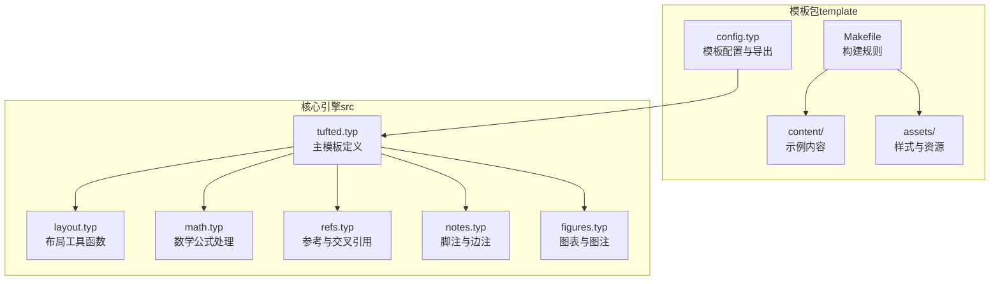
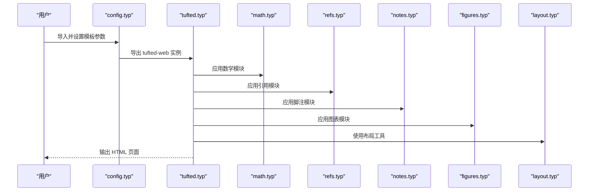
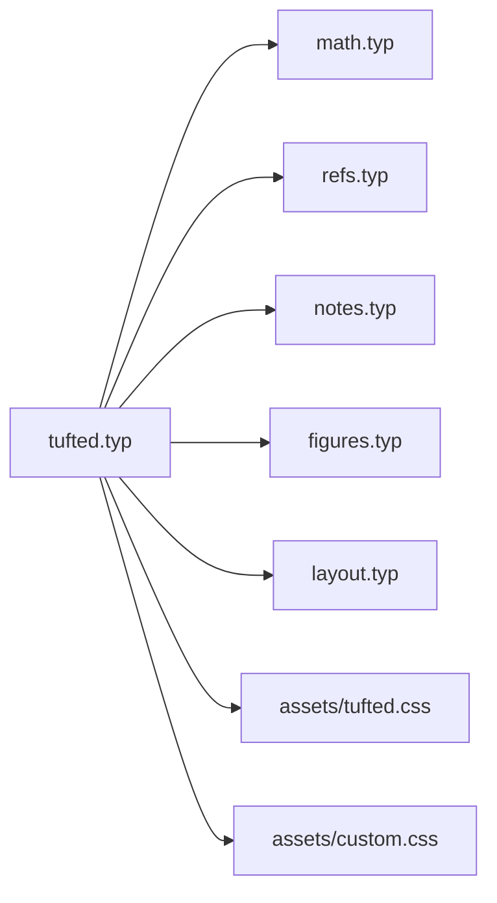

# 模板定制

<cite>
**本文引用的文件**
- [template/README.md](file://template/README.md)
- [template/config.typ](file://template/config.typ)
- [src/tufted.typ](file://src/tufted.typ)
- [src/layout.typ](file://src/layout.typ)
- [src/math.typ](file://src/math.typ)
- [src/refs.typ](file://src/refs.typ)
- [src/notes.typ](file://src/notes.typ)
- [src/figures.typ](file://src/figures.typ)
- [template/assets/tufted.css](file://template/assets/tufted.css)
- [template/assets/custom.css](file://template/assets/custom.css)
- [template/Makefile](file://template/Makefile)
- [template/content/index.typ](file://template/content/index.typ)
- [template/content/docs/01-quick-start/index.typ](file://template/content/docs/01-quick-start/index.typ)
- [template/content/blog/2024-10-04-iterators-generators/index.typ](file://template/content/blog/2024-10-04-iterators-generators/index.typ)
- [typst.toml](file://typst.toml)
</cite>

## 目录
1. [简介](#简介)
2. [项目结构](#项目结构)
3. [核心组件](#核心组件)
4. [架构总览](#架构总览)
5. [详细组件分析](#详细组件分析)
6. [依赖分析](#依赖分析)
7. [性能考量](#性能考量)
8. [故障排查指南](#故障排查指南)
9. [结论](#结论)
10. [附录](#附录)

## 简介
本指南面向希望基于 TwilightPage（Tufted）模板进行深度定制与扩展的用户。文档围绕以下目标展开：如何扩展现有模板功能（新增布局选项、修改样式系统、集成第三方组件）、模板继承与自定义模板的开发流程、主题变体与功能模块的创建范式、技术限制与约束、测试与兼容性策略、升级与维护路径，以及模板分享与发布的原则。为保证可操作性，文档在每个涉及具体实现的章节均给出“章节来源”定位到仓库中的实际文件。

## 项目结构
该仓库采用“模板包（template）+ 核心引擎（src）+ 示例内容（content）+ 资源（assets）+ 构建脚本（Makefile）”的分层组织方式。核心入口位于模板包的配置文件中，通过导入核心引擎模块实现页面渲染；内容目录按站点结构组织，构建脚本负责将 Typst 内容编译为 HTML 并复制静态资源。

**图表来源**
- [template/config.typ:1-12](file://template/config.typ#L1-L12)
- [src/tufted.typ:1-64](file://src/tufted.typ#L1-L64)
- [src/layout.typ:1-13](file://src/layout.typ#L1-L13)
- [src/math.typ:1-22](file://src/math.typ#L1-L22)
- [src/refs.typ:1-23](file://src/refs.typ#L1-L23)
- [src/notes.typ:1-27](file://src/notes.typ#L1-L27)
- [src/figures.typ:1-20](file://src/figures.typ#L1-L20)
- [template/Makefile:1-27](file://template/Makefile#L1-L27)

**章节来源**
- [template/README.md:1-34](file://template/README.md#L1-L34)
- [typst.toml:1-19](file://typst.toml#L1-L19)

## 核心组件
- 主模板与导出
  - 主模板定义了页面骨架、头部导航、样式表加载与内容区域包裹逻辑。它通过导入数学、引用、脚注、图表等子模块实现功能拼装，并以高阶函数形式暴露可配置参数（如标题、语言、链接、CSS 列表）。
  - 参考路径：[src/tufted.typ:17-63](file://src/tufted.typ#L17-L63)

- 布局工具
  - 提供边注与全宽元素的 HTML 包裹能力，便于在内容中插入边栏注释或全宽图片/图表。
  - 参考路径：[src/layout.typ:3-12](file://src/layout.typ#L3-L12)

- 数学公式
  - 定义内联与块级公式的 HTML 渲染策略，并在 HTML 目标下为公式注入语义角色与容器。
  - 参考路径：[src/math.typ:1-22](file://src/math.typ#L1-L22)

- 引用与交叉引用
  - 对方程与标题等元素的引用进行重写，生成带编号与跳转的链接。
  - 参考路径：[src/refs.typ:1-23](file://src/refs.typ#L1-L23)

- 脚注与边注
  - 将脚注渲染为上标引用与边注内容，并在 HTML 下生成锚点与跳转链接。
  - 参考路径：[src/notes.typ:1-27](file://src/notes.typ#L1-L27)

- 图表与图注
  - 重写图注显示为边注样式，并在 HTML 下将图表包装为合适的容器。
  - 参考路径：[src/figures.typ:1-20](file://src/figures.typ#L1-L20)

- 样式系统
  - 默认加载 Tufte CSS 与本地样式文件，支持变量、响应式布局、导航栏、脚注与边注交互、数学渲染优化与文章卡片等样式。
  - 参考路径：[template/assets/tufted.css:1-166](file://template/assets/tufted.css#L1-L166)、[template/assets/custom.css:1-1](file://template/assets/custom.css#L1-L1)

- 构建与运行
  - Makefile 自动发现 content 下的 Typst 文件并编译为 HTML，同时复制 assets 到输出目录。
  - 参考路径：[template/Makefile:1-27](file://template/Makefile#L1-L27)

**章节来源**
- [src/tufted.typ:1-64](file://src/tufted.typ#L1-L64)
- [src/layout.typ:1-13](file://src/layout.typ#L1-L13)
- [src/math.typ:1-22](file://src/math.typ#L1-L22)
- [src/refs.typ:1-23](file://src/refs.typ#L1-L23)
- [src/notes.typ:1-27](file://src/notes.typ#L1-L27)
- [src/figures.typ:1-20](file://src/figures.typ#L1-L20)
- [template/assets/tufted.css:1-166](file://template/assets/tufted.css#L1-L166)
- [template/assets/custom.css:1-1](file://template/assets/custom.css#L1-L1)
- [template/Makefile:1-27](file://template/Makefile#L1-L27)

## 架构总览
模板采用“配置驱动 + 子模块拼装”的架构：模板配置文件决定导出的模板实例及其参数；核心引擎模块提供可复用的功能子模块；构建脚本负责批量编译与资源复制。下图展示了从配置到渲染的关键调用链。

**图表来源**
- [template/config.typ:1-12](file://template/config.typ#L1-L12)
- [src/tufted.typ:1-64](file://src/tufted.typ#L1-L64)
- [src/math.typ:1-22](file://src/math.typ#L1-L22)
- [src/refs.typ:1-23](file://src/refs.typ#L1-L23)
- [src/notes.typ:1-27](file://src/notes.typ#L1-L27)
- [src/figures.typ:1-20](file://src/figures.typ#L1-L20)
- [src/layout.typ:1-13](file://src/layout.typ#L1-L13)

## 详细组件分析

### 组件一：模板配置与导出（config.typ）
- 功能要点
  - 从模板包导入主模板并以高阶函数形式传入标题、导航链接等参数，形成可复用的模板实例。
  - 通过“with”语法对默认模板进行轻量覆盖，适合快速定制站点外观与导航。
- 扩展建议
  - 新增参数：可在主模板中增加更多可配置项（如语言、版权信息、社交媒体链接），并在配置文件中传入。
  - 多模板变体：在同一项目中导入同一模板的不同参数组合，生成多个主题变体。
- 参考路径
  - [template/config.typ:1-12](file://template/config.typ#L1-L12)

**章节来源**
- [template/config.typ:1-12](file://template/config.typ#L1-L12)

### 组件二：主模板（tufted.typ）
- 功能要点
  - 定义页面骨架：head/meta/title/link（样式表列表）、body/header/article/section。
  - 集成子模块：数学、引用、脚注、图表模块按顺序应用到内容上。
  - 布局工具：通过导入的布局函数在内容中插入边注与全宽元素。
- 扩展建议
  - 添加新布局选项：在主模板中新增高阶参数（如页眉/页脚、侧边栏开关、暗色模式开关），并在配置文件中启用。
  - 修改样式系统：调整样式表加载顺序与来源（CDN 与本地），或引入额外样式文件。
- 参考路径
  - [src/tufted.typ:17-63](file://src/tufted.typ#L17-L63)

**章节来源**
- [src/tufted.typ:1-64](file://src/tufted.typ#L1-L64)

### 组件三：布局工具（layout.typ）
- 功能要点
  - 提供边注与全宽元素的 HTML 包裹，便于在内容中插入边栏注释或全宽媒体。
- 扩展建议
  - 新增布局：如“两列内容 + 边注”、“居中全宽”等，可在布局模块中新增高阶函数并通过主模板导入使用。
  - 与样式联动：配合 CSS 类名（如 fullwidth、marginnote）实现响应式布局。
- 参考路径
  - [src/layout.typ:3-12](file://src/layout.typ#L3-L12)

**章节来源**
- [src/layout.typ:1-13](file://src/layout.typ#L1-L13)

### 组件四：数学公式（math.typ）
- 功能要点
  - 在 HTML 目标下为内联与块级公式分别注入语义角色与容器，提升可访问性与渲染一致性。
- 扩展建议
  - 自定义编号：调整公式编号策略（如章节编号、连续编号）。
  - 第三方渲染：若需更丰富的数学渲染，可在样式表中引入外部库并配合此模块的 HTML 注入。
- 参考路径
  - [src/math.typ:1-22](file://src/math.typ#L1-L22)

**章节来源**
- [src/math.typ:1-22](file://src/math.typ#L1-L22)

### 组件五：引用与交叉引用（refs.typ）
- 功能要点
  - 对特定元素（如方程、标题）的引用进行重写，生成带编号与跳转的链接。
- 扩展建议
  - 新增引用类型：在模块中添加对新元素类型的识别与链接生成逻辑。
  - 编号策略：统一调整编号格式与显示策略，确保跨页面一致性。
- 参考路径
  - [src/refs.typ:1-23](file://src/refs.typ#L1-L23)

**章节来源**
- [src/refs.typ:1-23](file://src/refs.typ#L1-L23)

### 组件六：脚注与边注（notes.typ）
- 功能要点
  - 将脚注渲染为上标引用与边注内容，HTML 下生成锚点与双向跳转。
- 扩展建议
  - 自定义脚注样式：通过 CSS 类名与交互效果增强脚注体验。
  - 边注内容：在边注中嵌套复杂内容（如代码片段、图片、表格）。
- 参考路径
  - [src/notes.typ:1-27](file://src/notes.typ#L1-L27)

**章节来源**
- [src/notes.typ:1-27](file://src/notes.typ#L1-L27)

### 组件七：图表与图注（figures.typ）
- 功能要点
  - 将图注渲染为边注样式，并在 HTML 下将图表包装为合适的容器。
- 扩展建议
  - 全宽图表：结合布局模块的全宽函数实现全宽图表展示。
  - 图表交互：在样式表中引入交互库，配合 HTML 容器实现缩放、切换等。
- 参考路径
  - [src/figures.typ:1-20](file://src/figures.typ#L1-L20)

**章节来源**
- [src/figures.typ:1-20](file://src/figures.typ#L1-L20)

### 组件八：样式系统（tufted.css 与 custom.css）
- 功能要点
  - 变量与基础样式：字体大小、图片最大高度等。
  - 响应式布局：窄屏时边注内联、自动断词等。
  - 导航栏：链接样式、悬停与聚焦态。
  - 脚注与边注：高亮与交互效果。
  - 数学渲染：字号与深色模式下的反色处理。
  - 文章卡片：博客列表等 UI。
- 扩展建议
  - 主题变体：通过变量与媒体查询实现明/暗主题切换。
  - 组件化样式：将导航栏、卡片、脚注等拆分为独立样式块，便于复用与覆盖。
- 参考路径
  - [template/assets/tufted.css:1-166](file://template/assets/tufted.css#L1-L166)
  - [template/assets/custom.css:1-1](file://template/assets/custom.css#L1-L1)

**章节来源**
- [template/assets/tufted.css:1-166](file://template/assets/tufted.css#L1-L166)
- [template/assets/custom.css:1-1](file://template/assets/custom.css#L1-L1)

### 组件九：构建与运行（Makefile）
- 功能要点
  - 自动发现 content 下的 Typst 文件（排除以“_”开头的路径），编译为 HTML。
  - 复制 assets 到输出目录，清理生成文件。
- 扩展建议
  - 扩展输入：在规则中加入更多目录或文件模式。
  - 输出格式：在编译命令中增加其他格式（如 PDF）。
- 参考路径
  - [template/Makefile:1-27](file://template/Makefile#L1-L27)

**章节来源**
- [template/Makefile:1-27](file://template/Makefile#L1-L27)

### 组件十：示例内容与使用（content/index.typ、docs/01-quick-start/index.typ、blog/...）
- 功能要点
  - 展示如何导入模板、设置标题、使用边注与图注、嵌入 Markdown 内容等。
- 扩展建议
  - 新增内容类型：为文档、博客、作品集等创建专用模板与样式。
  - 集成第三方：在内容中嵌入外部资源（如视频、图表库），并在样式中适配。
- 参考路径
  - [template/content/index.typ:1-33](file://template/content/index.typ#L1-L33)
  - [template/content/docs/01-quick-start/index.typ:1-24](file://template/content/docs/01-quick-start/index.typ#L1-L24)
  - [template/content/blog/2024-10-04-iterators-generators/index.typ:1-53](file://template/content/blog/2024-10-04-iterators-generators/index.typ#L1-L53)

**章节来源**
- [template/content/index.typ:1-33](file://template/content/index.typ#L1-L33)
- [template/content/docs/01-quick-start/index.typ:1-24](file://template/content/docs/01-quick-start/index.typ#L1-L24)
- [template/content/blog/2024-10-04-iterators-generators/index.typ:1-53](file://template/content/blog/2024-10-04-iterators-generators/index.typ#L1-L53)

## 依赖分析
- 模块耦合关系
  - 主模板依赖数学、引用、脚注、图表与布局模块；这些模块彼此独立，可通过主模板按需组合。
  - 样式系统与布局工具存在直接关联（类名与容器），需保持一致。
- 外部依赖
  - Tufte CSS 作为默认样式来源，可通过配置替换为自定义 CDN 或本地文件。
- 构建依赖
  - Makefile 依赖 Typst 编译器与 Make 工具链。

**图表来源**
- [src/tufted.typ:1-64](file://src/tufted.typ#L1-L64)
- [src/math.typ:1-22](file://src/math.typ#L1-L22)
- [src/refs.typ:1-23](file://src/refs.typ#L1-L23)
- [src/notes.typ:1-27](file://src/notes.typ#L1-L27)
- [src/figures.typ:1-20](file://src/figures.typ#L1-L20)
- [src/layout.typ:1-13](file://src/layout.typ#L1-L13)
- [template/assets/tufted.css:1-166](file://template/assets/tufted.css#L1-L166)
- [template/assets/custom.css:1-1](file://template/assets/custom.css#L1-L1)

**章节来源**
- [src/tufted.typ:1-64](file://src/tufted.typ#L1-L64)
- [src/math.typ:1-22](file://src/math.typ#L1-L22)
- [src/refs.typ:1-23](file://src/refs.typ#L1-L23)
- [src/notes.typ:1-27](file://src/notes.typ#L1-L27)
- [src/figures.typ:1-20](file://src/figures.typ#L1-L20)
- [src/layout.typ:1-13](file://src/layout.typ#L1-L13)
- [template/assets/tufted.css:1-166](file://template/assets/tufted.css#L1-L166)
- [template/assets/custom.css:1-1](file://template/assets/custom.css#L1-L1)

## 性能考量
- 编译性能
  - 批量编译：Makefile 会遍历 content 下所有匹配文件，建议按需组织内容层级，避免过多小文件导致编译时间过长。
  - 样式体积：合并与压缩 CSS，减少网络传输开销。
- 运行时性能
  - 样式与脚本：尽量将第三方库的加载延迟到需要时，避免阻塞首屏渲染。
  - 媒体资源：控制图片与视频尺寸，使用现代格式与懒加载策略。
- 可访问性
  - 为数学公式与图表提供语义角色与替代文本，确保屏幕阅读器友好。

[本节为通用性能建议，不直接分析具体文件]

## 故障排查指南
- 构建失败
  - 检查 Makefile 中的编译命令与根目录参数是否正确。
  - 确认 Typst 版本满足要求（参见包元数据）。
- 样式未生效
  - 确认样式表加载顺序与来源（CDN 与本地）。
  - 检查自定义样式是否被默认样式覆盖。
- 内容渲染异常
  - 检查子模块的导入与应用顺序，确保数学、引用、脚注、图表模块按预期执行。
  - 验证布局工具函数的使用位置与容器类名。
- 第三方组件集成问题
  - 确保在 HTML 目标下正确注入容器与脚本，并在样式中适配其外观。

**章节来源**
- [template/Makefile:1-27](file://template/Makefile#L1-L27)
- [typst.toml:10-10](file://typst.toml#L10-L10)
- [src/tufted.typ:21-48](file://src/tufted.typ#L21-L48)
- [template/assets/tufted.css:1-166](file://template/assets/tufted.css#L1-L166)

## 结论
通过“配置驱动 + 子模块拼装 + 样式系统 + 构建脚本”的架构，TwilightPage 模板提供了清晰的定制路径：在配置文件中快速覆盖参数，在核心引擎中按需组合功能模块，在样式系统中实现主题与交互，在构建脚本中自动化产出。遵循本文的最佳实践与约束，可以高效地创建主题变体、添加新功能模块、集成第三方组件，并确保兼容性与可维护性。

[本节为总结性内容，不直接分析具体文件]

## 附录

### A. 模板继承与自定义模板开发流程
- 步骤
  - 在配置文件中导入模板包并导出模板实例。
  - 通过高阶参数覆盖默认行为（标题、导航、语言、CSS 列表）。
  - 在主模板中组合子模块，必要时新增布局工具函数。
  - 在样式系统中引入自定义 CSS，或替换默认样式来源。
  - 使用构建脚本批量编译内容并复制资源。
- 参考路径
  - [template/config.typ:1-12](file://template/config.typ#L1-L12)
  - [src/tufted.typ:17-63](file://src/tufted.typ#L17-L63)
  - [src/layout.typ:3-12](file://src/layout.typ#L3-L12)
  - [template/assets/tufted.css:1-166](file://template/assets/tufted.css#L1-L166)
  - [template/Makefile:1-27](file://template/Makefile#L1-L27)

**章节来源**
- [template/config.typ:1-12](file://template/config.typ#L1-L12)
- [src/tufted.typ:1-64](file://src/tufted.typ#L1-L64)
- [src/layout.typ:1-13](file://src/layout.typ#L1-L13)
- [template/assets/tufted.css:1-166](file://template/assets/tufted.css#L1-L166)
- [template/Makefile:1-27](file://template/Makefile#L1-L27)

### B. 主题变体与功能模块示例
- 主题变体
  - 通过变量与媒体查询实现明/暗主题切换，或引入多套 CSS 文件并通过配置选择。
  - 参考路径：[template/assets/tufted.css:1-166](file://template/assets/tufted.css#L1-L166)
- 功能模块
  - 新增布局：在布局模块中新增高阶函数并通过主模板导入使用。
  - 参考路径：[src/layout.typ:3-12](file://src/layout.typ#L3-L12)
- 示例内容
  - 在示例内容中演示新功能的使用方式。
  - 参考路径：[template/content/index.typ:1-33](file://template/content/index.typ#L1-L33)

**章节来源**
- [template/assets/tufted.css:1-166](file://template/assets/tufted.css#L1-L166)
- [src/layout.typ:1-13](file://src/layout.typ#L1-L13)
- [template/content/index.typ:1-33](file://template/content/index.typ#L1-L33)

### C. 技术限制与约束
- 目标平台
  - 当前模板主要针对 HTML 目标，其他格式（如 PDF）需额外配置。
- 样式与脚本
  - 样式优先级与覆盖关系需谨慎设计，避免冲突。
- 第三方组件
  - 需要在 HTML 目标下正确注入容器与脚本，并确保样式适配。
- 参考路径
  - [src/tufted.typ:36-62](file://src/tufted.typ#L36-L62)
  - [src/math.typ:5-17](file://src/math.typ#L5-L17)
  - [src/notes.typ:3-22](file://src/notes.typ#L3-L22)
  - [src/figures.typ:11-16](file://src/figures.typ#L11-L16)

**章节来源**
- [src/tufted.typ:1-64](file://src/tufted.typ#L1-L64)
- [src/math.typ:1-22](file://src/math.typ#L1-L22)
- [src/notes.typ:1-27](file://src/notes.typ#L1-L27)
- [src/figures.typ:1-20](file://src/figures.typ#L1-L20)

### D. 测试方法与兼容性考虑
- 测试方法
  - 单文件测试：针对关键模块（数学、引用、脚注、图表）编写最小示例，验证渲染结果。
  - 端到端测试：使用构建脚本生成 HTML，检查关键元素是否存在与样式是否正确。
- 兼容性
  - 不同浏览器对 CSS 与脚本的支持差异，需在样式中添加必要的回退与前缀。
  - Typst 版本升级可能影响渲染行为，需在包元数据中声明兼容范围。
- 参考路径
  - [template/Makefile:14-16](file://template/Makefile#L14-L16)
  - [typst.toml:10-10](file://typst.toml#L10-L10)

**章节来源**
- [template/Makefile:1-27](file://template/Makefile#L1-L27)
- [typst.toml:10-10](file://typst.toml#L10-L10)

### E. 更新与升级维护
- 升级路径
  - 在配置文件中更新模板包版本，逐项验证各子模块与样式变更。
  - 使用构建脚本重新编译，修复样式与内容中的不兼容改动。
- 维护策略
  - 保持配置文件与主模板的最小变更，优先通过参数覆盖实现定制。
  - 将自定义样式集中在自定义 CSS 文件中，便于升级时保留。
- 参考路径
  - [template/config.typ:1-12](file://template/config.typ#L1-L12)
  - [template/assets/custom.css:1-1](file://template/assets/custom.css#L1-L1)
  - [template/Makefile:1-27](file://template/Makefile#L1-L27)

**章节来源**
- [template/config.typ:1-12](file://template/config.typ#L1-L12)
- [template/assets/custom.css:1-1](file://template/assets/custom.css#L1-L1)
- [template/Makefile:1-27](file://template/Makefile#L1-L27)

### F. 分享与发布指导
- 发布准备
  - 在包元数据中完善描述、关键词、分类与入口点。
  - 提供模板入口文件与示例内容，确保他人可一键初始化与构建。
- 分发渠道
  - 通过包注册表发布，提供清晰的 README 与版本说明。
- 参考路径
  - [typst.toml:1-19](file://typst.toml#L1-L19)
  - [template/README.md:1-34](file://template/README.md#L1-L34)

**章节来源**
- [typst.toml:1-19](file://typst.toml#L1-L19)
- [template/README.md:1-34](file://template/README.md#L1-L34)