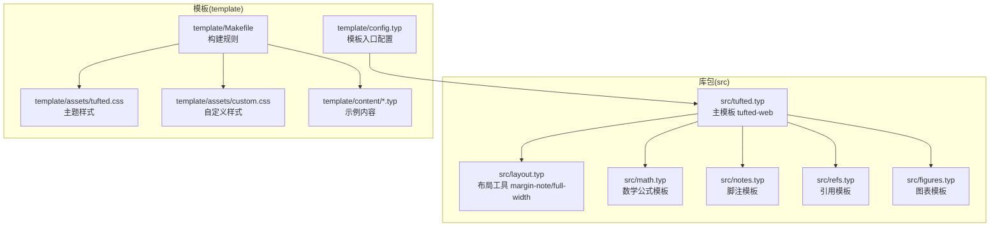
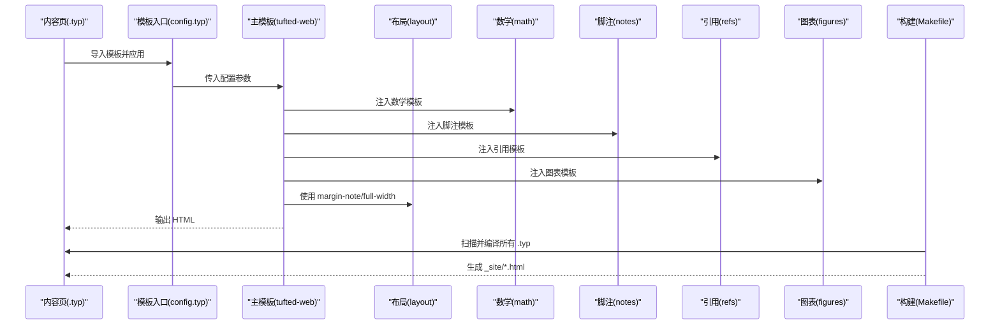
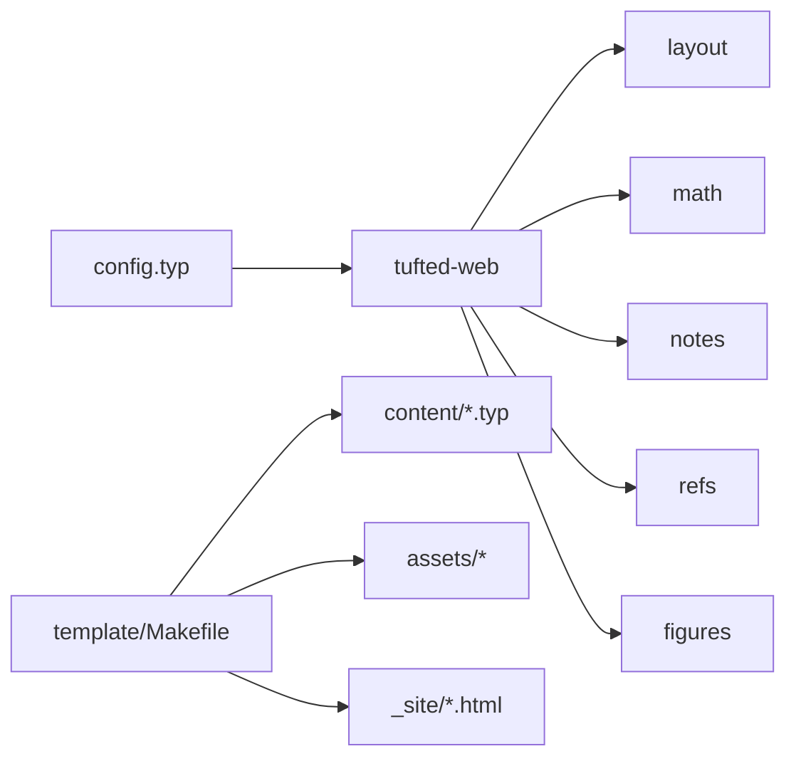

# 模板系统

<cite>
**本文引用的文件**
- [src/tufted.typ](file://src/tufted.typ)
- [src/layout.typ](file://src/layout.typ)
- [src/math.typ](file://src/math.typ)
- [src/notes.typ](file://src/notes.typ)
- [src/refs.typ](file://src/refs.typ)
- [src/figures.typ](file://src/figures.typ)
- [template/config.typ](file://template/config.typ)
- [template/Makefile](file://template/Makefile)
- [Makefile](file://Makefile)
- [typst.toml](file://typst.toml)
- [template/assets/tufted.css](file://template/assets/tufted.css)
- [template/assets/custom.css](file://template/assets/custom.css)
- [template/content/index.typ](file://template/content/index.typ)
- [template/content/docs/01-quick-start/index.typ](file://template/content/docs/01-quick-start/index.typ)
- [template/content/blog/2024-10-04-iterators-generators/index.typ](file://template/content/blog/2024-10-04-iterators-generators/index.typ)
- [template/content/blog/2025-04-16-monkeys-apes/index.typ](file://template/content/blog/2025-04-16-monkeys-apes/index.typ)
</cite>

## 目录
1. [简介](#简介)
2. [项目结构](#项目结构)
3. [核心组件](#核心组件)
4. [架构总览](#架构总览)
5. [详细组件分析](#详细组件分析)
6. [依赖关系分析](#依赖关系分析)
7. [性能考量](#性能考量)
8. [故障排查指南](#故障排查指南)
9. [结论](#结论)
10. [附录](#附录)

## 简介
本文件系统性介绍 TwilightPage（基于 tufted）的模板系统：从架构设计、主模板函数 tufted-web 的能力与参数、模板配置文件结构，到布局工具函数（如 margin-note 侧注与 full-width 全宽容器）、模板继承与自定义流程、样式扩展与调试技巧，以及与内容处理系统的集成方式。目标是帮助用户从基础使用到高级定制完成端到端掌握。

## 项目结构
该仓库采用“库包 + 模板”双层结构：
- 库包层（src/）：封装可复用的模板片段与工具函数，形成 tufted-web 主模板及子模板（数学、脚注、引用、图表等）。
- 模板层（template/）：提供示例网站内容、构建脚本与样式资源，演示如何使用库包中的模板函数与样式。

图示来源
- [src/tufted.typ:1-64](file://src/tufted.typ#L1-L64)
- [src/layout.typ:1-13](file://src/layout.typ#L1-L13)
- [src/math.typ:1-22](file://src/math.typ#L1-L22)
- [src/notes.typ:1-27](file://src/notes.typ#L1-L27)
- [src/refs.typ:1-23](file://src/refs.typ#L1-L23)
- [src/figures.typ:1-20](file://src/figures.typ#L1-L20)
- [template/config.typ:1-12](file://template/config.typ#L1-L12)
- [template/Makefile:1-27](file://template/Makefile#L1-L27)
- [template/assets/tufted.css:1-166](file://template/assets/tufted.css#L1-L166)
- [template/assets/custom.css:1-1](file://template/assets/custom.css#L1-L1)

章节来源
- [typst.toml:1-19](file://typst.toml#L1-L19)
- [Makefile:1-60](file://Makefile#L1-L60)
- [template/Makefile:1-27](file://template/Makefile#L1-L27)

## 核心组件
- 主模板 tufted-web：负责页面骨架、语言设置、样式注入、头部导航与正文包裹，并串联数学、脚注、引用、图表等子模板。
- 布局工具：margin-note 用于在边注区渲染内容；full-width 提供全宽容器占位。
- 子模板：
  - 数学模板：统一公式编号与 HTML 渲染角色。
  - 脚注模板：生成脚注引用与边注中的脚注内容。
  - 引用模板：重写方程与标题引用显示。
  - 图表模板：重写图注与图元素，使其适配边注样式。

章节来源
- [src/tufted.typ:17-63](file://src/tufted.typ#L17-L63)
- [src/layout.typ:3-12](file://src/layout.typ#L3-L12)
- [src/math.typ:1-22](file://src/math.typ#L1-L22)
- [src/notes.typ:1-27](file://src/notes.typ#L1-L27)
- [src/refs.typ:1-23](file://src/refs.typ#L1-L23)
- [src/figures.typ:1-20](file://src/figures.typ#L1-L20)

## 架构总览
下图展示了从内容页到最终 HTML 的编译链路与模板装配过程：

图示来源
- [template/content/index.typ:1-33](file://template/content/index.typ#L1-L33)
- [template/config.typ:3-11](file://template/config.typ#L3-L11)
- [src/tufted.typ:17-63](file://src/tufted.typ#L17-L63)
- [src/layout.typ:3-12](file://src/layout.typ#L3-L12)
- [src/math.typ:1-22](file://src/math.typ#L1-L22)
- [src/notes.typ:1-27](file://src/notes.typ#L1-L27)
- [src/refs.typ:1-23](file://src/refs.typ#L1-L23)
- [src/figures.typ:1-20](file://src/figures.typ#L1-L20)
- [template/Makefile:14-16](file://template/Makefile#L14-L16)

## 详细组件分析

### 主模板 tufted-web
- 功能概览
  - 设置语言与文本环境。
  - 注入多个子模板以统一数学、脚注、引用与图表的渲染行为。
  - 构造 HTML 文档骨架：head（meta、title、多条样式表）、body（header 导航、article.main.content）。
  - 支持通过参数自定义标题、语言与样式表列表。
- 关键参数
  - header-links: 导航链接集合，用于生成顶部导航。
  - title: 页面标题。
  - lang: 文档语言。
  - css: 样式表数组，支持 CDN 与本地路径。
  - content: 主体内容占位。
- 处理流程
  - 在 head 中循环输出 css 列表。
  - 在 body 中先渲染 header，再包裹 article.section(content)。
  - 通过 show: 调用各子模板，确保内容在 HTML 目标下被正确包装与标注。

章节来源
- [src/tufted.typ:17-63](file://src/tufted.typ#L17-L63)

### 布局工具：margin-note 与 full-width
- margin-note
  - 将传入内容渲染为带 marginnote 类的内联块，适合窄屏时自动转为段落式显示。
  - 可用于插入图片或简短说明，配合脚注高亮联动。
- full-width
  - 将传入内容放入带 fullwidth 类的容器，实现视觉上的全宽布局。

章节来源
- [src/layout.typ:3-12](file://src/layout.typ#L3-L12)
- [template/assets/tufted.css:30-55](file://template/assets/tufted.css#L30-L55)

### 数学模板 template-math
- 统一行内与块级公式的编号格式。
- 在 HTML 目标下为公式添加 role 与框架包装，便于样式与交互处理。
- 对块级公式使用 figure 容器，行内公式使用 span 容器。

章节来源
- [src/math.typ:1-22](file://src/math.typ#L1-L22)
- [template/assets/tufted.css:125-137](file://template/assets/tufted.css#L125-L137)

### 脚注模板 template-notes
- 将脚注引用渲染为上标链接，并生成对应的脚注锚点。
- 在边注区域渲染完整的脚注内容，支持与引用的高亮联动效果。

章节来源
- [src/notes.typ:1-27](file://src/notes.typ#L1-L27)
- [template/assets/tufted.css:94-118](file://template/assets/tufted.css#L94-L118)

### 引用模板 template-refs
- 重写方程与标题的引用显示，确保编号与计数器一致。
- 对标题引用进行引号包裹，提升可读性。

章节来源
- [src/refs.typ:1-23](file://src/refs.typ#L1-L23)

### 图表模板 template-figures
- 将图注渲染为 marginnote，使图注与脚注风格一致。
- 在 HTML 目标下重新组合 figure 的 caption 与 body。

章节来源
- [src/figures.typ:1-20](file://src/figures.typ#L1-L20)

### 模板配置与继承
- 模板入口 config.typ
  - 通过导入 tufted 包并调用 tufted-web.with(...) 进行参数覆盖，实现“继承 + 覆盖”的模式。
  - 预置 header-links 与 title，便于快速搭建站点。
- 内容页继承
  - 示例内容页通过导入 config.typ 中的 template 并应用 #show: template，即可获得统一外观。
  - 可在内容页再次调用 template.with(...) 覆盖单页标题等属性。

章节来源
- [template/config.typ:3-11](file://template/config.typ#L3-L11)
- [template/content/index.typ:1-3](file://template/content/index.typ#L1-L3)
- [template/content/docs/01-quick-start/index.typ:1-2](file://template/content/docs/01-quick-start/index.typ#L1-L2)

### 样式系统与响应式
- 主题样式 tufted.css
  - 定义变量、基础排版、导航栏、脚注/边注联动高亮、数学渲染优化、文章卡片等。
  - 在窄屏下将 marginnote 转换为块级显示并限制图片宽度，启用连字符断词。
- 自定义样式 custom.css
  - 作为覆盖层，建议在此添加站点专属样式，避免直接修改主题文件。

章节来源
- [template/assets/tufted.css:1-166](file://template/assets/tufted.css#L1-L166)
- [template/assets/custom.css:1-1](file://template/assets/custom.css#L1-L1)

### 内容与构建集成
- 构建规则
  - 模板 Makefile 扫描 content 下的 .typ 文件（排除以 _ 开头的隐藏路径），编译至 _site。
  - 自动复制 assets 至 _site。
- 顶层 Makefile
  - 提供 link（本地包缓存链接）、sync-assets（同步资源）、check（包检查）、build（打包发布）等任务。
  - html 目标会先执行 link，再进入 template 执行其 html 目标。

章节来源
- [template/Makefile:1-27](file://template/Makefile#L1-L27)
- [Makefile:1-60](file://Makefile#L1-L60)

## 依赖关系分析
- 模块耦合
  - tufted-web 依赖 layout、math、notes、refs、figures 等子模板，形成“主模板 + 子模板”的组合式依赖。
  - 子模板之间低耦合，各自独立处理特定领域（数学、脚注、引用、图表）。
- 外部依赖
  - 主模板通过 css 参数引入外部样式（CDN）与本地样式（/assets/tufted.css、/assets/custom.css）。
- 构建依赖
  - 模板 Makefile 依赖 typst 编译器与 HTML 目标特性。
  - 顶层 Makefile 依赖本地包缓存与打包工具。

图示来源
- [src/tufted.typ:17-63](file://src/tufted.typ#L17-L63)
- [src/layout.typ:3-12](file://src/layout.typ#L3-L12)
- [src/math.typ:1-22](file://src/math.typ#L1-L22)
- [src/notes.typ:1-27](file://src/notes.typ#L1-L27)
- [src/refs.typ:1-23](file://src/refs.typ#L1-L23)
- [src/figures.typ:1-20](file://src/figures.typ#L1-L20)
- [template/config.typ:3-11](file://template/config.typ#L3-L11)
- [template/Makefile:14-20](file://template/Makefile#L14-L20)

章节来源
- [typst.toml:15-19](file://typst.toml#L15-L19)

## 性能考量
- 编译阶段
  - 合理拆分子模板，避免在主模板中做重型逻辑，有助于增量编译与缓存命中。
  - 控制样式表数量与体积，优先使用 CDN 与按需加载策略。
- 运行阶段
  - 响应式样式在窄屏下将边注转为块级，减少复杂定位计算，提升首屏渲染效率。
  - 数学渲染采用轻量框架包装，避免过度 DOM 结构。

## 故障排查指南
- 页面未显示边注
  - 检查是否在 HTML 目标下渲染（子模板仅在 target() == "html" 时生效）。
  - 确认 margin-note 的类名与样式文件一致。
- 脚注跳转异常
  - 核对脚注编号与锚点 id 是否匹配；确认引用与脚注内容的 id 生成逻辑一致。
- 数学公式显示异常
  - 确认数学模板已注入；检查 role 与 figure/span 的包装是否正确。
- 构建失败
  - 确保 typst 已安装且版本满足要求；检查 template/Makefile 的编译命令与路径。
  - 若使用本地包，请确认 link 目标指向正确的版本目录。

## 结论
TwilightPage 的模板系统以 tufted-web 为核心，通过子模板模块化实现数学、脚注、引用、图表的统一渲染；借助布局工具提供边注与全宽容器；通过配置文件实现继承与覆盖，结合 Makefile 实现自动化构建。该体系兼顾易用性与可扩展性，既适合快速起步，也支持深度定制。

## 附录

### 快速开始与基础使用
- 初始化项目：使用模板入口配置创建新站点。
- 构建与预览：运行构建命令生成静态站点。
- 内容编写：在 content 下新增 .typ 文件，导入 template 并应用 #show: template。

章节来源
- [template/content/docs/01-quick-start/index.typ:8-23](file://template/content/docs/01-quick-start/index.typ#L8-L23)
- [template/content/index.typ:1-33](file://template/content/index.typ#L1-L33)

### 自定义模板开发流程
- 新增子模板：在 src/ 下新增 .typ 文件，导出命名函数并在 tufted-web 中注入。
- 覆盖默认行为：在 config.typ 或内容页使用 template.with(...) 覆盖参数。
- 样式扩展：在 template/assets/custom.css 中添加覆盖样式，避免直接修改主题文件。
- 构建验证：使用 make check 与 make html 验证包与页面生成。

章节来源
- [src/tufted.typ:27-32](file://src/tufted.typ#L27-L32)
- [template/config.typ:3-11](file://template/config.typ#L3-L11)
- [template/assets/custom.css:1-1](file://template/assets/custom.css#L1-L1)
- [Makefile:50-59](file://Makefile#L50-L59)

### 模板调试技巧
- 分步验证：逐个启用子模板，定位问题来源。
- 浏览器检查：观察元素类名与 role 属性，核对样式是否生效。
- 构建日志：关注 Makefile 的编译输出，定位路径与权限问题。
- 版本一致性：确保 typst 版本与包声明一致，避免兼容性问题。

### 典型使用示例（路径指引）
- 边注插入与脚注联动：参考示例内容页中边注与脚注的混用。
- 全宽容器：在需要强调的段落使用全宽容器。
- 数学公式：在需要编号与块级显示的公式处使用数学模板。

章节来源
- [template/content/index.typ:7-14](file://template/content/index.typ#L7-L14)
- [template/content/blog/2024-10-04-iterators-generators/index.typ:46-46](file://template/content/blog/2024-10-04-iterators-generators/index.typ#L46-L46)
- [template/content/blog/2025-04-16-monkeys-apes/index.typ:8-10](file://template/content/blog/2025-04-16-monkeys-apes/index.typ#L8-L10)