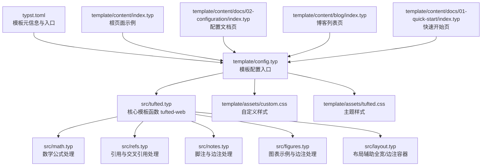
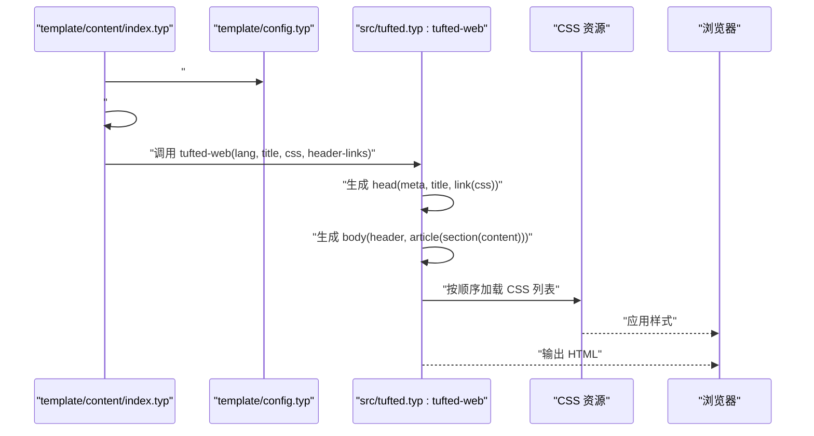
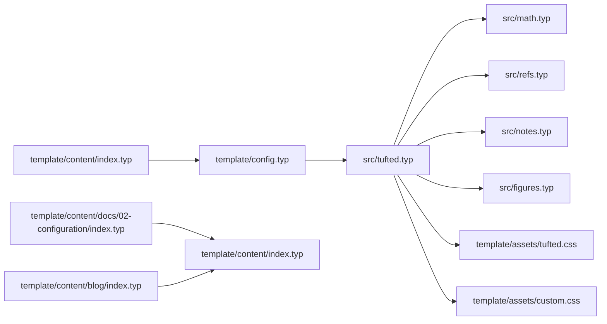

# 配置系统

<cite>
**本文引用的文件**
- [template/config.typ](file://template/config.typ)
- [src/tufted.typ](file://src/tufted.typ)
- [src/layout.typ](file://src/layout.typ)
- [src/math.typ](file://src/math.typ)
- [src/refs.typ](file://src/refs.typ)
- [src/notes.typ](file://src/notes.typ)
- [src/figures.typ](file://src/figures.typ)
- [template/README.md](file://template/README.md)
- [typst.toml](file://typst.toml)
- [template/content/index.typ](file://template/content/index.typ)
- [template/content/docs/02-configuration/index.typ](file://template/content/docs/02-configuration/index.typ)
- [template/content/blog/index.typ](file://template/content/blog/index.typ)
- [template/content/docs/01-quick-start/index.typ](file://template/content/docs/01-quick-start/index.typ)
- [template/assets/custom.css](file://template/assets/custom.css)
- [template/assets/tufted.css](file://template/assets/tufted.css)
</cite>

## 目录
1. [简介](#简介)
2. [项目结构](#项目结构)
3. [核心组件](#核心组件)
4. [架构总览](#架构总览)
5. [详细组件分析](#详细组件分析)
6. [依赖关系分析](#依赖关系分析)
7. [性能考量](#性能考量)
8. [故障排查指南](#故障排查指南)
9. [结论](#结论)
10. [附录](#附录)

## 简介
本文件系统性介绍 TwilightPage 模板配置系统的架构与使用方法，重点围绕 template/config.typ 配置文件展开，解释网站标题、语言设置、CSS 资源路径、导航链接等配置项的作用与设置方式；阐述配置的继承与覆盖机制；给出完整配置示例与最佳实践，并说明配置参数对模板渲染的影响及优先级规则。同时，结合实际代码路径为读者提供可操作的参考。

## 项目结构
该模板采用“包（package）+模板（template）”的组织方式：核心逻辑位于 src/tufted.typ，模板入口与示例位于 template/ 目录。typst.toml 指定模板入口为 template/config.typ，构建时由 Makefile 或命令行触发编译。

图表来源
- [typst.toml:15-19](file://typst.toml#L15-L19)
- [template/config.typ:1-12](file://template/config.typ#L1-L12)
- [src/tufted.typ:17-63](file://src/tufted.typ#L17-L63)
- [src/math.typ:1-22](file://src/math.typ#L1-L22)
- [src/refs.typ:1-23](file://src/refs.typ#L1-L23)
- [src/notes.typ:1-27](file://src/notes.typ#L1-L27)
- [src/figures.typ:1-20](file://src/figures.typ#L1-L20)
- [src/layout.typ:1-13](file://src/layout.typ#L1-L13)
- [template/assets/custom.css:1-1](file://template/assets/custom.css#L1-L1)
- [template/assets/tufted.css:1-166](file://template/assets/tufted.css#L1-L166)
- [template/content/index.typ:1-33](file://template/content/index.typ#L1-L33)
- [template/content/docs/02-configuration/index.typ:1-53](file://template/content/docs/02-configuration/index.typ#L1-L53)
- [template/content/blog/index.typ:1-14](file://template/content/blog/index.typ#L1-L14)
- [template/content/docs/01-quick-start/index.typ:1-24](file://template/content/docs/01-quick-start/index.typ#L1-L24)

章节来源
- [typst.toml:1-19](file://typst.toml#L1-L19)
- [template/README.md:1-34](file://template/README.md#L1-L34)

## 核心组件
- 模板入口与配置
  - template/config.typ 导入外部包并以 tufted.tufted-web.with(...) 的形式定制模板，主要配置项包括 header-links（导航链接）、title（网站标题），以及通过 tufted-web 默认提供的 lang（语言）与 css（CSS 资源数组）。
- 核心模板函数
  - src/tufted.typ 定义 tufted-web 函数，负责生成 HTML 文档骨架（head/meta/title/link/css），并在 body 中插入 header 导航与文章主体内容。
- 内容与样式
  - template/assets/tufted.css 与 template/assets/custom.css 提供主题与自定义样式；template/content/*.typ 页面通过 #show: template.with(...) 进行局部覆盖。
- 辅助模块
  - src/math.typ、src/refs.typ、src/notes.typ、src/figures.typ 分别处理数学公式、引用、脚注与图示；src/layout.typ 提供 margin-note 与 full-width 布局工具。

章节来源
- [template/config.typ:1-12](file://template/config.typ#L1-L12)
- [src/tufted.typ:17-63](file://src/tufted.typ#L17-L63)
- [template/assets/tufted.css:1-166](file://template/assets/tufted.css#L1-L166)
- [template/assets/custom.css:1-1](file://template/assets/custom.css#L1-L1)
- [src/math.typ:1-22](file://src/math.typ#L1-L22)
- [src/refs.typ:1-23](file://src/refs.typ#L1-L23)
- [src/notes.typ:1-27](file://src/notes.typ#L1-L27)
- [src/figures.typ:1-20](file://src/figures.typ#L1-L20)
- [src/layout.typ:1-13](file://src/layout.typ#L1-L13)

## 架构总览
下图展示了从配置到页面渲染的关键流程：template/config.typ 定义全局模板，页面通过 #show: template.with(...) 在各自层级进行覆盖，最终由 tufted-web 渲染出 HTML 并加载 CSS 资源。

图表来源
- [template/content/index.typ:1-33](file://template/content/index.typ#L1-L33)
- [template/config.typ:1-12](file://template/config.typ#L1-L12)
- [src/tufted.typ:17-63](file://src/tufted.typ#L17-L63)
- [template/assets/tufted.css:1-166](file://template/assets/tufted.css#L1-L166)
- [template/assets/custom.css:1-1](file://template/assets/custom.css#L1-L1)

## 详细组件分析

### 配置文件 config.typ 结构与参数详解
- 入口与导入
  - 通过 #import 引入外部包，并以 tufted.tufted-web.with(...) 创建模板实例。
- 关键参数
  - header-links: 一个映射，键为相对路径，值为链接文本，用于生成顶部导航。
  - title: 页面标题，将作为 <title> 输出。
  - lang: 文档语言，默认值来自 tufted-web 参数定义。
  - css: CSS 资源数组，按顺序加载，后加载的样式具有更高优先级（见“优先级规则”）。
- 示例与路径
  - 参考路径：[template/config.typ:1-12](file://template/config.typ#L1-L12)

章节来源
- [template/config.typ:1-12](file://template/config.typ#L1-L12)

### 核心模板函数 tufted-web 的作用与渲染流程
- 功能概述
  - 生成完整的 HTML 文档结构，包括 head（meta、viewport、charset、title、link 加载 css）、body（header 导航、article.main.content）。
- 参数与默认值
  - header-links: none（无导航）
  - title: "Tufted"
  - lang: "en"
  - css: 包含 Tufte CSS CDN 与本地样式文件的数组
- 渲染流程
  - 先注入数学、引用、脚注、图示等预处理模块；
  - 设置文本语言；
  - 生成 head 与 body，并循环输出 css 数组中的每个链接；
  - 生成 header 导航（若提供）与文章主体内容。
- 示例与路径
  - 参考路径：[src/tufted.typ:17-63](file://src/tufted.typ#L17-L63)

章节来源
- [src/tufted.typ:17-63](file://src/tufted.typ#L17-L63)

### 导航链接与标题的设置方法
- 全局导航
  - 在 config.typ 中通过 header-links 映射设置站点主导航，键为路径，值为显示文本。
- 页面级覆盖
  - 在子页面（如 template/content/blog/index.typ）通过 #show: template.with(title: "...") 覆盖标题；也可在同文件内重新定义 header-links 实现局部导航差异。
- 示例与路径
  - 全局导航示例：[template/config.typ:4-10](file://template/config.typ#L4-L10)
  - 页面级标题覆盖示例：[template/content/blog/index.typ:2](file://template/content/blog/index.typ#L2)

章节来源
- [template/config.typ:4-10](file://template/config.typ#L4-L10)
- [template/content/blog/index.typ:1-14](file://template/content/blog/index.typ#L1-L14)

### 语言设置与 CSS 资源路径
- 语言设置
  - lang 参数影响 <html lang="..."> 与文本语言设置，适合多语言站点。
- CSS 资源路径
  - css 是一个数组，元素为 CSS 链接或绝对/相对路径。加载顺序即优先级顺序，后加载的样式会覆盖先前样式。
  - 默认包含 Tufte CSS CDN、本地 tufted.css 与 custom.css。
- 示例与路径
  - 语言与 CSS 默认值：[src/tufted.typ:20-25](file://src/tufted.typ#L20-L25)
  - CSS 文件位置：[template/assets/tufted.css:1-166](file://template/assets/tufted.css#L1-L166)，[template/assets/custom.css:1-1](file://template/assets/custom.css#L1-L1)

章节来源
- [src/tufted.typ:20-25](file://src/tufted.typ#L20-L25)
- [template/assets/tufted.css:1-166](file://template/assets/tufted.css#L1-L166)
- [template/assets/custom.css:1-1](file://template/assets/custom.css#L1-L1)

### 配置的继承与覆盖机制
- 层次结构
  - 根页面 template/content/index.typ 从 ../config.typ 导入模板；子目录页面（如 docs/02-configuration/index.typ、blog/index.typ）从其父级 ../index.typ 导入模板，形成“就近继承”。
- 覆盖策略
  - 子页面通过 #show: template.with(...) 对模板进行局部覆盖（如修改 title），无需重复导入全局配置。
- 示例与路径
  - 继承关系示例：[template/content/index.typ:1](file://template/content/index.typ#L1)
  - 子页面继承与覆盖示例：[template/content/docs/02-configuration/index.typ:1-53](file://template/content/docs/02-configuration/index.typ#L1-L53)，[template/content/blog/index.typ:1-14](file://template/content/blog/index.typ#L1-L14)

章节来源
- [template/content/index.typ:1-33](file://template/content/index.typ#L1-L33)
- [template/content/docs/02-configuration/index.typ:1-53](file://template/content/docs/02-configuration/index.typ#L1-L53)
- [template/content/blog/index.typ:1-14](file://template/content/blog/index.typ#L1-L14)

### 配置参数对模板渲染的影响与优先级规则
- 影响范围
  - header-links：决定顶部导航是否渲染与链接文本。
  - title：决定 <title> 文本。
  - lang：影响 <html lang="..."> 与文本语言。
  - css：决定样式加载顺序与最终视觉效果。
- 优先级规则
  - CSS 数组按顺序加载，后加载者覆盖先前样式；
  - 页面级 #show: template.with(...) 覆盖全局模板定义。
- 示例与路径
  - CSS 加载与覆盖：[src/tufted.typ:46-48](file://src/tufted.typ#L46-L48)
  - 页面级覆盖示例：[template/content/blog/index.typ:2](file://template/content/blog/index.typ#L2)

章节来源
- [src/tufted.typ:46-48](file://src/tufted.typ#L46-L48)
- [template/content/blog/index.typ:1-14](file://template/content/blog/index.typ#L1-L14)

### 完整配置示例与最佳实践
- 全局配置示例（路径参考）
  - 导入与模板创建：[template/config.typ:1-12](file://template/config.typ#L1-L12)
  - 样式数组与语言设置：[src/tufted.typ:20-25](file://src/tufted.typ#L20-L25)
- 页面级覆盖示例（路径参考）
  - 标题覆盖：[template/content/blog/index.typ:2](file://template/content/blog/index.typ#L2)
  - 继承与覆盖说明：[template/content/docs/02-configuration/index.typ:47-52](file://template/content/docs/02-configuration/index.typ#L47-L52)
- 最佳实践
  - 将通用样式放入 template/assets/tufted.css，自定义样式放入 template/assets/custom.css；
  - 使用 #show: template.with(...) 进行最小化覆盖，避免重复导入；
  - 控制 CSS 数组顺序以确保自定义样式覆盖默认样式。

章节来源
- [template/config.typ:1-12](file://template/config.typ#L1-L12)
- [src/tufted.typ:20-25](file://src/tufted.typ#L20-L25)
- [template/content/blog/index.typ:1-14](file://template/content/blog/index.typ#L1-L14)
- [template/content/docs/02-configuration/index.typ:47-52](file://template/content/docs/02-configuration/index.typ#L47-L52)

### 不同页面使用不同配置组合
- 方法
  - 在各页面独立调用 #show: template.with(...)，传入所需的 header-links、title 等参数，实现页面级差异化。
- 示例与路径
  - 快速开始页标题覆盖：[template/content/docs/01-quick-start/index.typ:2](file://template/content/docs/01-quick-start/index.typ#L2)
  - 博客页标题覆盖：[template/content/blog/index.typ:2](file://template/content/blog/index.typ#L2)

章节来源
- [template/content/docs/01-quick-start/index.typ:1-24](file://template/content/docs/01-quick-start/index.typ#L1-L24)
- [template/content/blog/index.typ:1-14](file://template/content/blog/index.typ#L1-L14)

## 依赖关系分析
- 模块依赖
  - template/config.typ 依赖 src/tufted.typ 中的 tufted-web；
  - tufted-web 依赖 src/math.typ、src/refs.typ、src/notes.typ、src/figures.typ；
  - 页面（如 template/content/index.typ）通过 #import 从 config 或父级 index.typ 获取模板定义；
  - CSS 资源由 tufted-web 在 head 中按序加载。
- 依赖可视化

图表来源
- [template/config.typ:1-12](file://template/config.typ#L1-L12)
- [src/tufted.typ:17-63](file://src/tufted.typ#L17-L63)
- [src/math.typ:1-22](file://src/math.typ#L1-L22)
- [src/refs.typ:1-23](file://src/refs.typ#L1-L23)
- [src/notes.typ:1-27](file://src/notes.typ#L1-L27)
- [src/figures.typ:1-20](file://src/figures.typ#L1-L20)
- [template/content/index.typ:1-33](file://template/content/index.typ#L1-L33)
- [template/content/docs/02-configuration/index.typ:1-53](file://template/content/docs/02-configuration/index.typ#L1-L53)
- [template/content/blog/index.typ:1-14](file://template/content/blog/index.typ#L1-L14)
- [template/assets/tufted.css:1-166](file://template/assets/tufted.css#L1-L166)
- [template/assets/custom.css:1-1](file://template/assets/custom.css#L1-L1)

章节来源
- [template/config.typ:1-12](file://template/config.typ#L1-L12)
- [src/tufted.typ:17-63](file://src/tufted.typ#L17-L63)
- [src/math.typ:1-22](file://src/math.typ#L1-L22)
- [src/refs.typ:1-23](file://src/refs.typ#L1-L23)
- [src/notes.typ:1-27](file://src/notes.typ#L1-L27)
- [src/figures.typ:1-20](file://src/figures.typ#L1-L20)
- [template/content/index.typ:1-33](file://template/content/index.typ#L1-L33)
- [template/content/docs/02-configuration/index.typ:1-53](file://template/content/docs/02-configuration/index.typ#L1-L53)
- [template/content/blog/index.typ:1-14](file://template/content/blog/index.typ#L1-L14)
- [template/assets/tufted.css:1-166](file://template/assets/tufted.css#L1-L166)
- [template/assets/custom.css:1-1](file://template/assets/custom.css#L1-L1)

## 性能考量
- CSS 加载顺序
  - 后加载的样式会覆盖先前样式，建议将自定义样式置于数组末尾，以减少选择器复杂度与重绘成本。
- 资源体积
  - Tufte CSS CDN 体积较大，建议在生产环境考虑缓存与压缩策略。
- 渲染路径
  - 页面仅需在必要处进行 #show: template.with(...) 覆盖，避免不必要的重复导入与计算。

## 故障排查指南
- 导航不显示
  - 检查 config.typ 中 header-links 是否正确设置；确认页面是否通过 #show: template.with(...) 覆盖了 header-links。
  - 参考路径：[template/config.typ:4-10](file://template/config.typ#L4-L10)，[template/content/blog/index.typ:1-14](file://template/content/blog/index.typ#L1-L14)
- 标题未生效
  - 确认页面是否使用 #show: template.with(title: "...")；检查覆盖顺序是否被后续定义覆盖。
  - 参考路径：[template/content/blog/index.typ:2](file://template/content/blog/index.typ#L2)
- 样式未生效
  - 检查 tufted-web 的 css 数组顺序与路径；确认自定义样式是否位于数组末尾。
  - 参考路径：[src/tufted.typ:20-25](file://src/tufted.typ#L20-L25)，[template/assets/tufted.css:1-166](file://template/assets/tufted.css#L1-L166)，[template/assets/custom.css:1-1](file://template/assets/custom.css#L1-L1)
- 语言设置无效
  - 确认 lang 参数是否传递至 tufted-web；检查 <html lang="..."> 是否正确输出。
  - 参考路径：[src/tufted.typ:34](file://src/tufted.typ#L34)

章节来源
- [template/config.typ:4-10](file://template/config.typ#L4-L10)
- [template/content/blog/index.typ:1-14](file://template/content/blog/index.typ#L1-L14)
- [src/tufted.typ:20-25](file://src/tufted.typ#L20-L25)
- [template/assets/tufted.css:1-166](file://template/assets/tufted.css#L1-L166)
- [template/assets/custom.css:1-1](file://template/assets/custom.css#L1-L1)
- [src/tufted.typ:34](file://src/tufted.typ#L34)

## 结论
本配置系统通过 template/config.typ 与 tufted-web 的组合，实现了清晰的全局配置与灵活的页面级覆盖。借助继承与覆盖机制，开发者可以在保持一致性的同时，针对不同页面定制标题、导航与样式。遵循 CSS 加载顺序与最小覆盖原则，可获得更稳定、可维护且高性能的网站渲染体验。

## 附录
- 快速开始与安装
  - 参考路径：[template/README.md:7-21](file://template/README.md#L7-L21)
- 模板元信息与入口
  - 参考路径：[typst.toml:15-19](file://typst.toml#L15-L19)