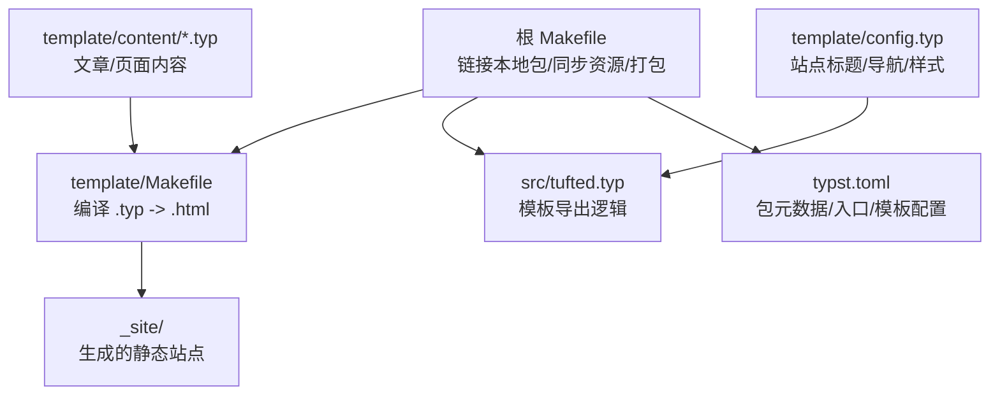
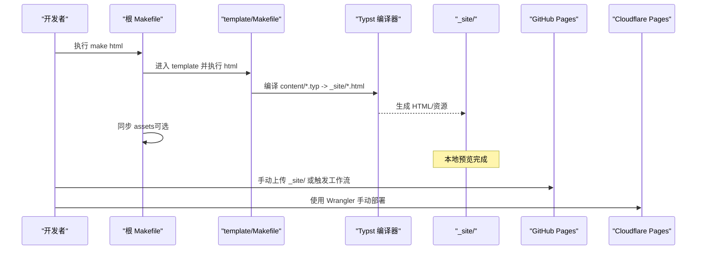
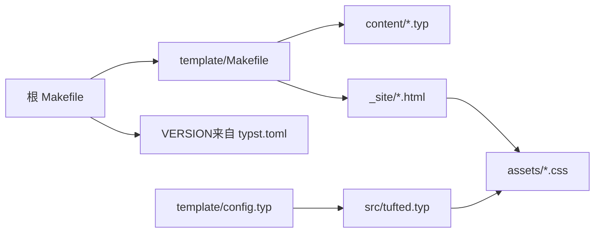

# 手动部署

<cite>
**本文引用的文件**
- [Makefile](file://Makefile)
- [template/Makefile](file://template/Makefile)
- [typst.toml](file://typst.toml)
- [README.md](file://README.md)
- [.github/workflows/deploy.yml](file://.github/workflows/deploy.yml)
- [src/tufted.typ](file://src/tufted.typ)
- [template/config.typ](file://template/config.typ)
- [template/content/index.typ](file://template/content/index.typ)
- [template/content/docs/04-deploy/index.typ](file://template/content/docs/04-deploy/index.typ)
- [template/assets/custom.css](file://template/assets/custom.css)
</cite>

## 目录
1. [简介](#简介)
2. [项目结构](#项目结构)
3. [核心组件](#核心组件)
4. [架构总览](#架构总览)
5. [详细组件分析](#详细组件分析)
6. [依赖关系分析](#依赖关系分析)
7. [性能与优化建议](#性能与优化建议)
8. [故障排查指南](#故障排查指南)
9. [结论](#结论)
10. [附录：手动部署操作手册](#附录手动部署操作手册)

## 简介
本文件面向运维与内容作者，提供 TwilightPage（基于 Typst 的静态网站模板）的手动部署与本地验证全流程说明。内容覆盖：
- 手动部署流程与本地验证方法
- Makefile 构建命令与参数解析
- 本地预览与测试流程
- 静态资源生成与优化步骤
- 托管平台（GitHub Pages、Cloudflare Pages）手动上传方法
- 部署前检查清单与验证步骤
- 回滚与紧急修复操作指南
- 版本管理与发布标签使用
- 不依赖 CI/CD 的独立部署方案

## 项目结构
TwilightPage 采用“包（src）+ 模板（template）”双层结构：
- src：模板源码与功能模块（布局、数学、注记、图表等）
- template：站点内容与配置，负责编译为静态 HTML
- 根目录 Makefile 负责链接本地包、同步资源、打包发布

图示来源
- [Makefile:1-60](file://Makefile#L1-L60)
- [template/Makefile:1-27](file://template/Makefile#L1-L27)
- [src/tufted.typ:1-64](file://src/tufted.typ#L1-L64)
- [typst.toml:1-19](file://typst.toml#L1-L19)
- [template/config.typ:1-12](file://template/config.typ#L1-L12)

章节来源
- [Makefile:1-60](file://Makefile#L1-L60)
- [template/Makefile:1-27](file://template/Makefile#L1-L27)
- [typst.toml:1-19](file://typst.toml#L1-L19)

## 核心组件
- 根 Makefile：提供 link、sync-assets、clean、check、html、build 等目标；自动从 typst.toml 提取版本号，按操作系统创建本地包缓存软链接，并打包发布归档。
- template/Makefile：扫描 content 下的 .typ 文件，逐个编译为 _site 下的 .html；复制 assets 到 _site；提供 clean 清理。
- src/tufted.typ：定义 tufted-web 模板，注入 Tufte CSS 与自定义样式，渲染头部、正文与注记等。
- template/config.typ：设置站点标题、导航链接、默认模板实例化。
- typst.toml：声明包名、版本、入口、模板路径与缩略图等元信息。

章节来源
- [Makefile:1-60](file://Makefile#L1-L60)
- [template/Makefile:1-27](file://template/Makefile#L1-L27)
- [src/tufted.typ:1-64](file://src/tufted.typ#L1-L64)
- [template/config.typ:1-12](file://template/config.typ#L1-L12)
- [typst.toml:1-19](file://typst.toml#L1-L19)

## 架构总览
下图展示从内容到静态站点的构建链路，以及本地与云端部署的关键步骤。

图示来源
- [Makefile:54-56](file://Makefile#L54-L56)
- [template/Makefile:14-16](file://template/Makefile#L14-L16)
- [.github/workflows/deploy.yml:25-31](file://.github/workflows/deploy.yml#L25-L31)
- [.github/workflows/deploy.yml:64-68](file://.github/workflows/deploy.yml#L64-L68)

## 详细组件分析

### 根 Makefile：构建命令与参数
- 版本提取：通过读取 typst.toml 的 version 字段动态生成 VERSION 变量，用于链接与打包命名。
- 平台链接：link 目标根据 OS 自动选择 link-macos/link-linux/link-windows，分别在 macOS/Linux/Windows 上创建指向当前版本的软链接至 Typst 包缓存目录。
- 资源同步：sync-assets 将 template/assets 下的设备图复制到根 assets，便于演示与预览。
- 清理：clean 删除 template/_site 并清理系统隐藏文件。
- 检查：check 调用 typst-package-check 进行包级健康检查。
- 构建 HTML：html 目标先执行 link，再进入 template 执行其 html。
- 打包：build 目标同步资源与清理后，将 src/、template/、assets/、LICENSE、README.md、typst.toml 打包为 tufted-{VERSION}.zip。

章节来源
- [Makefile:1-60](file://Makefile#L1-L60)
- [typst.toml:1-19](file://typst.toml#L1-L19)

### template/Makefile：内容编译与资源复制
- 内容发现：通过 find 命令筛选 content 下非以“_”开头的 .typ 文件。
- 输出映射：将 content/%.typ 映射为 _site/%.html。
- 编译规则：对每个 .typ 文件，创建目标目录，调用 typst compile --root .. --features html --format html 完成编译。
- 资源复制：assets 目标复制 template/assets/* 到 _site/assets。
- 清理：clean 删除 _site/*。

章节来源
- [template/Makefile:1-27](file://template/Makefile#L1-L27)

### 模板与样式：src/tufted.typ 与 template/config.typ
- 模板导出：tufted-web 接收 header-links、title、lang、css 等参数，注入 Tufte CSS 与自定义样式，渲染 head/body 结构。
- 样式链：模板加载 CDN 的 tufte.min.css，以及 /assets/tufted.css 与 /assets/custom.css。
- 站点配置：config.typ 设置 header-links 与标题，并通过导入 tufted.tufted-web 生成模板实例。

章节来源
- [src/tufted.typ:17-63](file://src/tufted.typ#L17-L63)
- [template/config.typ:1-12](file://template/config.typ#L1-L12)

### 内容与示例：template/content/*
- 示例首页：index.typ 导入 config.typ 并嵌入 README.md 的 Markdown 内容，演示如何将文档内容转为网页。
- 文档页：docs/04-deploy/index.typ 提供 GitHub Actions 部署参考，可作为手动部署的对照。
- 博客示例：blog/2024-10-04-iterators-generators/index.typ 展示了图片、脚注、代码块等富文本能力。

章节来源
- [template/content/index.typ:1-33](file://template/content/index.typ#L1-L33)
- [template/content/docs/04-deploy/index.typ:1-61](file://template/content/docs/04-deploy/index.typ#L1-L61)
- [template/content/blog/2024-10-04-iterators-generators/index.typ:1-53](file://template/content/blog/2024-10-04-iterators-generators/index.typ#L1-L53)

## 依赖关系分析
- 根 Makefile 依赖 typst.toml 的版本信息与操作系统环境变量。
- template/Makefile 依赖 Typst 编译器可用性与 content 目录结构。
- src/tufted.typ 依赖 math/refs/notes/figures/layout 模块与外部 Tufte CSS。
- template/config.typ 依赖 tufted 包的 preview 版本。

图示来源
- [Makefile:1-60](file://Makefile#L1-L60)
- [template/Makefile:1-27](file://template/Makefile#L1-L27)
- [src/tufted.typ:17-63](file://src/tufted.typ#L17-L63)
- [template/config.typ:1-12](file://template/config.typ#L1-L12)

章节来源
- [Makefile:1-60](file://Makefile#L1-L60)
- [template/Makefile:1-27](file://template/Makefile#L1-L27)
- [src/tufted.typ:17-63](file://src/tufted.typ#L17-L63)
- [template/config.typ:1-12](file://template/config.typ#L1-L12)

## 性能与优化建议
- 预览阶段：优先使用 make html 生成 _site，本地用静态服务器打开 index.html 进行快速验证。
- 资源优化：生产环境可使用 minify 对 _site 进行递归压缩（见 GitHub Actions 流程），减少体积与带宽消耗。
- 样式链顺序：确保自定义样式位于 Tufte CSS 之后，以便覆盖默认样式。
- 图片与媒体：将大图压缩后再放入 assets，避免影响首屏加载。

章节来源
- [.github/workflows/deploy.yml:24-27](file://.github/workflows/deploy.yml#L24-L27)
- [src/tufted.typ:21-25](file://src/tufted.typ#L21-L25)

## 故障排查指南
- 编译失败
  - 检查 Typst 是否安装且版本满足要求（compiler 字段）。
  - 确认 content 下无非法文件名或路径问题。
- 样式异常
  - 确认 CDN 可访问，或替换为本地 tufte.min.css。
  - 检查 /assets/tufted.css 与 /assets/custom.css 是否存在。
- 链接本地包失败
  - 在 macOS/Linux/Windows 上确认 link-* 目标是否正确创建软链接。
- 资源缺失
  - 执行 make sync-assets 复制模板资源到根 assets。
- 包健康检查
  - 运行 make check 进行包级检查。

章节来源
- [Makefile:10-35](file://Makefile#L10-L35)
- [Makefile:38-44](file://Makefile#L38-L44)
- [Makefile:50-53](file://Makefile#L50-L53)
- [src/tufted.typ:21-25](file://src/tufted.typ#L21-L25)

## 结论
通过根 Makefile 与 template/Makefile 的协同，TwilightPage 实现了从内容到静态站点的端到端构建。结合本地预览、资源优化与多平台部署策略，可在不依赖 CI/CD 的情况下实现稳定发布。建议在每次发布前执行版本核对、资源同步、本地预览与健康检查，确保一致性与可靠性。

## 附录：手动部署操作手册

### 一、本地构建与预览
- 安装依赖
  - 安装 Typst 编译器（版本需满足 typst.toml 中 compiler 字段）。
  - 确保 make 可用。
- 本地构建
  - 执行 make html，等待 template/_site 生成。
- 本地预览
  - 使用任意静态服务器打开 _site/index.html 进行验证。
- 资源同步（如需）
  - 执行 make sync-assets，确保 assets 与模板一致。

章节来源
- [Makefile:54-56](file://Makefile#L54-L56)
- [template/Makefile:18-20](file://template/Makefile#L18-L20)
- [Makefile:38-44](file://Makefile#L38-L44)

### 二、静态资源生成与优化
- 生成：template/Makefile 会将 content/*.typ 编译为 _site/*.html，并复制 assets 至 _site/assets。
- 优化：可使用 minify 对 _site 递归压缩（参考 GitHub Actions 步骤）。

章节来源
- [template/Makefile:14-16](file://template/Makefile#L14-L16)
- [template/Makefile:18-20](file://template/Makefile#L18-L20)
- [.github/workflows/deploy.yml:24-27](file://.github/workflows/deploy.yml#L24-L27)

### 三、手动上传到 GitHub Pages
- 准备站点
  - 确保 template/_site 已生成。
- 上传方式一：使用 GitHub Actions（手动触发）
  - 在仓库中创建 .github/workflows/deploy.yml（内容可参考模板文档页的示例）。
  - 在 Actions 页面选择“Deploy”工作流，点击“Run workflow”，选择分支或发布事件。
- 上传方式二：手动上传
  - 将 _site/ 作为 GitHub Pages 的发布目录（在仓库 Settings > Pages 中选择“Deploy from a folder”并指定 /template/_site）。
  - 或将 _site/ 压缩为 artifact，配合 Pages API 手动上传（需额外工具支持）。

章节来源
- [.github/workflows/deploy.yml:15-50](file://.github/workflows/deploy.yml#L15-L50)
- [template/content/docs/04-deploy/index.typ:8-60](file://template/content/docs/04-deploy/index.typ#L8-L60)

### 四、手动上传到 Cloudflare Pages
- 准备站点
  - 确保 template/_site 已生成。
- 手动部署
  - 使用 Wrangler CLI 执行 pages deploy 指令，指定项目名称与 _site 目录。
  - 需要配置 CLOUDFLARE_API_TOKEN 与 CLOUDFLARE_ACCOUNT_ID 环境变量。

章节来源
- [.github/workflows/deploy.yml:51-68](file://.github/workflows/deploy.yml#L51-L68)

### 五、部署前检查清单
- 版本核对
  - 确认 typst.toml 中 version 与预期一致。
- 内容校验
  - 检查 content 下所有 .typ 是否可编译，无语法错误。
- 资源完整性
  - 确认 assets 存在且与模板一致（执行 make sync-assets）。
- 样式与链接
  - 确认 CDN 可访问，或替换为本地样式；检查 /assets/tufted.css 与 /assets/custom.css。
- 本地预览
  - 在 _site 中打开首页，检查导航、图片、注记、数学公式等是否正常。
- 健康检查
  - 运行 make check 进行包级检查。

章节来源
- [Makefile:1-2](file://Makefile#L1-L2)
- [Makefile:38-44](file://Makefile#L38-L44)
- [Makefile:50-53](file://Makefile#L50-L53)
- [src/tufted.typ:21-25](file://src/tufted.typ#L21-L25)

### 六、回滚与紧急修复
- 回滚策略
  - GitHub Pages：切换到上一个有效提交或使用 Pages 的历史版本回退。
  - Cloudflare Pages：使用 Wrangler 切换到上一个已部署版本。
- 紧急修复
  - 快速修复后重新执行 make html 与优化，按上述任一平台重新部署。
  - 如需临时降级，可锁定旧版本的 _site 并回传至托管平台。

章节来源
- [.github/workflows/deploy.yml:37-50](file://.github/workflows/deploy.yml#L37-L50)
- [.github/workflows/deploy.yml:51-68](file://.github/workflows/deploy.yml#L51-L68)

### 七、版本管理与发布标签
- 版本来源
  - 版本号来自 typst.toml 的 version 字段，根 Makefile 通过该字段进行链接与打包。
- 发布流程
  - 在 Git 中打标签（如 v0.1.1），推送标签以触发发布相关的工作流。
  - 打包归档：执行 make build 生成 tufted-{VERSION}.zip，便于离线分发或提交审核。

章节来源
- [Makefile:1-2](file://Makefile#L1-L2)
- [Makefile:57-59](file://Makefile#L57-L59)
- [typst.toml:3](file://typst.toml#L3)

### 八、不依赖 CI/CD 的独立部署方案
- 本地构建：make html 生成 _site。
- 本地验证：使用静态服务器打开 _site/index.html。
- 手动上传：
  - GitHub Pages：将 _site 作为 Pages 源目录。
  - Cloudflare Pages：使用 Wrangler 手动部署。
- 资源优化：可选地在本地运行 minify 对 _site 递归压缩后再上传。

章节来源
- [Makefile:54-56](file://Makefile#L54-L56)
- [.github/workflows/deploy.yml:24-27](file://.github/workflows/deploy.yml#L24-L27)
- [.github/workflows/deploy.yml:51-68](file://.github/workflows/deploy.yml#L51-L68)