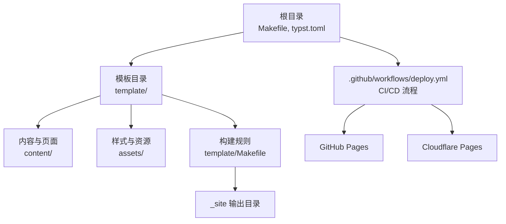
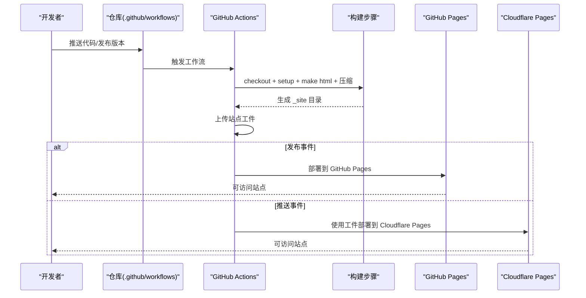

# 托管平台配置

<cite>
**本文引用的文件**
- [.github/workflows/deploy.yml](file://.github/workflows/deploy.yml)
- [Makefile](file://Makefile)
- [typst.toml](file://typst.toml)
- [template/README.md](file://template/README.md)
- [template/Makefile](file://template/Makefile)
- [template/config.typ](file://template/config.typ)
- [template/content/docs/04-deploy/index.typ](file://template/content/docs/04-deploy/index.typ)
- [README.md](file://README.md)
</cite>

## 目录
1. [简介](#简介)
2. [项目结构](#项目结构)
3. [核心组件](#核心组件)
4. [架构总览](#架构总览)
5. [详细组件分析](#详细组件分析)
6. [依赖关系分析](#依赖关系分析)
7. [性能与成本考量](#性能与成本考量)
8. [故障排查指南](#故障排查指南)
9. [结论](#结论)
10. [附录](#附录)

## 简介
本文件面向使用 TwilightPage（基于 Typst 静态站点模板）的用户，系统性介绍两种托管平台的配置方法：GitHub Pages 与 Cloudflare Pages。文档覆盖启用步骤、自定义域名与 HTTPS 配置、环境变量与部署分支设置、CDN 加速与边缘计算优势、平台迁移与切换操作、以及成本控制与性能优化策略，并提供选择托管方案的决策依据。

## 项目结构
TwilightPage 采用“模板驱动 + CI/CD 自动化”的静态站点生成与发布模式：
- 根目录包含模板元信息与顶层构建脚本，用于打包与本地开发链接。
- 模板目录包含内容、样式与构建规则，负责将 Typst 内容编译为静态 HTML 并产出可部署的 _site 目录。
- GitHub Actions 工作流负责在推送或发布时自动构建并部署到目标托管平台。

图表来源
- [Makefile:54-59](file://Makefile#L54-L59)
- [template/Makefile:1-27](file://template/Makefile#L1-L27)
- [.github/workflows/deploy.yml:1-69](file://.github/workflows/deploy.yml#L1-L69)

章节来源
- [Makefile:1-60](file://Makefile#L1-L60)
- [template/Makefile:1-27](file://template/Makefile#L1-L27)
- [.github/workflows/deploy.yml:1-69](file://.github/workflows/deploy.yml#L1-L69)

## 核心组件
- 构建与打包
  - 根 Makefile 提供链接本地包缓存、同步资源、清理与打包等任务。
  - 模板 Makefile 负责将 content 下的 .typ 文件编译为 HTML，并复制静态资源到 _site。
- CI/CD 发布
  - GitHub Actions 工作流在推送到主分支或发布事件时触发，分别部署到 GitHub Pages 或 Cloudflare Pages。
- 模板配置
  - template/config.typ 定义站点标题、导航链接等前端展示参数。
  - template/README.md 提供安装与使用说明，包含演示站点与相关链接。

章节来源
- [Makefile:54-59](file://Makefile#L54-L59)
- [template/Makefile:1-27](file://template/Makefile#L1-L27)
- [.github/workflows/deploy.yml:15-69](file://.github/workflows/deploy.yml#L15-L69)
- [template/config.typ:1-12](file://template/config.typ#L1-L12)
- [template/README.md:1-34](file://template/README.md#L1-L34)

## 架构总览
下图展示了从代码提交到多平台发布的端到端流程，包括构建、产物上传与部署到不同托管平台的关键步骤。

图表来源
- [.github/workflows/deploy.yml:15-69](file://.github/workflows/deploy.yml#L15-L69)
- [template/Makefile:14-16](file://template/Makefile#L14-L16)

章节来源
- [.github/workflows/deploy.yml:1-69](file://.github/workflows/deploy.yml#L1-L69)

## 详细组件分析

### GitHub Pages 配置
- 启用步骤
  - 在仓库设置中选择“GitHub Actions”作为 Pages 的构建与部署源。
  - 工作流会在推送至指定分支或手动触发时执行构建与部署。
- 自定义域名与 HTTPS
  - 在 Pages 设置中添加自定义域名，GitHub 将自动提供免费 HTTPS。
  - 建议通过 CNAME 记录指向 GitHub Pages 提供的地址；如需强制 HTTPS，可在应用层或服务端进行重定向策略（由具体托管平台决定）。
- 部署分支与触发条件
  - 工作流默认监听主分支推送与手动触发；也可根据需要调整分支与触发事件。
- 优点
  - 免费、与 GitHub 生态无缝集成、HTTPS 自动提供。
- 缺点
  - CDN 边缘节点分布与全球加速能力相对有限，对高并发或全球访问场景可能不如专业 CDN。
- 适用场景
  - 开源项目、个人博客、文档站点等对成本敏感且访问量适中的场景。

章节来源
- [.github/workflows/deploy.yml:3-8](file://.github/workflows/deploy.yml#L3-L8)
- [template/content/docs/04-deploy/index.typ:54-61](file://template/content/docs/04-deploy/index.typ#L54-L61)

### Cloudflare Pages 配置
- 项目创建与部署
  - 通过下载构建产物并调用 Wrangler CLI 的 pages deploy 命令完成部署。
  - 需要配置 Cloudflare API Token 与 Account ID（作为密钥注入）。
- 环境变量与密钥
  - 使用 secrets 中的 CLOUDFLARE_API_TOKEN 与 CLOUDFLARE_ACCOUNT_ID。
  - 可在 Cloudflare Pages 控制台设置环境变量（如项目名、自定义域名等），并与工作流中的命令参数对应。
- 部署分支与触发条件
  - 默认监听推送事件与手动触发；可按需调整以区分开发与生产环境。
- 优点
  - 与 Cloudflare 的全球 CDN 和边缘网络深度整合，具备更优的全球访问性能与安全能力。
  - 支持边缘函数、Workers、KV 等边缘计算能力，便于扩展。
- 缺点
  - 免费额度限制，超出后产生费用；对小规模站点可能存在成本压力。
- 适用场景
  - 对全球访问性能、安全与边缘计算有更高要求的站点，或计划逐步引入边缘能力的项目。

章节来源
- [.github/workflows/deploy.yml:51-69](file://.github/workflows/deploy.yml#L51-L69)

### 域名解析与 SSL 证书
- GitHub Pages
  - 添加自定义域名后，GitHub 自动生成免费 HTTPS 证书。
  - 建议使用 CNAME 记录指向 GitHub 提供的地址；如需强制 HTTPS，可在应用层或服务端进行跳转策略。
- Cloudflare Pages
  - 可在 Pages 控制台绑定自定义域名并启用 SSL 证书（免费或专用证书）。
  - 建议开启 DNS 与代理（Proxy）以获得 Cloudflare 的全球加速与安全防护。
- 建议
  - 优先使用 CDN 提供的 HTTPS 与 TLS 终止，减少自建证书维护成本。
  - 如需强制 HTTPS，结合服务端重定向策略确保全站安全。

章节来源
- [template/content/docs/04-deploy/index.typ:54-61](file://template/content/docs/04-deploy/index.typ#L54-L61)
- [.github/workflows/deploy.yml:64-68](file://.github/workflows/deploy.yml#L64-L68)

### CDN 加速与边缘计算
- GitHub Pages
  - 依托 GitHub 的全球分发网络，适合一般静态站点；边缘加速能力有限。
- Cloudflare Pages
  - 与 Cloudflare 全球 CDN 深度集成，具备更快的边缘节点覆盖与更低的延迟。
  - 支持边缘函数、Workers、KV 等能力，便于实现动态逻辑与缓存策略。
- 选择建议
  - 若站点访问主要集中在特定区域或流量较小，GitHub Pages 即可满足需求。
  - 若需要全球低延迟、更强的安全与边缘能力，Cloudflare Pages 更具优势。

章节来源
- [.github/workflows/deploy.yml:51-69](file://.github/workflows/deploy.yml#L51-L69)

### 平台迁移与切换
- 迁移步骤
  - 在新平台完成项目初始化与构建配置，确保本地构建产物一致。
  - 在新平台设置自定义域名与 SSL；验证解析与证书生效。
  - 更新 DNS 记录，将流量切换至新平台；旧平台保留一段时间以便回滚。
  - 在 CI/CD 中更新部署目标与密钥配置，确保自动化流程正常运行。
- 切换策略
  - 采用蓝绿部署或灰度发布策略，逐步将流量切换至新平台。
  - 保留旧平台一段时间，以便在新平台出现问题时快速回滚。

章节来源
- [.github/workflows/deploy.yml:51-69](file://.github/workflows/deploy.yml#L51-L69)

## 依赖关系分析
- 构建链路
  - 根 Makefile 调用模板 Makefile 的 html 目标，后者将 content 下的 .typ 编译为 HTML 并复制资源到 _site。
  - GitHub Actions 工作流在构建完成后上传 _site 作为工件，并根据事件类型部署到不同平台。
- 关键依赖
  - Typst 编译器与模板依赖（通过 template/config.typ 引入）。
  - Cloudflare Wrangler CLI 用于 Pages 部署（通过工作流命令调用）。

图表来源
- [Makefile:54-59](file://Makefile#L54-L59)
- [template/Makefile:14-20](file://template/Makefile#L14-L20)
- [.github/workflows/deploy.yml:25-35](file://.github/workflows/deploy.yml#L25-L35)

章节来源
- [Makefile:54-59](file://Makefile#L54-L59)
- [template/Makefile:14-20](file://template/Makefile#L14-L20)
- [.github/workflows/deploy.yml:15-69](file://.github/workflows/deploy.yml#L15-L69)

## 性能与成本考量
- 性能优化
  - 使用压缩工具对 _site 目录进行递归压缩，降低带宽占用与加载时间。
  - 合理组织内容与资源，避免不必要的重复与大体积资源。
  - 选择靠近目标用户的托管平台或 CDN，减少网络跳数。
- 成本控制
  - GitHub Pages 免费额度较高，适合中小规模站点。
  - Cloudflare Pages 免费额度有限，超出后按用量计费，需关注流量与请求次数。
  - 通过缓存策略与边缘计算减少后端负载，从而降低带宽与计算成本。

章节来源
- [.github/workflows/deploy.yml:24-27](file://.github/workflows/deploy.yml#L24-L27)

## 故障排查指南
- 构建失败
  - 检查本地是否能成功执行 make html，确认 Typst 编译器与模板依赖可用。
  - 确认模板 Makefile 的路径与内容匹配实际结构。
- GitHub Pages 部署异常
  - 确认 Pages 设置中已选择“GitHub Actions”作为源。
  - 检查工作流权限与触发条件，确保在预期事件下执行。
- Cloudflare Pages 部署异常
  - 确认 CLOUDFLARE_API_TOKEN 与 CLOUDFLARE_ACCOUNT_ID 已正确配置为密钥。
  - 检查项目名称与命令参数是否与控制台设置一致。
- 域名与 HTTPS
  - 确认 DNS 记录已生效，CNAME 指向正确地址。
  - 如启用强制 HTTPS，检查应用层或服务端的重定向策略。

章节来源
- [template/Makefile:14-20](file://template/Makefile#L14-L20)
- [.github/workflows/deploy.yml:25-35](file://.github/workflows/deploy.yml#L25-L35)
- [.github/workflows/deploy.yml:64-68](file://.github/workflows/deploy.yml#L64-L68)

## 结论
- 若追求低成本与简单易用，GitHub Pages 是理想起点；若需要更好的全球性能、安全与边缘能力，Cloudflare Pages 更具优势。
- 无论选择哪个平台，都应重视域名解析与 HTTPS 配置、CDN 加速与缓存策略，并建立完善的监控与回滚机制。
- 建议从小规模开始，逐步引入边缘能力与高级优化策略，以实现性能与成本的最佳平衡。

## 附录
- 快速参考
  - 构建命令：在根目录执行 make html，模板 Makefile 将编译内容并生成 _site。
  - GitHub Pages：在仓库设置中启用 Pages，选择 GitHub Actions 作为源。
  - Cloudflare Pages：在工作流中配置 API Token 与 Account ID，执行 pages deploy 命令。
  - 域名与 HTTPS：在 Pages 设置中添加自定义域名，启用免费 HTTPS；必要时在应用层强制跳转。

章节来源
- [README.md:15-21](file://README.md#L15-L21)
- [template/README.md:15-21](file://template/README.md#L15-L21)
- [template/content/docs/04-deploy/index.typ:54-61](file://template/content/docs/04-deploy/index.typ#L54-L61)
- [.github/workflows/deploy.yml:51-69](file://.github/workflows/deploy.yml#L51-L69)