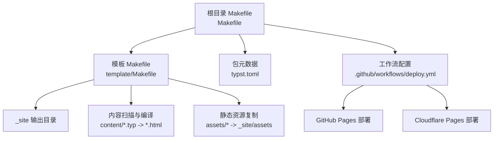
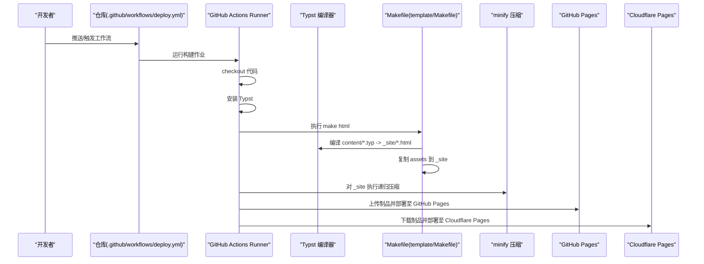
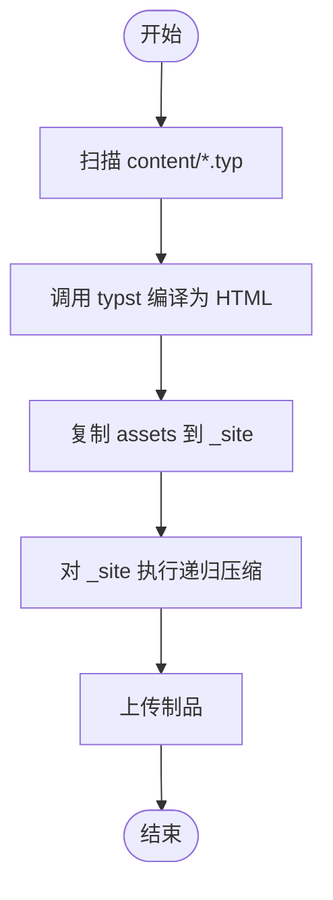
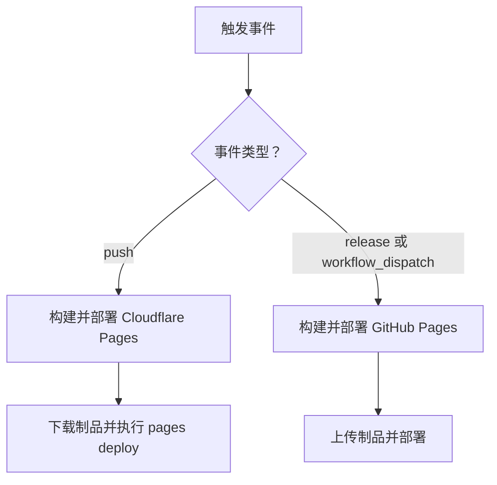
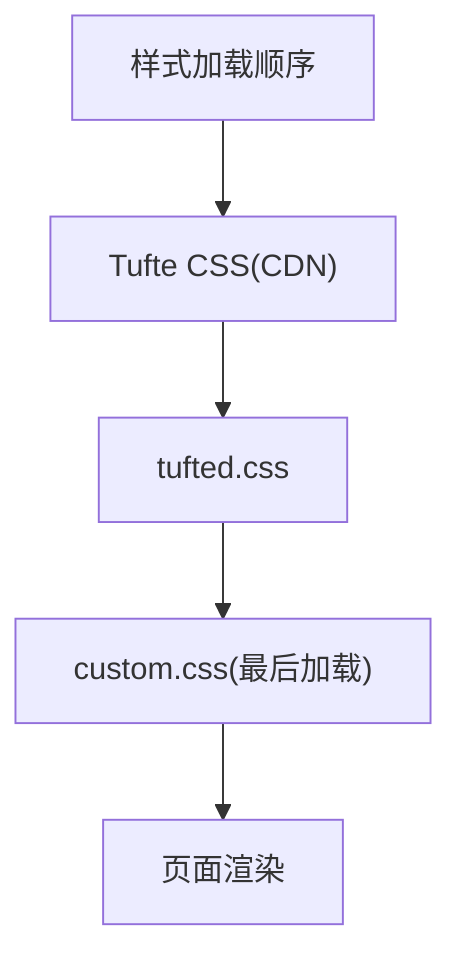
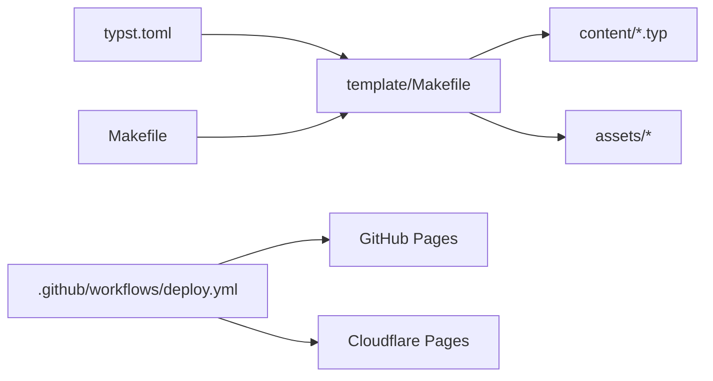

# 故障排除

<cite>
**本文引用的文件**
- [.github/workflows/deploy.yml](file://.github/workflows/deploy.yml)
- [Makefile](file://Makefile)
- [template/Makefile](file://template/Makefile)
- [typst.toml](file://typst.toml)
- [README.md](file://README.md)
- [template/README.md](file://template/README.md)
- [template/content/docs/04-deploy/index.typ](file://template/content/docs/04-deploy/index.typ)
- [template/content/docs/03-styling/index.typ](file://template/content/docs/03-styling/index.typ)
- [template/assets/tufted.css](file://template/assets/tufted.css)
- [template/assets/custom.css](file://template/assets/custom.css)
- [.gitignore](file://.gitignore)
- [template/content/index.typ](file://template/content/index.typ)
- [template/config.typ](file://template/config.typ)
</cite>

## 目录
1. [简介](#简介)
2. [项目结构](#项目结构)
3. [核心组件](#核心组件)
4. [架构总览](#架构总览)
5. [详细组件分析](#详细组件分析)
6. [依赖关系分析](#依赖关系分析)
7. [性能考虑](#性能考虑)
8. [故障排除指南](#故障排除指南)
9. [结论](#结论)
10. [附录](#附录)

## 简介
本指南面向运维与开发团队，聚焦于 TwilightPage（基于 Typst 的静态网站模板）在部署过程中常见的问题与解决方案。内容覆盖构建失败、依赖安装错误、资源编译问题的排查步骤；提供 GitHub Actions 日志分析与调试技巧；解释网络连接、权限配置、环境变量等常见配置错误；给出 Cloudflare Pages 与 GitHub Pages 的特定问题处理建议；包含性能问题与资源优化的诊断方法；描述回滚策略与紧急恢复程序；并建立问题报告与社区支持的反馈机制。

## 项目结构
TwilightPage 采用“包 + 模板”的结构：根目录定义包元数据与顶层构建入口，模板目录包含内容、样式与构建脚本。顶层 Makefile 负责链接本地包缓存、同步资源与打包；模板内的 Makefile 负责扫描 content 下的 .typ 内容并编译为 HTML，同时复制静态资源到输出目录。

图表来源
- [Makefile:1-60](file://Makefile#L1-L60)
- [template/Makefile:1-27](file://template/Makefile#L1-L27)
- [.github/workflows/deploy.yml:1-69](file://.github/workflows/deploy.yml#L1-L69)

章节来源
- [Makefile:1-60](file://Makefile#L1-L60)
- [template/Makefile:1-27](file://template/Makefile#L1-L27)
- [typst.toml:1-19](file://typst.toml#L1-L19)
- [.github/workflows/deploy.yml:1-69](file://.github/workflows/deploy.yml#L1-L69)

## 核心组件
- 构建链路
  - 顶层 Makefile：负责链接本地包缓存、清理输出、打包发布。
  - 模板 Makefile：扫描 content 下的 .typ 文件，调用 typst 编译生成 HTML，并复制静态资源。
- 工作流与部署
  - GitHub Actions 工作流：拉取代码、安装 Typst、执行构建、上传制品、分别部署至 GitHub Pages 或 Cloudflare Pages。
- 样式与资源
  - 默认样式加载顺序与自定义样式覆盖方式；媒体查询与响应式布局。
- 文档与配置
  - 配置文件定义导航与标题；文档页面提供部署与样式说明。

章节来源
- [Makefile:1-60](file://Makefile#L1-L60)
- [template/Makefile:1-27](file://template/Makefile#L1-L27)
- [.github/workflows/deploy.yml:1-69](file://.github/workflows/deploy.yml#L1-L69)
- [template/content/docs/03-styling/index.typ:1-43](file://template/content/docs/03-styling/index.typ#L1-L43)
- [template/assets/tufted.css:1-60](file://template/assets/tufted.css#L1-L60)
- [template/assets/custom.css:1-1](file://template/assets/custom.css#L1-L1)
- [template/config.typ:1-12](file://template/config.typ#L1-L12)

## 架构总览
下图展示从源码到最终发布的端到端流程，包括构建、压缩、制品上传与多平台部署。

图表来源
- [.github/workflows/deploy.yml:15-36](file://.github/workflows/deploy.yml#L15-L36)
- [template/Makefile:8-16](file://template/Makefile#L8-L16)
- [.github/workflows/deploy.yml:51-69](file://.github/workflows/deploy.yml#L51-L69)

## 详细组件分析

### 组件一：构建与编译链路
- 关键点
  - 模板 Makefile 使用模式规则批量编译 content 下的 .typ 文件到 _site。
  - 顶层 Makefile 在模板构建前进行本地包缓存链接，避免外部网络依赖。
  - 工作流中对 _site 目录执行递归压缩以减小体积。
- 常见问题
  - 内容路径或导入路径不正确导致编译失败。
  - 未同步静态资源导致页面样式缺失。
  - 本地缓存未正确链接导致编译器无法找到包。
- 诊断步骤
  - 在本地运行 make html，确认模板 Makefile 能成功生成 _site。
  - 检查 content 下是否存在未被忽略的 .typ 文件。
  - 确认 assets 是否存在且可复制到 _site。
  - 若使用本地包，请先执行顶层 Makefile 的 link 目标。

图表来源
- [template/Makefile:1-27](file://template/Makefile#L1-L27)
- [Makefile:54-55](file://Makefile#L54-L55)
- [.github/workflows/deploy.yml:24-27](file://.github/workflows/deploy.yml#L24-L27)

章节来源
- [template/Makefile:1-27](file://template/Makefile#L1-L27)
- [Makefile:54-55](file://Makefile#L54-L55)
- [.github/workflows/deploy.yml:24-27](file://.github/workflows/deploy.yml#L24-L27)

### 组件二：GitHub Actions 工作流
- 关键点
  - 触发条件：分支推送、手动触发、发布事件。
  - 权限：pages 与 id-token 写入权限用于部署。
  - 分支策略：release 或 workflow_dispatch 触发 GitHub Pages 发布；push 或 workflow_dispatch 触发 Cloudflare Pages 部署。
- 常见问题
  - 权限不足导致部署失败。
  - 未设置必要的密钥导致 Cloudflare 部署失败。
  - GitHub Pages 未启用或源选择错误。
- 诊断步骤
  - 检查工作流日志中权限声明与步骤执行情况。
  - 确认 secrets 中是否配置了 CLOUDFLARE_API_TOKEN 与 CLOUDFLARE_ACCOUNT_ID。
  - 在仓库 Settings > Pages 中确认源为 GitHub Actions。

图表来源
- [.github/workflows/deploy.yml:3-8](file://.github/workflows/deploy.yml#L3-L8)
- [.github/workflows/deploy.yml:37-49](file://.github/workflows/deploy.yml#L37-L49)
- [.github/workflows/deploy.yml:51-69](file://.github/workflows/deploy.yml#L51-L69)

章节来源
- [.github/workflows/deploy.yml:1-69](file://.github/workflows/deploy.yml#L1-L69)

### 组件三：样式与资源
- 关键点
  - 默认样式加载顺序：Tufte CSS、tufted.css、custom.css。
  - 自定义样式通过修改 custom.css 生效，因其最后加载优先级最高。
  - 响应式布局在窄屏下调整边注显示与图片宽度。
- 常见问题
  - 自定义样式未生效或被覆盖。
  - 图片或资源路径错误导致 404。
  - CDN 不可用导致默认样式加载失败。
- 诊断步骤
  - 检查 config.typ 中 css 参数是否按预期传入。
  - 确认 assets 目录下的资源已复制到 _site。
  - 在浏览器开发者工具中检查网络请求与样式来源。

图表来源
- [template/content/docs/03-styling/index.typ:8-21](file://template/content/docs/03-styling/index.typ#L8-L21)
- [template/assets/tufted.css:1-60](file://template/assets/tufted.css#L1-L60)
- [template/assets/custom.css:1-1](file://template/assets/custom.css#L1-L1)

章节来源
- [template/content/docs/03-styling/index.typ:1-43](file://template/content/docs/03-styling/index.typ#L1-L43)
- [template/assets/tufted.css:1-60](file://template/assets/tufted.css#L1-L60)
- [template/assets/custom.css:1-1](file://template/assets/custom.css#L1-L1)

### 组件四：配置与入口
- 关键点
  - 根目录 README 与模板 README 提供初始化与构建说明。
  - config.typ 定义导航链接与站点标题。
  - content/index.typ 展示如何引入 README 并渲染 Markdown。
- 常见问题
  - 初始化命令版本号不匹配。
  - 导航链接或标题未按预期显示。
  - README 渲染时相对路径错误。
- 诊断步骤
  - 确认初始化命令使用的版本号与 typst.toml 一致。
  - 检查 config.typ 中 header-links 与 title 设置。
  - 确认 content/index.typ 中的路径修正逻辑。

章节来源
- [README.md:1-34](file://README.md#L1-L34)
- [template/README.md:1-34](file://template/README.md#L1-L34)
- [template/config.typ:1-12](file://template/config.typ#L1-L12)
- [template/content/index.typ:1-33](file://template/content/index.typ#L1-L33)

## 依赖关系分析
- 包与模板
  - typst.toml 指定模板路径与入口，确保模板 Makefile 能正确定位内容与样式。
- 构建工具链
  - 顶层 Makefile 依赖模板 Makefile；模板 Makefile 依赖 typst 编译器。
- 工作流依赖
  - 工作流依赖 GitHub Pages 与 Cloudflare Pages 的部署动作与密钥。

图表来源
- [typst.toml:15-18](file://typst.toml#L15-L18)
- [template/Makefile:1-27](file://template/Makefile#L1-L27)
- [Makefile:54-55](file://Makefile#L54-L55)
- [.github/workflows/deploy.yml:15-36](file://.github/workflows/deploy.yml#L15-L36)

章节来源
- [typst.toml:1-19](file://typst.toml#L1-L19)
- [template/Makefile:1-27](file://template/Makefile#L1-L27)
- [Makefile:1-60](file://Makefile#L1-L60)
- [.github/workflows/deploy.yml:1-69](file://.github/workflows/deploy.yml#L1-L69)

## 性能考虑
- 资源压缩
  - 工作流中对 _site 执行递归压缩，减少传输体积与加载时间。
- 样式加载
  - 默认样式来自 CDN，若网络不稳定可考虑内联或镜像。
- 响应式设计
  - 在窄屏下自动调整边注与图片尺寸，提升移动端体验。
- 建议
  - 对图片进行 WebP 压缩与懒加载。
  - 合理拆分 CSS/JS，按需加载。
  - 使用浏览器缓存与 CDN 加速。

章节来源
- [.github/workflows/deploy.yml:24-27](file://.github/workflows/deploy.yml#L24-L27)
- [template/assets/tufted.css:29-55](file://template/assets/tufted.css#L29-L55)

## 故障排除指南

### 一、构建失败
- 症状
  - make html 报错，找不到 .typ 文件或编译失败。
- 可能原因
  - content 下无有效 .typ 文件或命名不符合约定。
  - 本地包缓存未链接，导致编译器无法解析包。
  - 模板 Makefile 未复制静态资源。
- 排查步骤
  - 在本地执行 make html，观察具体错误信息。
  - 确认 content 下存在未被忽略的 .typ 文件。
  - 先执行顶层 Makefile 的 link 目标，再执行 make html。
  - 检查 assets 是否存在并复制到 _site。
- 相关文件
  - [template/Makefile:1-27](file://template/Makefile#L1-L27)
  - [Makefile:54-55](file://Makefile#L54-L55)

章节来源
- [template/Makefile:1-27](file://template/Makefile#L1-L27)
- [Makefile:54-55](file://Makefile#L54-L55)

### 二、依赖安装错误
- 症状
  - GitHub Actions 中安装 Typst 或 Go 失败。
- 可能原因
  - 网络超时或代理限制。
  - 版本不兼容或工具链冲突。
- 排查步骤
  - 查看工作流日志中安装步骤的错误堆栈。
  - 确认使用的 action 版本与编译器版本兼容。
  - 在本地尝试安装相同版本工具验证环境。
- 相关文件
  - [.github/workflows/deploy.yml:19-24](file://.github/workflows/deploy.yml#L19-L24)

章节来源
- [.github/workflows/deploy.yml:19-24](file://.github/workflows/deploy.yml#L19-L24)

### 三、资源编译问题
- 症状
  - 页面样式异常、图片 404、边注布局错乱。
- 可能原因
  - 自定义样式未生效或被覆盖。
  - 资源路径错误或未复制到 _site。
  - CDN 不可用导致默认样式加载失败。
- 排查步骤
  - 检查 config.typ 中 css 参数与加载顺序。
  - 确认 assets 已复制到 _site。
  - 在浏览器开发者工具中检查网络与样式来源。
- 相关文件
  - [template/content/docs/03-styling/index.typ:8-21](file://template/content/docs/03-styling/index.typ#L8-L21)
  - [template/assets/tufted.css:1-60](file://template/assets/tufted.css#L1-L60)
  - [template/assets/custom.css:1-1](file://template/assets/custom.css#L1-L1)

章节来源
- [template/content/docs/03-styling/index.typ:1-43](file://template/content/docs/03-styling/index.typ#L1-L43)
- [template/assets/tufted.css:1-60](file://template/assets/tufted.css#L1-L60)
- [template/assets/custom.css:1-1](file://template/assets/custom.css#L1-L1)

### 四、GitHub Actions 日志分析与调试技巧
- 观察要点
  - 权限声明与步骤执行状态。
  - 构建命令输出与压缩结果。
  - 部署步骤返回的 URL 与状态。
- 调试技巧
  - 使用 workflow_dispatch 手动触发以快速验证。
  - 在本地复现相同命令，缩小问题范围。
  - 将关键命令拆分为独立步骤以便定位。
- 相关文件
  - [.github/workflows/deploy.yml:15-36](file://.github/workflows/deploy.yml#L15-L36)
  - [.github/workflows/deploy.yml:37-49](file://.github/workflows/deploy.yml#L37-L49)
  - [.github/workflows/deploy.yml:51-69](file://.github/workflows/deploy.yml#L51-L69)

章节来源
- [.github/workflows/deploy.yml:15-69](file://.github/workflows/deploy.yml#L15-L69)

### 五、网络连接与权限配置
- 症状
  - CDN 资源加载失败、Cloudflare 部署报错、GitHub Pages 无访问。
- 可能原因
  - 网络受限或代理配置不当。
  - 未授予 pages/id-token/deployments 权限。
  - 未配置 CLOUDFLARE_API_TOKEN/CLOUDFLARE_ACCOUNT_ID。
- 排查步骤
  - 在工作流中增加网络连通性测试步骤。
  - 检查仓库 Settings > Secrets 中密钥是否正确。
  - 确认 Pages 源设置为 GitHub Actions。
- 相关文件
  - [.github/workflows/deploy.yml:10-13](file://.github/workflows/deploy.yml#L10-L13)
  - [.github/workflows/deploy.yml:56-58](file://.github/workflows/deploy.yml#L56-L58)
  - [.github/workflows/deploy.yml:66-67](file://.github/workflows/deploy.yml#L66-L67)

章节来源
- [.github/workflows/deploy.yml:10-13](file://.github/workflows/deploy.yml#L10-L13)
- [.github/workflows/deploy.yml:56-58](file://.github/workflows/deploy.yml#L56-L58)
- [.github/workflows/deploy.yml:66-67](file://.github/workflows/deploy.yml#L66-L67)

### 六、Cloudflare Pages 与 GitHub Pages 特定问题
- Cloudflare Pages
  - 症状：部署失败或返回鉴权错误。
  - 解决：确认 apiToken 与 accountId 正确；检查 wrangler-action 版本；验证项目名与路径。
- GitHub Pages
  - 症状：部署成功但页面不可访问。
  - 解决：确认 Pages 源为 GitHub Actions；检查环境 URL 输出；确认 _site 目录包含完整制品。
- 相关文件
  - [.github/workflows/deploy.yml:51-69](file://.github/workflows/deploy.yml#L51-L69)
  - [.github/workflows/deploy.yml:37-49](file://.github/workflows/deploy.yml#L37-L49)

章节来源
- [.github/workflows/deploy.yml:37-49](file://.github/workflows/deploy.yml#L37-L49)
- [.github/workflows/deploy.yml:51-69](file://.github/workflows/deploy.yml#L51-L69)

### 七、回滚策略与紧急恢复程序
- 回滚策略
  - GitHub Pages：切换到上一个稳定提交或使用 Pages 的历史版本功能。
  - Cloudflare Pages：回退到上一个成功部署的版本。
- 紧急恢复
  - 临时关闭自动部署，改为手动发布。
  - 降级到上一个已知稳定的版本号与依赖版本。
- 相关文件
  - [.github/workflows/deploy.yml:3-8](file://.github/workflows/deploy.yml#L3-L8)

章节来源
- [.github/workflows/deploy.yml:3-8](file://.github/workflows/deploy.yml#L3-L8)

### 八、问题报告与社区支持
- 建议流程
  - 收集工作流日志、构建命令与错误截图。
  - 明确触发条件（push/release/workflow_dispatch）与部署目标。
  - 提供最小可复现步骤与环境信息（操作系统、工具链版本）。
- 社区支持
  - 在仓库 Issues 中提交问题，附带上述信息。
  - 参考文档页面中的部署与样式说明以自检配置。

章节来源
- [template/content/docs/04-deploy/index.typ:1-60](file://template/content/docs/04-deploy/index.typ#L1-L60)

## 结论
通过梳理构建链路、工作流配置与样式资源，本指南提供了针对 TwilightPage 部署的系统化排障方法。建议在日常运维中固化以下习惯：本地先行验证、分步调试、记录日志、明确回滚策略，并依托社区文档与 Issue 流程持续改进。

## 附录

### A. 常用命令与路径
- 本地构建
  - make html
  - make link（根据操作系统）
- 清理与打包
  - make clean
  - make build

章节来源
- [Makefile:46-59](file://Makefile#L46-L59)
- [template/Makefile:23-26](file://template/Makefile#L23-L26)

### B. 关键配置清单
- 工作流权限
  - contents: read
  - pages: write
  - id-token: write
- Cloudflare 密钥
  - CLOUDFLARE_API_TOKEN
  - CLOUDFLARE_ACCOUNT_ID

章节来源
- [.github/workflows/deploy.yml:10-13](file://.github/workflows/deploy.yml#L10-L13)
- [.github/workflows/deploy.yml:66-67](file://.github/workflows/deploy.yml#L66-L67)