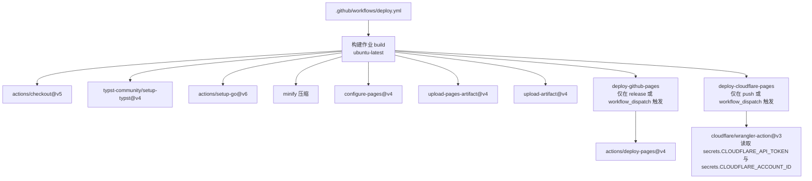
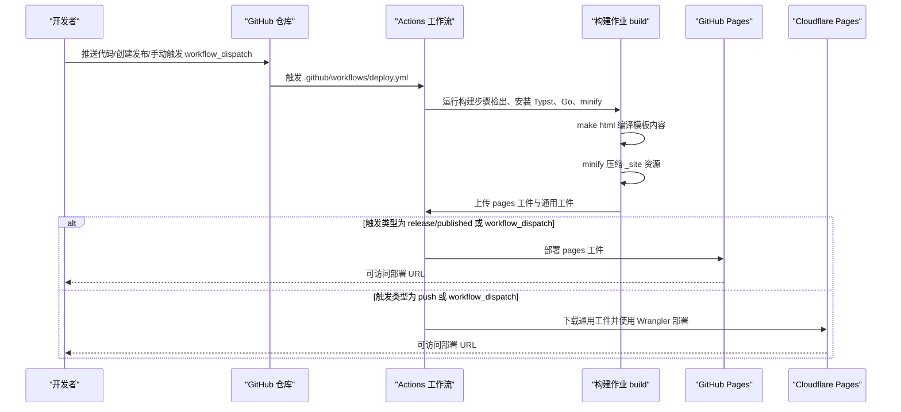
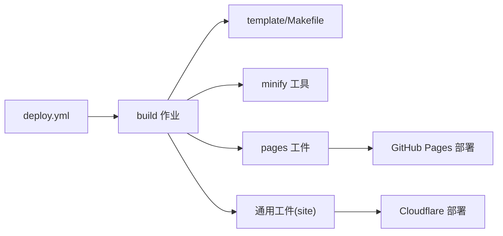

# 自动化部署

<cite>
**本文引用的文件**
- [.github/workflows/deploy.yml](file://.github/workflows/deploy.yml)
- [Makefile](file://Makefile)
- [template/Makefile](file://template/Makefile)
- [typst.toml](file://typst.toml)
- [.gitignore](file://.gitignore)
- [README.md](file://README.md)
- [template/content/docs/04-deploy/index.typ](file://template/content/docs/04-deploy/index.typ)
</cite>

## 目录
1. [简介](#简介)
2. [项目结构](#项目结构)
3. [核心组件](#核心组件)
4. [架构总览](#架构总览)
5. [详细组件分析](#详细组件分析)
6. [依赖分析](#依赖分析)
7. [性能考虑](#性能考虑)
8. [故障排查指南](#故障排查指南)
9. [结论](#结论)
10. [附录](#附录)

## 简介
本文件面向开发者，系统性介绍 TwilightPage（Tufted 模板）的 GitHub Actions 自动化部署流程。内容涵盖：
- 触发条件：push、release、workflow_dispatch
- 构建与发布步骤的执行顺序与依赖关系
- GitHub Pages 与 Cloudflare Pages 的差异化部署策略
- 环境变量与密钥管理的安全实践
- 构建缓存与性能优化建议
- 部署状态监控与通知配置
- 扩展自定义部署工作流的实践指南

## 项目结构
该仓库采用“模板型静态网站”组织方式，核心目录与职责如下：
- .github/workflows/deploy.yml：CI/CD 工作流定义，负责构建与多平台部署
- Makefile：顶层构建入口，协调本地开发与打包
- template/Makefile：模板站点的构建规则，将 .typ 内容编译为 HTML 并复制资源
- typst.toml：包元数据与模板路径配置
- .gitignore：忽略本地临时文件与构建产物
- README.md：项目使用说明与示例链接
- template/content/docs/04-deploy/index.typ：模板内文档，包含 GitHub Pages 部署说明与步骤

图表来源
- [.github/workflows/deploy.yml:1-69](file://.github/workflows/deploy.yml#L1-L69)

章节来源
- [.github/workflows/deploy.yml:1-69](file://.github/workflows/deploy.yml#L1-L69)
- [Makefile:1-60](file://Makefile#L1-L60)
- [template/Makefile:1-27](file://template/Makefile#L1-L27)
- [typst.toml:1-19](file://typst.toml#L1-L19)
- [.gitignore:1-2](file://.gitignore#L1-L2)
- [README.md:1-34](file://README.md#L1-L34)

## 核心组件
- 触发器（on）
  - push：分支 main
  - release：类型 published
  - workflow_dispatch：手动触发
- 权限声明（permissions）
  - contents: read
  - pages: write
  - id-token: write
- 作业（jobs）
  - build：在 Ubuntu 最新运行器上执行，完成代码检出、工具链准备、构建、压缩、上传页面工件与通用工件
  - deploy-github-pages：在 release/published 或 workflow_dispatch 时，基于 pages 工件部署到 GitHub Pages
  - deploy-cloudflare-pages：在 push 或 workflow_dispatch 时，下载通用工件并使用 Wrangler 部署到 Cloudflare Pages

章节来源
- [.github/workflows/deploy.yml:3-8](file://.github/workflows/deploy.yml#L3-L8)
- [.github/workflows/deploy.yml:10-13](file://.github/workflows/deploy.yml#L10-L13)
- [.github/workflows/deploy.yml:15-35](file://.github/workflows/deploy.yml#L15-L35)
- [.github/workflows/deploy.yml:37-49](file://.github/workflows/deploy.yml#L37-L49)
- [.github/workflows/deploy.yml:51-68](file://.github/workflows/deploy.yml#L51-L68)

## 架构总览
下图展示从代码提交到多平台发布的端到端流程，包括触发条件、构建步骤、工件上传与两个部署目标。

图表来源
- [.github/workflows/deploy.yml:3-8](file://.github/workflows/deploy.yml#L3-L8)
- [.github/workflows/deploy.yml:15-35](file://.github/workflows/deploy.yml#L15-L35)
- [.github/workflows/deploy.yml:37-49](file://.github/workflows/deploy.yml#L37-L49)
- [.github/workflows/deploy.yml:51-68](file://.github/workflows/deploy.yml#L51-L68)

## 详细组件分析

### 触发条件与权限
- 触发条件
  - push：分支 main
  - release：类型 published
  - workflow_dispatch：允许在 Actions 页面手动运行
- 权限
  - contents: read：读取仓库内容
  - pages: write：写入 GitHub Pages
  - id-token: write：用于 OIDC 身份验证（部署到 Pages）

章节来源
- [.github/workflows/deploy.yml:3-8](file://.github/workflows/deploy.yml#L3-L8)
- [.github/workflows/deploy.yml:10-13](file://.github/workflows/deploy.yml#L10-L13)

### 构建步骤与依赖关系
- 步骤顺序
  1) actions/checkout@v5：检出代码
  2) typst-community/setup-typst@v4：安装 Typst
  3) actions/setup-go@v6：安装 Go（禁用缓存）
  4) 安装 minify 工具
  5) make html：编译模板内容为 HTML，并复制资源
  6) minify --recursive --inplace template/_site：压缩生成的静态资源
  7) actions/configure-pages@v4：配置 GitHub Pages
  8) upload-pages-artifact@v4：上传 pages 工件（供 GitHub Pages 部署使用）
  9) upload-artifact@v4：上传通用工件（供 Cloudflare Pages 部署使用）
- 依赖关系
  - deploy-github-pages 与 deploy-cloudflare-pages 均依赖 build 作业完成
  - 两者互斥：根据事件类型选择其一执行

章节来源
- [.github/workflows/deploy.yml:15-35](file://.github/workflows/deploy.yml#L15-L35)
- [Makefile:54-55](file://Makefile#L54-L55)
- [template/Makefile:8](file://template/Makefile#L8)

### GitHub Pages 部署策略
- 触发条件：release/published 或 workflow_dispatch
- 环境：release
- 步骤
  - 使用 actions/deploy-pages@v4 部署 pages 工件
  - 输出页面 URL 并注入到环境配置中，便于后续监控与通知

章节来源
- [.github/workflows/deploy.yml:37-49](file://.github/workflows/deploy.yml#L37-L49)

### Cloudflare Pages 部署策略
- 触发条件：push 或 workflow_dispatch
- 环境：dev
- 步骤
  - actions/download-artifact@v4：下载名为 site 的通用工件至 _site
  - cloudflare/wrangler-action@v3：使用 API Token 与 Account ID 部署到指定项目名
- 密钥要求
  - secrets.CLOUDFLARE_API_TOKEN
  - secrets.CLOUDFLARE_ACCOUNT_ID

章节来源
- [.github/workflows/deploy.yml:51-68](file://.github/workflows/deploy.yml#L51-L68)

### 构建与打包细节
- 版本号提取
  - 通过读取 typst.toml 中的 version 字段，用于打包命名等用途
- 顶层 Makefile
  - 提供 link、sync-assets、clean、check、html、build 等目标
  - html 目标会切换到 template 子目录执行 template/Makefile 的 html 目标
- 模板 Makefile
  - 发现 content 下的 .typ 文件（排除以 _ 开头的路径），编译为 _site 下对应 HTML
  - 复制 assets 到 _site/assets
  - 清理 _site 目录

章节来源
- [Makefile:1-2](file://Makefile#L1-L2)
- [Makefile:54-55](file://Makefile#L54-L55)
- [template/Makefile:1-26](file://template/Makefile#L1-L26)
- [typst.toml:3](file://typst.toml#L3)

### 文档与示例参考
- 模板内文档提供了 GitHub Pages 的部署步骤与启用方法，可作为理解 Pages 部署流程的补充材料
- README 提供了示例链接与使用说明，有助于理解部署后的访问路径与用途

章节来源
- [template/content/docs/04-deploy/index.typ:1-60](file://template/content/docs/04-deploy/index.typ#L1-L60)
- [README.md:25-26](file://README.md#L25-L26)

## 依赖分析
- 组件耦合
  - 构建阶段强依赖 Typst 与 Go（minify）工具链
  - 上传工件是 GitHub Pages 与 Cloudflare Pages 的共同输入
- 外部依赖
  - GitHub Pages：通过 pages 工件直接部署
  - Cloudflare Pages：通过 Wrangler 与 API Token/Account ID 部署
- 可能的循环依赖
  - 当前工作流无显式循环；若自定义扩展，请避免让 deploy 作业再次触发 build

图表来源
- [.github/workflows/deploy.yml:15-35](file://.github/workflows/deploy.yml#L15-L35)
- [template/Makefile:8](file://template/Makefile#L8)
- [.github/workflows/deploy.yml:51-68](file://.github/workflows/deploy.yml#L51-L68)

章节来源
- [.github/workflows/deploy.yml:15-35](file://.github/workflows/deploy.yml#L15-L35)
- [template/Makefile:8](file://template/Makefile#L8)
- [.github/workflows/deploy.yml:51-68](file://.github/workflows/deploy.yml#L51-L68)

## 性能考虑
- 构建缓存
  - actions/setup-go@v6 显式禁用缓存（cache: false），如需加速可评估开启缓存并配合版本锁定
- 资源压缩
  - 使用 minify 对 _site 目录进行递归压缩，减少传输体积
- 并行与顺序
  - 构建完成后，GitHub Pages 与 Cloudflare Pages 的部署作业互不依赖，可并行执行（当前工作流未声明并行，但逻辑上可并行）
- 产物最小化
  - 通过模板 Makefile 的 assets 复制与 minify 压缩，确保只上传必要资源

章节来源
- [.github/workflows/deploy.yml:21-23](file://.github/workflows/deploy.yml#L21-L23)
- [.github/workflows/deploy.yml:24-27](file://.github/workflows/deploy.yml#L24-L27)
- [template/Makefile:18-20](file://template/Makefile#L18-L20)

## 故障排查指南
- 构建失败
  - 检查 Typst 是否正确安装与版本匹配
  - 确认 template/Makefile 的 HTML 编译规则是否对齐内容路径
- 工件缺失
  - 确保 upload-pages-artifact 与 upload-artifact 的路径一致且存在
  - 检查 .gitignore 是否误排除了 _site 目录
- GitHub Pages 部署失败
  - 确认已启用 GitHub Pages 并选择 GitHub Actions 作为源
  - 检查 pages 工件是否成功上传
- Cloudflare Pages 部署失败
  - 确认 secrets.CLOUDFLARE_API_TOKEN 与 secrets.CLOUDFLARE_ACCOUNT_ID 是否设置
  - 确认 Wrangler 命令参数与项目名称一致
- 手动触发
  - 在 Actions 页面选择 workflow_dispatch，查看日志定位问题

章节来源
- [.github/workflows/deploy.yml:28-35](file://.github/workflows/deploy.yml#L28-L35)
- [.github/workflows/deploy.yml:48-49](file://.github/workflows/deploy.yml#L48-L49)
- [.github/workflows/deploy.yml:64-68](file://.github/workflows/deploy.yml#L64-L68)
- [.gitignore:2](file://.gitignore#L2)

## 结论
本工作流通过统一的构建步骤与双通道部署，实现了对 GitHub Pages 与 Cloudflare Pages 的灵活支持。开发者可根据发布节奏与目标环境选择合适的触发方式与部署路径。建议结合缓存策略与资源压缩进一步优化构建性能，并完善密钥管理与通知机制以提升可观测性与安全性。

## 附录

### 环境变量与密钥管理最佳实践
- 仅在需要的作业中授予最小权限
- 将 Cloudflare 凭据保存为仓库密钥（secrets），避免硬编码
- 使用环境（environment）隔离不同部署阶段（dev/release），并记录输出 URL

章节来源
- [.github/workflows/deploy.yml:10-13](file://.github/workflows/deploy.yml#L10-L13)
- [.github/workflows/deploy.yml:44-46](file://.github/workflows/deploy.yml#L44-L46)
- [.github/workflows/deploy.yml:55](file://.github/workflows/deploy.yml#L55)
- [.github/workflows/deploy.yml:66-67](file://.github/workflows/deploy.yml#L66-L67)

### 部署状态监控与通知
- GitHub Pages：通过环境配置中的 page_url 输出，可用于外部通知或状态页
- Cloudflare Pages：部署命令返回部署结果，可结合外部服务发送通知
- 建议：在工作流末尾添加通知步骤（如邮件、聊天机器人），并在失败时重试或回滚

章节来源
- [.github/workflows/deploy.yml:46](file://.github/workflows/deploy.yml#L46)
- [.github/workflows/deploy.yml:68](file://.github/workflows/deploy.yml#L68)

### 扩展自定义部署工作流指南
- 新增部署目标
  - 复制 deploy-cloudflare-pages 或 deploy-github-pages 的结构，调整触发条件与环境
  - 如需上传工件给其他平台，保持 upload-artifact 的路径一致
- 条件控制
  - 使用 github.event_name 与 needs 关键字控制作业执行顺序与互斥
- 多环境
  - 为不同环境（staging/prod）分别配置环境与 URL 输出，便于集中监控
- 安全加固
  - 限制权限范围，仅授予必要的 write 权限
  - 使用 OIDC 与最小权限令牌，避免长期密钥

章节来源
- [.github/workflows/deploy.yml:37-49](file://.github/workflows/deploy.yml#L37-L49)
- [.github/workflows/deploy.yml:51-68](file://.github/workflows/deploy.yml#L51-L68)