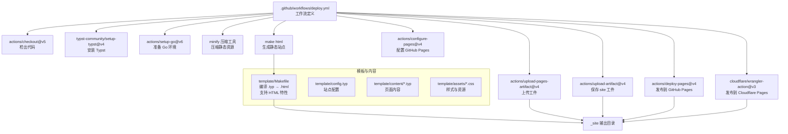
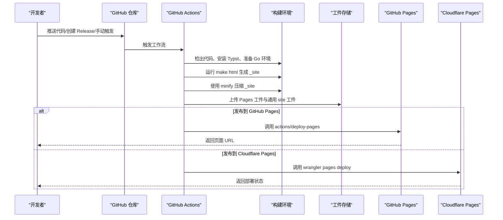
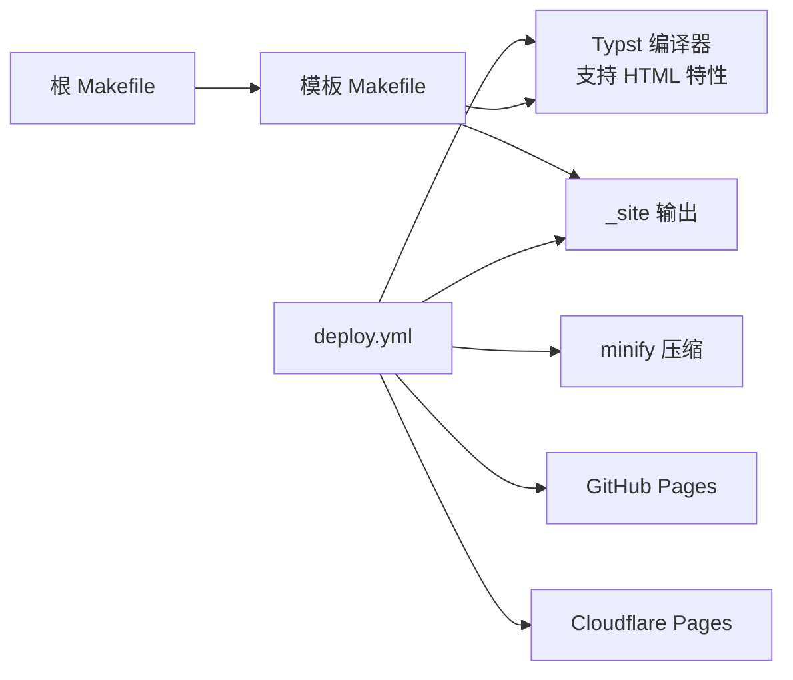

# 部署发布

<cite>
**本文引用的文件**
- [.github/workflows/deploy.yml](file://.github/workflows/deploy.yml)
- [Makefile](file://Makefile)
- [template/Makefile](file://template/Makefile)
- [typst.toml](file://typst.toml)
- [template/config.typ](file://template/config.typ)
- [template/content/index.typ](file://template/content/index.typ)
- [template/content/docs/04-deploy/index.typ](file://template/content/docs/04-deploy/index.typ)
- [template/README.md](file://template/README.md)
- [template/assets/tufted.css](file://template/assets/tufted.css)
</cite>

## 更新摘要
**变更内容**
- 更新了模板 Makefile 中的 Typst 编译命令，添加了 `--features html` 参数以支持 HTML 生成特性
- 强化了构建系统的技术要求说明
- 更新了部署流程中关于 HTML 功能特性的技术细节

## 目录
1. [简介](#简介)
2. [项目结构](#项目结构)
3. [核心组件](#核心组件)
4. [架构总览](#架构总览)
5. [详细组件分析](#详细组件分析)
6. [依赖关系分析](#依赖关系分析)
7. [性能与缓存优化](#性能与缓存优化)
8. [故障排除清单](#故障排除清单)
9. [结论](#结论)
10. [附录](#附录)

## 简介
本文件面向运维与开发人员，系统性介绍 TwilightPage（基于 Typst 模板）的自动化部署与发布流程，覆盖以下主题：
- GitHub Actions 工作流的配置、触发条件与自定义选项
- GitHub Pages 与 Cloudflare Pages 的集成方式与配置差异
- 手动部署流程与本地测试验证步骤
- CI/CD 构建优化与缓存策略
- 域名与 HTTPS 配置指南
- 静态资源优化与 CDN 集成最佳实践
- 版本管理与回滚策略
- 监控与日志分析实用技巧
- 常见问题与故障排除清单

## 项目结构
TwilightPage 采用"包 + 模板"的结构：根目录为 Typst 包配置与顶层构建脚本，模板目录包含内容、样式与站点生成规则；工作流在 GitHub Actions 中完成构建与发布。

**图表来源**
- [.github/workflows/deploy.yml:1-69](file://.github/workflows/deploy.yml#L1-L69)
- [Makefile:54-55](file://Makefile#L54-L55)
- [template/Makefile:1-36](file://template/Makefile#L1-L36)
- [template/config.typ:1-16](file://template/config.typ#L1-L16)

**章节来源**
- [.github/workflows/deploy.yml:1-69](file://.github/workflows/deploy.yml#L1-L69)
- [Makefile:1-60](file://Makefile#L1-L60)
- [template/Makefile:1-36](file://template/Makefile#L1-L36)

## 核心组件
- GitHub Actions 工作流：定义构建、打包与发布阶段，支持 push、release、workflow_dispatch 触发，并区分 GitHub Pages 与 Cloudflare Pages 的发布路径。
- Makefile（根）：负责链接本地包缓存、同步资源、清理、检查与打包发布。
- Makefile（模板）：将内容目录下的 .typ 编译为 HTML，复制静态资源至 _site，**新增**支持 HTML 特性编译。
- 配置与入口：template/config.typ 定义站点标题、导航等；typst.toml 提供包元信息与模板入口。
- 文档与示例：template/content/docs/04-deploy/index.typ 提供 GitHub Pages 部署说明；template/content/index.typ 展示首页与资源使用；template/assets/tufted.css 提供样式基线。

**章节来源**
- [Makefile:1-60](file://Makefile#L1-L60)
- [template/Makefile:1-36](file://template/Makefile#L1-L36)
- [template/config.typ:1-16](file://template/config.typ#L1-L16)
- [typst.toml:1-19](file://typst.toml#L1-L19)
- [template/content/docs/04-deploy/index.typ:1-61](file://template/content/docs/04-deploy/index.typ#L1-L61)
- [template/content/index.typ:1-33](file://template/content/index.typ#L1-L33)
- [template/assets/tufted.css:1-166](file://template/assets/tufted.css#L1-L166)

## 架构总览
下图展示从代码提交到多平台发布的端到端流程，包括构建、压缩、上传与部署的关键步骤。

**图表来源**
- [.github/workflows/deploy.yml:1-69](file://.github/workflows/deploy.yml#L1-L69)
- [Makefile:54-55](file://Makefile#L54-L55)
- [template/Makefile:21-23](file://template/Makefile#L21-L23)

## 详细组件分析

### GitHub Actions 工作流（deploy.yml）
- 触发条件
  - push 到 main 分支：用于开发/预览发布（Cloudflare Pages）。
  - release.published：用于稳定版本发布（GitHub Pages）。
  - workflow_dispatch：允许手动触发。
- 权限
  - contents: read、pages: write、id-token: write，满足 Pages 部署与身份令牌使用。
- Job 流程
  - build：检出、安装 Typst、Go（不启用缓存）、安装 minify、执行 make html 并压缩输出、配置 Pages、上传 Pages 工件与通用 site 工件。
  - deploy-github-pages：仅在 release 或 workflow_dispatch 时运行，调用 actions/deploy-pages。
  - deploy-cloudflare-pages：在 push 或 workflow_dispatch 时运行，下载 site 工件并使用 wrangler-action 部署到 Cloudflare Pages。
- 关键点
  - 工件命名与路径统一为 template/_site，便于不同发布目标复用。
  - Cloudflare 部署通过 secrets 注入 API Token 与 Account ID。

**章节来源**
- [.github/workflows/deploy.yml:1-69](file://.github/workflows/deploy.yml#L1-L69)

### Makefile（根）与模板 Makefile
- 根 Makefile
  - 版本提取：从 typst.toml 读取版本号，用于链接缓存与打包。
  - 链接本地包缓存：按操作系统创建符号链接，指向当前版本目录，加速本地开发。
  - 同步资源：将模板资产复制到根 assets 目录，保证构建一致性。
  - 清理：删除 _site 与系统隐藏文件。
  - 检查：调用 typst-package-check。
  - 构建：打包 zip（含 src、template、assets、LICENSE、README、typst.toml）。
  - html：进入模板目录执行 html 目标。
- 模板 Makefile
  - 自动发现 content 下的 .typ 文件（忽略以 _ 开头的路径），生成对应 _site/*.html。
  - **更新** 编译规则：typst compile --root .. --features html --format html，**新增** HTML 特性支持。
  - 资源复制：将 assets 复制到 _site/assets。
  - 清理：删除 _site/*。

**更新** 模板 Makefile 中的 Typst 编译命令已更新，添加了 `--features html` 参数以启用 HTML 生成特性。这确保了编译器能够正确处理 HTML 特定的功能和格式化选项。

**章节来源**
- [Makefile:1-60](file://Makefile#L1-L60)
- [template/Makefile:1-36](file://template/Makefile#L1-L36)

### 配置与入口
- typst.toml
  - 包元信息、模板路径与入口、编译器版本、关键词与分类等。
- template/config.typ
  - 引入 tufted 模板，设置 header-links、title 等站点参数。
- template/content/index.typ
  - 展示首页内容与资源使用示例（如图片、Markdown 渲染）。
- template/content/docs/04-deploy/index.typ
  - 提供 GitHub Pages 部署说明与工作流参考片段。

**章节来源**
- [typst.toml:1-19](file://typst.toml#L1-L19)
- [template/config.typ:1-16](file://template/config.typ#L1-L16)
- [template/content/index.typ:1-33](file://template/content/index.typ#L1-L33)
- [template/content/docs/04-deploy/index.typ:1-61](file://template/content/docs/04-deploy/index.typ#L1-L61)

### 静态资源与样式
- 样式文件位于 template/assets，包含基础变量、响应式布局、导航、脚注与边注、数学渲染、暗色模式适配等。
- 构建时将 assets 复制到 _site/assets，确保发布后样式可用。

**章节来源**
- [template/assets/tufted.css:1-166](file://template/assets/tufted.css#L1-L166)
- [template/Makefile:25-29](file://template/Makefile#L25-L29)

## 依赖关系分析
- 工作流对构建工具链的依赖
  - Typst：用于将 .typ 编译为 HTML，**新增**支持 HTML 特性。
  - Go：用于安装 minify 工具（非 Go 项目，此处仅用于二进制安装）。
  - minify：压缩 _site 内容，减小体积。
- 工作流对平台服务的依赖
  - GitHub Pages：通过 actions/configure-pages 与 actions/deploy-pages。
  - Cloudflare Pages：通过 cloudflare/wrangler-action。
- 构建脚本对模板的依赖
  - 根 Makefile 依赖模板 Makefile 的 html 目标。
  - 模板 Makefile 依赖 typst 可执行文件与内容目录结构。

**图表来源**
- [.github/workflows/deploy.yml:1-69](file://.github/workflows/deploy.yml#L1-L69)
- [Makefile:54-55](file://Makefile#L54-L55)
- [template/Makefile:21-23](file://template/Makefile#L21-L23)

**章节来源**
- [.github/workflows/deploy.yml:1-69](file://.github/workflows/deploy.yml#L1-L69)
- [Makefile:54-55](file://Makefile#L54-L55)
- [template/Makefile:21-23](file://template/Makefile#L21-L23)

## 性能与缓存优化
- 构建缓存
  - 当前工作流未启用 Go/Typst 的缓存策略。建议在 actions/setup-go 与 Typst 缓存中引入缓存以减少重复安装时间。
- 资源压缩
  - 使用 minify 对 _site 进行递归压缩，显著降低传输体积与加载时间。
- 并行与增量
  - 模板 Makefile 已通过模式规则实现按需编译；可结合缓存与增量构建进一步优化。
- 资源优化建议
  - 图片：优先 WebP/JPEG2000；按视口尺寸提供多套；开启懒加载与合适的尺寸标注。
  - 字体与 CSS：使用子集化与最小化；避免阻塞渲染的字体加载。
  - CDN：结合 Cloudflare Workers KV/CDN 以提升全球访问速度与稳定性。

**章节来源**
- [.github/workflows/deploy.yml:22-27](file://.github/workflows/deploy.yml#L22-L27)
- [template/Makefile:21-23](file://template/Makefile#L21-L23)

## 故障排除清单
- 工作流权限不足
  - 症状：无法部署到 Pages 或写入工件。
  - 处理：确认工作流权限包含 contents: read、pages: write、id-token: write。
- Pages 未启用或源选择错误
  - 症状：部署成功但无页面显示。
  - 处理：在仓库 Settings > Pages 中选择 GitHub Actions 作为构建与部署源。
- Cloudflare 部署失败
  - 症状：wrangler-action 报错。
  - 处理：检查 secrets.CLOUDFLARE_API_TOKEN 与 CLOUDFLARE_ACCOUNT_ID 是否正确；确认项目名称与 _site 路径一致。
- 资源缺失或路径错误
  - 症状：样式或图片 404。
  - 处理：确认模板 Makefile 将 assets 复制到 _site/assets；检查相对路径与部署根路径。
- 版本不匹配
  - 症状：本地构建与 CI 行为不一致。
  - 处理：确保 typst.toml 中 compiler 版本与 CI 环境一致；必要时固定版本。
- **更新** HTML 特性编译失败
  - 症状：编译器报错或 HTML 功能不可用。
  - 处理：确认 Typst 版本支持 HTML 特性；检查编译命令中的 `--features html` 参数是否正确传递。
- 手动触发无效
  - 症状：workflow_dispatch 不生效。
  - 处理：确认工作流 on.workflow_dispatch 已启用；在 Actions 页面手动运行。

**章节来源**
- [.github/workflows/deploy.yml:10-13](file://.github/workflows/deploy.yml#L10-L13)
- [.github/workflows/deploy.yml:51-69](file://.github/workflows/deploy.yml#L51-L69)
- [template/Makefile:25-29](file://template/Makefile#L25-L29)

## 结论
TwilightPage 的部署体系以 GitHub Actions 为核心，结合 Makefile 实现内容到静态站点的高效转换，并通过工件复用同时支持 GitHub Pages 与 Cloudflare Pages 的发布。**更新**模板 Makefile 中的 HTML 特性支持增强了构建系统的功能完整性。通过规范化的权限、明确的触发条件与资源压缩策略，可在保障质量的同时提升发布效率。建议后续引入缓存与资源优化策略，持续改进性能与可靠性。

## 附录

### 手动部署与本地验证
- 本地构建
  - 在根目录执行 make html，生成 _site。
  - 使用本地静态服务器预览（例如 http-server、python -m http.server）。
- 手动触发工作流
  - 在 GitHub Actions 页面选择工作流并手动运行，观察构建与部署日志。
- 验证要点
  - 页面可访问、资源路径正确、样式与脚注正常、图片与数学公式渲染无误。

**章节来源**
- [Makefile:54-55](file://Makefile#L54-L55)
- [template/README.md:19-25](file://template/README.md#L19-L25)

### 域名与 HTTPS 配置
- GitHub Pages
  - 在仓库 Settings > Pages 中选择自定义域（如有）；启用 HTTPS；确认 DNS 记录与 CNAME。
- Cloudflare Pages
  - 在 Pages 项目设置中绑定自定义域；启用 SSL/TLS；根据需要配置加密模式与证书。
- HTTPS 强制与重定向
  - 建议强制 HTTPS；在 Cloudflare 中可启用 Automatic HTTPS Rewrites 或自定义重定向规则。

**章节来源**
- [template/content/docs/04-deploy/index.typ:54-61](file://template/content/docs/04-deploy/index.typ#L54-L61)

### 静态资源优化与 CDN 集成最佳实践
- 资源压缩与合并：继续使用 minify；考虑 gzip/br 压缩。
- 图片优化：WebP/JPEG2000；按设备像素比提供多尺寸；懒加载。
- 样式与脚本：最小化与去重；启用浏览器缓存；CDN 加速。
- CDN 选择：Cloudflare Workers KV/CDN；利用边缘缓存与全球分发。

**章节来源**
- [.github/workflows/deploy.yml:22-27](file://.github/workflows/deploy.yml#L22-L27)
- [template/assets/tufted.css:1-166](file://template/assets/tufted.css#L1-L166)

### 版本管理与回滚策略
- 版本来源
  - 版本号来自 typst.toml；根 Makefile 读取该版本用于链接缓存与打包。
- 发布节奏
  - 开发预览：push 到 main → Cloudflare Pages。
  - 稳定发布：创建 Release → GitHub Pages。
- 回滚建议
  - 保留历史工件；若 Pages 出问题，切换回上一个有效提交；Cloudflare 可回滚到上次成功部署版本。

**章节来源**
- [typst.toml:3](file://typst.toml#L3)
- [Makefile:2-2](file://Makefile#L2-L2)
- [.github/workflows/deploy.yml:7-8](file://.github/workflows/deploy.yml#L7-L8)
- [.github/workflows/deploy.yml:51-69](file://.github/workflows/deploy.yml#L51-L69)

### 监控与日志分析实用技巧
- 日志定位
  - 关注 actions/configure-pages、actions/upload-pages-artifact、actions/deploy-pages 与 wrangler-action 的输出。
- 健康检查
  - 部署完成后访问根路径与关键页面，检查资源加载与交互。
- 告警与通知
  - 在 CI 中集成通知（如 Slack/邮件），在失败时及时告警。
- 性能观测
  - 使用浏览器开发者工具与 Lighthouse；关注首次内容绘制（FCP）、最大内容绘制（LCP）与不连续性（CLS）。

**章节来源**
- [.github/workflows/deploy.yml:28-31](file://.github/workflows/deploy.yml#L28-L31)
- [.github/workflows/deploy.yml:48-49](file://.github/workflows/deploy.yml#L48-L49)
- [.github/workflows/deploy.yml:64-69](file://.github/workflows/deploy.yml#L64-L69)