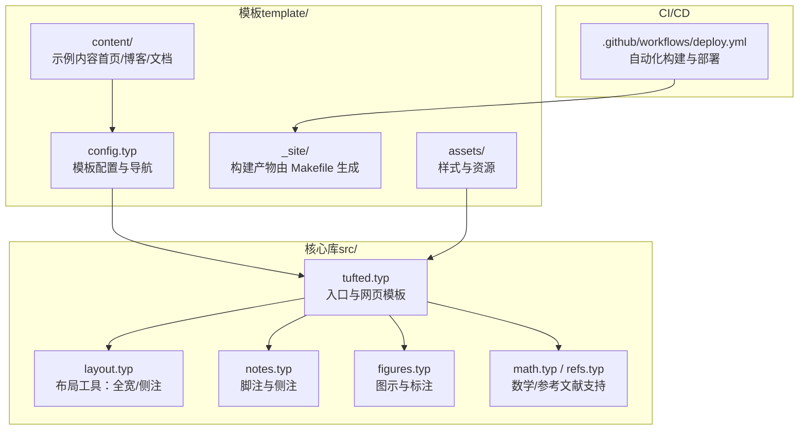
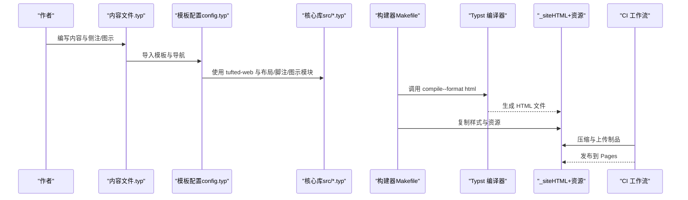
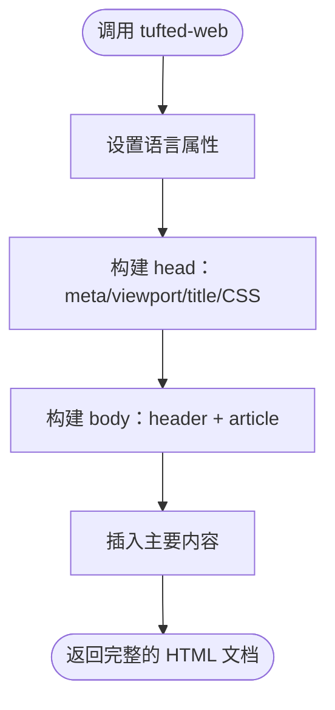
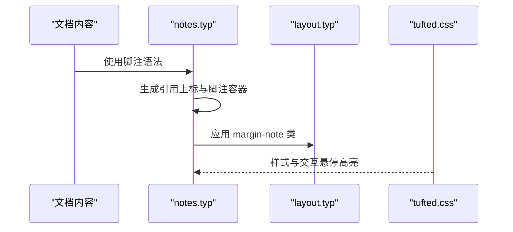
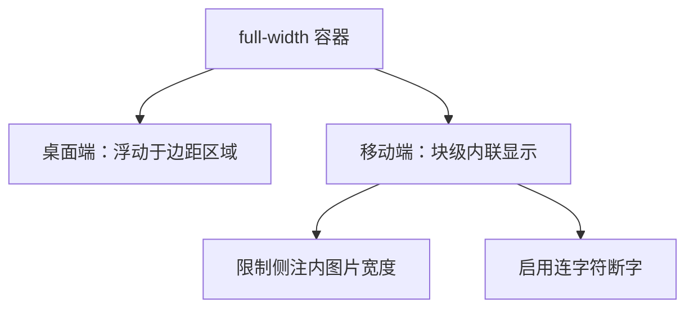
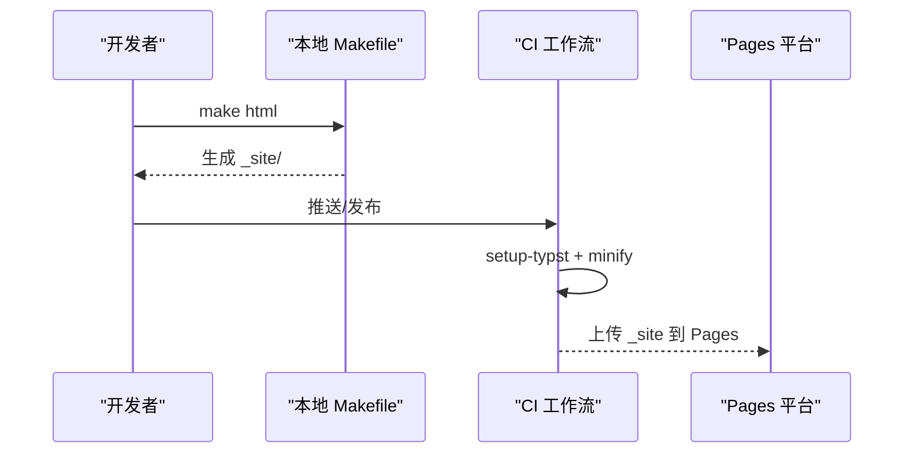
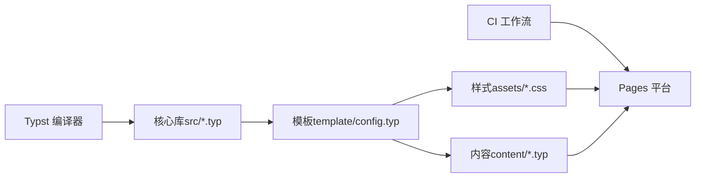

# 项目概述

<cite>
**本文档引用的文件**
- [README.md](file://README.md)
- [src/tufted.typ](file://src/tufted.typ)
- [src/layout.typ](file://src/layout.typ)
- [src/notes.typ](file://src/notes.typ)
- [src/figures.typ](file://src/figures.typ)
- [src/math.typ](file://src/math.typ)
- [src/refs.typ](file://src/refs.typ)
- [template/config.typ](file://template/config.typ)
- [template/Makefile](file://template/Makefile)
- [template/content/index.typ](file://template/content/index.typ)
- [template/content/blog/2024-10-04-iterators-generators/index.typ](file://template/content/blog/2024-10-04-iterators-generators/index.typ)
- [template/content/docs/01-quick-start/index.typ](file://template/content/docs/01-quick-start/index.typ)
- [template/assets/tufted.css](file://template/assets/tufted.css)
- [template/assets/custom.css](file://template/assets/custom.css)
- [.github/workflows/deploy.yml](file://.github/workflows/deploy.yml)
- [Makefile](file://Makefile)
- [typst.toml](file://typst.toml)
</cite>

## 目录
1. [简介](#简介)
2. [项目结构](#项目结构)
3. [核心组件](#核心组件)
4. [架构总览](#架构总览)
5. [详细组件分析](#详细组件分析)
6. [依赖关系分析](#依赖关系分析)
7. [性能考虑](#性能考虑)
8. [故障排除指南](#故障排除指南)
9. [结论](#结论)
10. [附录](#附录)

## 简介
TwilightPage（原名 Tufted）是一个基于 Typst 的静态网站模板，专注于以 Tufte 风格呈现内容：宽边距、精简排版与侧注（Margin Notes）。它通过 Typst 的实验性 HTML 导出能力生成静态站点，并借助 Tufte CSS 样式框架实现优雅的排版效果。项目旨在为学术写作、技术博客与静态内容网站提供开箱即用的高质量排版体验，同时保持极低的外部依赖与简单的构建流程。

- 目标用户：学术作者、技术写作者、独立博客与知识型站点运营者
- 核心价值主张：以 Typst 的结构化标记语言统一内容创作；以 Tufte 风格提升可读性与专业度；以自动化工作流简化部署与维护

**章节来源**
- [README.md:1-34](file://README.md#L1-L34)
- [typst.toml:1-19](file://typst.toml#L1-L19)

## 项目结构
项目采用“核心库 + 模板”双层结构：
- 核心库（src/）：定义可复用的模板模块（布局、脚注、图示、数学、参考文献等），并通过入口文件导出统一的网页模板函数
- 模板（template/）：包含示例内容、样式与构建配置，演示如何使用核心库快速搭建网站
- 工作流（.github/workflows/）：在推送与发布时自动构建并部署到 GitHub Pages 或 Cloudflare Pages

**图表来源**
- [src/tufted.typ:1-64](file://src/tufted.typ#L1-L64)
- [src/layout.typ:1-13](file://src/layout.typ#L1-L13)
- [src/notes.typ:1-27](file://src/notes.typ#L1-L27)
- [src/figures.typ:1-20](file://src/figures.typ#L1-L20)
- [template/config.typ:1-12](file://template/config.typ#L1-L12)
- [template/Makefile:1-27](file://template/Makefile#L1-L27)
- [.github/workflows/deploy.yml:1-69](file://.github/workflows/deploy.yml#L1-L69)

**章节来源**
- [Makefile:1-60](file://Makefile#L1-L60)
- [template/Makefile:1-27](file://template/Makefile#L1-L27)
- [typst.toml:15-19](file://typst.toml#L15-L19)

## 核心组件
- tufted-web：统一的网页模板函数，负责注入头部、导航、样式表与主体内容，支持多语言与自定义 CSS 链接
- 布局工具：提供 margin-note 与 full-width 容器，用于在桌面端显示在边距区域的侧注与全宽元素
- 脚注与侧注：重定义脚注渲染，使引用数字与脚注内容分别出现在正文与边距区域，增强阅读连贯性
- 图示与标注：将图注统一为侧注样式，确保图文关系清晰且符合 Tufte 风格
- 数学与参考文献：提供数学公式与参考文献的 HTML 渲染支持
- 构建与部署：通过 Makefile 将 .typ 内容编译为 HTML，并由 CI 自动部署至 Pages 平台

**章节来源**
- [src/tufted.typ:17-63](file://src/tufted.typ#L17-L63)
- [src/layout.typ:3-12](file://src/layout.typ#L3-L12)
- [src/notes.typ:1-27](file://src/notes.typ#L1-L27)
- [src/figures.typ:3-19](file://src/figures.typ#L3-L19)
- [template/config.typ:3-11](file://template/config.typ#L3-L11)

## 架构总览
下图展示了从内容到静态页面的完整链路：内容文件通过模板配置导入核心库模块，再由 Makefile 调用 Typst 编译器生成 HTML；最终由 CI 工作流进行压缩与部署。

**图表来源**
- [template/content/index.typ:1-33](file://template/content/index.typ#L1-L33)
- [template/config.typ:1-12](file://template/config.typ#L1-L12)
- [src/tufted.typ:17-63](file://src/tufted.typ#L17-L63)
- [template/Makefile:14-16](file://template/Makefile#L14-L16)
- [.github/workflows/deploy.yml:25-31](file://.github/workflows/deploy.yml#L25-L31)

## 详细组件分析

### 组件一：网页模板与样式注入（tufted-web）
- 功能职责：封装 HTML 页面骨架，注入 meta、title、CSS 链接与主体内容；支持自定义语言与导航链接
- 关键点：通过 HTML 命名空间动态生成 head 与 body 结构，按顺序加载 Tufte CSS 与本地样式

**图表来源**
- [src/tufted.typ:17-63](file://src/tufted.typ#L17-L63)

**章节来源**
- [src/tufted.typ:7-15](file://src/tufted.typ#L7-L15)
- [src/tufted.typ:21-27](file://src/tufted.typ#L21-L27)
- [src/tufted.typ:36-62](file://src/tufted.typ#L36-L62)

### 组件二：侧注与脚注（margin-note 与 footnote）
- 功能职责：将脚注引用与脚注内容分离渲染，引用数字出现在正文中，脚注内容出现在边距区域；图注同样采用侧注样式
- 关键点：在 HTML 目标下生成带 id 的上标与锚点，配合 CSS 实现悬停高亮与跳转

**图表来源**
- [src/notes.typ:1-27](file://src/notes.typ#L1-L27)
- [src/layout.typ:3-5](file://src/layout.typ#L3-L5)
- [template/assets/tufted.css:94-118](file://template/assets/tufted.css#L94-L118)

**章节来源**
- [src/notes.typ:8-24](file://src/notes.typ#L8-L24)
- [src/figures.typ:4-8](file://src/figures.typ#L4-L8)
- [template/assets/tufted.css:33-55](file://template/assets/tufted.css#L33-L55)

### 组件三：全宽与响应式布局（full-width 与媒体查询）
- 功能职责：提供全宽容器用于图片或图表；在窄屏设备上将侧注改为块级内联显示并启用连字符断字
- 关键点：通过 CSS 变量与媒体查询适配不同屏幕尺寸，保证阅读体验

**图表来源**
- [src/layout.typ:10-12](file://src/layout.typ#L10-L12)
- [template/assets/tufted.css:30-55](file://template/assets/tufted.css#L30-L55)

**章节来源**
- [src/layout.typ:7-12](file://src/layout.typ#L7-L12)
- [template/assets/tufted.css:29-55](file://template/assets/tufted.css#L29-L55)

### 组件四：构建与部署流水线
- 功能职责：将内容目录下的 .typ 文件编译为 HTML，复制样式与资源；CI 在推送与发布时自动构建并部署
- 关键点：本地通过 Makefile 链接本地包缓存与生成 _site；CI 使用 Typst 与 minify 对产物进行压缩与上传

**图表来源**
- [Makefile:54-55](file://Makefile#L54-L55)
- [template/Makefile:14-16](file://template/Makefile#L14-L16)
- [.github/workflows/deploy.yml:20-31](file://.github/workflows/deploy.yml#L20-L31)

**章节来源**
- [Makefile:10-35](file://Makefile#L10-L35)
- [template/Makefile:1-27](file://template/Makefile#L1-L27)
- [.github/workflows/deploy.yml:15-69](file://.github/workflows/deploy.yml#L15-L69)

## 依赖关系分析
- 包管理与版本：通过 typst.toml 声明包元数据与编译器版本要求
- 运行时依赖：核心库仅依赖 Typst 的 HTML 目标与内置命名空间；样式依赖 Tufte CSS（CDN 加载）
- 构建依赖：本地 Makefile 与模板 Makefile；CI 依赖 Typst 与 minify 工具
- 模块耦合：模板配置依赖核心库入口；内容文件依赖模板配置；样式与布局相互独立但共同作用于渲染结果

**图表来源**
- [typst.toml:1-19](file://typst.toml#L1-L19)
- [src/tufted.typ:1-6](file://src/tufted.typ#L1-L6)
- [template/config.typ:1-1](file://template/config.typ#L1-L1)
- [.github/workflows/deploy.yml:20-31](file://.github/workflows/deploy.yml#L20-L31)

**章节来源**
- [typst.toml:1-19](file://typst.toml#L1-L19)
- [src/tufted.typ:1-6](file://src/tufted.typ#L1-L6)
- [template/config.typ:1-12](file://template/config.typ#L1-L12)

## 性能考虑
- 构建阶段：使用 minify 对静态站点进行递归压缩，减少传输体积
- 渲染阶段：Typst 的 HTML 导出避免了复杂前端框架，生成语义化结构，有利于 SEO 与可访问性
- 样式阶段：通过媒体查询与 CSS 变量实现响应式布局，降低重复样式与计算成本
- 部署阶段：利用 Pages 平台的全球分发网络，提升访问速度

**章节来源**
- [.github/workflows/deploy.yml:24-27](file://.github/workflows/deploy.yml#L24-L27)
- [template/assets/tufted.css:5-9](file://template/assets/tufted.css#L5-L9)

## 故障排除指南
- 本地构建失败：检查 Typst 版本是否满足编译器要求；确认 Makefile 是否正确链接本地包缓存
- 样式未生效：确认 CSS 链接顺序与路径；检查自定义样式是否覆盖默认规则
- 侧注/脚注错位：核对引用与脚注 ID 是否匹配；检查容器类名是否正确应用
- CI 部署异常：查看工作流日志中的 Typst 安装与 minify 步骤；确认 Pages 权限与令牌配置

**章节来源**
- [typst.toml:10](file://typst.toml#L10)
- [Makefile:10-35](file://Makefile#L10-L35)
- [template/assets/tufted.css:94-118](file://template/assets/tufted.css#L94-L118)
- [.github/workflows/deploy.yml:20-31](file://.github/workflows/deploy.yml#L20-L31)

## 结论
TwilightPage 以 Typst 为核心，结合 Tufte 风格的排版理念与自动化部署能力，为内容创作者提供了从结构化写作到静态发布的一体化解决方案。其模块化的代码组织与清晰的构建流程，既适合入门者快速上手，也为进阶用户提供了扩展与定制的空间。

## 附录

### 技术特性速览
- Tufte 风格：宽边距、精简排版、侧注与全宽元素
- 内容模型：脚注、图示、数学公式、参考文献
- 样式体系：Tufte CSS（CDN）+ 自定义 CSS（tufted.css/custom.css）
- 构建与部署：Makefile + GitHub Actions（GitHub Pages / Cloudflare Pages）

**章节来源**
- [README.md:29](file://README.md#L29)
- [template/assets/tufted.css:1-166](file://template/assets/tufted.css#L1-L166)
- [template/assets/custom.css](file://template/assets/custom.css)

### 示例内容概览
- 首页：展示模板标题、侧注与 Markdown 嵌入
- 博客文章：对比示例、代码块、脚注与图示
- 快速开始：安装与构建说明

**章节来源**
- [template/content/index.typ:1-33](file://template/content/index.typ#L1-L33)
- [template/content/blog/2024-10-04-iterators-generators/index.typ:1-53](file://template/content/blog/2024-10-04-iterators-generators/index.typ#L1-L53)
- [template/content/docs/01-quick-start/index.typ:1-24](file://template/content/docs/01-quick-start/index.typ#L1-L24)

### 许可证与社区资源
- 源码许可：MIT
- 模板许可：MIT-0
- 社区与文档：在线演示站、开发分支、仓库与贡献、Typst Universe 页面、Tufte CSS

**章节来源**
- [README.md:31-33](file://README.md#L31-L33)
- [README.md:25-29](file://README.md#L25-L29)