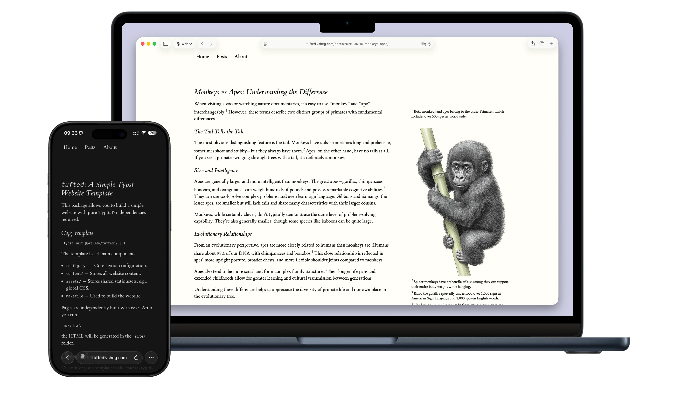

# TwilightPage

一个使用 Typst 实验性 HTML 导出功能构建的静态网站模板。除了基本的 `make` 外不需要任何外部依赖。

A static website template built using Typst's experimental HTML export. Requires no external dependencies other than basic `make`.



## 安装与使用 / Installation & Usage

从 Typst 包注册表初始化模板：

Initialize the template from the Typst package registry:

```shell
typst init @preview/twilightpage:0.1.1
```

要构建网站，运行：

To build the website, run:

```shell
make html
```

探索 `content/` 文件夹查看示例。

Explore the `content/` folder for examples.

## 链接 / Links

## 许可证 / License

源代码可在 [GitHub](https://github.com/CrossDark/twilightpage) 上获取，基于 [MIT 许可证](https://github.com/CrossDark/twilightpage/blob/main/LICENSE)。`template/` 目录中的模板使用更宽松的 [MIT-0](https://opensource.org/licenses/MIT-0) 许可证。

The source code is available on [GitHub](https://github.com/CrossDark/twilightpage) under the [MIT License](https://github.com/CrossDark/twilightpage/blob/main/LICENSE). The template in the `template/` directory uses the more permissive [MIT-0](https://opensource.org/licenses/MIT-0) license.
